# About Blocks (14)

About sections for company information and team introductions. Showcase mission statements, values, and organizational culture.

---

## about1

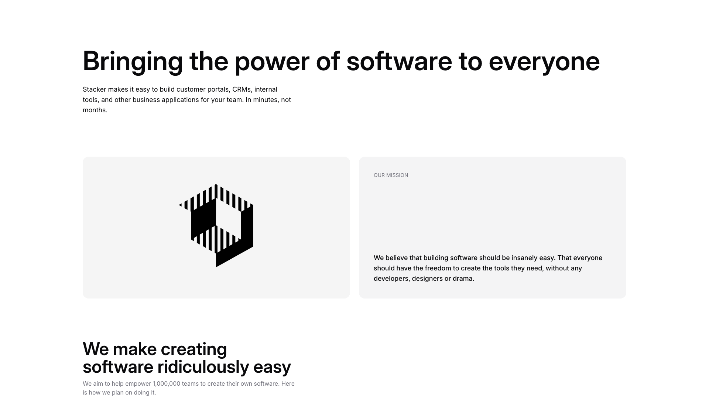

A webpage section contains a main heading at the top, followed by body text. Below this, content is arranged in two columns: the left column features a centered image, while the right column contains a label, a secondary heading, and body text. Further down, a large heading spans the full width, with smaller body text positioned beneath it.

**Install**: `pnpm dlx shadcn add @shadcnblocks/about1`

---

## about2

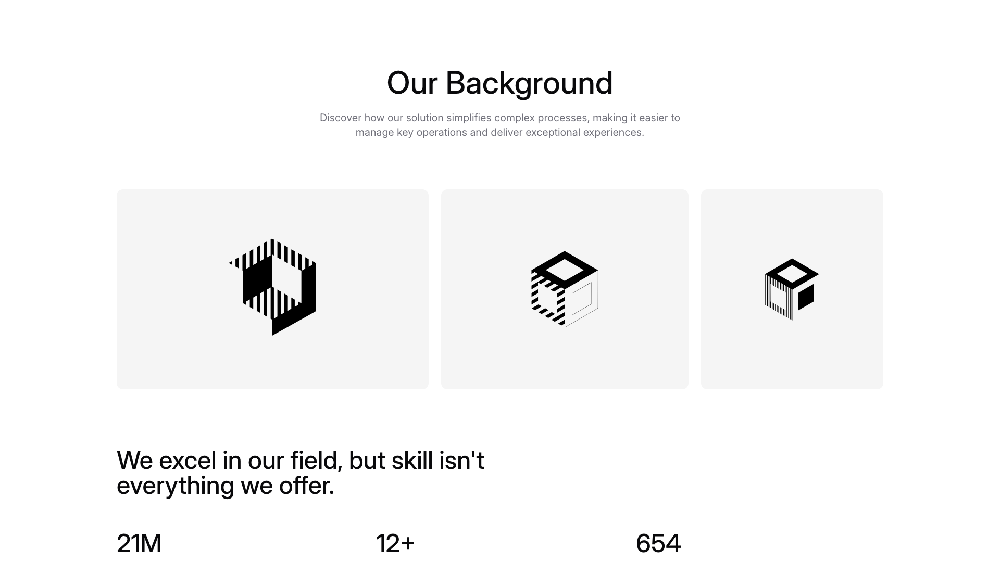

A centered section with a main heading and body text at the top, followed by three images arranged horizontally in a row. Below this, a larger heading is positioned on the left side, with three statistics (displayed as large numbers with labels) arranged horizontally beneath it.

**Install**: `pnpm dlx shadcn add @shadcnblocks/about2`

---

## about3

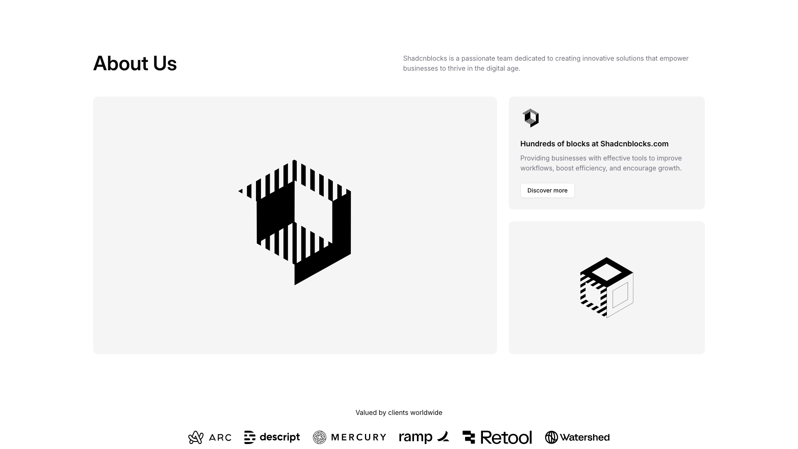

An "About Us" section displays content in a two-column layout. The left column features a large image centered vertically. The right column contains a heading, body text, and two stacked card components, each with an icon, heading, descriptive text, and a button. Below this section, a label sits above a horizontal row of client logos.

**Install**: `pnpm dlx shadcn add @shadcnblocks/about3`

---

## about4

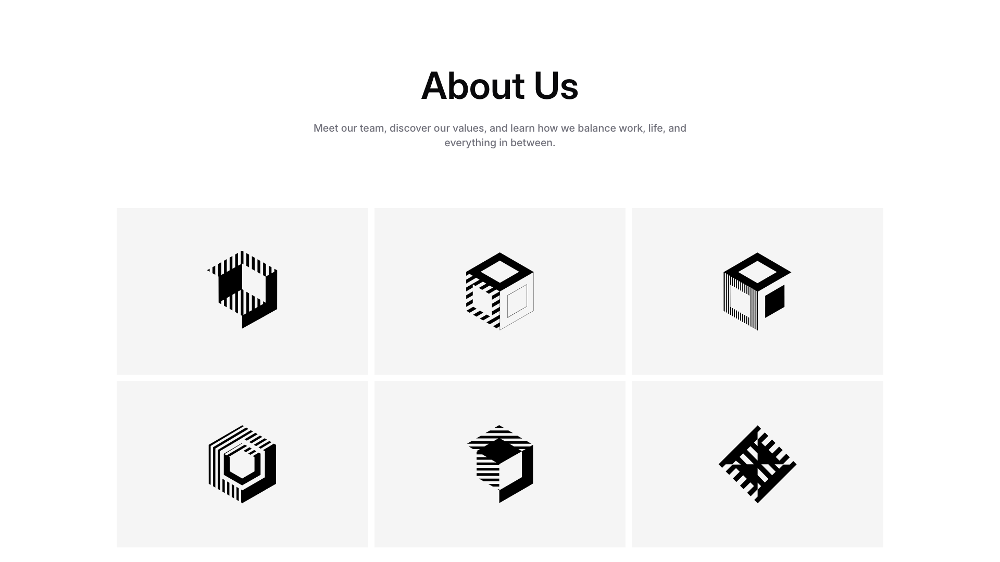

An "About Us" section features a centered heading and descriptive body text at the top. Below this, six images are arranged in a 3-column grid layout, displayed horizontally across two rows with equal spacing between each item.

**Install**: `pnpm dlx shadcn add @shadcnblocks/about4`

---

## about5

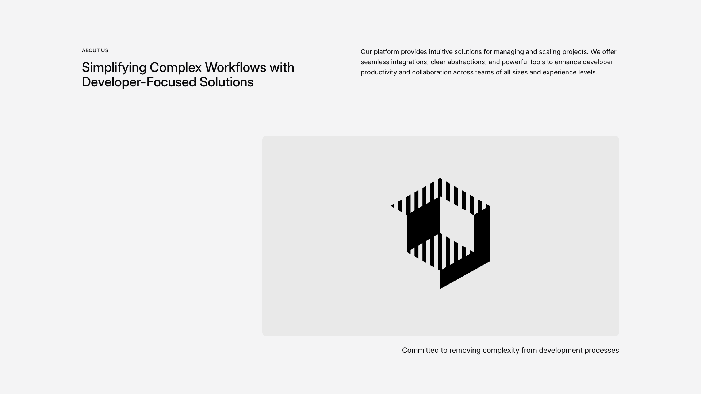

A webpage section is divided into two columns with a light gray background. The left column contains a small "ABOUT US" label, followed by a large heading and body text positioned vertically. The right column features a centered image, with a tagline positioned below it.

**Install**: `pnpm dlx shadcn add @shadcnblocks/about5`

---

## about6

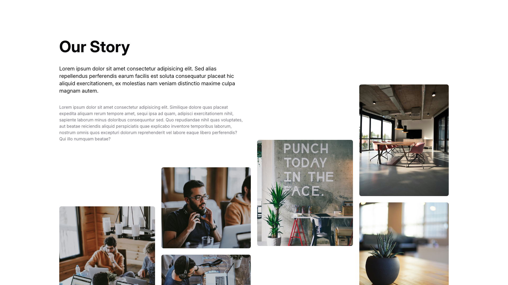

A two-column layout with text content positioned on the left and images arranged on the right. The left column contains a large heading, followed by two paragraphs of body text. The right side displays five images of varying sizes arranged in an asymmetrical grid pattern, with larger images at the top and smaller ones positioned below.

**Install**: `pnpm dlx shadcn add @shadcnblocks/about6`

---

## about7

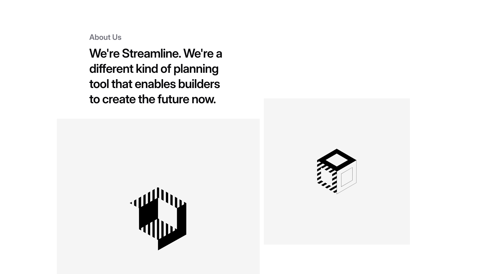

A two-column layout with text content on the left and images on the right. The left column contains a small label at the top, followed by a large heading and body text. The right column displays two images stacked vertically, positioned in the upper and lower portions of the column respectively.

**Install**: `pnpm dlx shadcn add @shadcnblocks/about7`

---

## about8

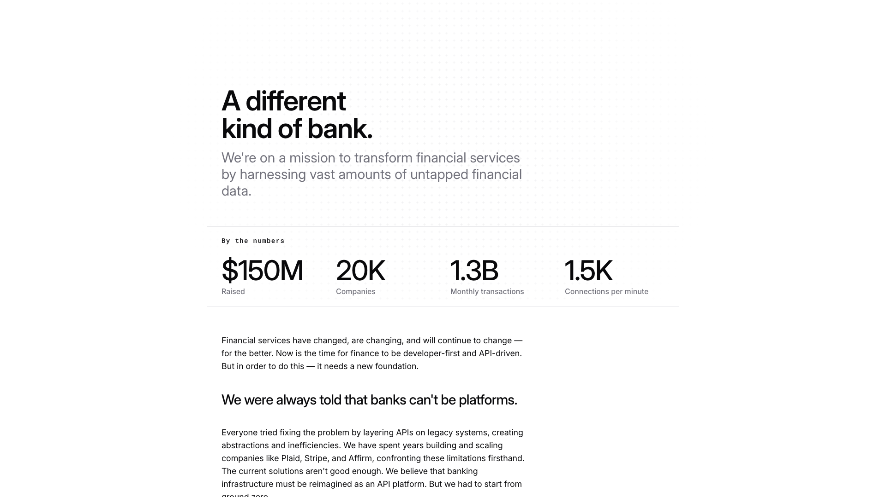

A centered webpage section displays a main heading at the top, followed by descriptive body text. Below this is a "By the numbers" label with four key metrics displayed horizontally in a row. Further down, additional body text is positioned centrally, followed by a large heading and more descriptive paragraphs arranged vertically.

**Install**: `pnpm dlx shadcn add @shadcnblocks/about8`

---

## about9

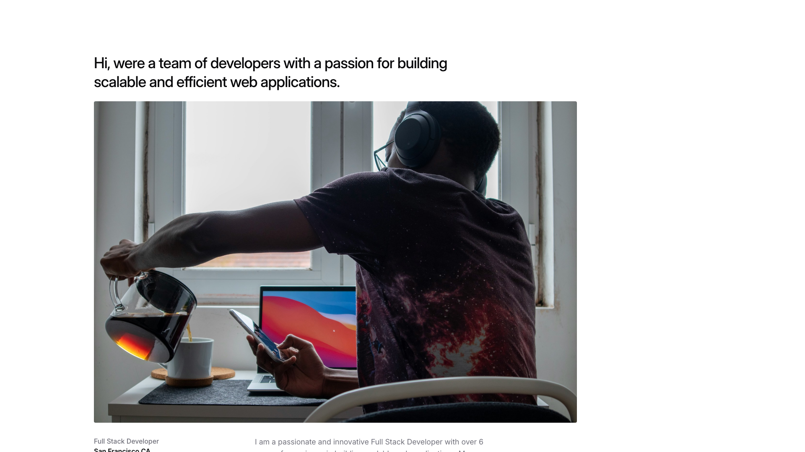

A webpage section displays a two-column layout with text content on the left and a large image on the right. The left side contains a main heading, followed by body text, with a job title label and location positioned at the bottom. The image spans the full height of the right column.

**Install**: `pnpm dlx shadcn add @shadcnblocks/about9`

---

## about10

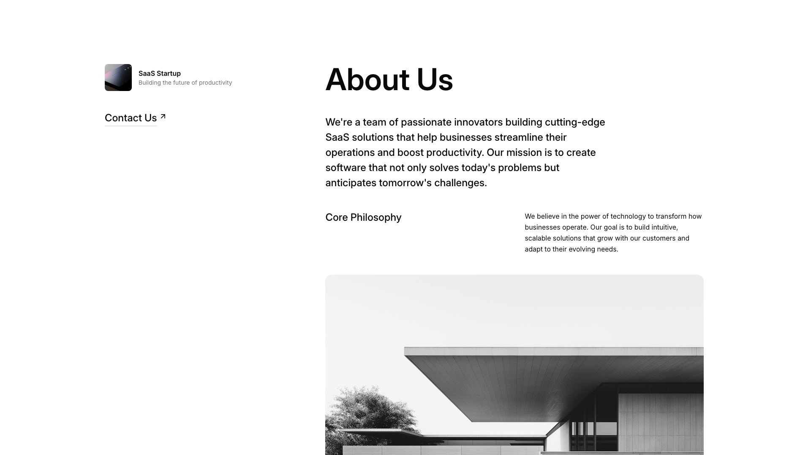

A two-column layout displays an "About Us" section. The left column contains a logo with a label, a "Contact Us" button, and a subheading. The right column features a large heading, body text describing the company, a "Core Philosophy" section with accompanying text, and a large image positioned below spanning the full width.

**Install**: `pnpm dlx shadcn add @shadcnblocks/about10`

---

## about13

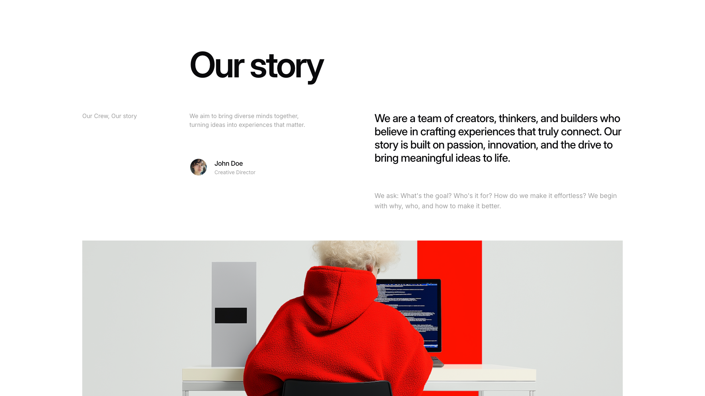

A webpage section displays a two-column layout with text content on the left and right, separated by a centered heading. The left column contains a small label, a subtitle, a team member profile with avatar and title, while the right column features a large body text block followed by additional descriptive text. Below both columns, a full-width image spans the bottom of the section.

**Install**: `pnpm dlx shadcn add @shadcnblocks/about13`

---

## about14

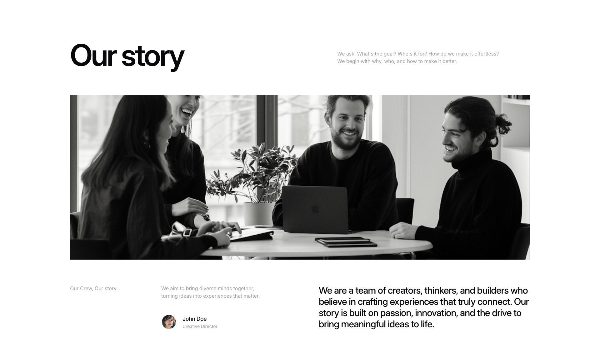

A webpage section features a large heading on the left, followed by a full-width image positioned centrally below. To the left of the image is a label and descriptive body text, with a team member profile (including an avatar and name) positioned underneath. On the right side, a larger body text block appears aligned to the right, describing the team's mission and values.

**Install**: `pnpm dlx shadcn add @shadcnblocks/about14`

---

## about15

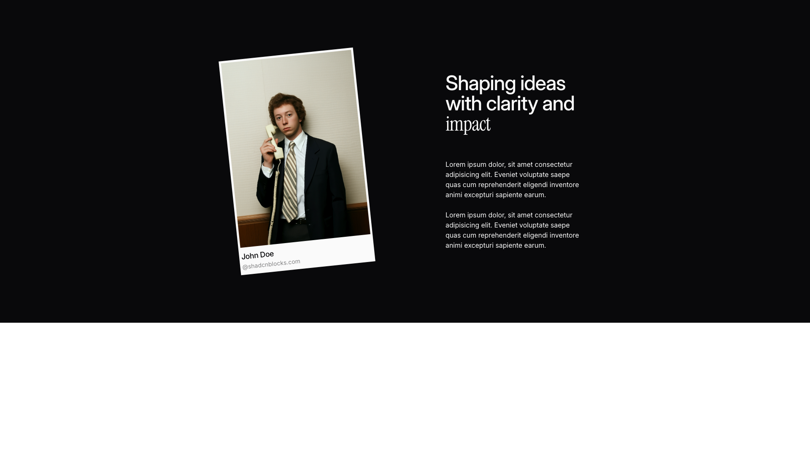

A dark background section is divided into two columns. On the left, a polaroid-style image is positioned vertically. On the right, a large heading is followed by two paragraphs of body text, all aligned to the left side of the column.

**Install**: `pnpm dlx shadcn add @shadcnblocks/about15`

---

## about16

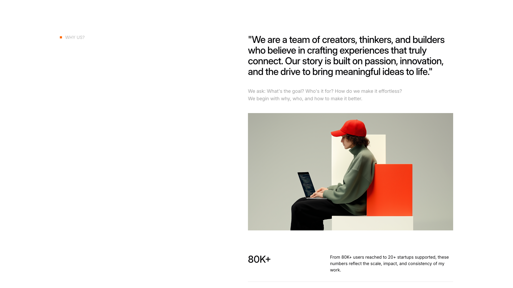

A webpage section is organized in two columns. The left column contains a small tag label at the top, followed by a large centered heading and body text below. The right column features a large image positioned at the top, with a statistics section below displaying a large number on the left and descriptive text on the right.

**Install**: `pnpm dlx shadcn add @shadcnblocks/about16`

---
