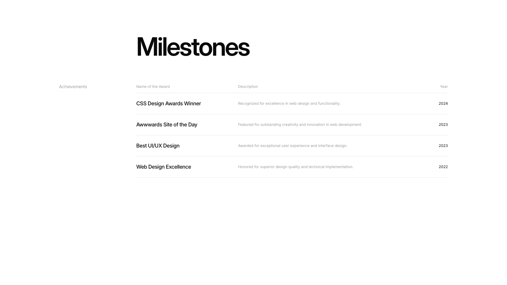
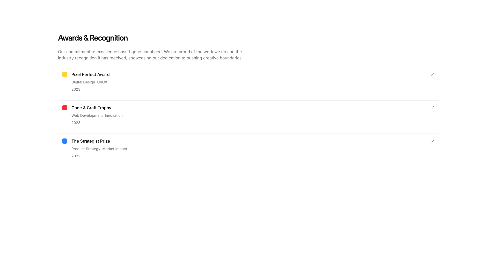
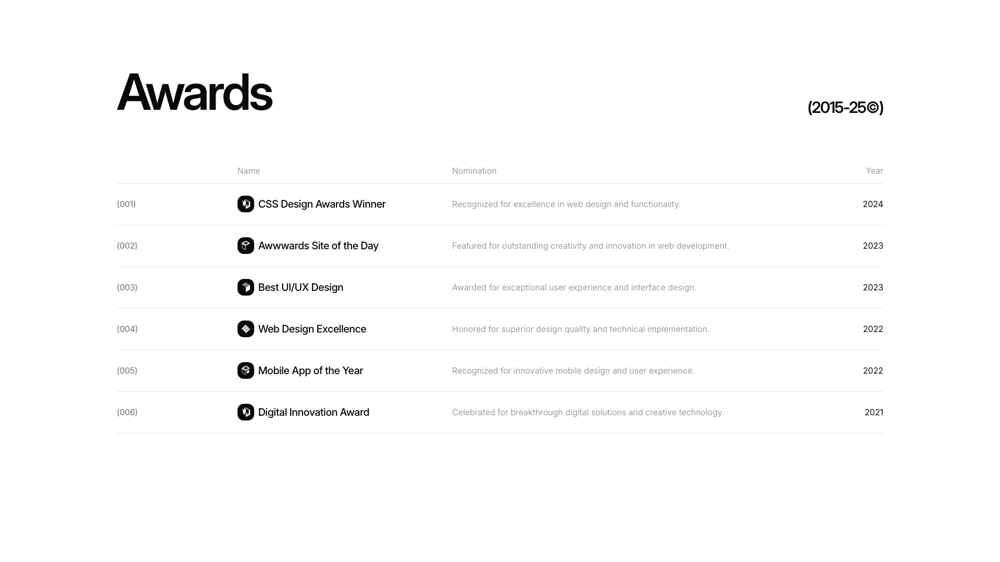

# Awards Blocks (4)

Awards and recognition sections highlighting achievements and accolades. Display industry honors and certifications.

---

## awards1

A section titled "Milestones" displays a table with four columns arranged horizontally: "Achievements," "Name of the Award," "Description," and "Year." Four rows of content are vertically stacked beneath the column headers, each containing award information with left-aligned text and right-aligned years ranging from 2022 to 2024.

**Install**: `pnpm dlx shadcn add @shadcnblocks/awards1`

---

## awards2

An awards section displays a vertically stacked list of award titles centered on the page. Each award entry is positioned horizontally, with the award name on the left and its corresponding year aligned to the right. The list contains nine award items arranged in chronological order from most recent to oldest.

**Install**: `pnpm dlx shadcn add @shadcnblocks/awards2`

---

## awards3

A vertically stacked list section displays three award entries. Each entry contains a colored circular icon on the left, followed by a main heading, descriptive labels, and a year, aligned to the left. On the far right of each entry, a small icon button is positioned. The entries are separated by subtle horizontal dividers.

**Install**: `pnpm dlx shadcn add @shadcnblocks/awards3`

---

## awards4

A table layout displays award information organized in four columns: a numbered label on the left, an award name with an icon, a descriptive nomination text in the center, and a year on the right. Six rows of award entries are vertically stacked, each containing consistent column alignment. A main heading "Awards" is positioned at the top left, with a date range label aligned to the top right.

**Install**: `pnpm dlx shadcn add @shadcnblocks/awards4`

---
