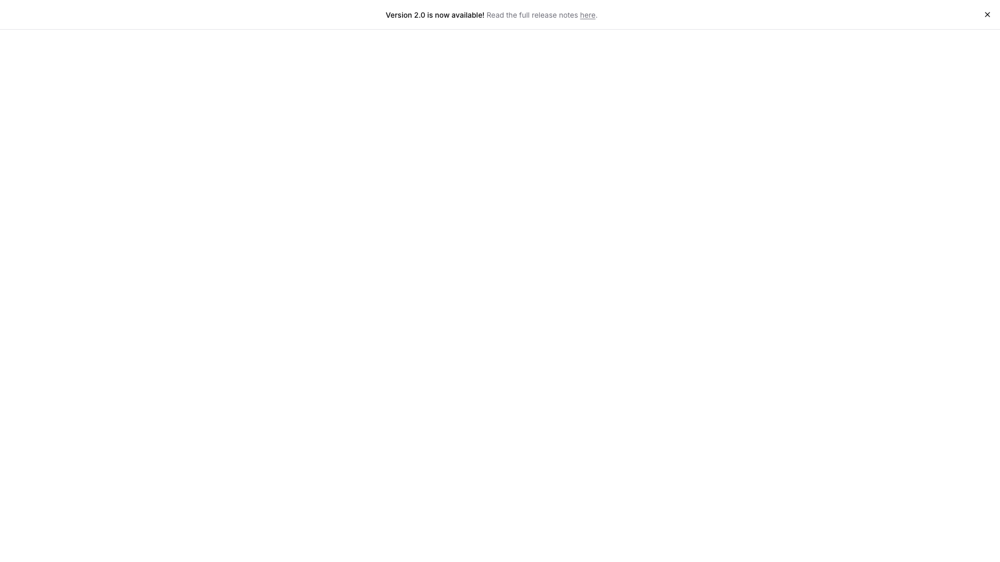
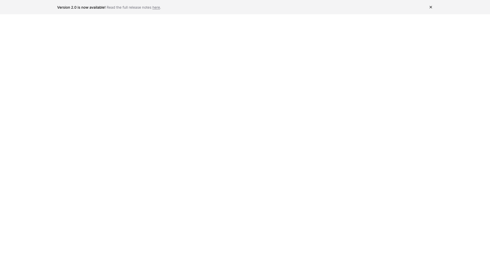
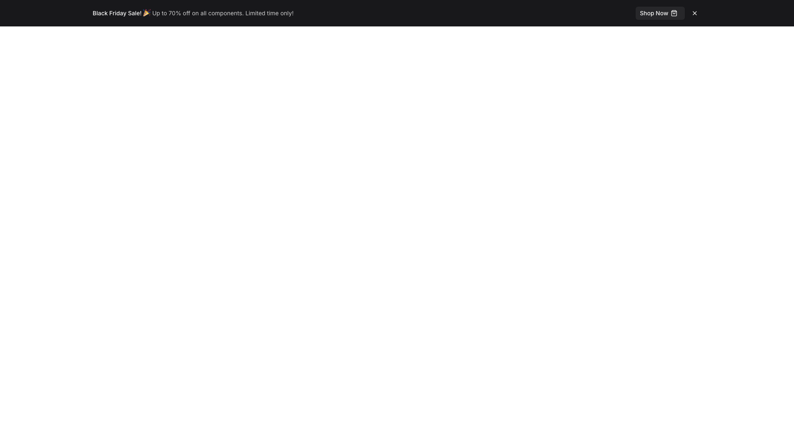
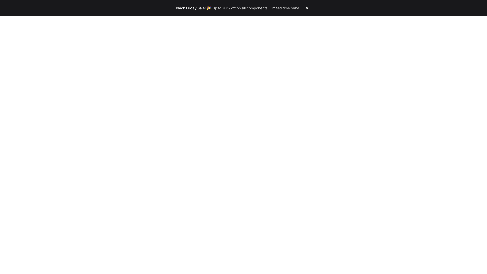
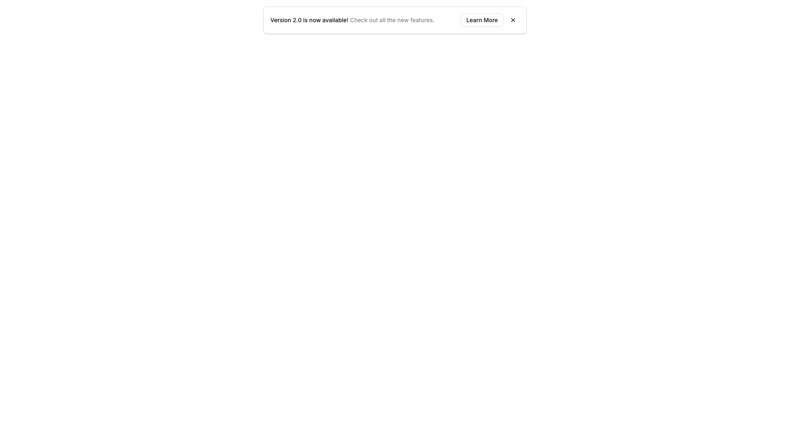
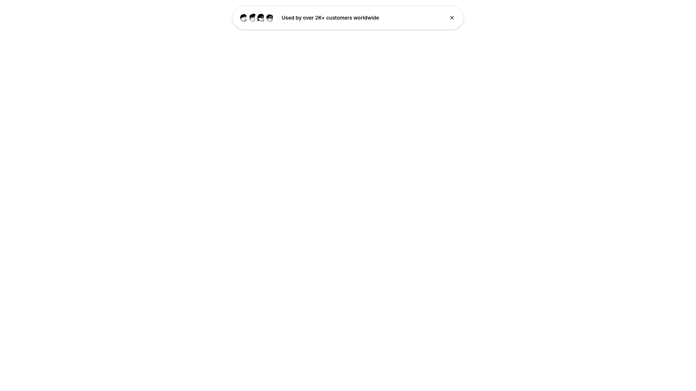
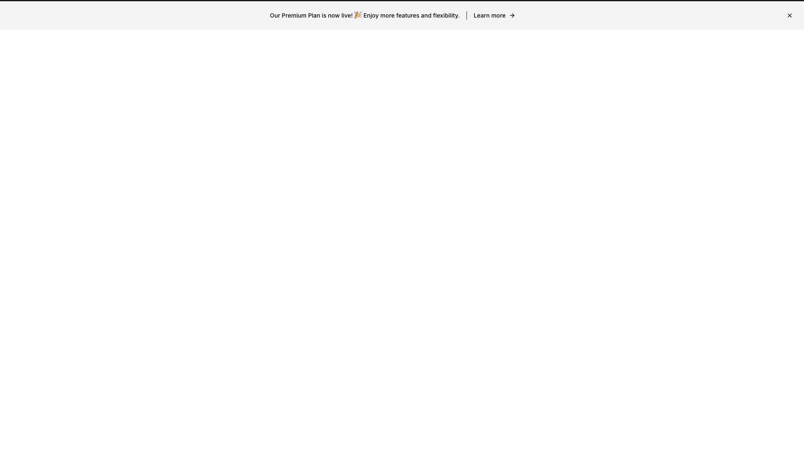

# Banner Blocks (7)

Announcement banners and notification bars for important messages. Ideal for promotions, updates, and urgent communications.

---

## banner1

A banner notification is positioned at the top of the page, horizontally centered. It contains a heading announcing a new version release, followed by a link to read full release notes, with a close button positioned on the right side of the banner.

**Install**: `pnpm dlx shadcn add @shadcnblocks/banner1`

---

## banner2

A notification banner is positioned at the top of the page, spanning horizontally across the full width. The banner contains a heading on the left side, followed by body text with an embedded link, and a close button aligned to the right.

**Install**: `pnpm dlx shadcn add @shadcnblocks/banner2`

---

## banner3

A horizontal banner spans the full width at the top of the page with a dark background. On the left side, a heading and promotional text are positioned, while a "Shop Now" button and close icon are aligned to the right. The rest of the page appears to be a blank, light-colored content area.

**Install**: `pnpm dlx shadcn add @shadcnblocks/banner3`

---

## banner4

A banner is positioned at the top of the page with centered text announcing a promotional offer. The banner contains a heading, descriptive body text, and a close button aligned to the right side.

**Install**: `pnpm dlx shadcn add @shadcnblocks/banner4`

---

## banner5

A notification banner is centered horizontally at the top of the page. It contains a heading followed by body text on the left, with a "Learn More" button and a close icon positioned on the right side of the banner.

**Install**: `pnpm dlx shadcn add @shadcnblocks/banner5`

---

## banner6

A banner is positioned at the top center of the page, containing an image on the left, followed by body text reading "Used by over 2K+ customers worldwide" in the center, and a close button on the right.

**Install**: `pnpm dlx shadcn add @shadcnblocks/banner6`

---

## banner7

A horizontal banner is positioned at the top of the page and spans the full width. The banner contains centered body text with an embedded link labeled "Learn more" on the right side, along with a close button positioned at the far right edge.

**Install**: `pnpm dlx shadcn add @shadcnblocks/banner7`

---
