# Blog Blocks (22)

Blog post layouts and article grids for content publishing. Perfect for news sections and content marketing.

---

## blog1

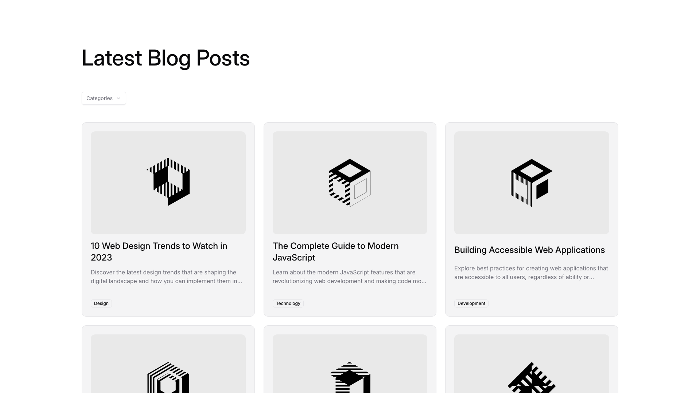

A blog section displays a grid layout with six blog post cards arranged in two rows of three columns. Each card contains a centered image at the top, followed by a heading, body text, and a category label positioned at the bottom. Above the grid, a heading and a dropdown menu button are aligned on the left.

**Install**: `pnpm dlx shadcn add @shadcnblocks/blog1`

---

## blog4

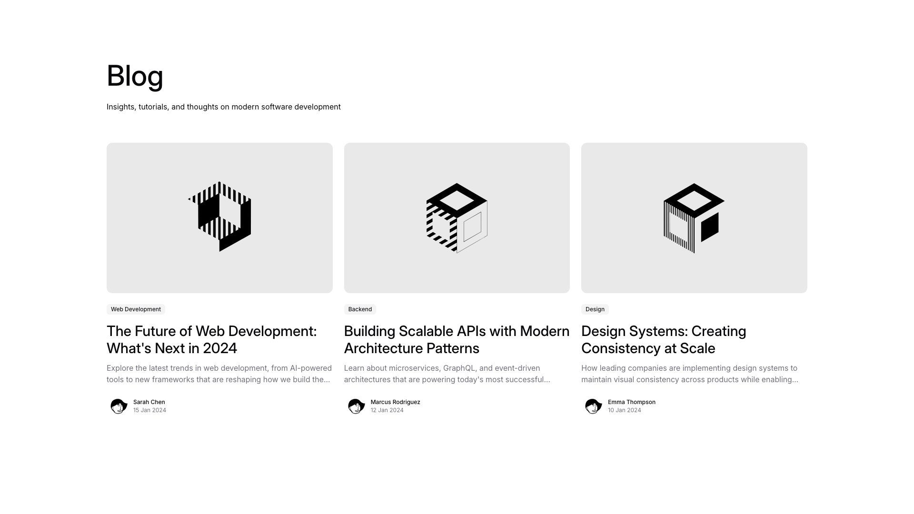

A blog section displays three equally-sized cards arranged horizontally. Each card contains an image centered at the top, followed by a category label, a heading, brief body text, and author information with a date positioned at the bottom. The entire section is preceded by a main heading and subtitle at the top.

**Install**: `pnpm dlx shadcn add @shadcnblocks/blog4`

---

## blog5

A blog landing page displays a grid of three article cards arranged horizontally. Each card contains a centered image at the top, followed by a category label, a heading, body text preview, and author information with a date positioned at the bottom. The section is preceded by a main heading and subheading at the top of the page.

**Install**: `pnpm dlx shadcn add @shadcnblocks/blog5`

---

## blog6

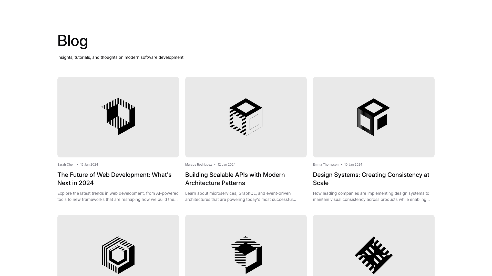

A blog landing page displays a grid of six blog post cards arranged in two rows of three columns. Each card contains an image at the top, followed by the author name and date positioned on the left, a heading centered below, and truncated body text at the bottom. A tagline describing the blog's focus appears centered near the top of the page.

**Install**: `pnpm dlx shadcn add @shadcnblocks/blog6`

---

## blog7

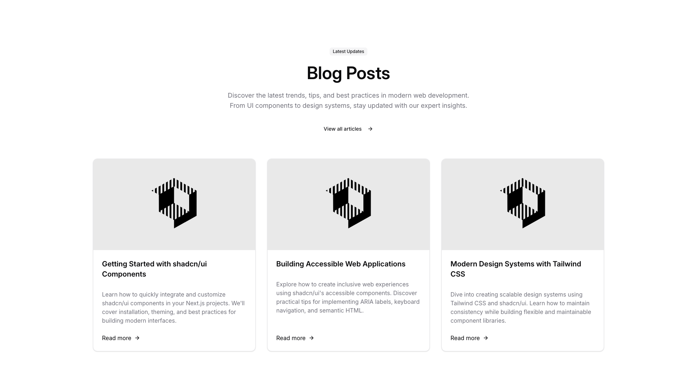

A centered section displays a label at the top, followed by a large heading and body text describing blog content. Below this introductory text is a "View all articles" link. Three card components are arranged horizontally below, each containing an image at the top, a heading, descriptive body text, and a "Read more" link at the bottom.

**Install**: `pnpm dlx shadcn add @shadcnblocks/blog7`

---

## blog8

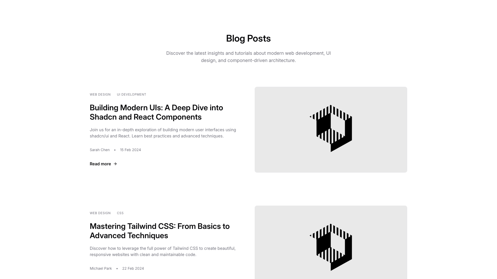

A blog posts section displays content in a two-column layout repeated vertically. Each row contains text content on the left side—including category labels, a heading, body text, author name, date, and a "Read more" link—with an image positioned on the right side. The section is preceded by a centered heading and descriptive body text at the top.

**Install**: `pnpm dlx shadcn add @shadcnblocks/blog8`

---

## blog11

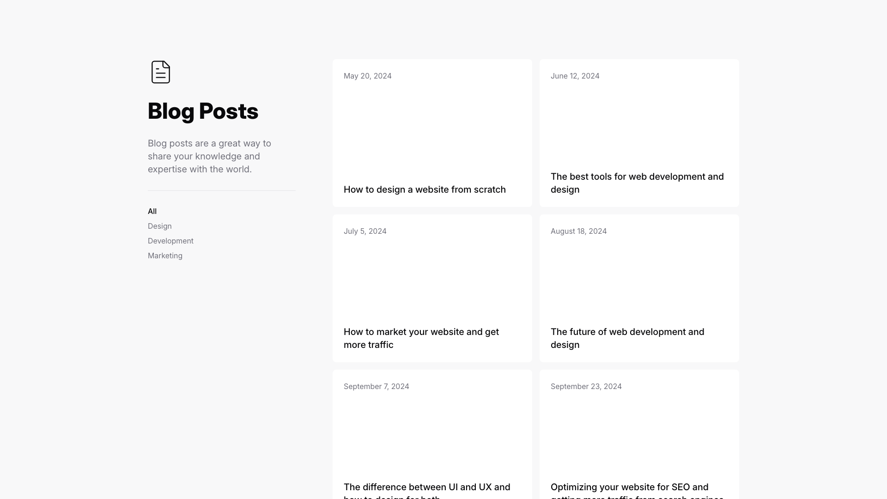

A blog posts section displays content in a two-column layout. On the left side, there is a heading, descriptive body text, and a vertical list of category filters. The right side features a grid of blog post cards arranged in two columns, each containing a date label at the top and a post title below.

**Install**: `pnpm dlx shadcn add @shadcnblocks/blog11`

---

## blog12

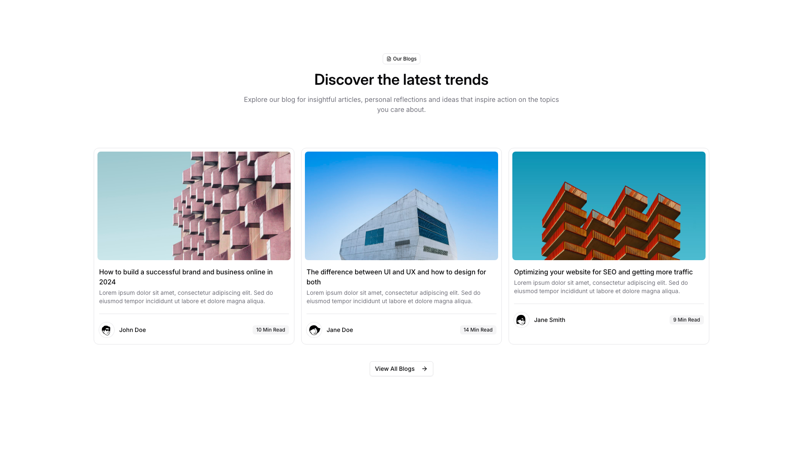

A centered section displays a heading and descriptive body text at the top. Below, three blog cards are arranged horizontally, each containing an image, a title, body text, and footer information with an author avatar and read time on the bottom. A "View All Blogs" button with an arrow is centered below the cards.

**Install**: `pnpm dlx shadcn add @shadcnblocks/blog12`

---

## blog13

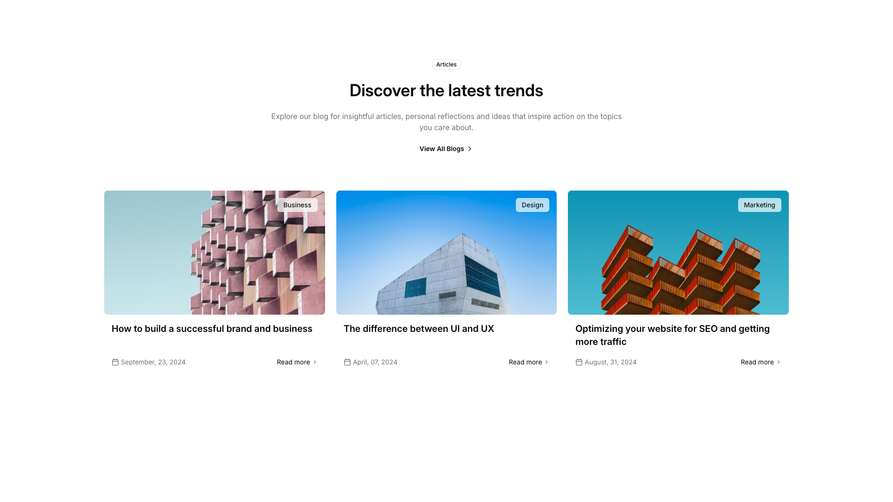

A centered section displays a heading and descriptive body text at the top, followed by a "View All Blogs" link. Below this, three article cards are arranged horizontally in a row, each containing an image, a category label in the top right, a title, a date, and a "Read more" link positioned at the bottom.

**Install**: `pnpm dlx shadcn add @shadcnblocks/blog13`

---

## blog14

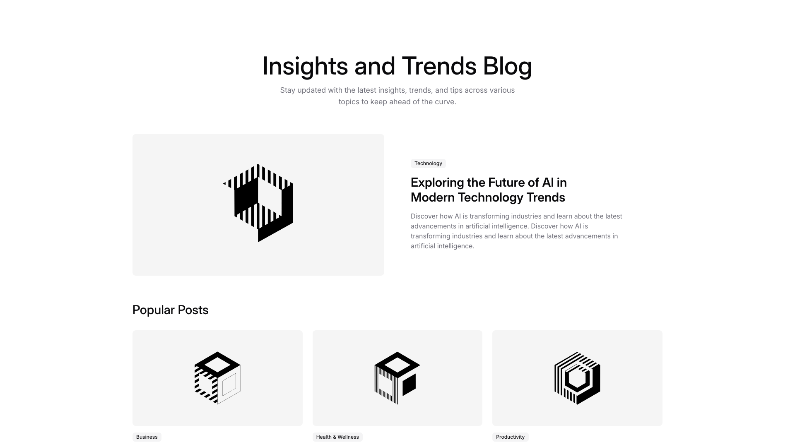

A webpage displays a centered heading and descriptive body text at the top. Below, a featured blog post section spans horizontally with an image on the left and text content on the right, including a category label, heading, and body text. Further down, a "Popular Posts" section shows three equal-width columns arranged horizontally, each containing an image centered above a category label.

**Install**: `pnpm dlx shadcn add @shadcnblocks/blog14`

---

## blog16

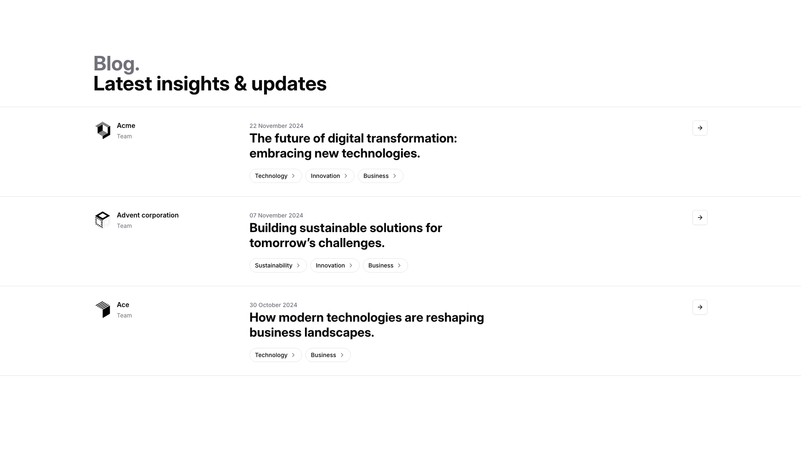

A vertically stacked list of three blog post entries. Each entry is organized horizontally with an image on the left, followed by a text column containing a company label, date, main heading, and category tags. A right-aligned arrow button appears at the end of each row for navigation.

**Install**: `pnpm dlx shadcn add @shadcnblocks/blog16`

---

## blog17

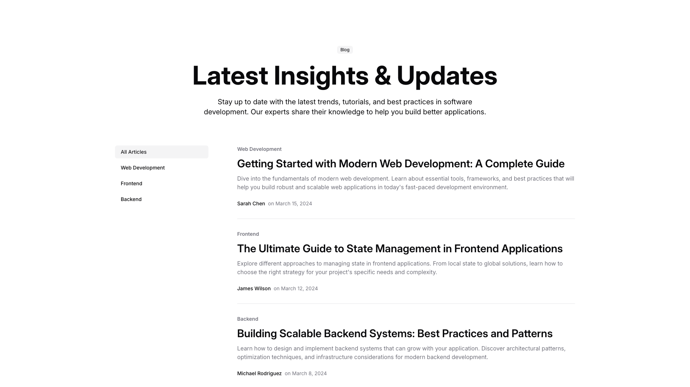

A blog page displays content in two columns with a centered header section at the top. The left column contains a vertical navigation menu with category filters, while the right column shows a series of article cards stacked vertically. Each article card includes a category label, a heading, body text, and author information with a publication date positioned at the bottom.

**Install**: `pnpm dlx shadcn add @shadcnblocks/blog17`

---

## blog19

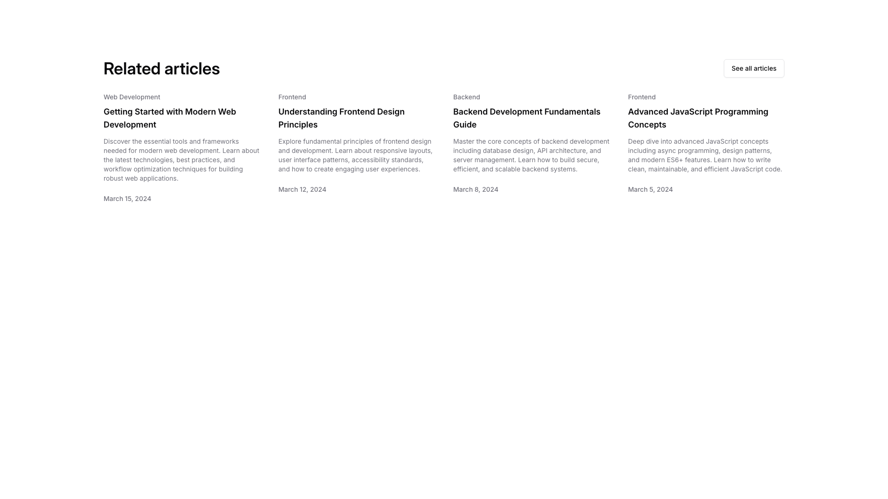

A "Related articles" section displays four article cards arranged horizontally in a single row. Each card contains a category label at the top, followed by a heading, descriptive body text, and a date at the bottom. A "See all articles" link is positioned in the top right corner of the section.

**Install**: `pnpm dlx shadcn add @shadcnblocks/blog19`

---

## blog21

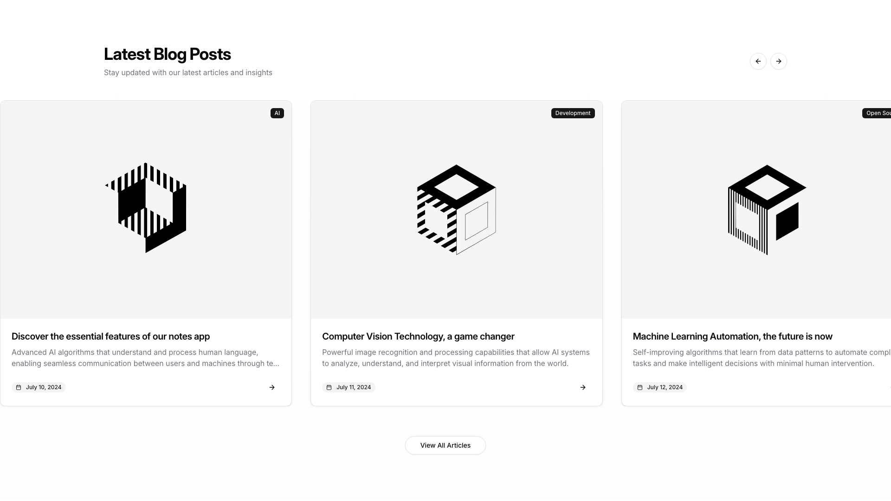

A section titled "Latest Blog Posts" with descriptive subtitle text is followed by three horizontally-aligned cards arranged in columns. Each card contains an image centered at the top, a category label in the upper right, a heading, body text, and a date with an arrow link at the bottom. Navigation arrows appear in the top right corner, and a "View All Articles" button is centered below the cards.

**Install**: `pnpm dlx shadcn add @shadcnblocks/blog21`

---

## blog22

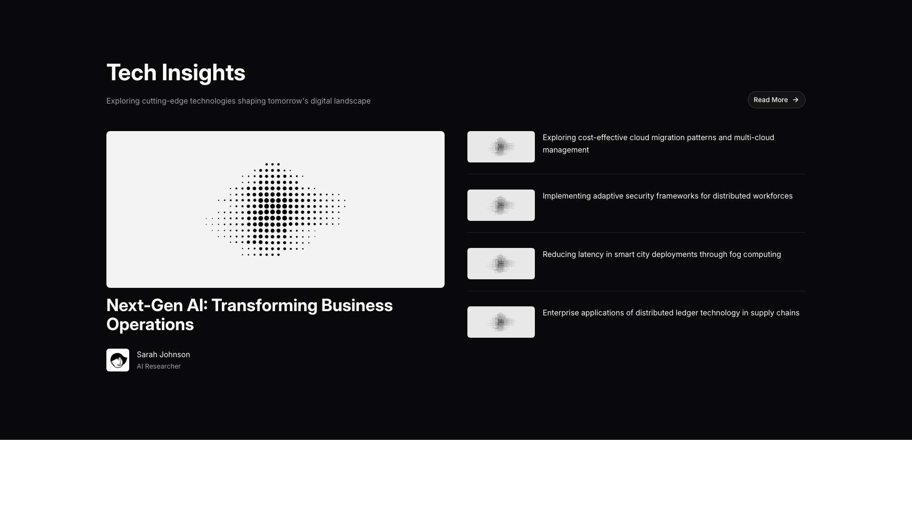

A page section displays content in two columns. The left column contains a main heading, descriptive body text, a large image, and an author attribution with a small profile icon. The right column is vertically stacked with a section heading at the top, followed by four content items arranged in a list, each containing a small image thumbnail and accompanying text. A "Read More" button is positioned in the top right corner.

**Install**: `pnpm dlx shadcn add @shadcnblocks/blog22`

---

## blog23

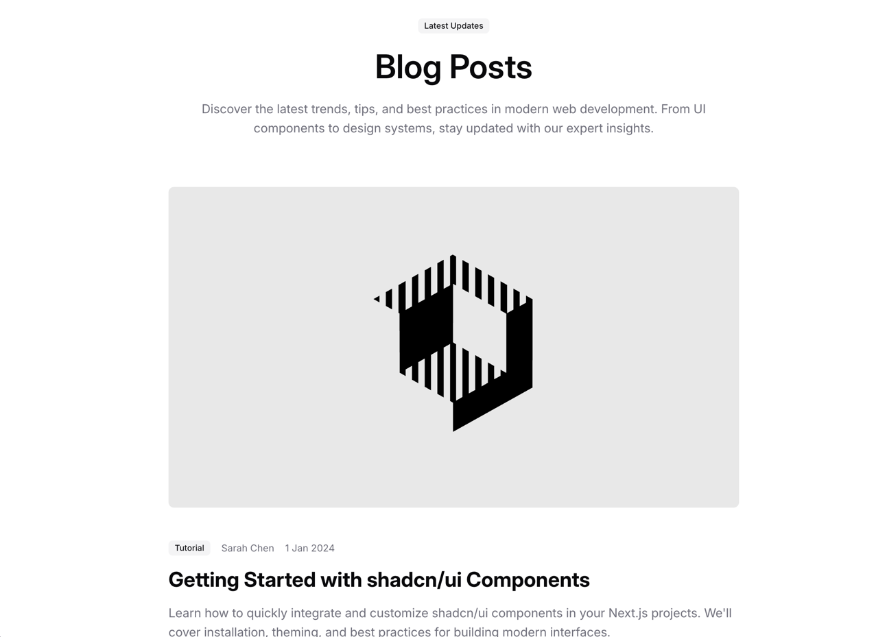

A vertically stacked layout centers content on the page. At the top, a small label precedes a large heading and descriptive body text. Below, a large image is centered, followed by metadata labels (category tag, author name, and date) positioned on the left. At the bottom, a prominent heading is followed by additional body text describing the content.

**Install**: `pnpm dlx shadcn add @shadcnblocks/blog23`

---

## blog24

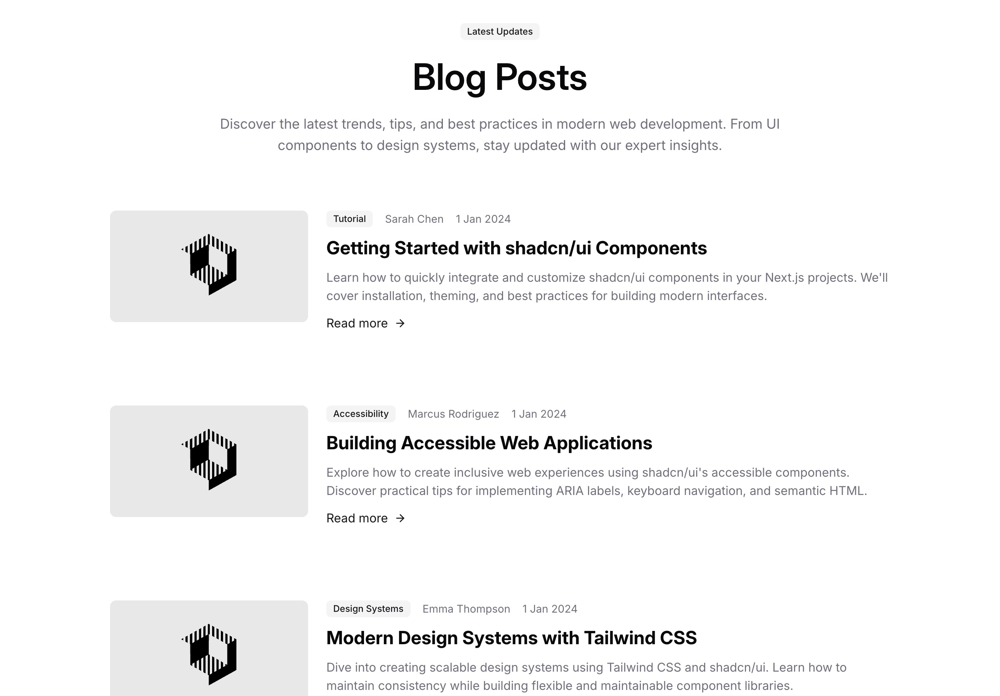

A blog posts section displays three vertically stacked articles, each with a consistent two-column layout. On the left side of each article is an image, while the right side contains a category label, author name, date, heading, descriptive body text, and a "Read more" link positioned horizontally.

**Install**: `pnpm dlx shadcn add @shadcnblocks/blog24`

---

## blog26

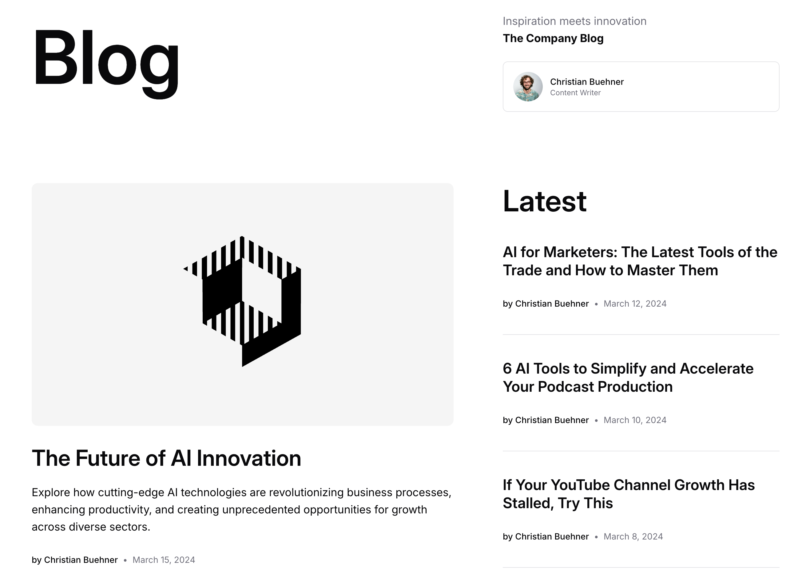

A blog page layout with two main columns: the left column features a large image centered above a heading and descriptive body text with byline and date information. The right column displays a sidebar containing an author profile at the top, followed by a "Latest" section with three stacked article cards, each with a title, byline, and date.

**Install**: `pnpm dlx shadcn add @shadcnblocks/blog26`

---

## blog27

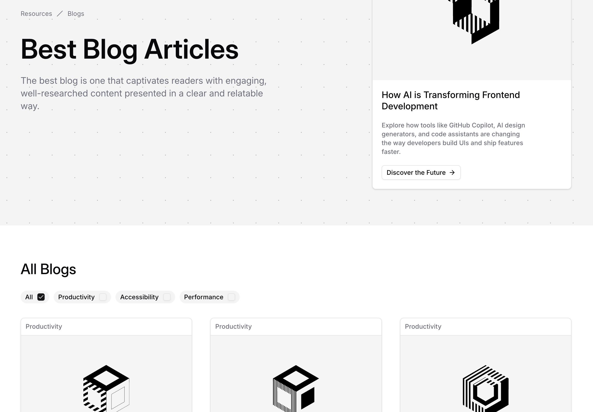

A webpage section displays a two-column layout. The left column contains a main heading, descriptive body text, and navigation breadcrumbs at the top. The right column features a featured article card with a heading, body text, a call-to-action button, and an image positioned above the text. Below this, a "All Blogs" section displays multiple card items arranged horizontally in rows, each containing a label and an image.

**Install**: `pnpm dlx shadcn add @shadcnblocks/blog27`

---

## blog28

A blog homepage displays a featured article on the left with a large image, heading, date, author name, and descriptive body text. To the right, a grid of four smaller article cards is arranged in two columns and two rows, each containing an image, date, author name, and article title.

**Install**: `pnpm dlx shadcn add @shadcnblocks/blog28`

---

## blog29

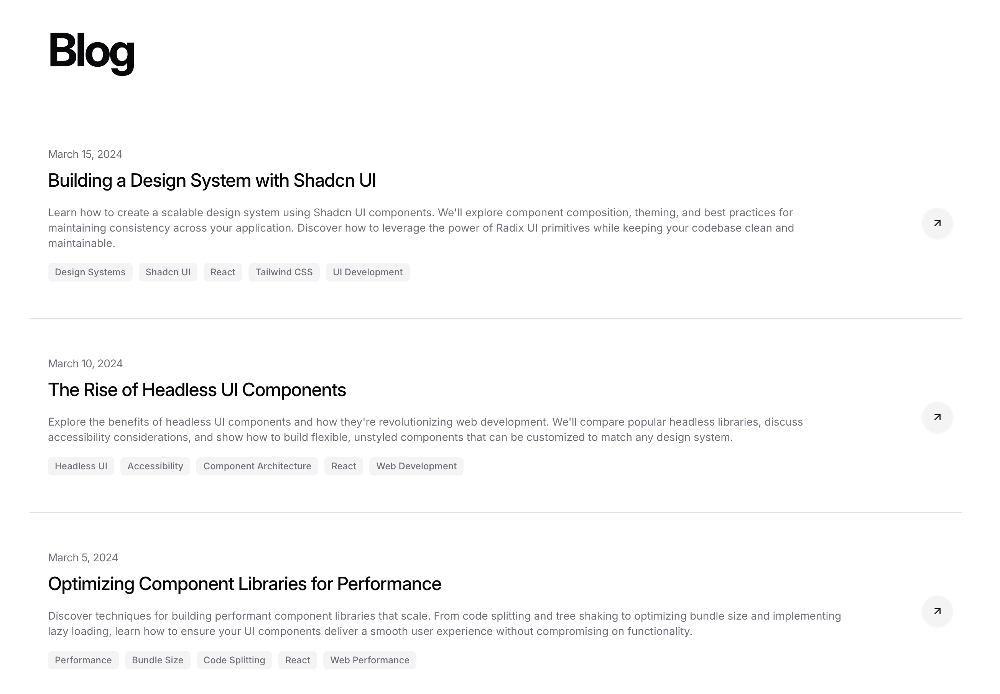

A vertically stacked blog feed displays three article entries. Each entry contains a date label at the top, followed by a large heading, descriptive body text, and a series of topic tags arranged horizontally at the bottom. A small icon button is positioned on the right side of each entry.

**Install**: `pnpm dlx shadcn add @shadcnblocks/blog29`

---

## blog30

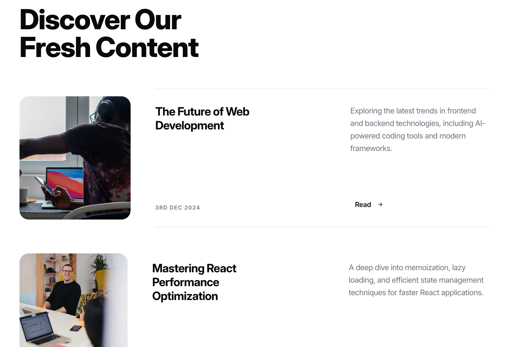

A content discovery section with a bold heading at the top left. Below are two horizontally stacked content cards, each displaying an image on the left, a title and descriptive body text on the right, with a date label and "Read" link aligned to the bottom right of each card.

**Install**: `pnpm dlx shadcn add @shadcnblocks/blog30`

---
