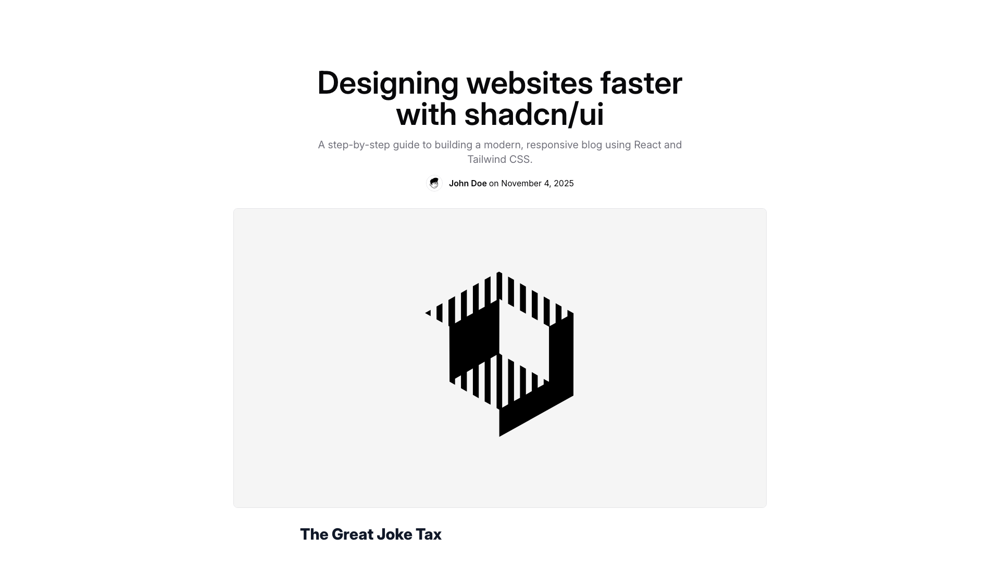
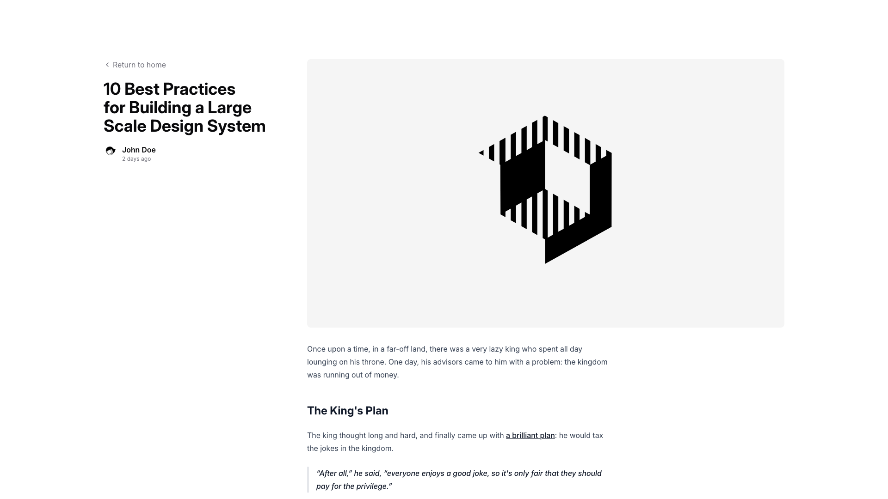
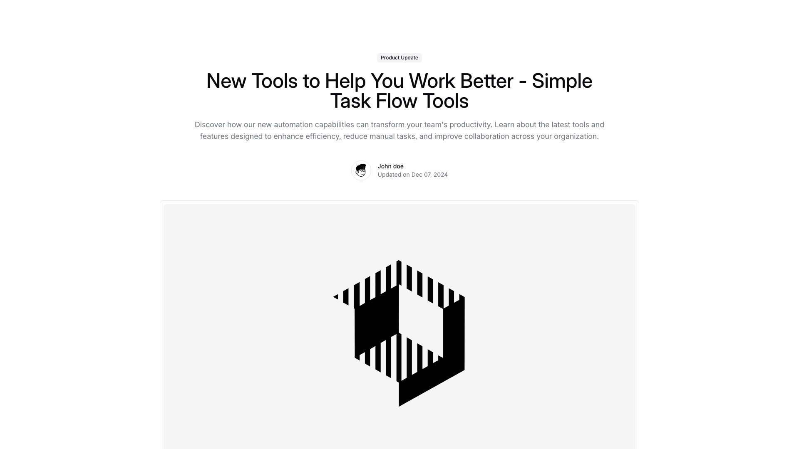
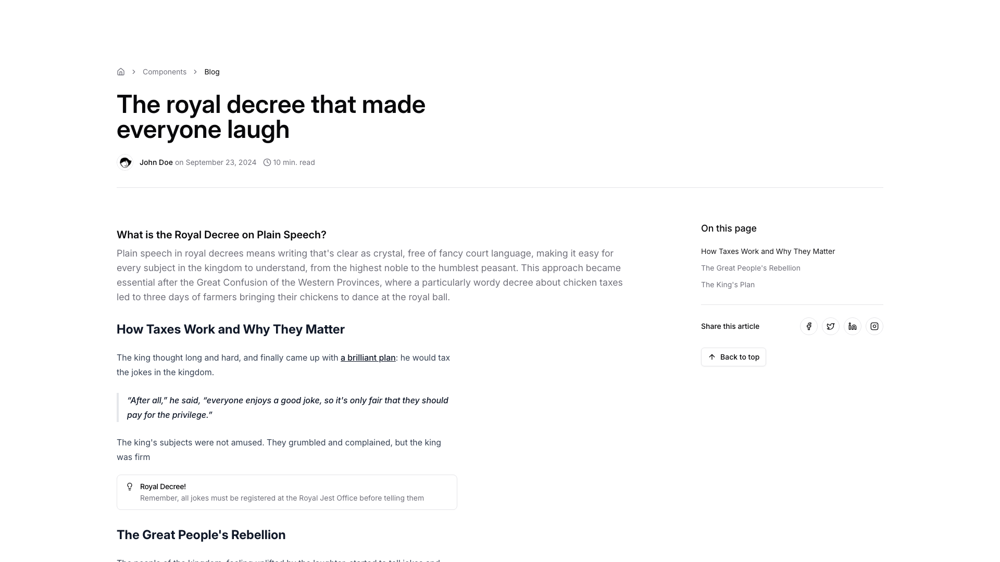
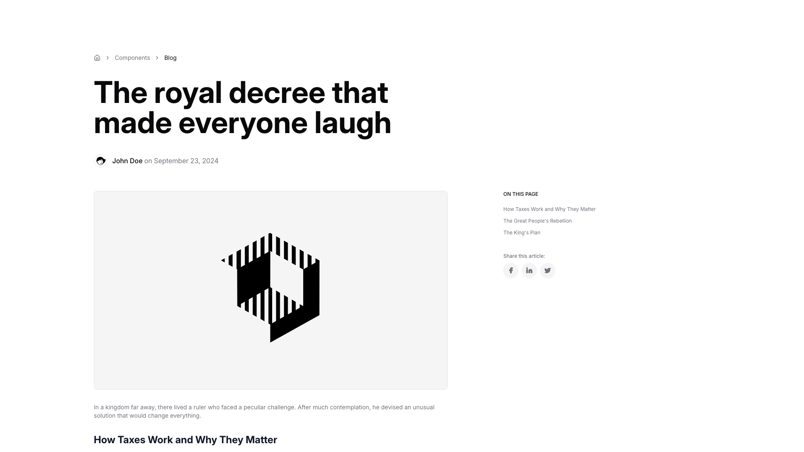
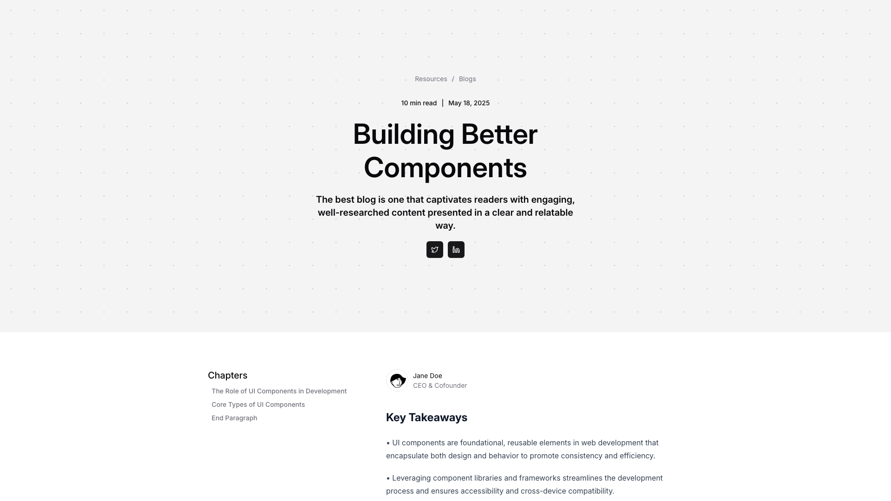

# Blogpost Blocks (6)

Individual blog post layouts with rich typography and media support. Optimized for long-form content and readability.

---

## blogpost1

A centered webpage layout displays a main heading at the top, followed by descriptive body text and author information. Below this is a large image positioned centrally, with a secondary heading placed underneath.

**Install**: `pnpm dlx shadcn add @shadcnblocks/blogpost1`

---

## blogpost2

A webpage layout displays content in two columns with a left-aligned text section and a right-aligned image area. The left column contains a back button link, a large main heading, author information with a timestamp, and body text with an embedded link. Below this is a subheading followed by additional body text and a block quote. The right column features a centered image occupying the upper portion of the layout.

**Install**: `pnpm dlx shadcn add @shadcnblocks/blogpost2`

---

## blogpost3

A centered layout displays a product update section with a small tag at the top. Below that is a large main heading followed by body text describing features and benefits. An author profile with an avatar, name, and date appears horizontally centered beneath the descriptive text. A large image is positioned below, taking up most of the remaining vertical space.

**Install**: `pnpm dlx shadcn add @shadcnblocks/blogpost3`

---

## blogpost4

A blog article layout with a two-column structure. The left column contains the main content including a headline, author byline with date and read time, section headings, body text, and quoted passages. The right column displays a sidebar with "On this page" navigation links and sharing buttons positioned below the main content area.

**Install**: `pnpm dlx shadcn add @shadcnblocks/blogpost4`

---

## blogpost5

A blog post layout with two columns. The left column contains a breadcrumb navigation at the top, followed by a large heading, author and date information, a centered image, body text, and a subheading. The right column displays a sidebar with an "ON THIS PAGE" section listing related links and social sharing buttons below.

**Install**: `pnpm dlx shadcn add @shadcnblocks/blogpost5`

---

## blogpost6

A blog article page with content centered vertically. At the top is a navigation breadcrumb, followed by a reading time indicator and publication date. The main heading is centered, with supporting body text below. Two icon buttons are positioned horizontally beneath the text. Further down, a two-column layout displays chapter links on the left and author information with key takeaways on the right.

**Install**: `pnpm dlx shadcn add @shadcnblocks/blogpost6`

---
