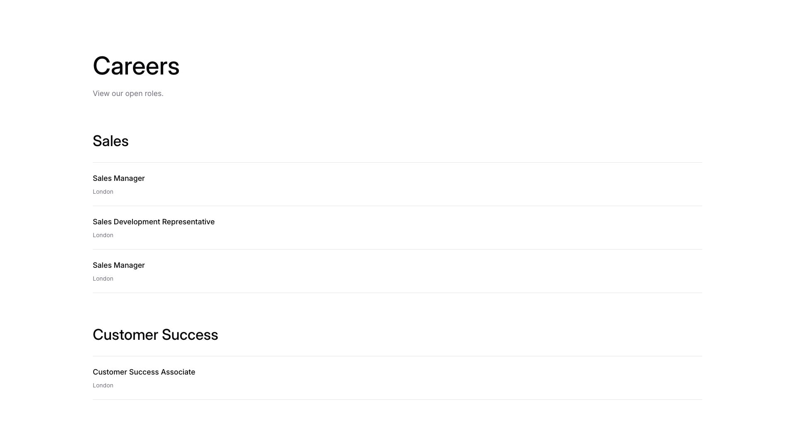
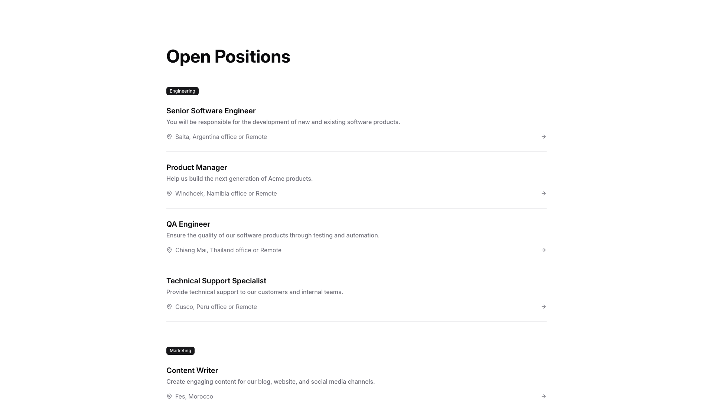
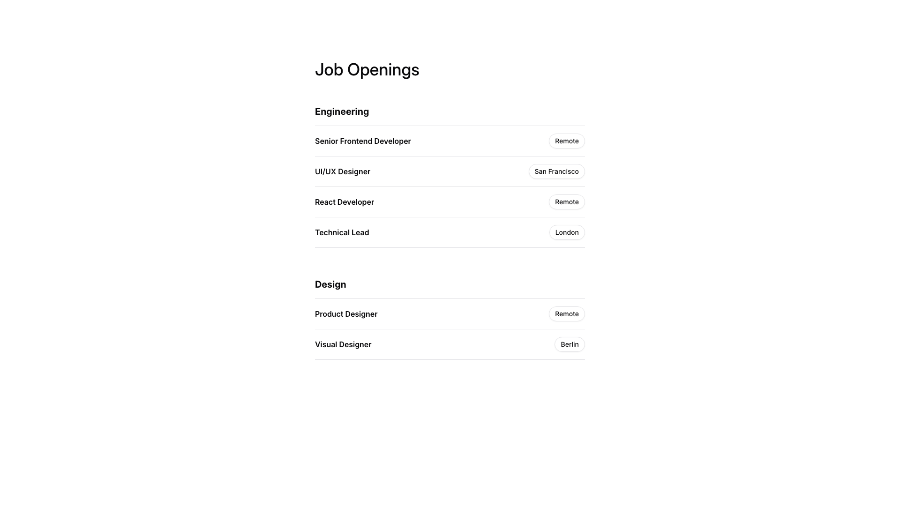
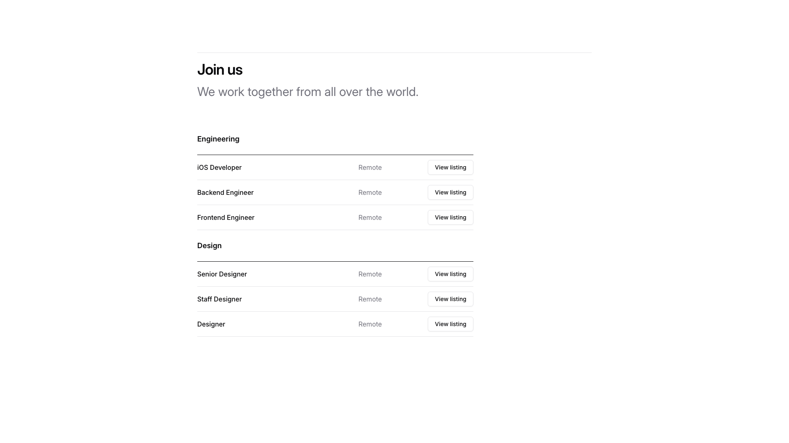
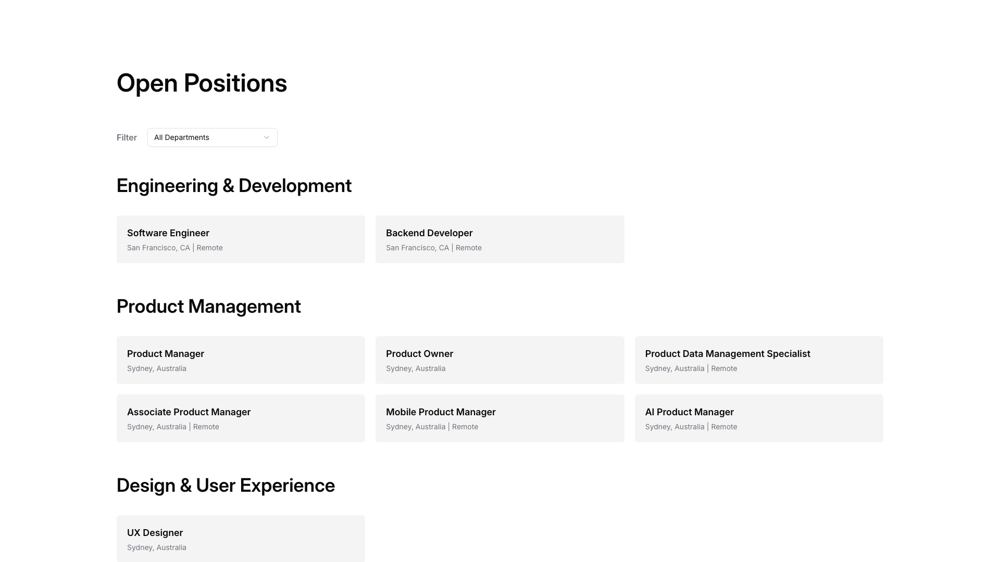
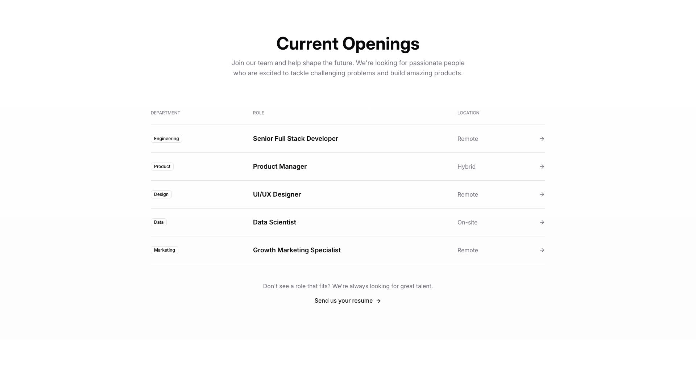

# Careers Blocks (9)

Career pages and job listing sections for recruitment. Feature open positions, company culture, and application forms.

---

## careers1

A careers page displays job listings organized in two vertically stacked sections. The top section contains a main heading with descriptive body text, followed by three job postings arranged vertically, each with a job title and location label. Below this is a second section with a heading and a single job listing in the same format.

**Install**: `pnpm dlx shadcn add @shadcnblocks/careers1`

---

## careers2

A vertically stacked job listings page displays a centered heading "Openings at Acme" with supporting body text below. Each job listing is organized horizontally with the job title on the left, followed by three centered labels indicating employment details, and an "Apply" button positioned on the right. The layout repeats this structure for multiple job openings.

**Install**: `pnpm dlx shadcn add @shadcnblocks/careers2`

---

## careers3

A vertically stacked list of job postings organized into two sections with category labels. Each posting contains a bold job title, descriptive body text, a location with an icon, and an arrow button aligned to the right. The postings are separated by horizontal dividers, creating a clean columnar layout with left-aligned text and right-aligned navigation elements.

**Install**: `pnpm dlx shadcn add @shadcnblocks/careers3`

---

## careers4

A vertically stacked list displays job openings organized into two category sections. Each section has a bold heading, followed by multiple job listings arranged in rows with the job title on the left and location information aligned to the right.

**Install**: `pnpm dlx shadcn add @shadcnblocks/careers4`

---

## careers5

A careers page displays a vertically stacked list of job postings. Each posting is organized horizontally with job title and description text on the left side, and remote work indicator with salary range aligned to the right. All postings follow the same layout structure with consistent spacing between entries.

**Install**: `pnpm dlx shadcn add @shadcnblocks/careers5`

---

## careers6

A careers page displays job listings in a vertical stack format. Each listing is organized in a two-column layout, with job details and description on the left side, and metadata (department, location, employment type, experience level, and salary) aligned on the right side. Each listing includes a heading, body text describing responsibilities, and an "Apply Now" button positioned below the description.

**Install**: `pnpm dlx shadcn add @shadcnblocks/careers6`

---

## careers7

A vertically stacked layout displays a main heading centered at the top, followed by body text. Below this are two sections with category labels, each containing horizontally arranged rows of job listings. Each row includes a job title on the left, a "Remote" label in the center, and a "View listing" button on the right.

**Install**: `pnpm dlx shadcn add @shadcnblocks/careers7`

---

## careers8

A job listings page displays open positions organized by department in a vertical layout. At the top, a filter label and dropdown menu are positioned on the left. Below this, department headings introduce sections of job cards arranged horizontally in rows, with each card containing a job title and location details as body text.

**Install**: `pnpm dlx shadcn add @shadcnblocks/careers8`

---

## careers9

A centered job listings section featuring a main heading at the top, followed by descriptive body text. Below this is a table with three columns labeled "Department," "Role," and "Location," containing five rows of job openings with right-aligned arrow buttons. At the bottom, there is secondary body text with a linked button to submit a resume.

**Install**: `pnpm dlx shadcn add @shadcnblocks/careers9`

---
