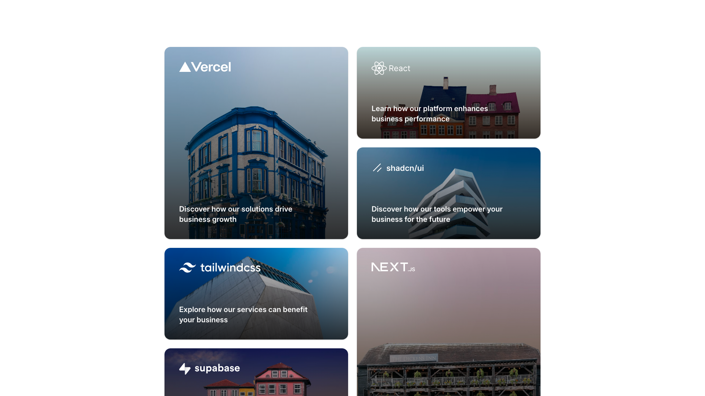
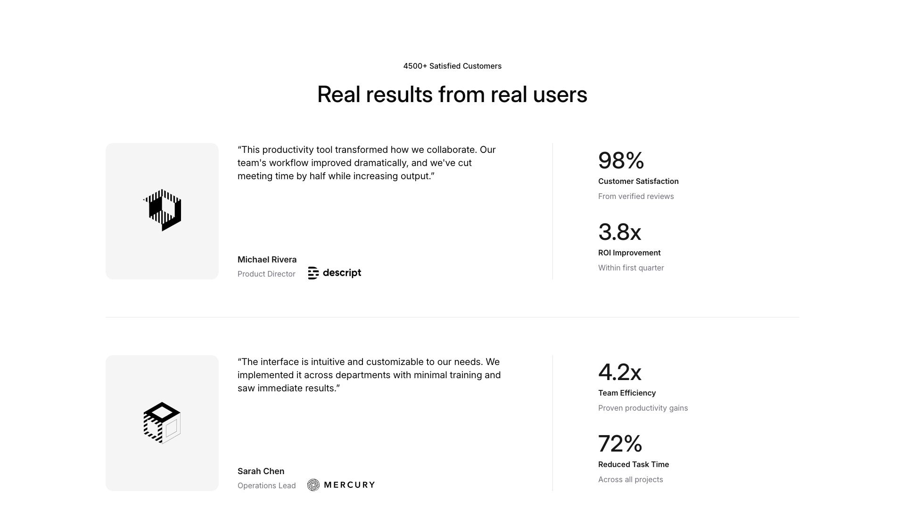
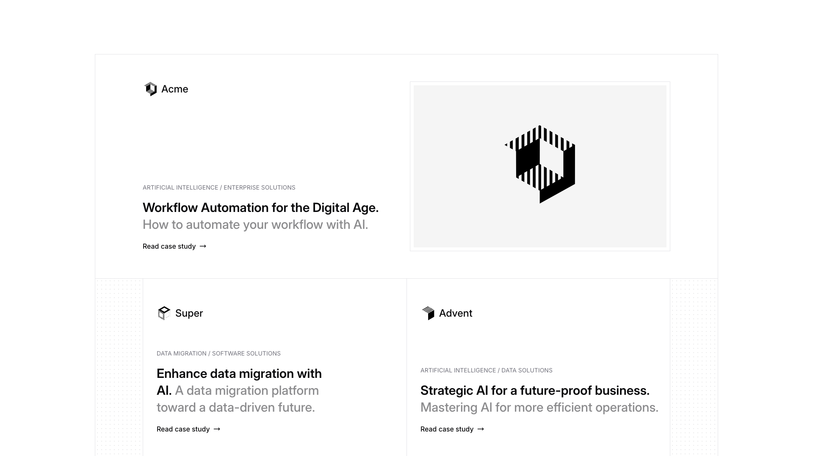
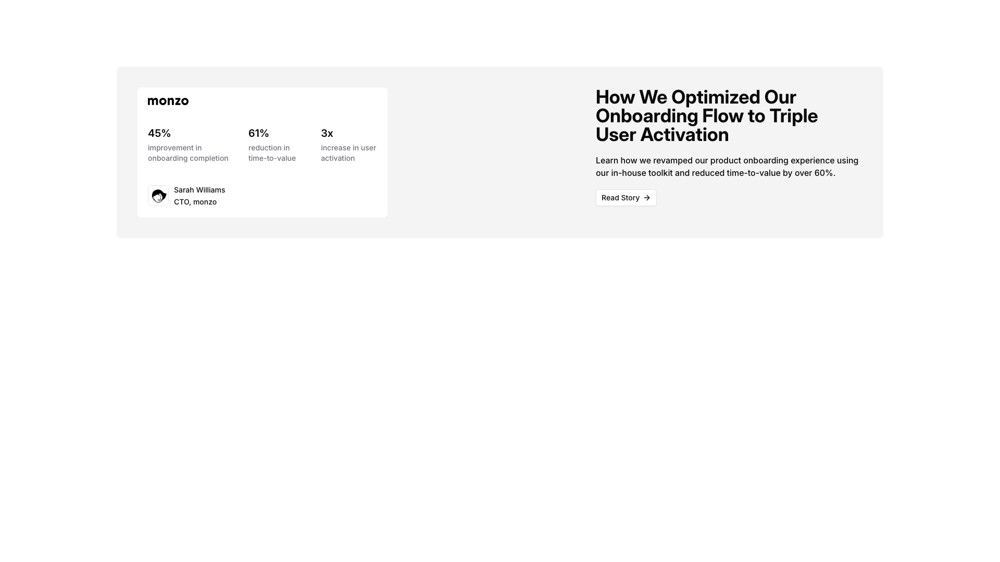
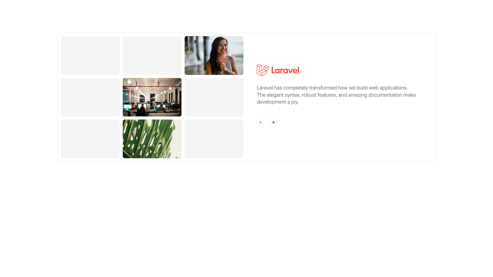

# Casestudies Blocks (5)

Case study grid layouts showcasing client success stories. Display project outcomes and business impact.

---

## casestudies1

A grid layout displays six cards arranged in three rows and two columns. Each card contains a logo or heading positioned at the top, a descriptive body text at the bottom, and a background image spanning the full card. The cards are evenly spaced horizontally and vertically throughout the layout.

**Install**: `pnpm dlx shadcn add @shadcnblocks/casestudies1`

---

## casestudies2

A testimonial section displays content in two main columns. The left column contains an image, followed by a customer quote in body text, a customer name, job title, and company logo. The right column presents four key metrics arranged vertically, each with a large number, label, and descriptive subtitle. A centered heading and subheading appear above the entire layout.

**Install**: `pnpm dlx shadcn add @shadcnblocks/casestudies2`

---

## casestudies3

A webpage section displays three horizontally-arranged cards in a grid layout. The top card spans the full width and contains a logo on the left, followed by a label, a main heading, body text, and a call-to-action link. Two smaller cards are positioned below, each containing a logo, a category label, a heading, descriptive text, and a call-to-action link, with an image positioned on the right side of each card.

**Install**: `pnpm dlx shadcn add @shadcnblocks/casestudies3`

---

## casestudies4

A two-column layout with the left column containing a company logo, three metric labels with numerical values and descriptive text, and an author attribution with a small profile image. The right column features a large heading, body text, and a clickable link positioned below, all aligned to the left within their column.

**Install**: `pnpm dlx shadcn add @shadcnblocks/casestudies4`

---

## casestudies5

A two-column layout section with a grid of images on the left side and centered text content on the right. The left column displays multiple rectangular image placeholders arranged in a 3x3 grid pattern. The right column contains a logo at the top, followed by a heading and body text, with navigation arrows positioned at the bottom.

**Install**: `pnpm dlx shadcn add @shadcnblocks/casestudies5`

---
