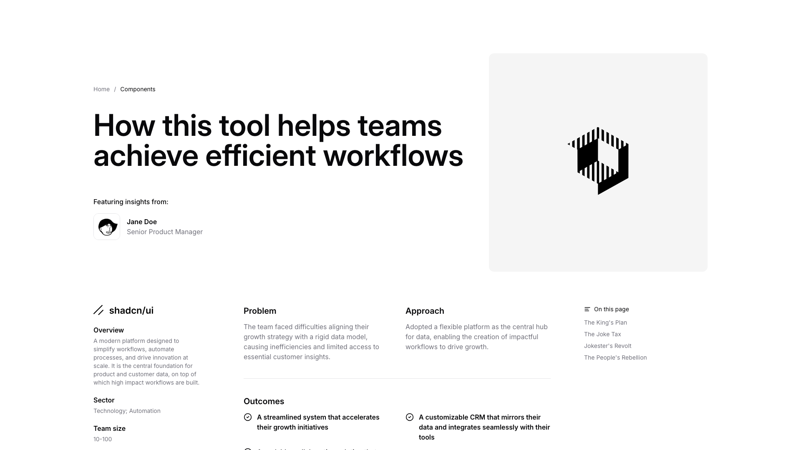
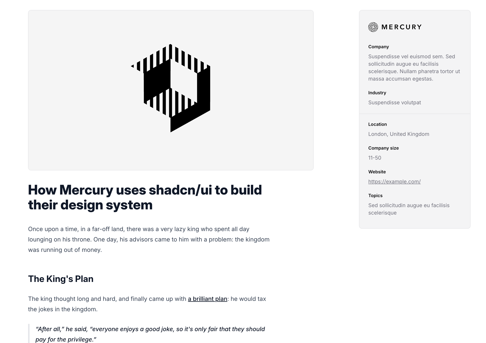

# Casestudy Blocks (3)

Individual case study layouts with detailed project narratives. Present challenges, solutions, and measurable results.

---

## casestudy1

A webpage is divided into two columns. The left column contains a main heading, introductory body text, a centered image, four metric labels with values arranged horizontally, a subheading, and additional body text. The right column displays an overview section with a logo at the top, followed by labeled metadata fields, and a button positioned at the bottom.

**Install**: `pnpm dlx shadcn add @shadcnblocks/casestudy1`

---

## casestudy3

A webpage layout displays content in two columns. The left column contains a main heading, featuring insights attribution with an avatar and name/title, followed by a sidebar with overview information, sector details, and team size. The right column contains an image positioned at the top, with a table below organizing information into three columns labeled "Problem," "Approach," and "Outcomes," each containing body text and checkmarked items. A secondary navigation menu appears on the far right.

**Install**: `pnpm dlx shadcn add @shadcnblocks/casestudy3`

---

## casestudy8

A two-column layout with the left column containing a centered image, followed by a large heading, body text, a subheading, and a block quote. The right column displays a company information card with a logo at the top, followed by several labeled fields and descriptive text stacked vertically.

**Install**: `pnpm dlx shadcn add @shadcnblocks/casestudy8`

---
