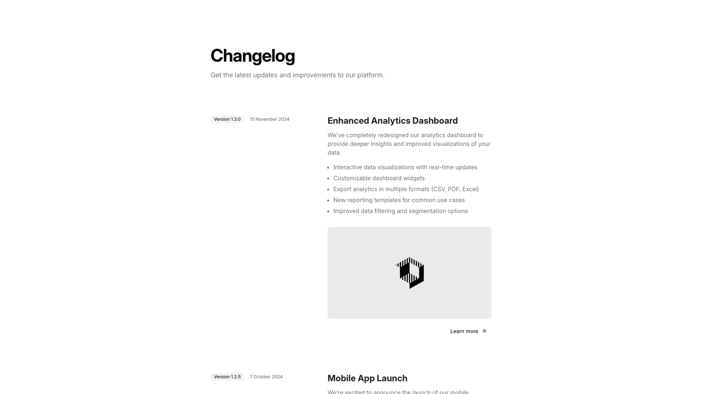
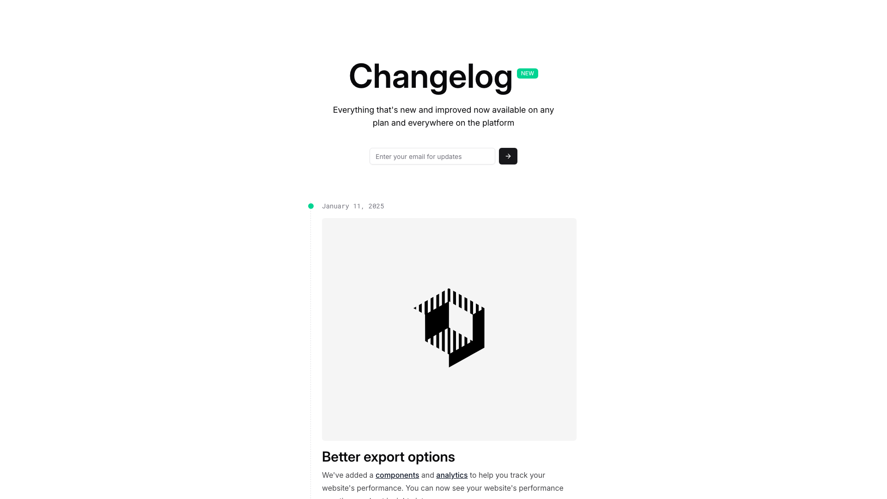
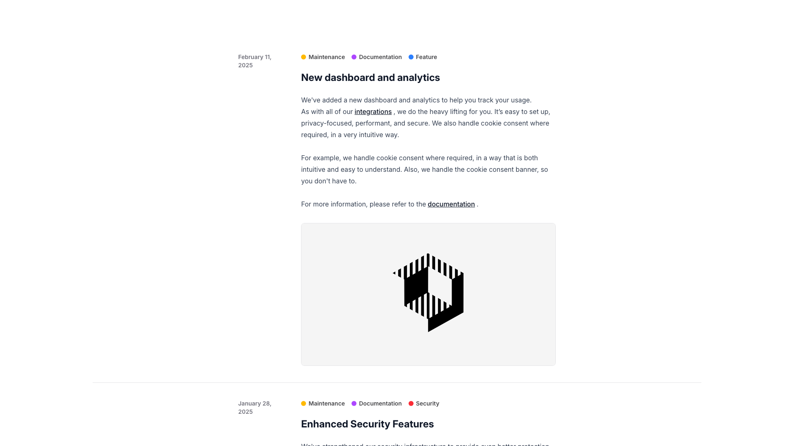
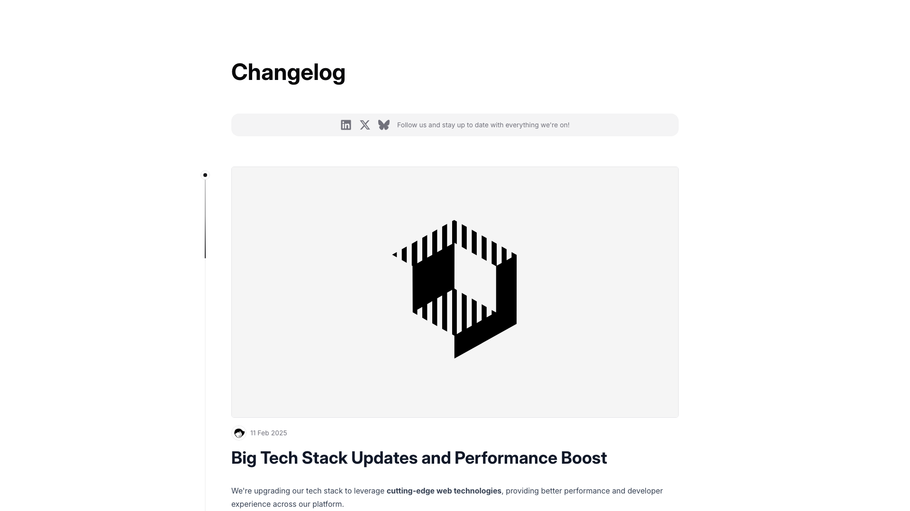
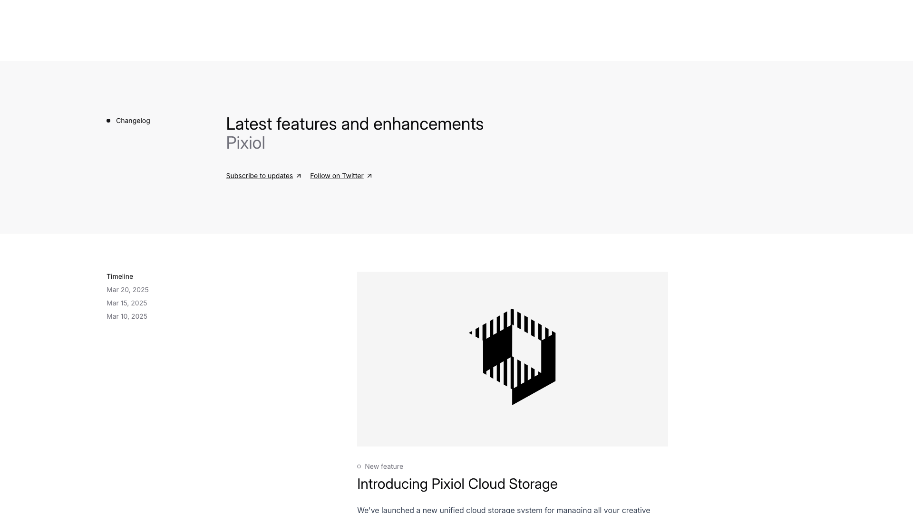
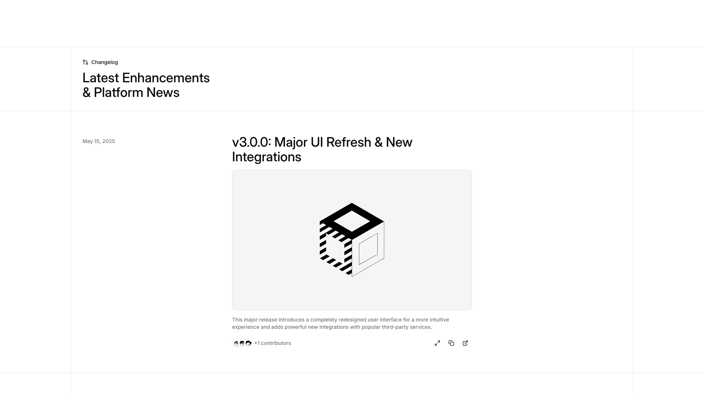
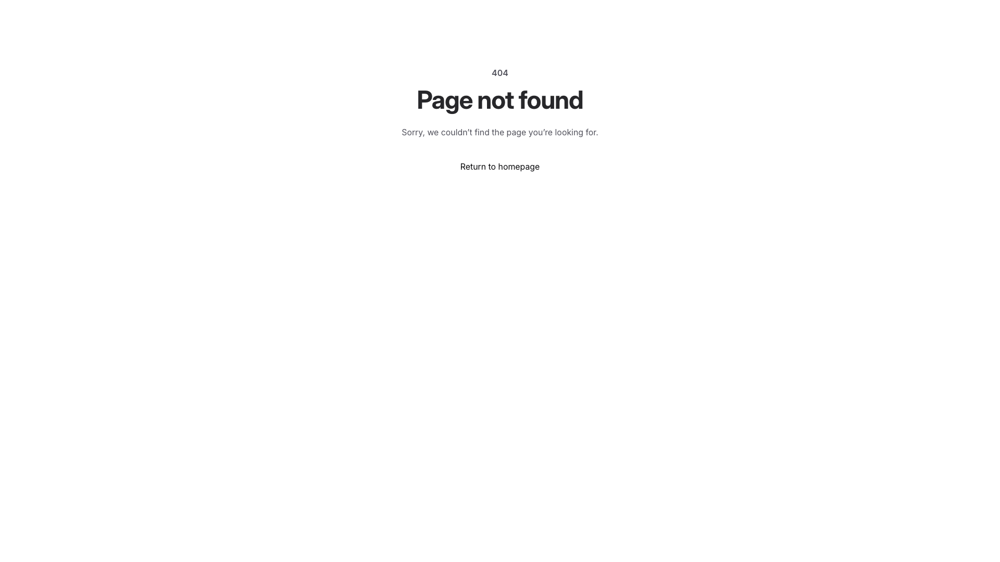
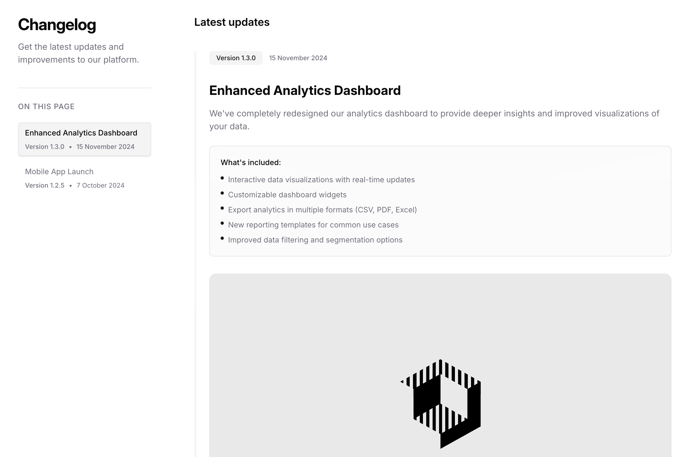

# Changelog Blocks (8)

Product changelog and release notes sections. Document version updates, bug fixes, and new features.

---

## changelog1

A changelog section displays version entries in a two-column layout. On the left, version numbers and dates are positioned vertically. On the right, each version entry contains a heading, descriptive body text, a bulleted list of features, an image, and a "Learn more" link positioned at the bottom.

**Install**: `pnpm dlx shadcn add @shadcnblocks/changelog1`

---

## changelog2

A centered layout displays a main heading with a label tag at the top, followed by descriptive body text. Below is a horizontally-aligned email input field with a submit button. Further down, a date label is positioned on the left, with a large image centered in the middle, and body text with a subheading positioned below the image.

**Install**: `pnpm dlx shadcn add @shadcnblocks/changelog2`

---

## changelog3

A webpage section displays content in a single column layout. At the top, a date and three category tags are positioned left-aligned, followed by a large heading and body text. Below the text is a centered image. This layout is repeated vertically for multiple content blocks.

**Install**: `pnpm dlx shadcn add @shadcnblocks/changelog3`

---

## changelog4

A changelog section displays vertically centered content with a main heading "Changelog" at the top, followed by a social media banner. Below this, a timeline entry is positioned on the left with a date label "11 Feb 2025". To the right of the timeline, a large image is displayed above a heading and body text describing a tech stack update.

**Install**: `pnpm dlx shadcn add @shadcnblocks/changelog4`

---

## changelog5

A webpage section displays a two-column layout. The left column contains a timeline navigation with three date entries stacked vertically. The right column features a centered image positioned above a tag label, a heading, and body text describing a new feature.

**Install**: `pnpm dlx shadcn add @shadcnblocks/changelog5`

---

## changelog6

A changelog entry displays content in two columns with a left sidebar and main content area. On the left, a date label is positioned vertically. The right column contains a main heading, a centered image, body text, and a row of interactive elements (contributor avatars and action buttons) horizontally aligned at the bottom.

**Install**: `pnpm dlx shadcn add @shadcnblocks/changelog6`

---

## changelog7

A centered page layout displays a 404 error message. At the top is a small label reading "404," followed by a large heading stating "Page not found" and body text explaining the error. Below this is a clickable link labeled "Return to homepage."

**Install**: `pnpm dlx shadcn add @shadcnblocks/changelog7`

---

## changelog8

A two-column layout displays changelog content. The left column contains a main heading, descriptive text, and a navigation menu with linked items and dates. The right column features a version header with date, a large heading, body text, a bulleted list within a bordered box, and a centered image below.

**Install**: `pnpm dlx shadcn add @shadcnblocks/changelog8`

---
