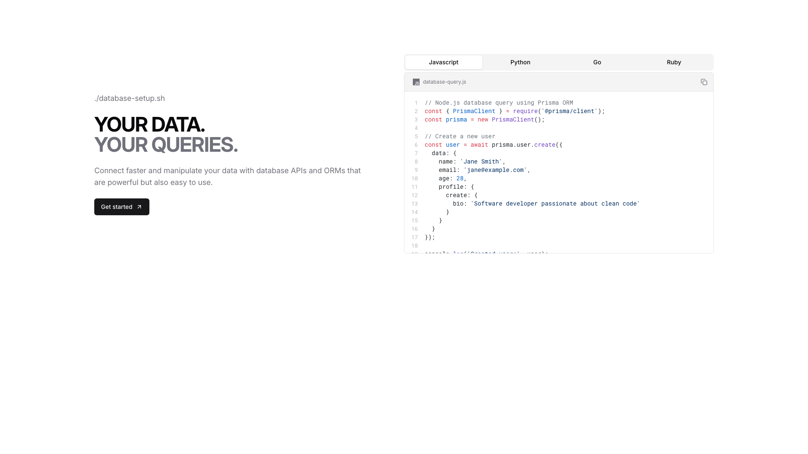
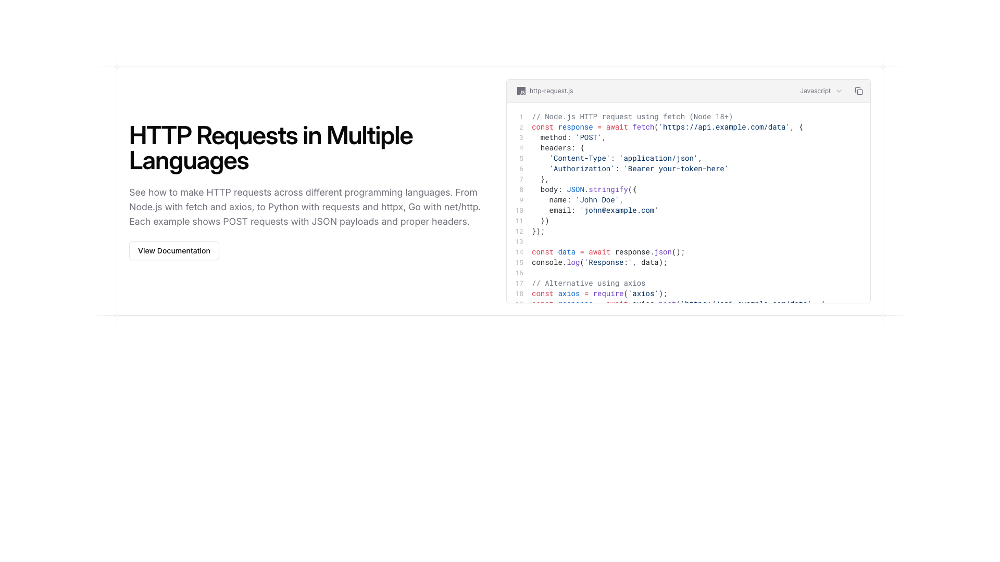
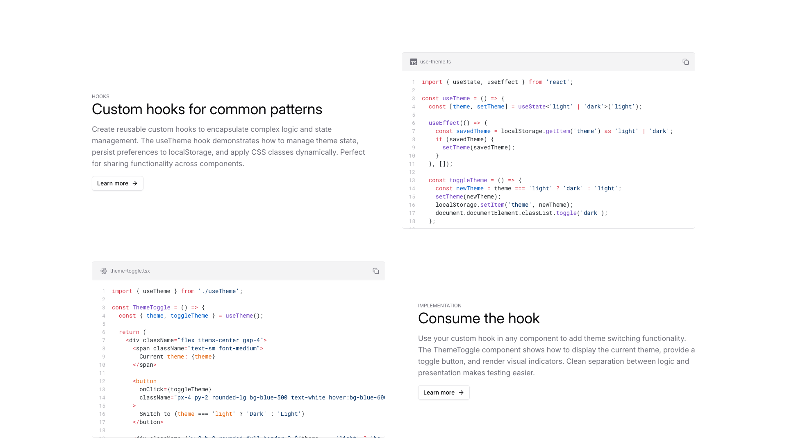
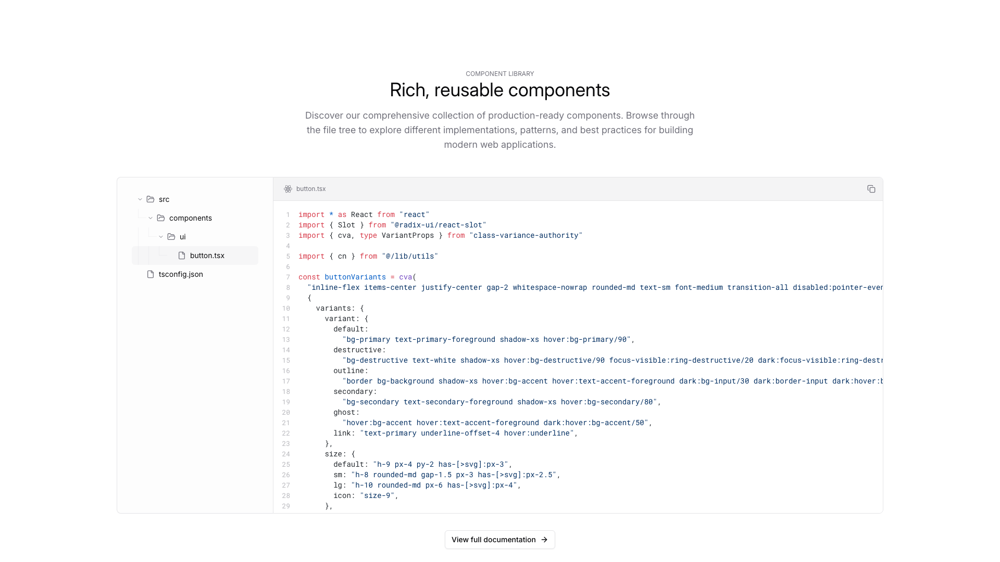
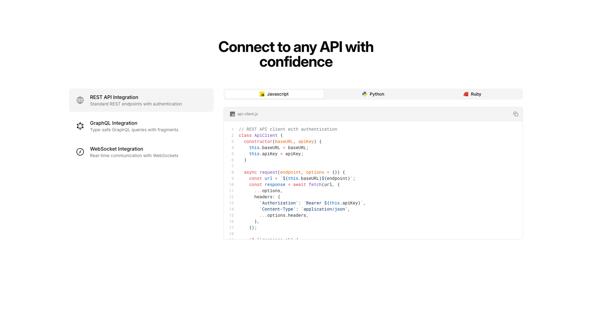

# Codeexample Blocks (5)

Code example and documentation blocks for technical content. Display syntax-highlighted code with explanations.

---

## codeexample1

A two-column layout with text content on the left and a code editor panel on the right. The left column contains a large heading, body text, and a button positioned vertically. The right column displays a tabbed code editor interface with multiple language tabs at the top and code content below, occupying the upper portion of the layout.

**Install**: `pnpm dlx shadcn add @shadcnblocks/codeexample1`

---

## codeexample2

A webpage section is divided into two columns. The left column contains a large heading, descriptive body text, and a button positioned below. The right column displays a code editor window showing JavaScript syntax with line numbers and syntax highlighting.

**Install**: `pnpm dlx shadcn add @shadcnblocks/codeexample2`

---

## codeexample3

A webpage section is divided into two main columns. The left column contains a heading, body text describing custom hooks, and a "Learn more" link, followed by a code block below. The right column displays two code editor windows stacked vertically, with the top showing a TypeScript file and the bottom showing a component file, each with syntax highlighting and line numbers.

**Install**: `pnpm dlx shadcn add @shadcnblocks/codeexample3`

---

## codeexample4

A documentation page is organized in two columns. On the left side, a vertical file tree navigation menu displays folder and file structure. The right column contains a large code editor window showing TypeScript code, with line numbers and syntax highlighting, centered below a heading and descriptive body text at the top of the page.

**Install**: `pnpm dlx shadcn add @shadcnblocks/codeexample4`

---

## codeexample5

A two-column layout with a heading centered at the top. The left column contains three vertically stacked items, each with an icon, title, and descriptive body text. The right column displays a tabbed interface with three language options (Javascript, Python, Ruby), with a code editor panel beneath showing numbered lines of code and a copy button in the top-right corner.

**Install**: `pnpm dlx shadcn add @shadcnblocks/codeexample5`

---
