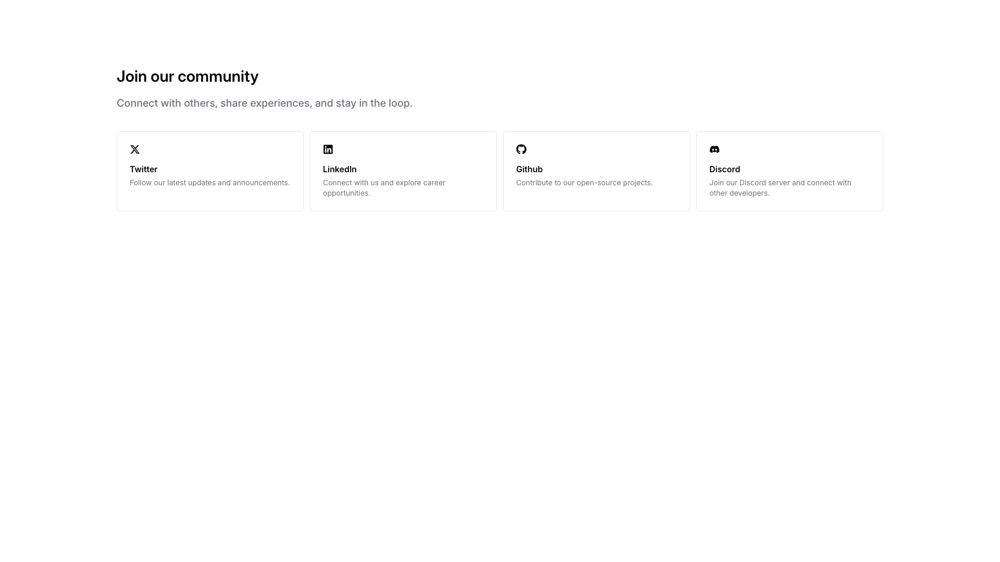
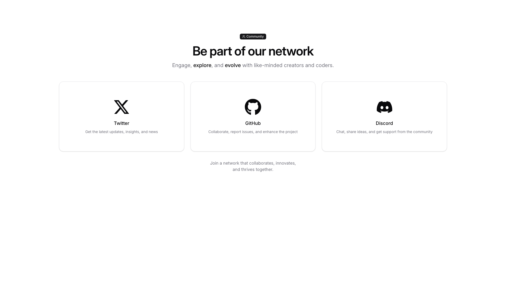
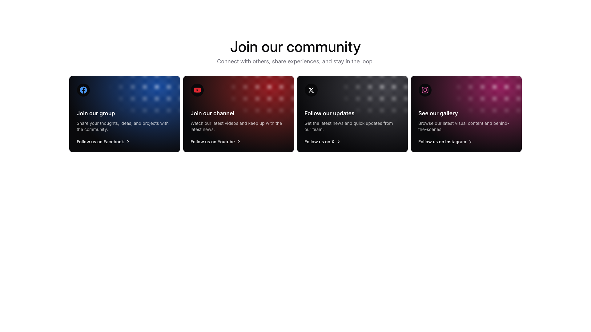
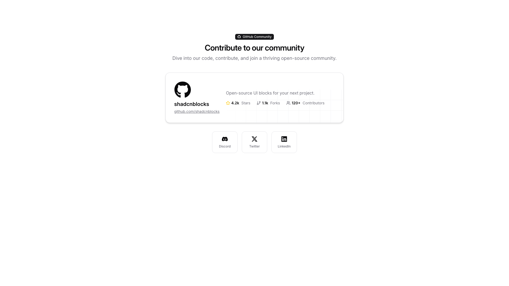
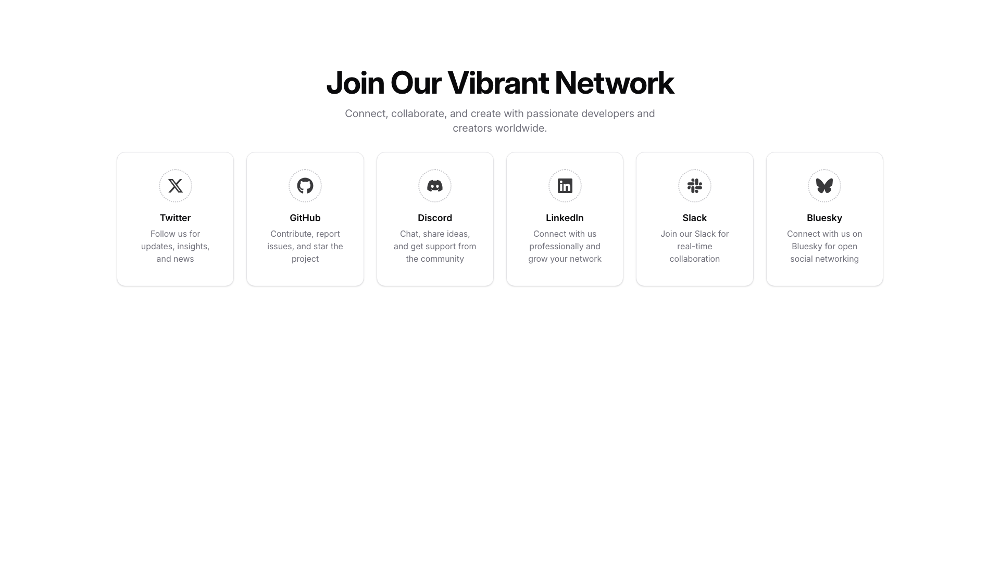
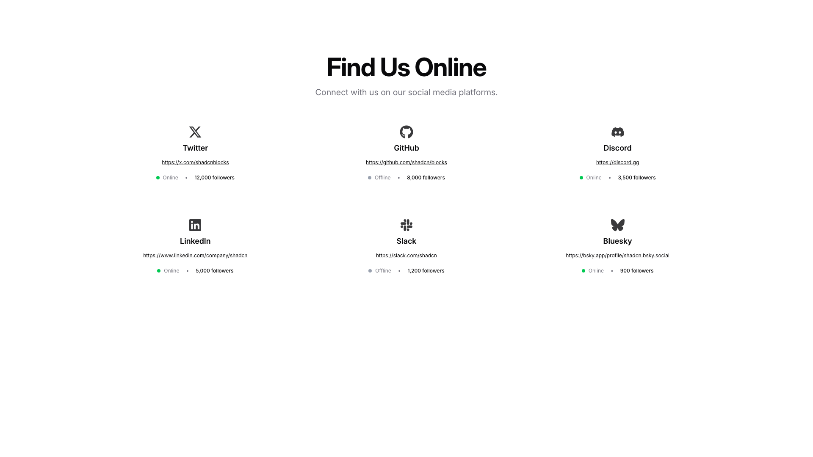

# Community Blocks (7)

Community and social sections for user engagement. Feature forums, discussions, and member interactions.

---

## community1

A centered section displays a small image at the top, followed by a main heading and subheading stacked vertically. Below the text, three small icon buttons are horizontally aligned and centered.

**Install**: `pnpm dlx shadcn add @shadcnblocks/community1`

---

## community2

A "Join our community" section displays a main heading followed by descriptive body text at the top. Below this, four cards are arranged horizontally in a grid layout, each containing an icon, a platform name (label), and supporting text describing the purpose of connecting on that platform.

**Install**: `pnpm dlx shadcn add @shadcnblocks/community2`

---

## community3

A centered section displays a community network interface with a heading, subheading, and descriptive text at the top. Below this, three cards are arranged horizontally, each containing an image, a title, and body text describing different platforms. A closing statement appears centered beneath the cards.

**Install**: `pnpm dlx shadcn add @shadcnblocks/community3`

---

## community4

A centered section with a main heading and subheading at the top. Below this, four cards are arranged horizontally in a grid layout. Each card contains an icon, a title, body text describing the offering, and a clickable link with an arrow at the bottom.

**Install**: `pnpm dlx shadcn add @shadcnblocks/community4`

---

## community5

A centered section displays a header with "Contribute to our community" as the main heading and supporting body text beneath it. Below this is a horizontally-oriented card containing an image on the left, followed by a title, description text, and three metric labels aligned to the right. At the bottom, three buttons are centered horizontally in a row.

**Install**: `pnpm dlx shadcn add @shadcnblocks/community5`

---

## community6

A centered section features a main heading at the top with supporting body text below. Horizontally aligned underneath are six card components arranged in a row, each containing an icon image, a label, and descriptive body text stacked vertically within the card.

**Install**: `pnpm dlx shadcn add @shadcnblocks/community6`

---

## community7

A centered section displays a main heading followed by descriptive body text at the top. Below this, six social media platform cards are arranged in a 3x2 grid layout, each containing a platform icon, name, URL link, status indicator, and follower count.

**Install**: `pnpm dlx shadcn add @shadcnblocks/community7`

---
