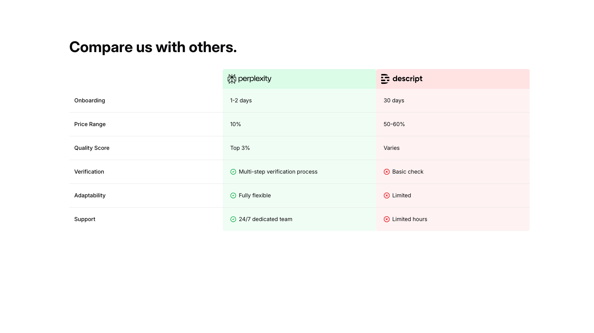
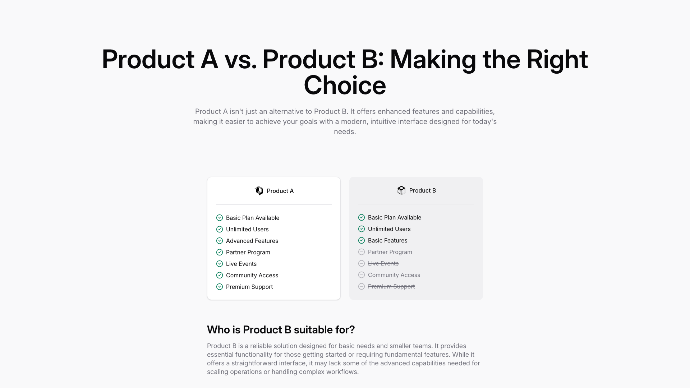
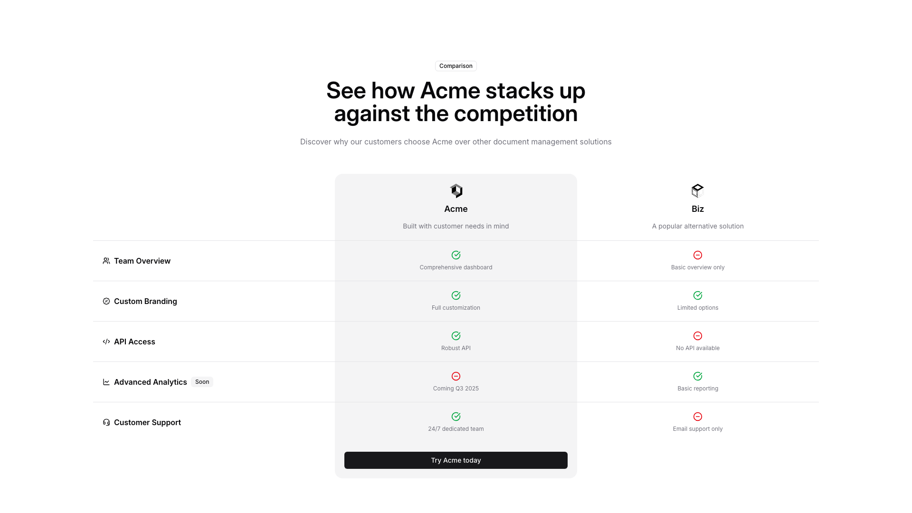
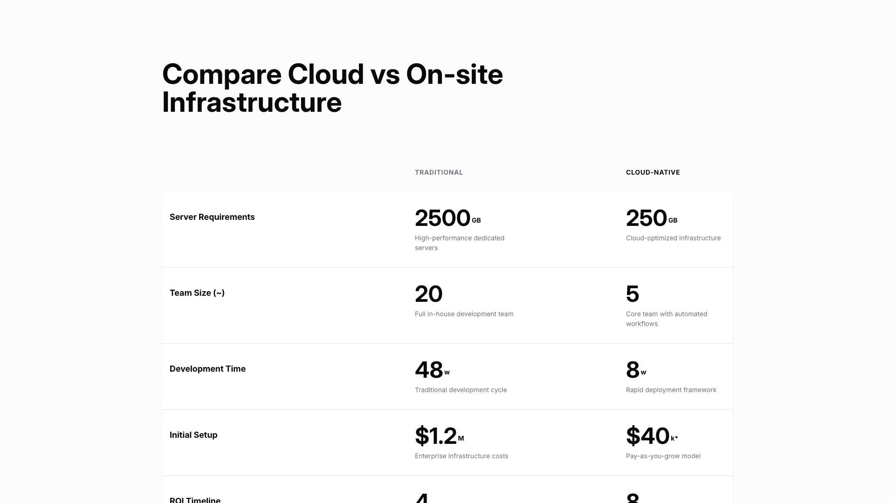
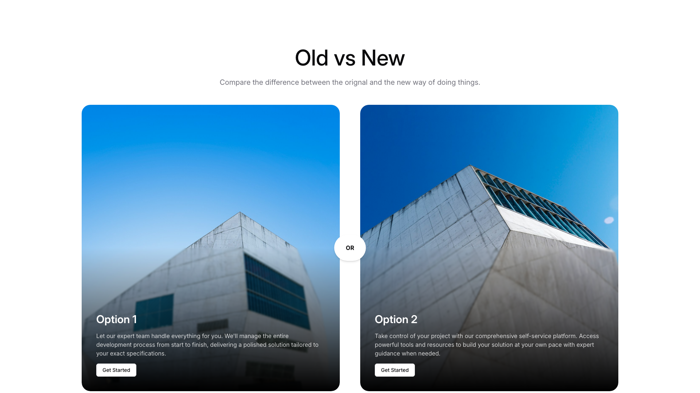
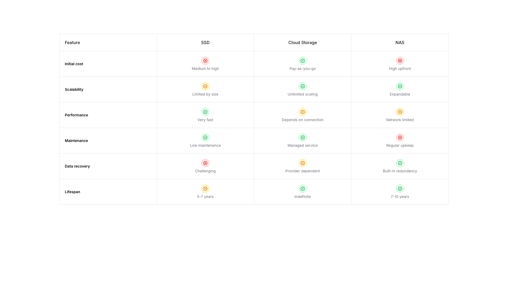
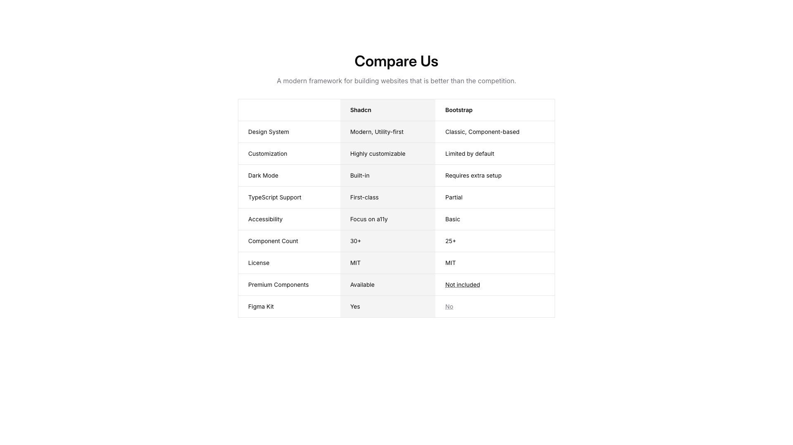
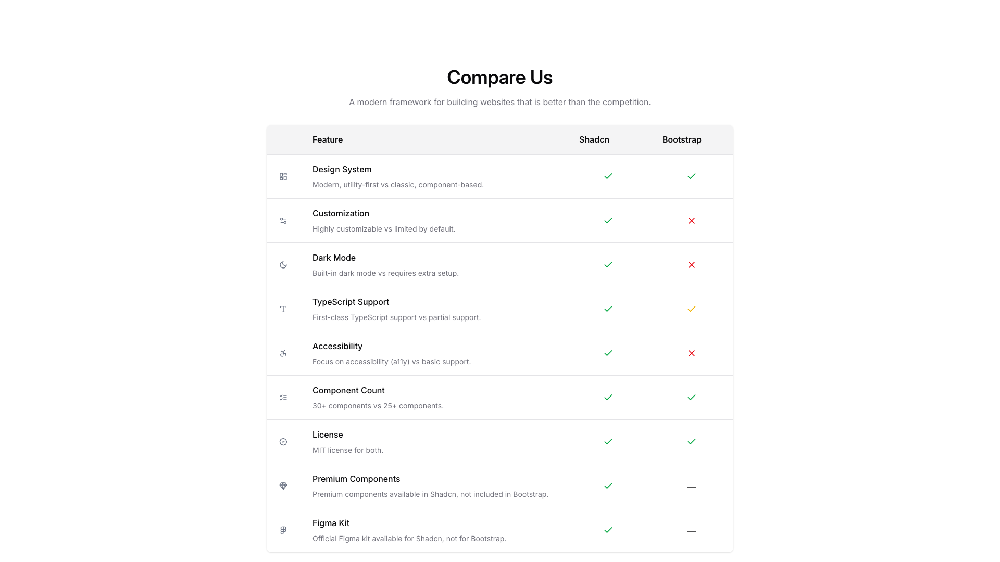
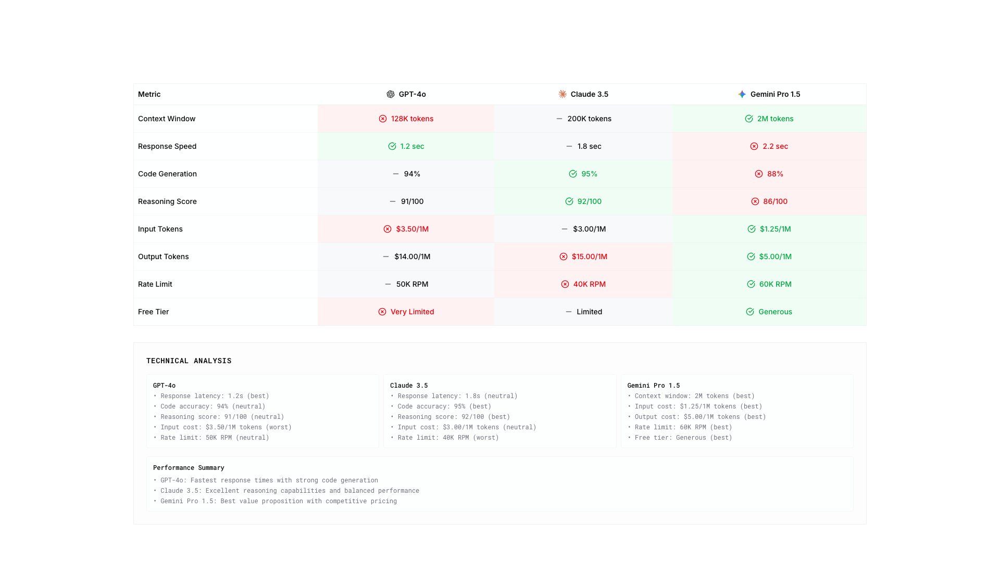
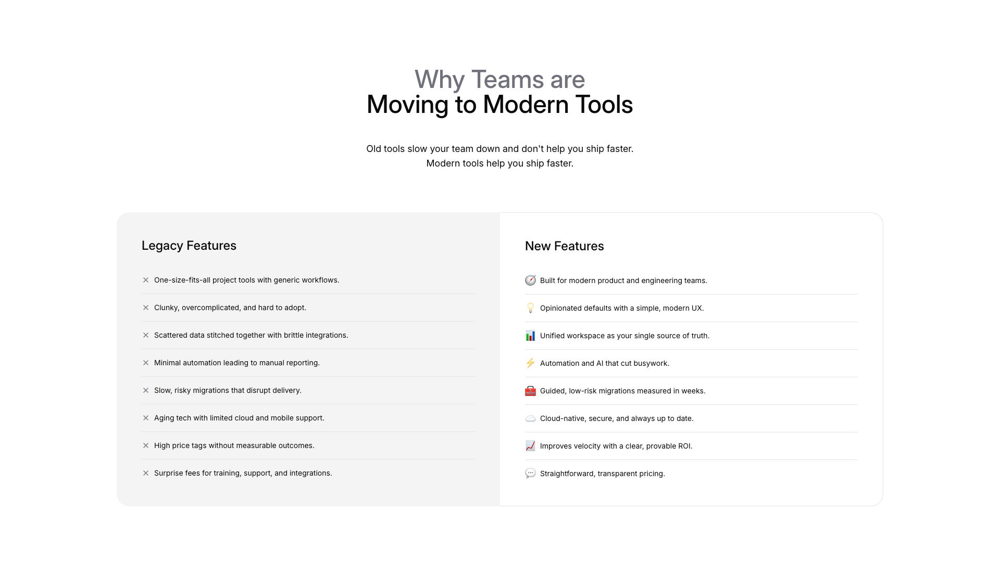

# Compare Blocks (10)

Comparison tables and side-by-side product evaluations. Help users make informed decisions between options.

---

## compare1

A comparison table with a heading centered at the top. The table is divided into two columns with headers labeled "perplexity" and "descript" on the left and right respectively. Six rows of comparison criteria are listed vertically on the left side, with corresponding information displayed in aligned columns to the right for each service.

**Install**: `pnpm dlx shadcn add @shadcnblocks/compare1`

---

## compare2

A centered section displays a main heading at the top, followed by body text. Below this, two feature comparison cards are positioned horizontally side-by-side, each containing a label, icon, and checklist of features. At the bottom, another heading is centered above additional body text describing product suitability.

**Install**: `pnpm dlx shadcn add @shadcnblocks/compare2`

---

## compare3

A comparison section displays two product columns side-by-side, centered on the page. The left column features a product name and descriptor, while the right column contains an alternative product name and descriptor. Between them, a vertical feature list on the left side includes five labeled rows, each with corresponding checkmarks or X icons aligned to both product columns below.

**Install**: `pnpm dlx shadcn add @shadcnblocks/compare3`

---

## compare4

A comparison table displays two columns with "TRADITIONAL" and "CLOUD-NATIVE" headers centered at the top. The left column contains row labels vertically aligned on the far left, while corresponding data for each infrastructure type is positioned in two centered columns to the right. Each row includes a large numerical value with a smaller descriptive label beneath it.

**Install**: `pnpm dlx shadcn add @shadcnblocks/compare4`

---

## compare5

A section displays two horizontally-aligned cards with a centered "OR" divider between them. Each card contains an image at the top, followed by a label, body text, and a button positioned at the bottom. The layout presents the cards in equal-width columns beneath a centered heading and subheading.

**Install**: `pnpm dlx shadcn add @shadcnblocks/compare5`

---

## compare6

A comparison table with seven rows and four columns displays storage solution features. The leftmost column contains row labels in bold text, while the three right columns each contain a centered heading (SSD, Cloud Storage, NAS) with corresponding feature descriptions and status icons below. Each data cell includes an icon indicator and descriptive text positioned centrally.

**Install**: `pnpm dlx shadcn add @shadcnblocks/compare6`

---

## compare7

A comparison table section features a centered heading with descriptive body text above it. The table is structured in three columns—a feature label column on the left, followed by two product comparison columns (Shadcn and Bootstrap)—with alternating row backgrounds for readability. Each cell contains concise text labels describing features and specifications across all nine rows.

**Install**: `pnpm dlx shadcn add @shadcnblocks/compare7`

---

## compare8

A comparison table is centered on the page with a main heading at the top, followed by descriptive body text. The table contains three columns: a "Feature" column on the left with labels and descriptions, and two comparison columns labeled "Shadcn" and "Bootstrap" on the right, each displaying checkmarks, crosses, or dashes to indicate feature availability.

**Install**: `pnpm dlx shadcn add @shadcnblocks/compare8`

---

## compare9

A comparison table displays three columns representing different AI models, each with a distinct header label positioned at the top. Below the headers, rows of metrics are listed vertically on the left, with corresponding values aligned horizontally across the three columns. Additional technical analysis text appears in a section below the table, organized into three columns that mirror the table structure above.

**Install**: `pnpm dlx shadcn add @shadcnblocks/compare9`

---

## compare10

A section displays centered heading text at the top, followed by descriptive body text. Below this, content is organized into two columns: the left column contains a title with a list of items marked with X icons, while the right column contains a corresponding title with a list of items marked with various icons. Each column is vertically aligned with consistent spacing between list items.

**Install**: `pnpm dlx shadcn add @shadcnblocks/compare10`

---
