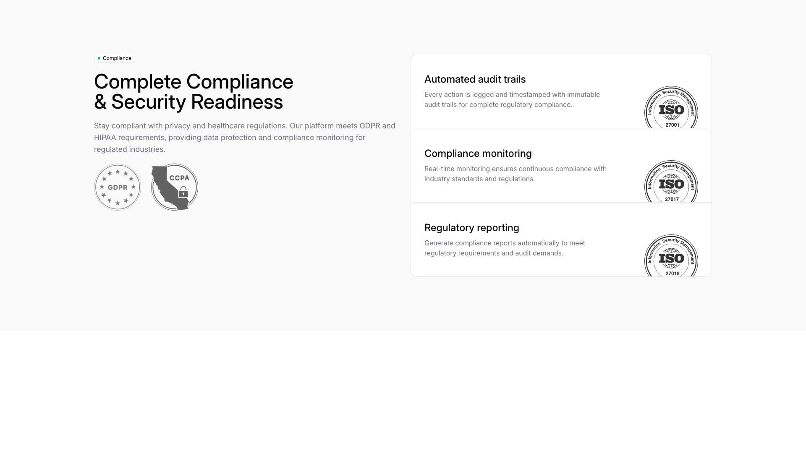
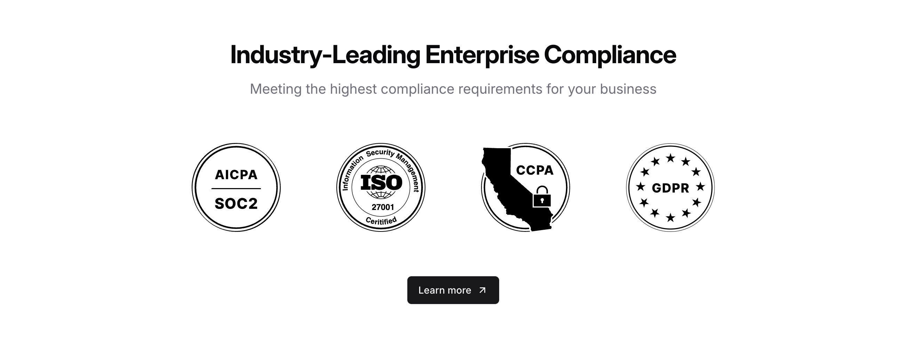
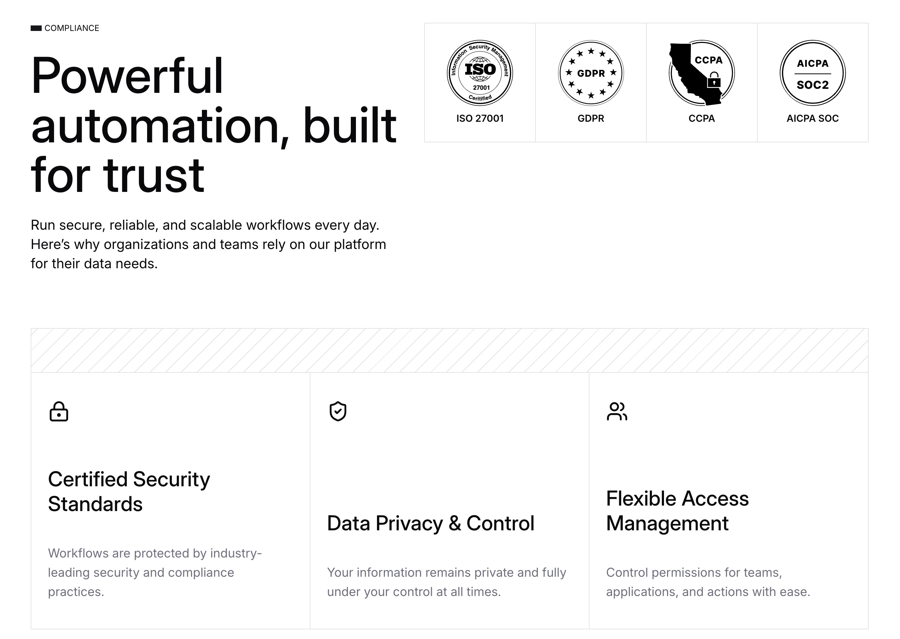

# Compliance Blocks (3)

Compliance and legal information sections. Display privacy policies, terms, and regulatory requirements.

---

## compliance1

A two-column layout with the left column containing a main heading, descriptive body text, and two certification images positioned horizontally below. The right column displays three vertically-stacked cards, each with a heading, body text, and a certification image aligned to the right side of each card.

**Install**: `pnpm dlx shadcn add @shadcnblocks/compliance1`

---

## compliance5

A centered section displays a main heading at the top, followed by descriptive body text. Below this, four certification badge images are arranged horizontally in a row. A dark button labeled "Learn more" is positioned centrally beneath the badges.

**Install**: `pnpm dlx shadcn add @shadcnblocks/compliance5`

---

## compliance6

A compliance section is structured with a main heading and body text positioned on the left, followed by a row of four certification badge images horizontally aligned at the top right. Below this, three feature cards are arranged horizontally across the full width, each containing an icon, a subheading, and descriptive body text stacked vertically.

**Install**: `pnpm dlx shadcn add @shadcnblocks/compliance6`

---
