# Contact Blocks (16)

Contact forms and information sections for user communication. Include maps, addresses, and inquiry forms.

---

## contact1

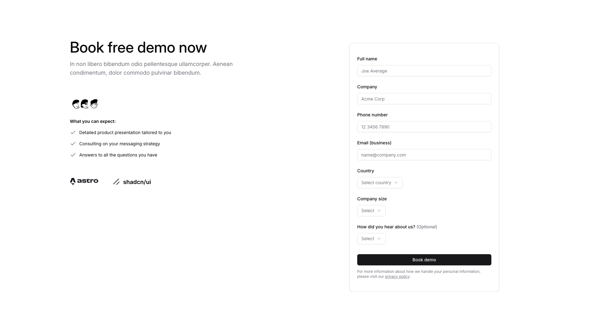

A webpage section is divided into two columns. The left column contains a main heading, descriptive body text, a small image, a subheading with three bullet points, and two logo images positioned horizontally at the bottom. The right column features a vertically stacked form with multiple labeled text input fields, dropdown selectors, and a button centered at the bottom, followed by small disclaimer text.

**Install**: `pnpm dlx shadcn add @shadcnblocks/contact1`

---

## contact2

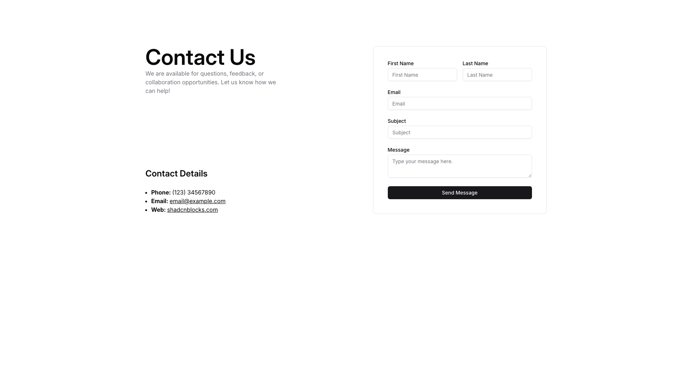

A contact page is divided into two columns. The left column contains a main heading, body text, and a "Contact Details" section with a bulleted list. The right column displays a contact form with labeled input fields for name, email, and subject, a larger text area for messages, and a button centered below.

**Install**: `pnpm dlx shadcn add @shadcnblocks/contact2`

---

## contact3

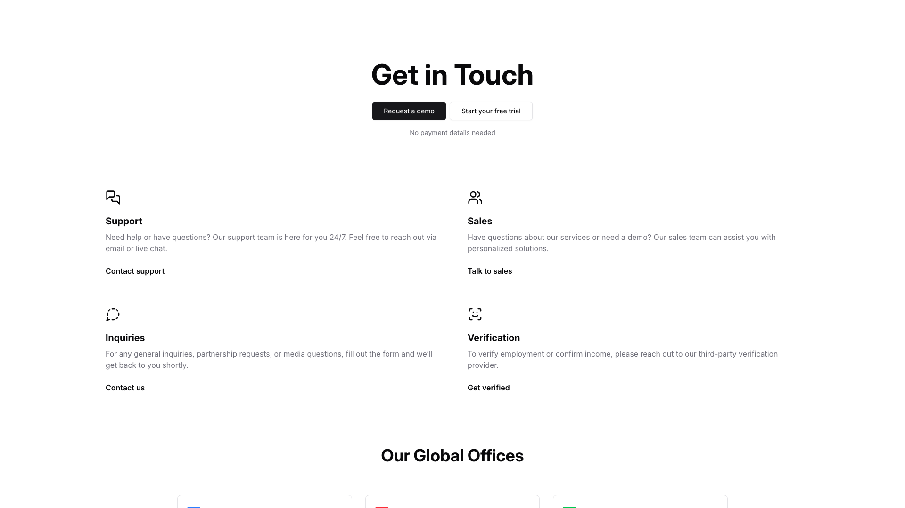

A centered section contains a large heading followed by two horizontally-aligned buttons and supporting text below. Further down, four contact option blocks are arranged in a 2x2 grid, each with an icon, heading, body text, and a linked label. At the bottom, a section heading introduces a series of office location cards displayed horizontally in a row.

**Install**: `pnpm dlx shadcn add @shadcnblocks/contact3`

---

## contact4

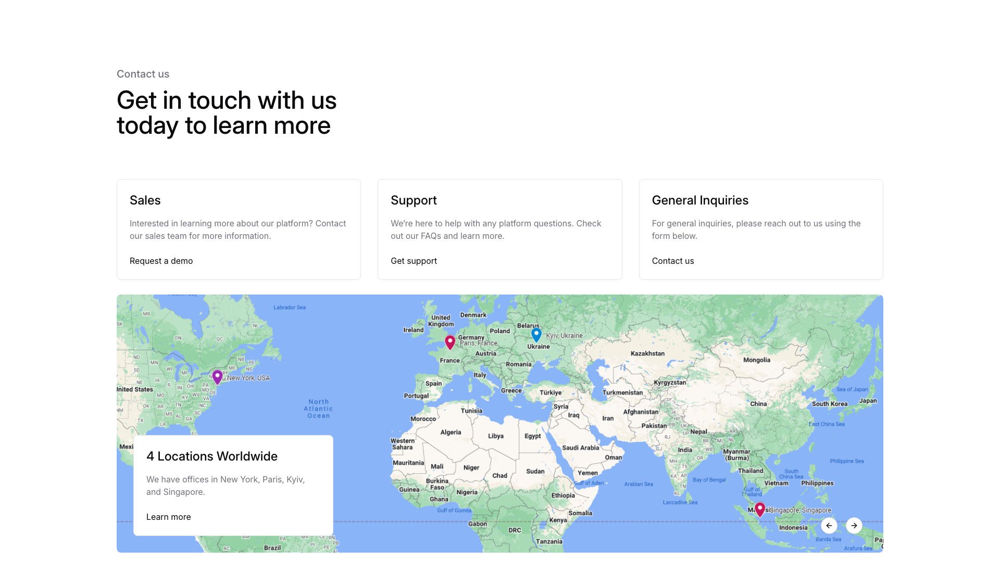

A contact section is organized into three vertically stacked columns, each containing a heading, body text, and a button. Below this, a large image spans the full width, with a text box positioned on the lower left containing a heading, body text, and a link.

**Install**: `pnpm dlx shadcn add @shadcnblocks/contact4`

---

## contact5

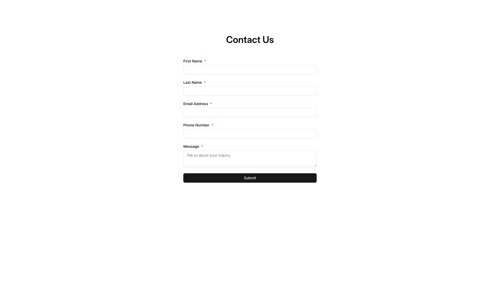

A centered contact form with a heading at the top, followed by five vertically stacked input fields labeled "First Name," "Last Name," "Email Address," "Phone Number," and "Message." Below the form fields is a full-width button labeled "Submit."

**Install**: `pnpm dlx shadcn add @shadcnblocks/contact5`

---

## contact6

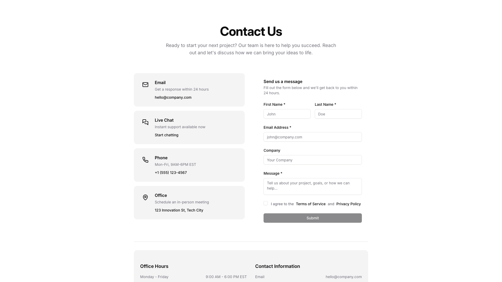

A "Contact Us" page layout is divided into two main sections horizontally. The left column contains a centered heading with body text, followed by four vertically stacked contact option cards displaying icons and information. The right column features a contact form with input fields for name, email, and company information, a message text area, checkboxes for terms agreement, and a submit button at the bottom. Below both columns, a footer section displays office hours on the left and contact information on the right.

**Install**: `pnpm dlx shadcn add @shadcnblocks/contact6`

---

## contact7

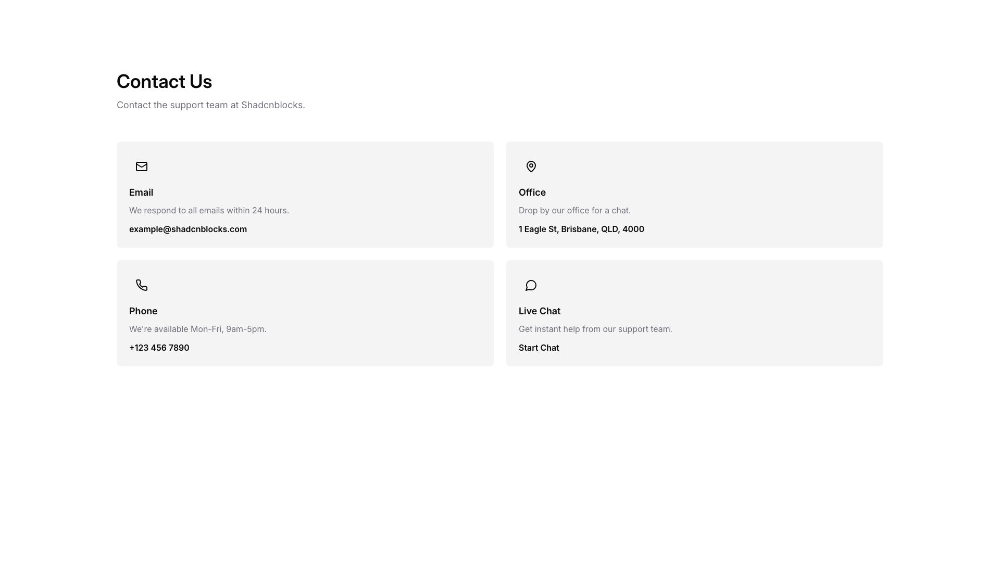

A contact page section displays four contact method cards arranged in a 2x2 grid layout. Each card contains an icon on the left, a heading, descriptive body text, and contact details or a call-to-action link positioned below. The section is preceded by a main heading and subheading at the top.

**Install**: `pnpm dlx shadcn add @shadcnblocks/contact7`

---

## contact8

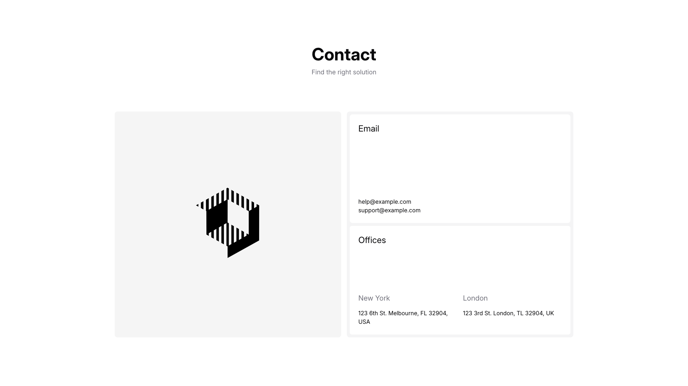

A contact page section is organized in two columns. The left column contains a centered image. The right column displays a heading "Contact" with subheading text at the top, followed by an "Email" section with two email addresses, an "Offices" heading, and two office locations listed side-by-side with addresses beneath each.

**Install**: `pnpm dlx shadcn add @shadcnblocks/contact8`

---

## contact9

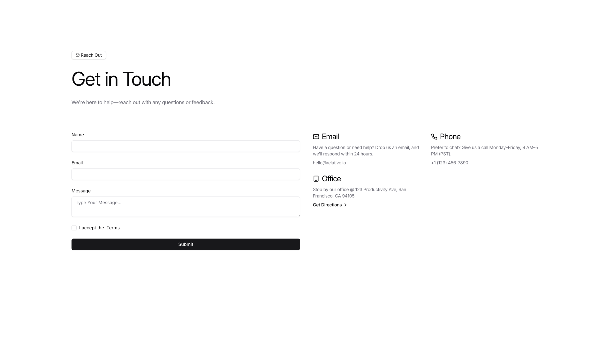

A contact form page is organized in two columns. The left column contains a main heading, body text, and a contact form with fields for name, email, and message, followed by a terms checkbox and submit button. The right column displays three vertically stacked information sections with headings for email, phone, and office, each containing relevant contact details and descriptive text.

**Install**: `pnpm dlx shadcn add @shadcnblocks/contact9`

---

## contact10

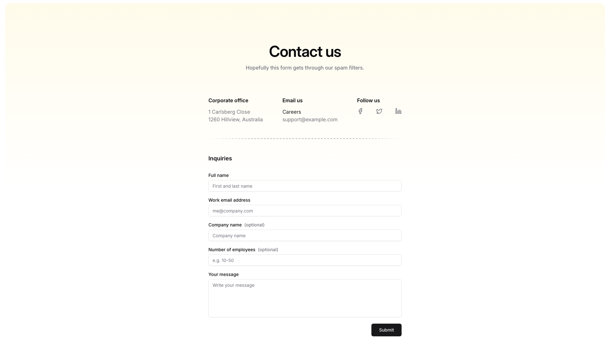

A centered contact page layout with a main heading and subheading at the top. Below is a horizontal three-column section displaying corporate office details, email contacts, and social media links. Further down, an inquiry form spans the full width with vertically stacked input fields for full name, work email, company name, and employee count, followed by a larger text area for a message. A submit button is positioned at the bottom right of the form.

**Install**: `pnpm dlx shadcn add @shadcnblocks/contact10`

---

## contact11

A contact page displays content in two columns. The left column contains a centered heading, body text, and three sections with contact information stacked vertically. The right column features a form with multiple input fields and a button aligned to the bottom right.

**Install**: `pnpm dlx shadcn add @shadcnblocks/contact11`

---

## contact14

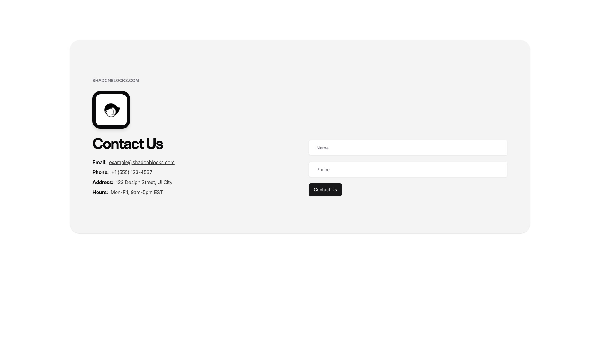

A contact section is divided into two columns. The left column contains a logo image at the top, followed by a heading, and then body text with contact details including email, phone, address, and hours. The right column features a vertical form with two input fields and a button positioned below them.

**Install**: `pnpm dlx shadcn add @shadcnblocks/contact14`

---

## contact16

A contact form section is divided into two columns. The left column contains a large heading, body text, and contact information (phone number and email). The right column features three vertically stacked input fields for name, email, and message, with a button centered below them.

**Install**: `pnpm dlx shadcn add @shadcnblocks/contact16`

---

## contact17

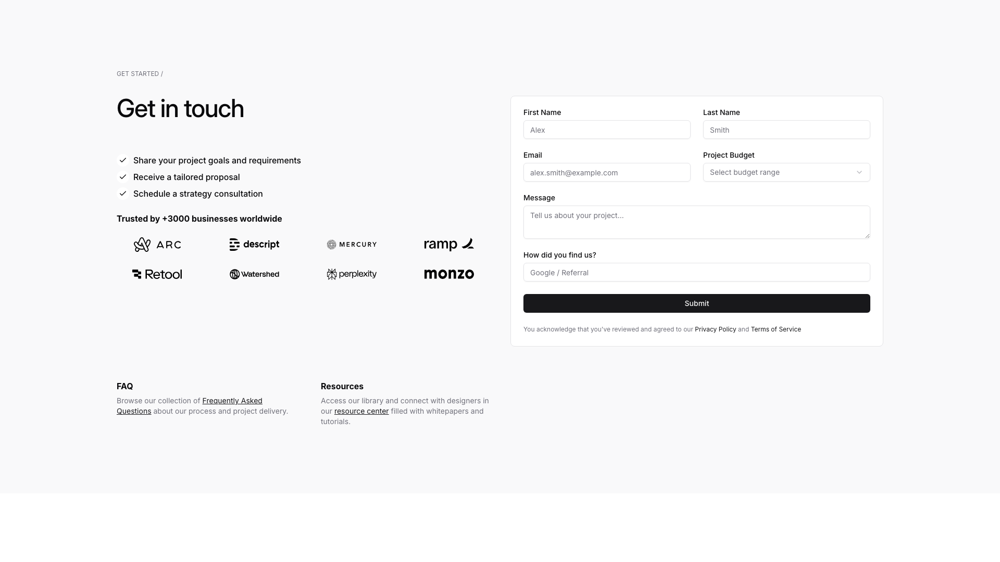

A contact form section is divided into two columns. The left column contains a main heading, a bulleted list of three items, a smaller subheading, and a row of company logos. The right column displays a vertically stacked form with input fields for first name, last name, email, and project budget at the top, followed by a larger message text area, a dropdown field, and a submit button. Below the form is a line of body text with linked text elements.

**Install**: `pnpm dlx shadcn add @shadcnblocks/contact17`

---

## contact18

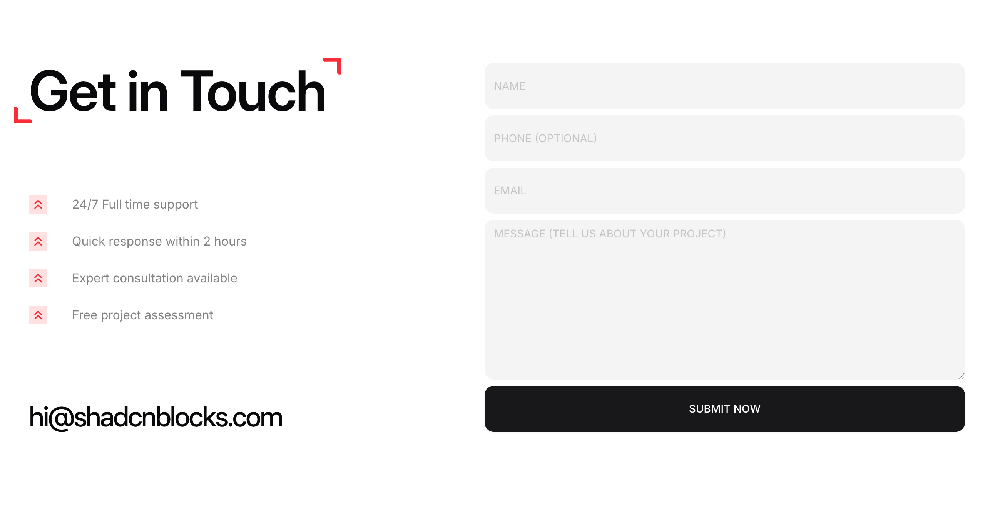

A contact form section is divided into two columns. The left column contains a large heading, followed by four lines of body text with icons, and an email address at the bottom. The right column features four input fields stacked vertically, with a large text area below them, and a button centered at the bottom.

**Install**: `pnpm dlx shadcn add @shadcnblocks/contact18`

---

## contact20

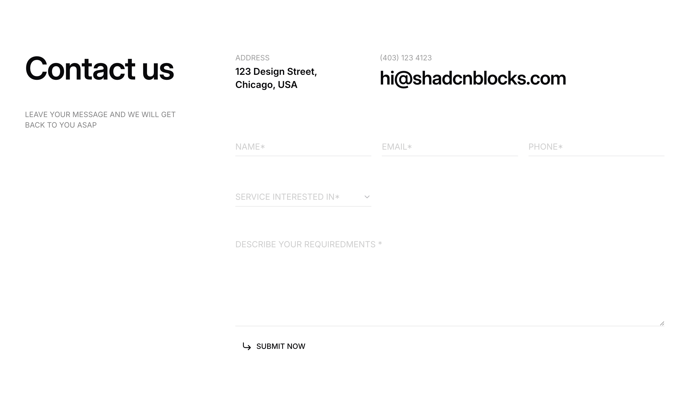

A contact form section is organized with a large heading on the left, followed by contact details positioned to the right. Below this, a multi-field form layout includes three horizontally-aligned input fields at the top, a dropdown menu, and a larger text area for additional information. A submit button is positioned at the bottom left of the form.

**Install**: `pnpm dlx shadcn add @shadcnblocks/contact20`

---
