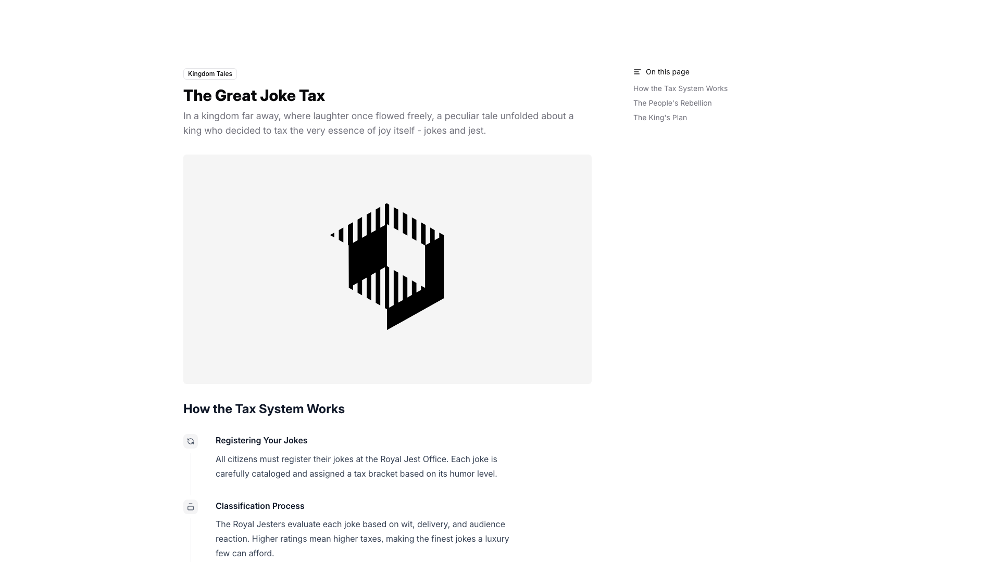
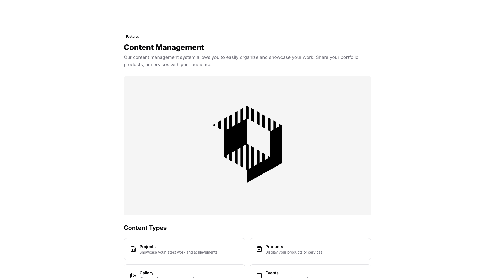
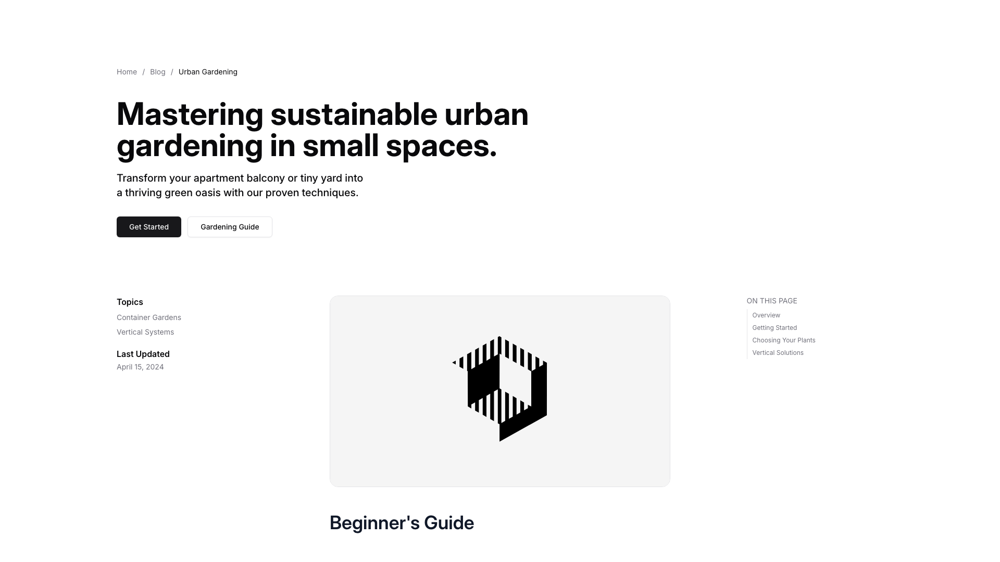
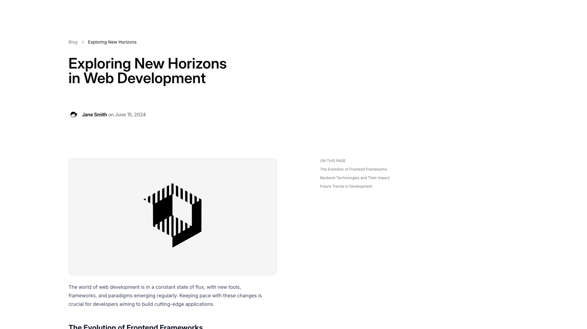

# Content Blocks (4)

General content blocks for flexible page layouts. Adaptable sections for various information types.

---

## content1

A webpage displays a two-column layout. The left column contains a main heading, descriptive body text, and a centered image. Below the image, a subheading is followed by two labeled sections with body text. On the right side, a vertical navigation menu lists several linked items.

**Install**: `pnpm dlx shadcn add @shadcnblocks/content1`

---

## content2

A feature section displays vertically stacked content with a small label at the top, followed by a large heading and body text. Below this introductory text, a centered image is positioned in a light gray background area. Further down, another heading introduces a grid of four content type cards arranged in two columns and two rows, each card containing a small icon, a label, and descriptive text.

**Install**: `pnpm dlx shadcn add @shadcnblocks/content2`

---

## content3

A webpage layout with a left sidebar and centered main content area. The left sidebar contains topic labels, a "Last Updated" timestamp, and navigation links. The main content area features a large centered heading, descriptive body text, and two action buttons positioned horizontally below. Further down, an image is centered with a subheading underneath. On the right side, a vertical navigation menu with section links is aligned to the top.

**Install**: `pnpm dlx shadcn add @shadcnblocks/content3`

---

## content4

A blog post layout displays content in two columns. The left column contains a main heading, author information with a date, a large centered image, and body text below. On the right side, a narrow column lists navigation links under an "ON THIS PAGE" label, positioned vertically.

**Install**: `pnpm dlx shadcn add @shadcnblocks/content4`

---
