# Cta Blocks (23)

Call-to-action sections for conversion optimization. Drive user engagement with compelling prompts and buttons.

---

## cta1

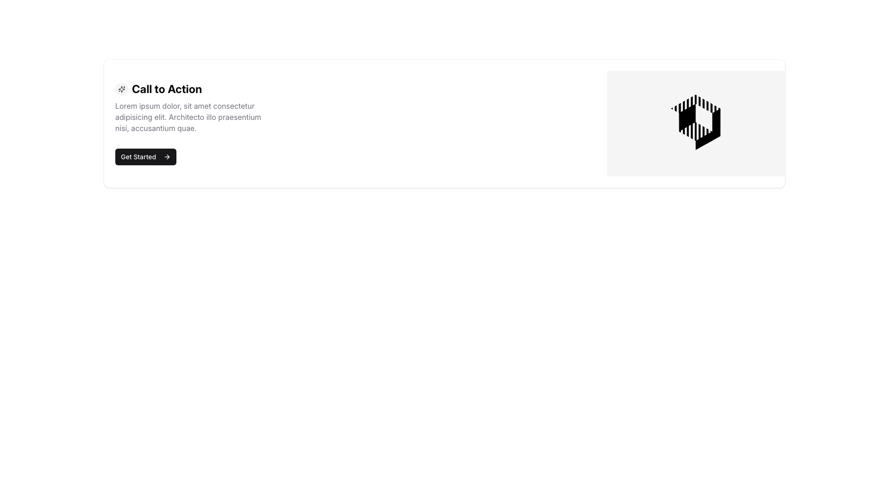

A horizontal banner section with two columns: the left column contains a heading, body text, and a button stacked vertically, while the right column displays an image positioned on a light gray background. The layout uses a left-aligned text arrangement with the interactive elements below the heading.

**Install**: `pnpm dlx shadcn add @shadcnblocks/cta1`

---

## cta3

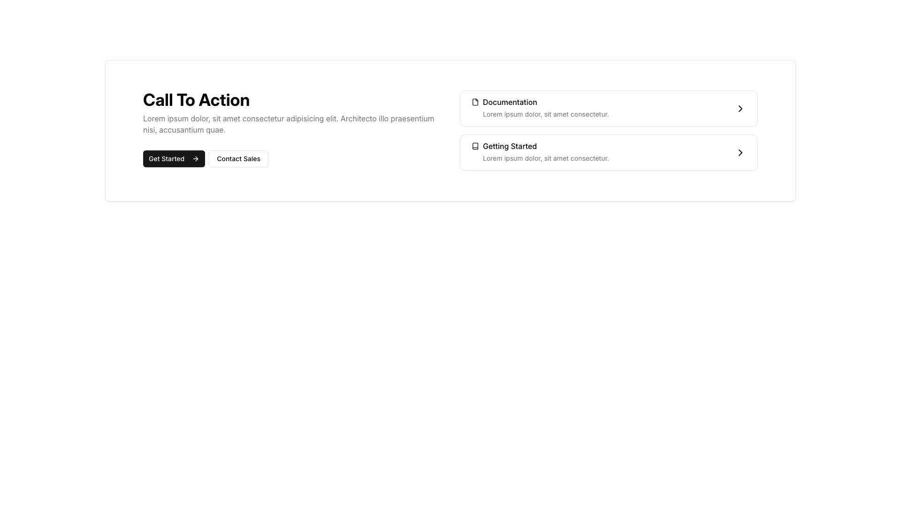

A page section displays content in two columns with a left-aligned layout. The left column contains a main heading, body text, and two horizontally-aligned buttons below. The right column features two vertically-stacked content cards, each with a label, descriptive text, and a right-aligned arrow icon.

**Install**: `pnpm dlx shadcn add @shadcnblocks/cta3`

---

## cta4

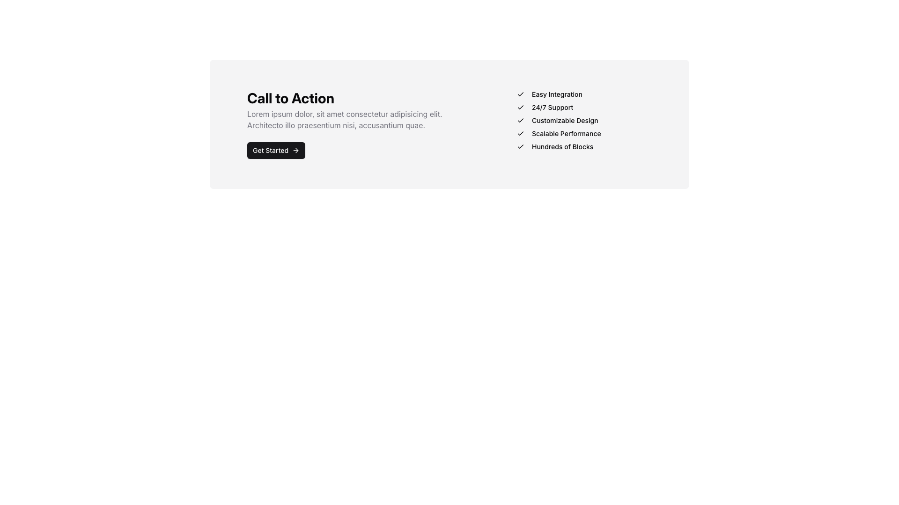

A section displays content in two columns within a light gray background. The left column contains a heading, two lines of body text, and a button below. On the right side, a vertical list of five checkmark labels is aligned to the right edge of the container.

**Install**: `pnpm dlx shadcn add @shadcnblocks/cta4`

---

## cta5

A horizontal banner section is divided into two columns with a light gray background. On the left side is a centered image. The right column contains a heading, body text, and a button positioned vertically below the text.

**Install**: `pnpm dlx shadcn add @shadcnblocks/cta5`

---

## cta6

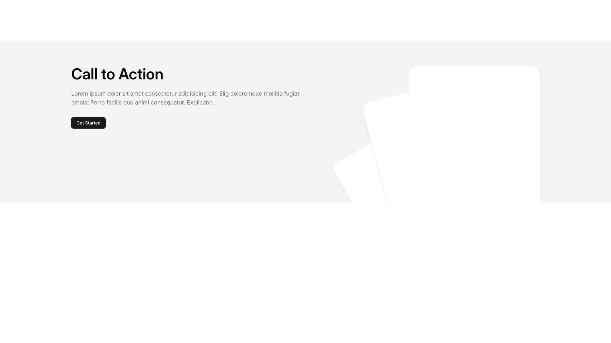

A section displays content in two columns with a left-aligned layout. The left column contains a heading, body text, and a button positioned vertically. The right column features a large image placeholder spanning the full height, positioned on the right side of the section.

**Install**: `pnpm dlx shadcn add @shadcnblocks/cta6`

---

## cta7

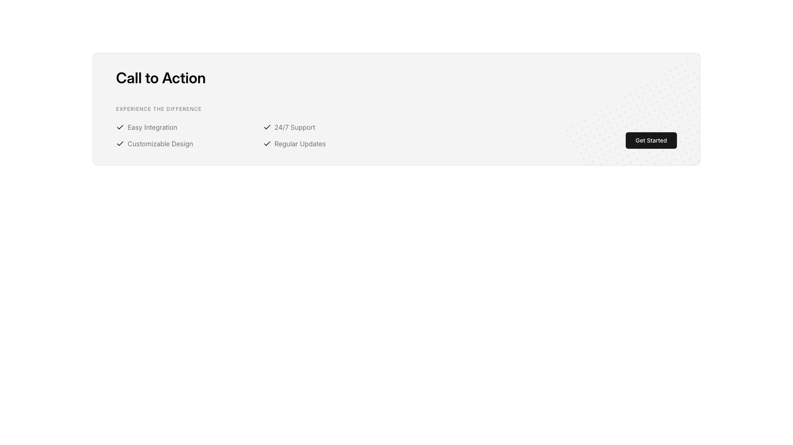

A light gray section displays a "Call to Action" heading at the top left, followed by a subtitle label. Below, four feature items are arranged in two columns on the left side, each marked with a checkmark. On the right side, a black button is positioned vertically aligned with the content.

**Install**: `pnpm dlx shadcn add @shadcnblocks/cta7`

---

## cta10

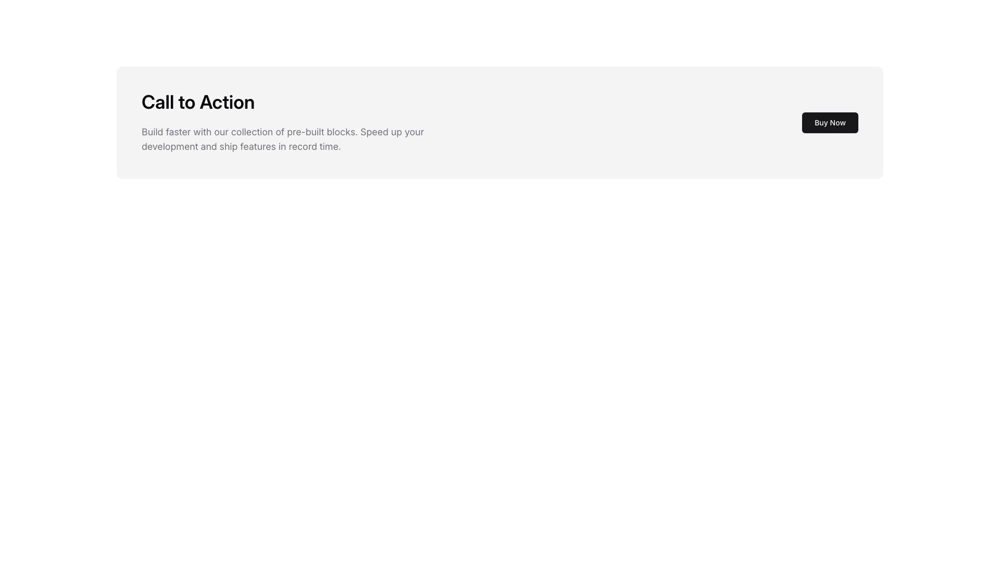

A horizontal banner section with a light gray background contains text content on the left and a button on the right. The left side displays a heading followed by body text, while a dark "Buy Now" button is positioned on the far right side of the section.

**Install**: `pnpm dlx shadcn add @shadcnblocks/cta10`

---

## cta11

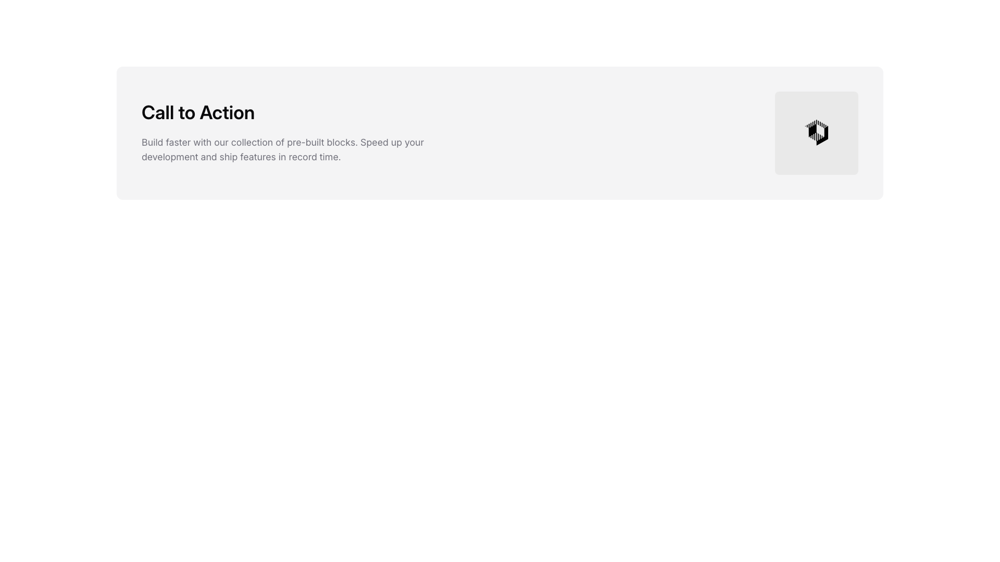

A horizontal banner section contains text content on the left and an image on the right. The left side displays a heading, followed by body text beneath it. On the right side, a small image is positioned within a light gray rectangular container.

**Install**: `pnpm dlx shadcn add @shadcnblocks/cta11`

---

## cta12

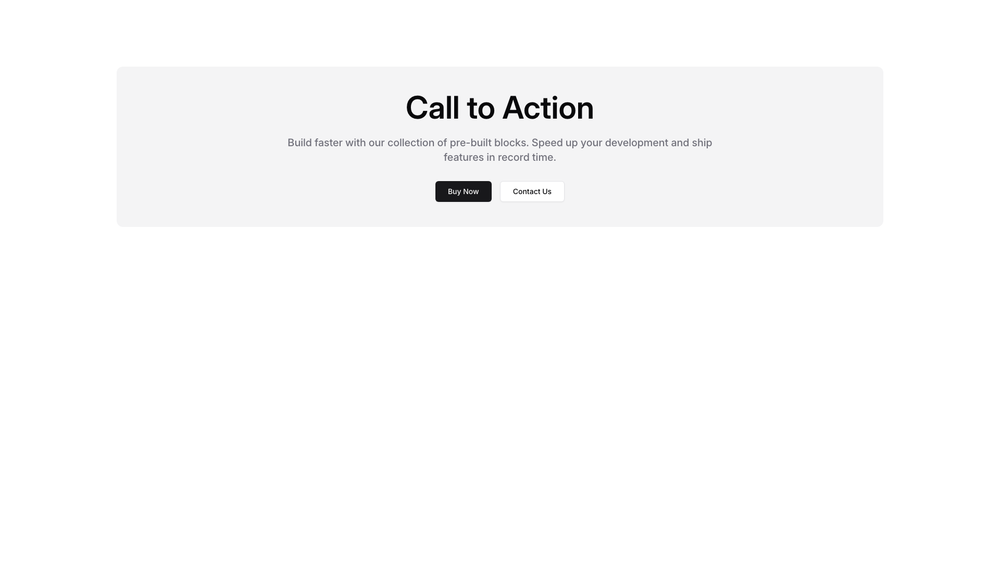

A centered section displays vertically stacked content on a light gray background. At the top is a large heading, followed by body text below it. Horizontally aligned at the bottom are two buttons positioned side-by-side.

**Install**: `pnpm dlx shadcn add @shadcnblocks/cta12`

---

## cta13

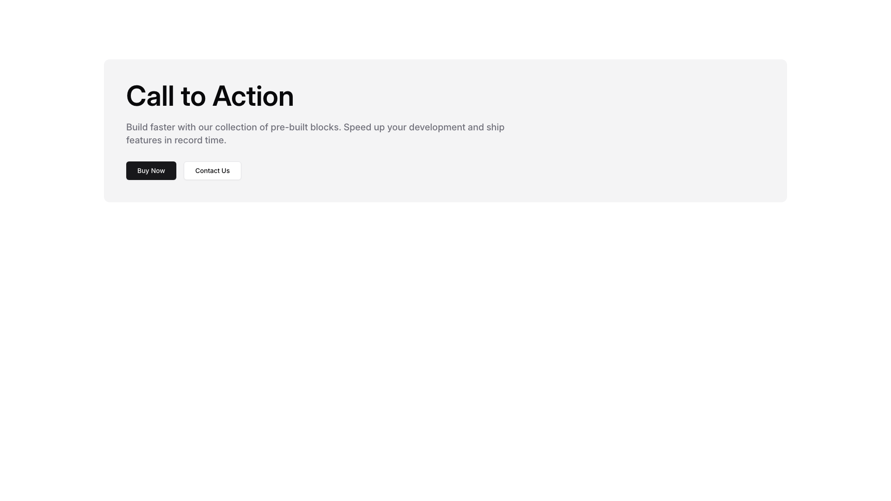

A full-width section contains vertically stacked content aligned to the left. At the top is a large heading, followed by body text below it. Horizontally beneath the text are two buttons positioned side-by-side. The entire section is contained within a light gray background.

**Install**: `pnpm dlx shadcn add @shadcnblocks/cta13`

---

## cta14

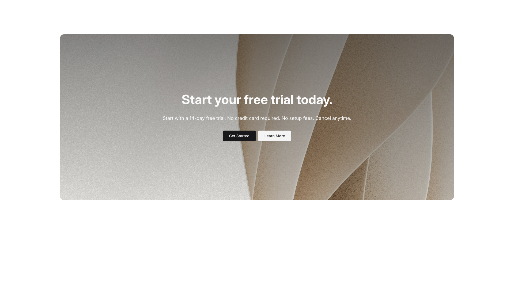

A full-width hero section features a centered layout with a main heading, body text, and two horizontally-aligned buttons positioned below. An image spans the entire background of the section.

**Install**: `pnpm dlx shadcn add @shadcnblocks/cta14`

---

## cta15

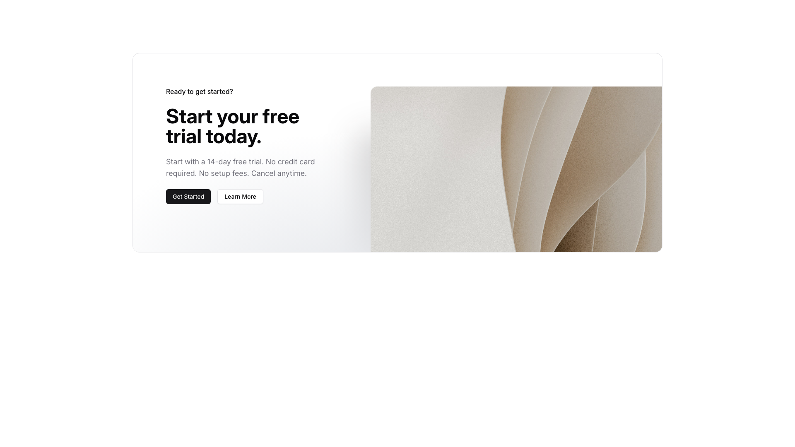

A horizontal section is divided into two columns with equal spacing. The left column contains a small label, a large heading, body text describing trial details, and two buttons positioned below. The right column displays a large image that spans the full height of the section.

**Install**: `pnpm dlx shadcn add @shadcnblocks/cta15`

---

## cta16

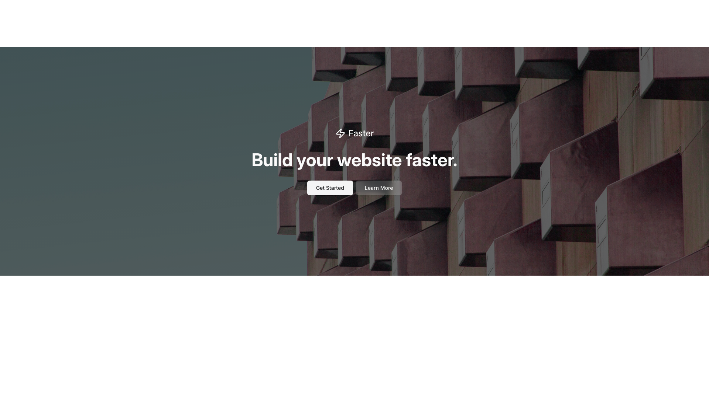

A hero section features a centered layout with a small label at the top, followed by a large heading and body text stacked vertically. Below the text, two buttons are positioned horizontally side-by-side. An image spans the full width behind all elements, creating a background layer.

**Install**: `pnpm dlx shadcn add @shadcnblocks/cta16`

---

## cta17

A centered section displays vertically stacked content with a heading at the top, followed by body text. Below the text are two horizontally aligned buttons positioned side-by-side in the center of the layout.

**Install**: `pnpm dlx shadcn add @shadcnblocks/cta17`

---

## cta18

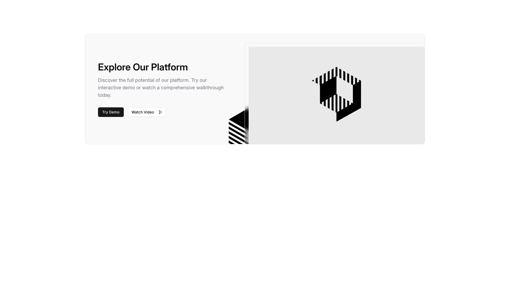

A horizontal section displays content in two columns. The left column contains a heading, body text, and two buttons arranged vertically. The right column features a large image positioned on a light gray background, with the image extending slightly into the left column.

**Install**: `pnpm dlx shadcn add @shadcnblocks/cta18`

---

## cta19

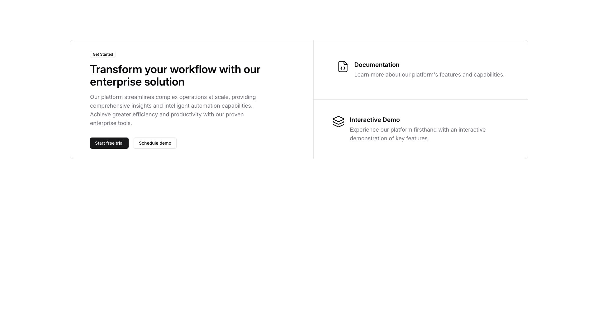

A two-column layout with a "Get Started" label at the top. The left column contains a main heading, body text, and two buttons positioned horizontally below. The right column displays two stacked cards, each with an icon, a title, and descriptive text.

**Install**: `pnpm dlx shadcn add @shadcnblocks/cta19`

---

## cta20

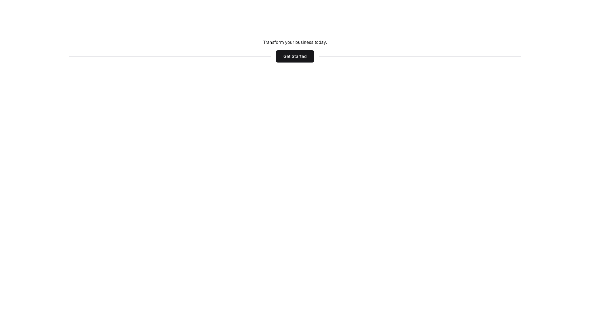

A centered layout displaying a heading at the top, followed by body text positioned directly below it. A button is placed underneath the text, all vertically aligned in the center of the section.

**Install**: `pnpm dlx shadcn add @shadcnblocks/cta20`

---

## cta21

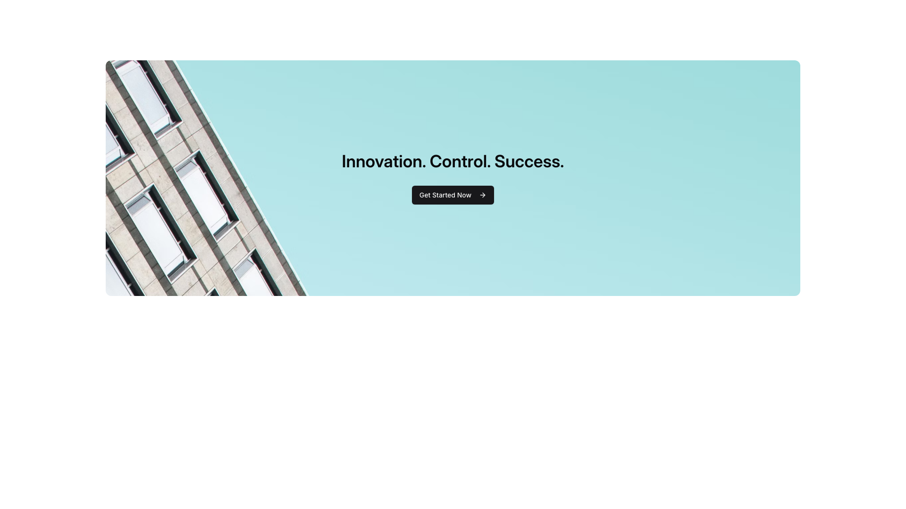

A hero section displays content across two columns with a light background. On the left side, an image spans the column vertically. The right column contains centered text with a heading, followed by a call-to-action button positioned below.

**Install**: `pnpm dlx shadcn add @shadcnblocks/cta21`

---

## cta22

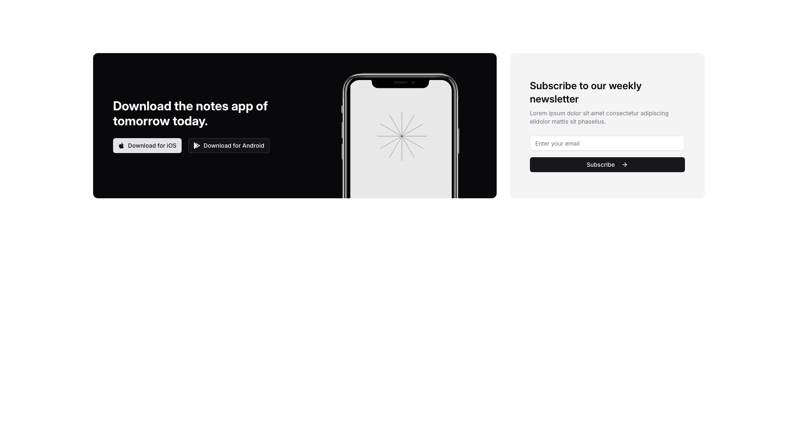

A two-column layout with a left section containing a heading, body text, and two download buttons positioned horizontally. On the right side, an image of a smartphone is displayed. To the far right, a separate vertical section contains a heading, descriptive body text, an email input field, and a subscribe button stacked vertically.

**Install**: `pnpm dlx shadcn add @shadcnblocks/cta22`

---

## cta23

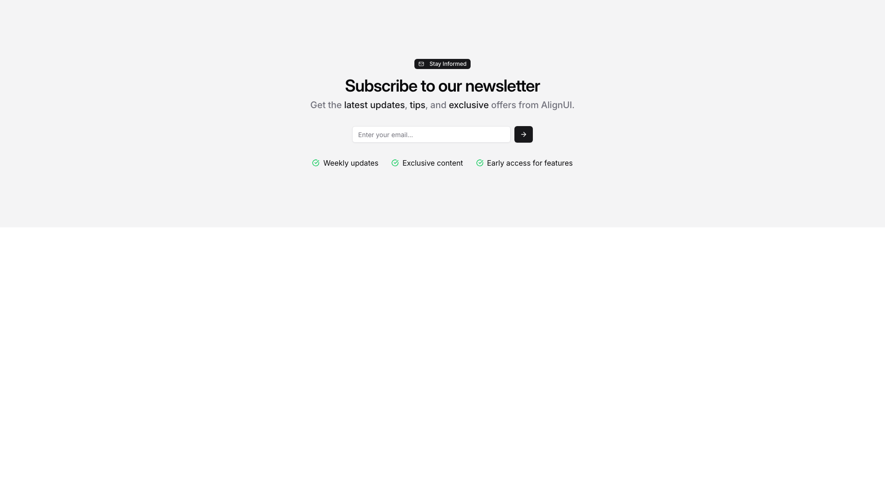

A centered newsletter subscription section contains a label at the top, followed by a main heading and body text. Below is a horizontally aligned email input field with a submit button on the right. Three benefit labels are displayed horizontally at the bottom of the section.

**Install**: `pnpm dlx shadcn add @shadcnblocks/cta23`

---

## cta27

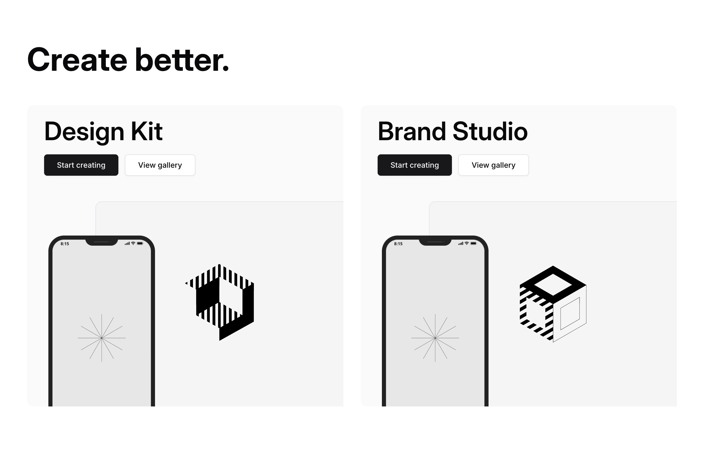

A webpage section displays a main heading at the top, followed by two equally-sized columns positioned horizontally. Each column contains a subheading, two buttons aligned left, and an image positioned below. The left and right columns mirror each other's layout structure.

**Install**: `pnpm dlx shadcn add @shadcnblocks/cta27`

---

## cta30

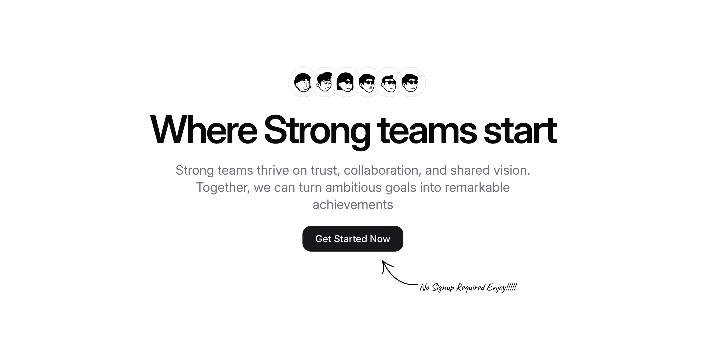

A centered webpage section features an image at the top, followed by a large heading, body text, and a button arranged vertically. Below the button, there is a label with an arrow pointing upward. All elements are horizontally centered on the page.

**Install**: `pnpm dlx shadcn add @shadcnblocks/cta30`

---

## cta31

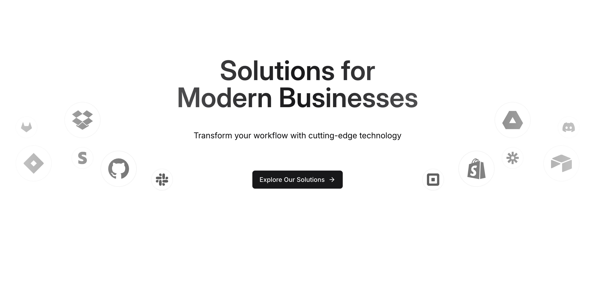

A centered hero section displays a main heading and subheading stacked vertically, followed by body text and a call-to-action button positioned below. Decorative icons are scattered horizontally around the edges of the layout on both left and right sides.

**Install**: `pnpm dlx shadcn add @shadcnblocks/cta31`

---
