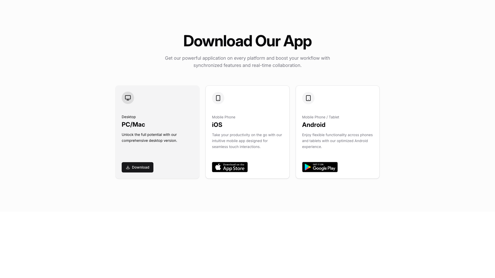
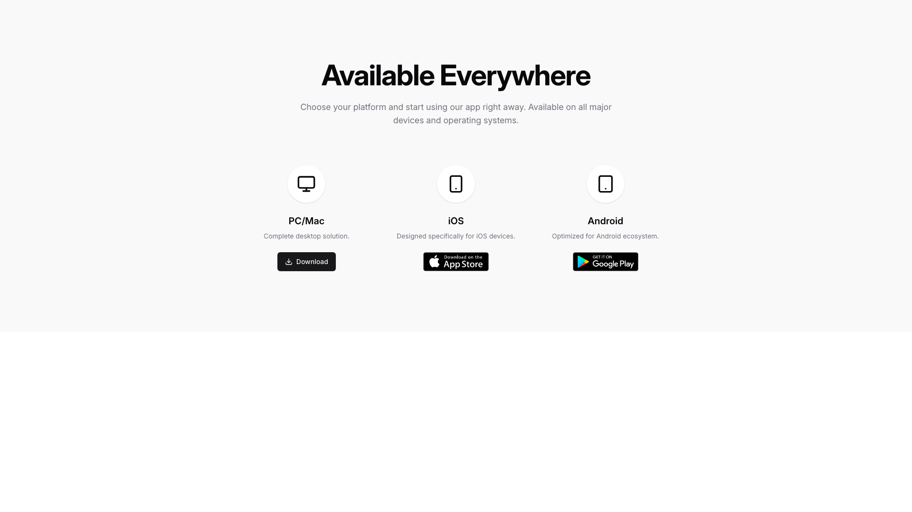
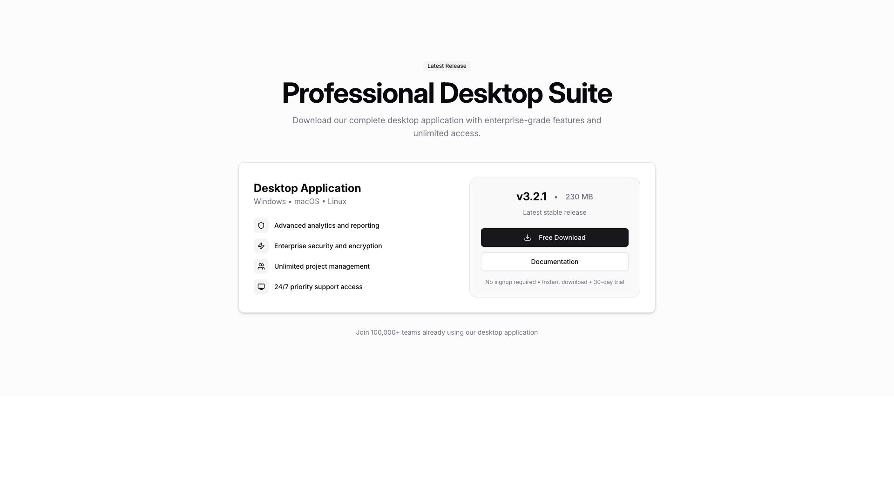
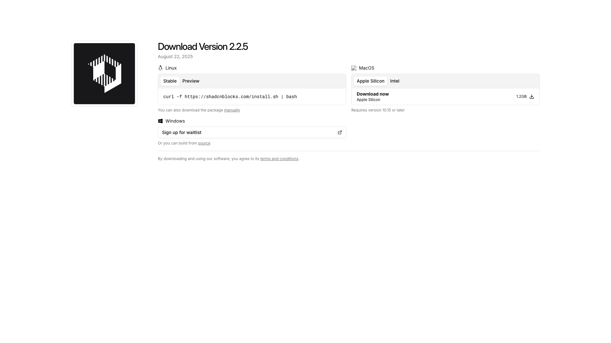
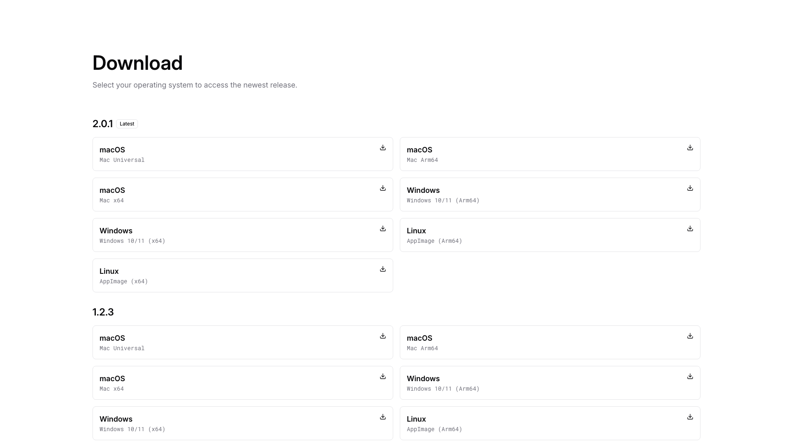
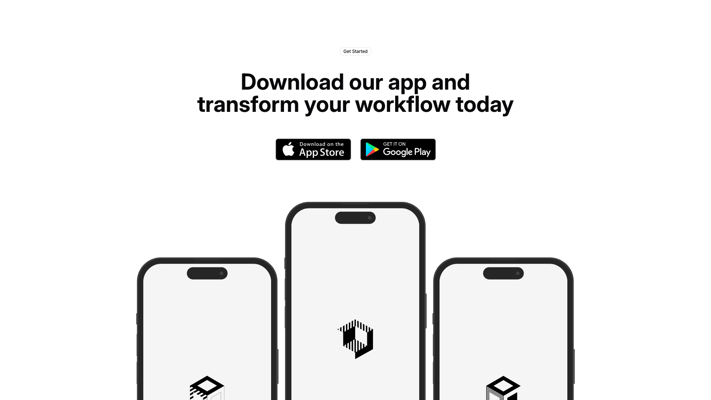
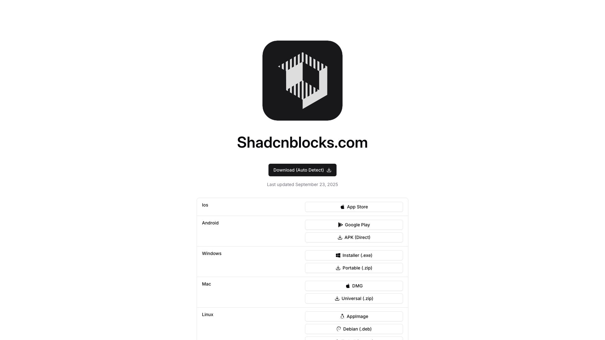
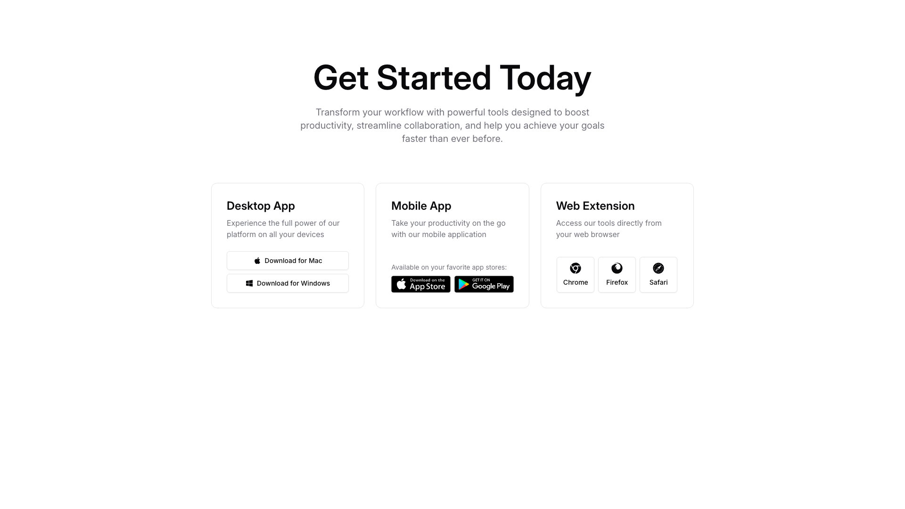
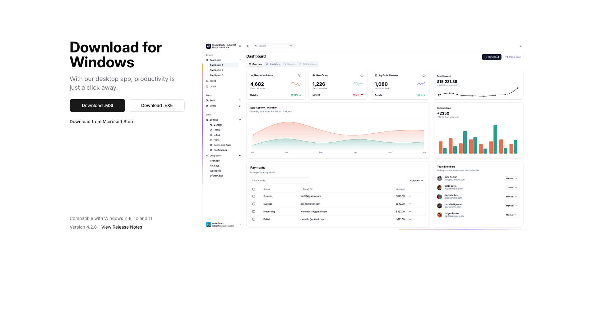

# Download Blocks (11)

Download sections for files, apps, and digital resources. Feature product downloads and installation instructions.

---

## download1

A centered section with a main heading and descriptive body text at the top. Below this, three cards are arranged horizontally, each containing a label, title, body text, and a button or badge positioned at the bottom. The cards are evenly spaced across the layout.

**Install**: `pnpm dlx shadcn add @shadcnblocks/download1`

---

## download2

A centered section displays a main heading at the top, followed by body text. Below this are three vertically stacked columns, each containing an image, a label, descriptive text, and a button, arranged horizontally across the layout.

**Install**: `pnpm dlx shadcn add @shadcnblocks/download2`

---

## download3

A centered section displays a download card with vertically stacked content. The top contains a heading, subheading, and system requirements list with checkmarks. Below this are two horizontally aligned buttons, with additional small text centered underneath. At the bottom is a trust statement in smaller body text.

**Install**: `pnpm dlx shadcn add @shadcnblocks/download3`

---

## download4

A centered webpage section displays a main heading at the top, followed by body text. Below this, a card layout contains two columns: the left column has a smaller heading, subheading, and four feature items with icons and descriptions. The right column contains a version number, file size label, a button, and additional text links stacked vertically. At the bottom, centered body text appears below the card.

**Install**: `pnpm dlx shadcn add @shadcnblocks/download4`

---

## download5

A download page layout with two main sections positioned side-by-side. On the left, an image is centered above a heading, followed by tabs, installation command text, and additional download options. On the right, platform-specific download information is displayed vertically, with a download button and system requirements text positioned below a heading and labels.

**Install**: `pnpm dlx shadcn add @shadcnblocks/download5`

---

## download6

A download page displays version 2.0.1 as the latest release, with operating system options arranged in a two-column grid layout. Each row contains a label for an operating system (macOS, Windows, or Linux) on the left, followed by a download button on the right. Below this section, version 1.2.3 is presented in an identical two-column grid format with the same operating system options and download buttons.

**Install**: `pnpm dlx shadcn add @shadcnblocks/download6`

---

## download7

A centered section displays a heading followed by body text at the top. Below this, two app store buttons are positioned horizontally side-by-side. Further down, three smartphone mockups are arranged horizontally across the bottom, with the center device slightly larger than the ones on either side.

**Install**: `pnpm dlx shadcn add @shadcnblocks/download7`

---

## download8

A centered layout displays an app download page with a logo image at the top, followed by a heading and download button. Below this, a table structure is organized vertically with platform categories (iOS, Android, Windows, Mac, Linux) listed on the left column, each with corresponding download options and buttons aligned to the right.

**Install**: `pnpm dlx shadcn add @shadcnblocks/download8`

---

## download9

A two-column layout with text content on the left and an image on the right. The left column contains a main heading, descriptive body text, a bulleted list of four features, and two action buttons positioned horizontally. The right column displays a centered image within a light gray background area. Below both columns, a "Available on" label is followed by a horizontal row of platform icons centered on the page.

**Install**: `pnpm dlx shadcn add @shadcnblocks/download9`

---

## download10

A centered webpage section with a main heading at the top, followed by body text. Below this are three horizontally aligned card blocks, each containing a title, descriptive text, and download buttons or platform icons arranged vertically within their respective cards.

**Install**: `pnpm dlx shadcn add @shadcnblocks/download10`

---

## download11

A two-column layout with a left sidebar and a main content area. The left column contains a heading, body text, and two download buttons stacked vertically, followed by additional text and a version note at the bottom. The right column displays a dashboard interface with a navigation menu on the far left, followed by multiple data visualization cards and tables arranged in a grid layout across the remaining space.

**Install**: `pnpm dlx shadcn add @shadcnblocks/download11`

---
