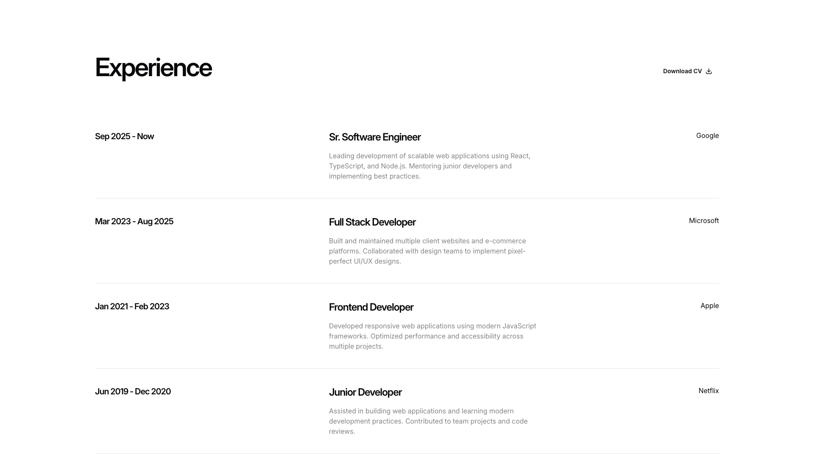
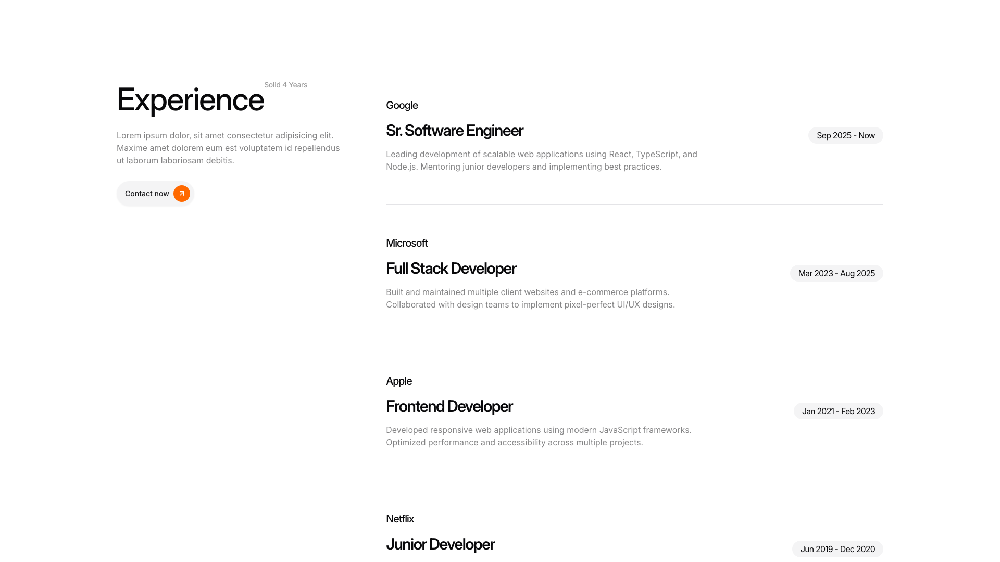
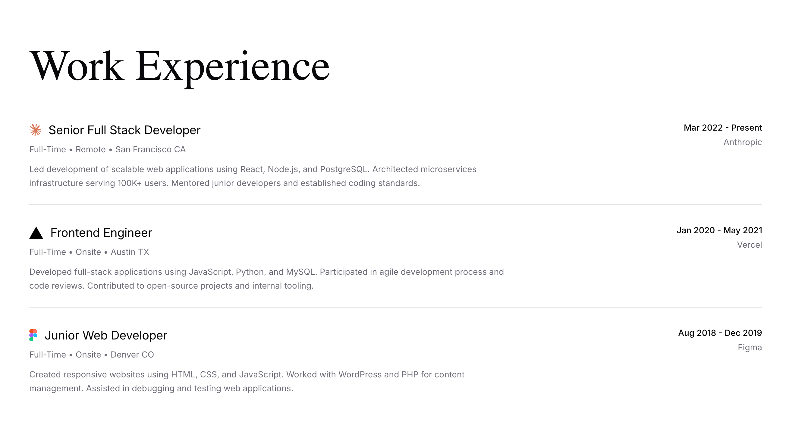

# Experience Blocks (4)

Experience showcases and interactive demonstrations. Highlight product features through engaging presentations.

---

## experience1

A vertical experience section displays four job entries stacked chronologically. Each entry is organized in a three-column layout: the left column contains date ranges as labels, the center column holds job titles and descriptive body text, and the right column displays company names. A "Download CV" button with an icon is positioned in the top right corner of the section.

**Install**: `pnpm dlx shadcn add @shadcnblocks/experience1`

---

## experience2

A two-column layout displays an "Experience" section with a left sidebar and main content area. The left column contains a heading, body text, and a labeled button. The right column presents a vertically stacked list of job entries, each with a company name, job title, date range positioned on the right, and descriptive body text below.

**Install**: `pnpm dlx shadcn add @shadcnblocks/experience2`

---

## experience3

A resume section displays experience entries in a two-column layout. The left column contains job titles as headings with accompanying body text descriptions, while the right column shows corresponding period dates aligned to the top. A "Download Resume" button with an icon is positioned in the upper right corner, with a last update date displayed below it.

**Install**: `pnpm dlx shadcn add @shadcnblocks/experience3`

---

## experience5

A work experience section displays three job entries arranged vertically. Each entry contains a job title and icon on the left, followed by employment details and company name on the right. Below each header, body text describes responsibilities and skills, with the date range and company name positioned in the top right corner of each entry.

**Install**: `pnpm dlx shadcn add @shadcnblocks/experience5`

---
