# Faq Blocks (16)

Frequently asked questions accordions and lists. Provide quick answers to common user inquiries.

---

## faq1

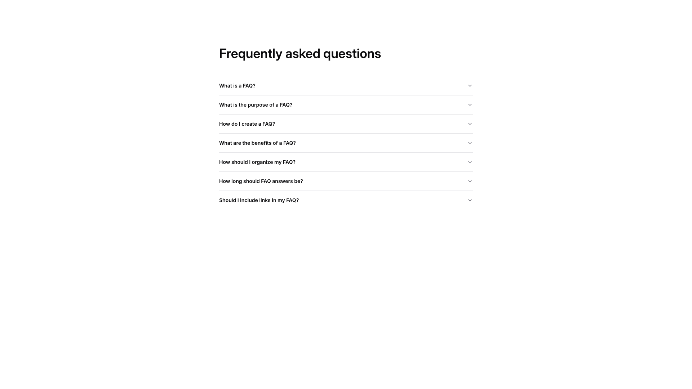

A vertically stacked FAQ section displays a centered heading at the top, followed by seven expandable question items arranged in a single column. Each question item is a clickable label with a dropdown icon positioned on the right side.

**Install**: `pnpm dlx shadcn add @shadcnblocks/faq1`

---

## faq2

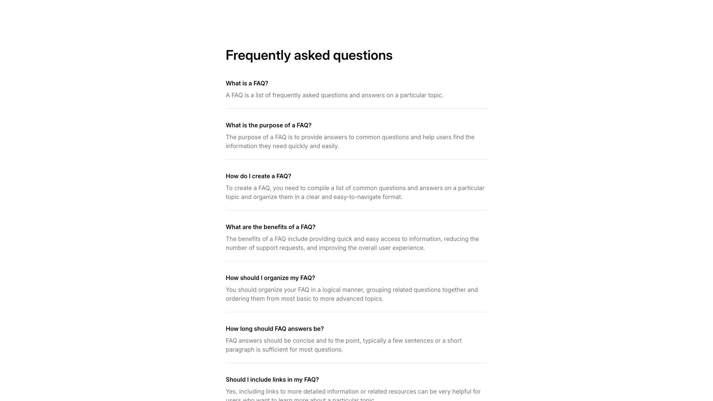

A webpage section displays a centered main heading at the top, followed by a vertically stacked list of question-and-answer pairs. Each pair consists of a bold question label positioned above body text containing the answer. The entire content is organized in a single column format with consistent spacing between each Q&A item.

**Install**: `pnpm dlx shadcn add @shadcnblocks/faq2`

---

## faq3

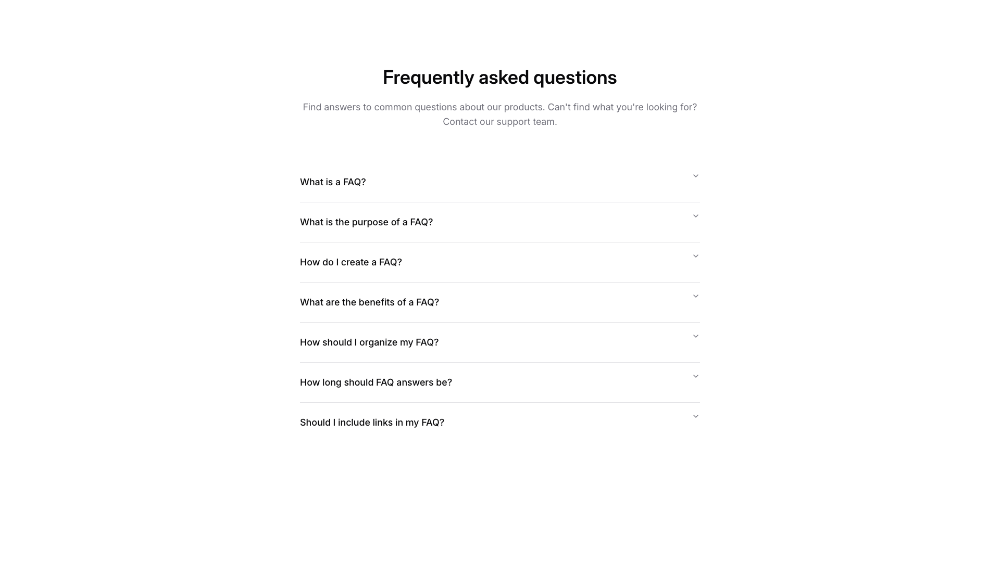

A vertically stacked FAQ section is centered on the page. At the top, a main heading is followed by two lines of body text. Below this introduction, seven accordion-style questions are arranged vertically, each expandable with a toggle button positioned on the right side of each question label.

**Install**: `pnpm dlx shadcn add @shadcnblocks/faq3`

---

## faq4

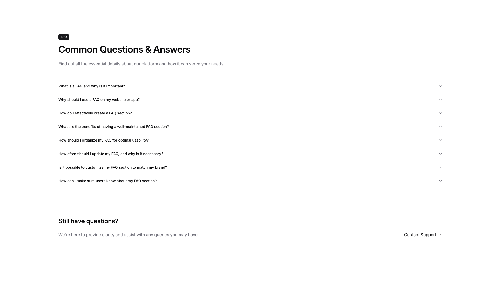

A FAQ section displays a main heading centered at the top, followed by subheading text. Below this, eight expandable question items are stacked vertically in a single column. At the bottom, a new section contains a heading on the left with accompanying body text, and a "Contact Support" link positioned on the right.

**Install**: `pnpm dlx shadcn add @shadcnblocks/faq4`

---

## faq5

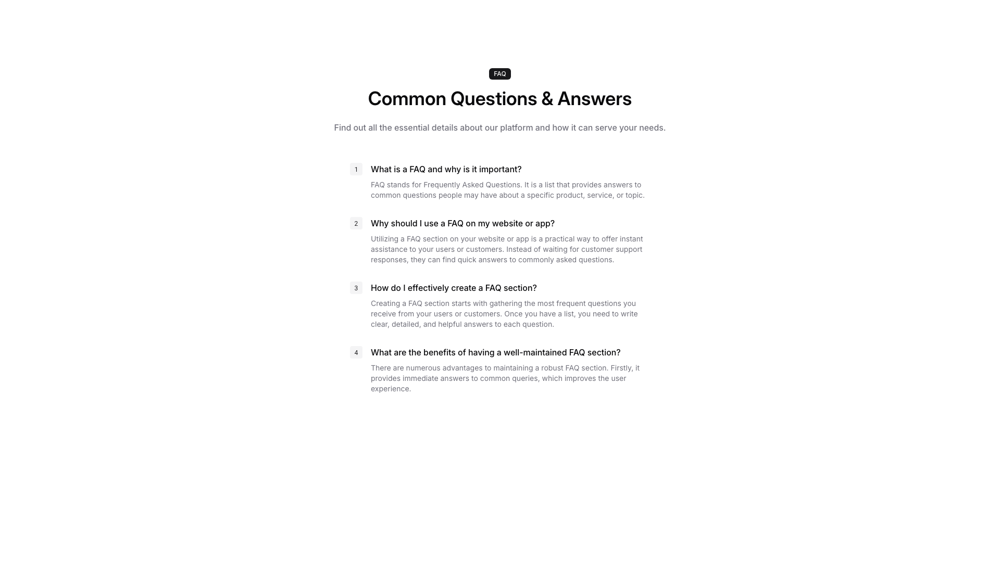

A FAQ section is centered on the page with a label, main heading, and descriptive body text at the top. Below this introduction, four numbered questions and answers are vertically stacked, with each question displayed as a bold heading followed by accompanying explanatory text.

**Install**: `pnpm dlx shadcn add @shadcnblocks/faq5`

---

## faq6

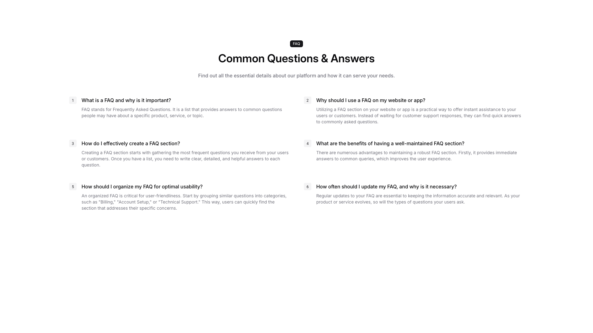

A FAQ section displays content in a two-column grid layout. At the top, a centered label, heading, and descriptive body text are stacked vertically. Below this, six question-and-answer pairs are arranged in two columns with three rows, each containing a numbered item, a question heading, and supporting body text.

**Install**: `pnpm dlx shadcn add @shadcnblocks/faq6`

---

## faq7

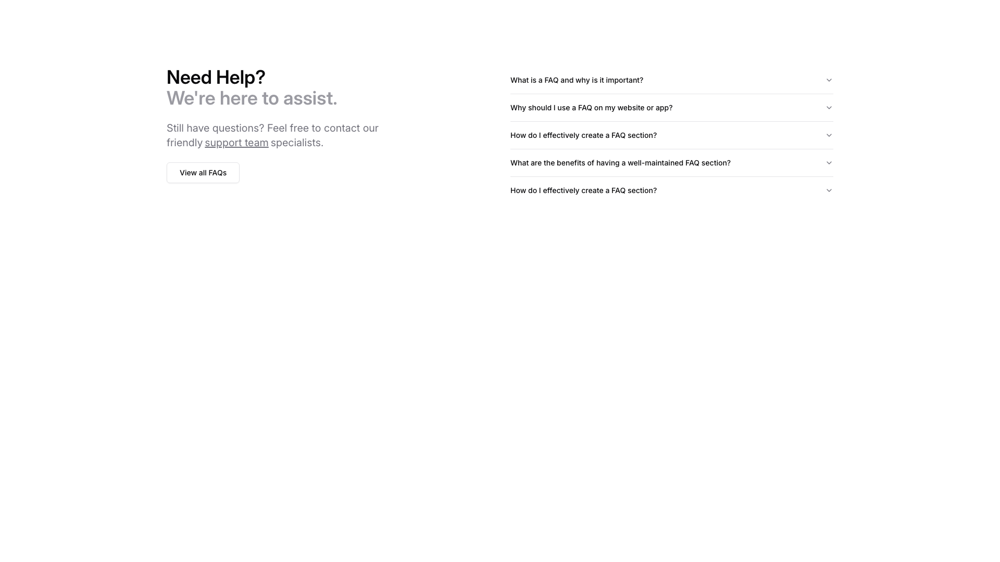

A two-column layout with a left sidebar and right content area. The left column contains a main heading, subheading, body text, and a button stacked vertically. The right column displays a series of expandable accordion-style questions arranged vertically, each with a dropdown arrow indicator.

**Install**: `pnpm dlx shadcn add @shadcnblocks/faq7`

---

## faq8

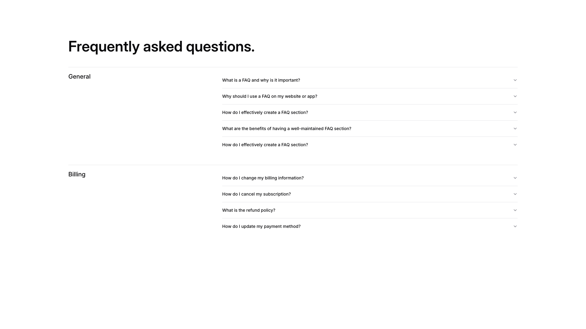

A webpage section displays a FAQ layout organized vertically into two category groups. On the left side, category labels ("General" and "Billing") are positioned as headers, with expandable question items listed to the right of each category. Each question item has a chevron button aligned to the far right for expanding/collapsing content.

**Install**: `pnpm dlx shadcn add @shadcnblocks/faq8`

---

## faq9

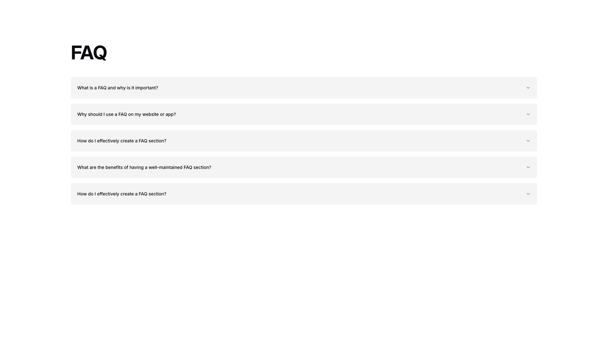

A FAQ section displays a vertical stack of collapsible accordion items. Each accordion item contains a question label aligned to the left with a chevron icon positioned on the right. The items are evenly spaced and span the full width of the container.

**Install**: `pnpm dlx shadcn add @shadcnblocks/faq9`

---

## faq10

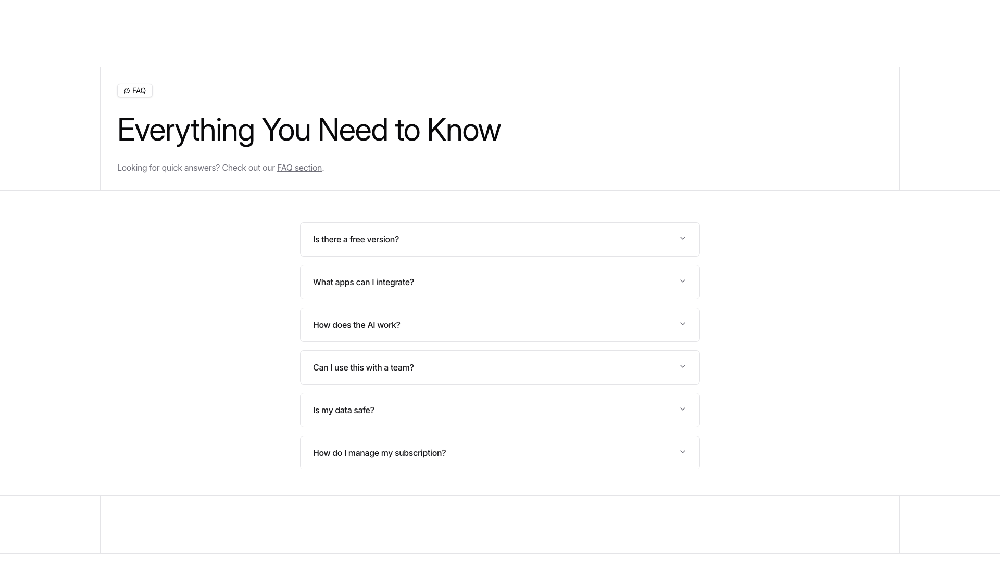

A FAQ section displays a main heading centered at the top, followed by body text with a linked reference. Below this, six expandable question items are stacked vertically in a single column, each with a question label and a dropdown indicator on the right side.

**Install**: `pnpm dlx shadcn add @shadcnblocks/faq10`

---

## faq11

A support page layout with two main columns. The left column contains a large heading, body text, and a "get in touch" link. The right column displays a "Support" section header followed by multiple expandable FAQ items organized under three category headings: "Support," "Your account," and "Other questions." Each category contains accordion-style question buttons.

**Install**: `pnpm dlx shadcn add @shadcnblocks/faq11`

---

## faq12

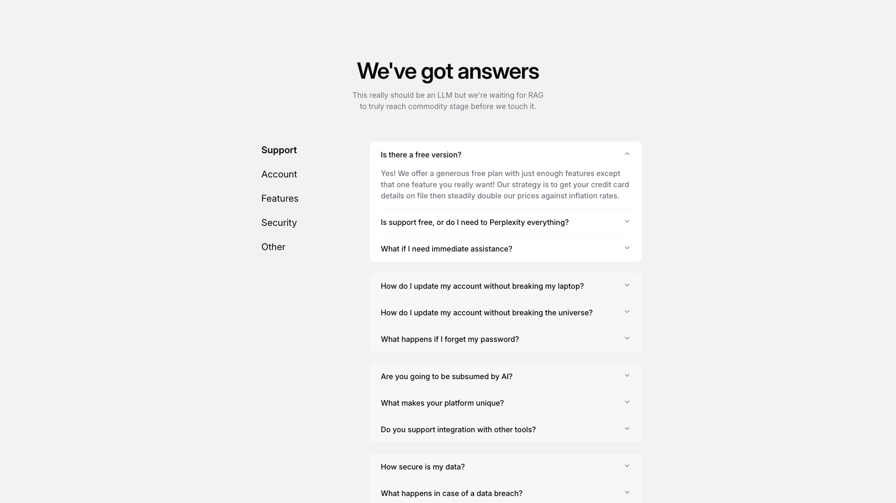

A FAQ section is structured in two columns. The left column contains a main heading, subtitle text, and a vertical list of category labels. The right column displays an accordion-style list of expandable questions, with the first question expanded to show body text below it.

**Install**: `pnpm dlx shadcn add @shadcnblocks/faq12`

---

## faq14

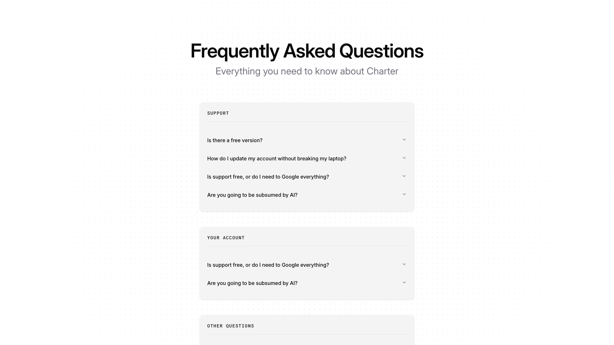

A vertically stacked FAQ section with a centered main heading, subtitle, and three content categories. Each category contains collapsible question items arranged vertically, with expandable sections labeled "SUPPORT," "YOUR ACCOUNT," and "OTHER QUESTIONS" positioned sequentially down the page.

**Install**: `pnpm dlx shadcn add @shadcnblocks/faq14`

---

## faq15

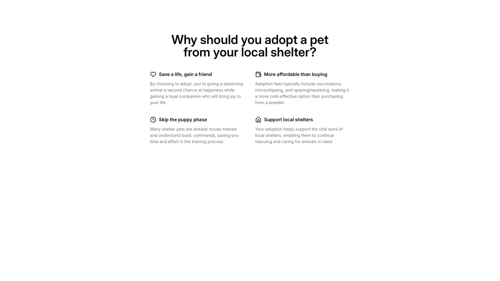

A centered section displays a main heading at the top, followed by four content blocks arranged in a 2x2 grid layout. Each block contains a small icon on the left, a bold subheading, and body text describing the benefit of pet adoption from a shelter.

**Install**: `pnpm dlx shadcn add @shadcnblocks/faq15`

---

## faq16

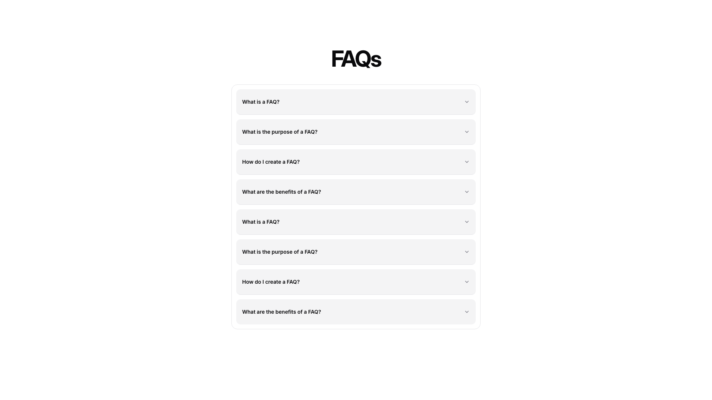

A vertically stacked FAQ section is centered on the page, with a heading at the top. Below the heading, eight expandable accordion items are arranged in a single column, each containing a question label with a dropdown arrow positioned on the right side.

**Install**: `pnpm dlx shadcn add @shadcnblocks/faq16`

---

## faq17

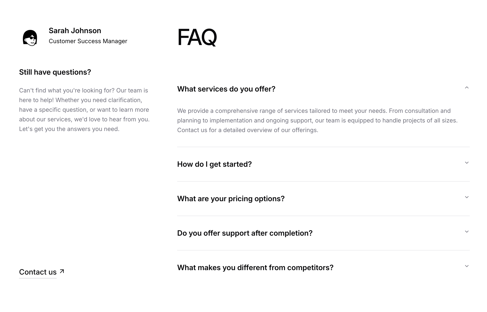

A two-column FAQ layout with the left column containing a profile image, name, title, a heading, body text, and a contact link. The right column displays a large "FAQ" heading followed by five expandable question sections stacked vertically, with the first question expanded to show answer text.

**Install**: `pnpm dlx shadcn add @shadcnblocks/faq17`

---
