# Feature Blocks (257)

Feature grids, comparisons, and showcases for product capabilities. Highlight key functionality and benefits.

---

## feature1

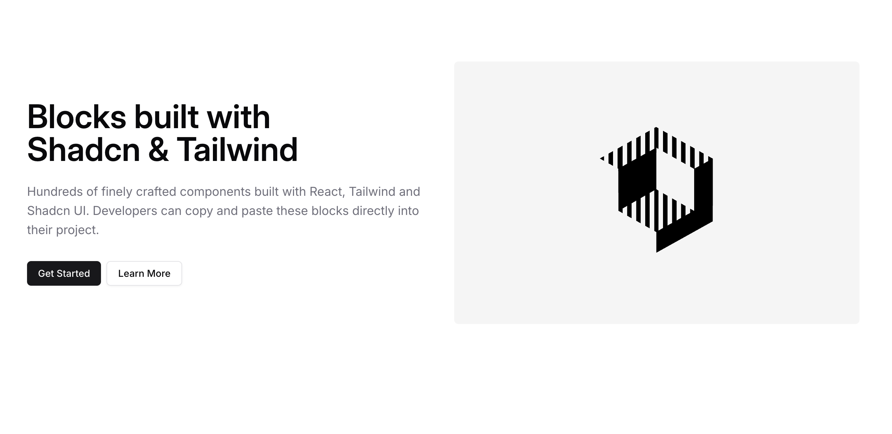

A hero section displays content in two columns with left and right alignment. The left column contains a main heading, body text describing components, and two buttons positioned horizontally. On the right side, a large image is centered within its column area.

**Install**: `pnpm dlx shadcn add @shadcnblocks/feature1`

---

## feature2

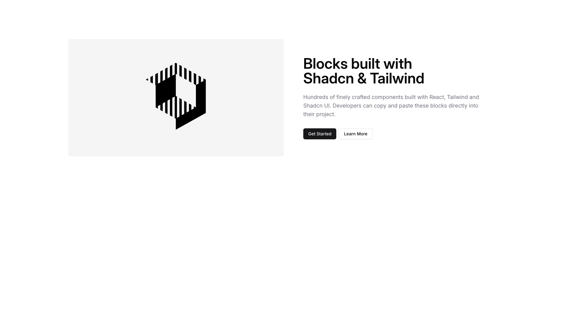

A two-column layout with an image positioned on the left side and text content on the right. The right column contains a heading, body text, and two horizontally-aligned buttons below the descriptive text.

**Install**: `pnpm dlx shadcn add @shadcnblocks/feature2`

---

## feature3

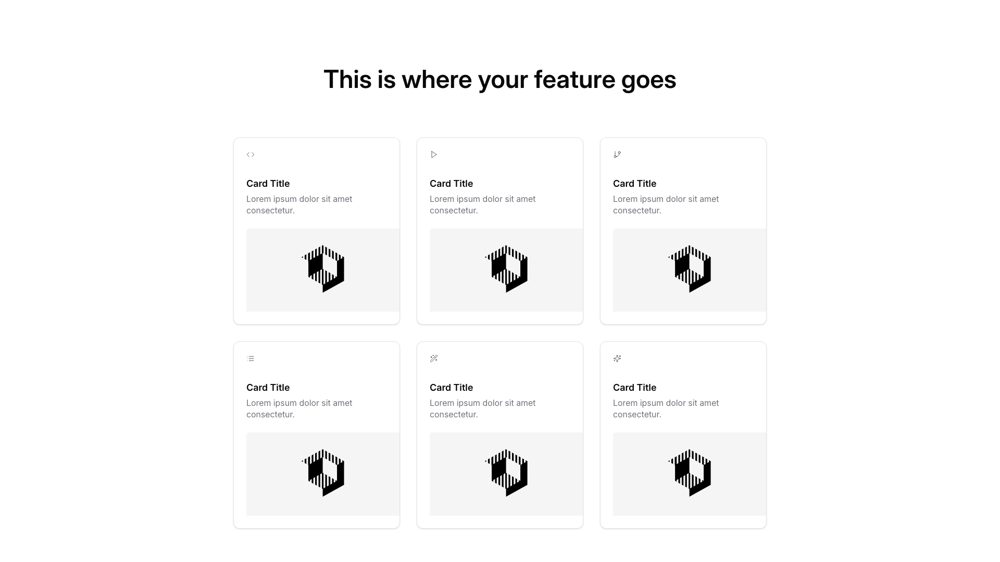

A section displays a centered heading at the top, followed by a 3x2 grid of cards arranged horizontally. Each card contains an icon at the top left, a card title, body text, and a centered image positioned below the text.

**Install**: `pnpm dlx shadcn add @shadcnblocks/feature3`

---

## feature4

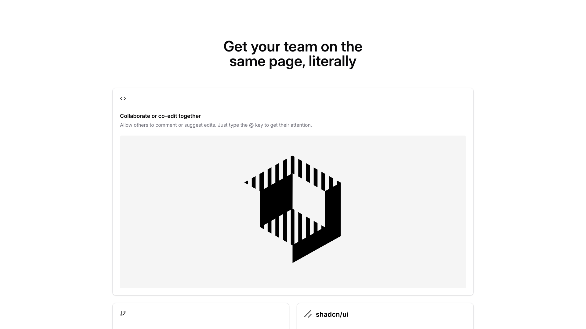

A centered section displays a main heading at the top, followed by a subheading and descriptive body text. Below this text is a large image centered within a light gray background container. At the bottom of the section, two elements are positioned horizontally: a small icon on the left and a label with a forward slash on the right.

**Install**: `pnpm dlx shadcn add @shadcnblocks/feature4`

---

## feature5

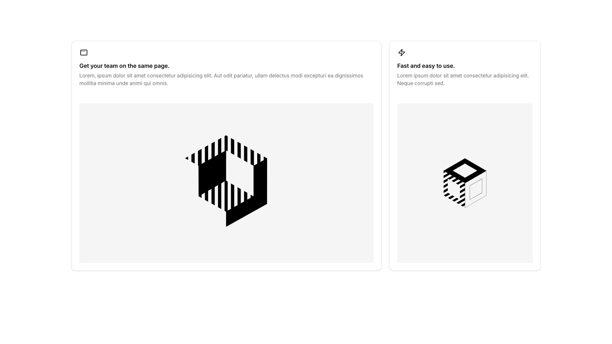

A two-column layout displaying feature cards side by side. Each card contains a heading, body text, and an image centered below. The left card features a heading with an icon, while the right card has a similar structure with a different icon. Both images are positioned centrally within their respective card sections.

**Install**: `pnpm dlx shadcn add @shadcnblocks/feature5`

---

## feature6

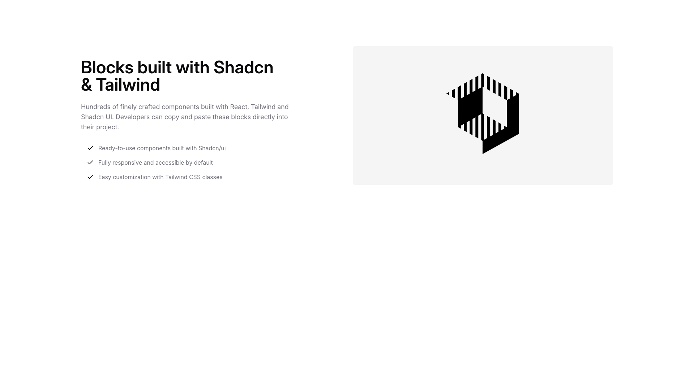

A section displays content in two columns with left and right alignment. The left column contains a main heading, body text, and three bullet points with checkmarks. On the right side, a light gray background area contains a centered image.

**Install**: `pnpm dlx shadcn add @shadcnblocks/feature6`

---

## feature7

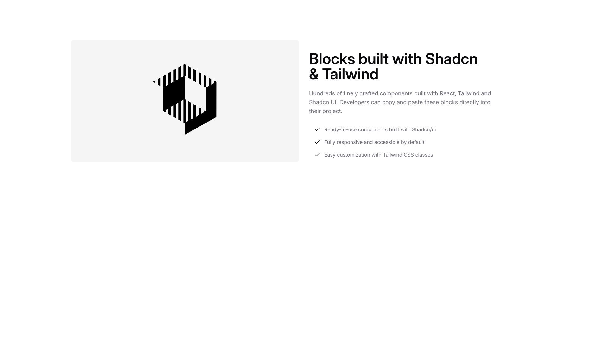

A two-column layout section with an image positioned on the left and text content on the right. The right column contains a main heading, body text describing the product, and three bullet points with checkmarks listing key features.

**Install**: `pnpm dlx shadcn add @shadcnblocks/feature7`

---

## feature8

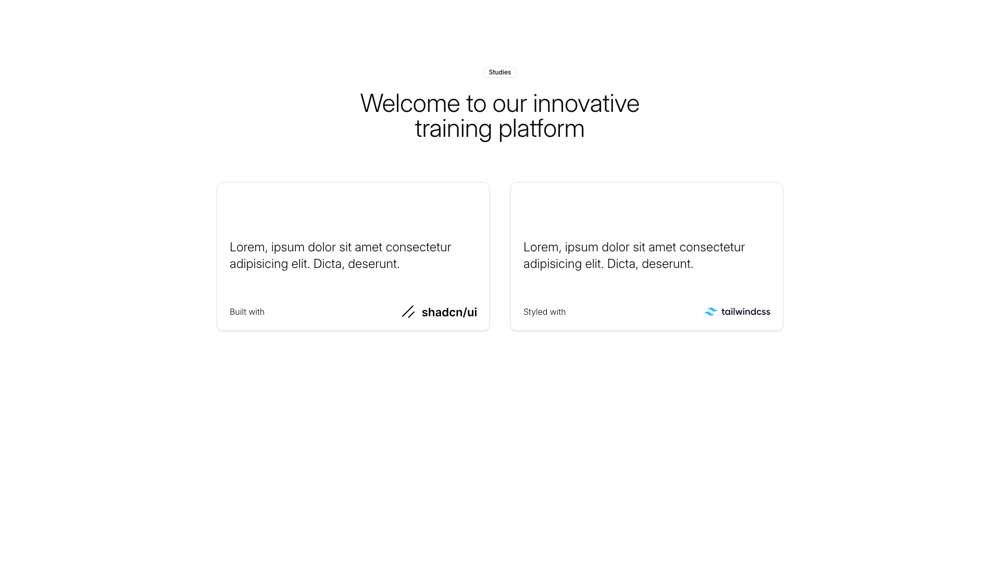

A centered page displays a main heading at the top, with two cards positioned horizontally below. Each card contains body text and a label with an associated logo image at the bottom.

**Install**: `pnpm dlx shadcn add @shadcnblocks/feature8`

---

## feature9

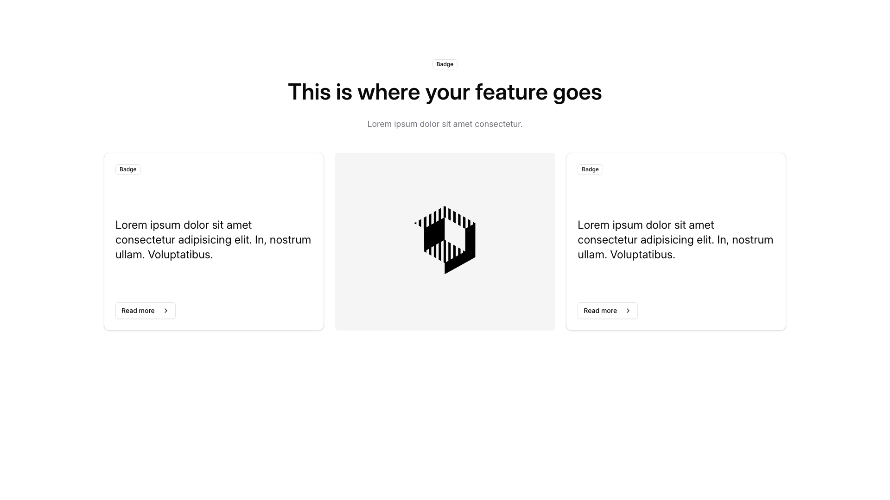

A centered section with a label at the top, followed by a large heading and body text. Below this, three cards are arranged horizontally in equal columns—the left and right cards contain body text with a "Read more" button, while the center card displays an image on a light background.

**Install**: `pnpm dlx shadcn add @shadcnblocks/feature9`

---

## feature10

A "Why Us?" section features a main heading centered at the top, followed by four equally-spaced columns arranged horizontally below. Each column contains a small icon image, a subheading label, and body text positioned vertically in sequence.

**Install**: `pnpm dlx shadcn add @shadcnblocks/feature10`

---

## feature11

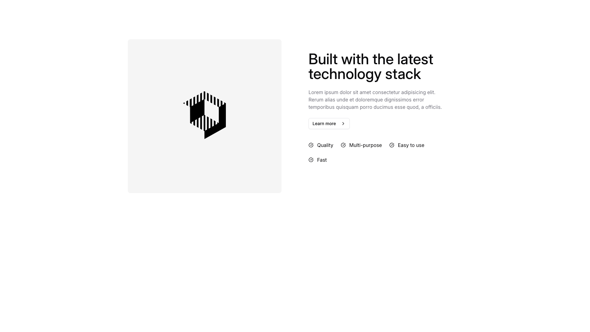

A two-column layout with an image on the left and text content on the right. The right column features a main heading, body text, a "Learn more" link, and four feature labels arranged in a grid below the text.

**Install**: `pnpm dlx shadcn add @shadcnblocks/feature11`

---

## feature12

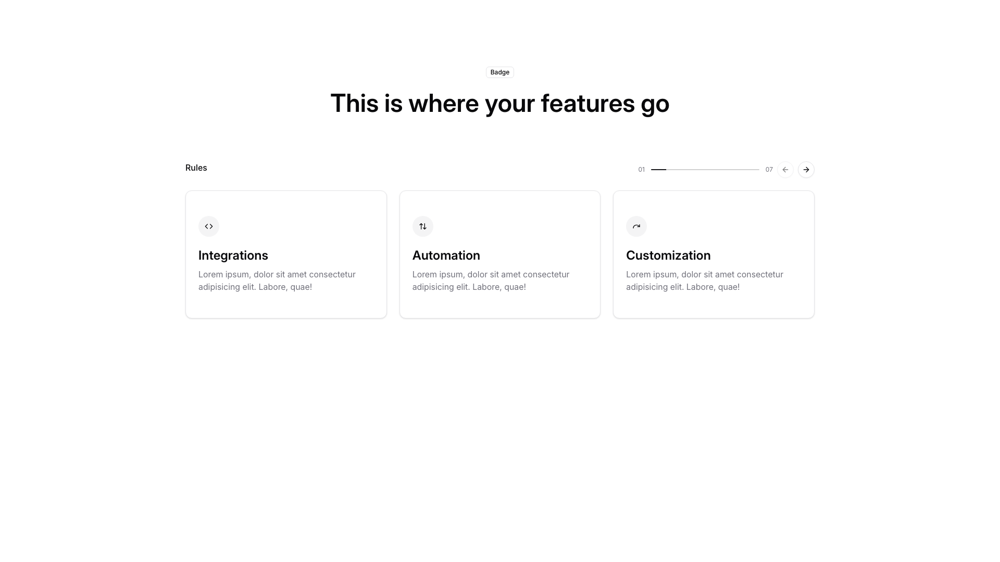

A centered webpage section features a main heading at the top, followed by a "Rules" label on the left. Below this, three cards are arranged horizontally in equal columns, each containing an icon, a heading, and body text. Navigation controls including a progress indicator and directional buttons are positioned on the right side.

**Install**: `pnpm dlx shadcn add @shadcnblocks/feature12`

---

## feature13

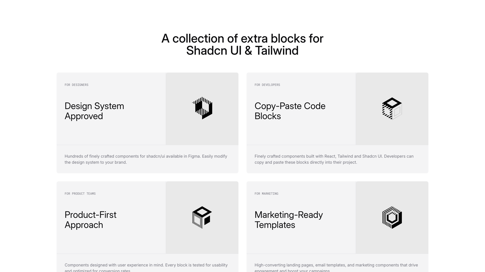

A webpage section displays four content blocks arranged in a 2x2 grid layout. Each block contains a label tag positioned at the top left, a main heading, a centered image, and body text at the bottom. The blocks are organized horizontally with equal spacing, creating a symmetrical layout that divides the page into quadrants.

**Install**: `pnpm dlx shadcn add @shadcnblocks/feature13`

---

## feature14

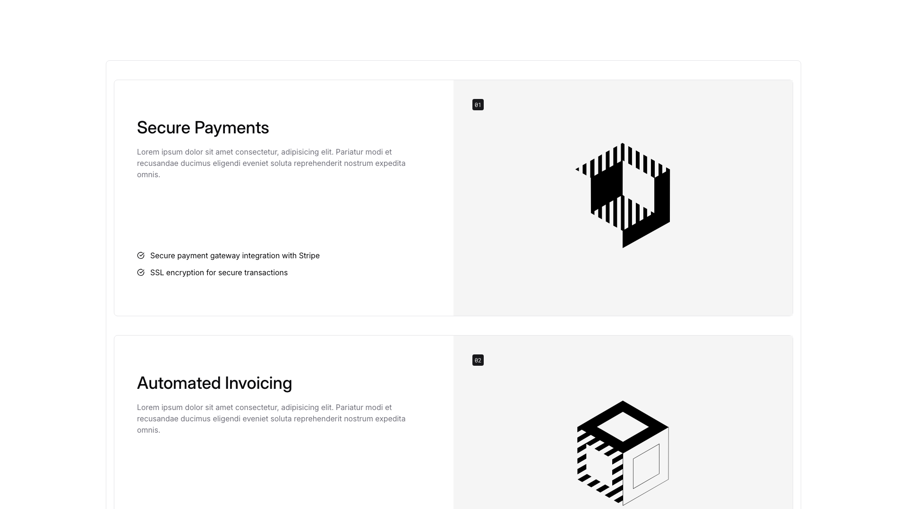

This UI block contains two vertically stacked sections, each displaying content in a two-column layout. Each section features a heading and body text on the left, with an image positioned on the right. Below the text in the first section are two checkmark labels, while the second section contains only descriptive text. Both sections maintain consistent spacing and alignment.

**Install**: `pnpm dlx shadcn add @shadcnblocks/feature14`

---

## feature15

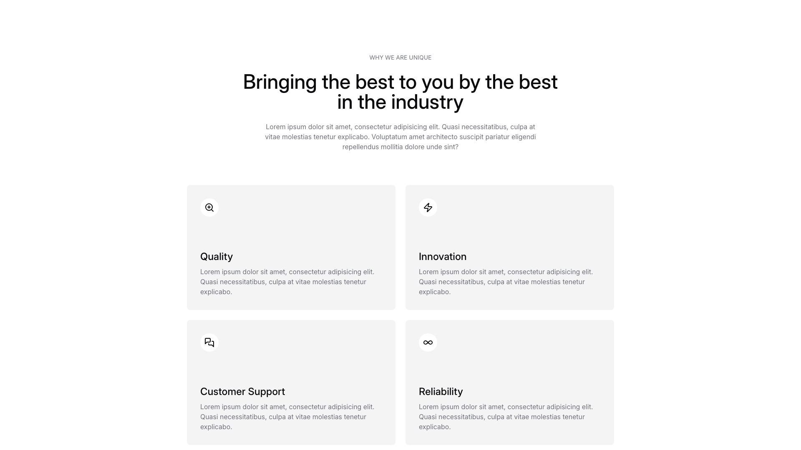

A centered section displays a label, main heading, and body text at the top. Below this introduction, four feature cards are arranged in a 2x2 grid layout. Each card contains an icon positioned at the top, followed by a subheading and descriptive body text vertically aligned below.

**Install**: `pnpm dlx shadcn add @shadcnblocks/feature15`

---

## feature16

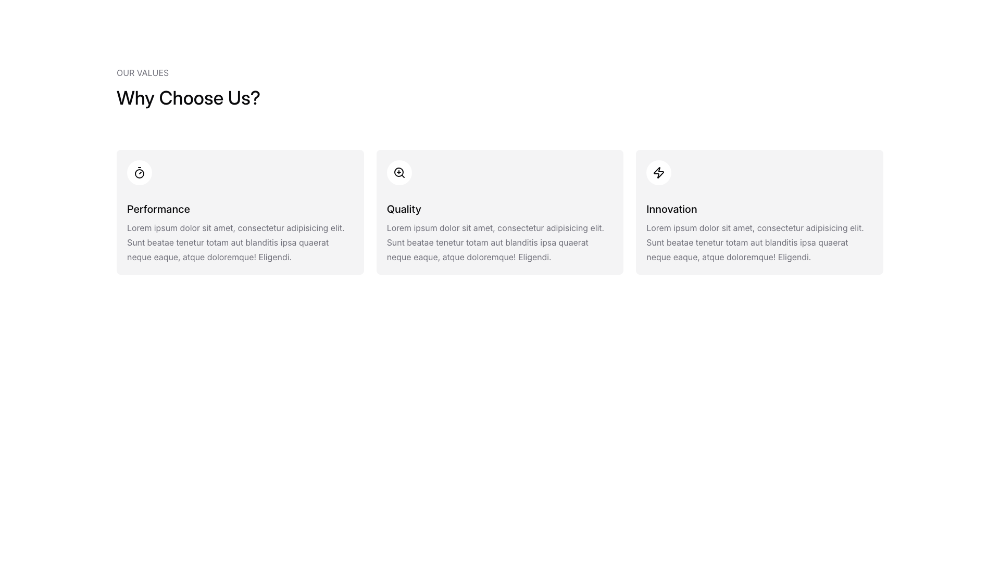

A section displays a small label at the top left, followed by a large heading. Below this, three equal-width cards are arranged horizontally. Each card contains an icon at the top, a smaller heading, and body text vertically stacked.

**Install**: `pnpm dlx shadcn add @shadcnblocks/feature16`

---

## feature17

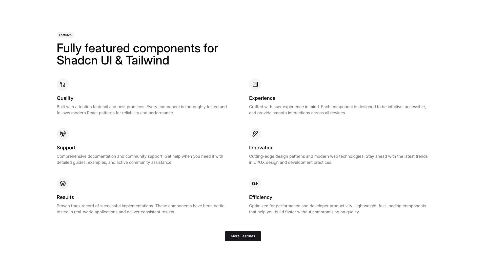

A features section displays six feature cards arranged in a 2x3 grid layout. Each card contains an icon positioned at the top, followed by a bold heading and body text below. At the bottom of the section, a centered button is placed. The entire section is vertically stacked with a heading at the top introducing the features for Shadcn UI & Tailwind.

**Install**: `pnpm dlx shadcn add @shadcnblocks/feature17`

---

## feature18

A webpage section displays a main heading at the top left, followed by a 3x2 grid of cards arranged horizontally and vertically. Each card contains an icon at the top, a subheading, body text, and a "Learn more" link positioned at the bottom.

**Install**: `pnpm dlx shadcn add @shadcnblocks/feature18`

---

## feature19

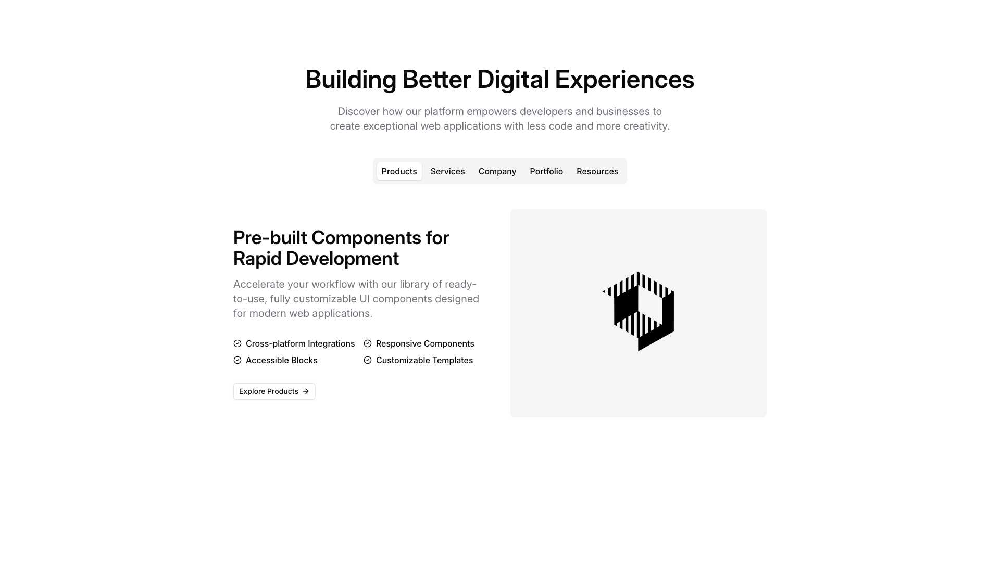

A webpage section displays content in two columns. The left column contains a main heading, body text, and four circular labels arranged in a 2x2 grid, with a button below. The right column features a large image centered on a light gray background.

**Install**: `pnpm dlx shadcn add @shadcnblocks/feature19`

---

## feature20

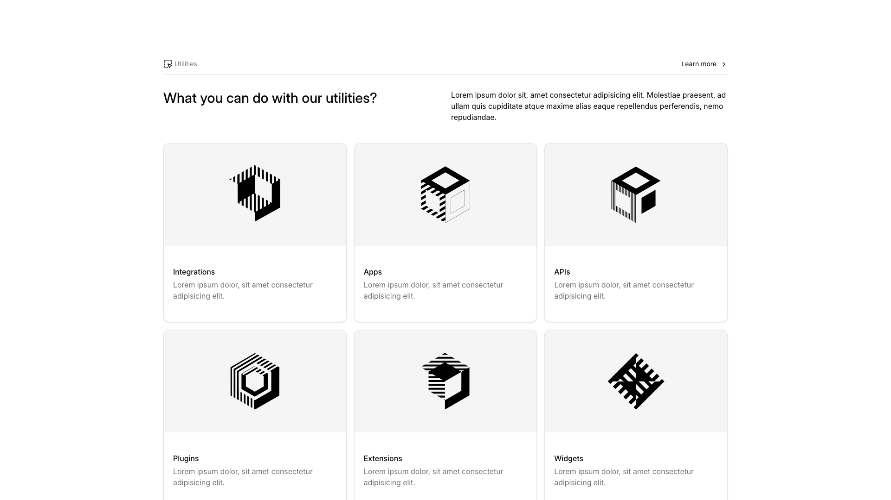

A section displays a main heading on the left with accompanying body text on the right. Below, a grid of six cards is arranged in two rows of three columns, each containing an image centered at the top, a label heading, and descriptive body text positioned below.

**Install**: `pnpm dlx shadcn add @shadcnblocks/feature20`

---

## feature21

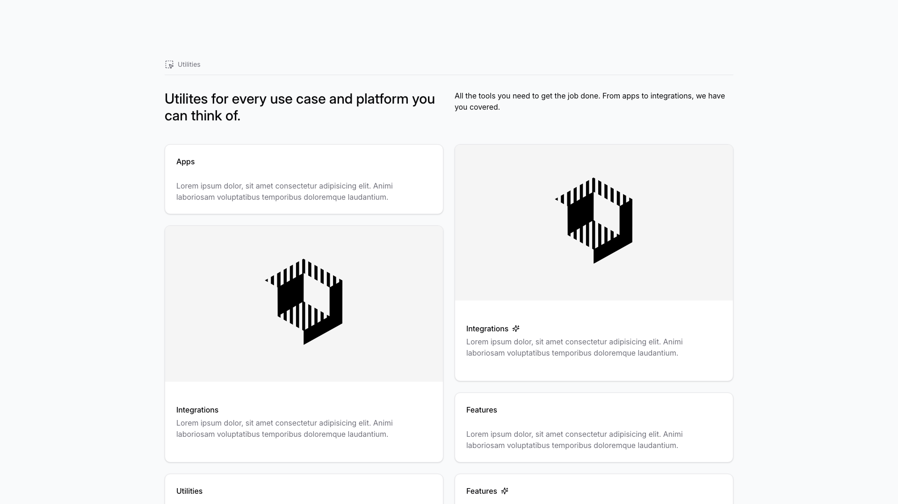

A two-column layout with a heading and descriptive text positioned at the top left. Below, the left column contains four stacked cards, each with a title, body text, and a centered image. The right column displays two larger cards vertically aligned, each featuring a centered image with accompanying title and body text below.

**Install**: `pnpm dlx shadcn add @shadcnblocks/feature21`

---

## feature22

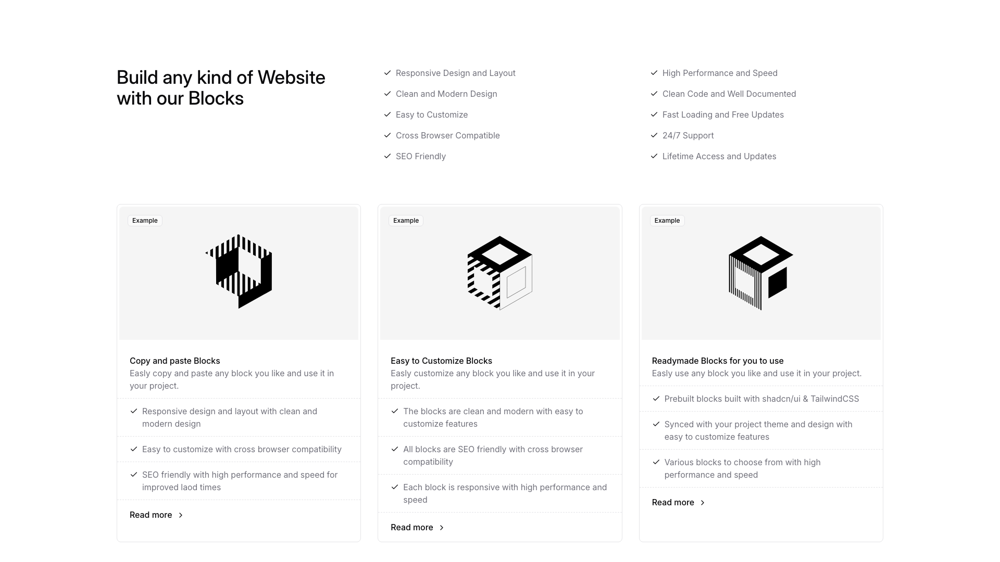

A webpage section displays a main heading on the left, followed by two columns of feature lists with checkmarks positioned above three vertically-stacked cards. Each card contains a label, an image, a title, body text with bullet points, and a "Read more" link at the bottom.

**Install**: `pnpm dlx shadcn add @shadcnblocks/feature22`

---

## feature23

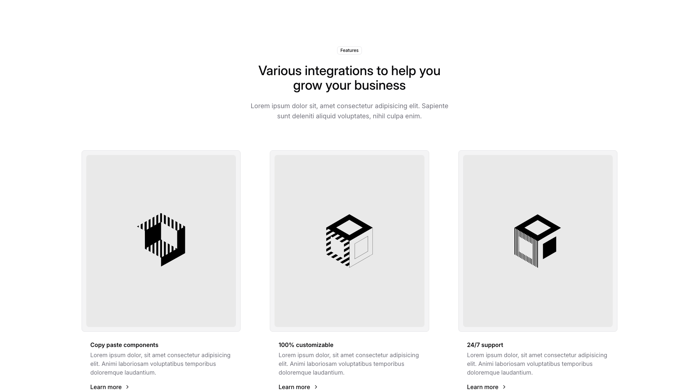

A centered section with a label at the top, followed by a large heading and descriptive body text. Below this, three equal-width cards are arranged horizontally, each containing an image, a title, body text, and a "Learn more" link positioned at the bottom.

**Install**: `pnpm dlx shadcn add @shadcnblocks/feature23`

---

## feature24

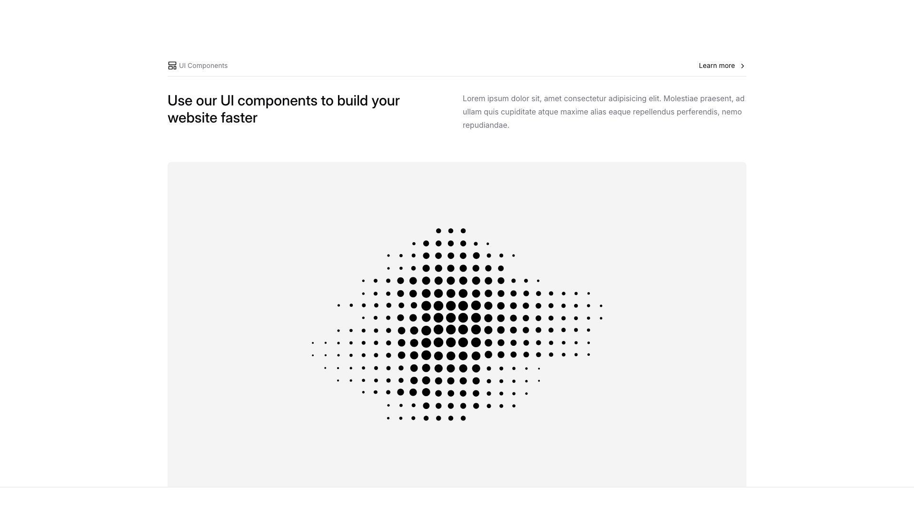

A webpage section displays content in two columns with a header bar above. The left column contains a label, a large heading, and body text positioned vertically. The right column features body text aligned to the top. Below both columns, a large image spans the full width of the section, centered horizontally.

**Install**: `pnpm dlx shadcn add @shadcnblocks/feature24`

---

## feature25

A vertical layout section displays an overview header with a centered main heading and body text at the top. Below this, three content blocks are stacked vertically, each containing a bold heading on the left side paired with three columns of bulleted list items arranged horizontally to the right.

**Install**: `pnpm dlx shadcn add @shadcnblocks/feature25`

---

## feature26

A features section displays a small label at the top, followed by a centered heading and descriptive body text. Below this, six feature items are arranged in a 3x2 grid layout, each containing an icon on the left, a bold feature title, and descriptive body text positioned vertically beneath.

**Install**: `pnpm dlx shadcn add @shadcnblocks/feature26`

---

## feature27

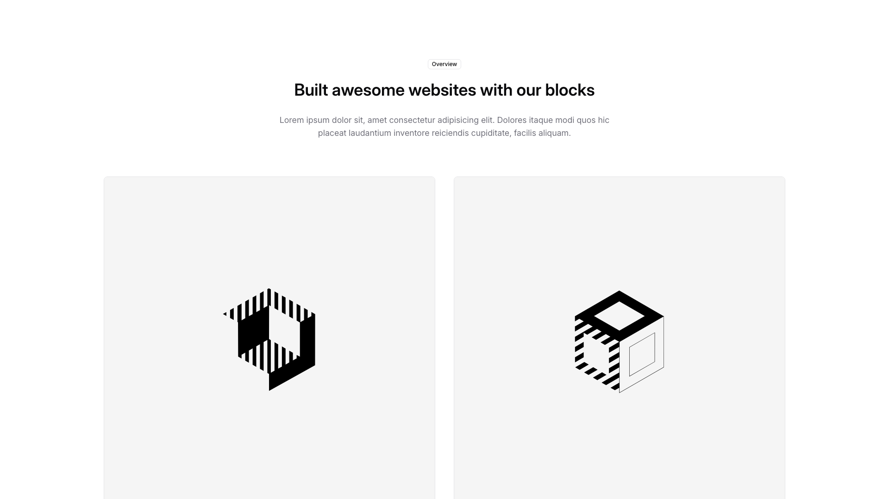

A centered section displays an "Overview" label at the top, followed by a main heading, and descriptive body text. Below this, two equal-width columns are arranged horizontally, each containing a large image centered within a light gray background container.

**Install**: `pnpm dlx shadcn add @shadcnblocks/feature27`

---

## feature28

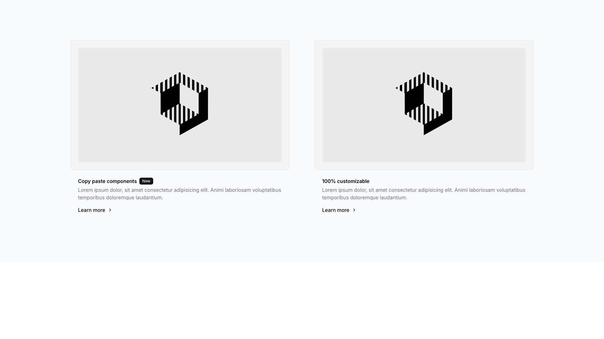

A two-column layout displays feature cards horizontally. Each card contains an image centered at the top, followed by a heading, body text, and a "Learn more" link positioned below. A label badge appears next to the heading in the left card.

**Install**: `pnpm dlx shadcn add @shadcnblocks/feature28`

---

## feature29

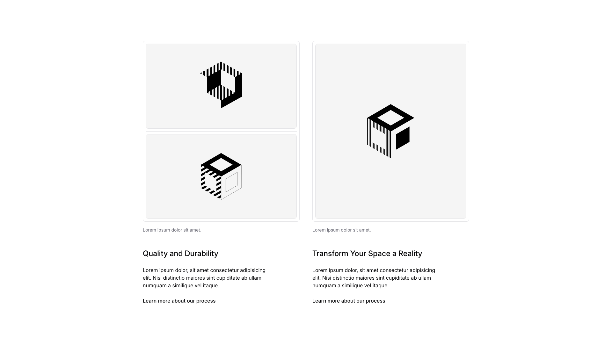

A two-column layout displaying two content cards arranged vertically on the left and right sides. Each card contains an image positioned at the top, followed by a heading, body text, and a linked label below. The left column features one card stacked above another, while the right column displays a single card aligned to the top.

**Install**: `pnpm dlx shadcn add @shadcnblocks/feature29`

---

## feature30

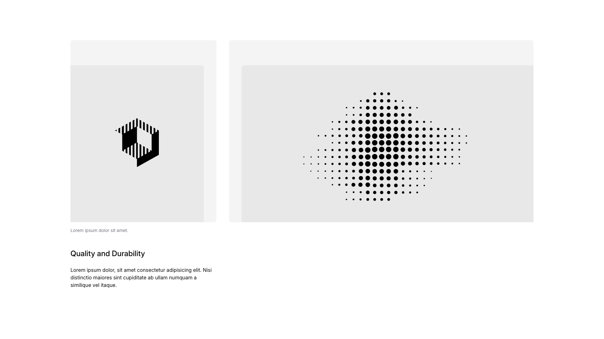

A two-column layout with a left and right section. The left column contains a small image positioned near the top, followed by a label and a heading below it, with body text underneath. The right column features a larger image positioned centrally. Both columns are separated horizontally across the layout.

**Install**: `pnpm dlx shadcn add @shadcnblocks/feature30`

---

## feature31

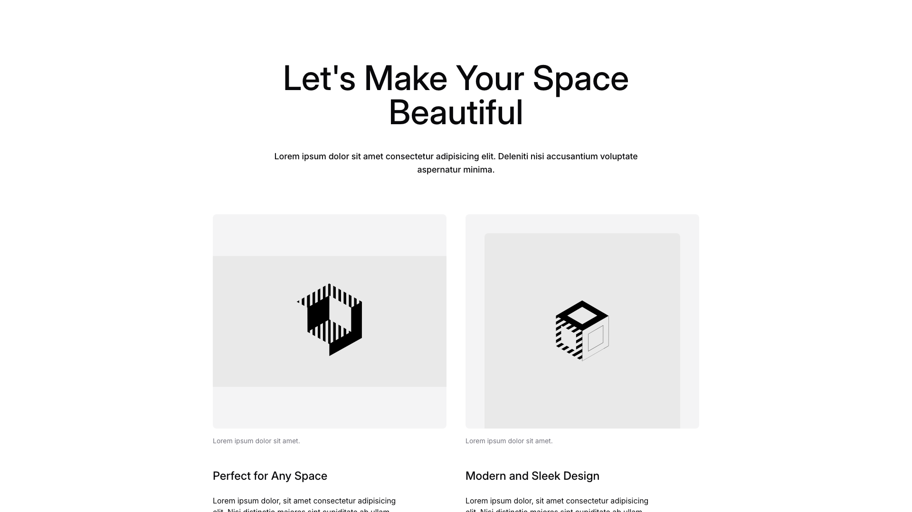

A centered section contains a main heading at the top, followed by body text. Below this, two cards are arranged horizontally side-by-side, each featuring an image, a subheading, and descriptive body text positioned vertically within the card.

**Install**: `pnpm dlx shadcn add @shadcnblocks/feature31`

---

## feature32

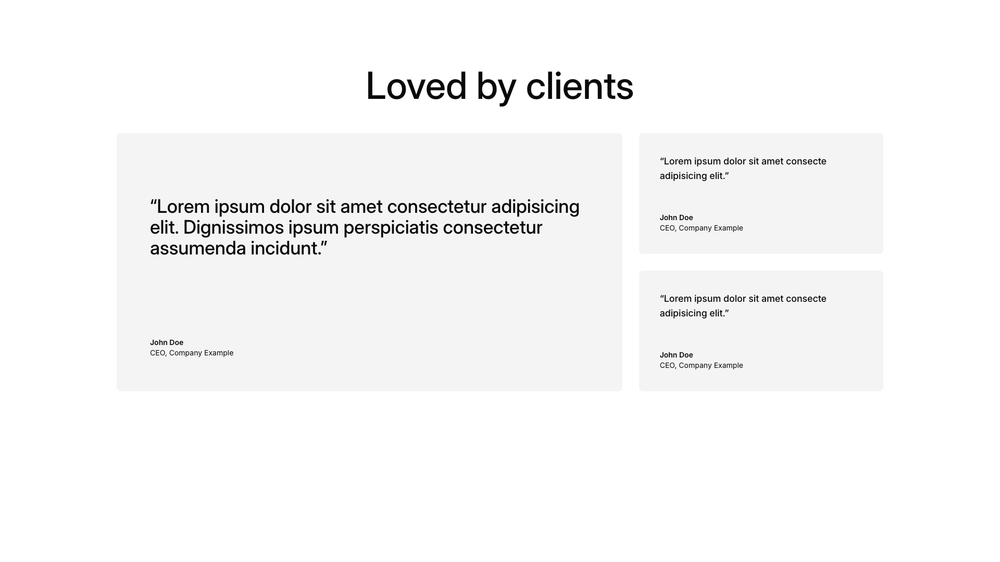

A testimonials section titled "Loved by clients" displays three client quotes arranged in a layout with one larger testimonial card on the left and two smaller testimonial cards stacked vertically on the right. Each card contains body text, a client name, and a job title positioned at the bottom.

**Install**: `pnpm dlx shadcn add @shadcnblocks/feature32`

---

## feature33

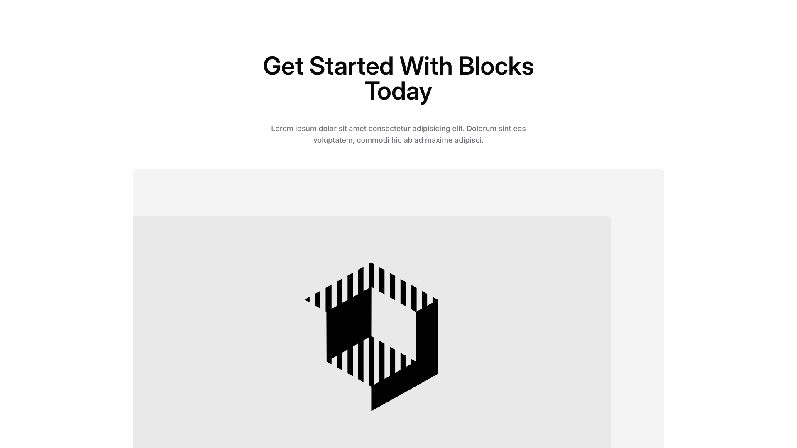

A centered section with a main heading at the top, followed by body text positioned below. An image is displayed centrally in a light gray container beneath the text.

**Install**: `pnpm dlx shadcn add @shadcnblocks/feature33`

---

## feature34

A webpage section displays a centered heading and body text at the top, followed by three equal-width columns arranged horizontally below. Each column contains a large image centered in a light gray container, with a bold title and descriptive body text positioned underneath.

**Install**: `pnpm dlx shadcn add @shadcnblocks/feature34`

---

## feature35

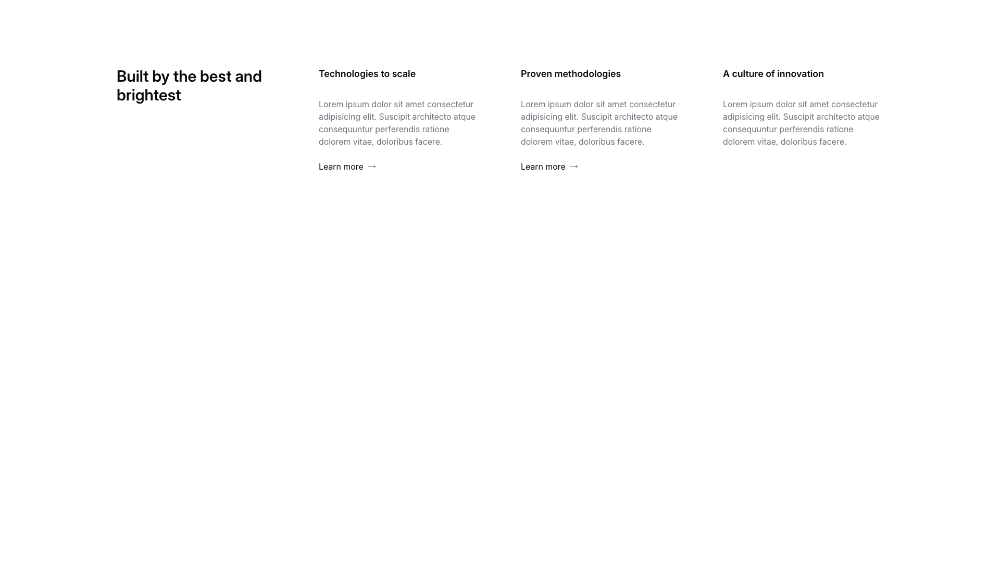

A section with a large heading positioned on the left side, followed by three columns of content arranged horizontally to the right. Each column contains a subheading, body text, and a "Learn more" link at the bottom.

**Install**: `pnpm dlx shadcn add @shadcnblocks/feature35`

---

## feature36

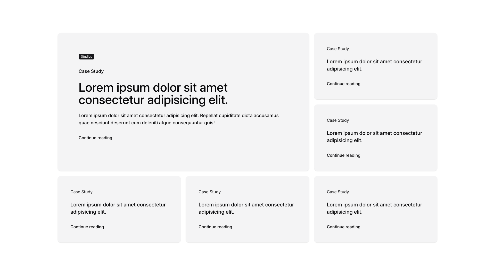

A layout displays case study cards in a multi-column grid structure. The top section features a large featured card on the left with a label, heading, body text, and a link, while two smaller cards are stacked vertically on the right. Below this, three equal-sized cards are arranged horizontally in a row, each containing a label, heading, body text, and a link.

**Install**: `pnpm dlx shadcn add @shadcnblocks/feature36`

---

## feature37

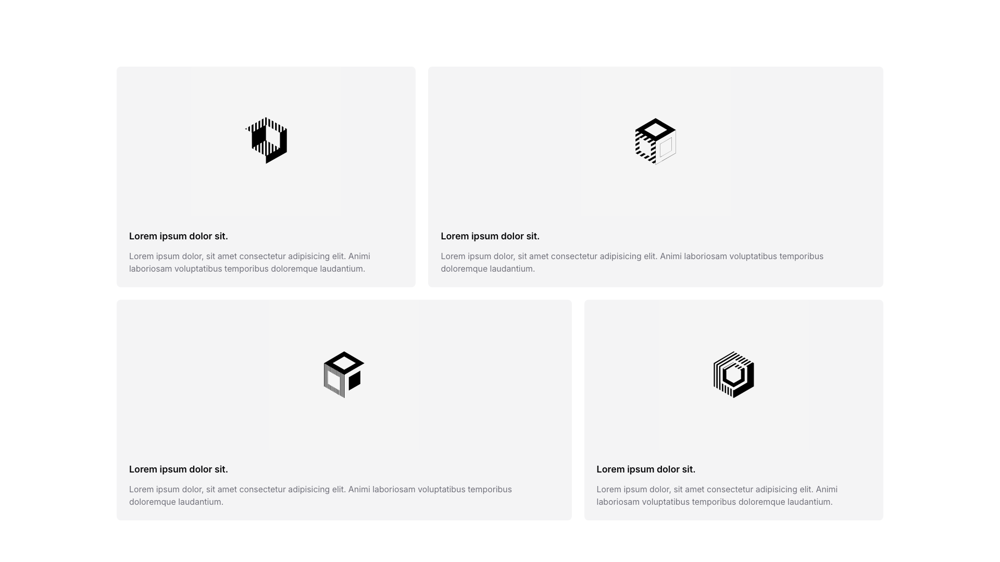

A grid layout displays four equal cards arranged in two rows and two columns. Each card contains an image centered at the top, followed by a heading and body text positioned below. The cards are vertically stacked with consistent spacing between rows and horizontally aligned with equal spacing between columns.

**Install**: `pnpm dlx shadcn add @shadcnblocks/feature37`

---

## feature38

A two-column layout with the left column containing a small icon at the top, followed by a main heading, body text, a button, and three labeled list items arranged vertically. The right column features a large geometric image centered on a light gray background.

**Install**: `pnpm dlx shadcn add @shadcnblocks/feature38`

---

## feature39

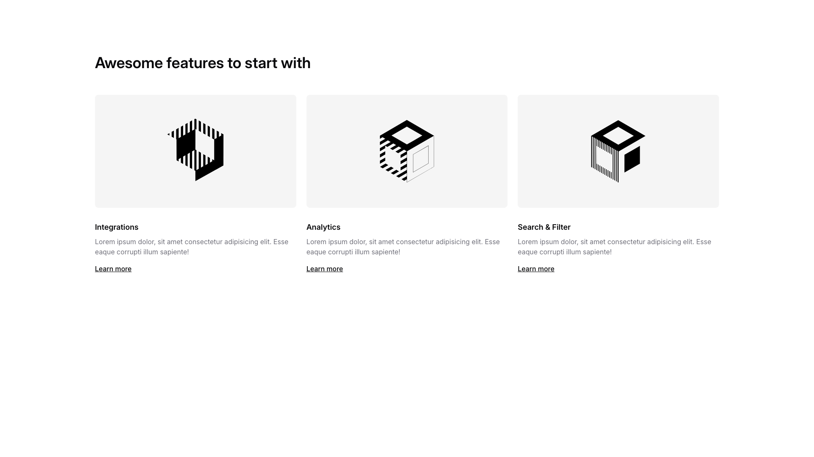

A section displays a heading at the top, followed by three equal-width columns arranged horizontally. Each column contains an image centered at the top, a label below it, body text, and a "Learn more" link at the bottom.

**Install**: `pnpm dlx shadcn add @shadcnblocks/feature39`

---

## feature41

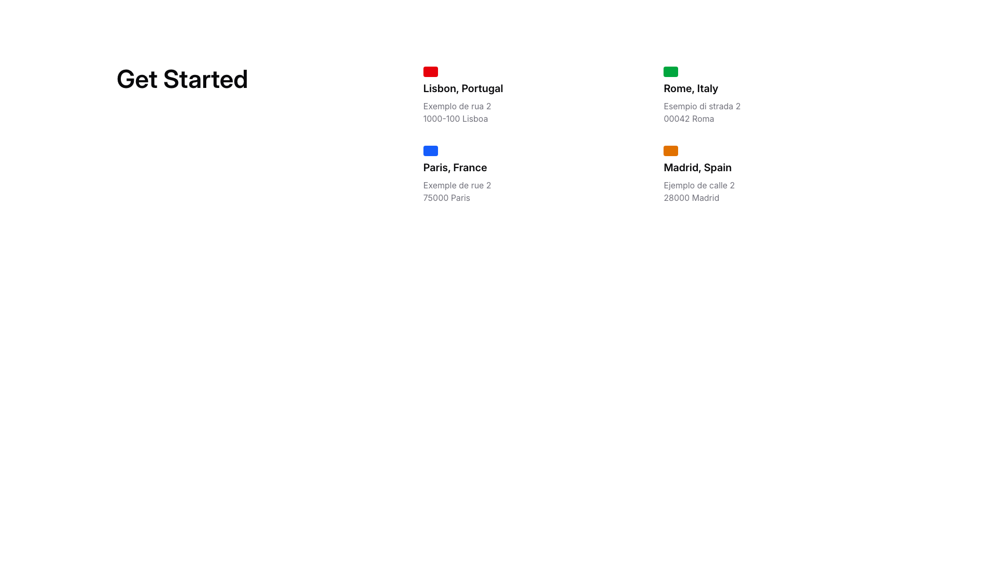

A "Get Started" heading is positioned on the left side. To the right, four location cards are arranged in a 2x2 grid layout, each containing a colored square label at the top, followed by a city name heading, descriptive text, and address information below.

**Install**: `pnpm dlx shadcn add @shadcnblocks/feature41`

---

## feature42

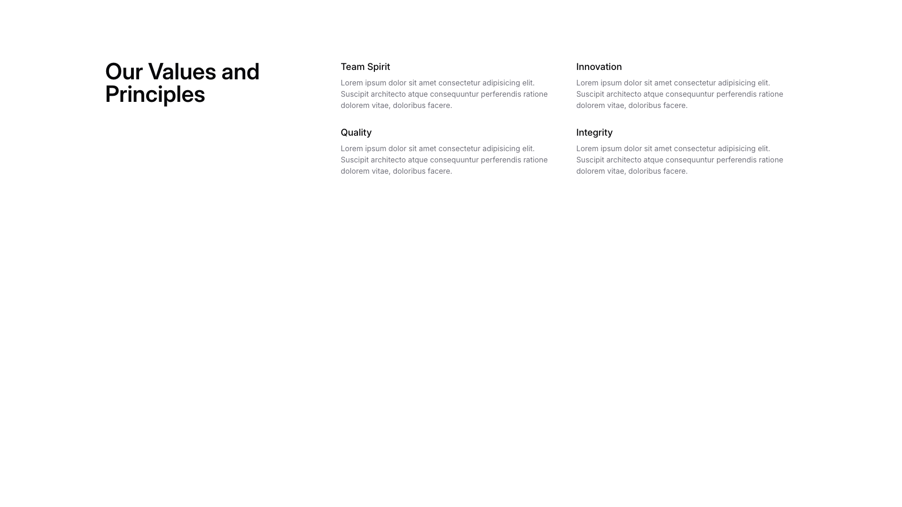

A section displaying values and principles uses a two-column layout. On the left, a large heading is positioned vertically. On the right, four value items are arranged in a 2x2 grid, each containing a bold label followed by body text describing the principle.

**Install**: `pnpm dlx shadcn add @shadcnblocks/feature42`

---

## feature43

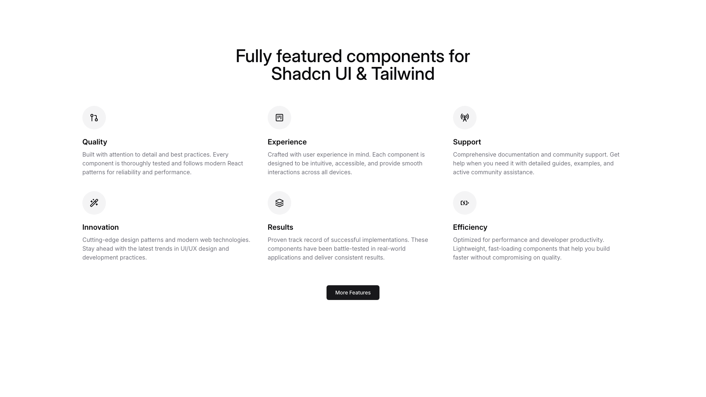

A webpage section displays six features arranged in two rows of three columns. Each feature contains an icon centered at the top, followed by a heading and body text below. At the bottom of the section, a centered button is positioned horizontally.

**Install**: `pnpm dlx shadcn add @shadcnblocks/feature43`

---

## feature44

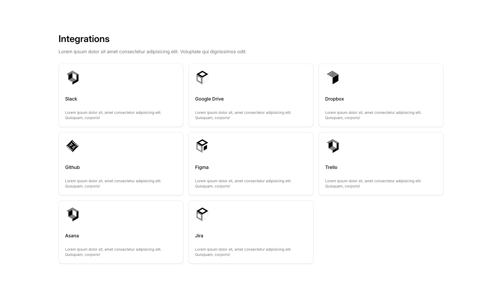

A section titled "Integrations" with descriptive body text is displayed at the top. Below this, nine integration cards are arranged in a 3-column grid layout, stacked vertically in three rows. Each card contains an image positioned at the top, followed by a label and body text positioned below.

**Install**: `pnpm dlx shadcn add @shadcnblocks/feature44`

---

## feature50

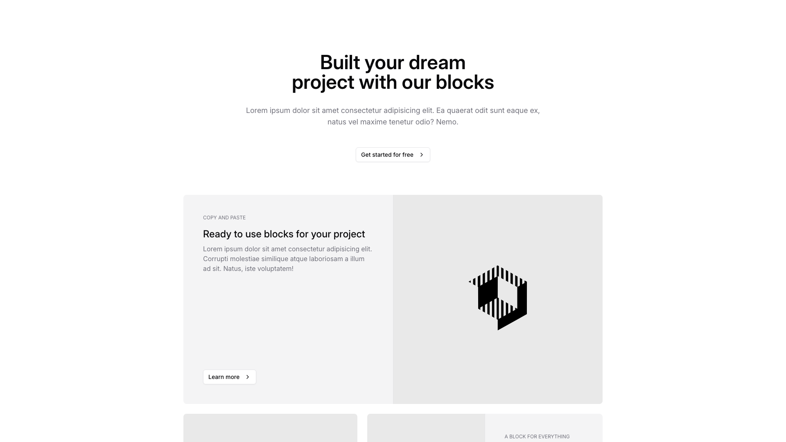

A centered webpage section displays a main heading and body text at the top, followed by a "Get started for free" button. Below this, a large card is divided into two columns: the left side contains a label, heading, body text, and a "Learn more" link, while the right side features a centered image. At the bottom, there are two additional placeholder sections positioned horizontally.

**Install**: `pnpm dlx shadcn add @shadcnblocks/feature50`

---

## feature51

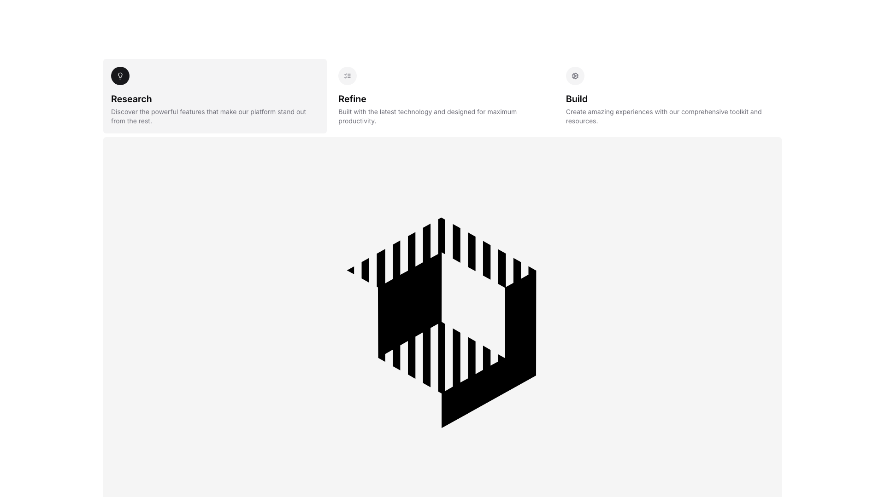

A webpage section displays three horizontally-aligned cards at the top, each containing a small icon, a heading, and body text. Below this, centered in the middle of the layout, is a large image.

**Install**: `pnpm dlx shadcn add @shadcnblocks/feature51`

---

## feature52

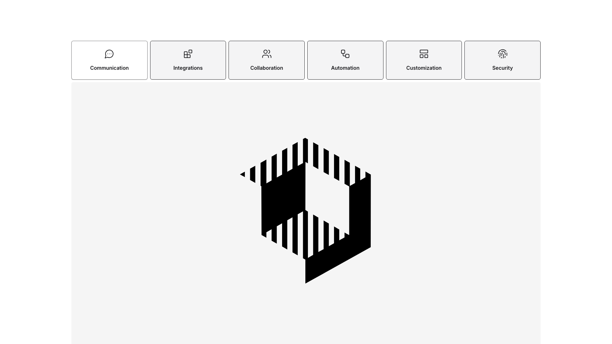

A horizontally aligned navigation menu with six labeled buttons spans the top of the interface. Below this, centered in the main content area, is a large geometric image positioned vertically in the middle of the screen.

**Install**: `pnpm dlx shadcn add @shadcnblocks/feature52`

---

## feature53

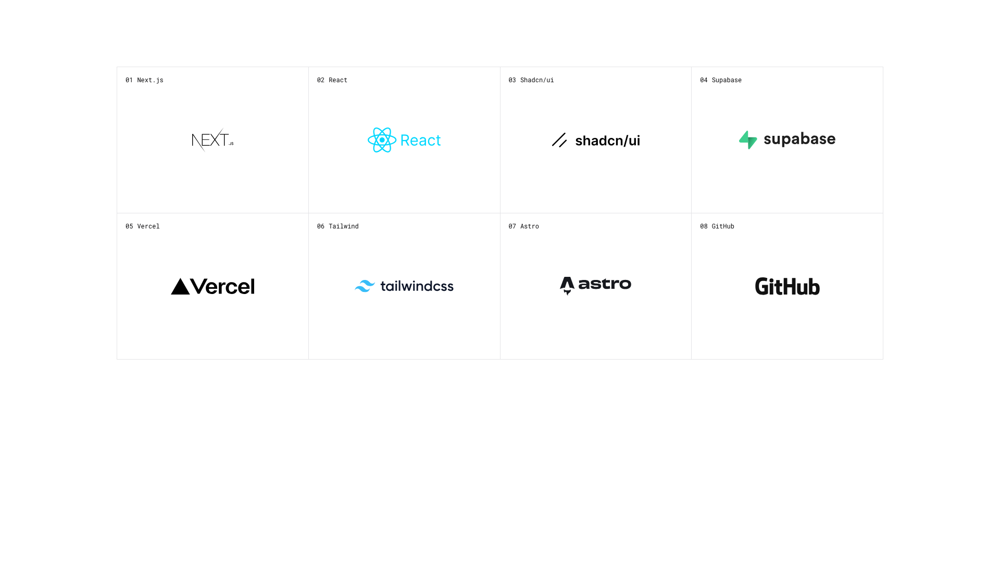

A grid layout displays eight items arranged in two rows and four columns. Each cell contains a label at the top and an image centered below it, creating a uniform card-based structure. The items are evenly spaced horizontally and vertically across the container.

**Install**: `pnpm dlx shadcn add @shadcnblocks/feature53`

---

## feature54

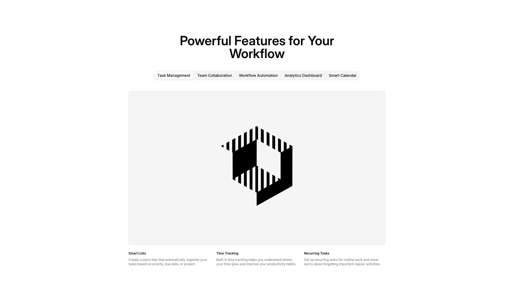

A webpage section displays a centered main heading at the top, followed by a horizontal row of five navigation buttons. Below this, a large image is centered in the middle of the section. At the bottom, three columns of content are arranged horizontally, each containing a bold label, body text, and descriptive copy.

**Install**: `pnpm dlx shadcn add @shadcnblocks/feature54`

---

## feature56

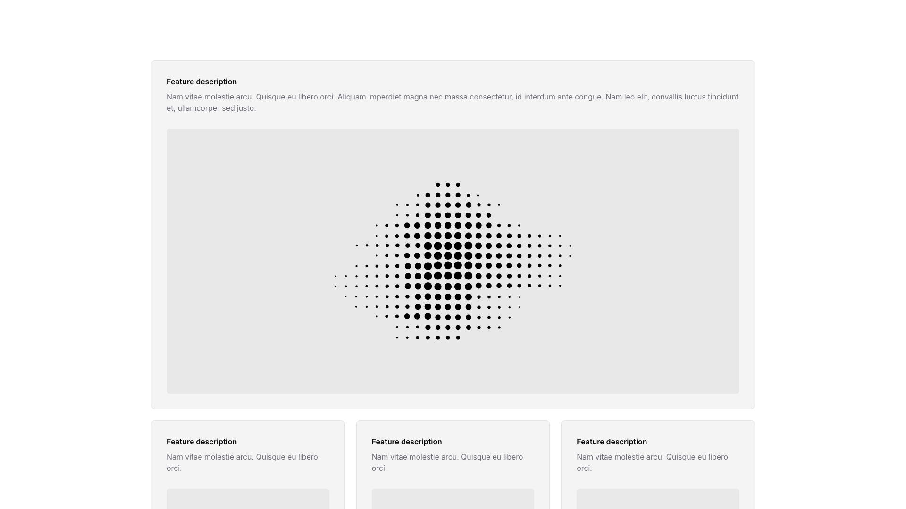

A feature showcase section displays a large centered image with body text above it. Below the main section, three identical feature cards are arranged horizontally, each containing a heading, body text, and a placeholder image positioned at the bottom.

**Install**: `pnpm dlx shadcn add @shadcnblocks/feature56`

---

## feature57

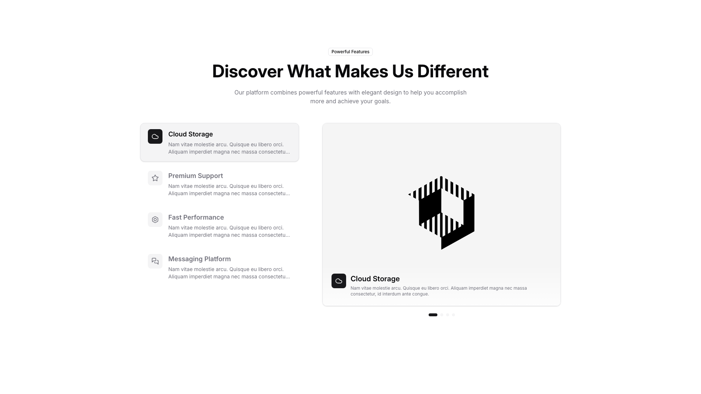

A "Powerful Features" section is centered at the top with a main heading and body text. Below, content is arranged in two columns: the left column contains four stacked feature items, each with an icon, title, and descriptive text. The right column displays a large centered image above a feature card that mirrors the layout of items on the left.

**Install**: `pnpm dlx shadcn add @shadcnblocks/feature57`

---

## feature58

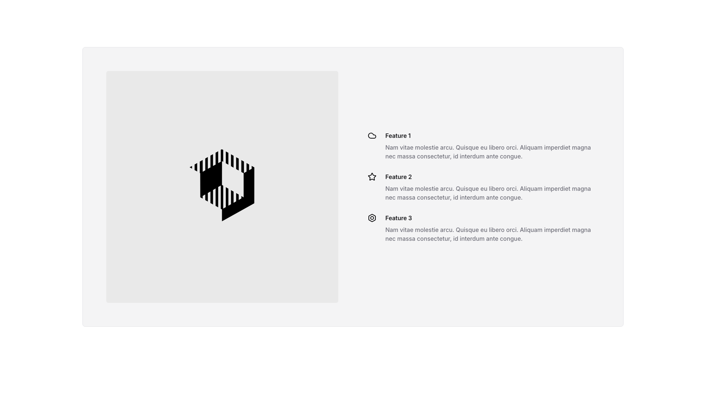

A layout with two columns displays content horizontally. The left column features a large image centered on a light background. The right column contains three vertically stacked feature sections, each with a small icon on the left, followed by a heading and body text.

**Install**: `pnpm dlx shadcn add @shadcnblocks/feature58`

---

## feature59

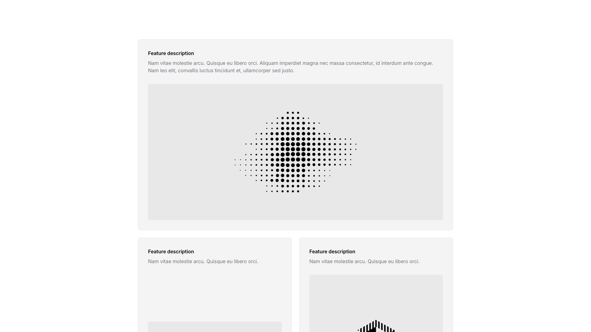

The layout consists of three feature sections arranged vertically. The top section spans full width and contains a heading, body text, and a centered image. Below, two feature sections are positioned side-by-side horizontally, each containing a heading, body text, and a placeholder image at the bottom.

**Install**: `pnpm dlx shadcn add @shadcnblocks/feature59`

---

## feature60

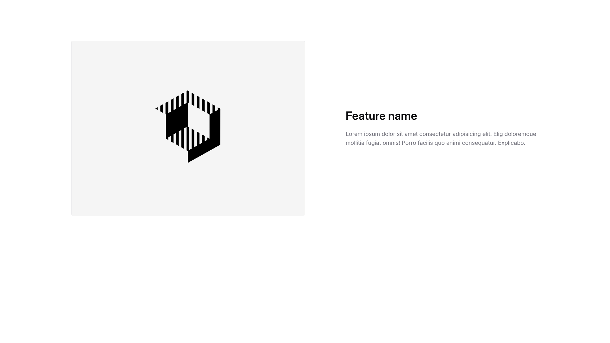

A feature section displays content in two columns with a horizontal layout. The left column contains a centered image on a light gray background. The right column includes a heading, followed by body text positioned below it.

**Install**: `pnpm dlx shadcn add @shadcnblocks/feature60`

---

## feature61

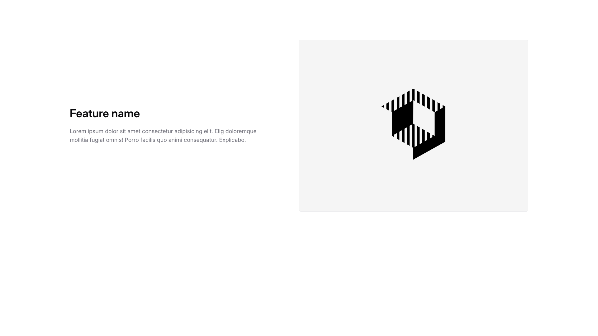

A feature section displays content in two columns. The left column contains a heading, followed by body text describing the feature. The right column features a large image centered on a light gray background, positioned horizontally opposite the text.

**Install**: `pnpm dlx shadcn add @shadcnblocks/feature61`

---

## feature62

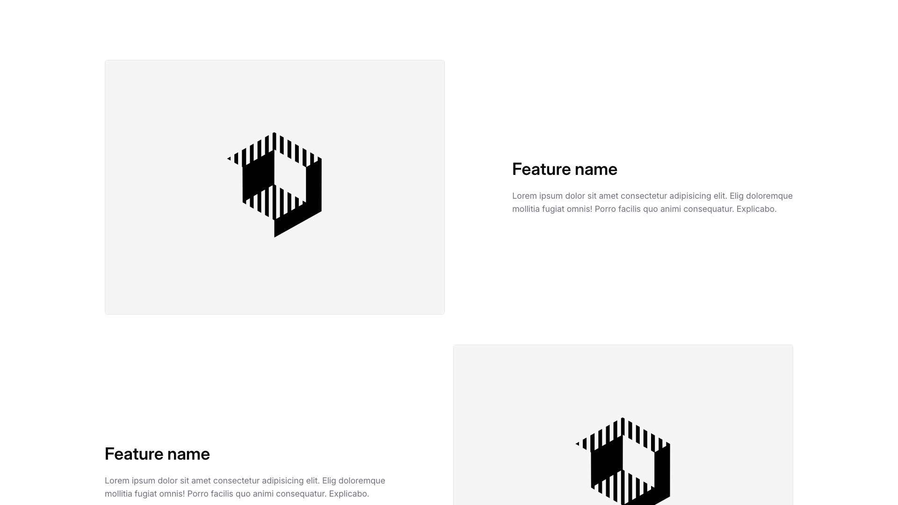

This section displays two feature blocks arranged vertically. Each block contains an image positioned on one side and text content on the other, alternating between left and right alignment. The first block has the image on the left with a heading and body text on the right, while the second block reverses this layout with text on the left and the image on the right.

**Install**: `pnpm dlx shadcn add @shadcnblocks/feature62`

---

## feature63

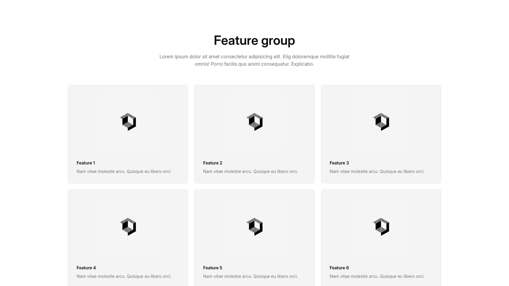

A feature group section displays a centered heading with descriptive body text. Below this, six feature cards are arranged in a 3-column grid layout, with each card containing a centered image, a feature title, and descriptive text positioned vertically.

**Install**: `pnpm dlx shadcn add @shadcnblocks/feature63`

---

## feature64

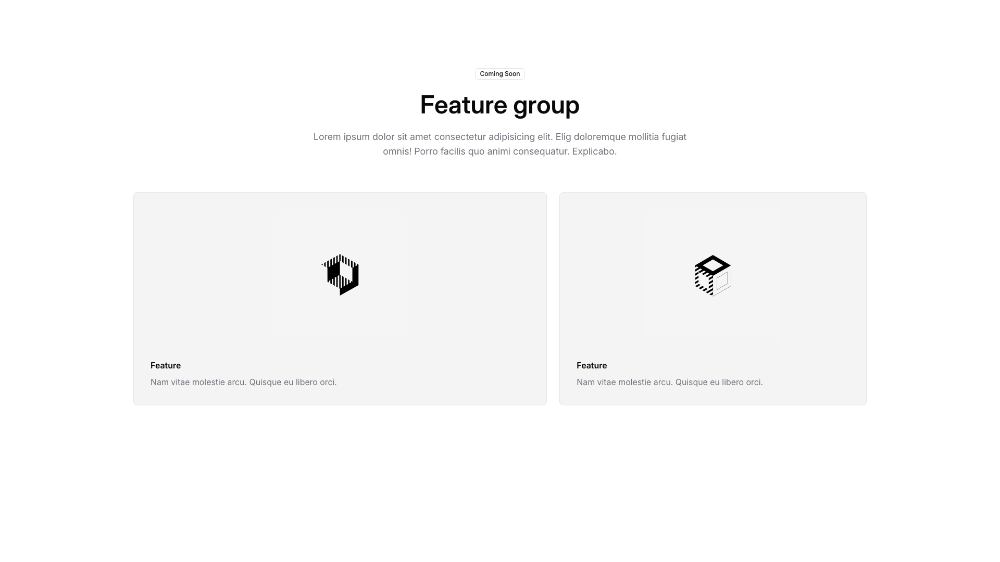

A centered section with a "Coming Soon" label at the top, followed by a large heading and descriptive body text. Below this, two feature cards are arranged horizontally side-by-side, each containing an image centered above a feature title and accompanying text.

**Install**: `pnpm dlx shadcn add @shadcnblocks/feature64`

---

## feature65

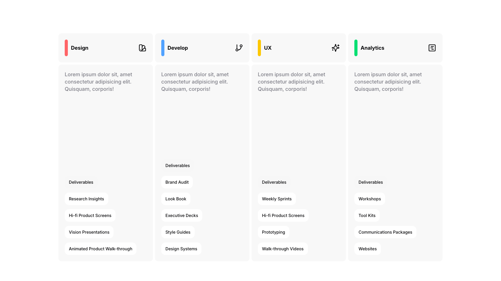

A horizontally scrollable section displays four vertically stacked card columns. Each column contains a heading with an accompanying icon positioned at the top, followed by body text and a "Deliverables" label. Below each label, a list of items is arranged vertically, with varying numbers of entries per column.

**Install**: `pnpm dlx shadcn add @shadcnblocks/feature65`

---

## feature66

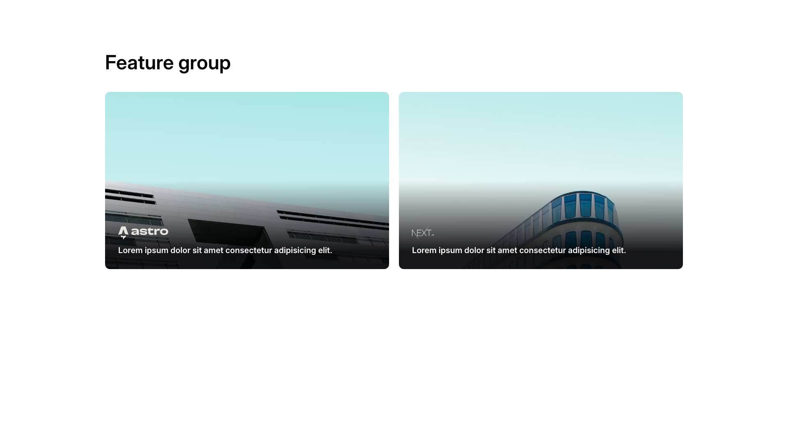

A feature group section displays two horizontally-aligned cards. Each card contains an image positioned in the upper portion, with a dark overlay gradient at the bottom. Below the overlay, a label and heading appear on the left, followed by body text. The cards are evenly spaced and have rounded corners.

**Install**: `pnpm dlx shadcn add @shadcnblocks/feature66`

---

## feature67

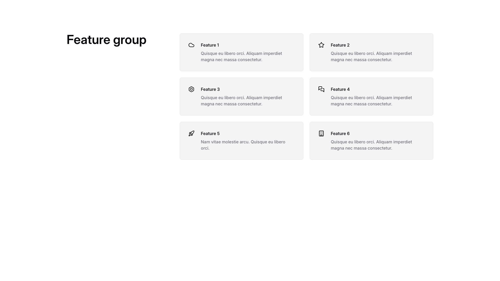

A section displays a heading on the left, followed by a grid of six feature cards arranged in three rows and two columns. Each card contains an icon on the left, a feature title, and body text describing the feature. The cards are horizontally aligned with consistent spacing and sizing.

**Install**: `pnpm dlx shadcn add @shadcnblocks/feature67`

---

## feature68

A section displays a heading at the top left, followed by body text. Below this is a bordered container organized in three columns, each containing two feature items arranged vertically. Each feature item consists of an icon on the left with a label and brief description text to the right.

**Install**: `pnpm dlx shadcn add @shadcnblocks/feature68`

---

## feature69

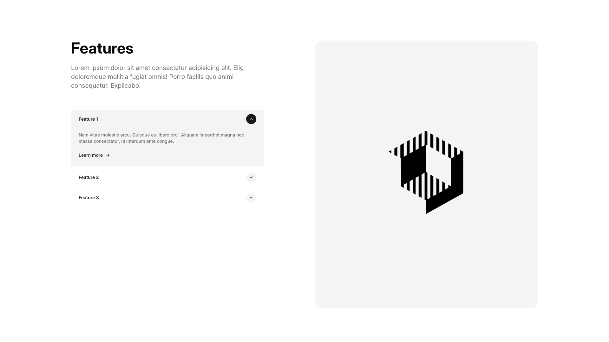

A two-column layout displays a features section with content on the left and a visual element on the right. The left column contains a main heading, descriptive body text, and three stacked feature items with expandable sections and a "Learn more" link. The right column features a large image centered within a light gray background area.

**Install**: `pnpm dlx shadcn add @shadcnblocks/feature69`

---

## feature70

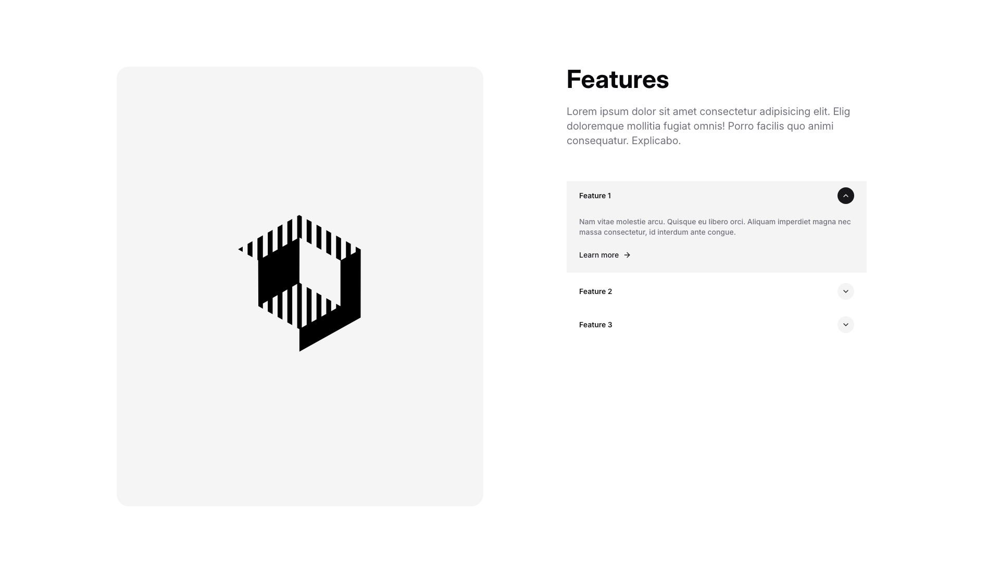

A two-column layout with a large image positioned on the left side. On the right, a heading is followed by body text, with three expandable feature items listed vertically below. The first feature item is expanded to show additional description text and a "Learn more" link, while the other two items remain collapsed.

**Install**: `pnpm dlx shadcn add @shadcnblocks/feature70`

---

## feature71

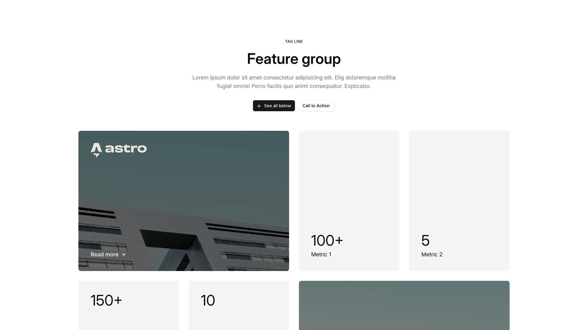

A centered section with a tag line, main heading, and body text at the top. Below this are two buttons positioned horizontally. The layout then displays a large image on the left side, with two metric cards stacked vertically on the right. At the bottom, two additional metric cards are positioned horizontally on the left, with a larger content area spanning the right side.

**Install**: `pnpm dlx shadcn add @shadcnblocks/feature71`

---

## feature72

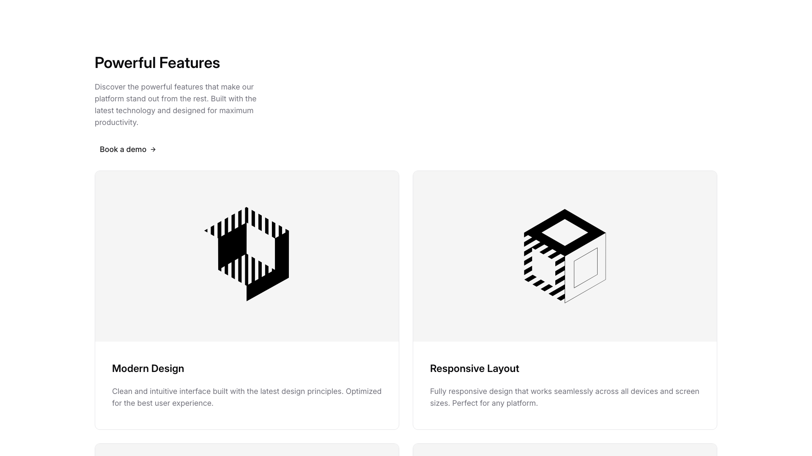

A section displays content in a two-column layout. The left column contains a main heading, body text, and a button. Below this, two feature cards are arranged horizontally, each containing an image centered at the top, followed by a heading and descriptive body text.

**Install**: `pnpm dlx shadcn add @shadcnblocks/feature72`

---

## feature73

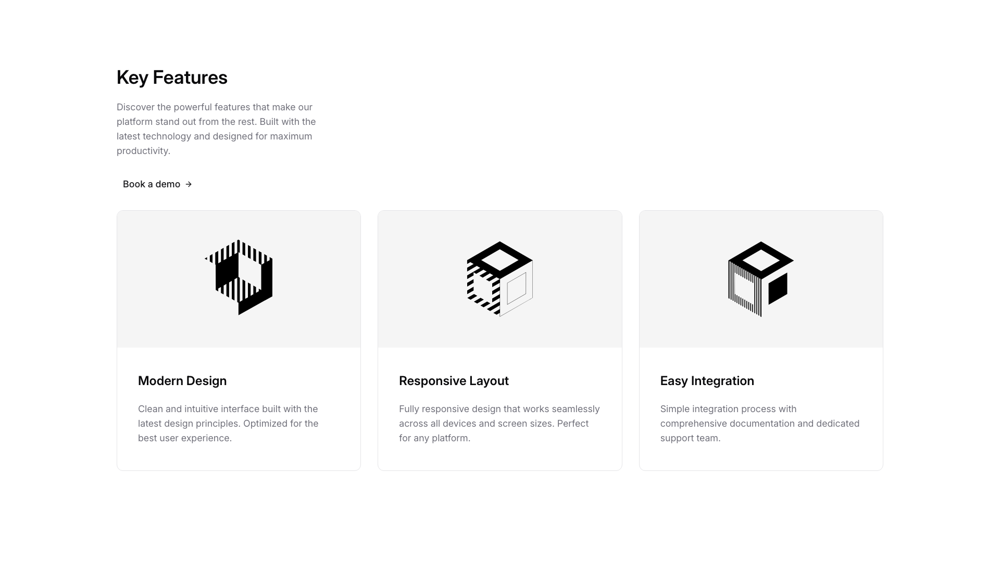

A webpage section displays vertically stacked content. At the top is a main heading followed by body text and a linked button. Below this, three feature cards are arranged horizontally in equal columns. Each card contains an image centered at the top, a bold title, and descriptive body text positioned below.

**Install**: `pnpm dlx shadcn add @shadcnblocks/feature73`

---

## feature74

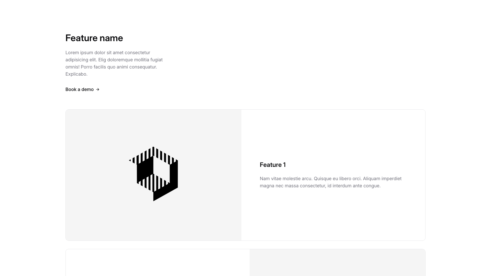

A section displaying feature information in two main areas. The left side contains a heading, descriptive body text, and a link button. Below this, a two-column layout shows an image on the left and a smaller feature block on the right, with a heading and body text vertically aligned within it.

**Install**: `pnpm dlx shadcn add @shadcnblocks/feature74`

---

## feature75

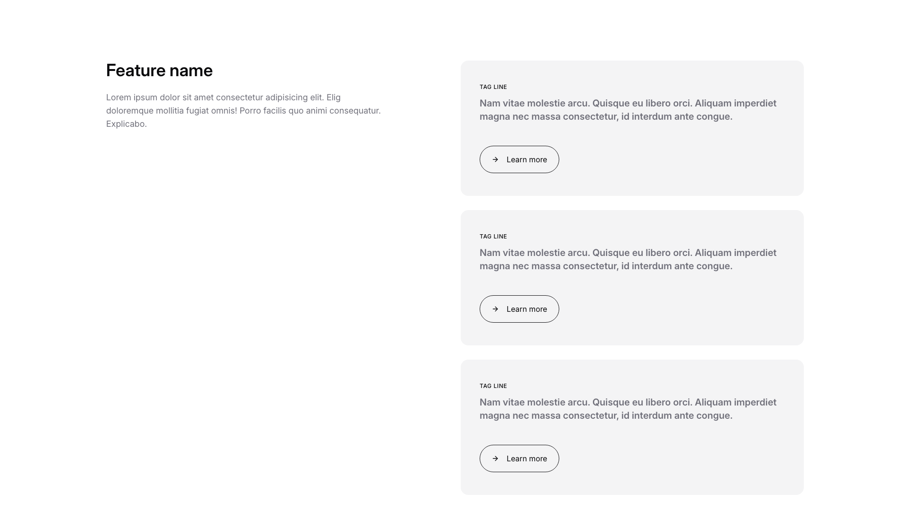

A layout with two columns displays content vertically. On the left, a large heading sits above body text. On the right, three identical card sections are stacked vertically, each containing a label, body text, and a button with an arrow icon aligned to the left.

**Install**: `pnpm dlx shadcn add @shadcnblocks/feature75`

---

## feature76

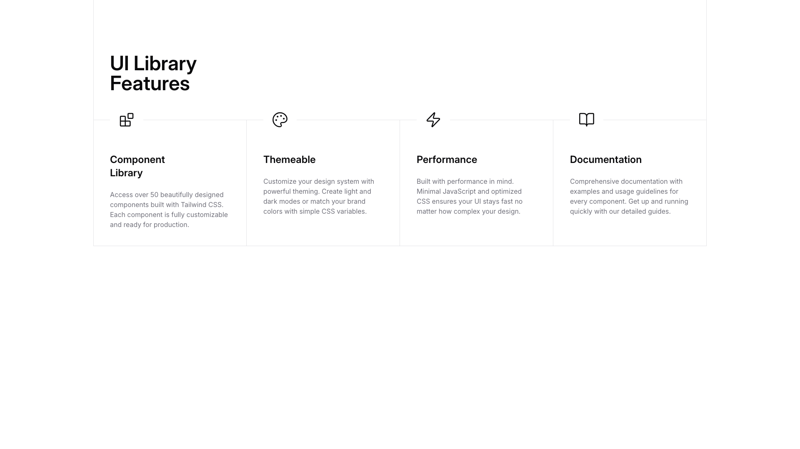

A features section displays four equal-width columns arranged horizontally. Each column contains an icon centered at the top, followed by a bold heading and descriptive body text positioned below. The entire section is anchored by a main heading "UI Library Features" positioned on the left side above all columns.

**Install**: `pnpm dlx shadcn add @shadcnblocks/feature76`

---

## feature77

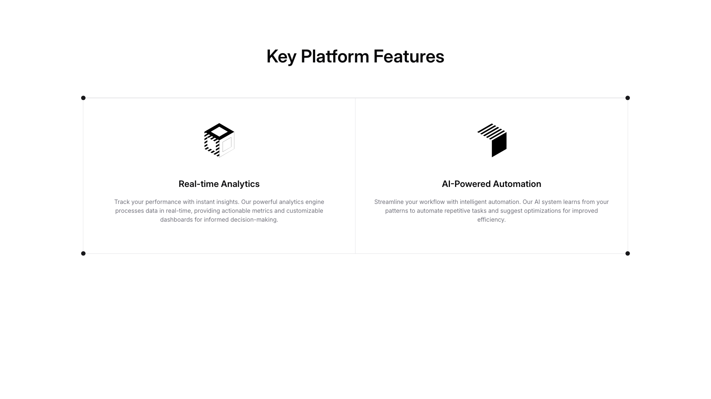

A section titled "Key Platform Features" is centered at the top. Below, two feature cards are arranged horizontally and evenly spaced. Each card contains an image positioned above a heading and body text, all vertically stacked and centered within the card.

**Install**: `pnpm dlx shadcn add @shadcnblocks/feature77`

---

## feature78

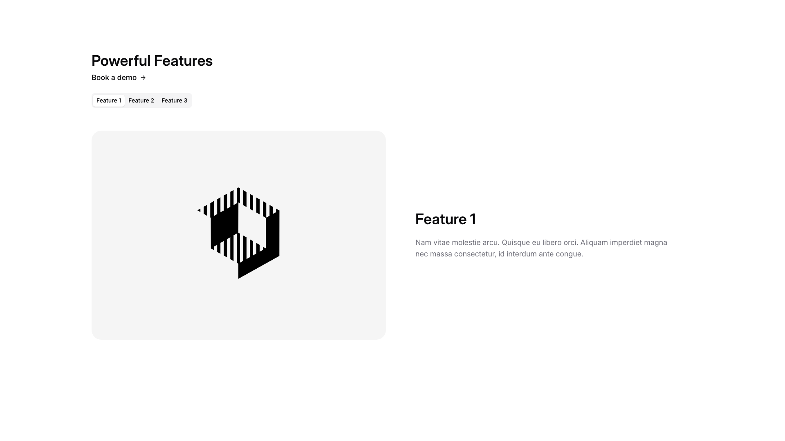

A section displays a heading with a link beneath it, followed by three horizontally arranged tabs. Below the tabs, content is split into two columns: the left column contains a large image centered in a light background, while the right column displays a heading and body text vertically aligned.

**Install**: `pnpm dlx shadcn add @shadcnblocks/feature78`

---

## feature79

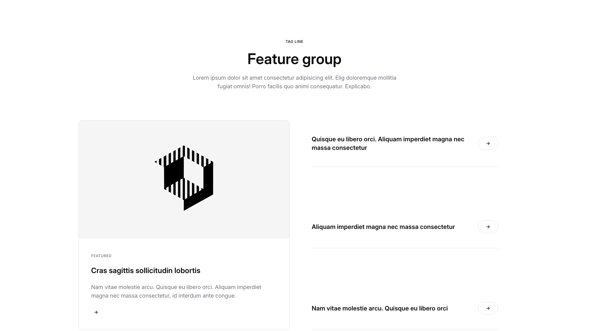

A feature section displays content in two columns. The left column contains a "Featured" label, a heading, body text, and an arrow link, alongside a large image above. The right column vertically stacks three linked items, each with a heading and an arrow link positioned to the right. Above both columns, centered text includes a tag line, main heading, and descriptive body text.

**Install**: `pnpm dlx shadcn add @shadcnblocks/feature79`

---

## feature80

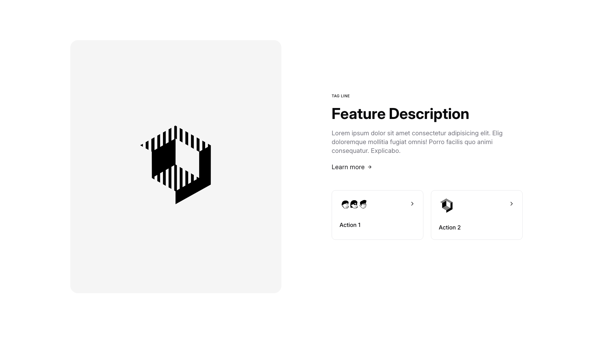

A two-column layout with an image on the left and text content on the right. The right column contains a tag label at the top, followed by a large heading, body text, and a "Learn more" link. Below this is a row of two action cards displayed horizontally, each containing an icon, label, and navigation arrow.

**Install**: `pnpm dlx shadcn add @shadcnblocks/feature80`

---

## feature81

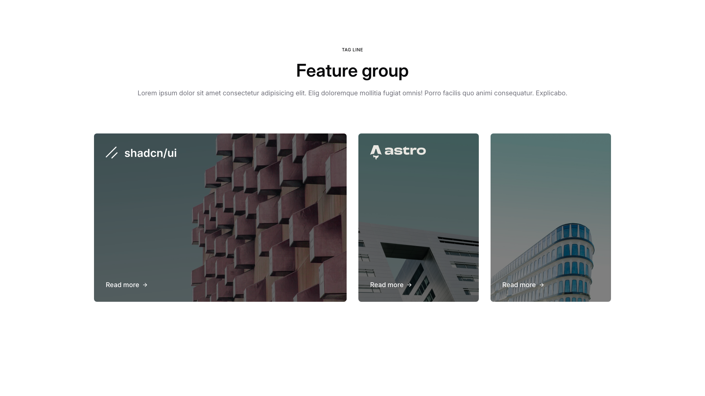

A centered section with a tag label at the top, followed by a large heading and body text. Below, three cards are arranged horizontally, each containing a logo, an image, and a "Read more" button positioned at the bottom.

**Install**: `pnpm dlx shadcn add @shadcnblocks/feature81`

---

## feature82

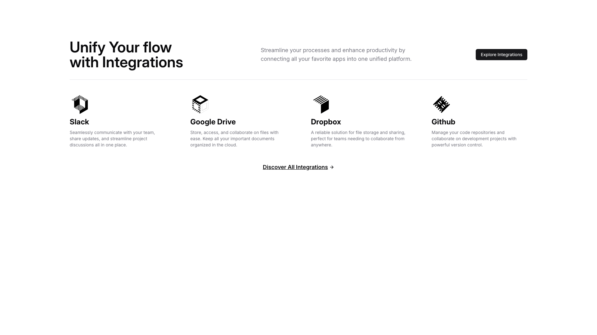

A section titled "Unify Your flow with Integrations" is positioned on the left, with accompanying body text and an "Explore Integrations" button on the right. Below, four integration options are displayed horizontally in a grid layout, each containing an image, a label, and descriptive text. A "Discover All Integrations" link is centered at the bottom of the section.

**Install**: `pnpm dlx shadcn add @shadcnblocks/feature82`

---

## feature83

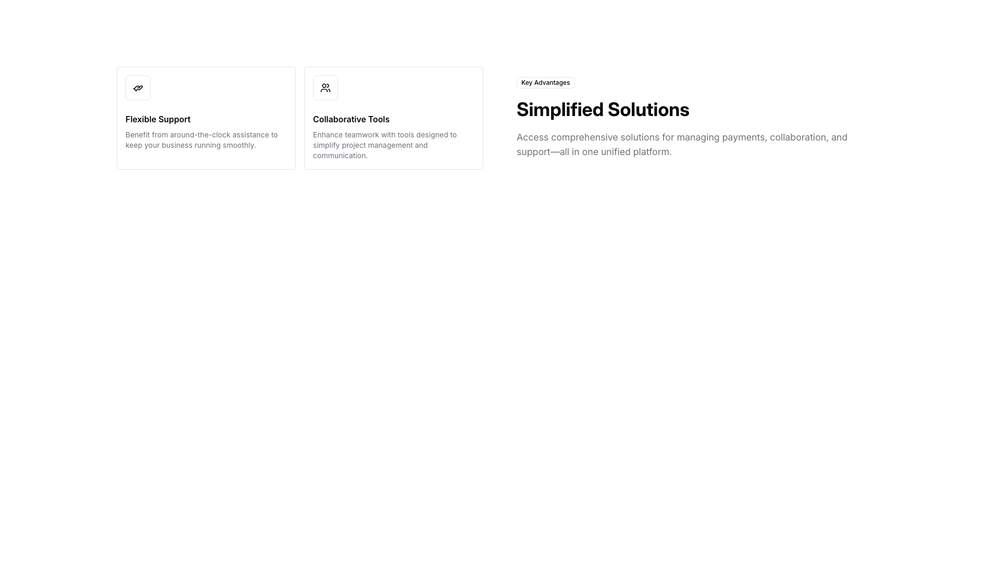

A layout section displays three content blocks arranged horizontally. On the left, two cards are stacked vertically, each containing an icon, a heading, and body text. On the right, a larger block contains a label, a main heading, and descriptive body text positioned vertically.

**Install**: `pnpm dlx shadcn add @shadcnblocks/feature83`

---

## feature85

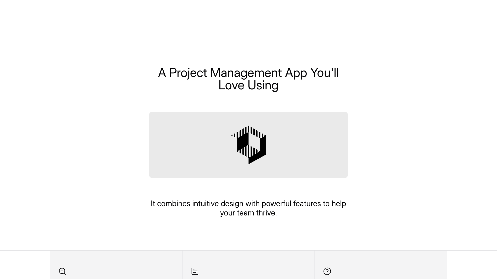

A centered layout displays a main heading at the top, followed by an image positioned in the middle of the page. Below the image is body text that spans the width of the content area. At the bottom of the block, three icon buttons are arranged horizontally and evenly spaced.

**Install**: `pnpm dlx shadcn add @shadcnblocks/feature85`

---

## feature86

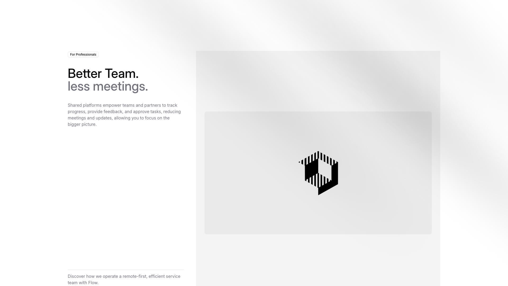

A webpage section is divided into two columns. The left column contains a small label at the top, followed by a main heading, a subheading in gray text, a body paragraph, and a line of smaller text at the bottom. The right column displays a large image centered vertically and horizontally within the space.

**Install**: `pnpm dlx shadcn add @shadcnblocks/feature86`

---

## feature87

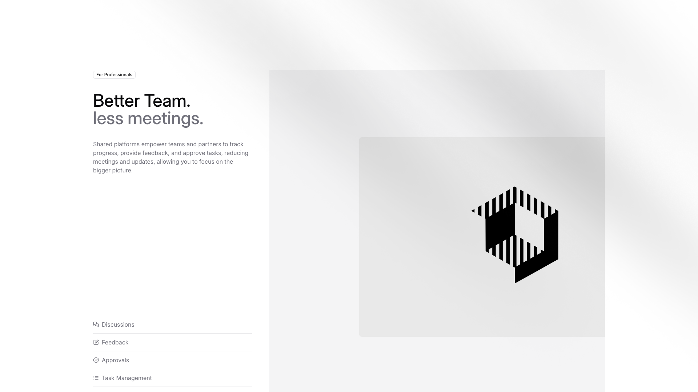

A two-column layout with text content on the left and an image on the right. The left column contains a small label at the top, followed by a main heading, subheading in gray text, body text, and four menu items listed vertically below. The right column displays a large image centered within a light gray background area.

**Install**: `pnpm dlx shadcn add @shadcnblocks/feature87`

---

## feature89

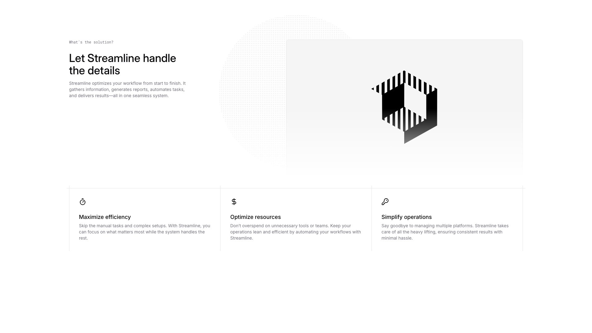

A webpage section is divided into two main areas. On the left, a small label and main heading are positioned above body text. To the right, a centered image occupies the upper portion. Below, three columns display a label, heading, and body text in each column, arranged horizontally across the full width.

**Install**: `pnpm dlx shadcn add @shadcnblocks/feature89`

---

## feature90

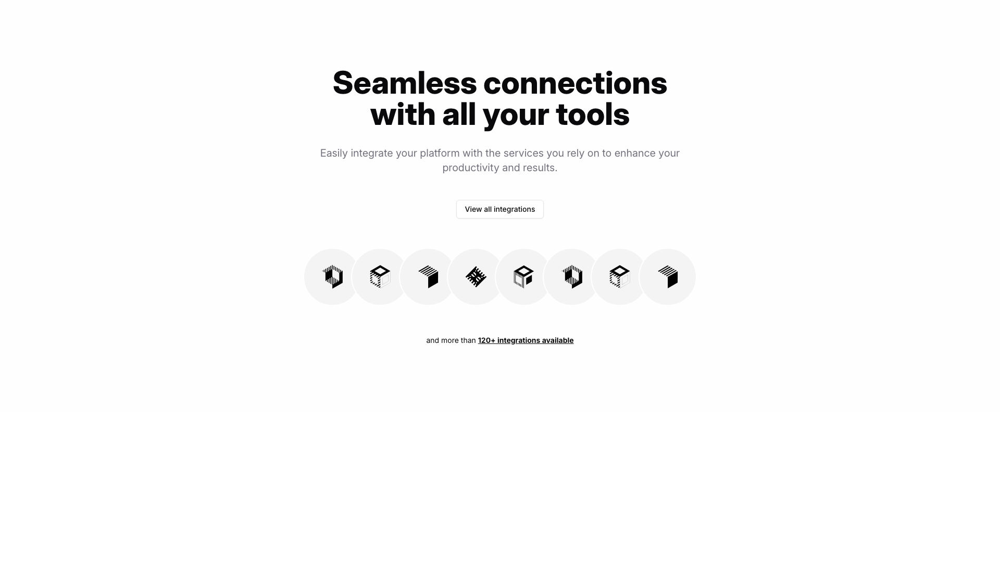

A centered section displays a main heading at the top, followed by body text underneath. Below the text sits a button, with a row of small images arranged horizontally centered. At the bottom, a label with linked text indicates additional options available.

**Install**: `pnpm dlx shadcn add @shadcnblocks/feature90`

---

## feature91

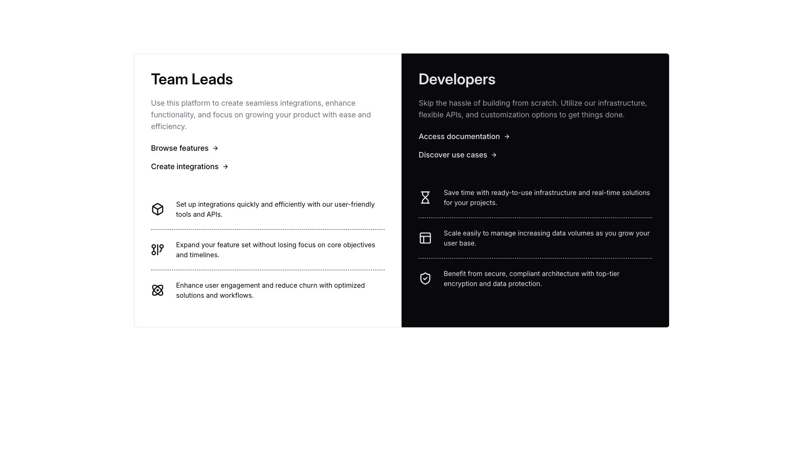

A two-column layout divides the screen horizontally. The left column features a main heading, body text, two action links, and three icon-labeled feature descriptions stacked vertically. The right column, positioned on the right side, contains a heading, body text, two action links, and three icon-labeled benefit descriptions stacked vertically.

**Install**: `pnpm dlx shadcn add @shadcnblocks/feature91`

---

## feature92

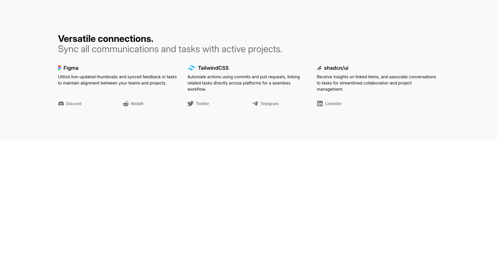

A section displays a main heading centered at the top, followed by a subtitle. Below this, three columns present integration options, each containing a smaller heading, body text, and platform labels arranged horizontally at the bottom of each column.

**Install**: `pnpm dlx shadcn add @shadcnblocks/feature92`

---

## feature93

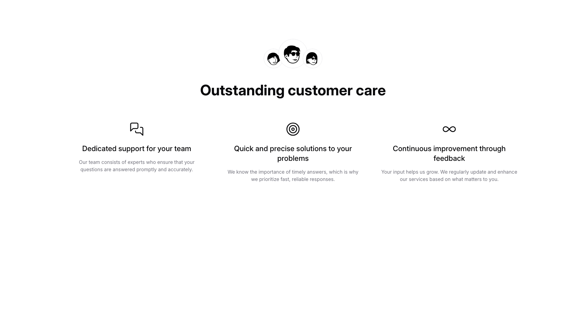

A centered section with a heading at the top, followed by three equally-spaced columns arranged horizontally below. Each column contains an icon, a subheading, and body text positioned vertically. All text elements are center-aligned within their respective columns.

**Install**: `pnpm dlx shadcn add @shadcnblocks/feature93`

---

## feature94

A section displays a main heading at the top left, with a button positioned in the top right corner. Below the heading are four equally-sized cards arranged horizontally in a row. Each card contains an image at the top, followed by a label and body text stacked vertically.

**Install**: `pnpm dlx shadcn add @shadcnblocks/feature94`

---

## feature95

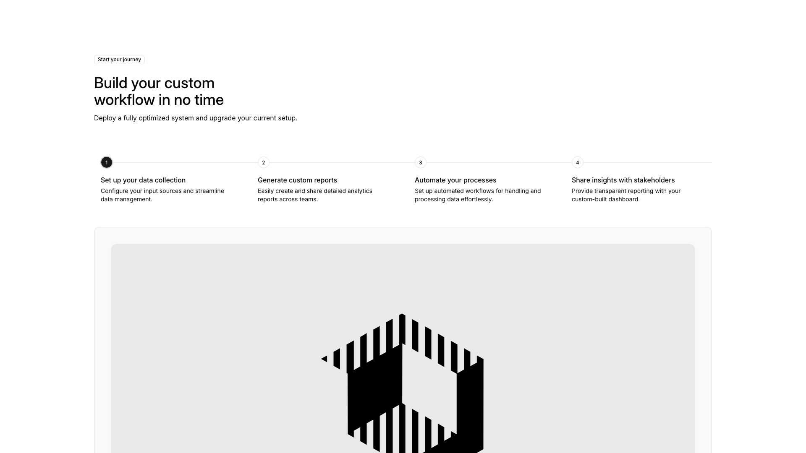

A webpage section displays a heading and subheading on the left, followed by body text. Below this is a four-step process layout arranged horizontally, with each step containing a number label, title, and descriptive text. At the bottom, a large image spans the full width of the section.

**Install**: `pnpm dlx shadcn add @shadcnblocks/feature95`

---

## feature97

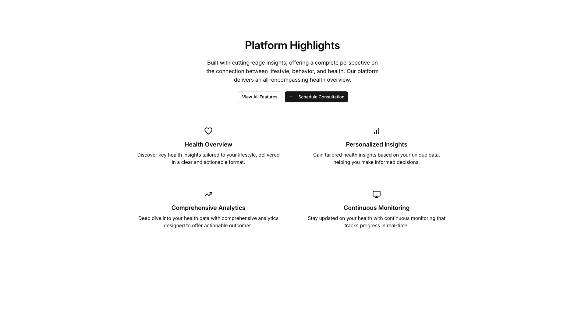

A centered section with a main heading, descriptive body text, and two action buttons positioned horizontally below. Four feature cards are arranged in a 2x2 grid layout, each containing an icon, a label heading, and descriptive body text.

**Install**: `pnpm dlx shadcn add @shadcnblocks/feature97`

---

## feature98

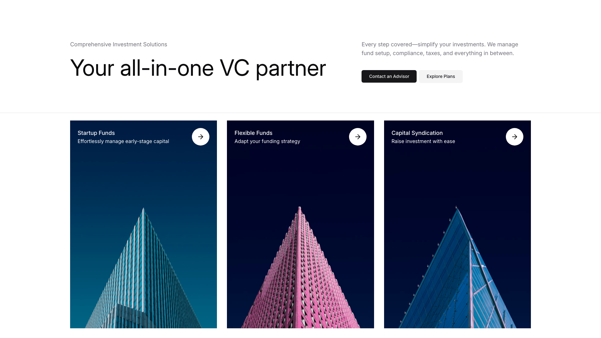

A webpage section displays a main heading on the left, with descriptive body text and two action buttons positioned on the right. Below this header area, three equally-sized card blocks are arranged horizontally, each containing a title, descriptive text, an arrow button, and a large image positioned centrally within the card.

**Install**: `pnpm dlx shadcn add @shadcnblocks/feature98`

---

## feature99

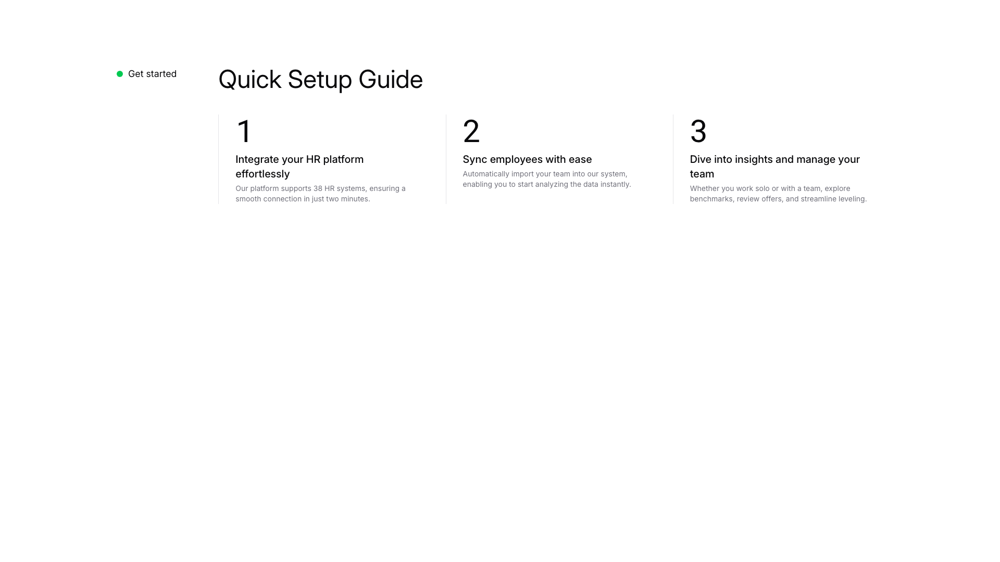

A "Quick Setup Guide" section displays three equally-spaced columns arranged horizontally. Each column contains a large number heading, a bold title, and descriptive body text positioned vertically below. A "Get started" label appears in the top left corner of the layout.

**Install**: `pnpm dlx shadcn add @shadcnblocks/feature99`

---

## feature101

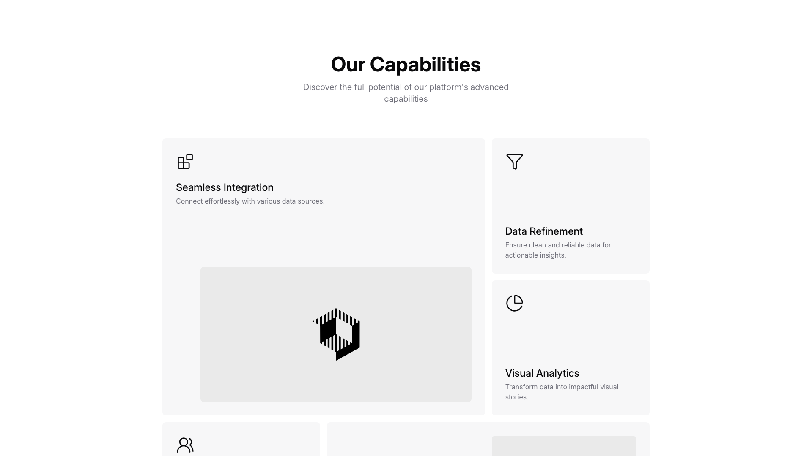

A webpage section displays a centered heading with descriptive body text at the top. Below, content is arranged in a two-column layout with a large image centered in the left column and three capability cards stacked vertically on the right side. Each card contains an icon, a heading, and body text positioned horizontally.

**Install**: `pnpm dlx shadcn add @shadcnblocks/feature101`

---

## feature102

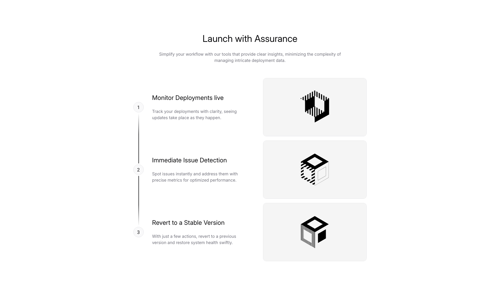

A section displays a centered main heading with body text underneath. Below this is a three-step vertical timeline on the left side, with numbered labels (1, 2, 3), step titles, and descriptive text aligned to each step. On the right side, three images are vertically stacked, each corresponding to and aligned with one of the timeline steps.

**Install**: `pnpm dlx shadcn add @shadcnblocks/feature102`

---

## feature103

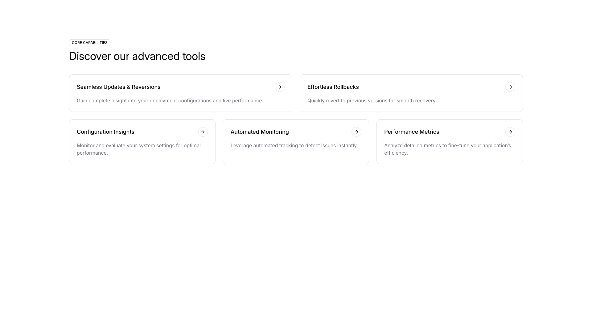

A section displays a main heading at the top, followed by five feature cards arranged in a grid layout. The top row contains two larger cards positioned horizontally, while the bottom row contains three smaller cards also arranged horizontally. Each card includes a title, descriptive body text, and a right-aligned arrow button.

**Install**: `pnpm dlx shadcn add @shadcnblocks/feature103`

---

## feature104

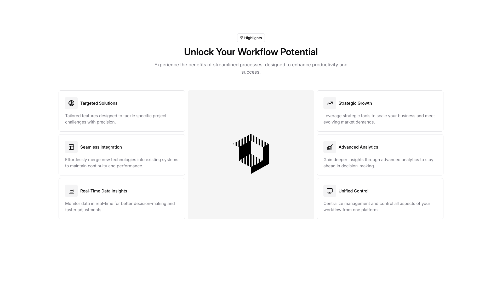

A centered section displays a main heading with supporting body text at the top. Below this, six feature cards are arranged in two columns on the left and right sides, each containing an icon, a title, and descriptive text. An image is positioned centrally between the two columns of cards.

**Install**: `pnpm dlx shadcn add @shadcnblocks/feature104`

---

## feature105

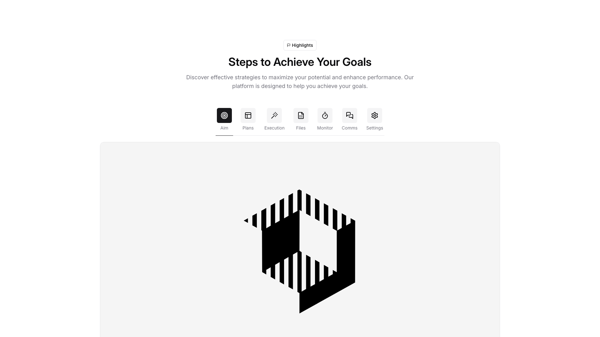

A centered page section with a heading, subheading, and body text stacked vertically at the top. Below the text, seven icon buttons with labels are arranged horizontally in a row, with the first button highlighted. The majority of the section is occupied by a large image centered in the lower portion.

**Install**: `pnpm dlx shadcn add @shadcnblocks/feature105`

---

## feature106

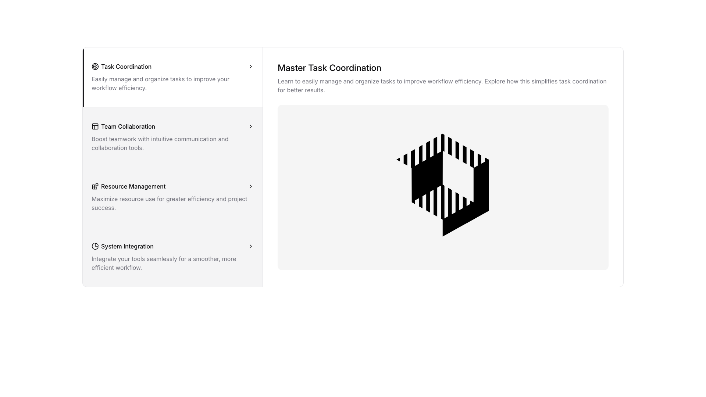

A two-column layout displays a menu structure on the left with four selectable items, each containing a label, descriptive body text, and a navigation arrow. The right column features a heading at the top, followed by body text, and a centered image positioned below.

**Install**: `pnpm dlx shadcn add @shadcnblocks/feature106`

---

## feature107

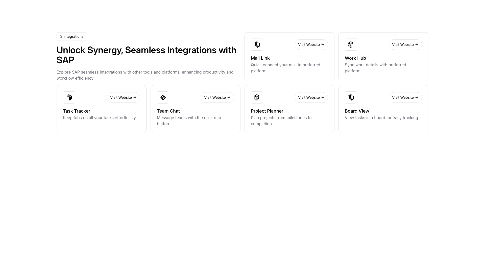

A webpage section displays integration options in a grid layout. At the top left, a heading and descriptive body text are positioned vertically. Below this, six integration cards are arranged in two rows of three columns, with each card containing an image, a title, descriptive text, and a "Visit Website" button. Two additional cards appear in the top right corner with similar layouts.

**Install**: `pnpm dlx shadcn add @shadcnblocks/feature107`

---

## feature108

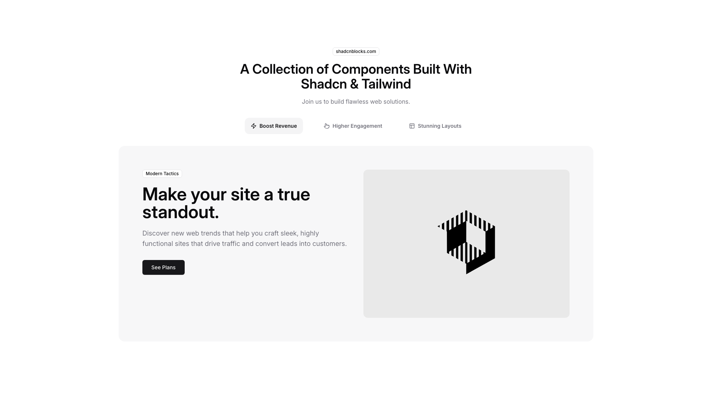

A centered webpage section with a header area containing a site title, tagline, and three feature labels horizontally aligned. Below, a two-column layout displays a left column with a category label, main heading, body text, and a button, while the right column contains a large image placeholder on a light background.

**Install**: `pnpm dlx shadcn add @shadcnblocks/feature108`

---

## feature109

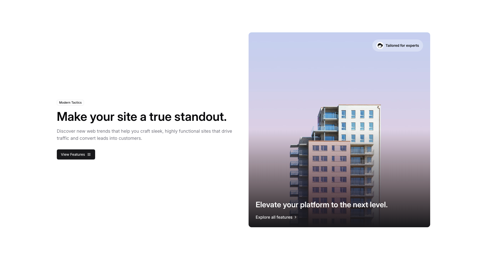

A two-column layout with content aligned left and right. The left column contains a label, a large heading, body text, and a button stacked vertically. The right column features a large card image positioned vertically, with a label, heading, body text, and a link overlaid at the bottom of the image.

**Install**: `pnpm dlx shadcn add @shadcnblocks/feature109`

---

## feature110

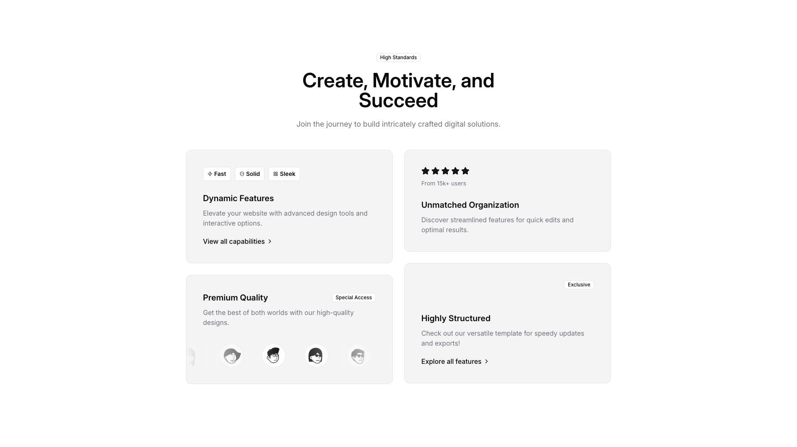

A webpage section displays a centered heading and subheading at the top, followed by a 2x2 grid layout of content cards. Each card contains a title, body text, and either a "View all capabilities" button or an "Explore all features" button. The top-right card includes a 5-star rating label and user count, while the bottom-right card features an "Exclusive" tag. The bottom-left card displays four small images in a horizontal row.

**Install**: `pnpm dlx shadcn add @shadcnblocks/feature110`

---

## feature111

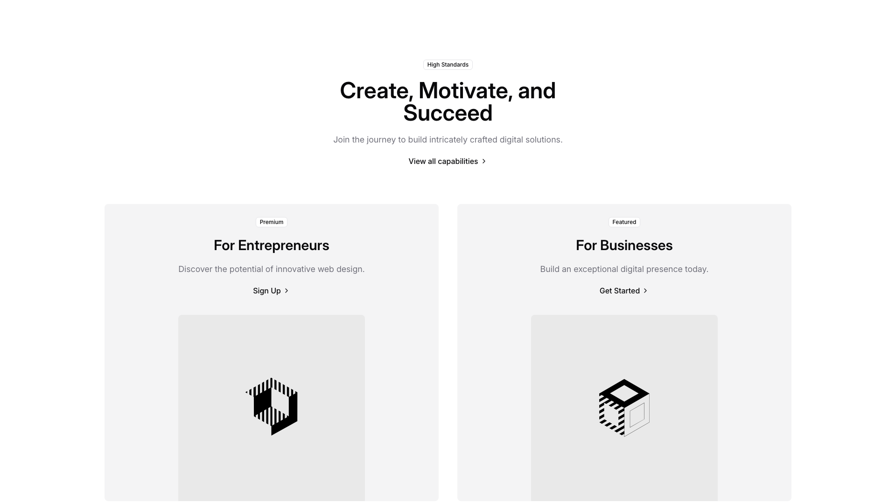

A centered hero section displays a main heading, body text, and a link, all vertically stacked. Below this is a two-column layout with equal-width cards positioned side-by-side. Each card contains a label, heading, descriptive text, a button, and an image stacked vertically.

**Install**: `pnpm dlx shadcn add @shadcnblocks/feature111`

---

## feature112

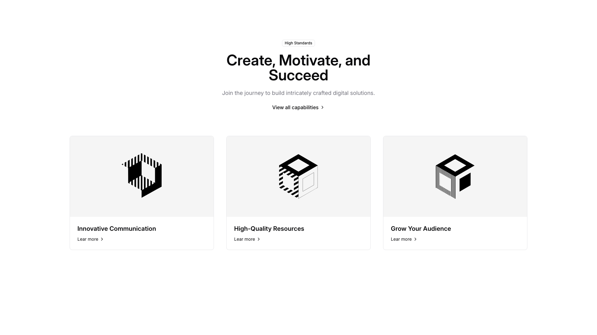

A centered page section displays a main heading, subheading, and call-to-action button stacked vertically at the top. Below this, three equally-sized cards are arranged horizontally in a row, each containing an image, a label, and a "Learn more" link positioned at the bottom.

**Install**: `pnpm dlx shadcn add @shadcnblocks/feature112`

---

## feature113

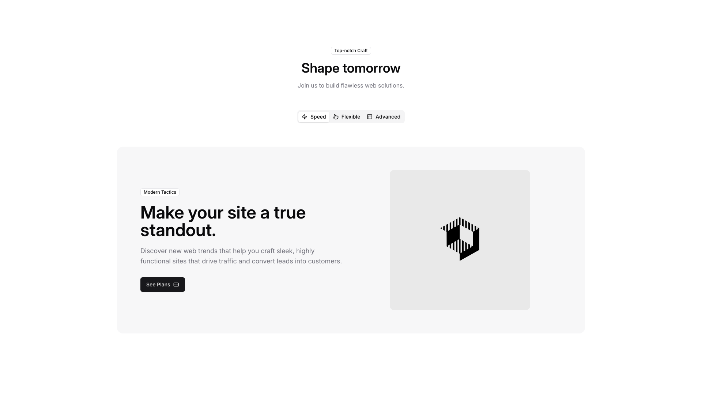

A centered webpage section features a main heading with a tagline at the top, followed by three horizontally arranged icon labels. Below this, content is arranged in two columns: the left column contains a category label, a large heading, body text, and a button, while the right column displays an image.

**Install**: `pnpm dlx shadcn add @shadcnblocks/feature113`

---

## feature114

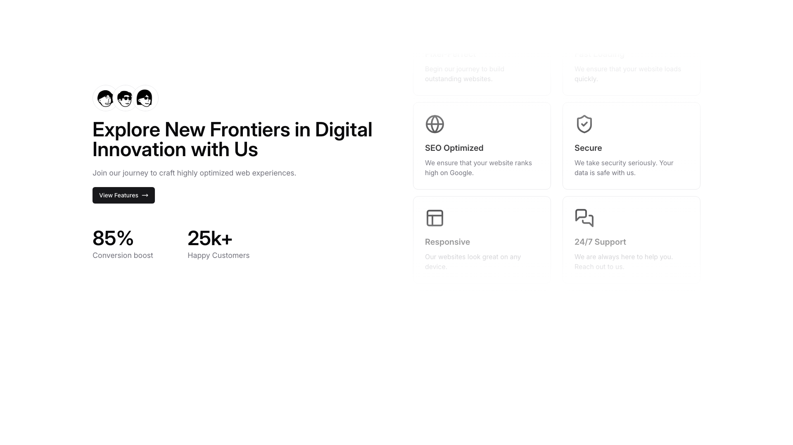

A webpage section is divided into two columns. The left column contains a small image, a large heading, body text, and a button stacked vertically. Below this are two metrics displayed horizontally. The right column features four cards arranged in a 2x2 grid, each containing an icon, a label, and descriptive body text.

**Install**: `pnpm dlx shadcn add @shadcnblocks/feature114`

---

## feature115

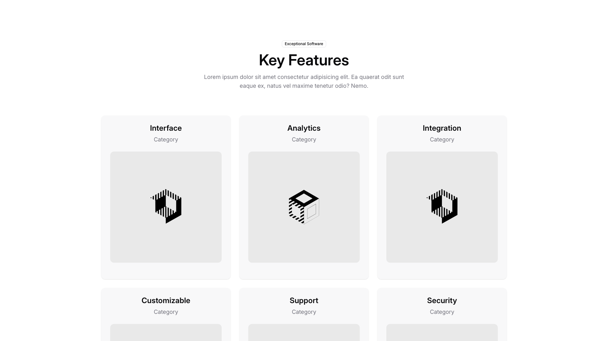

A centered section displays a header with a small label, a main heading, and descriptive body text. Below this, six feature cards are arranged in two rows of three columns, each containing a title, category label, and centered image placeholder.

**Install**: `pnpm dlx shadcn add @shadcnblocks/feature115`

---

## feature116

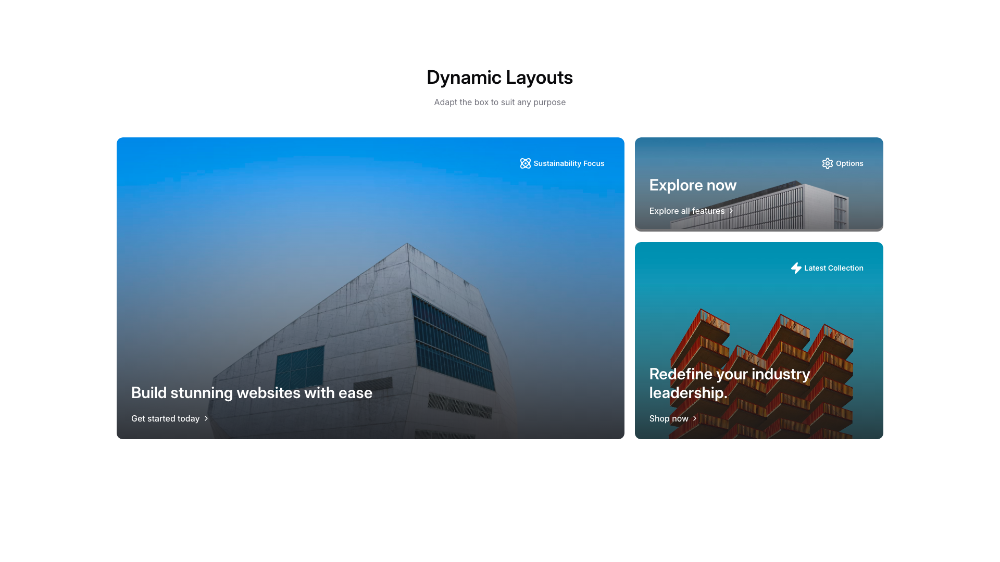

A webpage section with a centered heading and subheading at the top. Below, two cards are arranged horizontally: a large card on the left contains a heading, body text, a button, and a label in the top corner; on the right, two smaller stacked cards each feature a label, heading, body text, a button, and an image.

**Install**: `pnpm dlx shadcn add @shadcnblocks/feature116`

---

## feature117

A section with a centered heading and subheading at the top. Below, three cards are arranged horizontally in equal columns. Each card contains a label badge at the top, a large image, a heading, body text, and a linked "Explore all features" button at the bottom.

**Install**: `pnpm dlx shadcn add @shadcnblocks/feature117`

---

## feature118

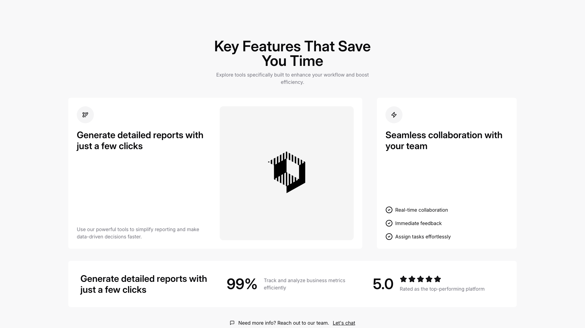

A webpage section displays a centered heading and subheading at the top. Below this is a three-column layout: the left column contains a heading, body text, and a small icon; the center features a large image; and the right column has a heading with three bullet points listed vertically. At the bottom, a horizontal layout shows a percentage statistic on the left, descriptive text in the center, and a rating badge on the right. A footer line with contact information is positioned at the very bottom.

**Install**: `pnpm dlx shadcn add @shadcnblocks/feature118`

---

## feature119

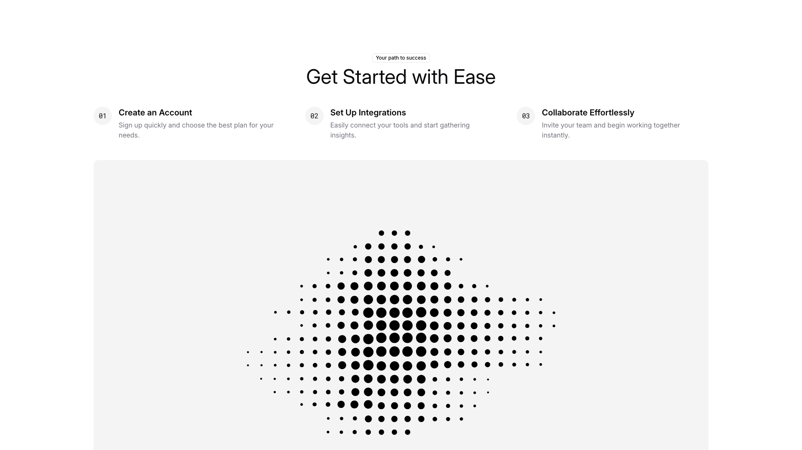

A centered webpage section displays a small label at the top, followed by a large heading. Below this, three numbered steps are arranged horizontally across the width, each containing a title and body text. Beneath the steps, a large image is centered in the lower portion of the section against a light gray background.

**Install**: `pnpm dlx shadcn add @shadcnblocks/feature119`

---

## feature120

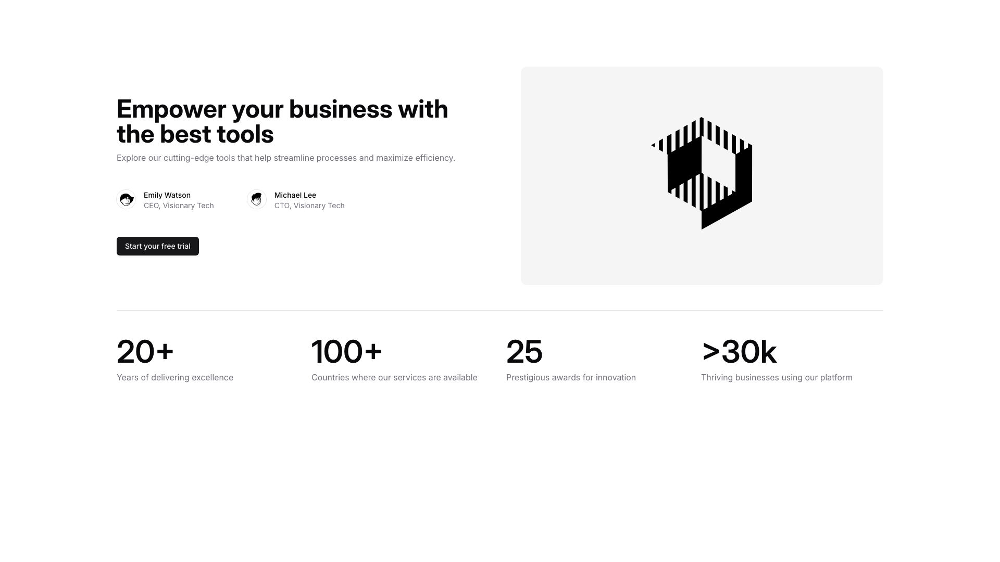

A webpage section is divided into two columns. The left column contains a main heading, body text, two profile labels with names and titles, and a button positioned below. The right column features a large image centered on a light background. Below both columns, a footer area displays four metric statistics arranged horizontally, each with a large number, label, and descriptive text.

**Install**: `pnpm dlx shadcn add @shadcnblocks/feature120`

---

## feature121

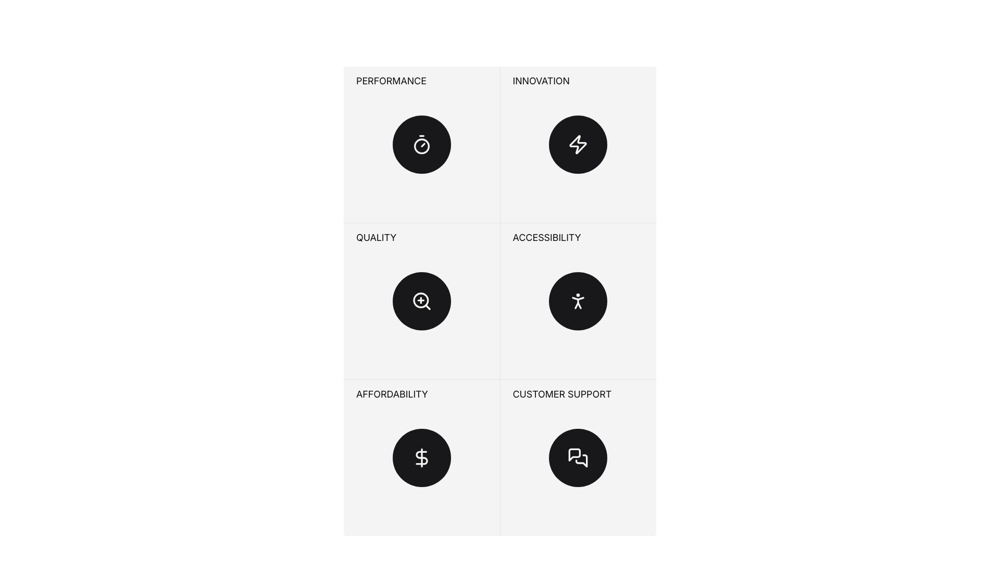

A grid layout displays six categories arranged in three rows and two columns. Each category consists of a label positioned above a centered circular icon. The labels read "Performance," "Innovation," "Quality," "Accessibility," "Affordability," and "Customer Support," progressing from top to bottom and left to right.

**Install**: `pnpm dlx shadcn add @shadcnblocks/feature121`

---

## feature122

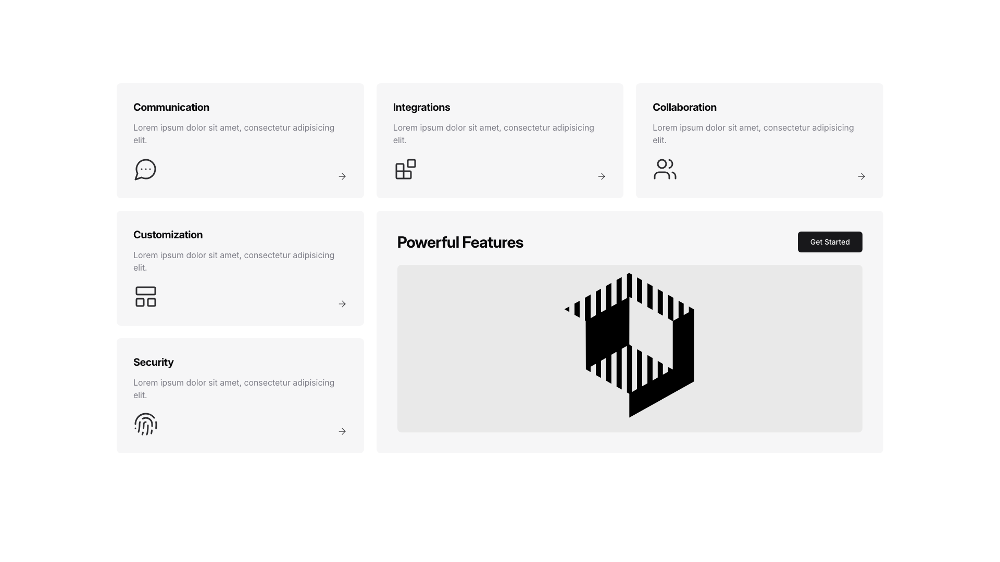

A two-column layout section features feature cards on the left and a prominent content area on the right. The left column displays five stacked cards in a grid arrangement, each containing a heading, body text, an icon, and an arrow link. The right column showcases a larger section with a heading, body text, a centered image, and a button positioned in the top right corner.

**Install**: `pnpm dlx shadcn add @shadcnblocks/feature122`

---

## feature123

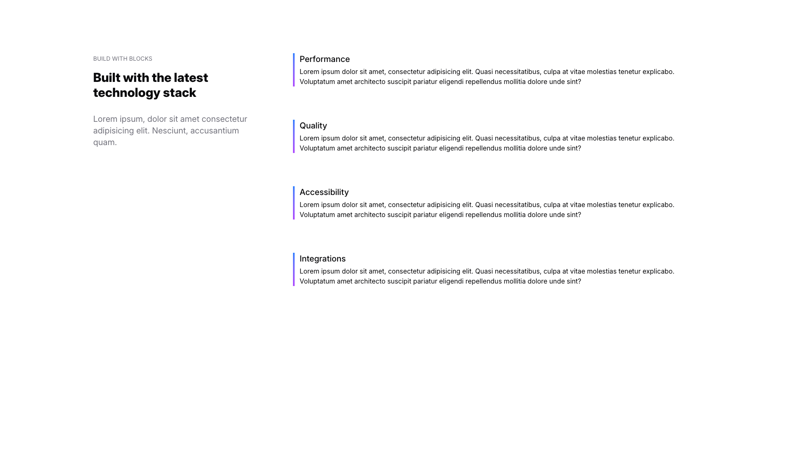

A two-column layout with content positioned horizontally. The left column contains a small tag, a main heading, and body text. The right column displays four vertically stacked sections, each with a bold heading preceded by a colored left border, followed by body text below each heading.

**Install**: `pnpm dlx shadcn add @shadcnblocks/feature123`

---

## feature124

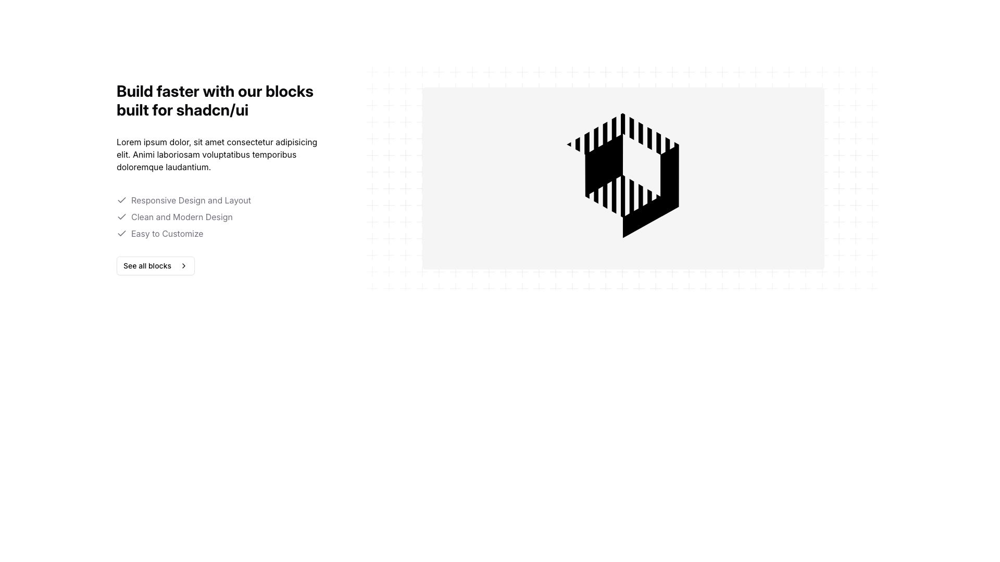

A two-column layout section with content on the left and an image on the right. The left column contains a main heading, body text, three checkmarked labels stacked vertically, and a call-to-action button below. The right column features a centered image positioned against a light gray background.

**Install**: `pnpm dlx shadcn add @shadcnblocks/feature124`

---

## feature125

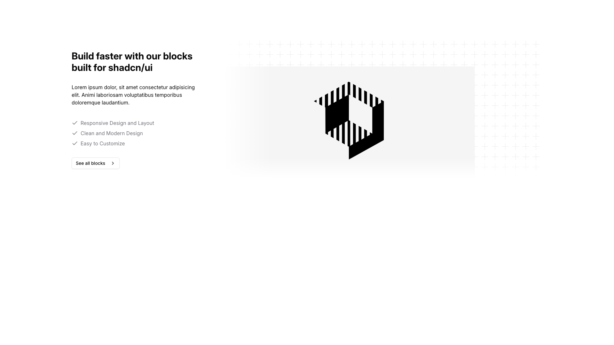

A two-column layout with content positioned on the left and an image on the right. The left column contains a main heading, body text, and three checkmarked labels stacked vertically, followed by a button below. The right column displays a centered image on a light gray background.

**Install**: `pnpm dlx shadcn add @shadcnblocks/feature125`

---

## feature126

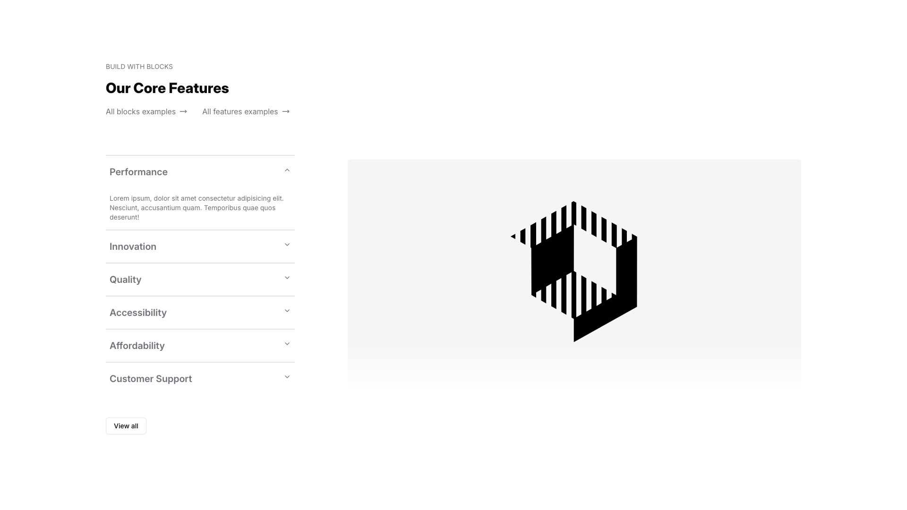

A two-column layout displays core features content. The left column contains a section label, a main heading, navigation links, and a vertically stacked accordion menu with multiple expandable items and a button below. The right column features a centered image on a light background.

**Install**: `pnpm dlx shadcn add @shadcnblocks/feature126`

---

## feature127

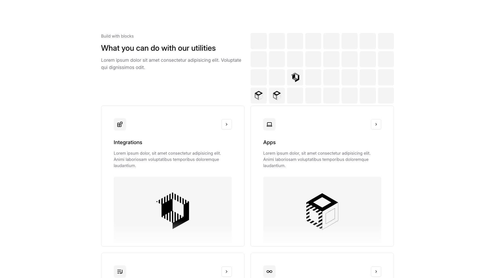

A section displays a main heading and body text on the left, with a grid of placeholder blocks on the right. Below, four cards are arranged in a 2x2 grid, each containing an icon, a label, descriptive text, and a centered image, with a navigation arrow positioned on the right side of each card.

**Install**: `pnpm dlx shadcn add @shadcnblocks/feature127`

---

## feature128

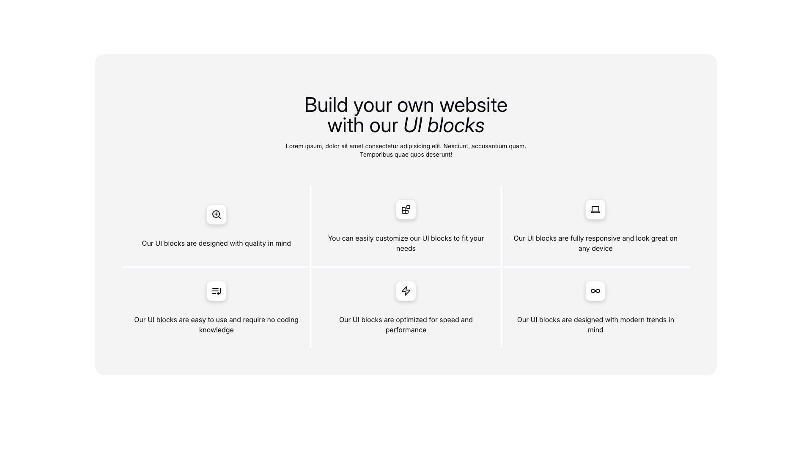

A centered section with a main heading and descriptive body text at the top. Below this is a grid of six feature cards arranged in two rows and three columns. Each card contains a small icon centered at the top, with descriptive text positioned below. Vertical dividing lines separate the columns, and horizontal lines divide the rows.

**Install**: `pnpm dlx shadcn add @shadcnblocks/feature128`

---

## feature129

A centered section displays a main heading at the top, followed by body text describing the feature. Below this, four horizontal tabs/labels are aligned center. A light gray background container occupies the lower portion, with descriptive text at the top and a centered image positioned in the middle of the container.

**Install**: `pnpm dlx shadcn add @shadcnblocks/feature129`

---

## feature130

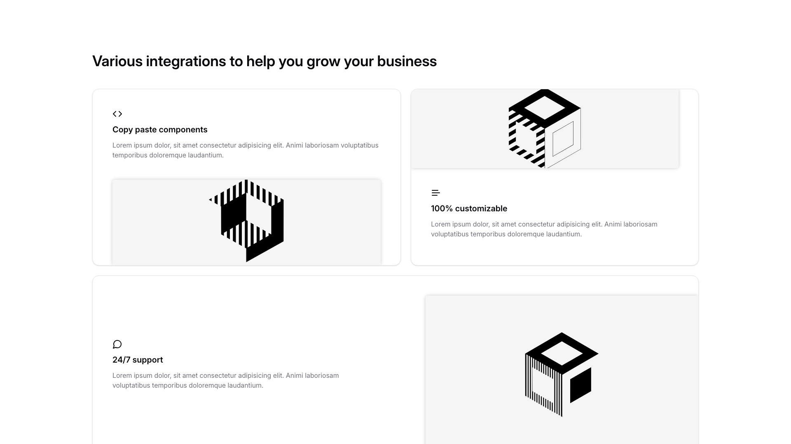

A section titled "Various integrations to help you grow your business" displays four feature cards arranged in a 2x2 grid layout. Each card contains a small icon on the left, a heading, body text below, and a larger image positioned on the right side of the card. The cards are vertically stacked in two rows and horizontally aligned in two columns.

**Install**: `pnpm dlx shadcn add @shadcnblocks/feature130`

---

## feature131

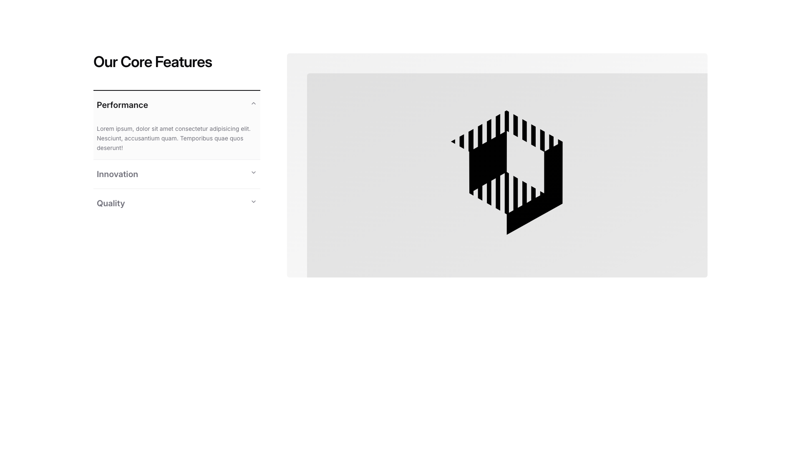

A section displays content in two columns with a left sidebar and right content area. The left column contains a main heading "Our Core Features" followed by a horizontal divider, then three expandable menu items stacked vertically with labels and descriptive body text beneath the first item. The right column features a large image centered on a light gray background.

**Install**: `pnpm dlx shadcn add @shadcnblocks/feature131`

---

## feature132

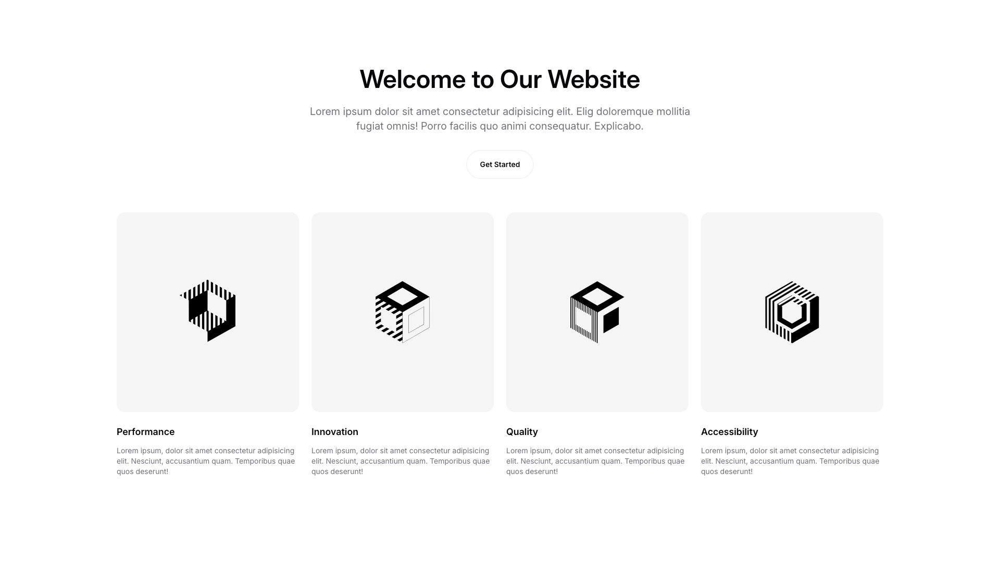

A centered webpage section with a main heading, descriptive body text, and a centered button positioned above a four-column grid layout. Each column contains an image centered within a rounded container, followed by a label and body text positioned below.

**Install**: `pnpm dlx shadcn add @shadcnblocks/feature132`

---

## feature133

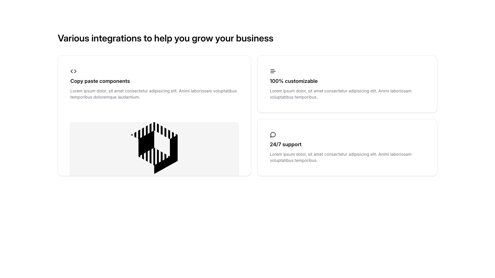

A section displays a main heading at the top, followed by a two-column grid layout. The left column contains a small icon, a title, body text, and an image positioned below. The right column is vertically stacked with two cards, each containing an icon, a title, and body text.

**Install**: `pnpm dlx shadcn add @shadcnblocks/feature133`

---

## feature134

A section displays workflow enhancement features in a grid layout. At the top, a centered heading and descriptive body text are positioned above the content. Below, six feature cards are arranged in two rows—the first row contains two larger cards spanning the full width, while the second row contains three cards of equal width. Each card includes a heading, body text, an icon image, and a link indicator in the top-right corner.

**Install**: `pnpm dlx shadcn add @shadcnblocks/feature134`

---

## feature135

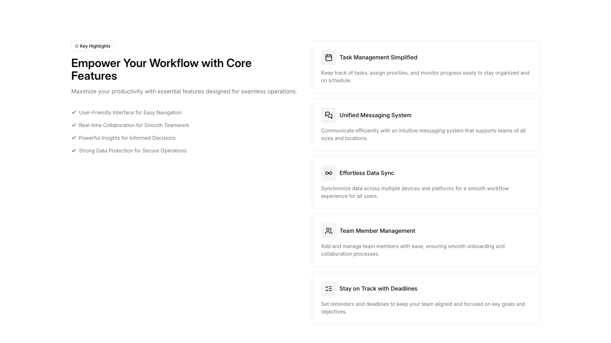

A two-column layout with the left column containing a main heading, subtitle, body text, and four checkbox-style list items. The right column displays six vertically stacked feature cards, each with an icon on the left, a title heading, and descriptive body text below.

**Install**: `pnpm dlx shadcn add @shadcnblocks/feature135`

---

## feature136

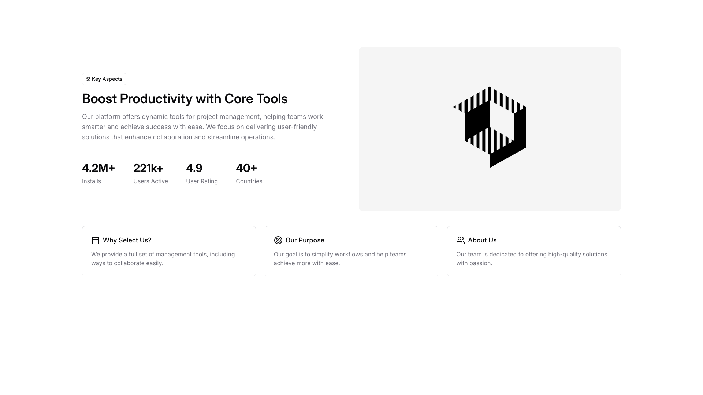

A webpage section is divided into two main columns. The left column contains a heading, descriptive body text, and four metric labels arranged horizontally below. The right column features a centered image. Below both columns, three equally-sized cards are arranged horizontally, each containing a small icon, a heading, and body text.

**Install**: `pnpm dlx shadcn add @shadcnblocks/feature136`

---

## feature137

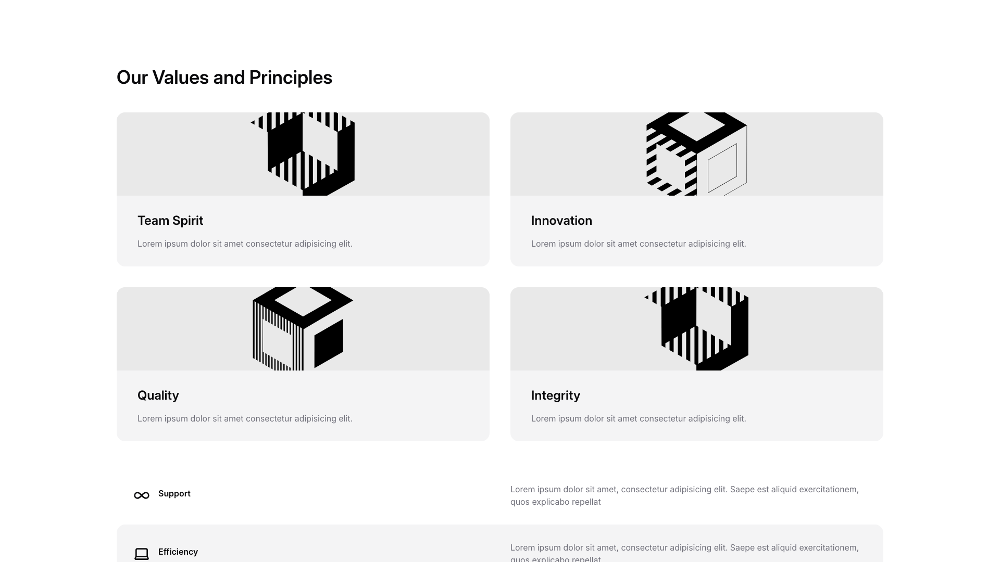

A section titled "Our Values and Principles" displays four value cards arranged in a 2x2 grid layout. Each card contains an image positioned at the top, followed by a heading and body text below. Below the grid, two additional items are listed vertically on the left side with small icons, each accompanied by body text positioned to the right.

**Install**: `pnpm dlx shadcn add @shadcnblocks/feature137`

---

## feature138

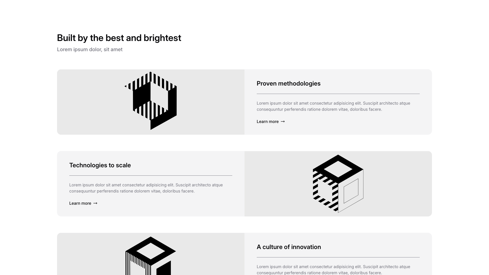

A vertical stack of three content sections, each contained within a light gray box. Each section alternates between positioning an image on the left or right, paired with text content on the opposite side. Every section includes a heading, body text, and a "Learn more" link, arranged horizontally in a two-column layout.

**Install**: `pnpm dlx shadcn add @shadcnblocks/feature138`

---

## feature139

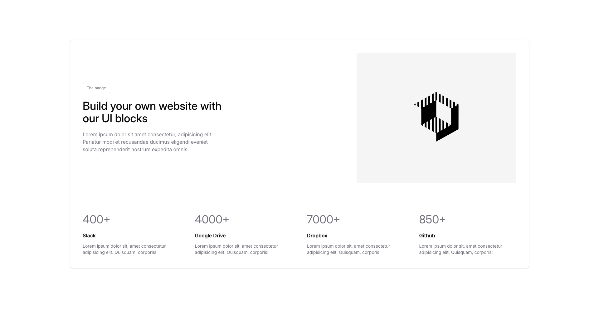

A webpage section displays a two-column layout with text content on the left and an image on the right. The left column contains a small label, a large heading, body text, and four horizontally arranged stat blocks below, each with a large number, a title, and descriptive text. The right column features a centered image against a light background.

**Install**: `pnpm dlx shadcn add @shadcnblocks/feature139`

---

## feature140

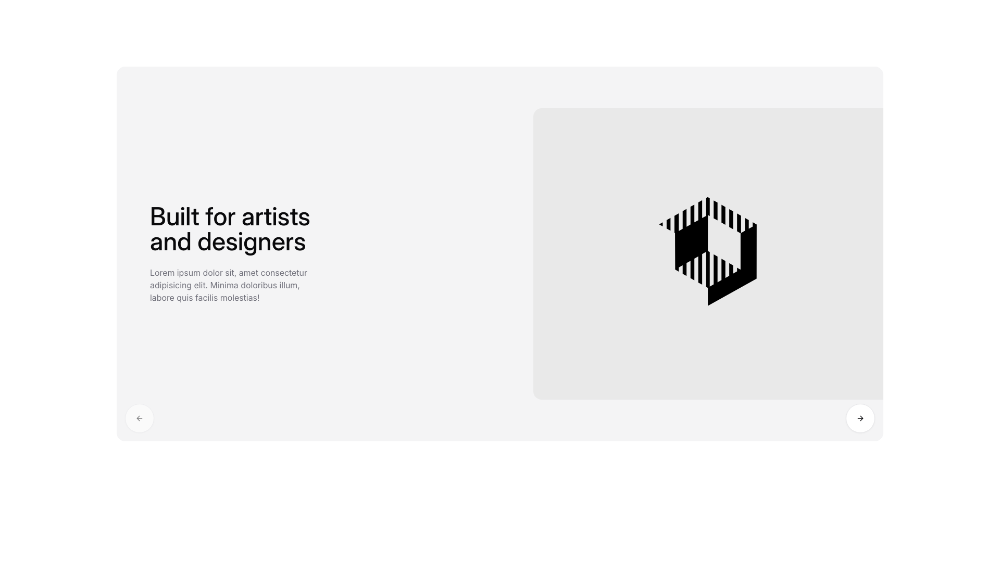

A horizontal two-column layout with the left column containing a large heading, body text, and a small label. The right column displays a large image, vertically centered. Navigation arrows are positioned at the bottom left and right edges of the layout.

**Install**: `pnpm dlx shadcn add @shadcnblocks/feature140`

---

## feature141

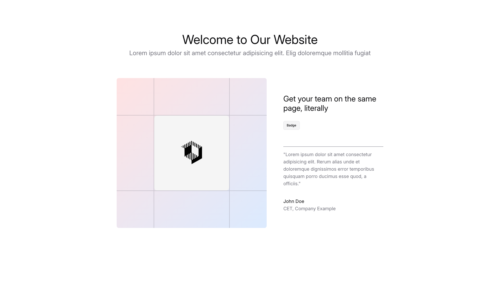

A webpage section is organized in two columns. The left column features a large image centered vertically. The right column contains a heading, a label tag, a horizontal divider line, body text, and attribution text (name and title) positioned vertically below the divider.

**Install**: `pnpm dlx shadcn add @shadcnblocks/feature141`

---

## feature142

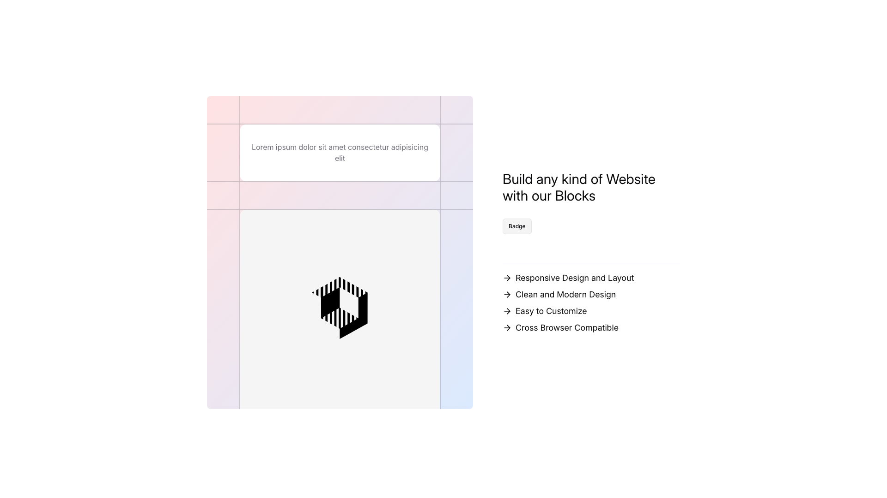

A two-column layout with a large image on the left side and text content on the right. The right column contains a main heading, a badge label, a horizontal divider line, and a vertical list of four bullet points below the divider.

**Install**: `pnpm dlx shadcn add @shadcnblocks/feature142`

---

## feature143

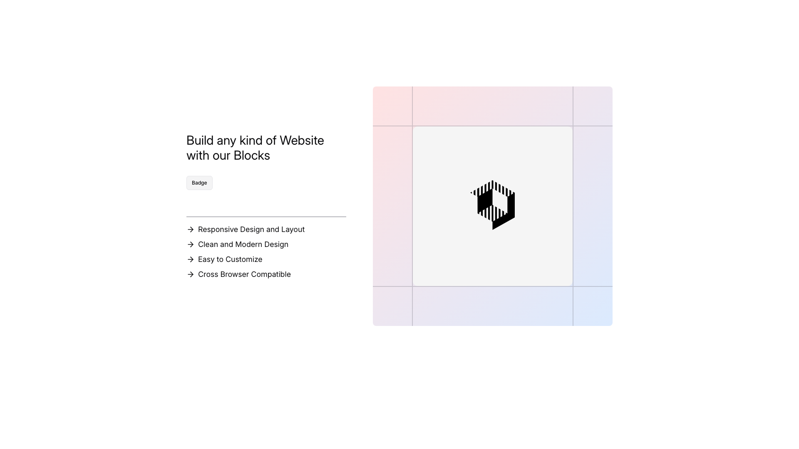

A webpage section is divided into two columns with a left-aligned text area and a right-aligned visual element. The left column contains a main heading, a label tag, and a bulleted list of four items. On the right, a large square image is centered within a grid-patterned container that spans the right portion of the layout.

**Install**: `pnpm dlx shadcn add @shadcnblocks/feature143`

---

## feature144

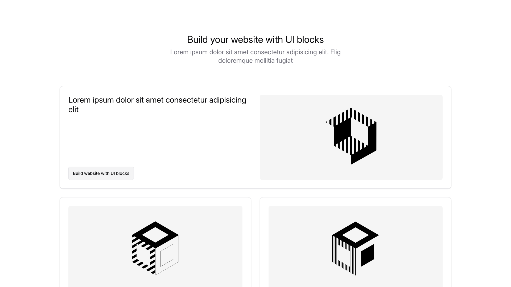

A webpage section features a centered heading and body text at the top. Below, a large content block is divided into two columns: the left column contains body text and a button label, while the right column displays an image. Beneath this primary block, two smaller equal-width blocks are positioned horizontally, each containing a centered image.

**Install**: `pnpm dlx shadcn add @shadcnblocks/feature144`

---

## feature145

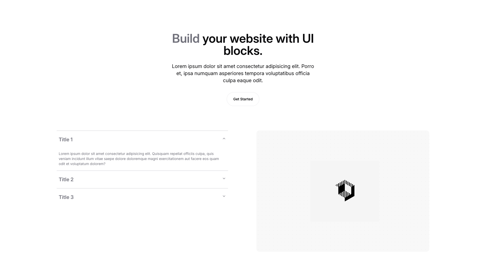

A centered layout with a main heading and body text positioned at the top, followed by a call-to-action button. Below this, content is divided into two columns: the left column contains an accordion-style list with expandable titles and descriptive text, while the right column displays a single image.

**Install**: `pnpm dlx shadcn add @shadcnblocks/feature145`

---

## feature146

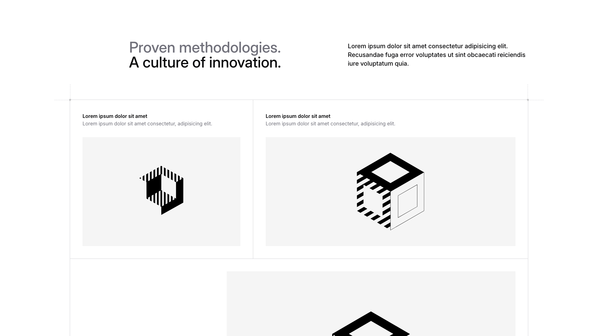

A section displays a main heading centered at the top, followed by body text on the right. Below this, content is organized in a two-column grid layout with two cards positioned horizontally in the upper row, each containing a title, descriptive text, and an image. A third card appears partially visible in the lower row, centered.

**Install**: `pnpm dlx shadcn add @shadcnblocks/feature146`

---

## feature147

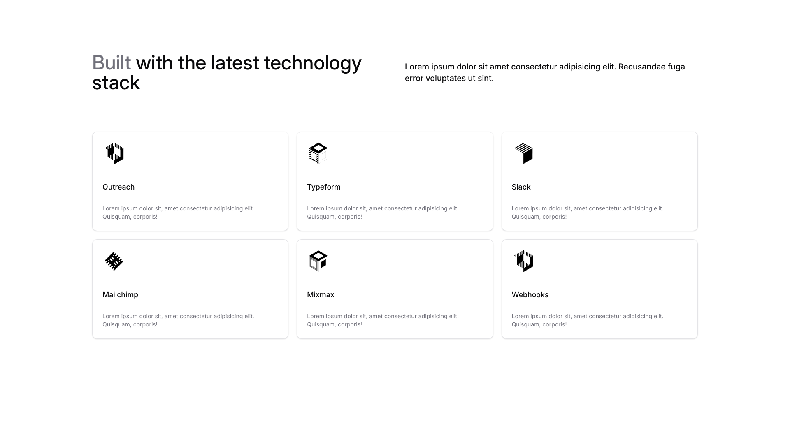

A section with a main heading and descriptive body text positioned on the left, followed by a grid of six card components arranged in two rows and three columns. Each card contains a small image at the top, a label, and body text below.

**Install**: `pnpm dlx shadcn add @shadcnblocks/feature147`

---

## feature148

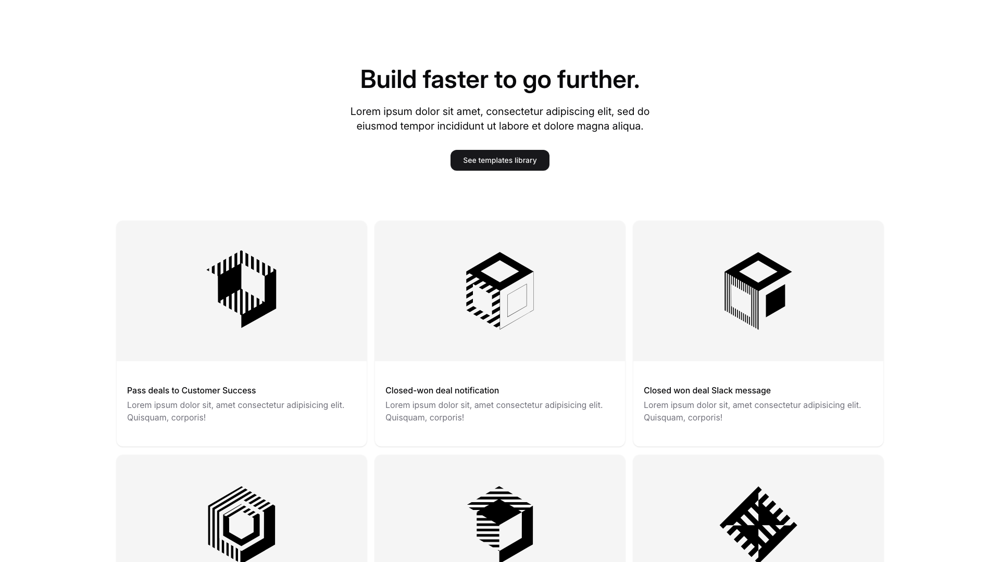

A vertically stacked section features a centered heading at the top, followed by body text and a button, all horizontally centered. Below this, six feature cards are arranged in two rows of three columns. Each card contains an image positioned at the top, with a label and descriptive body text aligned below.

**Install**: `pnpm dlx shadcn add @shadcnblocks/feature148`

---

## feature149

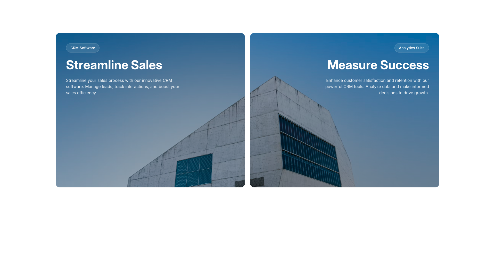

A section displays two equal-width cards positioned horizontally side-by-side. Each card contains a small label tag at the top, a large heading, body text below, and a background image. The left card has text aligned to the left, while the right card has text aligned to the right.

**Install**: `pnpm dlx shadcn add @shadcnblocks/feature149`

---

## feature150

A webpage section is divided into two equal columns with a vertical divider. The left column contains a heading, body text, and a button labeled "Learn More" positioned below. The right column mirrors this layout with its own heading, body text, and a button labeled "Get Started" positioned below.

**Install**: `pnpm dlx shadcn add @shadcnblocks/feature150`

---

## feature152

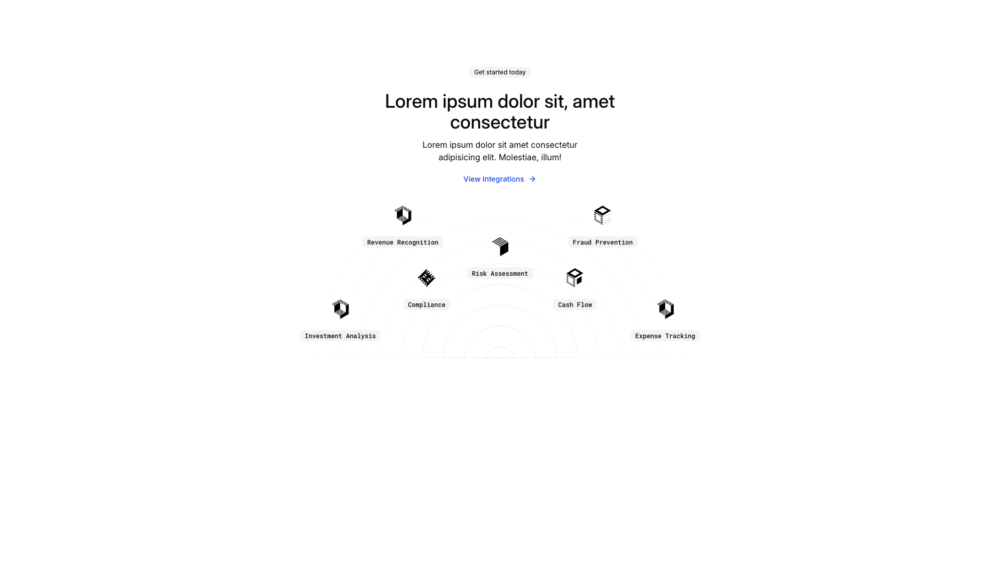

A centered webpage section displays a small label at the top, followed by a large heading and body text in the middle. Below the text is a linked button. Six labeled icons are arranged horizontally in two rows across the lower portion of the section, creating a balanced grid layout.

**Install**: `pnpm dlx shadcn add @shadcnblocks/feature152`

---

## feature153

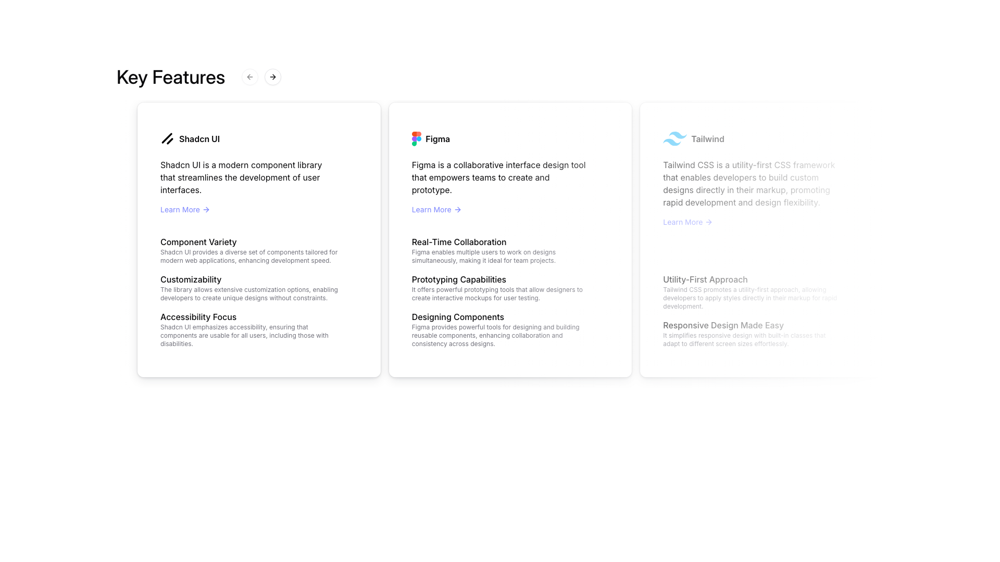

A "Key Features" section displays three vertically stacked cards arranged horizontally. Each card contains a heading with an icon on the left, followed by descriptive body text, a "Learn More" link, and multiple subheadings with supporting text below. Navigation arrows are positioned at the top right of the section title.

**Install**: `pnpm dlx shadcn add @shadcnblocks/feature153`

---

## feature154

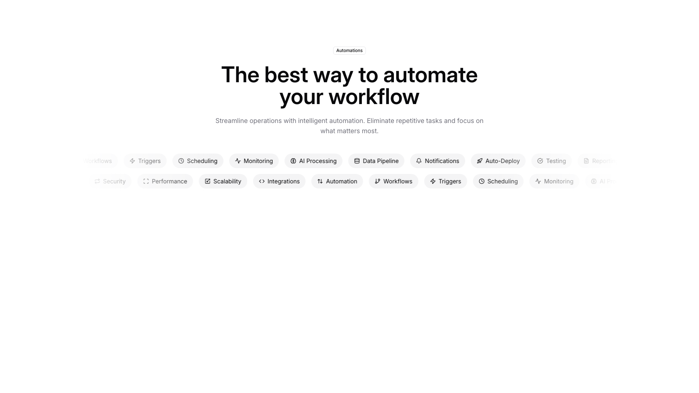

A centered hero section displays a small label tag at the top, followed by a large heading and descriptive body text. Below the text, two horizontally-aligned rows of feature labels or navigation items are arranged in a grid pattern, creating a comprehensive feature overview.

**Install**: `pnpm dlx shadcn add @shadcnblocks/feature154`

---

## feature156

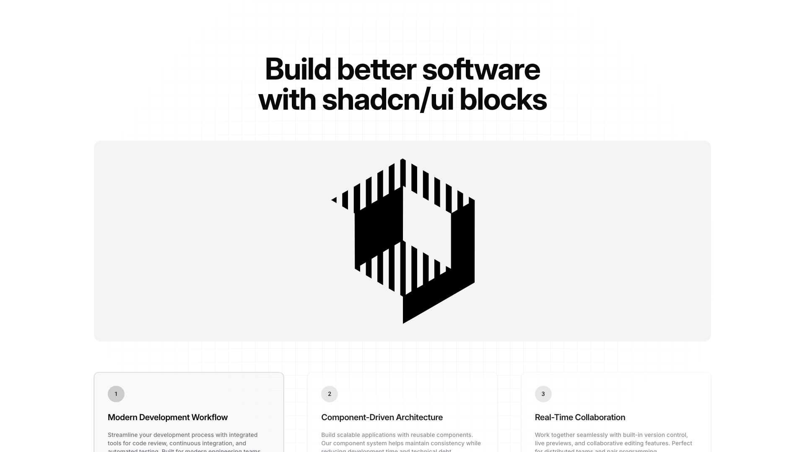

A centered section features a main heading at the top, followed by a large image positioned in the middle. Below the image, three numbered cards are arranged horizontally in a row, each containing a label number, a title, and body text stacked vertically.

**Install**: `pnpm dlx shadcn add @shadcnblocks/feature156`

---

## feature157

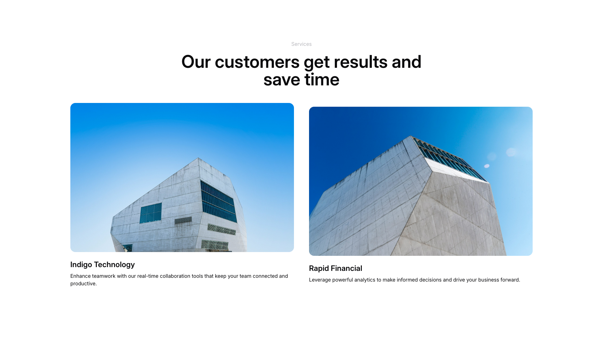

A section displays a centered heading at the top, followed by two cards arranged horizontally. Each card contains an image positioned above a title and body text. The left and right cards are evenly spaced and aligned vertically.

**Install**: `pnpm dlx shadcn add @shadcnblocks/feature157`

---

## feature158

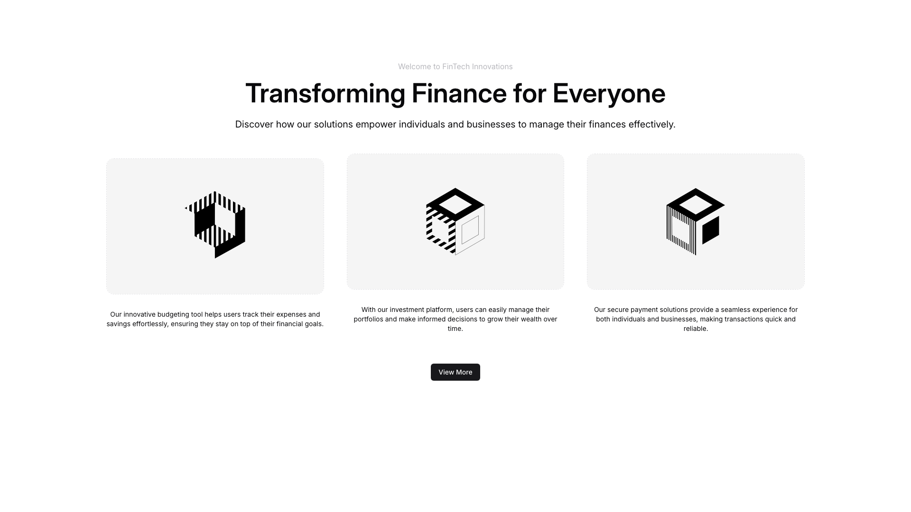

A centered webpage section features a main heading at the top, followed by descriptive body text. Below this, three content cards are arranged horizontally, each containing an image, a label, and body text. A "View More" button is centered at the bottom of the section.

**Install**: `pnpm dlx shadcn add @shadcnblocks/feature158`

---

## feature159

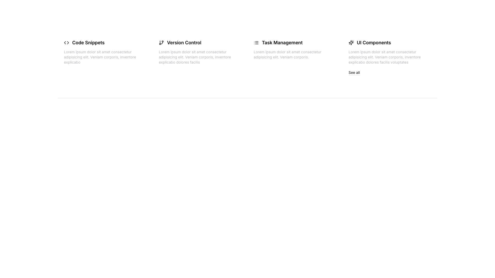

A horizontal layout displays four equal-width columns, each containing a heading with an icon on the left, followed by body text below. The rightmost column includes a "See all" link positioned at the bottom. All columns are vertically aligned and separated by subtle dividing lines.

**Install**: `pnpm dlx shadcn add @shadcnblocks/feature159`

---

## feature160

A webpage section is organized vertically with a main heading and body text positioned on the left side at the top. Below this, four labeled columns are arranged horizontally, each containing a smaller heading and body text. At the bottom, a large image spans the full width of the section.

**Install**: `pnpm dlx shadcn add @shadcnblocks/feature160`

---

## feature161

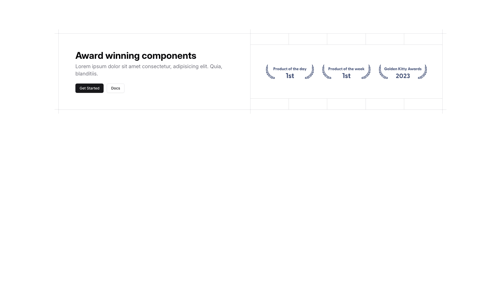

A webpage section is divided into two columns with a left-aligned layout. The left column contains a heading, body text, and two buttons positioned horizontally below. The right column displays three award badges arranged horizontally across the top of the section.

**Install**: `pnpm dlx shadcn add @shadcnblocks/feature161`

---

## feature162

This layout features two horizontally stacked sections, each containing text on the left and an image on the right. The top section displays a heading and body text aligned to the left, with an image positioned on the right side. The bottom section follows the same two-column structure, with descriptive text on the left and a corresponding image on the right.

**Install**: `pnpm dlx shadcn add @shadcnblocks/feature162`

---

## feature163

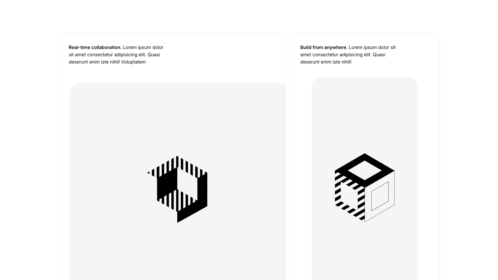

A two-column layout with equal-width cards positioned side-by-side. Each card contains a heading and body text at the top, with a large image centered below. The left and right cards maintain identical structural formatting with vertically stacked text and image elements.

**Install**: `pnpm dlx shadcn add @shadcnblocks/feature163`

---

## feature164

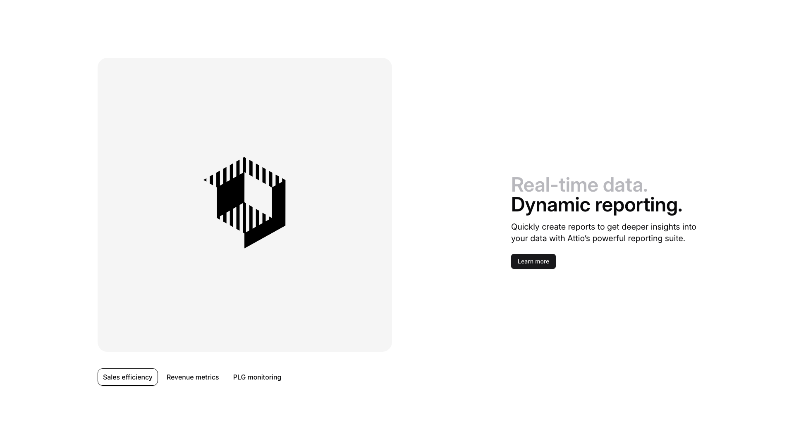

A two-column layout with an image centered on the left side and text content positioned on the right. The right column contains a heading, subheading, body text, and a button vertically stacked. Below the main content area, three labels are horizontally arranged at the bottom left.

**Install**: `pnpm dlx shadcn add @shadcnblocks/feature164`

---

## feature166

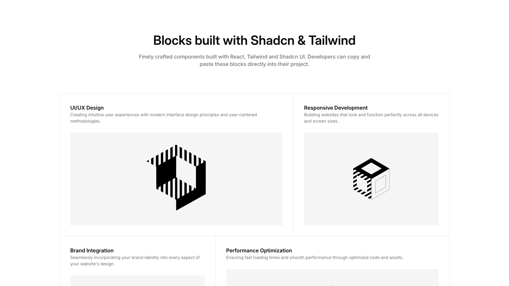

A webpage section displays four feature cards arranged in a 2x2 grid layout. Each card contains a heading, descriptive body text positioned at the top, and an image centered below. The cards are organized horizontally in two rows, with equal spacing between them.

**Install**: `pnpm dlx shadcn add @shadcnblocks/feature166`

---

## feature167

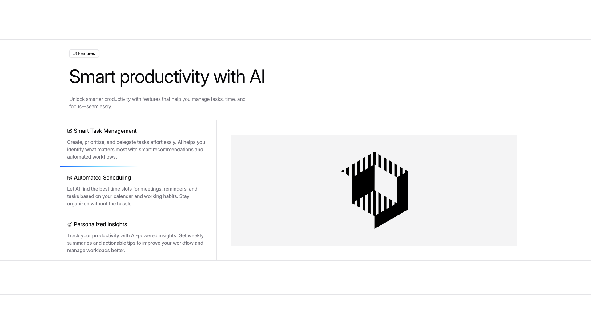

A feature section displays content in two columns. The left column contains a main heading, descriptive body text, and three stacked feature cards with titles and descriptions. The right column features a large centered image positioned vertically aligned with the content on the left.

**Install**: `pnpm dlx shadcn add @shadcnblocks/feature167`

---

## feature168

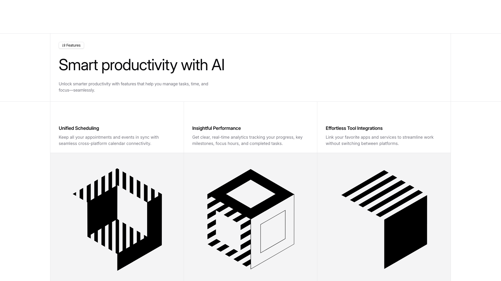

A feature section displays a main heading and descriptive body text at the top, followed by three equally-sized columns arranged horizontally below. Each column contains a smaller heading, explanatory text, and an image positioned centrally within its container.

**Install**: `pnpm dlx shadcn add @shadcnblocks/feature168`

---

## feature169

A webpage section features a main heading centered at the top, followed by supporting body text. Below this is a horizontally arranged row of three labeled feature cards, each containing a title and descriptive text. At the bottom of the section, a large image is centered and spans the full width.

**Install**: `pnpm dlx shadcn add @shadcnblocks/feature169`

---

## feature170

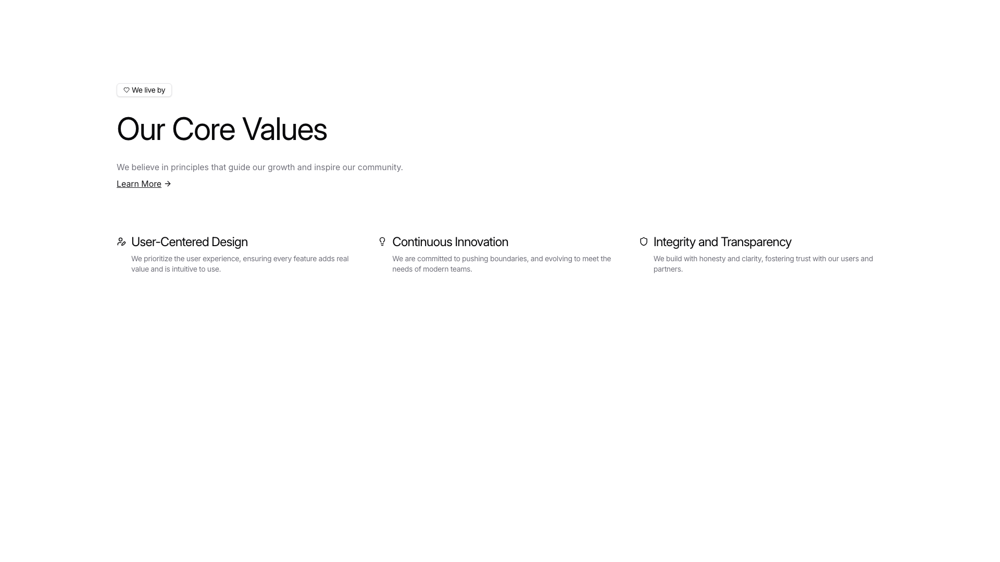

A webpage section displays a heading "Our Core Values" with accompanying body text on the left side, followed by a "Learn More" link. Below, three values are presented horizontally in equal columns, each containing a small icon, a title, and descriptive body text aligned vertically.

**Install**: `pnpm dlx shadcn add @shadcnblocks/feature170`

---

## feature171

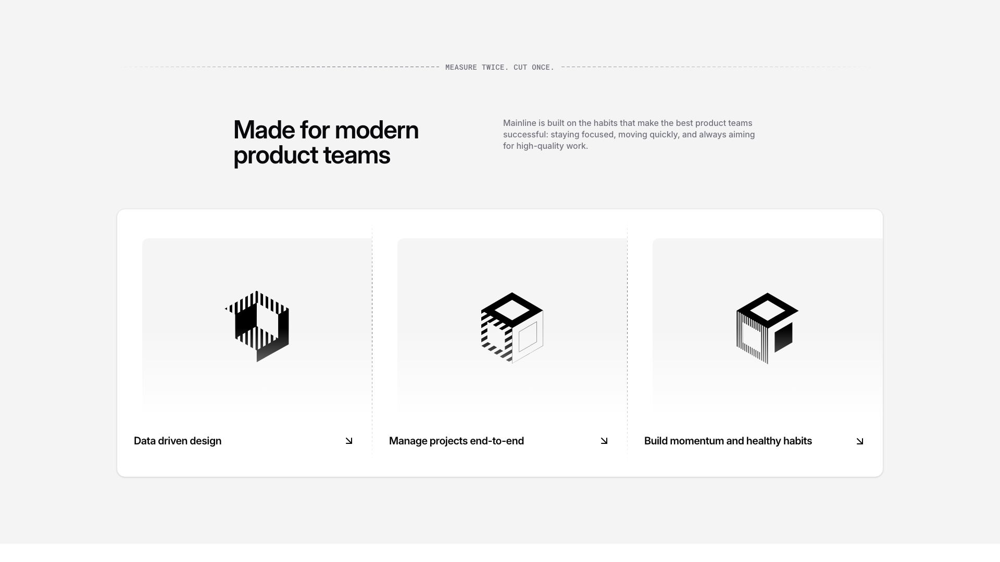

A section displays a main heading on the left, with accompanying body text positioned on the right. Below this, three cards are arranged horizontally, each containing an image centered at the top, a label positioned at the bottom, and a small directional icon in the lower right corner.

**Install**: `pnpm dlx shadcn add @shadcnblocks/feature171`

---

## feature172

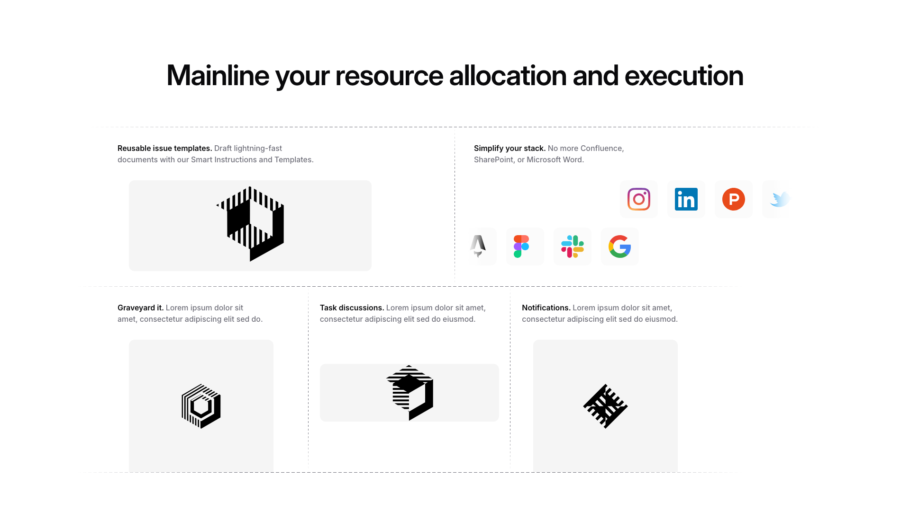

A webpage section displays a main heading at the top, followed by two distinct content areas separated horizontally. The upper half contains two columns: the left column has a smaller heading with body text and an image below, while the right column displays a heading with body text and multiple social media/application logos arranged in a grid. The lower half is divided into three equal columns, each containing a heading, body text, and a centered image stacked vertically.

**Install**: `pnpm dlx shadcn add @shadcnblocks/feature172`

---

## feature173

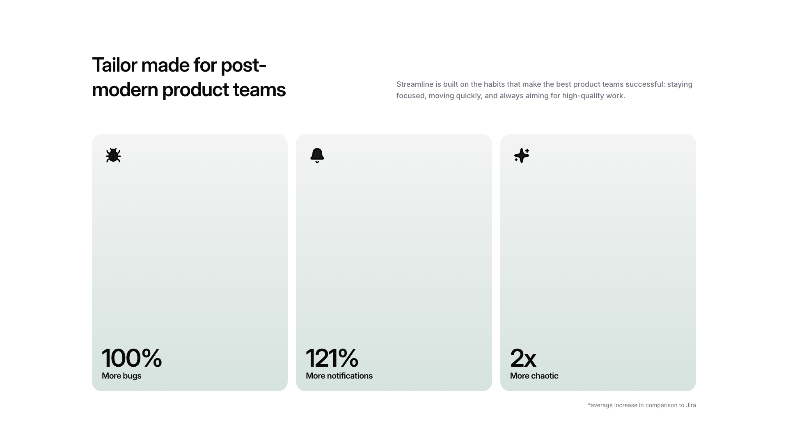

A webpage section features a large heading on the left side, followed by body text on the right. Below this introductory content, three cards are arranged horizontally in a grid layout. Each card contains an icon at the top, a large numerical value centered in the middle, and a label beneath it.

**Install**: `pnpm dlx shadcn add @shadcnblocks/feature173`

---

## feature174

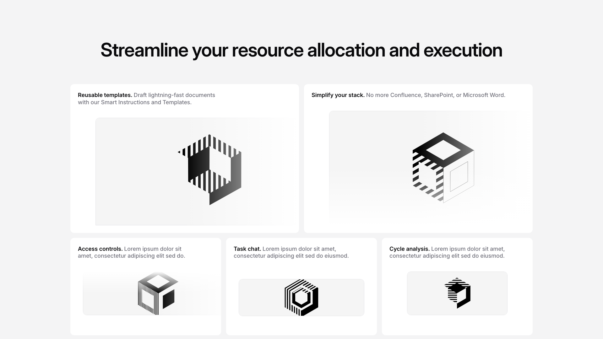

A section displays a main heading at the top, followed by a two-column layout. The top row contains two cards, each with a title, body text, and an image centered below. The bottom row shows three cards arranged horizontally, each featuring a label, descriptive body text, and a centered image.

**Install**: `pnpm dlx shadcn add @shadcnblocks/feature174`

---

## feature175

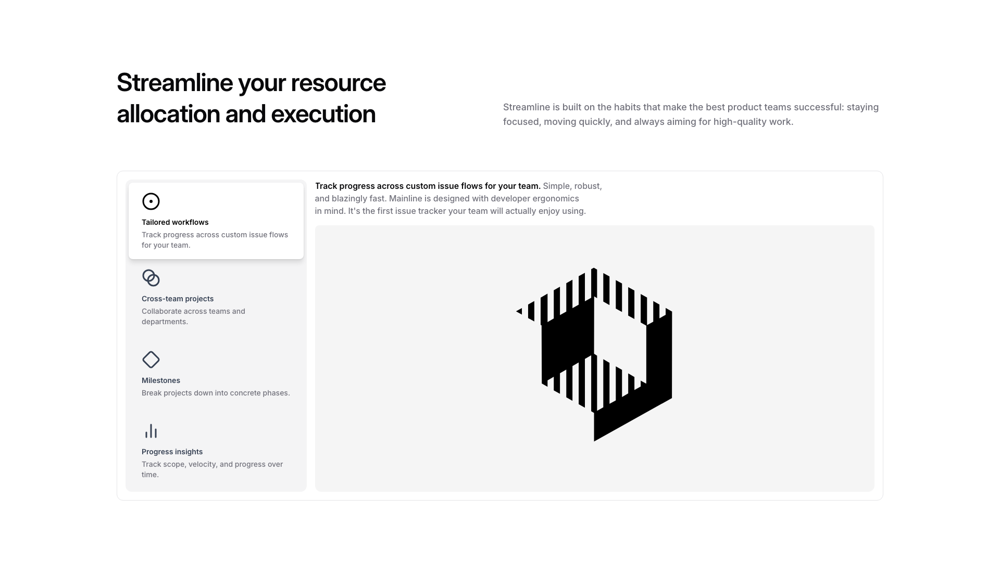

A two-column layout section with a large heading on the left side, followed by four vertically stacked feature cards below it. Each card contains a numbered icon, a subheading, and descriptive body text. To the right, explanatory body text appears at the top, with a large geometric image centered below it.

**Install**: `pnpm dlx shadcn add @shadcnblocks/feature175`

---

## feature176

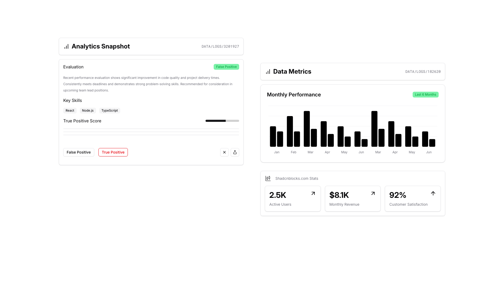

The screenshot displays two main sections arranged horizontally. On the left, an "Analytics Snapshot" panel contains a heading, body text, a "Key Skills" section with labeled items, a progress bar, and toggle buttons at the bottom. On the right, a "Data Metrics" panel is organized vertically with a heading, a bar chart spanning the full width, and three metric cards displaying numerical values with labels arranged horizontally below the chart.

**Install**: `pnpm dlx shadcn add @shadcnblocks/feature176`

---

## feature180

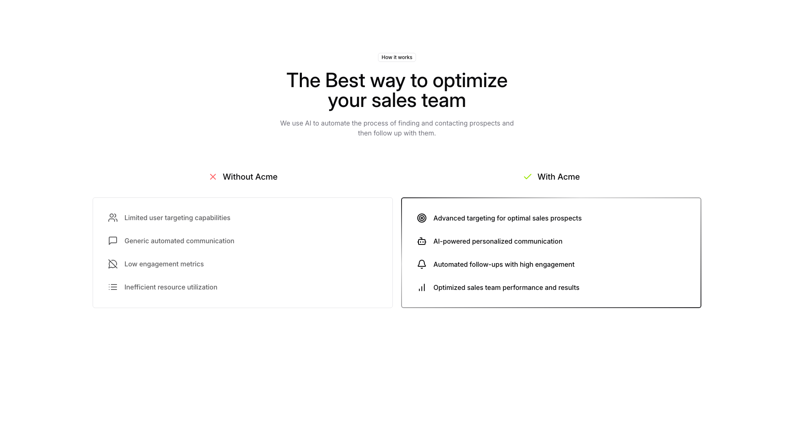

A centered section displays a main heading with descriptive body text at the top. Below this, two columns are positioned side-by-side: the left column contains a label and four bullet points with icons, while the right column contains a label and four bullet points with different icons. Each column is contained within a bordered box.

**Install**: `pnpm dlx shadcn add @shadcnblocks/feature180`

---

## feature181

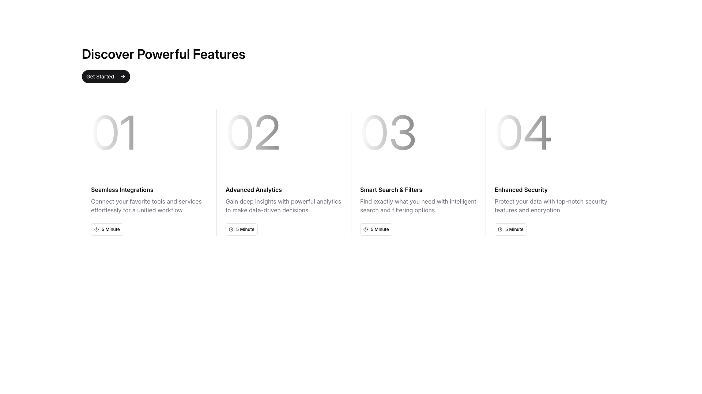

A features section displays a main heading at the top left with a button positioned below it. Four feature cards are arranged horizontally in a grid layout, each containing a large number label, a subheading, body text, and a time label at the bottom.

**Install**: `pnpm dlx shadcn add @shadcnblocks/feature181`

---

## feature182

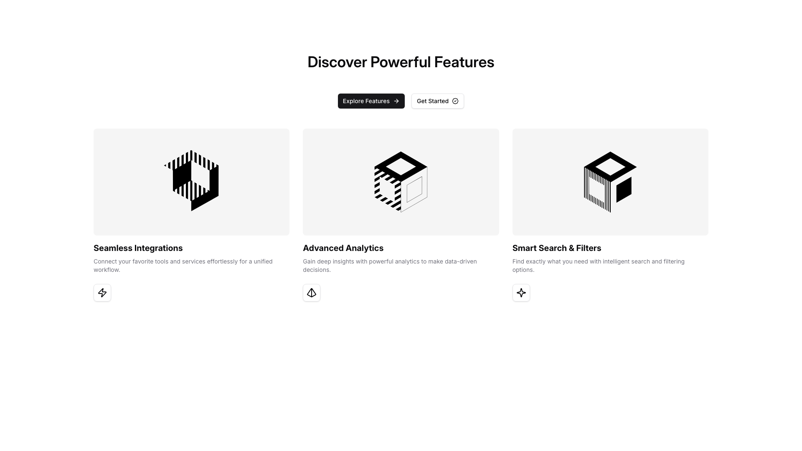

A centered section displays a main heading at the top, followed by two buttons positioned horizontally below it. Underneath, three cards are arranged in a horizontal row, each containing an image at the top, a title, body text, and an icon at the bottom.

**Install**: `pnpm dlx shadcn add @shadcnblocks/feature182`

---

## feature183

A mobile-centered layout displays a smartphone image in the center with two information cards positioned on either side. Below the phone, three metrics are arranged horizontally in columns, each containing a large numerical heading, a label, and descriptive body text.

**Install**: `pnpm dlx shadcn add @shadcnblocks/feature183`

---

## feature184

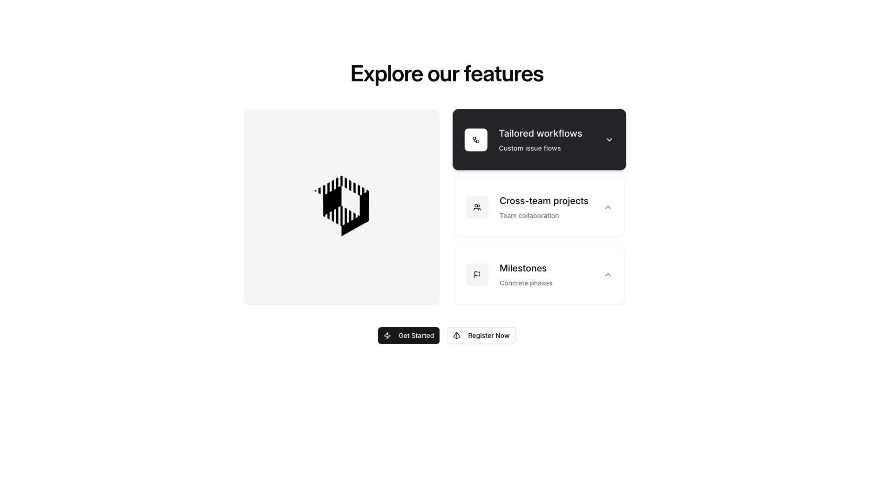

A centered section features a main heading at the top, followed by a two-column layout below. The left column contains a large image, while the right column displays three stacked feature cards, each with an icon, heading, and descriptive label. Two buttons are horizontally positioned at the bottom center of the section.

**Install**: `pnpm dlx shadcn add @shadcnblocks/feature184`

---

## feature186

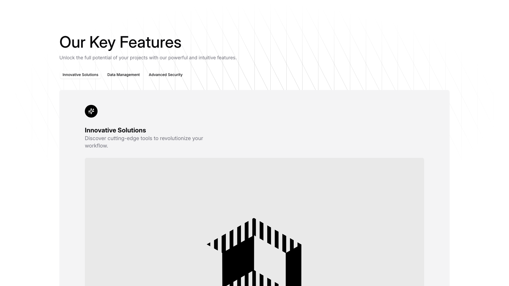

A features section displays a main heading at the top, followed by descriptive body text. Below this are three horizontally-aligned tabs or labels. The selected tab reveals content on the left side, consisting of an icon, a subheading, and body text, while a large image occupies the right side of the layout.

**Install**: `pnpm dlx shadcn add @shadcnblocks/feature186`

---

## feature187

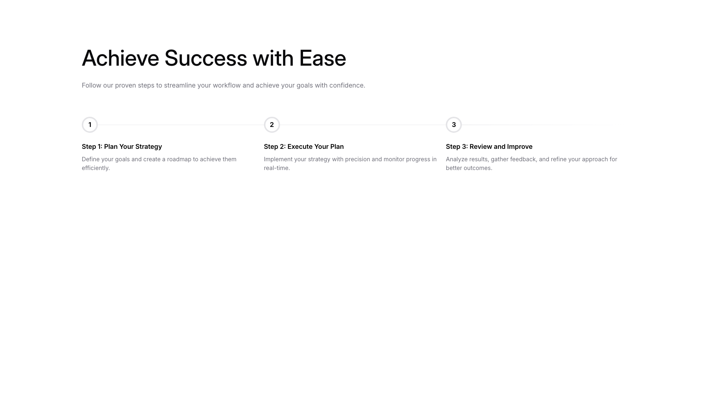

A webpage section features a centered layout with a main heading at the top, followed by descriptive body text. Below this is a horizontally arranged three-column structure, each containing a numbered label, a subheading, and body text describing sequential steps.

**Install**: `pnpm dlx shadcn add @shadcnblocks/feature187`

---

## feature188

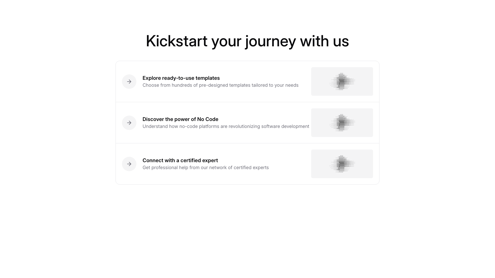

A section displays a centered heading at the top, followed by three horizontally-stacked cards arranged vertically. Each card contains a left-aligned arrow icon, a bold heading, descriptive body text beneath it, and a small image positioned on the right side of the card.

**Install**: `pnpm dlx shadcn add @shadcnblocks/feature188`

---

## feature189

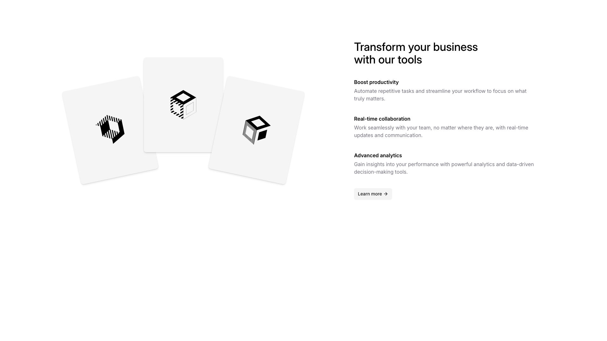

A two-column layout with an image on the left side and text content on the right. The right column contains a main heading at the top, followed by three sections vertically stacked, each with a bold label and descriptive body text. At the bottom of the text column is a button labeled "Learn more."

**Install**: `pnpm dlx shadcn add @shadcnblocks/feature189`

---

## feature190

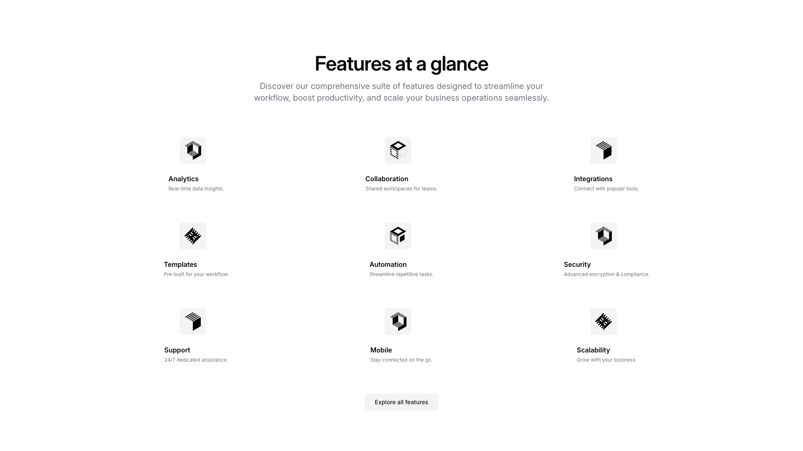

A centered section features a main heading and descriptive body text at the top. Below this, nine feature cards are arranged in a 3x3 grid, each containing a small image, a label, and supporting text. At the bottom, a centered button is positioned to encourage further exploration.

**Install**: `pnpm dlx shadcn add @shadcnblocks/feature190`

---

## feature191

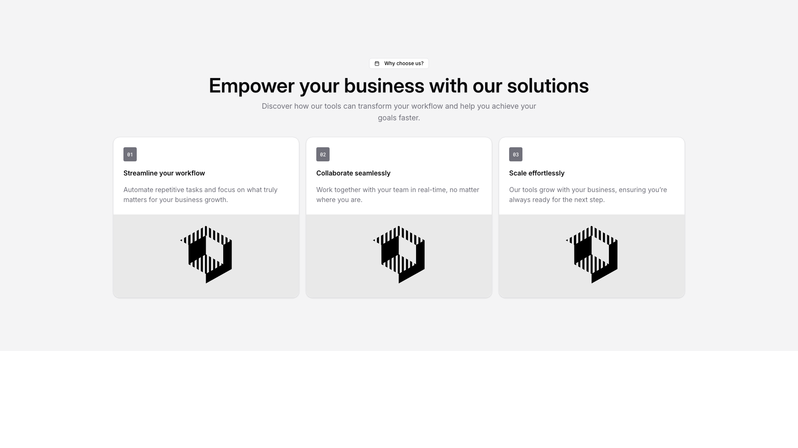

A centered section displays a small label at the top, followed by a main heading and body text. Below this is a row of three equally-sized cards arranged horizontally, each containing a numbered label, a subheading, body text, and an image positioned at the bottom of the card.

**Install**: `pnpm dlx shadcn add @shadcnblocks/feature191`

---

## feature192

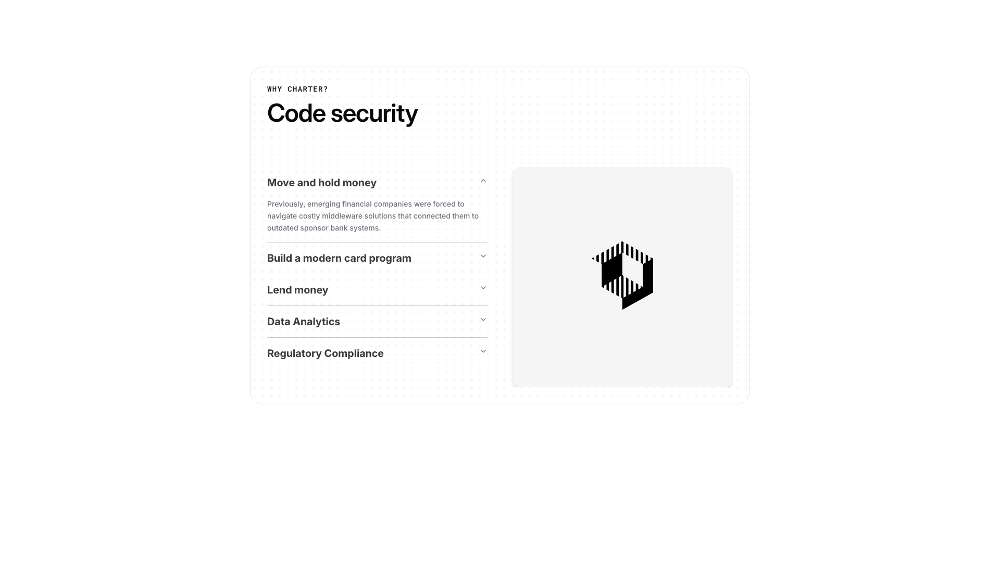

A webpage section displays content in two columns with a left-aligned layout. The left column contains a small label at the top, followed by a large heading, an expanded text block, and a vertically stacked list of expandable section headers. On the right side, a large image is centered within its column area.

**Install**: `pnpm dlx shadcn add @shadcnblocks/feature192`

---

## feature193

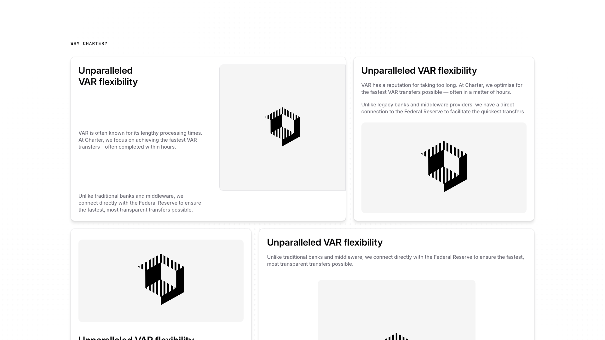

A webpage section titled "WHY CHARTER?" displays content in a grid layout with four cards arranged in two rows and two columns. Each card contains a heading, body text, and a centered image positioned below or within the text. The cards are organized horizontally across the page, with text content on the left or top and images distributed throughout the layout.

**Install**: `pnpm dlx shadcn add @shadcnblocks/feature193`

---

## feature194

A centered section displays a main heading followed by subheading text. Below this, four cards are arranged horizontally in a grid layout. Each card contains an image, descriptive body text, and a "Learn more" button aligned at the bottom.

**Install**: `pnpm dlx shadcn add @shadcnblocks/feature194`

---

## feature195

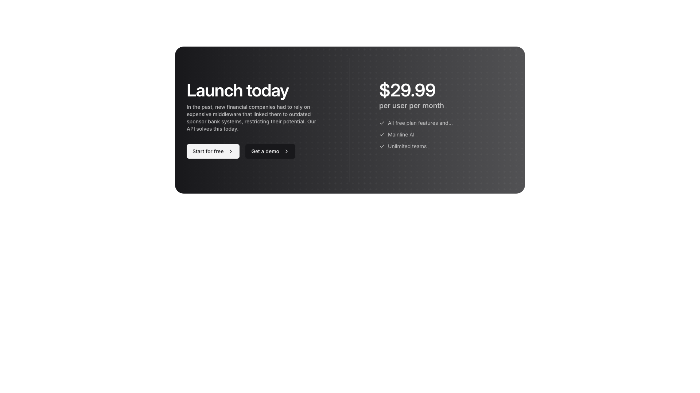

A dark rectangular card is divided into two columns with a vertical divider. The left column contains a main heading, body text, and two horizontally-aligned buttons positioned below. The right column displays a price heading at the top, followed by a subheading and three checkbox list items vertically stacked below.

**Install**: `pnpm dlx shadcn add @shadcnblocks/feature195`

---

## feature197

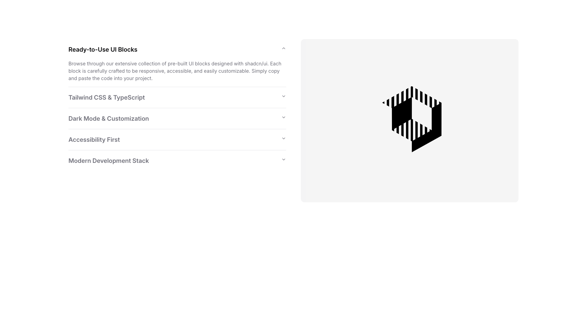

A two-column layout with the left column containing a main heading, descriptive body text, and four expandable section titles stacked vertically. The right column features a centered image on a light gray background.

**Install**: `pnpm dlx shadcn add @shadcnblocks/feature197`

---

## feature198

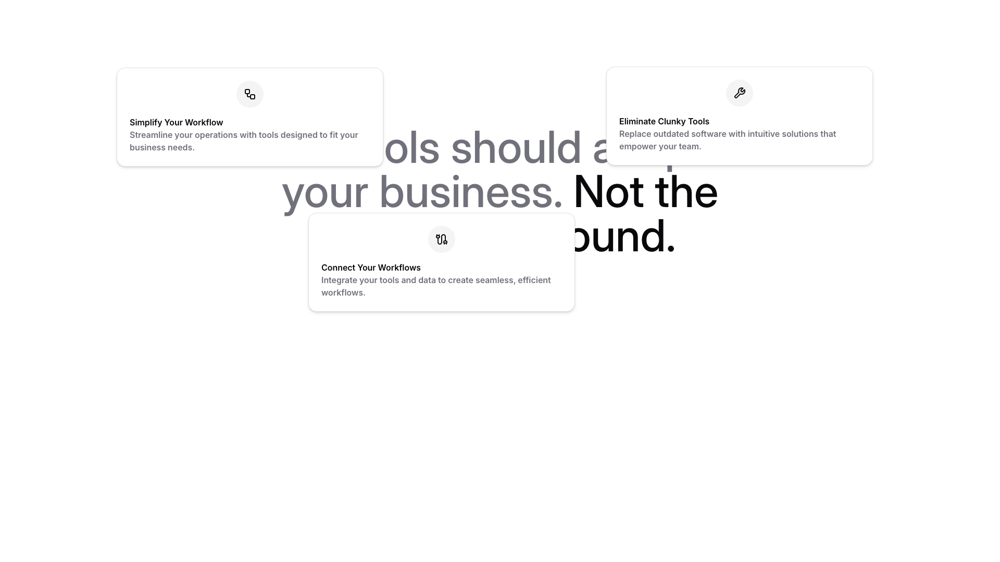

A webpage section displays three informational cards arranged horizontally around a centered heading and subheading. The left card contains a title and body text, the bottom center card contains a title and body text, and the right card contains a title and body text. Each card is accompanied by a small icon positioned at the top.

**Install**: `pnpm dlx shadcn add @shadcnblocks/feature198`

---

## feature199

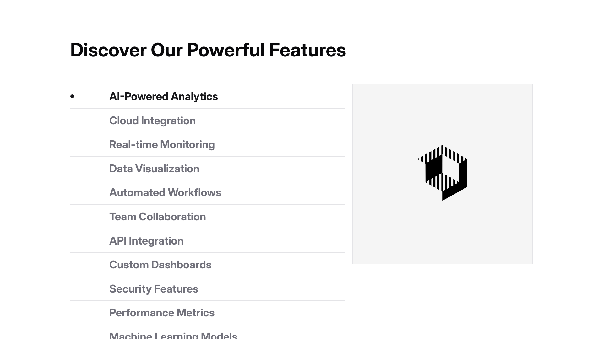

A features section displays content in two columns. On the left, a large heading is positioned at the top, followed by a vertically stacked list of feature labels. On the right, a large image is centered within a light gray background area.

**Install**: `pnpm dlx shadcn add @shadcnblocks/feature199`

---

## feature200

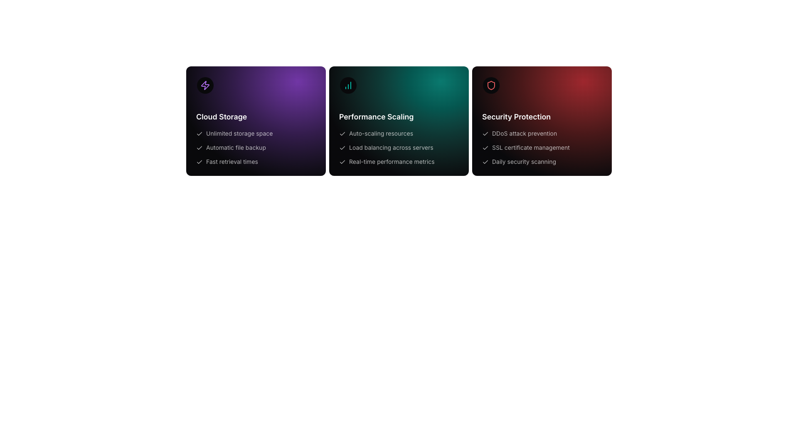

A section displays three feature cards arranged horizontally across the layout. Each card contains an icon at the top left, a heading, and three bullet points with descriptive body text listed vertically below. The cards are evenly spaced and positioned side-by-side.

**Install**: `pnpm dlx shadcn add @shadcnblocks/feature200`

---

## feature202

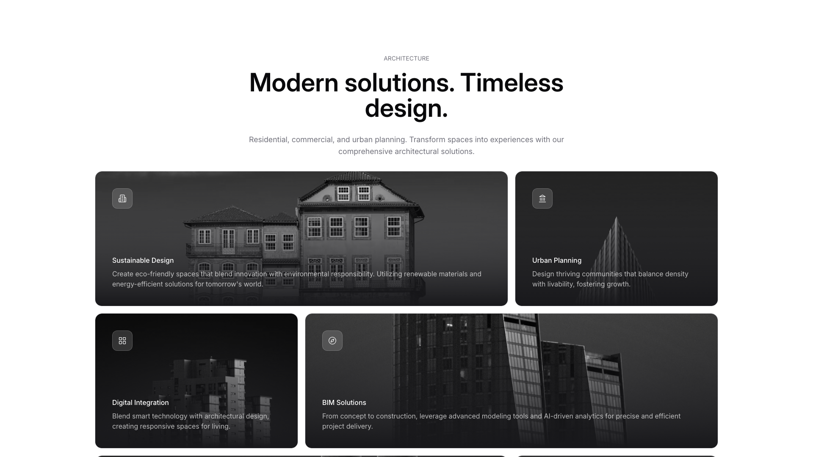

A centered section contains a main heading and descriptive body text at the top. Below this, four card components are arranged in a 2x2 grid layout, each featuring a label, heading, body text, and an icon positioned in the top-left corner. Each card also contains an image spanning its full background.

**Install**: `pnpm dlx shadcn add @shadcnblocks/feature202`

---

## feature203

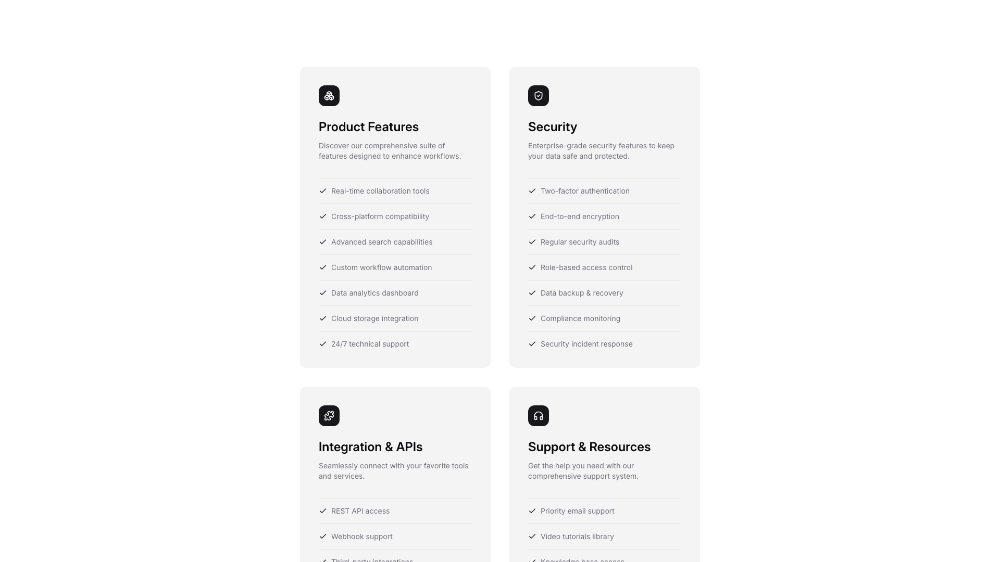

A section displays four feature cards arranged in a 2x2 grid layout. Each card contains a small icon at the top, followed by a heading, descriptive body text, and a vertical list of checkmarked items below. The cards are positioned with two columns side-by-side, and two rows stacked vertically.

**Install**: `pnpm dlx shadcn add @shadcnblocks/feature203`

---

## feature204

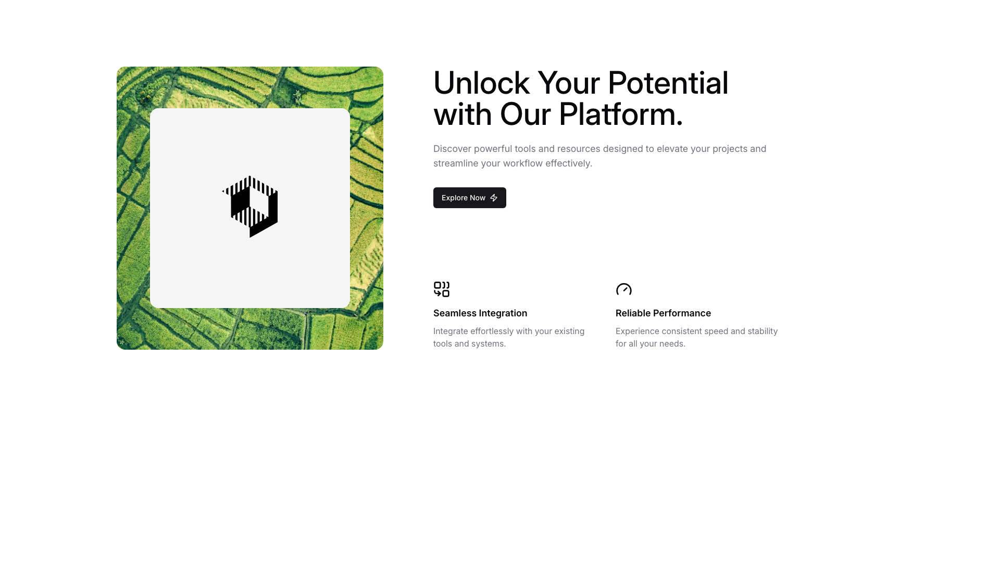

A two-column layout with an image on the left and text content on the right. The right column contains a large heading, body text, a button, and two feature cards arranged horizontally below. The feature cards each display a small icon, a label, and descriptive text.

**Install**: `pnpm dlx shadcn add @shadcnblocks/feature204`

---

## feature205

A section displays content in two columns with left and right alignment. The left column contains a small label, a main heading, body text, and three horizontally-aligned button tabs below. The right column features a large image with two overlaid statistics (percentage and dollar amount) positioned in the lower left of the image.

**Install**: `pnpm dlx shadcn add @shadcnblocks/feature205`

---

## feature206

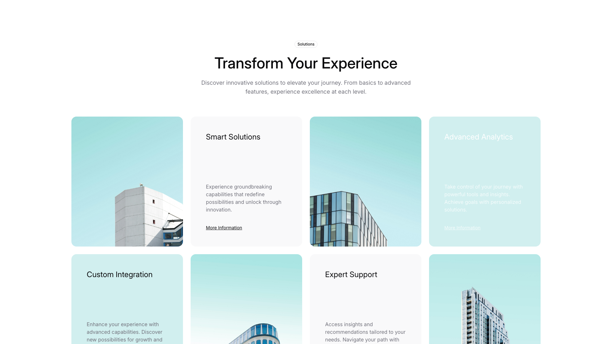

A solutions section displays a centered heading and subheading at the top, followed by a grid layout of four cards arranged in two rows and two columns. Each card contains a label, body text, and an image positioned within the card. The left cards feature text on the left side with images below, while the right cards display images prominently with text overlaid or positioned at the bottom.

**Install**: `pnpm dlx shadcn add @shadcnblocks/feature206`

---

## feature207

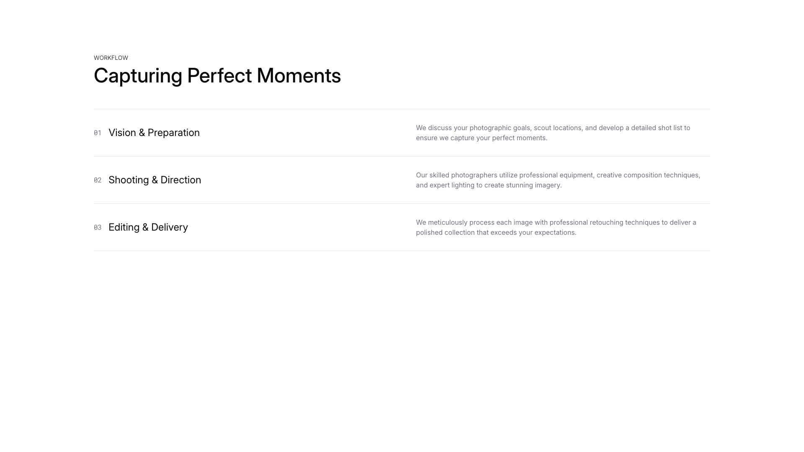

A workflow section displays a main heading centered at the top, followed by three horizontally separated rows. Each row contains a numbered label on the left, a subheading, and corresponding body text positioned to the right. The layout uses a two-column structure with the labels and headings aligned on the left side and descriptive text extending across the right column.

**Install**: `pnpm dlx shadcn add @shadcnblocks/feature207`

---

## feature209

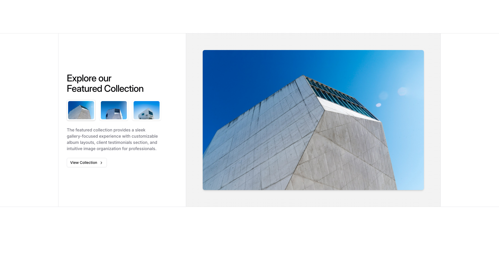

A two-column layout with the left column containing a heading, three small thumbnail images arranged horizontally, body text, and a clickable link. The right column features a large image that spans the full height of the section.

**Install**: `pnpm dlx shadcn add @shadcnblocks/feature209`

---

## feature210

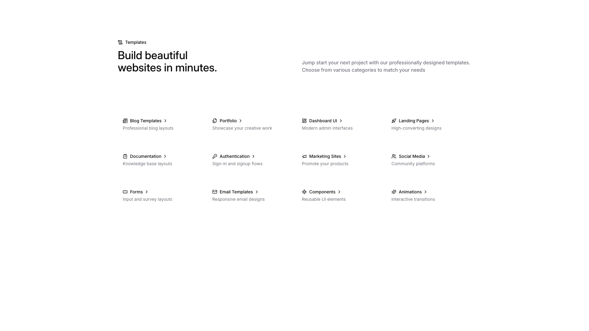

A header section displays a main heading on the left with supporting body text aligned to the right. Below, a grid layout presents 12 template category cards arranged in 3 rows and 4 columns, each containing an icon, a category title with a right-facing arrow, and descriptive label text.

**Install**: `pnpm dlx shadcn add @shadcnblocks/feature210`

---

## feature211

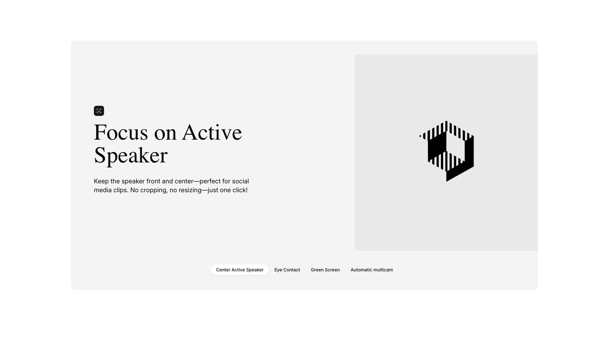

A two-column layout with text content on the left and an image on the right. The left column contains a small icon, a large heading, and body text describing a feature. Below the main content, four horizontal labels are centered at the bottom of the section. The right column displays a large image positioned centrally.

**Install**: `pnpm dlx shadcn add @shadcnblocks/feature211`

---

## feature213

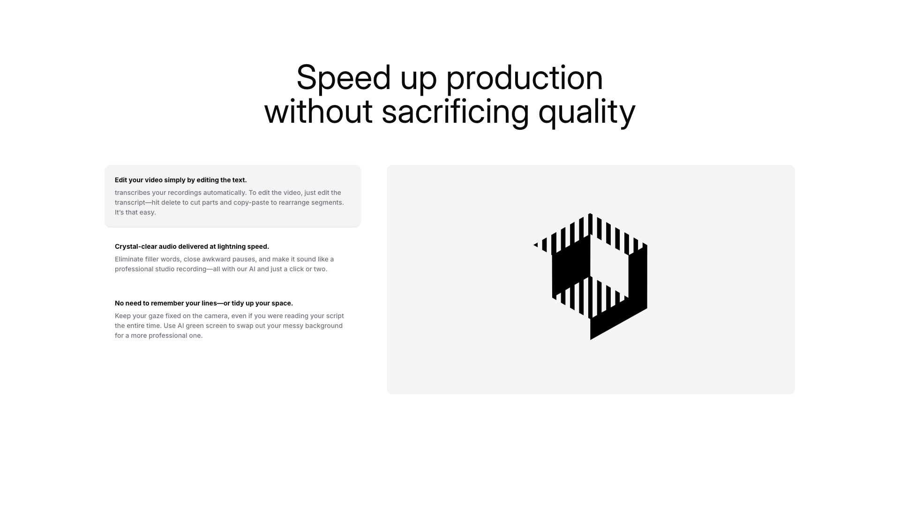

A webpage section displays content in two columns with a centered heading above. The left column contains three stacked text blocks, each with a bold title followed by descriptive body text. The right column features a large geometric image positioned centrally within a light gray background area.

**Install**: `pnpm dlx shadcn add @shadcnblocks/feature213`

---

## feature214

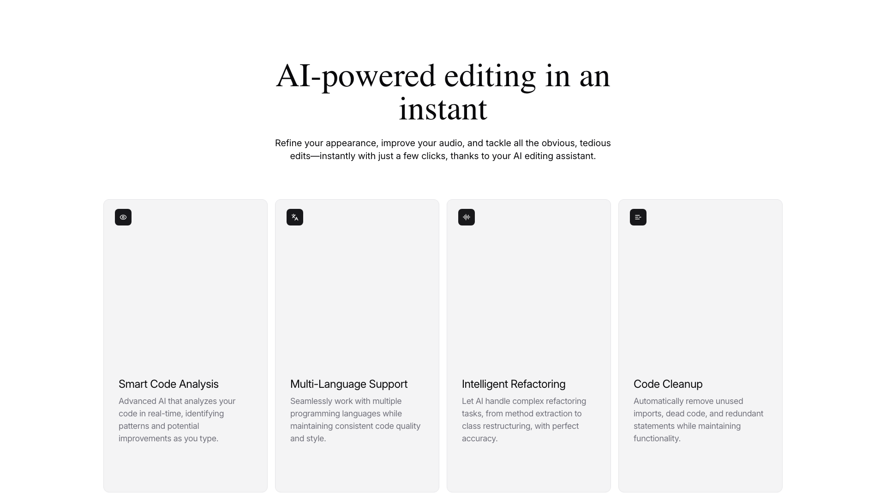

A centered heading with supporting body text spans the full width at the top. Below this, four feature cards are arranged horizontally in a grid layout. Each card contains a small icon positioned in the upper left corner, followed by a bold title and descriptive body text stacked vertically beneath it.

**Install**: `pnpm dlx shadcn add @shadcnblocks/feature214`

---

## feature215

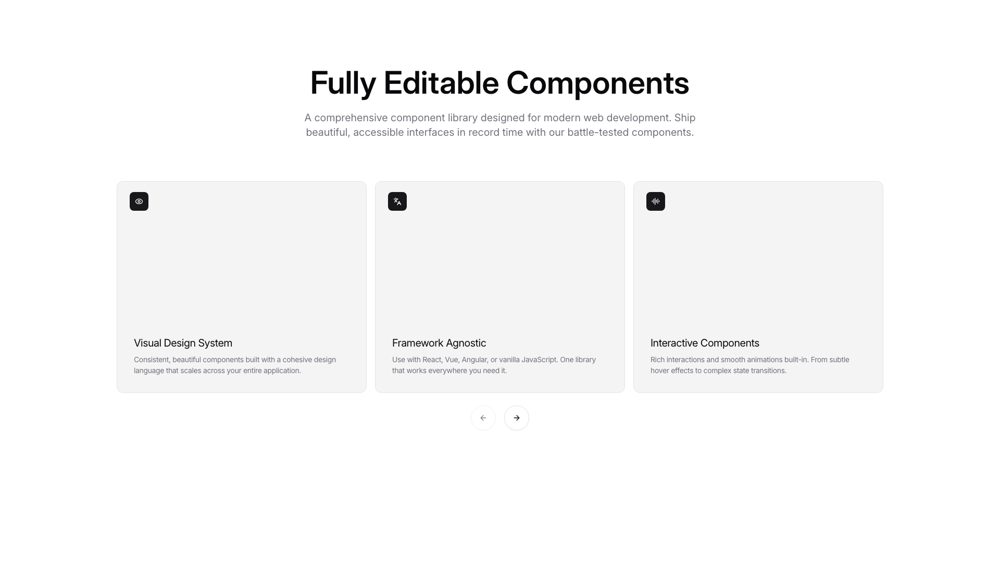

A centered section displays a main heading at the top, followed by body text. Below this, three equal-width cards are arranged horizontally, each containing a small icon, a subheading, and descriptive text. Navigation arrows are positioned centrally beneath the cards.

**Install**: `pnpm dlx shadcn add @shadcnblocks/feature215`

---

## feature216

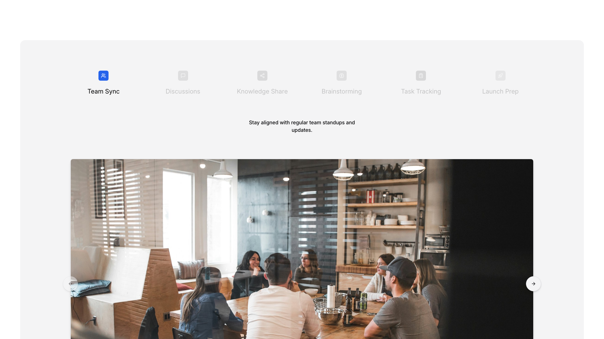

A horizontal navigation menu is centered at the top, with a highlighted tab on the left labeled "Team Sync" followed by five additional tabs extending rightward. Below the navigation, centered body text appears above a large image that spans the full width of the section. A circular navigation button is positioned on the right edge of the image.

**Install**: `pnpm dlx shadcn add @shadcnblocks/feature216`

---

## feature217

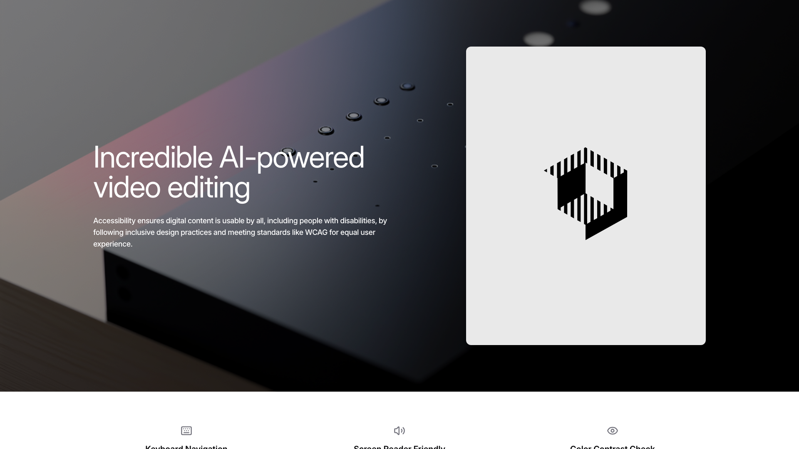

A hero section with a two-column layout displays a main heading and body text on the left side, while a large card containing an image is positioned on the right. Below the main content, three feature blocks are arranged horizontally at the bottom, each containing a small icon, a label, and descriptive text.

**Install**: `pnpm dlx shadcn add @shadcnblocks/feature217`

---

## feature218

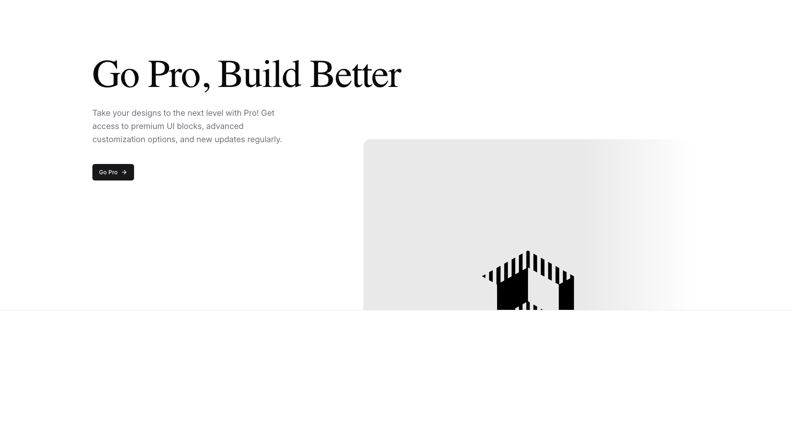

A webpage section displays content in two columns with a left-aligned layout. The left column contains a large heading, body text describing features, and a button positioned below. The right column features a large image spanning the full height, positioned on the right side of the layout.

**Install**: `pnpm dlx shadcn add @shadcnblocks/feature218`

---

## feature219

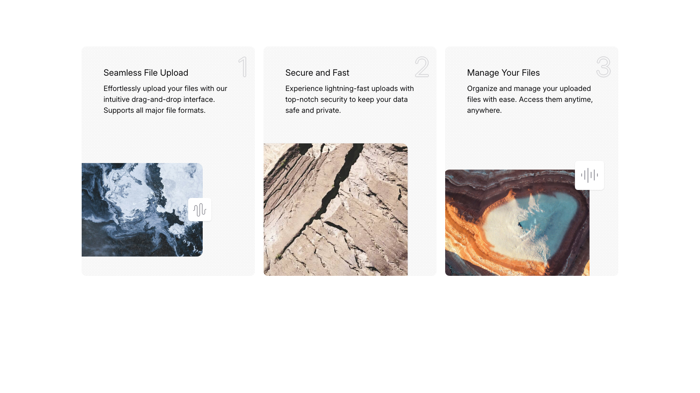

A three-column layout displays feature cards arranged horizontally. Each column contains a numbered label at the top, followed by a heading and body text. Below the text, an image is positioned within each column, with subtle graphic icons overlaid on the images.

**Install**: `pnpm dlx shadcn add @shadcnblocks/feature219`

---

## feature220

A hero section displays content vertically on the left side with a main heading, body text, and a button. Below this, three metric blocks are arranged horizontally across the bottom, each containing a large number, a label, and supporting text.

**Install**: `pnpm dlx shadcn add @shadcnblocks/feature220`

---

## feature221

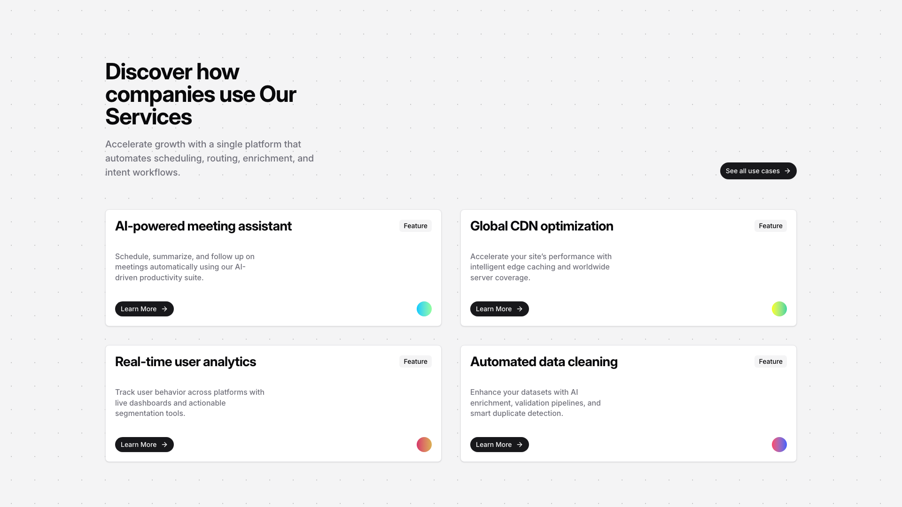

A section displays a main heading and descriptive body text positioned on the left, with a "See all use cases" button on the right. Below this, four feature cards are arranged in a 2x2 grid layout, each containing a feature title labeled "Feature," body text, a "Learn More" button, and an image positioned in the bottom right corner of each card.

**Install**: `pnpm dlx shadcn add @shadcnblocks/feature221`

---

## feature222

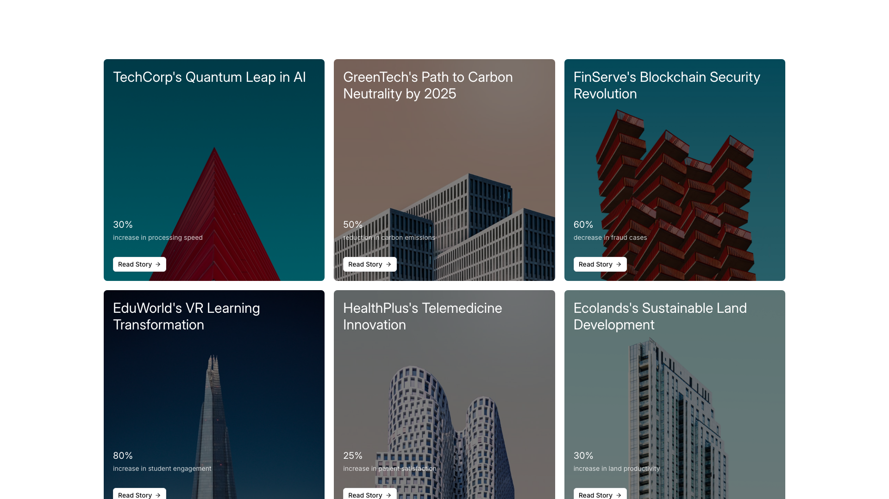

A grid layout displays six cards arranged in two rows and three columns. Each card contains a heading at the top, a large image centered in the middle, a statistic with a percentage label positioned in the lower left, and a "Read Story" button at the bottom. The cards are evenly spaced and maintain consistent proportions across the layout.

**Install**: `pnpm dlx shadcn add @shadcnblocks/feature222`

---

## feature224

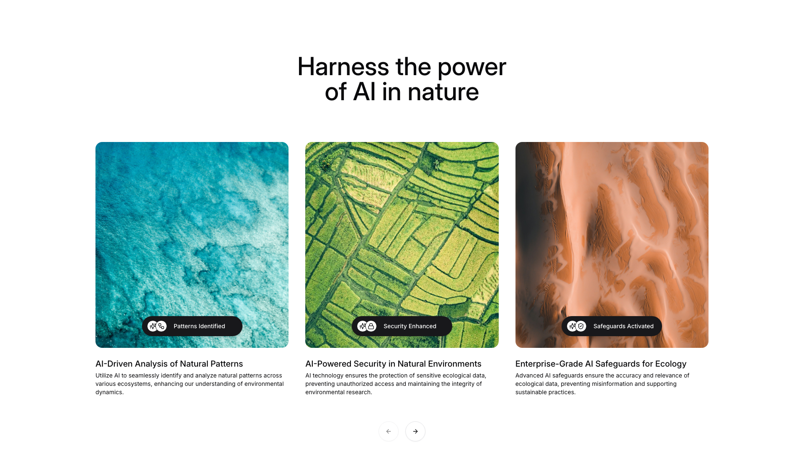

A section displays a centered heading at the top, followed by three horizontally aligned cards below. Each card contains an image, a label tag in the bottom left corner, a smaller title, and body text positioned underneath. Navigation arrows appear centered at the bottom of the section.

**Install**: `pnpm dlx shadcn add @shadcnblocks/feature224`

---

## feature225

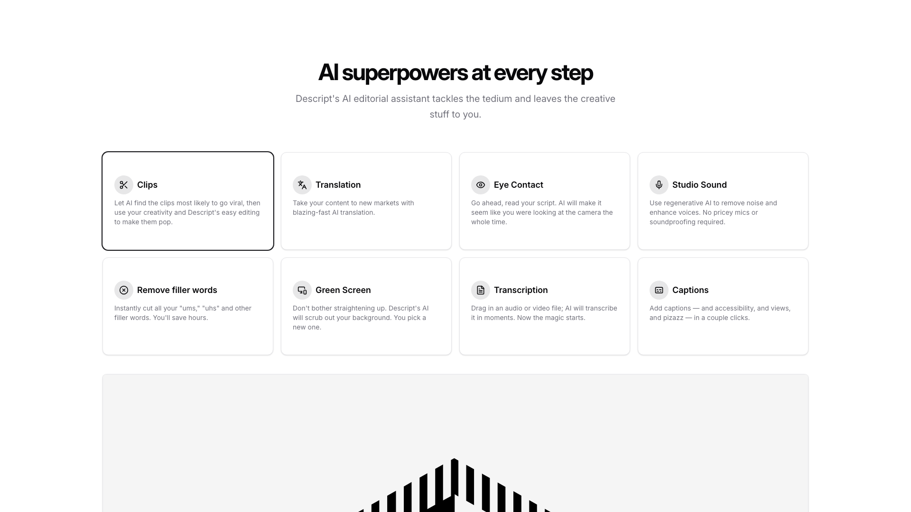

A webpage section displays a centered heading and subheading at the top, followed by a grid layout with eight feature cards arranged in two rows of four columns. Each card contains a label, an icon, and body text. Below the grid, a large image is centered at the bottom of the section.

**Install**: `pnpm dlx shadcn add @shadcnblocks/feature225`

---

## feature227

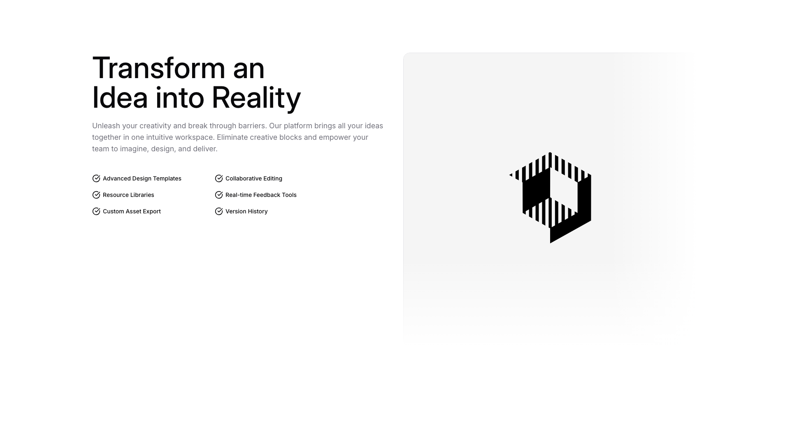

A webpage section is divided into two columns. The left column contains a large heading, body text, and two columns of checklist items with labels. The right column features a centered image positioned in the upper-right area of the layout.

**Install**: `pnpm dlx shadcn add @shadcnblocks/feature227`

---

## feature228

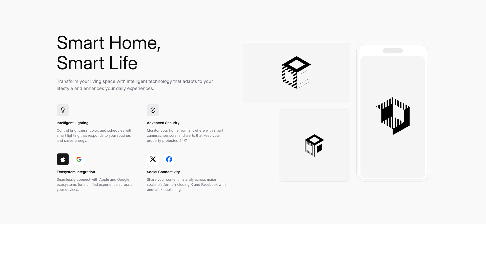

A webpage section is organized in two columns. The left column contains a main heading, descriptive body text, and four feature blocks arranged in a 2x2 grid, each with an icon, label, and description text. The right column displays three images vertically stacked and centered.

**Install**: `pnpm dlx shadcn add @shadcnblocks/feature228`

---

## feature229

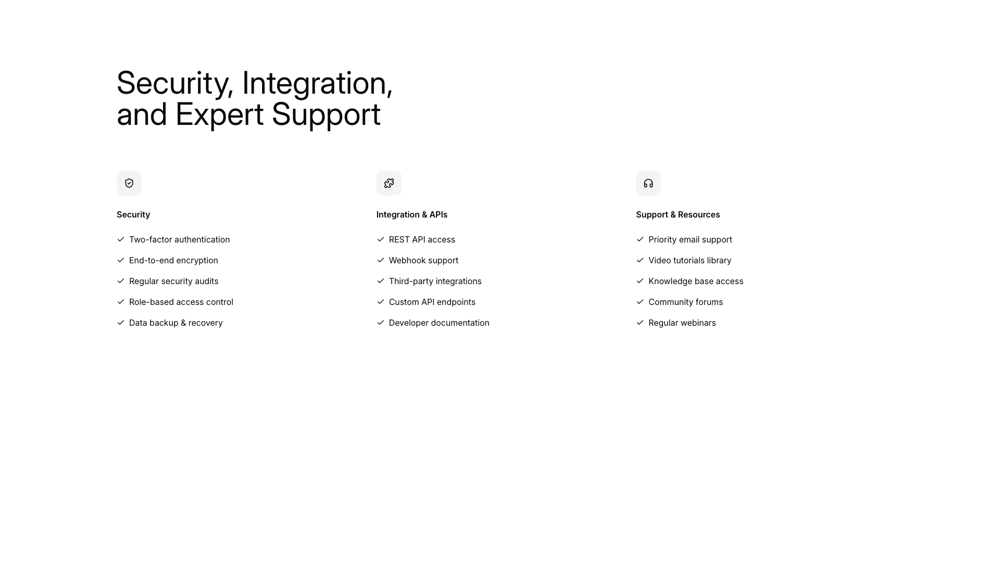

A section with a main heading at the top is organized into three vertically stacked columns below. Each column contains a subheading with an icon, followed by a bulleted list of five items. The columns are arranged horizontally and aligned consistently across the layout.

**Install**: `pnpm dlx shadcn add @shadcnblocks/feature229`

---

## feature230

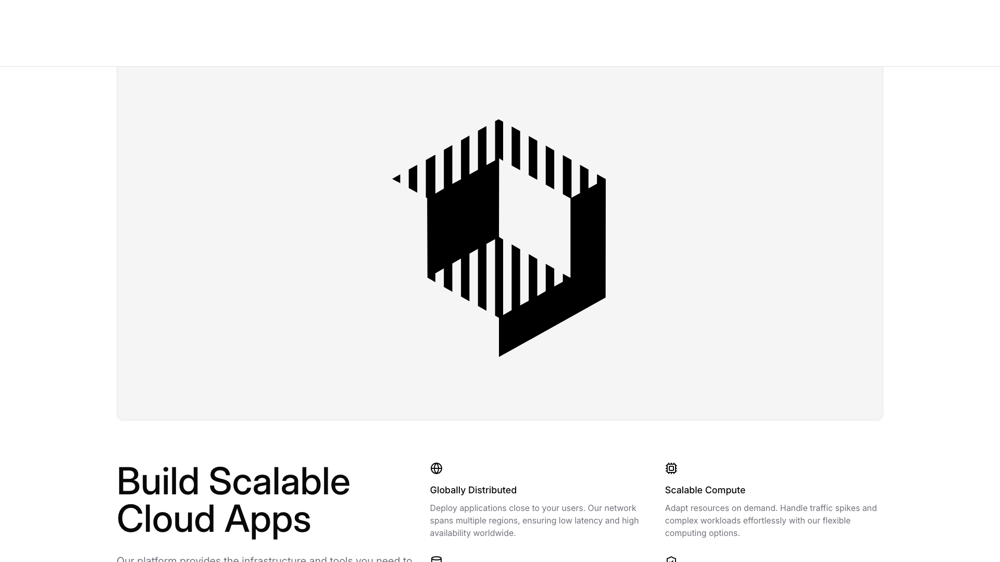

A webpage section displays content in two columns. The left column contains a large heading and body text, while the right column features a centered image at the top. Below the image, two feature cards are arranged horizontally, each containing a label, a small icon, and descriptive body text.

**Install**: `pnpm dlx shadcn add @shadcnblocks/feature230`

---

## feature231

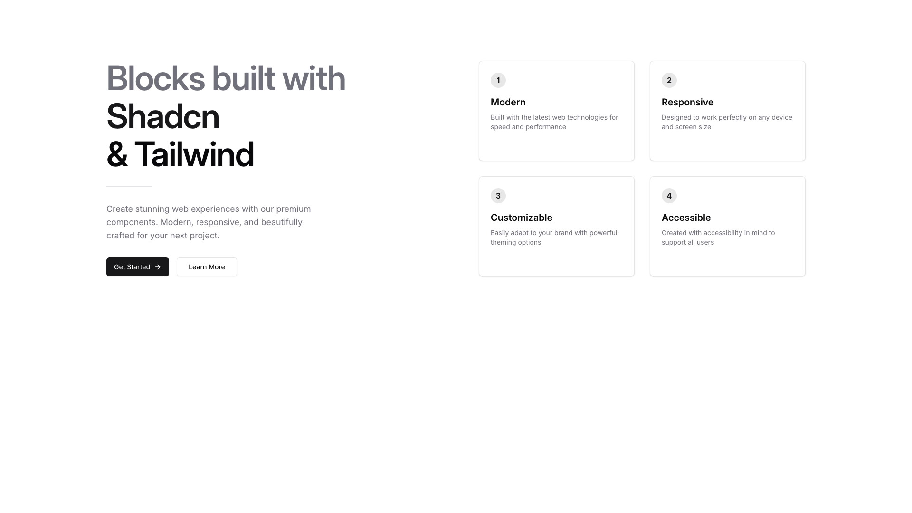

A webpage section is divided into two columns. The left column contains a large heading, body text, and two buttons positioned horizontally. The right column displays a 2x2 grid of four cards, each containing a numbered label, a smaller heading, and descriptive body text.

**Install**: `pnpm dlx shadcn add @shadcnblocks/feature231`

---

## feature234

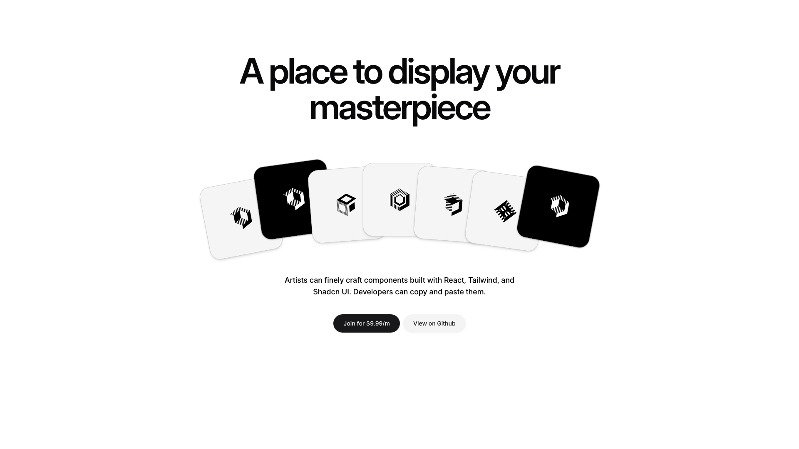

A centered section displays a main heading at the top, followed by a carousel of card images arranged horizontally in the middle. Below the carousel sits body text, with two buttons positioned side-by-side at the bottom.

**Install**: `pnpm dlx shadcn add @shadcnblocks/feature234`

---

## feature235

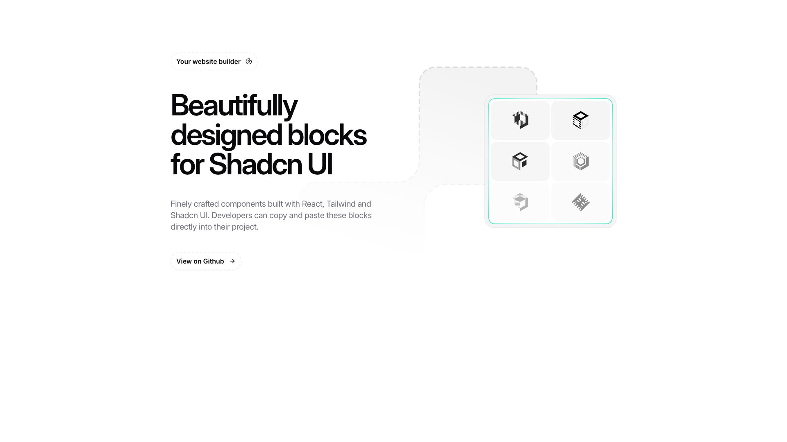

A webpage section displays content in two columns. The left column contains a label, a large heading, body text, and a text link stacked vertically. On the right side, an image is positioned within a rounded border frame.

**Install**: `pnpm dlx shadcn add @shadcnblocks/feature235`

---

## feature236

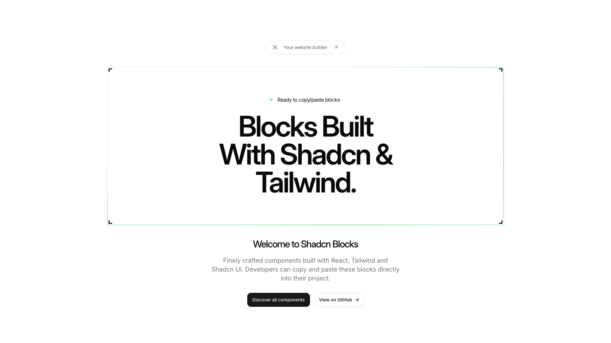

A centered layout displays a large heading at the top, followed by a subheading and body text in the middle. Below the text are two horizontally aligned buttons positioned side-by-side. A label indicating "Ready to copy/paste blocks" appears near the top of the section.

**Install**: `pnpm dlx shadcn add @shadcnblocks/feature236`

---

## feature237

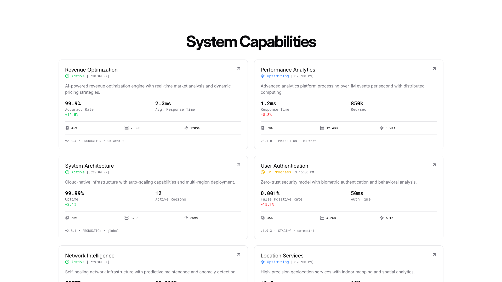

A dashboard section displays six system capability cards arranged in a 2x3 grid layout. Each card contains a heading, status label, body text description, and multiple metric rows with numerical values and icons. Cards are vertically stacked in pairs across two columns, with an external link icon positioned in the top-right corner of each card.

**Install**: `pnpm dlx shadcn add @shadcnblocks/feature237`

---

## feature238

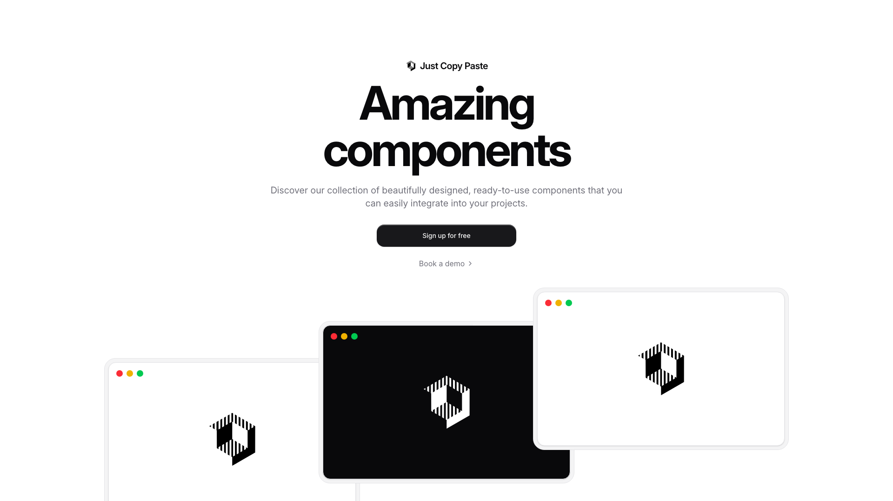

A centered hero section contains a logo at the top, followed by a large heading and descriptive body text stacked vertically. Below the text are two action buttons positioned horizontally. At the bottom, three browser window mockups are arranged in an overlapping, staggered layout, with each displaying an image.

**Install**: `pnpm dlx shadcn add @shadcnblocks/feature238`

---

## feature239

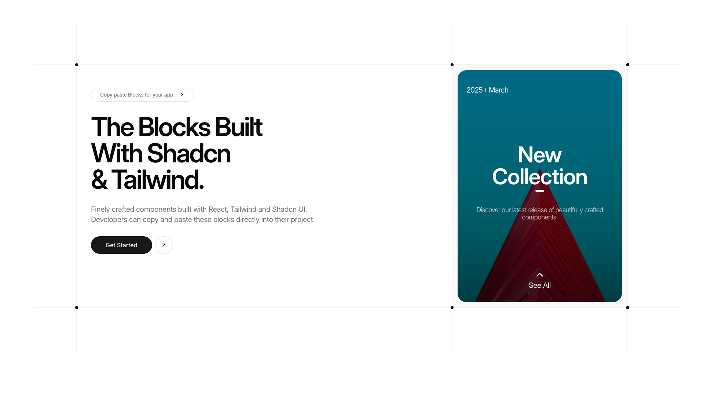

A two-column layout with content positioned left and right. The left column contains a small link label at the top, followed by a large heading, body text, and a button. The right column features a card with a date label at the top, a heading, descriptive text, an image, and a link positioned at the bottom.

**Install**: `pnpm dlx shadcn add @shadcnblocks/feature239`

---

## feature240

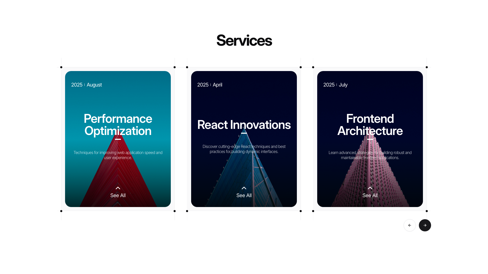

A centered heading "Services" sits at the top. Below it, three cards are arranged horizontally in equal columns, each containing a date label, a large heading, body text, an image, and a "See All" button at the bottom. Navigation arrows are positioned at the bottom right to scroll through additional cards.

**Install**: `pnpm dlx shadcn add @shadcnblocks/feature240`

---

## feature241

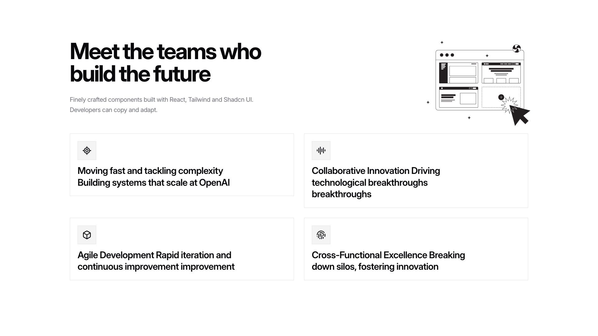

A section with a main heading and body text positioned on the left, accompanied by an illustration on the right. Below this introductory area, four content cards are arranged in a 2x2 grid layout. Each card contains an icon on the left, followed by a heading and descriptive text stacked vertically.

**Install**: `pnpm dlx shadcn add @shadcnblocks/feature241`

---

## feature242

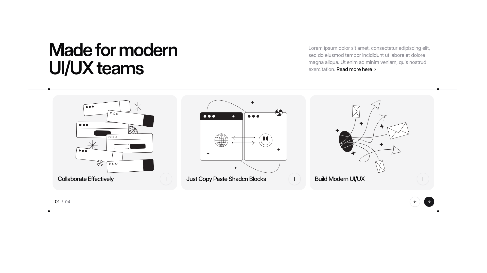

A webpage section displays content in two columns. The left column contains a large heading and body text with a "Read more here" link positioned on the right. Below, three content cards are arranged horizontally, each featuring an image, a label, and a plus icon. Navigation elements including a page counter and directional buttons are centered at the bottom.

**Install**: `pnpm dlx shadcn add @shadcnblocks/feature242`

---

## feature243

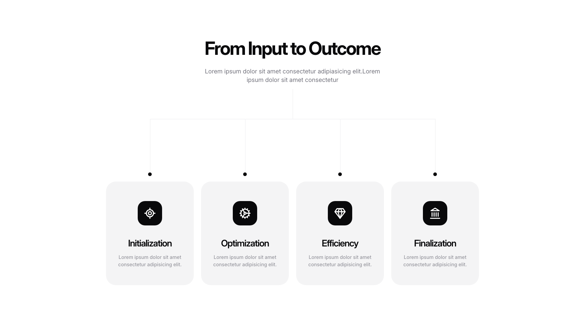

A section displays a centered heading and body text at the top, followed by four vertically-stacked cards arranged horizontally below. Each card contains an icon centered within a rounded container, a label beneath it, and descriptive body text at the bottom. Vertical lines connect each card to a horizontal line above, creating a timeline-like structure.

**Install**: `pnpm dlx shadcn add @shadcnblocks/feature243`

---

## feature244

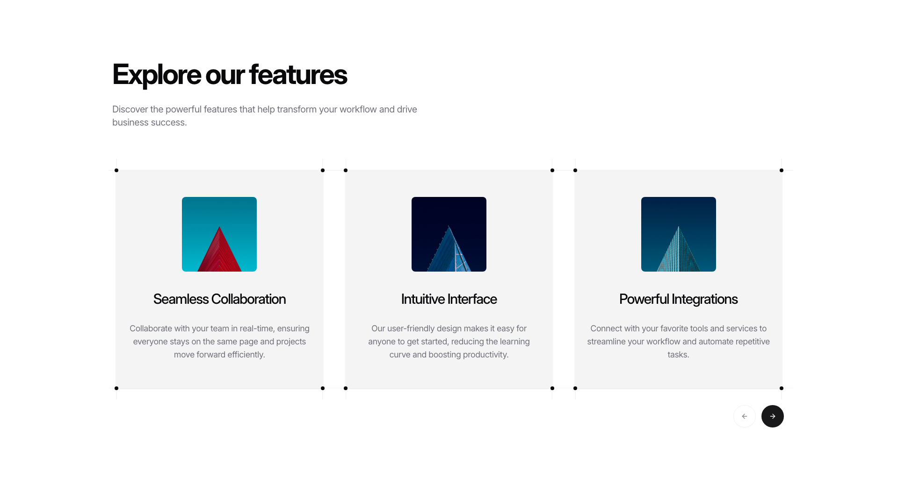

A section displays a main heading at the top, followed by body text. Below this, three feature cards are arranged horizontally across the layout, each containing an image, a title label, and descriptive body text. Navigation dots appear above and below the cards, with left and right arrow buttons positioned at the bottom right for carousel control.

**Install**: `pnpm dlx shadcn add @shadcnblocks/feature244`

---

## feature245

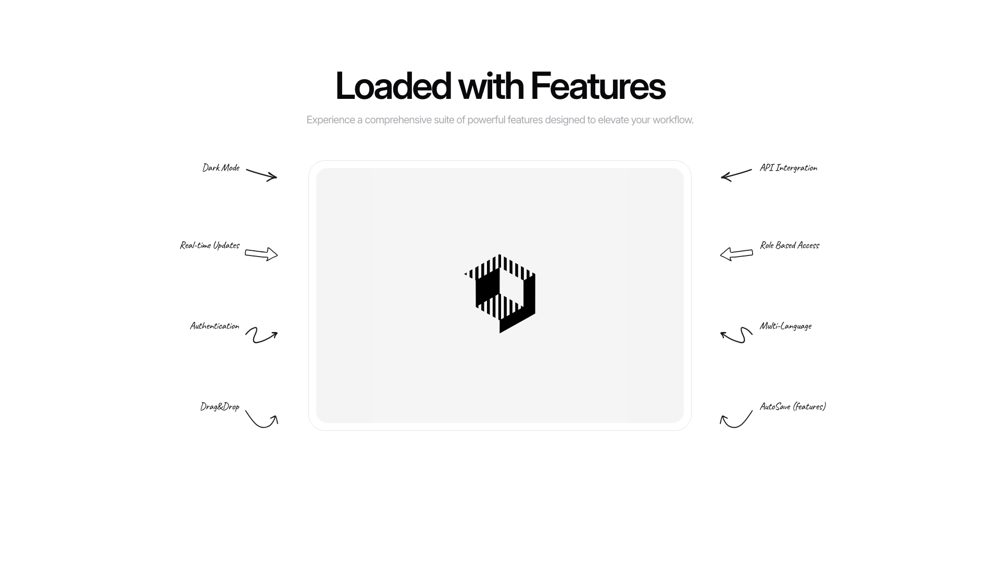

A centered section displays a main heading at the top, followed by descriptive body text. Below this is a large rectangular container with a centered image. Surrounding the container on both left and right sides are vertically-aligned labels with arrows pointing inward toward the central image, creating a symmetrical layout with features listed on each side.

**Install**: `pnpm dlx shadcn add @shadcnblocks/feature245`

---

## feature246

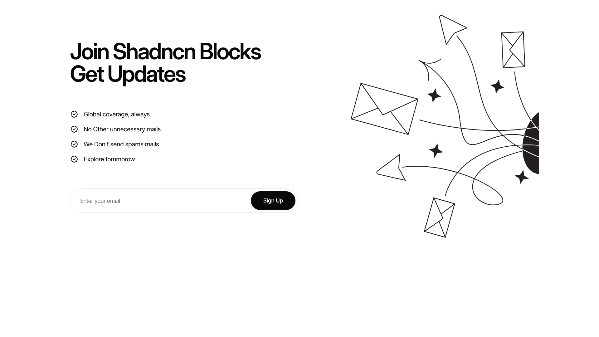

A newsletter signup section is divided into two columns. The left column contains a main heading, followed by four bullet points with body text, and a horizontal email input field with a button positioned to its right. On the right side, a large decorative image spans the full column height.

**Install**: `pnpm dlx shadcn add @shadcnblocks/feature246`

---

## feature248

A full-width section displays centered text on a dark background. The primary heading and body text are positioned in the upper-left area, with the readable white text followed by faded gray text that trails off toward the right side of the screen.

**Install**: `pnpm dlx shadcn add @shadcnblocks/feature248`

---

## feature249

A dashboard interface is displayed with a two-column layout. The left column contains a vertical navigation menu with multiple menu items and expandable sections. The main content area on the right features a grid of metric cards horizontally arranged at the top, followed by multiple chart visualizations positioned below, including area charts, line graphs, and bar charts. At the bottom, a data table and a team members section are aligned horizontally.

**Install**: `pnpm dlx shadcn add @shadcnblocks/feature249`

---

## feature250

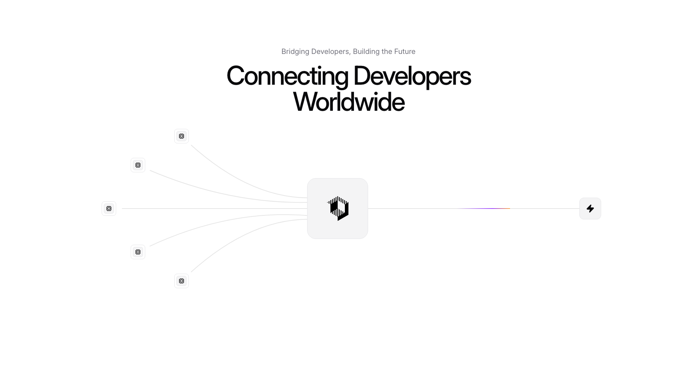

A centered layout displays a tagline at the top, followed by a large heading. Below this is a network diagram with a central image icon horizontally positioned in the middle, connected by lines to multiple smaller icons distributed on the left side and a single icon on the right side.

**Install**: `pnpm dlx shadcn add @shadcnblocks/feature250`

---

## feature251

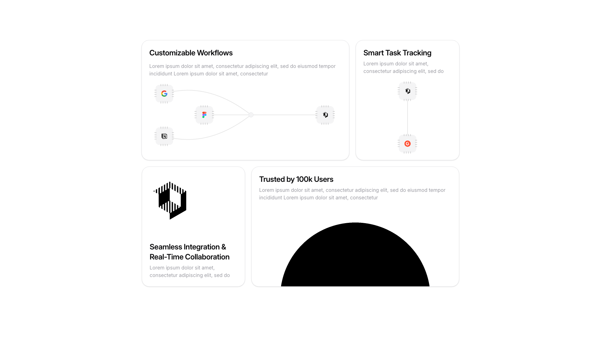

A grid layout displaying four feature cards arranged in two rows and two columns. The top row contains two cards of equal width—the left card features a heading, body text, and an integrated diagram with connected icons, while the right card displays a heading, body text, and a simplified icon arrangement. The bottom row includes a smaller card on the left with a centered image, heading, and body text, and a larger card on the right spanning the remaining space with a heading, body text, and a large geometric shape positioned at the bottom.

**Install**: `pnpm dlx shadcn add @shadcnblocks/feature251`

---

## feature252

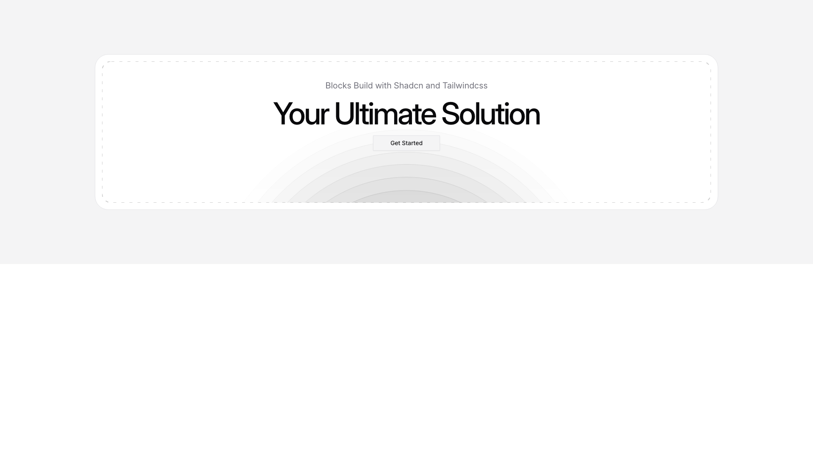

A centered hero section displays a small label at the top, followed by a large heading. Below the heading is a "Get Started" button positioned centrally, with a decorative circular image element underneath it.

**Install**: `pnpm dlx shadcn add @shadcnblocks/feature252`

---

## feature253

A horizontal banner section displays content in two columns with a left-aligned layout. The left column contains a large heading, body text, and a button with a label positioned below. On the right side, a large image occupies the remaining space, extending to the edge of the container.

**Install**: `pnpm dlx shadcn add @shadcnblocks/feature253`

---

## feature254

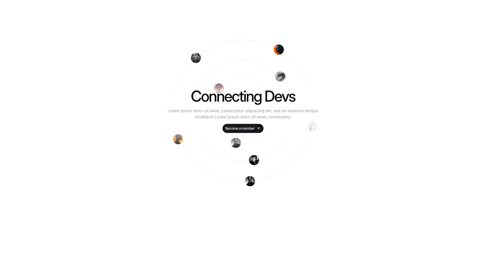

A centered layout displays a large heading "Connecting Devs" with body text underneath. Arranged in a circular pattern around the central content are multiple profile images. Below the text sits a dark button labeled "Become a member" with an arrow icon.

**Install**: `pnpm dlx shadcn add @shadcnblocks/feature254`

---

## feature255

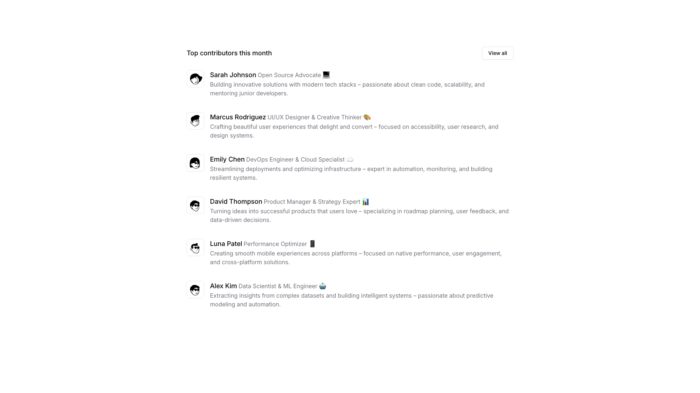

A vertically stacked list section displays a heading at the top with a "View all" link positioned on the right. Below are six profile entries arranged sequentially, each containing a circular image on the left, followed by a name and title as a heading, and descriptive body text on the right.

**Install**: `pnpm dlx shadcn add @shadcnblocks/feature255`

---

## feature256

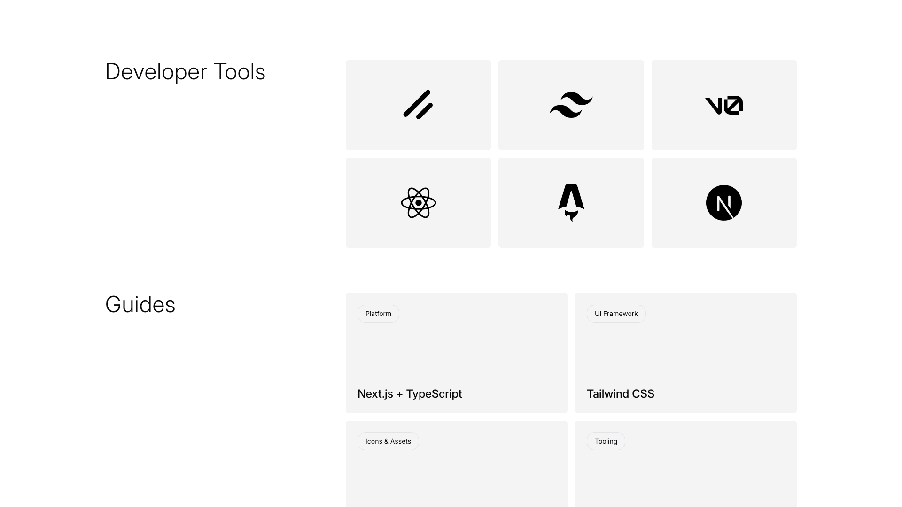

The layout is divided into two main sections vertically stacked. The top section titled "Developer Tools" displays a 3x2 grid of icon placeholders. Below that, the "Guides" section presents a 2x2 grid of rectangular cards, each containing a label at the top and descriptive text centered within the card.

**Install**: `pnpm dlx shadcn add @shadcnblocks/feature256`

---

## feature257

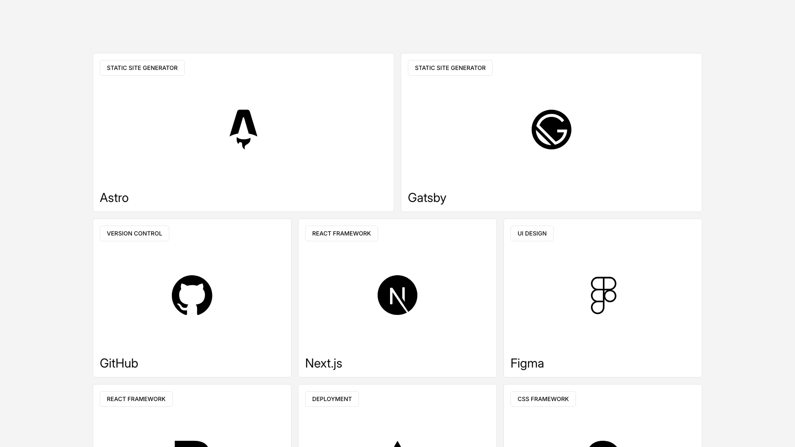

A grid layout displaying six items arranged in three rows and two columns. Each item contains a label at the top, a centered image in the middle, and descriptive text at the bottom. The grid presents information in a consistent card-based structure with evenly distributed spacing between elements.

**Install**: `pnpm dlx shadcn add @shadcnblocks/feature257`

---

## feature261

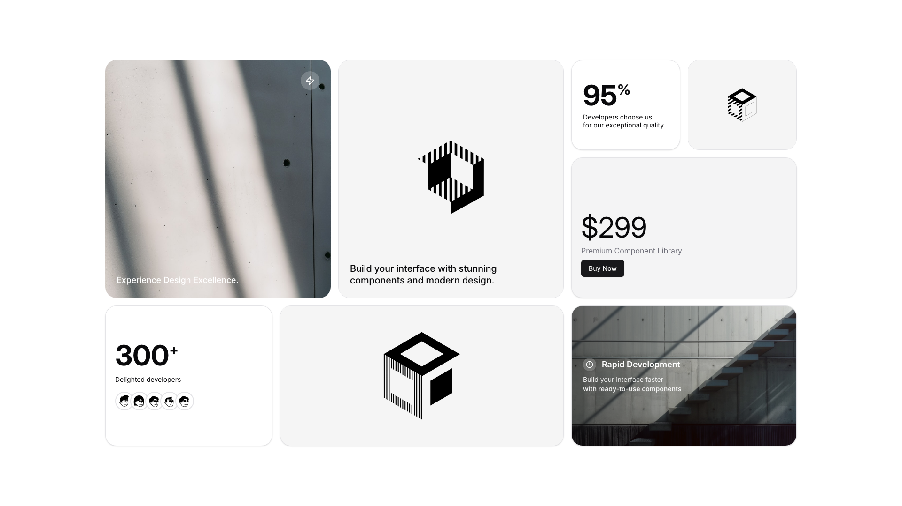

A grid layout displays six content cards arranged in three rows and two columns. The top-left card contains a large image with overlaid text. The center-top area features an icon with a heading and body text. The right column showcases two stacked cards: the top card displays a statistic with a label and a button, while the bottom card contains an image with a label and descriptive text. The bottom-left card shows a heading, body text, and small avatar icons. The center-bottom card features a centered icon.

**Install**: `pnpm dlx shadcn add @shadcnblocks/feature261`

---

## feature266

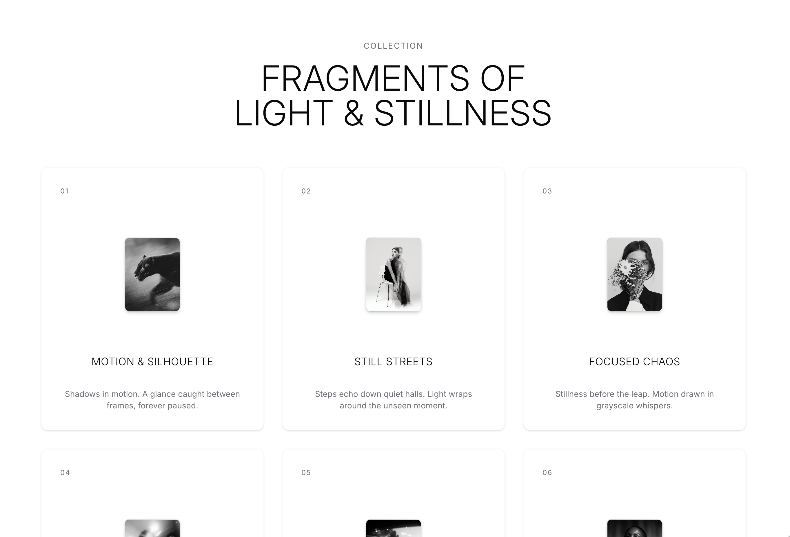

A collection page displays a centered heading at the top, followed by a grid layout of six items arranged in three columns and two rows. Each grid item contains a small image positioned above a title label and descriptive body text, all aligned to the center within their respective cards.

**Install**: `pnpm dlx shadcn add @shadcnblocks/feature266`

---

## feature268

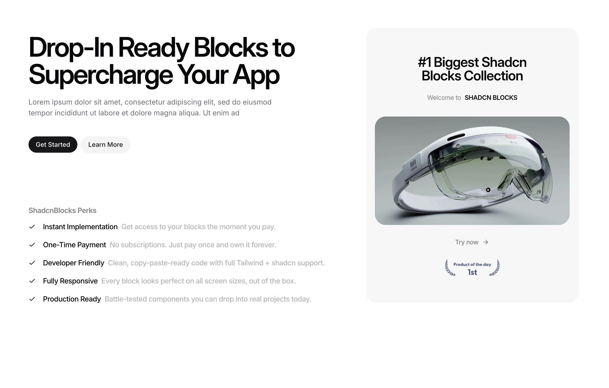

A two-column layout with text content on the left and a featured image on the right. The left column contains a large heading, body text, two action buttons, a subheading, and a bulleted list with accompanying descriptions. The right column displays a centered image with a "Try now" link below it and a badge indicating recognition.

**Install**: `pnpm dlx shadcn add @shadcnblocks/feature268`

---

## feature269

A two-column layout presents content side-by-side. The left column contains a main heading, a "Features" label, and two vertically-aligned columns of body text items with circular icons. The right column displays a smaller heading, welcoming text, and a large rounded image positioned below.

**Install**: `pnpm dlx shadcn add @shadcnblocks/feature269`

---

## feature270

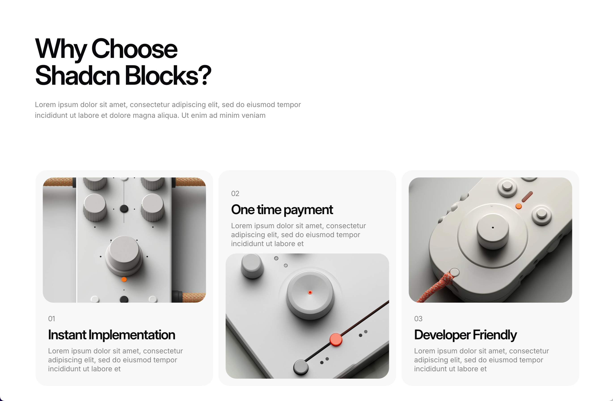

A webpage section displays a main heading at the top, followed by body text. Below this, three feature cards are arranged horizontally in a grid layout. Each card contains a numbered label, a heading, body text, and an image positioned above the text content.

**Install**: `pnpm dlx shadcn add @shadcnblocks/feature270`

---

## feature271

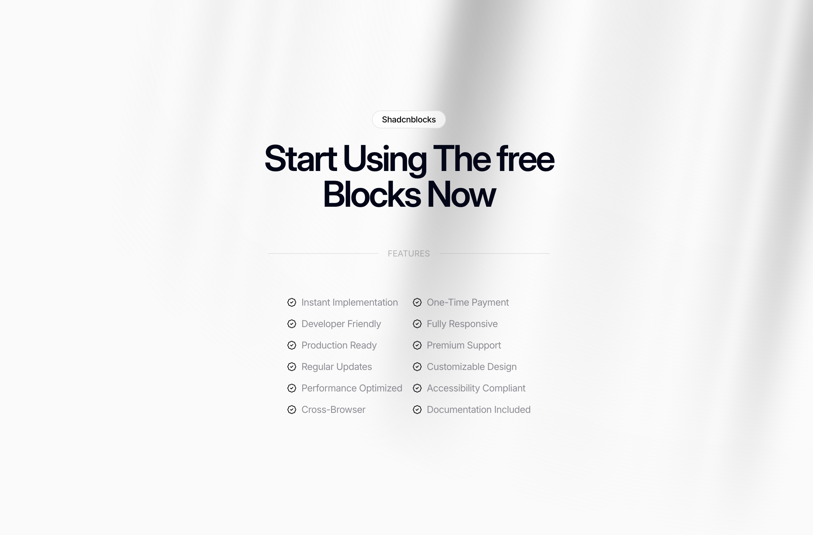

A centered layout displays a small label at the top, followed by a large heading. Below this is a "FEATURES" label, with two columns of feature items arranged horizontally beneath it, each featuring an icon and accompanying text.

**Install**: `pnpm dlx shadcn add @shadcnblocks/feature271`

---

## feature272

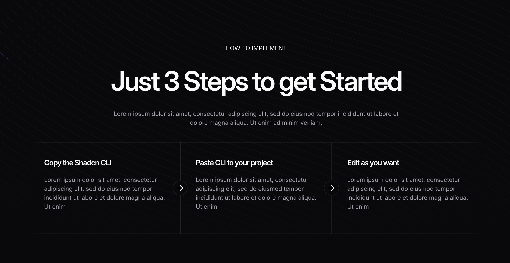

A dark-themed section displays a centered heading "Just 3 Steps to get Started" with descriptive body text below it. Beneath this introduction, three columns are arranged horizontally, each containing a bold title, descriptive body text, and a right-pointing arrow icon connecting to the next step.

**Install**: `pnpm dlx shadcn add @shadcnblocks/feature272`

---

## feature274

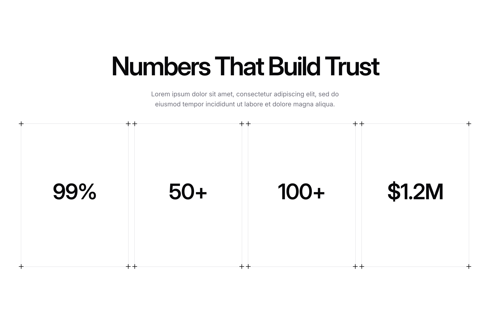

A centered section displays a main heading at the top, followed by body text. Below this, four statistics are arranged horizontally in equal columns, each containing a large number or value. Decorative plus symbols appear above and below the entire layout, framing the content.

**Install**: `pnpm dlx shadcn add @shadcnblocks/feature274`

---

## feature275

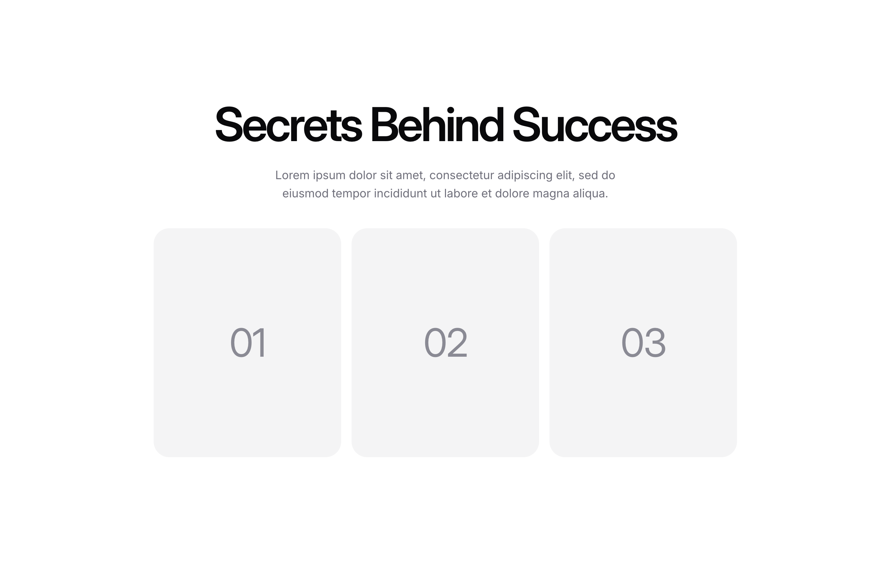

A centered section displays a main heading at the top, followed by body text below it. Underneath the text, three rectangular cards are arranged horizontally in equal columns, each labeled with a number (01, 02, 03).

**Install**: `pnpm dlx shadcn add @shadcnblocks/feature275`

---

## feature276

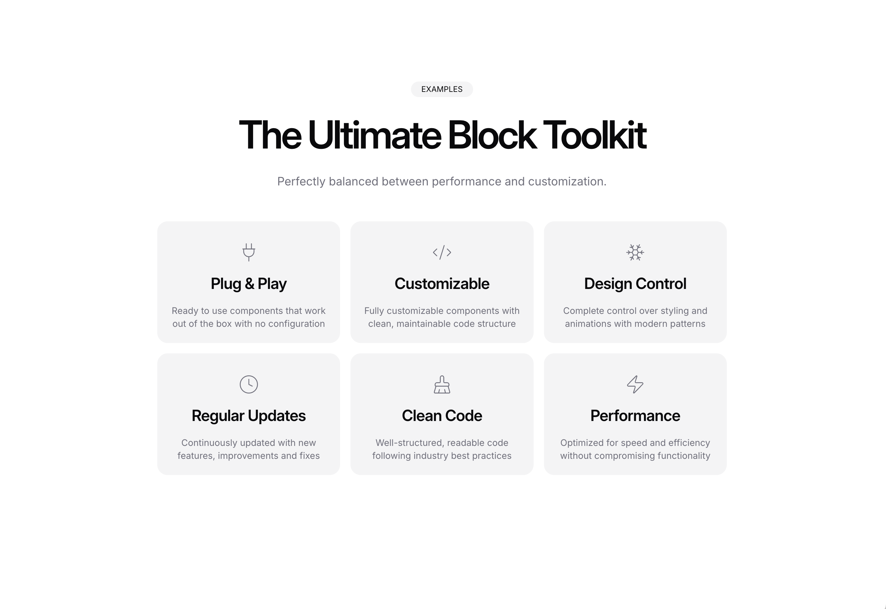

A centered webpage section features a label at the top, followed by a large heading and descriptive body text. Below this is a grid of six cards arranged in two rows and three columns, each containing an icon, a subheading, and supporting text.

**Install**: `pnpm dlx shadcn add @shadcnblocks/feature276`

---

## feature277

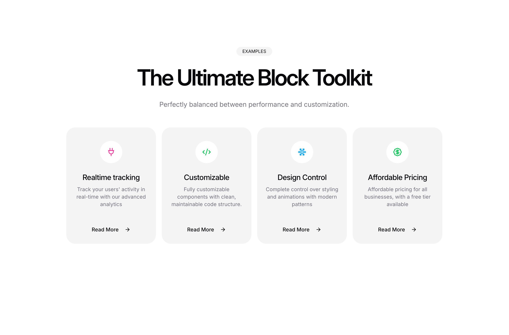

A centered section features a small label at the top, followed by a large heading and subheading. Below this, four equal-width cards are arranged horizontally in a grid layout. Each card contains an image icon at the top, a heading, body text, and a "Read More" button at the bottom.

**Install**: `pnpm dlx shadcn add @shadcnblocks/feature277`

---

## feature278

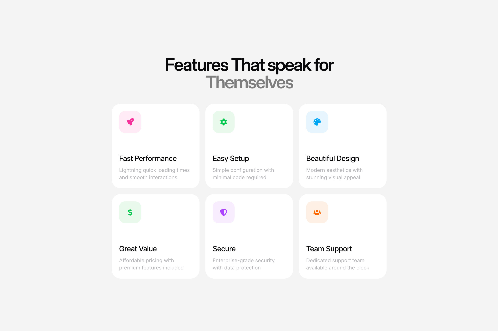

A centered section displays a main heading with a subtitle, followed by a 2x3 grid of feature cards arranged horizontally and vertically. Each card contains a small image icon at the top, a bold title below it, and body text underneath describing the feature.

**Install**: `pnpm dlx shadcn add @shadcnblocks/feature278`

---

## feature280

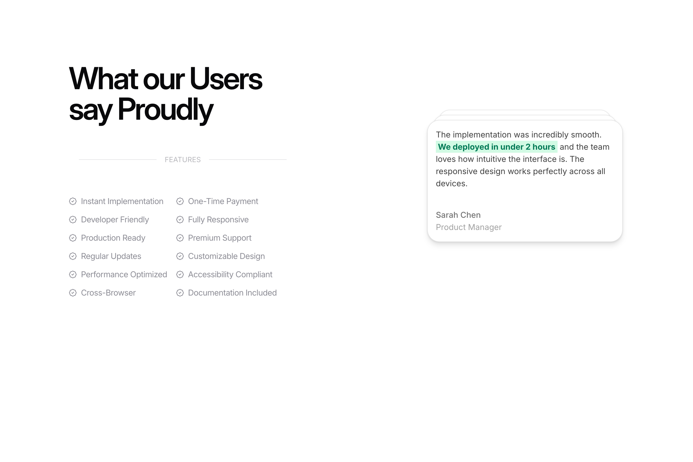

A two-column layout with the left side containing a large heading followed by a "Features" label and a grid of checkmarked items arranged in two columns. The right side displays a testimonial card with body text, a highlighted phrase, and attribution details (name and title) positioned below the quote.

**Install**: `pnpm dlx shadcn add @shadcnblocks/feature280`

---

## feature281

A centered testimonials section features a main heading at the top, followed by a testimonial card containing body text with an emphasized phrase, a user image on the left, the user's name and title below the image, and a company logo on the right. Below the card, a "Read More" link with an arrow is positioned at the bottom center.

**Install**: `pnpm dlx shadcn add @shadcnblocks/feature281`

---

## feature282

A two-column layout displays enterprise security content. On the left, a mobile device image is positioned vertically with a heading and descriptive label below it. On the right, a category label appears at the top, followed by a main heading, two paragraphs of body text, and a bulleted list of features at the bottom.

**Install**: `pnpm dlx shadcn add @shadcnblocks/feature282`

---

## feature283

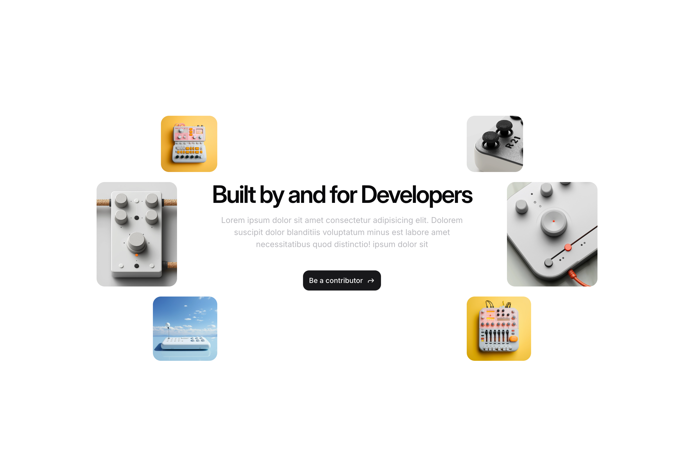

A centered section features a main heading with body text positioned in the middle. Six images are arranged in a circular pattern around the central text content. Below the text sits a dark button with a label and arrow icon, all elements aligned vertically and horizontally centered on the page.

**Install**: `pnpm dlx shadcn add @shadcnblocks/feature283`

---

## feature285

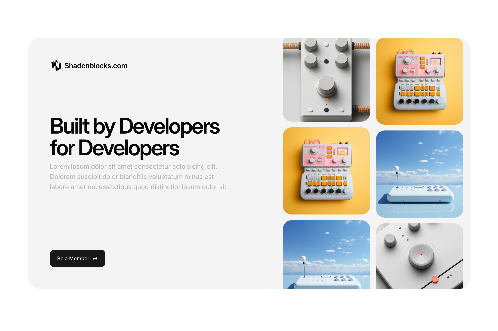

A webpage section uses a two-column layout. The left column contains a logo at the top, followed by a main heading, body text, and a button positioned below. The right column displays a grid of six images arranged in three rows and two columns.

**Install**: `pnpm dlx shadcn add @shadcnblocks/feature285`

---

## feature286

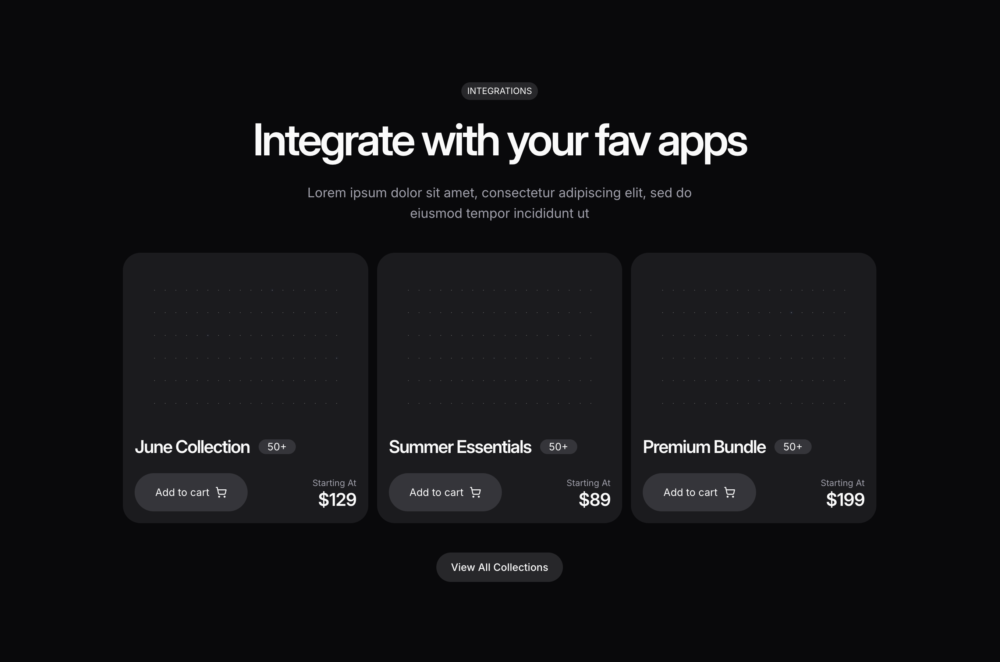

A centered section displays a small label at the top, followed by a large heading and body text. Below this, three product cards are arranged horizontally, each containing an image placeholder, a title with a badge, a price, and an "Add to cart" button. A "View All Collections" button is centered at the bottom of the section.

**Install**: `pnpm dlx shadcn add @shadcnblocks/feature286`

---

## feature287

A section displays a main heading at the top left, followed by four horizontally arranged cards in a grid layout. Each card contains an image, a title label, and body text positioned below. A centered button is placed at the bottom of the section.

**Install**: `pnpm dlx shadcn add @shadcnblocks/feature287`

---

## feature288

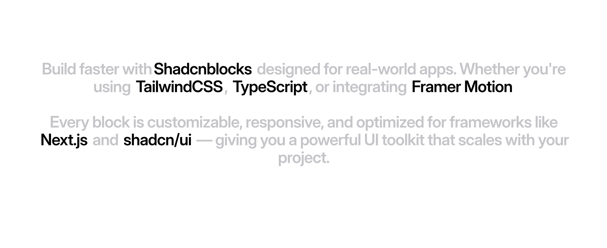

A centered text block displays a multi-line heading with alternating font weights, introducing key technologies and frameworks. Below the heading, a secondary body text continues horizontally across the full width, emphasizing specific product names and features in bold typography.

**Install**: `pnpm dlx shadcn add @shadcnblocks/feature288`

---

## feature289

A two-column layout with the left side featuring a large heading and a "Learn More" button with an arrow, positioned vertically. The right side displays a label followed by a vertical list of text items in a lighter font weight, aligned to the right edge.

**Install**: `pnpm dlx shadcn add @shadcnblocks/feature289`

---

## feature290

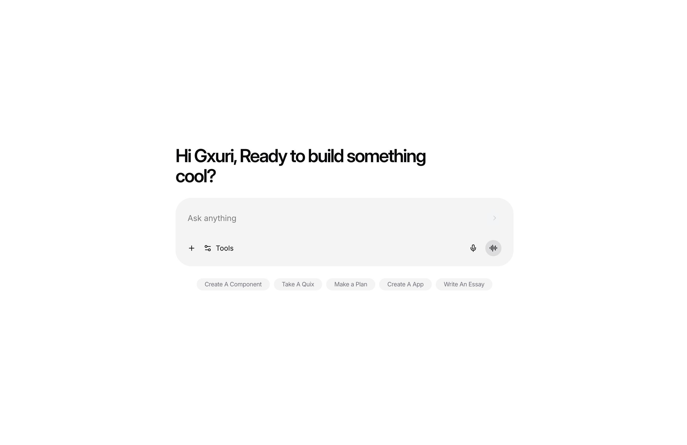

A centered card layout contains a main heading at the top, followed by an input field labeled "Ask anything" with action icons on the right. Below the input, a horizontal row of five buttons is arranged side-by-side, with a "Tools" dropdown and additional control icons positioned in a secondary toolbar above the buttons.

**Install**: `pnpm dlx shadcn add @shadcnblocks/feature290`

---

## feature291

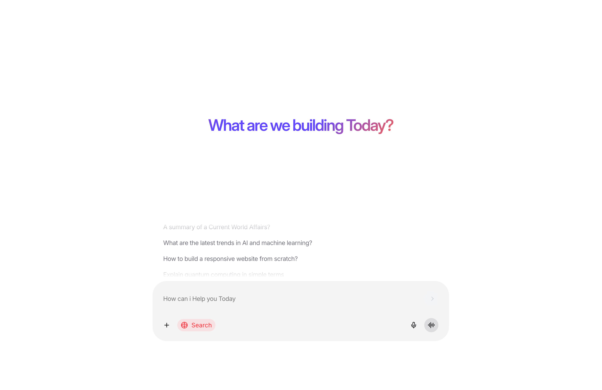

A centered interface displays a large heading at the top, followed by a list of four selectable options vertically stacked in the middle. Below the options is a horizontally-aligned input field with a search label on the left, a plus icon and additional control buttons positioned on the right side of the field.

**Install**: `pnpm dlx shadcn add @shadcnblocks/feature291`

---

## feature292

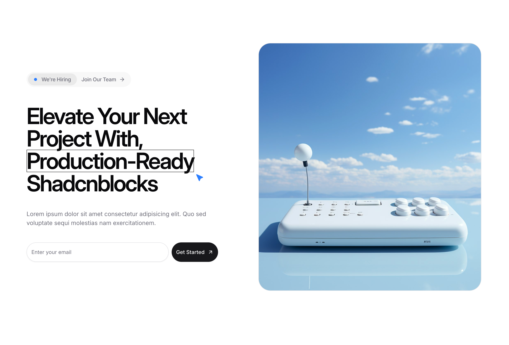

A landing page section is divided into two columns. The left column contains a label tag at the top, followed by a large heading, body text, an email input field, and a call-to-action button stacked vertically. The right column displays a large image aligned to the right side of the layout.

**Install**: `pnpm dlx shadcn add @shadcnblocks/feature292`

---

## feature293

A centered subscription section displays a large heading at the top, followed by body text positioned directly below. An email input field and a subscribe button are horizontally aligned beneath the text. A decorative background image spans the full width at the bottom of the section.

**Install**: `pnpm dlx shadcn add @shadcnblocks/feature293`

---

## feature294

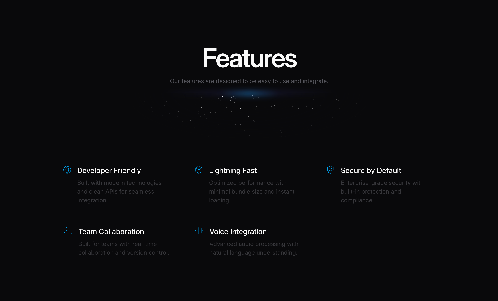

A vertically-stacked section displays a centered heading and subheading at the top. Below this is an animated graphic element. The content is then organized into two rows with three feature cards arranged horizontally across each row. Each card contains an icon on the left, a bold label, and descriptive body text positioned beneath.

**Install**: `pnpm dlx shadcn add @shadcnblocks/feature294`

---

## feature295

A project portfolio grid displays nine project cards arranged in three columns and three rows. Each card contains a project title at the top left, a star icon with a numeric rating at the top right, and descriptive body text below. At the bottom of each card, a role label appears on the left with a corresponding numeric metric on the right. Above the grid, a horizontal navigation bar with category filter buttons is positioned, with an additional dropdown menu aligned to the right.

**Install**: `pnpm dlx shadcn add @shadcnblocks/feature295`

---
