# Footer Blocks (21)

Site footer components with links and information. Include navigation, legal links, and social media.

---

## footer1

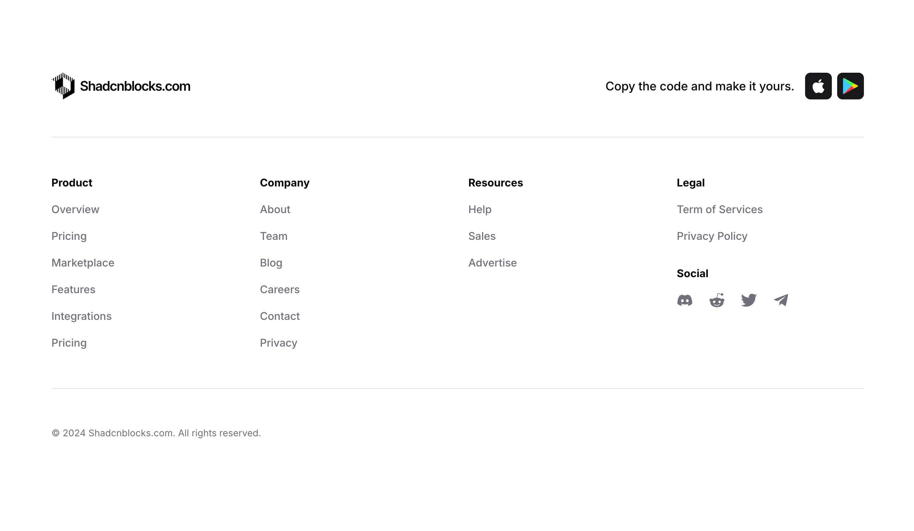

A footer layout organized into four vertically stacked columns positioned horizontally across the page. Each column contains a bold heading followed by a list of text links below it. On the far right, a "Social" section displays a row of icon buttons. At the bottom, copyright text and a centered logo appear on the left side.

**Install**: `pnpm dlx shadcn add @shadcnblocks/footer1`

---

## footer2

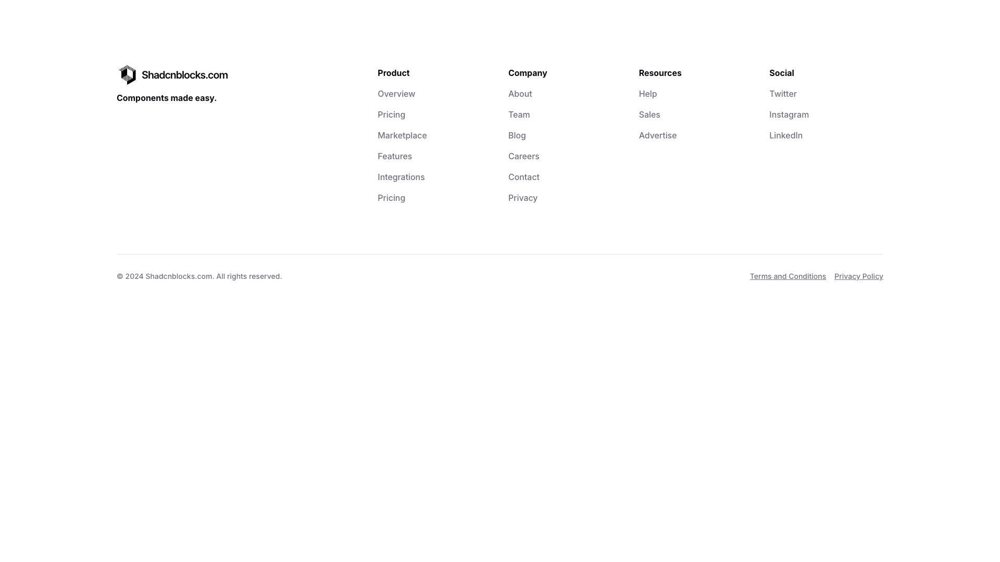

A footer section is organized into four columns of navigation links arranged horizontally across the page. On the far left is a logo with tagline text, while the remaining three columns—labeled "Product," "Company," and "Resources"—each contain vertically stacked links. A fifth column on the right labeled "Social" contains social media links. Below the main navigation, centered at the bottom, is copyright text on the left with two additional footer links positioned on the right.

**Install**: `pnpm dlx shadcn add @shadcnblocks/footer2`

---

## footer3

A footer layout organized in four vertically-stacked columns on the left side containing headings and multiple text links. On the right side, a newsletter subscription area is positioned with a text input field, a button, and supporting body text. Social media icons are horizontally aligned above the subscription section, and copyright text with policy links appears at the bottom.

**Install**: `pnpm dlx shadcn add @shadcnblocks/footer3`

---

## footer4

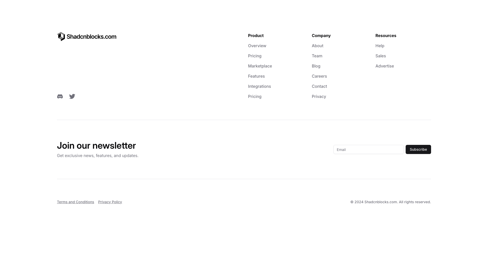

A footer layout organized in three columns across the top, containing navigation links grouped under "Product," "Company," and "Resources" headings. Below this, a newsletter signup section spans the full width with a heading, body text, an email input field, and a subscribe button positioned on the right. At the bottom, legal links and a copyright notice are arranged horizontally.

**Install**: `pnpm dlx shadcn add @shadcnblocks/footer4`

---

## footer5

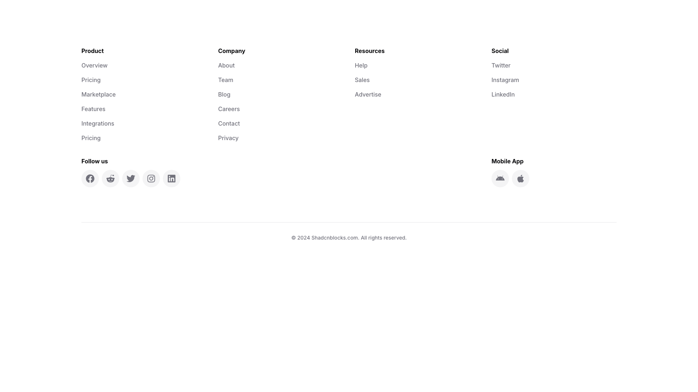

A footer section is organized into four columns displaying navigation links and social information. The left column contains product-related links, the second column lists company information, the third column includes resources, and the rightmost column shows social media links. Below these columns, a "Follow us" section with social media icons appears on the left, while a "Mobile App" section with app store icons is positioned on the right, with copyright text centered at the bottom.

**Install**: `pnpm dlx shadcn add @shadcnblocks/footer5`

---

## footer6

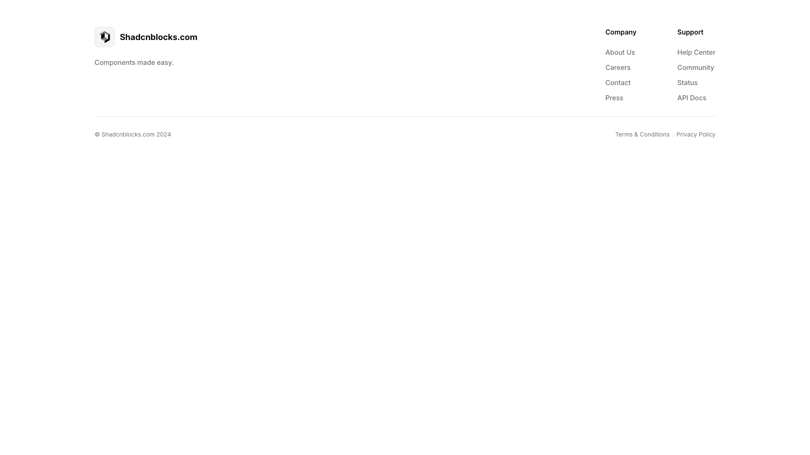

A footer section is divided into three main areas horizontally. On the left, a logo image and tagline text are positioned. The center contains two columns of navigation links labeled "Company" and "Support", each with multiple text links vertically stacked. On the right, copyright text appears at the bottom left, while "Terms & Conditions" and "Privacy Policy" links are aligned to the bottom right.

**Install**: `pnpm dlx shadcn add @shadcnblocks/footer6`

---

## footer7

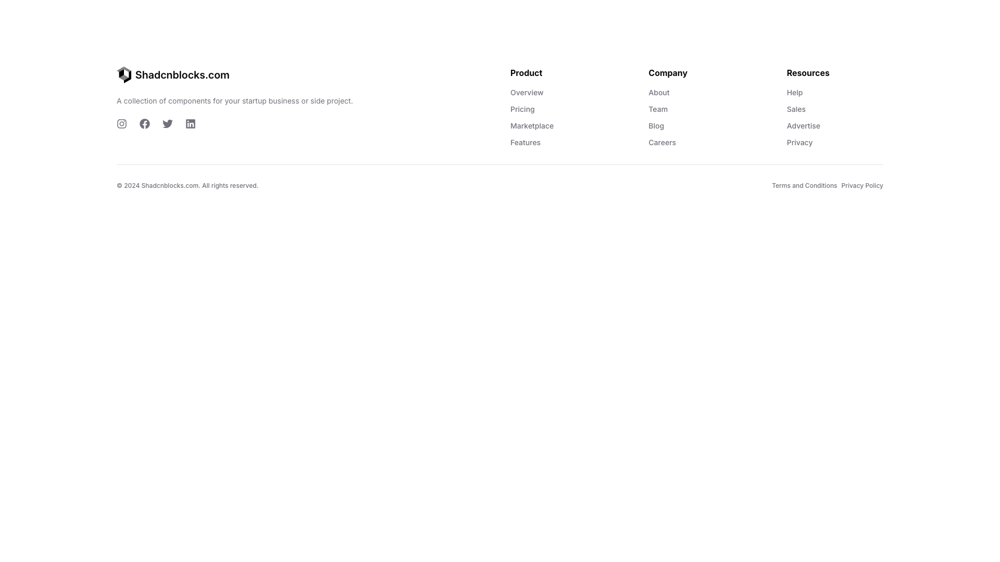

A footer layout organized into four vertical columns. The left column contains a logo, descriptive body text, and social media icons. The center-left and center-right columns each display a heading followed by a list of navigation links arranged vertically. The right column contains a heading with vertically stacked links below. At the bottom, copyright text appears on the left, while legal links are positioned on the right.

**Install**: `pnpm dlx shadcn add @shadcnblocks/footer7`

---

## footer8

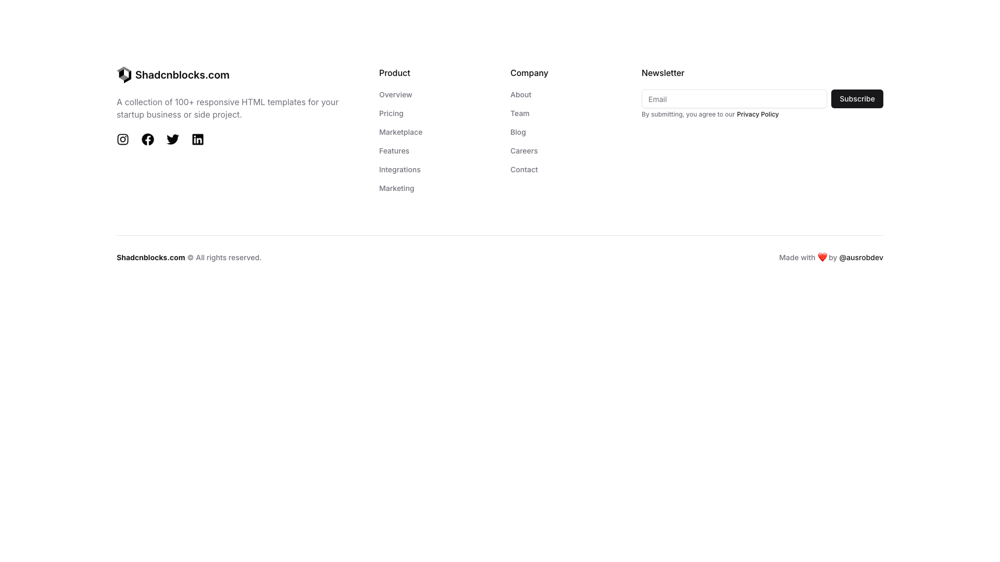

A footer section is organized into four vertical columns spanning horizontally across the page. The left column contains a logo, descriptive text, and social media icons. The center-left and center-right columns each display a vertical list of text links. The right column contains an email input field, a subscribe button positioned below it, and small disclaimer text underneath.

**Install**: `pnpm dlx shadcn add @shadcnblocks/footer8`

---

## footer9

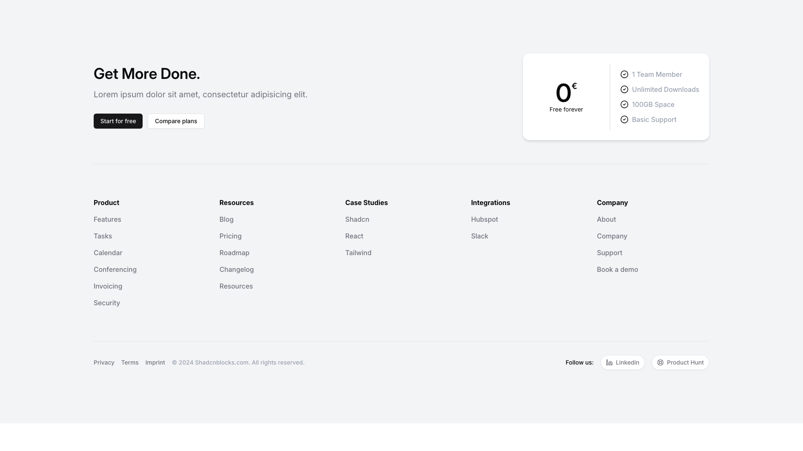

A webpage layout with a two-column structure. On the left, a main heading is followed by body text and two buttons positioned horizontally. On the right, a pricing card displays a large price figure, labeled text underneath, and a vertically stacked list of feature items. Below this section, a footer area contains five columns of links organized under category headings, with social media icons and legal links aligned at the bottom.

**Install**: `pnpm dlx shadcn add @shadcnblocks/footer9`

---

## footer10

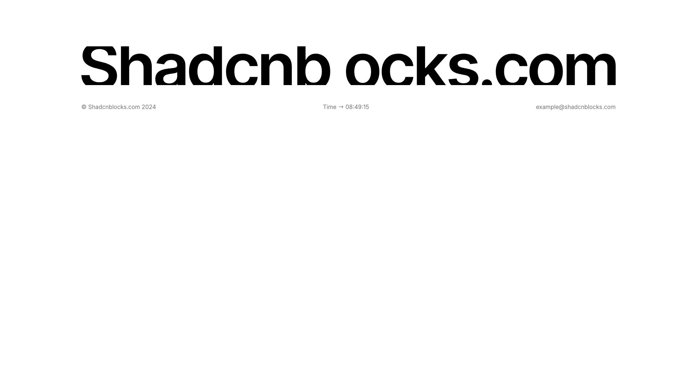

A header section displays three horizontally-aligned text elements across the width of the page. On the left is a copyright label with a year, in the center is a time display, and on the right is an example email address. Below this header, a large centered heading dominates the page layout.

**Install**: `pnpm dlx shadcn add @shadcnblocks/footer10`

---

## footer11

A footer section is organized into four vertically-aligned columns spanning horizontally across the page. The leftmost column contains a logo image, while the three columns to the right each display a heading followed by a series of text links arranged vertically. In the top right corner, a "Social" heading is followed by three icon links positioned horizontally.

**Install**: `pnpm dlx shadcn add @shadcnblocks/footer11`

---

## footer12

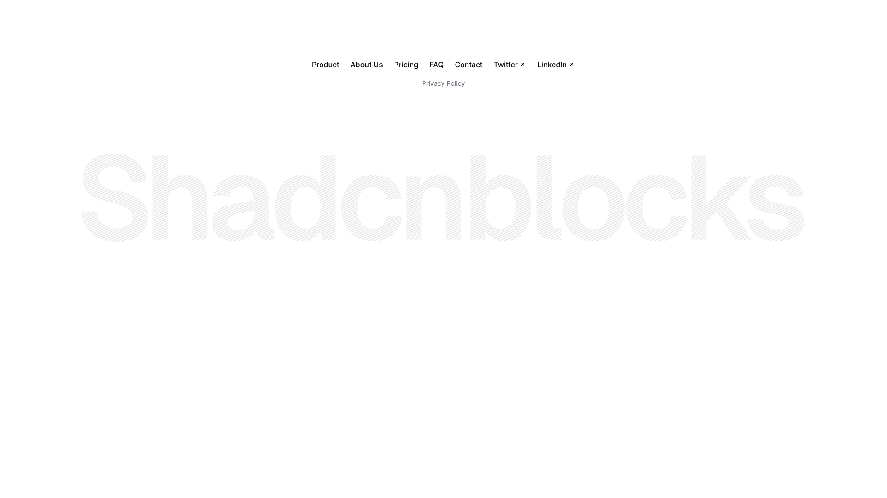

A webpage header contains a horizontal navigation menu centered at the top, featuring multiple text links. Below the navigation is a large centered heading displayed prominently on the page. At the bottom of the visible area, a footer section shows additional text links arranged horizontally.

**Install**: `pnpm dlx shadcn add @shadcnblocks/footer12`

---

## footer13

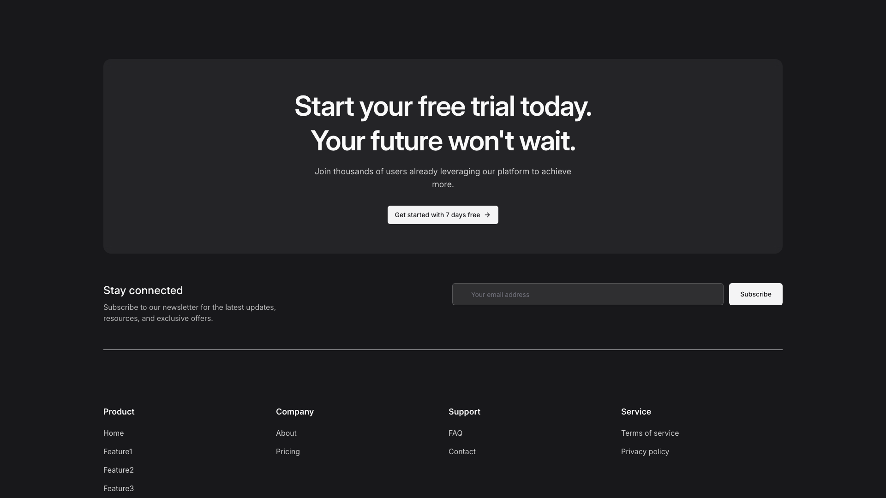

A dark-themed webpage section displays a centered call-to-action area with a large heading, body text, and a button positioned vertically. Below this, a "Stay connected" section on the left contains a label and descriptive text, with an email subscription input field and button aligned horizontally on the right. At the bottom, a footer spans the full width with four columns of navigation links arranged horizontally.

**Install**: `pnpm dlx shadcn add @shadcnblocks/footer13`

---

## footer14

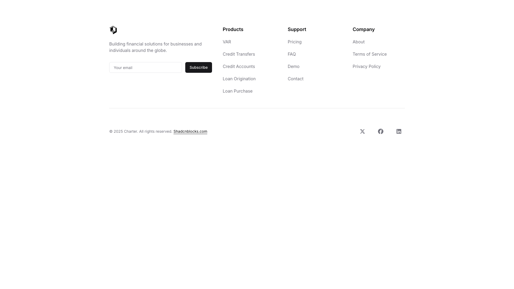

A footer section displays content in four vertically-aligned columns across the page. The left column contains an image, descriptive body text, an email input label, and a subscribe button. The three right columns contain multiple navigation link headings (Products, Support, Company) with corresponding links listed below each. At the bottom, copyright text and a website domain are left-aligned, with social media icons aligned to the right.

**Install**: `pnpm dlx shadcn add @shadcnblocks/footer14`

---

## footer15

A dark footer section spans the full width with content organized in four columns. The left column contains a logo, tagline text, social media icons, and a status indicator. The center-right columns display three groups of navigation links arranged horizontally under category headings: "Platform," "About Us," and "Learn." At the bottom, copyright text appears on the left while a location label sits on the right.

**Install**: `pnpm dlx shadcn add @shadcnblocks/footer15`

---

## footer16

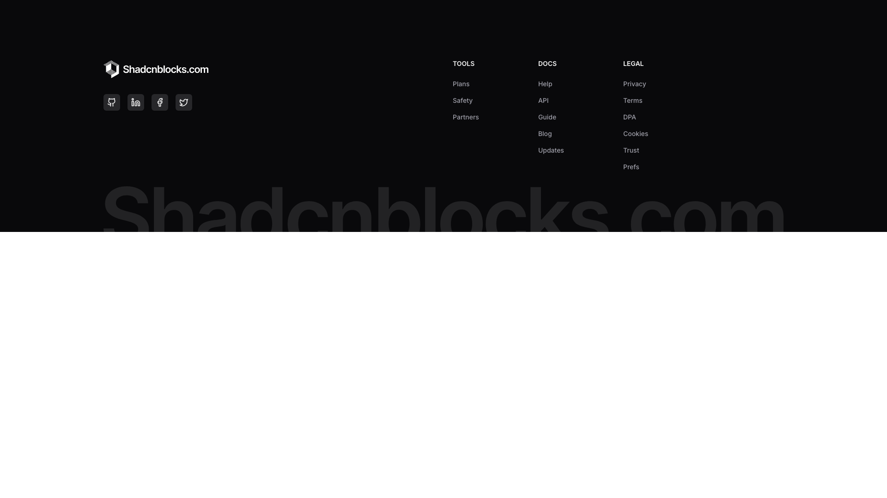

A dark footer is divided into four vertical sections aligned horizontally across the page. On the left, a logo appears above a row of social media icons. The remaining three sections contain vertically stacked link labels organized under headings: "TOOLS," "DOCS," and "LEGAL," with each section containing 3-5 individual links.

**Install**: `pnpm dlx shadcn add @shadcnblocks/footer16`

---

## footer17

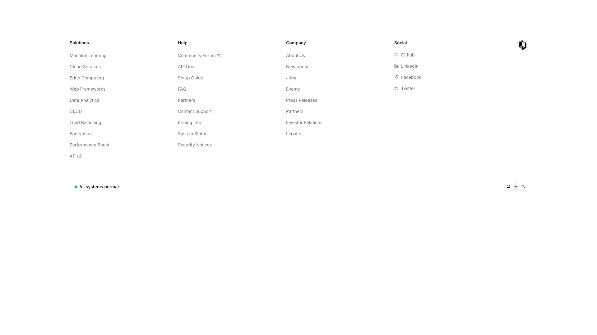

A footer section displays four columns of links horizontally across the page. The leftmost column contains a "Solutions" heading with vertically stacked links below. The second and third columns feature "Help" and "Company" headings respectively, each with their own set of vertically stacked links. The rightmost column shows a "Social" heading with social media links listed vertically. Below all columns, a status indicator displays "All systems normal" with accompanying icons to the right.

**Install**: `pnpm dlx shadcn add @shadcnblocks/footer17`

---

## footer23

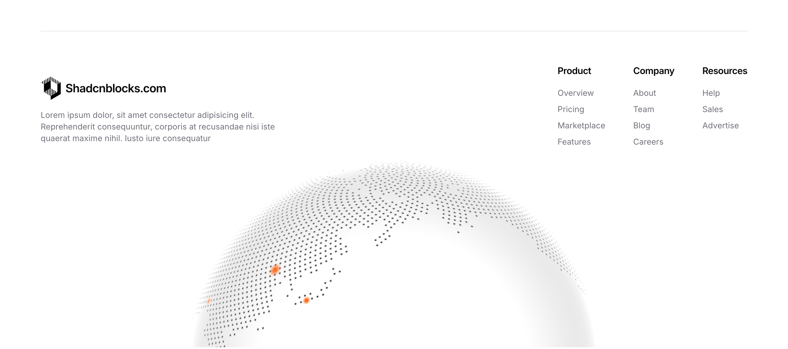

A webpage footer displays content in three columns aligned horizontally across the width. The left column contains a logo and body text. The right side features three columns of navigation links organized under three headings: "Product," "Company," and "Resources," with multiple labels listed vertically beneath each heading.

**Install**: `pnpm dlx shadcn add @shadcnblocks/footer23`

---

## footer24

A footer section displays a large centered heading at the top. Below this, three columns of information are arranged horizontally: the left column contains a label and email link, the center column has a label with four social media links, and the right column displays a label with a phone number. A navigation menu with six links spans the bottom left, while a small text label appears in the bottom right.

**Install**: `pnpm dlx shadcn add @shadcnblocks/footer24`

---

## footer30

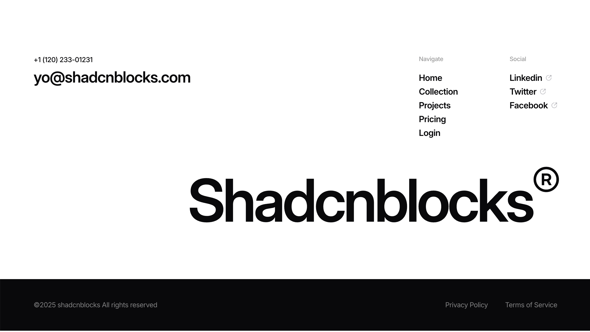

A footer layout with content distributed horizontally across the page. On the left side, contact information including a phone number and email address is stacked vertically. The center features a large heading. On the right side, two vertical navigation columns are positioned side-by-side, with labels and link text. At the bottom, a dark band spans the full width containing copyright text on the left and policy links on the right.

**Install**: `pnpm dlx shadcn add @shadcnblocks/footer30`

---

## footer31

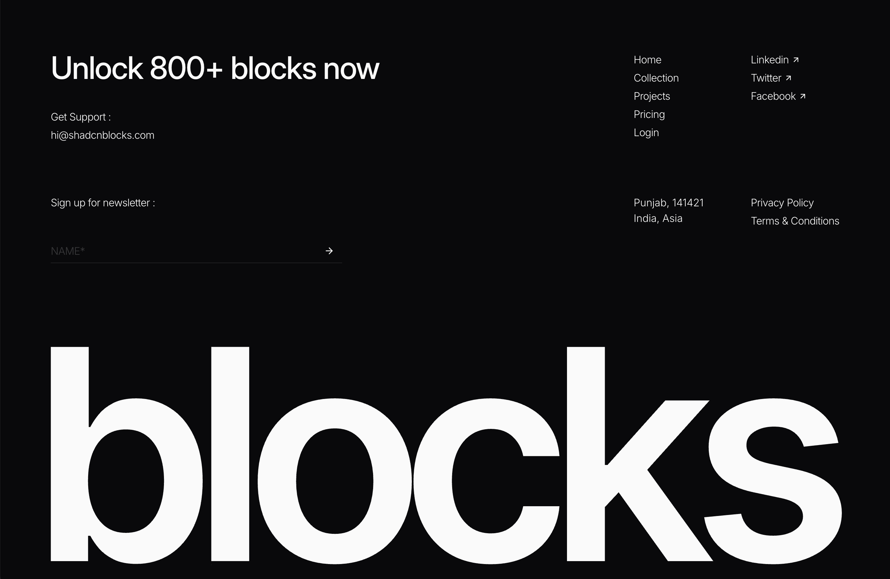

The page layout is divided into a left and right section. On the left, a large heading is positioned at the top, followed by support contact information and a newsletter signup form with a text input field and submit button. The right side contains a navigation menu at the top and footer links at the bottom, with a large image centered in the lower portion of the page.

**Install**: `pnpm dlx shadcn add @shadcnblocks/footer31`

---
