# Gallery Blocks (31)

Image galleries and portfolio showcases for visual content. Display photos, artwork, and project collections.

---

## gallery1

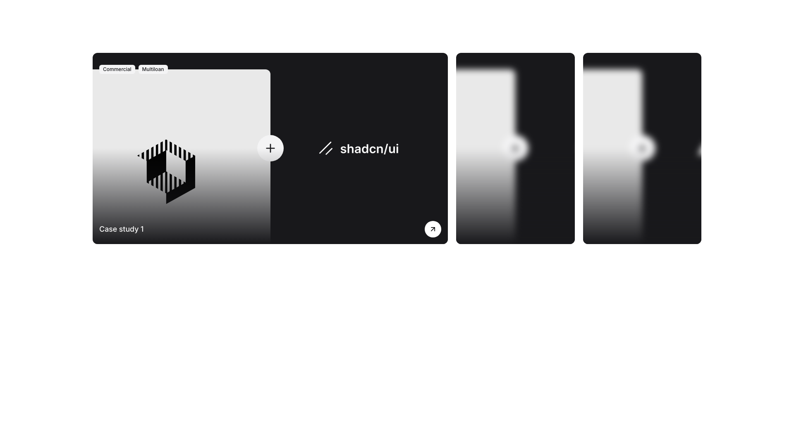

A layout with four vertically stacked cards arranged horizontally. The leftmost card contains a heading, body text, a label, and an image on the left side with a button on the right. The remaining three cards to the right display images only, with the center card featuring a heading overlay.

**Install**: `pnpm dlx shadcn add @shadcnblocks/gallery1`

---

## gallery3

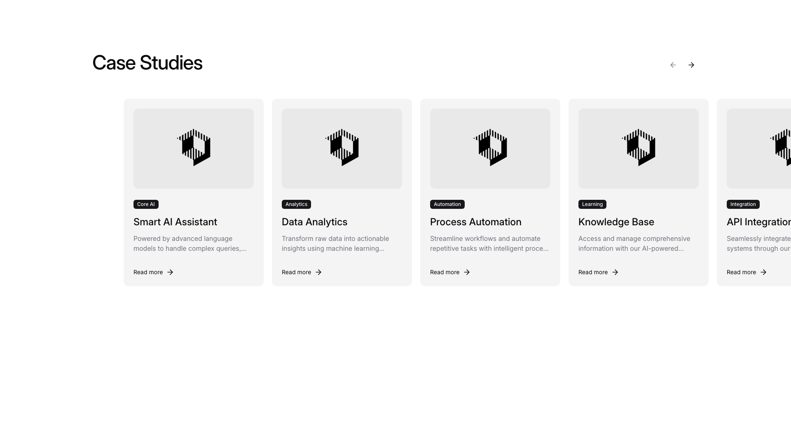

A horizontal carousel section displays five case study cards arranged in a row. Each card contains an image centered at the top, a category label below it, a title heading, descriptive body text, and a "Read more" link with an arrow at the bottom. Navigation arrows appear on the right side of the section header for scrolling through additional cards.

**Install**: `pnpm dlx shadcn add @shadcnblocks/gallery3`

---

## gallery4

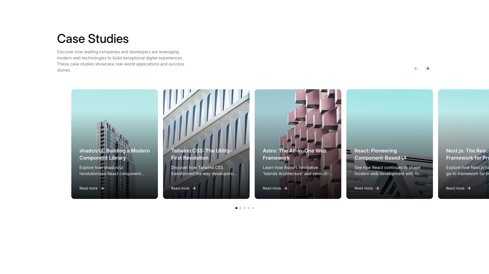

A section displays a heading and body text on the left, followed by a horizontally scrollable carousel of five card components. Each card contains an image, a heading, descriptive body text, and a "Read more" button aligned at the bottom. Navigation arrows are positioned on the right side, with pagination dots centered below the carousel.

**Install**: `pnpm dlx shadcn add @shadcnblocks/gallery4`

---

## gallery5

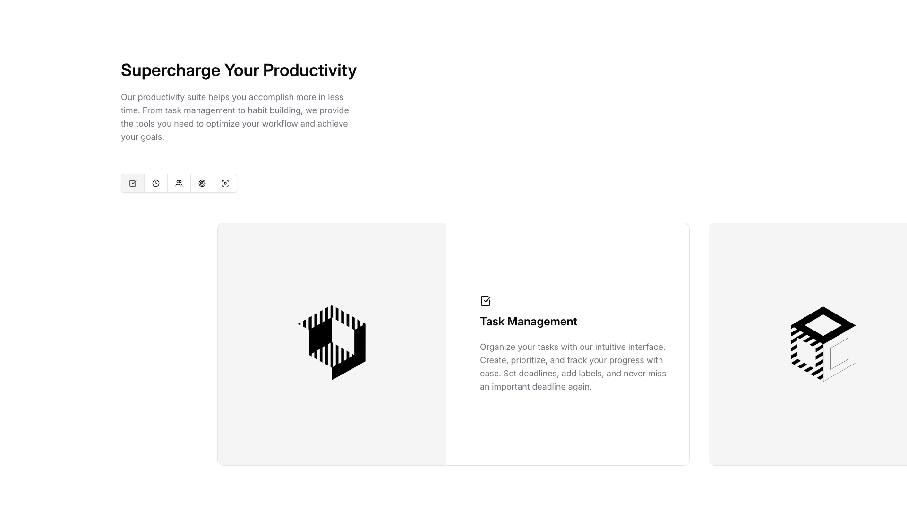

A section with a main heading and descriptive body text positioned on the left, followed by a row of five icon buttons below. The main content area displays three horizontally-aligned cards, each containing an image on the left or top, with a label and descriptive text positioned to the right or below the image.

**Install**: `pnpm dlx shadcn add @shadcnblocks/gallery5`

---

## gallery6

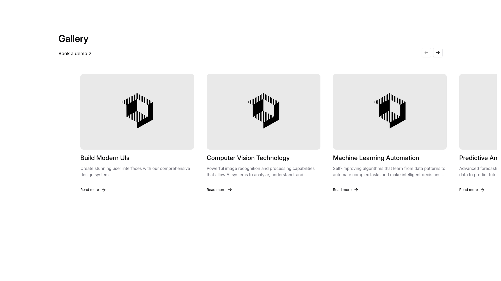

A gallery section displays four horizontally scrollable cards in a row. Each card contains an image centered at the top, followed by a heading, body text, and a "Read more" link positioned below. Navigation arrows for scrolling appear on the right side of the section header, with a "Book a demo" link positioned on the left.

**Install**: `pnpm dlx shadcn add @shadcnblocks/gallery6`

---

## gallery7

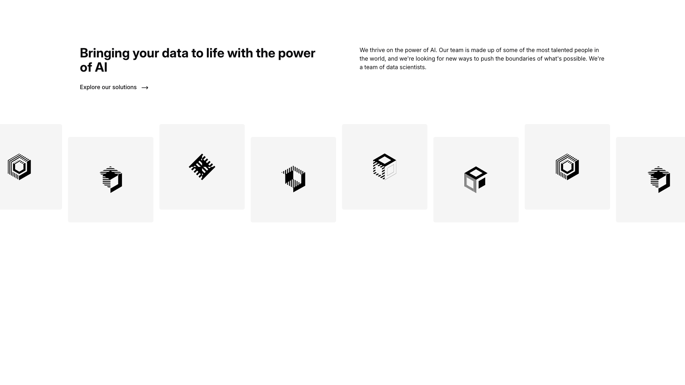

A webpage section displays a two-column layout. On the left, a main heading is positioned above body text and a clickable link. On the right, a descriptive paragraph of body text is aligned to the top. Below both columns, a horizontal row of evenly-spaced images is displayed.

**Install**: `pnpm dlx shadcn add @shadcnblocks/gallery7`

---

## gallery8

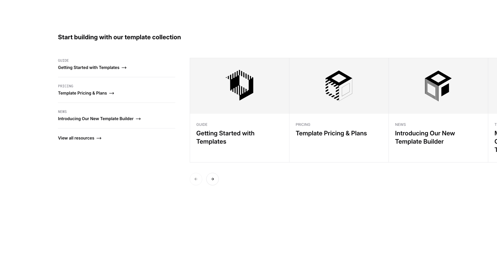

A page section displays a main heading at the top, followed by a two-column layout. The left column contains three vertically stacked items, each with a label, title, and an arrow. The right side features three horizontally arranged cards, each with an image centered at the top, a label, and a title below. Navigation arrows are positioned at the bottom center.

**Install**: `pnpm dlx shadcn add @shadcnblocks/gallery8`

---

## gallery9

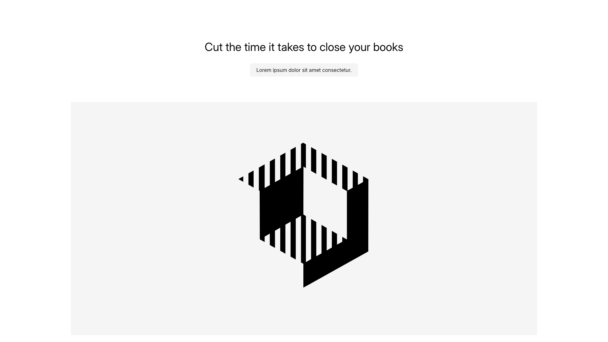

A centered section displays a heading at the top, followed by body text below it. Beneath the text, a large image is positioned centrally within a light gray background area that spans the full width of the block.

**Install**: `pnpm dlx shadcn add @shadcnblocks/gallery9`

---

## gallery10

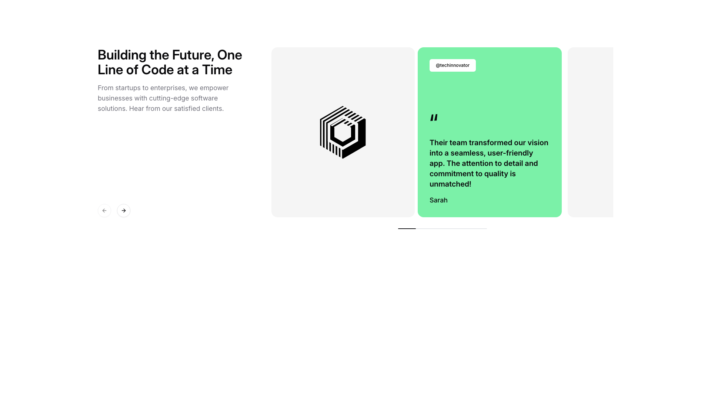

A section displays content in two columns with left and right alignment. The left column contains a main heading, descriptive body text, and navigation arrows positioned below. The center features an image. The right column displays a testimonial card in a contrasting color, containing a user handle label at the top, a quoted testimonial text in the middle, and an attribution name at the bottom.

**Install**: `pnpm dlx shadcn add @shadcnblocks/gallery10`

---

## gallery11

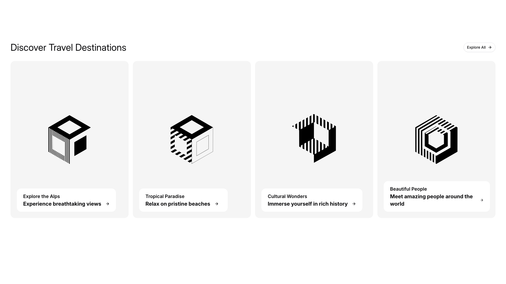

A section with a main heading at the top left and an "Explore All" link at the top right. Below, four equal-width cards are arranged horizontally, each containing a centered image, followed by a bold title and descriptive body text positioned at the bottom of each card.

**Install**: `pnpm dlx shadcn add @shadcnblocks/gallery11`

---

## gallery12

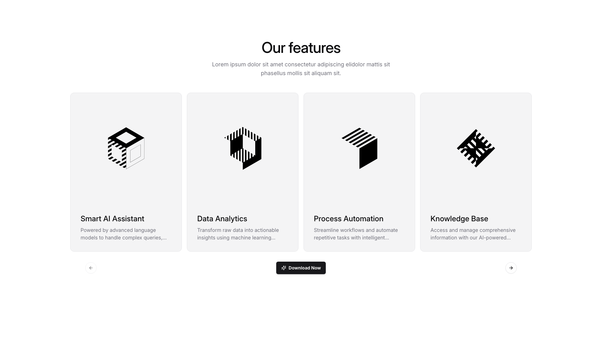

A features section with a centered heading and body text at the top. Below this, four feature cards are arranged horizontally in a grid, each containing an image, a label, and descriptive body text. Navigation arrows appear on the left and right edges, with a "Download Now" button centered below the cards.

**Install**: `pnpm dlx shadcn add @shadcnblocks/gallery12`

---

## gallery13

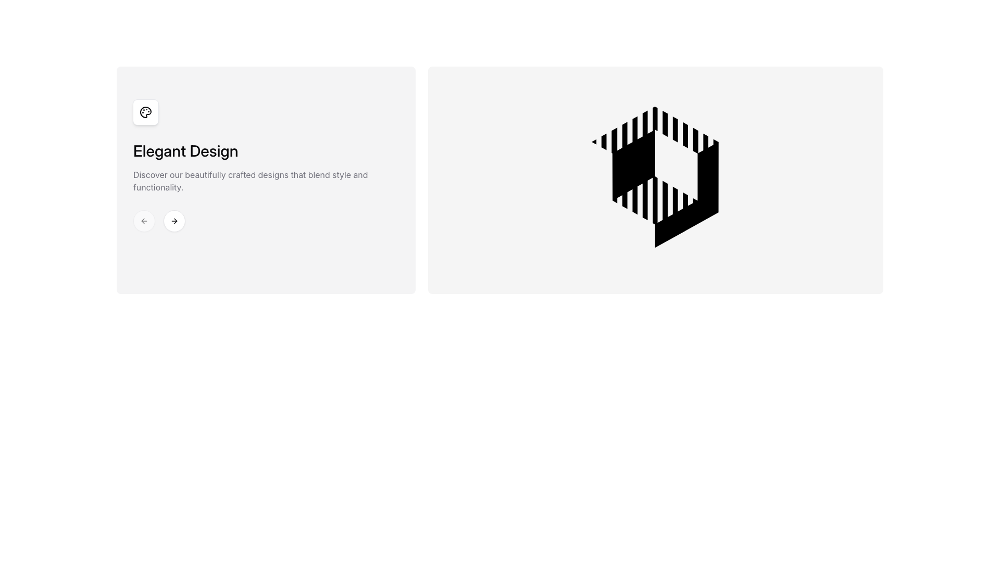

A section with two columns displays content horizontally. The left column contains a small icon label, a heading, body text, and navigation arrows positioned below. The right column features a large image centered vertically and horizontally within the space.

**Install**: `pnpm dlx shadcn add @shadcnblocks/gallery13`

---

## gallery14

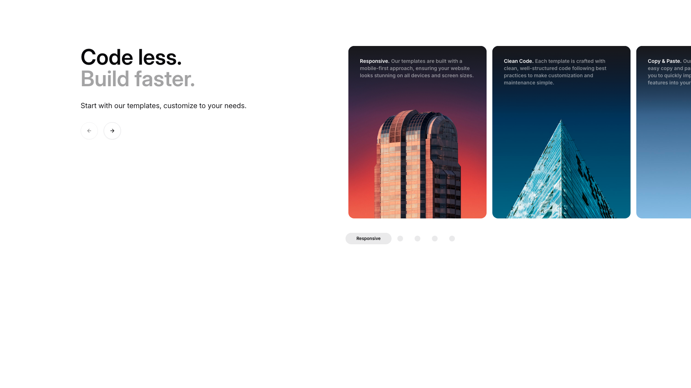

A webpage section displays a two-column layout. On the left, a large heading, smaller subtitle, body text, and navigation buttons are vertically stacked. On the right, three cards are arranged horizontally, each containing an image and text overlay at the top. Below the cards, a row of circular pagination indicators is centered.

**Install**: `pnpm dlx shadcn add @shadcnblocks/gallery14`

---

## gallery15

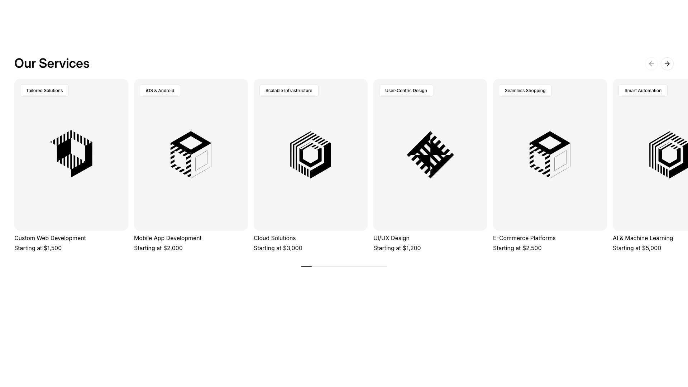

A services section displays six horizontally-scrollable cards in a grid layout. Each card contains a label at the top, a centered image in the middle, a service title, and pricing information at the bottom. Navigation arrows appear on the right side of the heading to scroll through additional service options.

**Install**: `pnpm dlx shadcn add @shadcnblocks/gallery15`

---

## gallery16

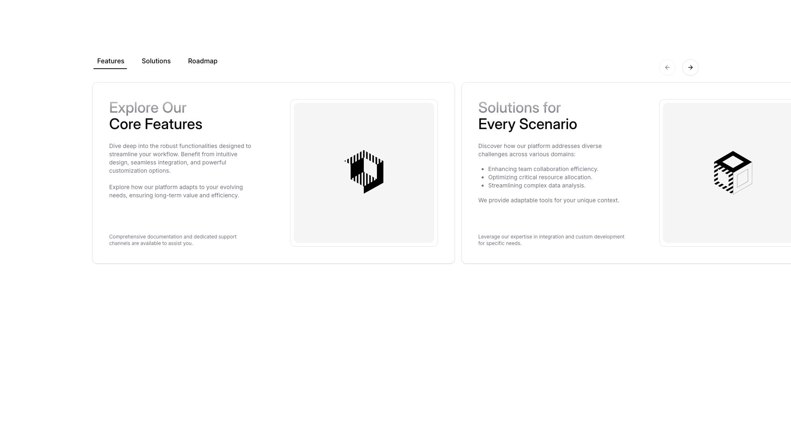

A webpage section displays two side-by-side content cards in a horizontal layout. The left card contains a main heading, body text across multiple paragraphs, and a centered image below. The right card features a main heading, body text, a bulleted list, and an image positioned on the right side. Navigation arrows appear at the top right of the section.

**Install**: `pnpm dlx shadcn add @shadcnblocks/gallery16`

---

## gallery17

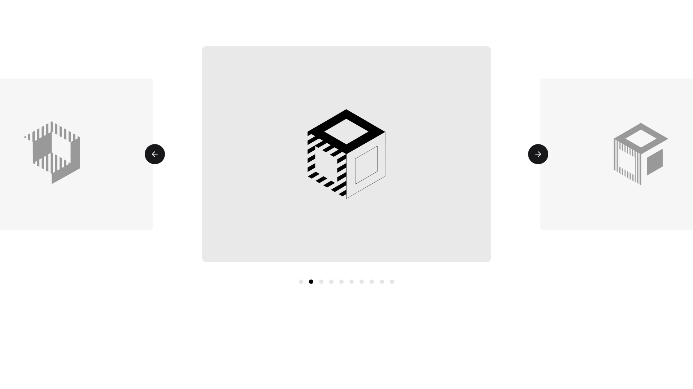

A carousel layout displays content horizontally with three visible sections. The center section is highlighted in a light gray box and contains a large centered image. Navigation arrows are positioned on the left and right sides, with a series of dot indicators for slide pagination centered below the carousel.

**Install**: `pnpm dlx shadcn add @shadcnblocks/gallery17`

---

## gallery18

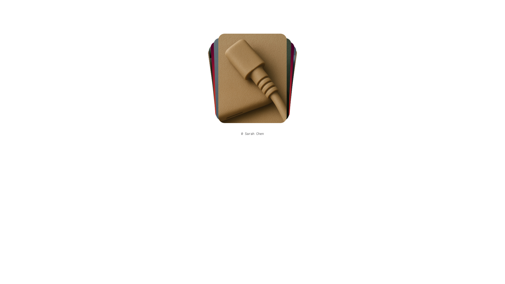

A centered square icon with rounded corners displays an image on a tan background. A dark red or maroon stripe runs vertically along the left edge of the icon. Below the icon, a small text label is positioned at the bottom center.

**Install**: `pnpm dlx shadcn add @shadcnblocks/gallery18`

---

## gallery19

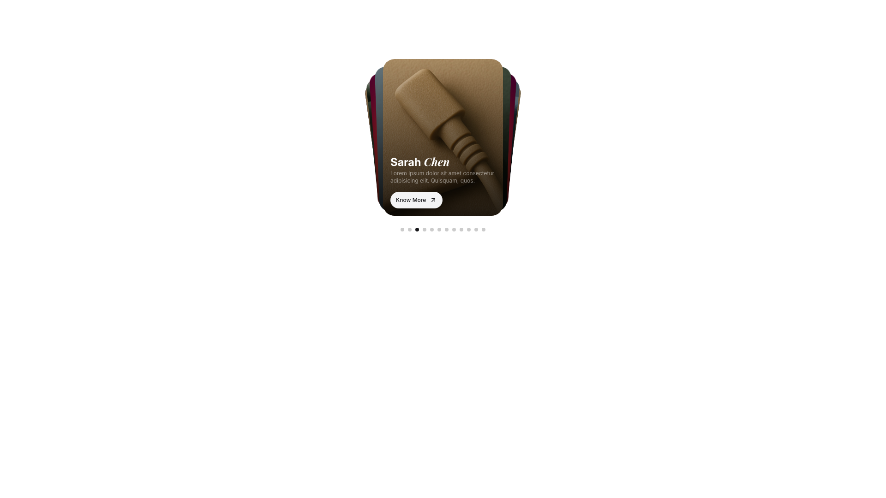

A centered card layout features an image positioned at the top, with a name heading and body text overlaid at the bottom. Below the text sits a white button labeled "Know More" with an arrow icon. A horizontal row of navigation dots appears underneath the card, indicating multiple slides in a carousel.

**Install**: `pnpm dlx shadcn add @shadcnblocks/gallery19`

---

## gallery20

A centered section displays a row of four rounded images horizontally aligned at the top. Below the images, a heading and body text are stacked vertically and centered. A dark button with text and an icon is positioned centrally below the text.

**Install**: `pnpm dlx shadcn add @shadcnblocks/gallery20`

---

## gallery21

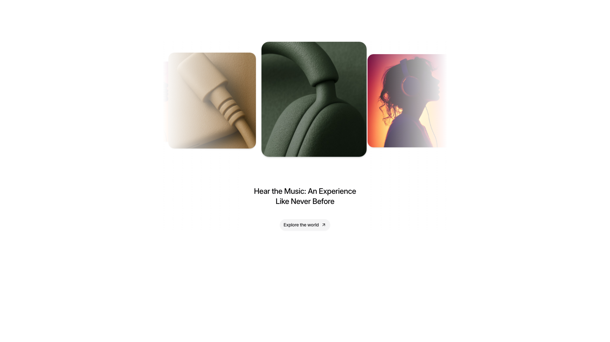

A centered section displays three images arranged horizontally across the top. Below the images, a main heading and subheading are vertically stacked and centered. Underneath the text, a button labeled with text and an icon is positioned centrally.

**Install**: `pnpm dlx shadcn add @shadcnblocks/gallery21`

---

## gallery22

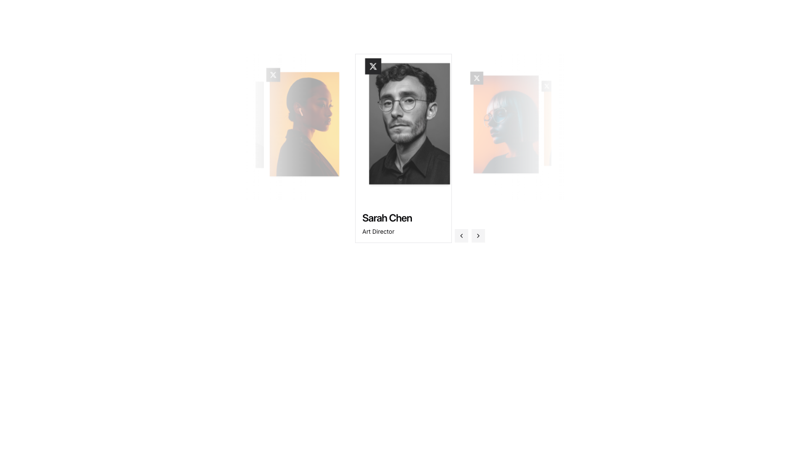

A carousel section displays three images horizontally arranged with navigation arrows on either side. Below the centered image, a heading and subheading are stacked vertically, with small close buttons positioned in the top corners of the outer images. Navigation arrows appear at the bottom to scroll between items.

**Install**: `pnpm dlx shadcn add @shadcnblocks/gallery22`

---

## gallery23

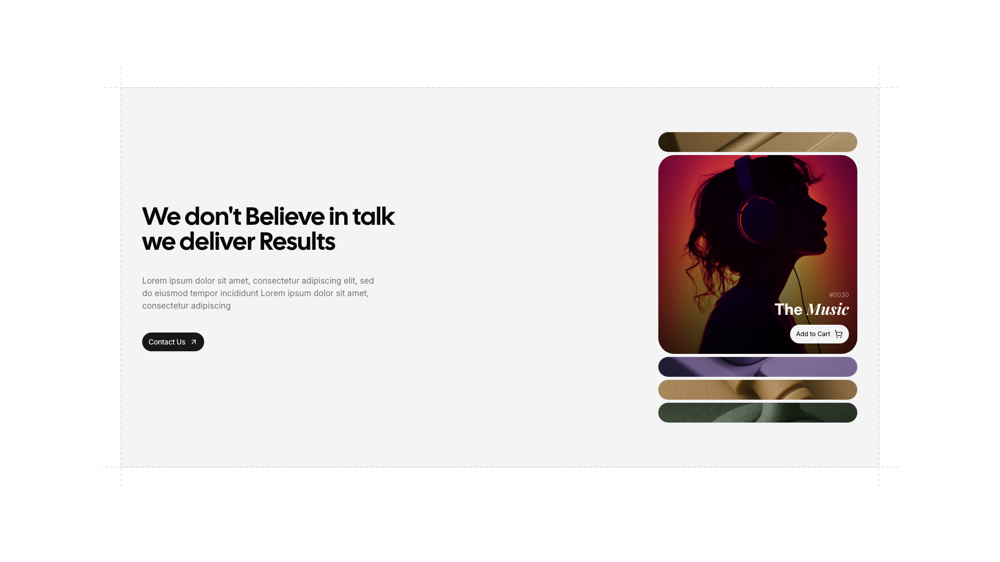

A horizontal layout with two columns displays content side-by-side. The left column contains a large heading, body text, and a button positioned vertically. The right column features a vertical stack of four images, with the top image accompanied by a label and an action button overlaid at the bottom.

**Install**: `pnpm dlx shadcn add @shadcnblocks/gallery23`

---

## gallery24

A centered section features a main heading at the top, followed by body text. Below is a horizontally scrolling gallery of vertically-oriented rounded rectangular images, with one larger image prominently displayed in the center containing an overlay label and a button. A secondary button is positioned centrally below the gallery.

**Install**: `pnpm dlx shadcn add @shadcnblocks/gallery24`

---

## gallery25

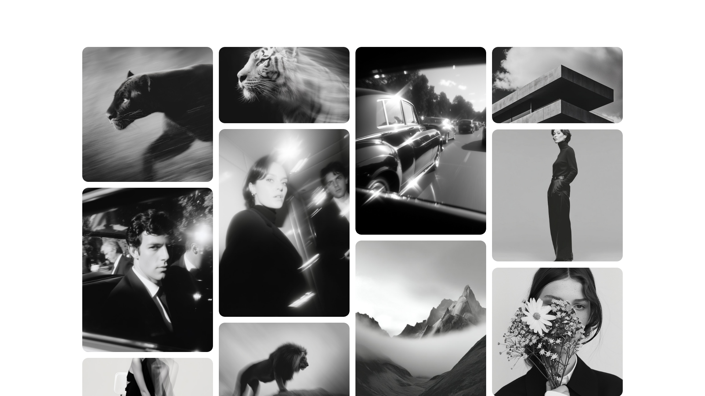

A gallery grid layout displays images arranged in an asymmetric pattern across multiple columns and rows. The images vary in size, with larger images positioned on the left side and smaller images stacked vertically on the right. The overall composition creates a dynamic, masonry-style arrangement with images of different dimensions distributed throughout the layout.

**Install**: `pnpm dlx shadcn add @shadcnblocks/gallery25`

---

## gallery26

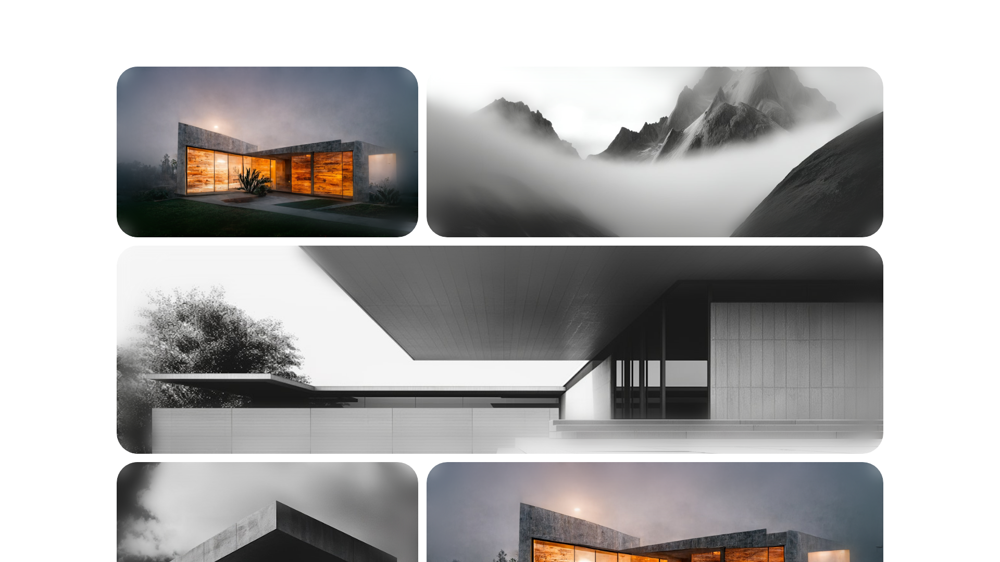

A gallery grid layout displays images in an asymmetrical arrangement. The top row contains two smaller images positioned side-by-side. Below them, a large horizontal image spans the full width. The bottom row features two smaller images aligned left and right, flanking the centered layout.

**Install**: `pnpm dlx shadcn add @shadcnblocks/gallery26`

---

## gallery27

A section displays a main heading centered at the top, followed by body text below it. Underneath, four images are arranged horizontally in a row, each with a label and job title positioned directly beneath. Navigation buttons are positioned in the top right corner.

**Install**: `pnpm dlx shadcn add @shadcnblocks/gallery27`

---

## gallery28

A centered section displays a main heading at the top, followed by descriptive body text. Below this, two images are positioned side-by-side horizontally, each with navigation arrows on their outer edges.

**Install**: `pnpm dlx shadcn add @shadcnblocks/gallery28`

---

## gallery29

A gallery section features a centered heading and descriptive body text at the top. Below, five images are arranged horizontally in a row, with the center image slightly larger and more prominent than the others on either side.

**Install**: `pnpm dlx shadcn add @shadcnblocks/gallery29`

---

## gallery30

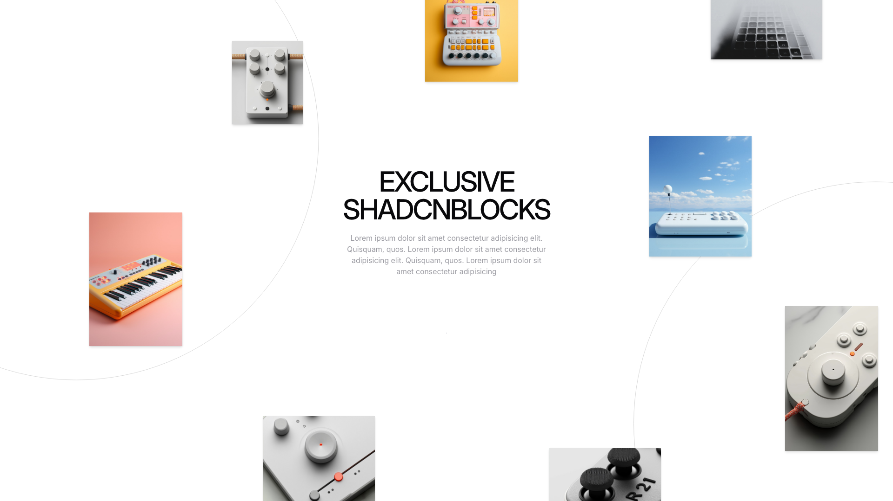

A centered layout displays a main heading with body text in the middle of the screen. Surrounding this central content are multiple images positioned around the layout—on the left, right, top, and bottom—creating a scattered, circular composition around the core text.

**Install**: `pnpm dlx shadcn add @shadcnblocks/gallery30`

---

## gallery31

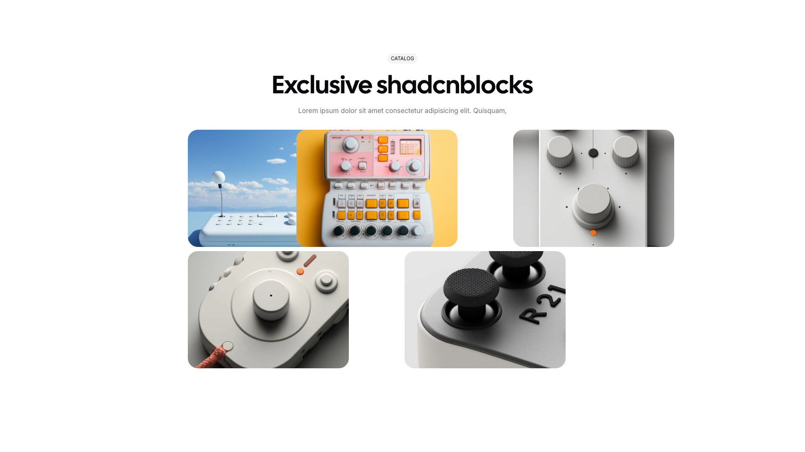

A catalog section features a centered heading and descriptive body text at the top. Below, four images are arranged in a grid layout—a larger rectangular image spans the top left and center, a smaller image occupies the top right, and two equally-sized images are positioned in the bottom row.

**Install**: `pnpm dlx shadcn add @shadcnblocks/gallery31`

---

## gallery32

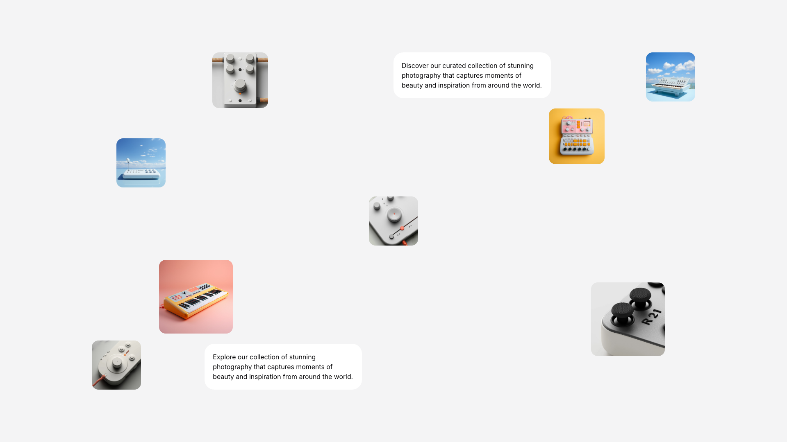

A scattered layout displays multiple rounded square images positioned across the page at varying coordinates. Two centered text blocks are overlaid on the composition, with one heading and body text positioned in the upper-middle area and another identical text block in the lower-left portion of the layout.

**Install**: `pnpm dlx shadcn add @shadcnblocks/gallery32`

---
