# Hero Blocks (151)

Landing page hero sections for product showcases and marketing campaigns. Create strong first impressions with compelling visuals.

---

## hero1

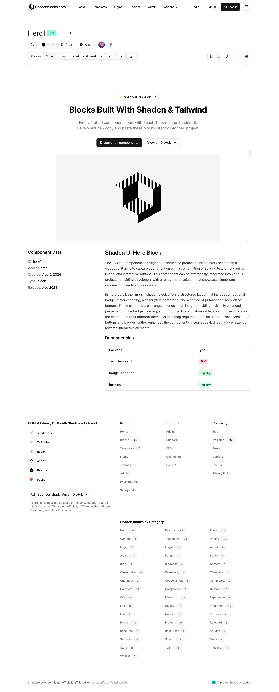

A centered hero section displays a main heading at the top, followed by body text and two horizontally-aligned buttons below. An image is positioned centrally underneath the buttons. Below the hero content, component metadata is listed on the left side, while a detailed description and dependencies table are arranged vertically on the right.

**Install**: `pnpm dlx shadcn add @shadcnblocks/hero1`

---

## hero2

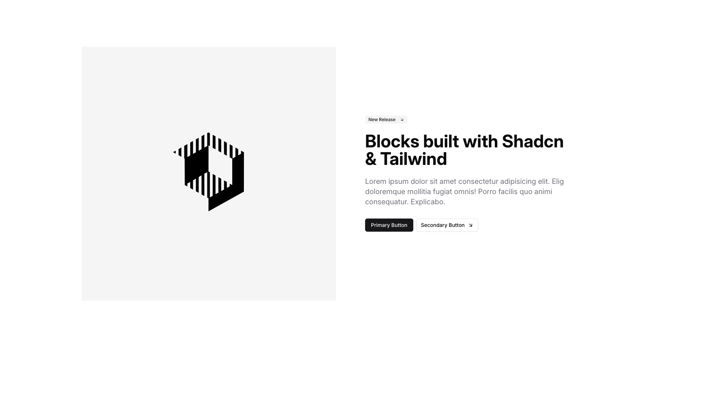

A two-column layout with an image centered on the left side and text content on the right. The right column contains a label, a large heading, body text, and two buttons positioned horizontally at the bottom.

**Install**: `pnpm dlx shadcn add @shadcnblocks/hero2`

---

## hero3

A two-column layout with the left side containing a main heading, body text, a rating display with avatars and star icons, and two buttons stacked horizontally. The right side features a large centered image that spans the full height of the section.

**Install**: `pnpm dlx shadcn add @shadcnblocks/hero3`

---

## hero4

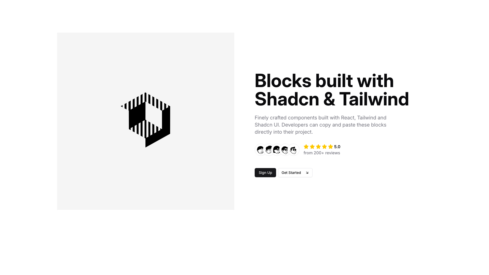

A two-column layout with an image positioned on the left and text content on the right. The right column contains a heading, descriptive body text, a rating display with star icons and reviewer avatars, and two horizontally-aligned buttons at the bottom.

**Install**: `pnpm dlx shadcn add @shadcnblocks/hero4`

---

## hero5

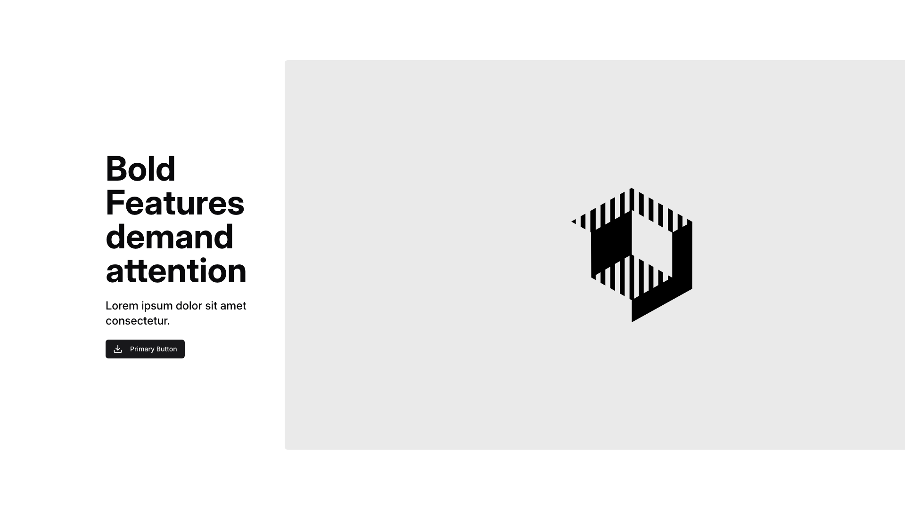

A hero section is divided into two columns. The left column contains a bold heading, body text, and a primary button positioned vertically. The right column features a large image centered on a light gray background, occupying roughly half the width of the layout.

**Install**: `pnpm dlx shadcn add @shadcnblocks/hero5`

---

## hero6

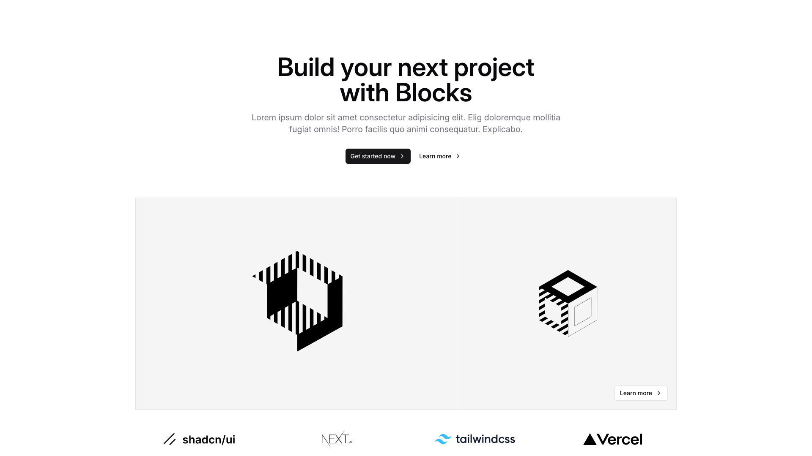

A centered hero section displays a main heading, descriptive body text, and two horizontally-aligned buttons. Below this, a wide banner is divided into two equal columns, each containing an image. At the bottom of the section, a row of four logos is centered horizontally.

**Install**: `pnpm dlx shadcn add @shadcnblocks/hero6`

---

## hero7

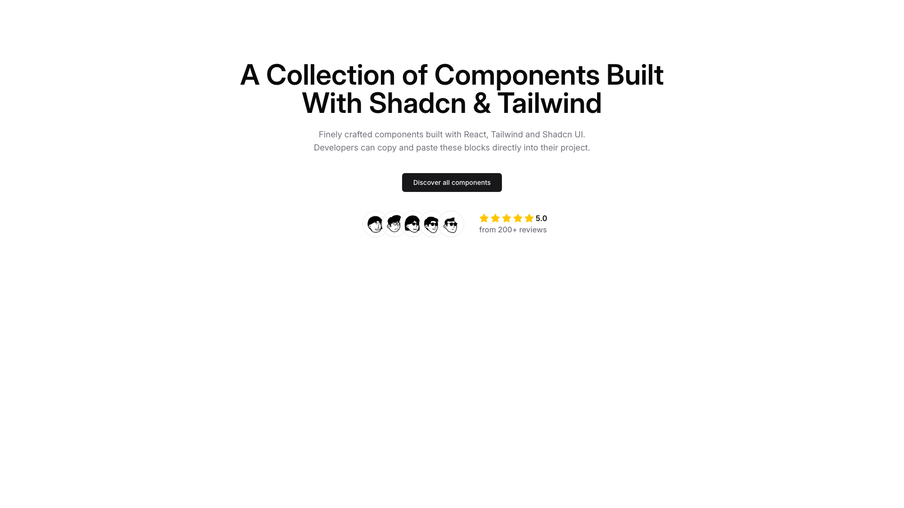

A centered hero section displays a main heading at the top, followed by body text and a call-to-action button stacked vertically. Below the button, a row of small profile images is positioned horizontally alongside a rating label and review count text.

**Install**: `pnpm dlx shadcn add @shadcnblocks/hero7`

---

## hero8

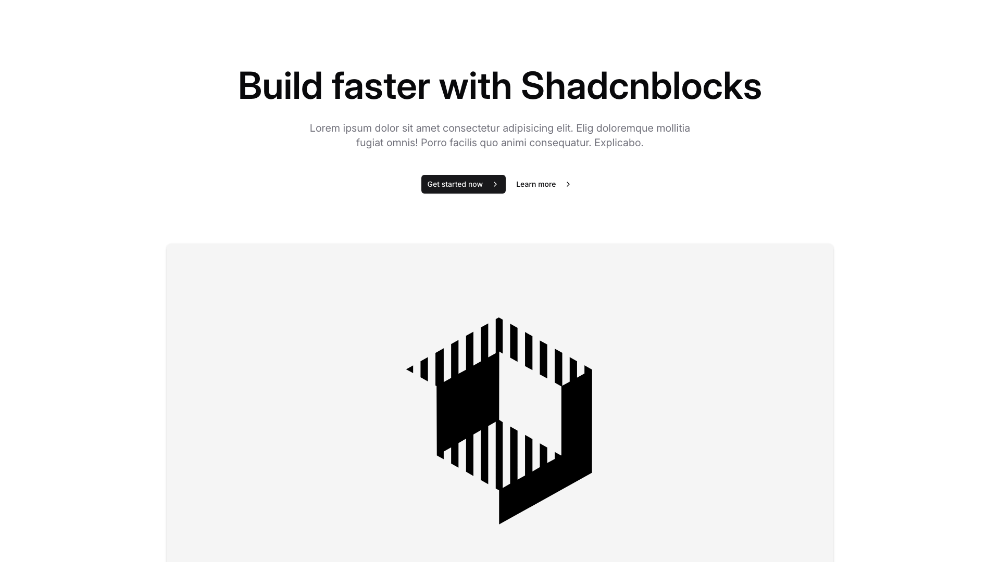

A centered vertical layout containing a main heading at the top, followed by body text, and two horizontally-aligned buttons below. A large image is positioned beneath, centered within a light gray background container.

**Install**: `pnpm dlx shadcn add @shadcnblocks/hero8`

---

## hero9

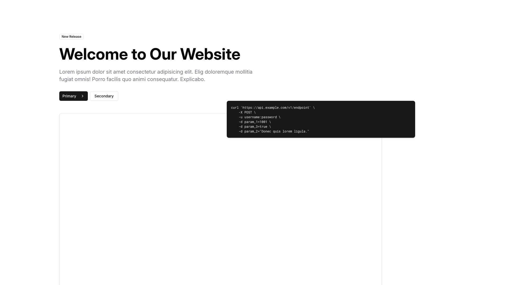

A webpage section displays content in two columns with left-aligned text and a right-aligned code block. The left column contains a label, a large heading, body text, and two horizontally-positioned buttons. The right column features a dark terminal-style code block positioned in the upper right area.

**Install**: `pnpm dlx shadcn add @shadcnblocks/hero9`

---

## hero10

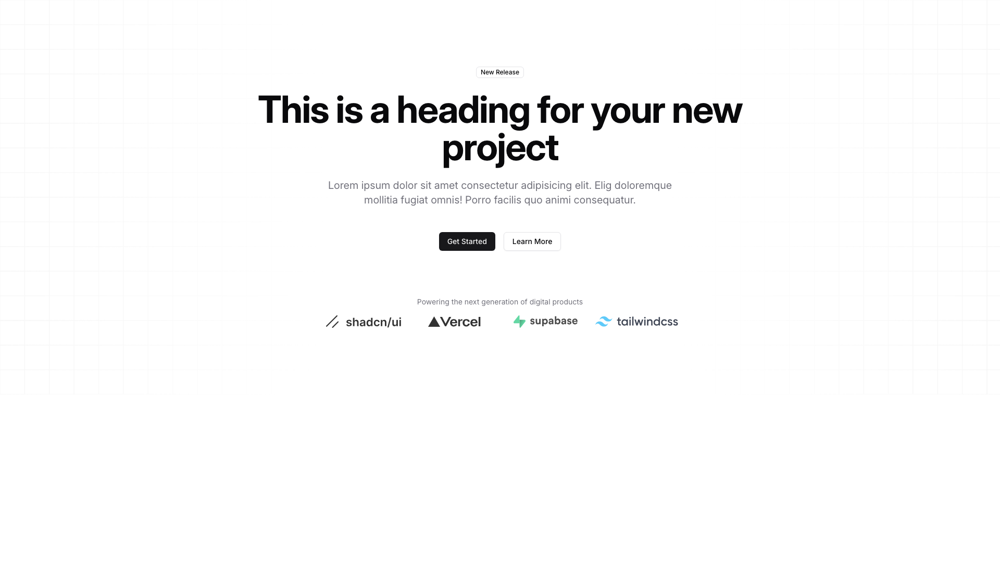

A centered hero section displays a label at the top, followed by a large heading and body text stacked vertically in the middle. Below the text are two buttons positioned horizontally. At the bottom, a caption with four logos arranged horizontally spans the width of the section.

**Install**: `pnpm dlx shadcn add @shadcnblocks/hero10`

---

## hero11

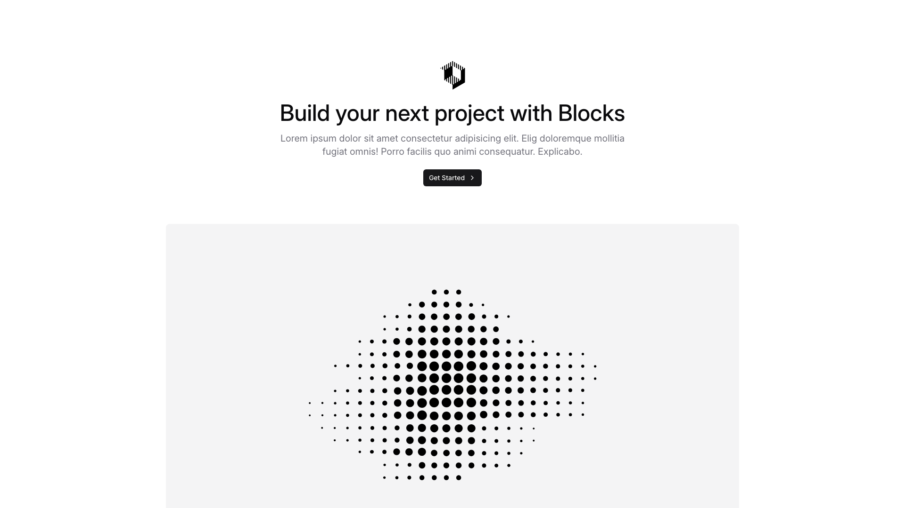

A centered layout with a small image icon at the top, followed by a main heading, body text, and a call-to-action button stacked vertically. Below this text section, a large decorative image occupies the full width at the bottom of the block.

**Install**: `pnpm dlx shadcn add @shadcnblocks/hero11`

---

## hero12

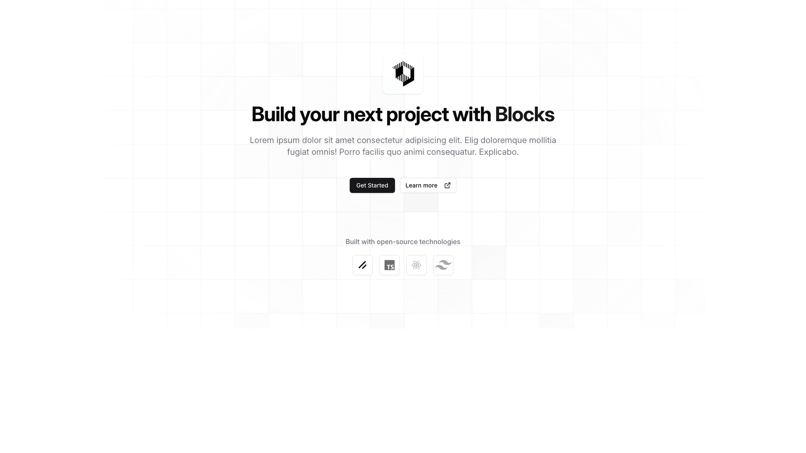

A centered section displays a small image at the top, followed by a main heading and body text. Below the text are two buttons positioned horizontally. Further down, a label appears above four small icons arranged in a horizontal row.

**Install**: `pnpm dlx shadcn add @shadcnblocks/hero12`

---

## hero13

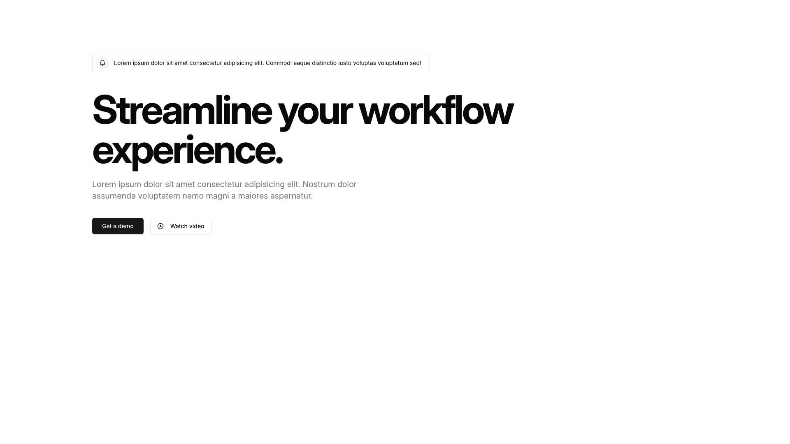

A webpage section displays a notification banner at the top, followed by a large heading and descriptive body text positioned on the left. Below the text, two action buttons are arranged horizontally. The layout uses a single-column structure with all content left-aligned.

**Install**: `pnpm dlx shadcn add @shadcnblocks/hero13`

---

## hero14

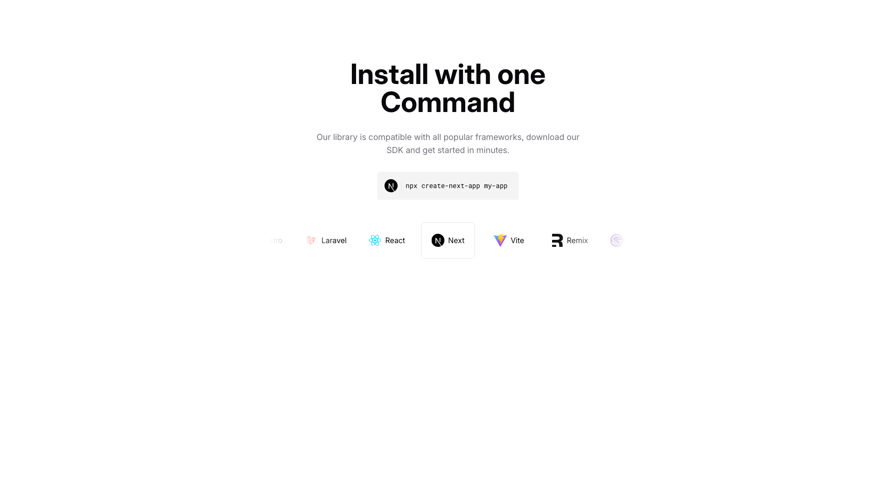

A centered section displays a main heading at the top, followed by body text describing SDK compatibility. Below this is a command code block with a label. Horizontally aligned beneath are multiple framework logos arranged in a row, with navigation arrows on either side.

**Install**: `pnpm dlx shadcn add @shadcnblocks/hero14`

---

## hero15

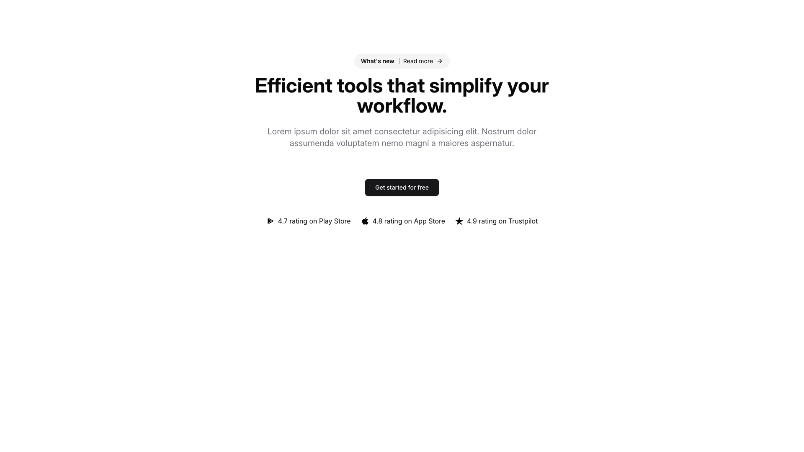

A centered webpage section contains vertically stacked content. At the top is a small label, followed by a large heading, body text, and a call-to-action button. Below these elements are three horizontally arranged rating badges displaying app store ratings and icons.

**Install**: `pnpm dlx shadcn add @shadcnblocks/hero15`

---

## hero16

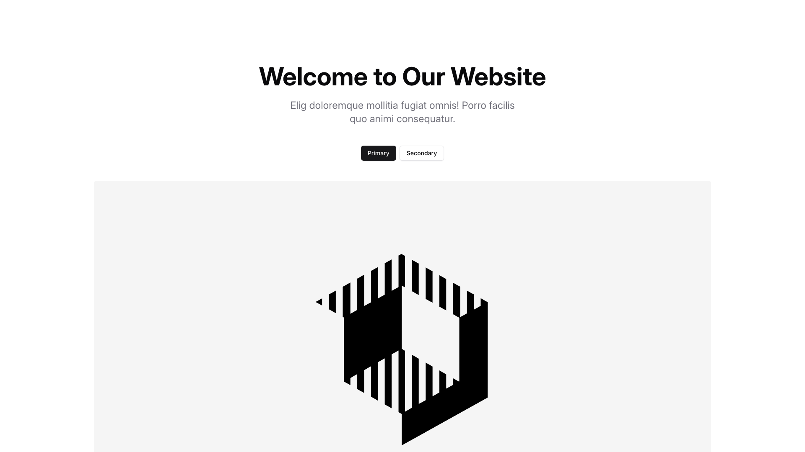

A centered webpage section displays a main heading at the top, followed by body text. Below the text are two horizontally-aligned buttons. The entire layout is vertically stacked and centered, with a large image positioned below the buttons against a light gray background.

**Install**: `pnpm dlx shadcn add @shadcnblocks/hero16`

---

## hero18

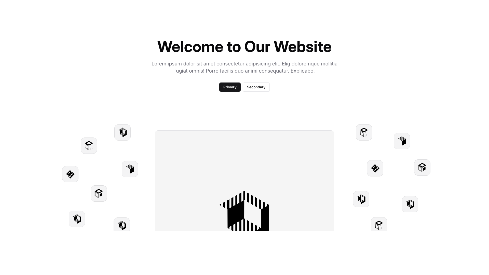

A centered hero section features a main heading at the top, followed by body text and two horizontally aligned buttons below. A large image is positioned centrally in the lower portion of the section, with small icon elements scattered around its left and right sides.

**Install**: `pnpm dlx shadcn add @shadcnblocks/hero18`

---

## hero20

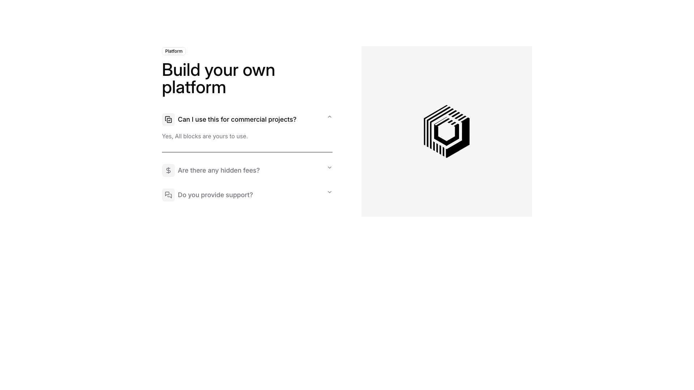

A two-column layout with text content on the left and an image on the right. The left column contains a small label at the top, followed by a large heading, and three expandable accordion items with labels and icons. The right column displays a centered image on a light gray background.

**Install**: `pnpm dlx shadcn add @shadcnblocks/hero20`

---

## hero21

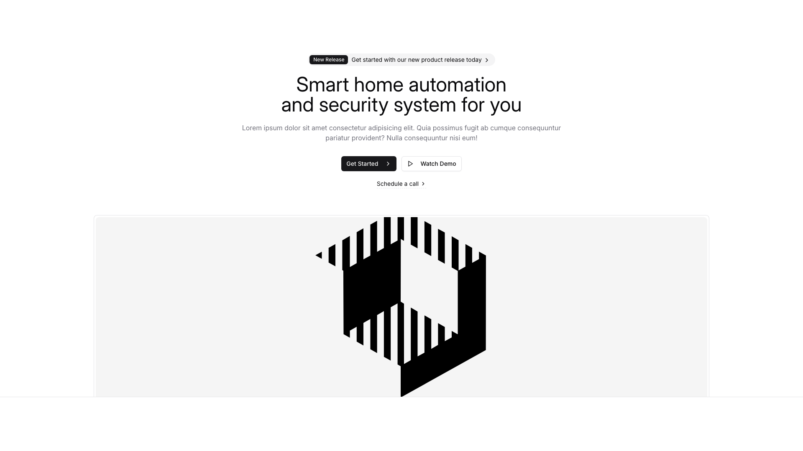

A centered hero section displays a label tag at the top, followed by a main heading and body text stacked vertically. Below the text are three horizontally aligned interactive elements: a primary button, a secondary button with an icon, and a text link. At the bottom, a large image is centered within a light gray container.

**Install**: `pnpm dlx shadcn add @shadcnblocks/hero21`

---

## hero24

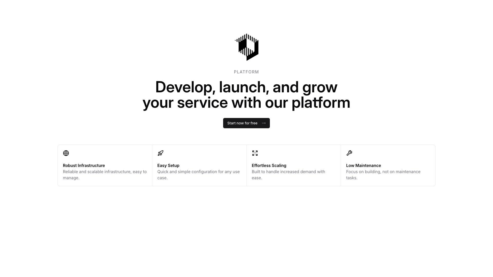

A centered hero section displays a small image at the top, followed by a large heading and body text. Below this is a call-to-action button. Underneath, four feature blocks are arranged horizontally, each containing an icon, a subheading, and descriptive body text.

**Install**: `pnpm dlx shadcn add @shadcnblocks/hero24`

---

## hero25

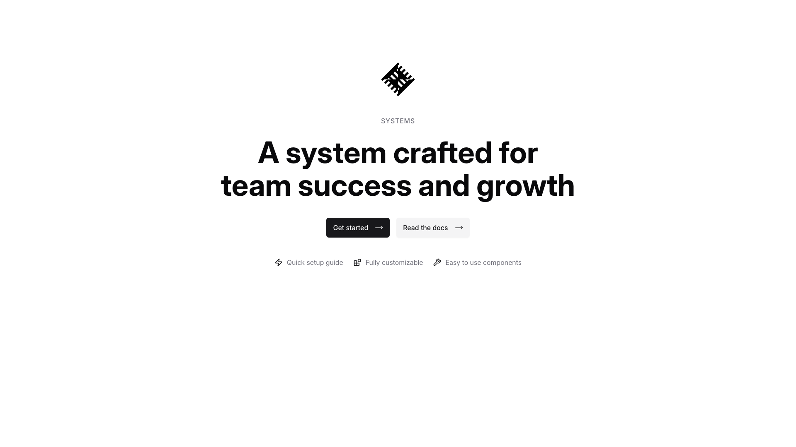

A centered vertical layout displays a small image at the top, followed by a label and a large heading. Below the heading are two horizontally aligned buttons, with three informational labels positioned underneath them.

**Install**: `pnpm dlx shadcn add @shadcnblocks/hero25`

---

## hero26

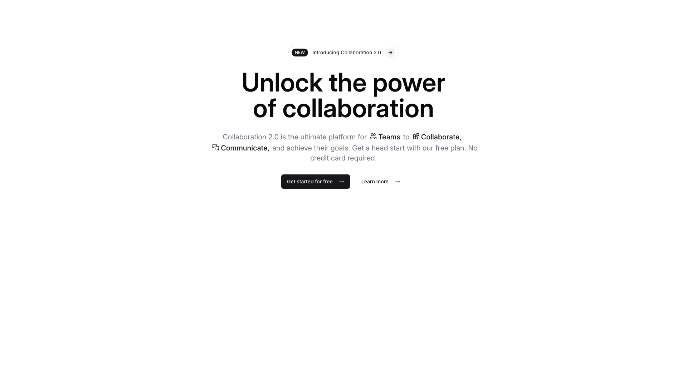

A centered layout displays a label at the top, followed by a large heading. Below the heading is body text with emphasized keywords, and at the bottom are two horizontally aligned buttons positioned side-by-side.

**Install**: `pnpm dlx shadcn add @shadcnblocks/hero26`

---

## hero27

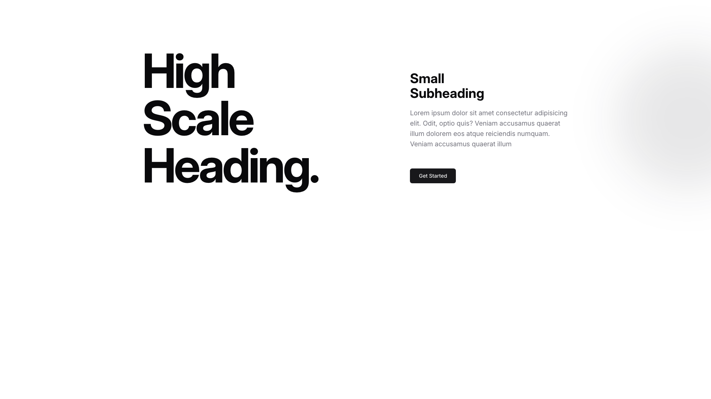

A webpage section displays content in two columns with a left-right layout. The left column features a large heading positioned vertically. The right column contains a smaller subheading, body text, and a button aligned below the text content.

**Install**: `pnpm dlx shadcn add @shadcnblocks/hero27`

---

## hero28

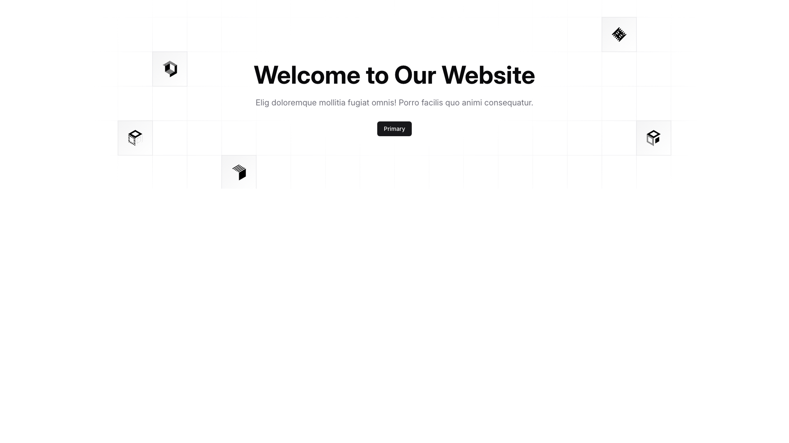

A centered webpage layout features a main heading "Welcome to Our Website" with body text positioned below it. Beneath the text sits a black button labeled "Primary" in the center. Decorative images are arranged around the margins—positioned on the left, right, and top corners of the page.

**Install**: `pnpm dlx shadcn add @shadcnblocks/hero28`

---

## hero29

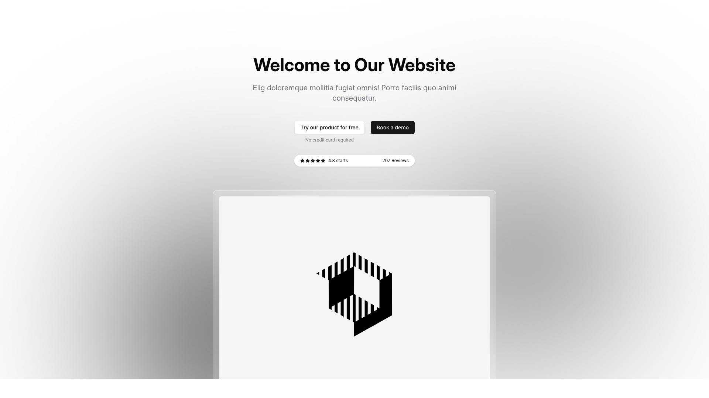

A centered webpage section displays a main heading at the top, followed by body text and two horizontally-aligned buttons. Below this, a rating display with stars and review count is centered. Further down, a large image is positioned centrally within a bordered container that spans most of the width.

**Install**: `pnpm dlx shadcn add @shadcnblocks/hero29`

---

## hero30

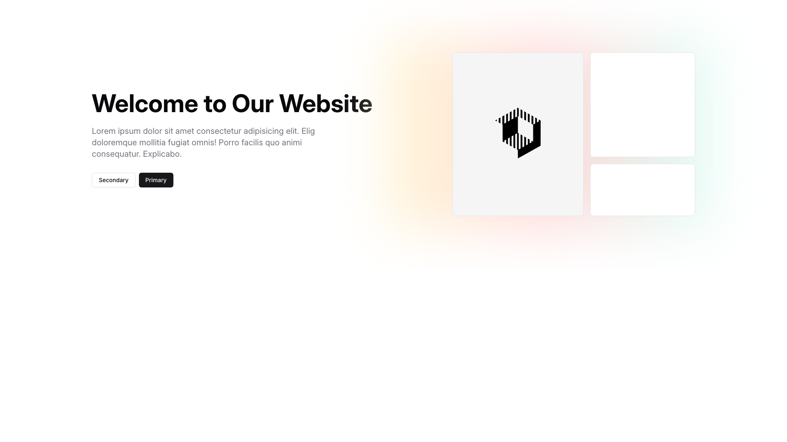

A webpage section displays a two-column layout. The left column contains a main heading, body text, and two buttons positioned horizontally below the text. The right column features a large image centered vertically, with two additional smaller rectangular sections stacked below it.

**Install**: `pnpm dlx shadcn add @shadcnblocks/hero30`

---

## hero31

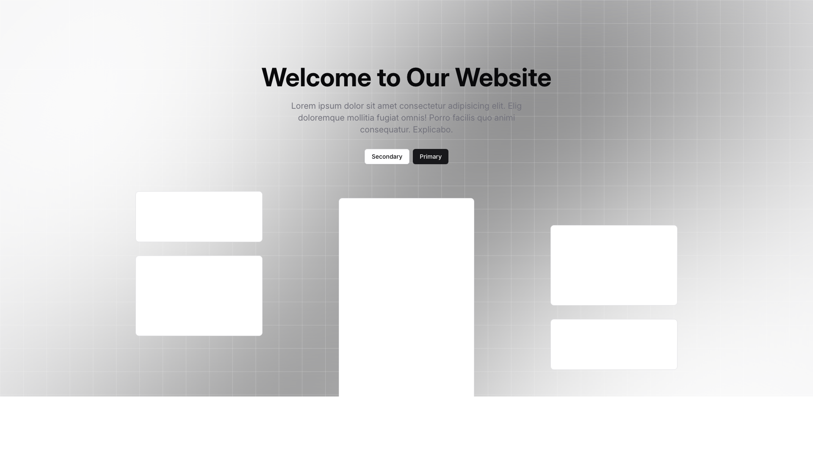

A centered hero section contains a heading, body text, and two buttons stacked horizontally. Below this are three columns of white placeholder boxes arranged across the layout—two stacked boxes on the left, one larger box in the center, and two stacked boxes on the right.

**Install**: `pnpm dlx shadcn add @shadcnblocks/hero31`

---

## hero32

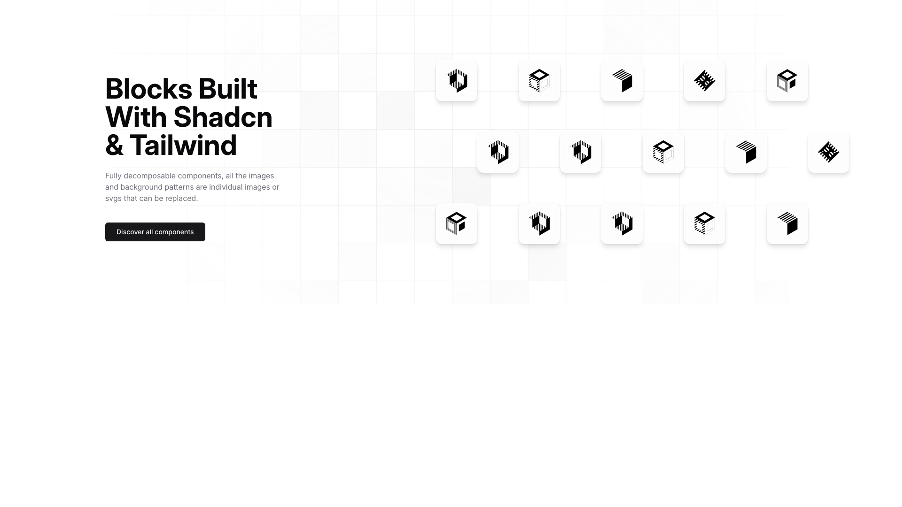

A webpage section is divided into two columns. The left column contains a large heading, body text, and a button stacked vertically. The right column displays a grid of 15 small images arranged in 3 rows and 5 columns, each contained within individual cards.

**Install**: `pnpm dlx shadcn add @shadcnblocks/hero32`

---

## hero33

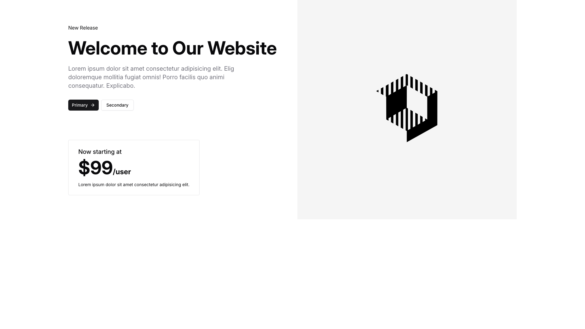

A webpage layout is divided into two columns. The left column contains a label, a large heading, body text, and two horizontally aligned buttons below. Further down on the left is a bordered box with a smaller heading, pricing information, and descriptive text. The right column features a large image centered vertically.

**Install**: `pnpm dlx shadcn add @shadcnblocks/hero33`

---

## hero34

A hero section is organized in two columns with left-aligned content and a right-aligned image. The left column contains a label, a large heading, body text, and two buttons positioned horizontally. On the right side, a geometric image is vertically centered and spans the right portion of the layout.

**Install**: `pnpm dlx shadcn add @shadcnblocks/hero34`

---

## hero35

A webpage section is divided into two columns with a left-aligned layout. The left column contains a small label, a large heading, body text, and two horizontally-aligned buttons. The right column features a large image placeholder with geometric shapes.

**Install**: `pnpm dlx shadcn add @shadcnblocks/hero35`

---

## hero36

A centered page section features a label at the top, followed by a large heading and body text. Below this introductory content, three equal-width cards are arranged horizontally, each containing an image, a title, body text, and a "See more" link aligned at the bottom.

**Install**: `pnpm dlx shadcn add @shadcnblocks/hero36`

---

## hero37

A centered webpage section displays a small label at the top, followed by a large heading, body text, and two horizontally-aligned buttons below. Further down the page, three placeholder images are arranged in a fan-like formation, with a larger central image flanked by two smaller angled images on either side.

**Install**: `pnpm dlx shadcn add @shadcnblocks/hero37`

---

## hero38

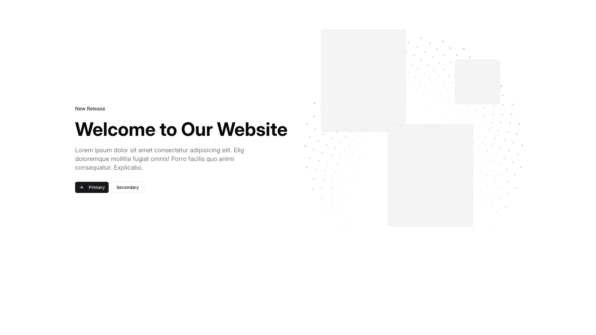

A webpage section displays content in two columns with a left-aligned layout. The left column contains a small label, a large heading, body text, and two horizontally-positioned buttons. The right column features a decorative background with abstract image placeholders of varying sizes arranged vertically.

**Install**: `pnpm dlx shadcn add @shadcnblocks/hero38`

---

## hero39

A hero section with a two-column layout displays text content on the left and images on the right. The left column contains a small label at the top, followed by a large heading, body text, and a button positioned below. The right side features multiple stacked images of varying sizes arranged vertically.

**Install**: `pnpm dlx shadcn add @shadcnblocks/hero39`

---

## hero40

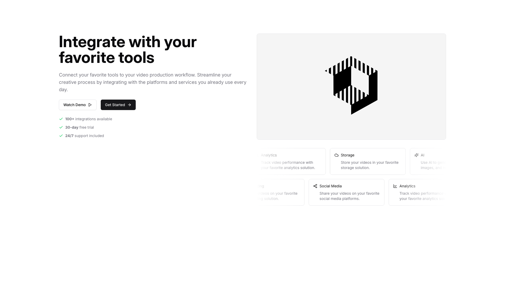

A two-column layout with the left column containing a main heading, body text, two buttons positioned horizontally, and three checkmark labels stacked vertically. The right column features a large centered image, with four smaller cards arranged in a grid below displaying labels and descriptive text.

**Install**: `pnpm dlx shadcn add @shadcnblocks/hero40`

---

## hero45

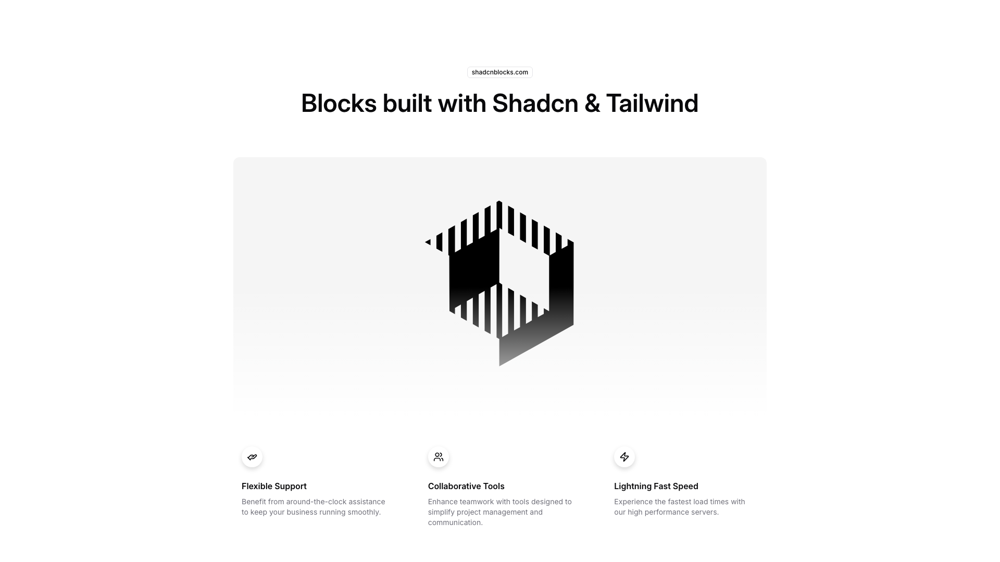

A centered webpage section features a main heading at the top, followed by a large image positioned centrally. Below the image, three columns are arranged horizontally, each containing a label, a smaller heading, and body text describing individual features.

**Install**: `pnpm dlx shadcn add @shadcnblocks/hero45`

---

## hero47

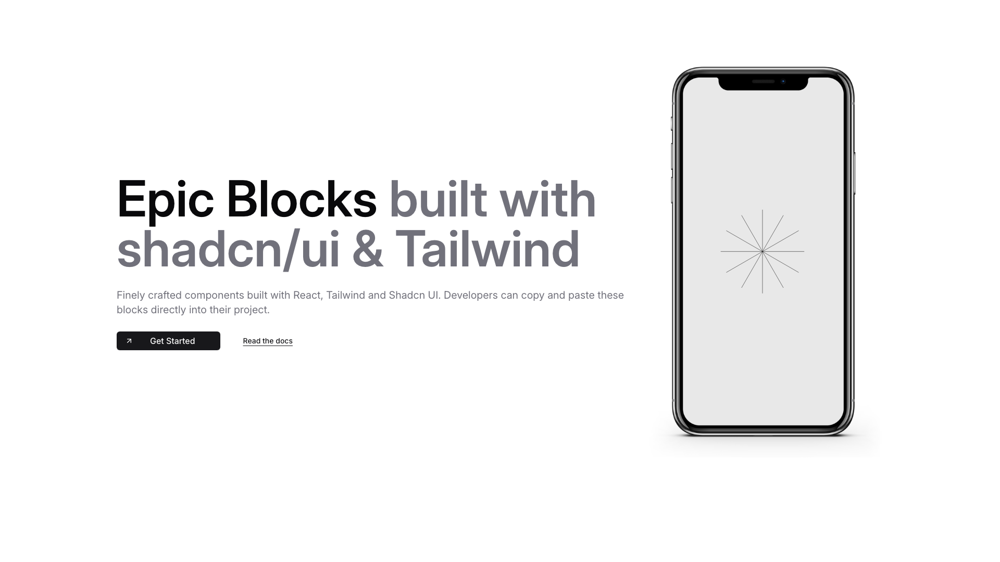

A landing page section is divided into two columns. The left column contains a prominent heading, descriptive body text, and two action buttons positioned horizontally below. The right column features a large image of a mobile device, centered vertically and aligned to the right side of the layout.

**Install**: `pnpm dlx shadcn add @shadcnblocks/hero47`

---

## hero49

A centered layout displays a main heading at the top, followed by body text describing a financial service. Below the text is a dark button labeled "Get started now." An image of a smartphone being held is positioned at the bottom of the layout, vertically aligned with the content above.

**Install**: `pnpm dlx shadcn add @shadcnblocks/hero49`

---

## hero50

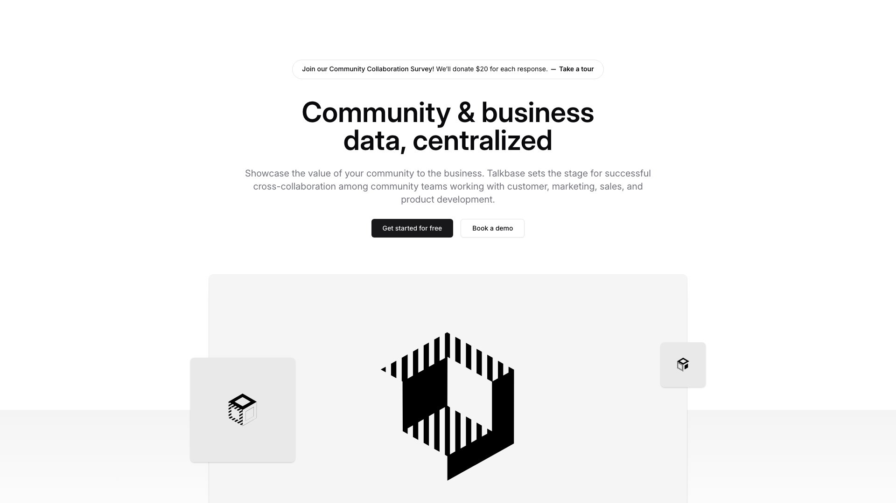

A centered webpage section contains a heading, body text, and two horizontally aligned buttons stacked above a large image positioned centrally. Below the main content, three smaller images are arranged horizontally across the width of the section, with the central image larger than those on either side.

**Install**: `pnpm dlx shadcn add @shadcnblocks/hero50`

---

## hero51

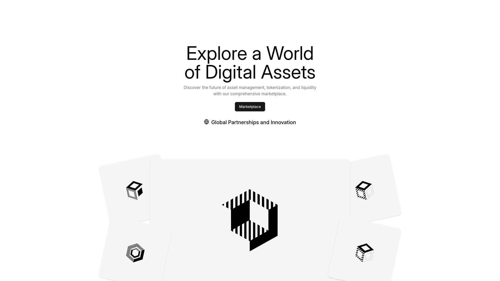

A centered hero section displays a main heading at the top, followed by body text and a button. Below this text content, a label appears horizontally centered. The lower portion features a large central image surrounded by four smaller images positioned at the corners in a radial layout.

**Install**: `pnpm dlx shadcn add @shadcnblocks/hero51`

---

## hero53

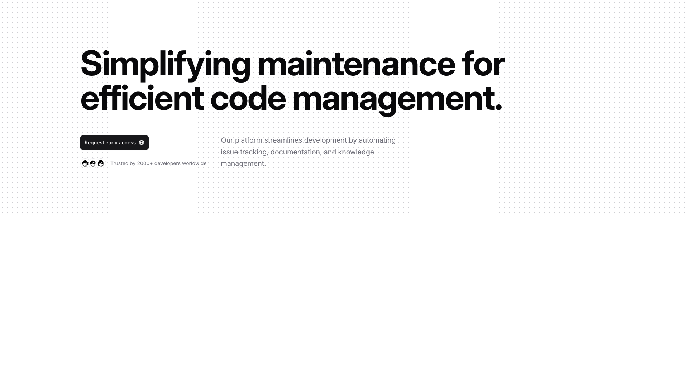

A hero section contains a large heading positioned on the left, followed by body text on the right. Below the heading are a button, small avatar images, and a label. The layout uses a two-column structure with text elements on the left and descriptive content aligned to the right.

**Install**: `pnpm dlx shadcn add @shadcnblocks/hero53`

---

## hero55

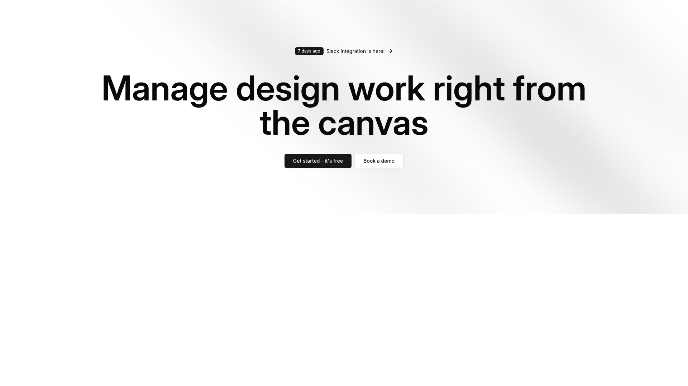

A centered hero section contains a small label at the top, followed by a large heading horizontally centered on the page. Below the heading, two buttons are positioned side-by-side in the center of the layout.

**Install**: `pnpm dlx shadcn add @shadcnblocks/hero55`

---

## hero57

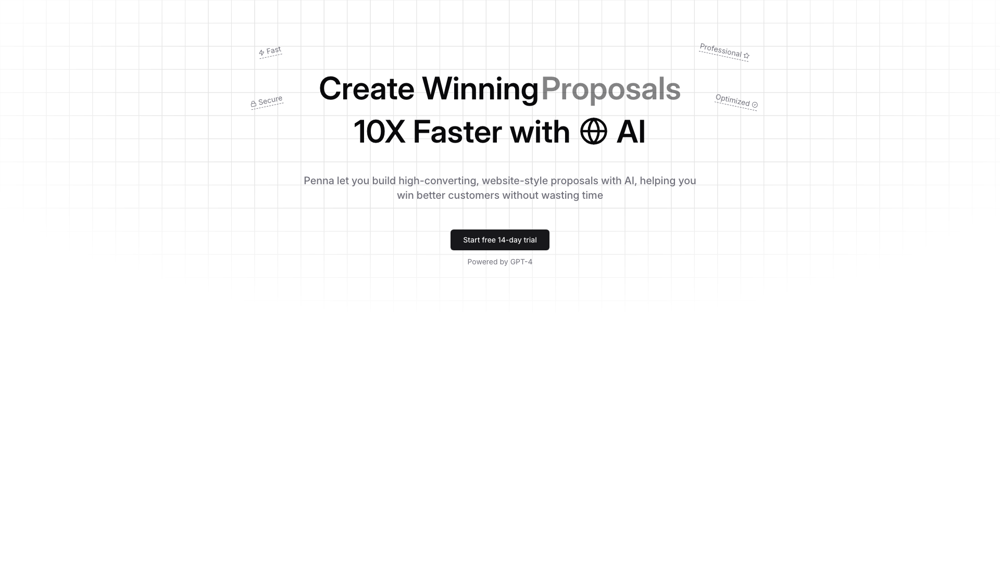

A centered webpage section displays a main heading with accompanying body text, followed by a call-to-action button positioned below. Several small labels are scattered around the upper portion of the layout. At the bottom, a secondary text label appears centered beneath the button.

**Install**: `pnpm dlx shadcn add @shadcnblocks/hero57`

---

## hero58

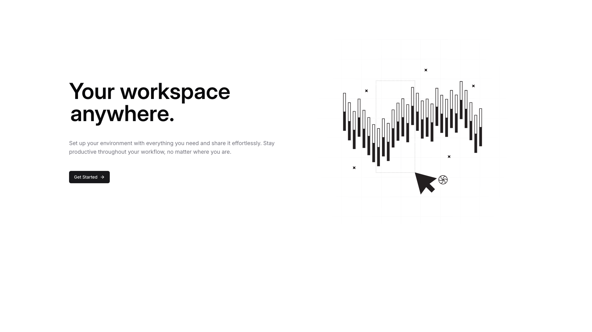

A hero section layout with two columns: the left side contains a large heading, body text, and a call-to-action button stacked vertically. The right side features an image positioned at the top, with a cursor icon and circular element positioned below it.

**Install**: `pnpm dlx shadcn add @shadcnblocks/hero58`

---

## hero60

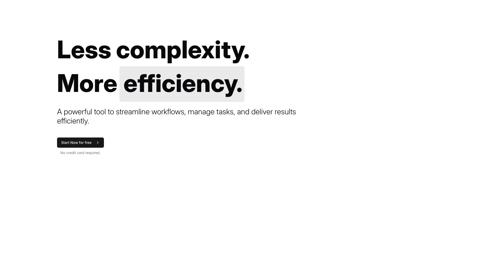

A left-aligned vertical layout contains a large heading at the top, followed by body text. Below the text sits a dark button with a label and a smaller caption. The right side of the heading features a light gray highlight box.

**Install**: `pnpm dlx shadcn add @shadcnblocks/hero60`

---

## hero64

A two-column layout with text content on the left and visual elements on the right. The left column contains a main heading, body text, and a button stacked vertically. The right column displays overlapping card-style elements featuring images, star ratings, user avatars, and labels, arranged in a layered composition.

**Install**: `pnpm dlx shadcn add @shadcnblocks/hero64`

---

## hero67

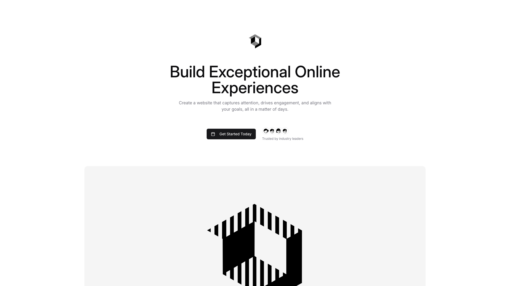

A centered webpage section displays a main heading at the top, followed by body text positioned underneath. Below the text, a "Get Started Today" button is aligned to the left, with a label and user avatars positioned to its right. At the bottom of the section, a large image is centered.

**Install**: `pnpm dlx shadcn add @shadcnblocks/hero67`

---

## hero68

A centered hero section displays a label at the top, followed by a large heading, body text, and two horizontally-aligned buttons below. Beneath this, three feature items are arranged horizontally, each containing an icon on the left with accompanying text to the right.

**Install**: `pnpm dlx shadcn add @shadcnblocks/hero68`

---

## hero71

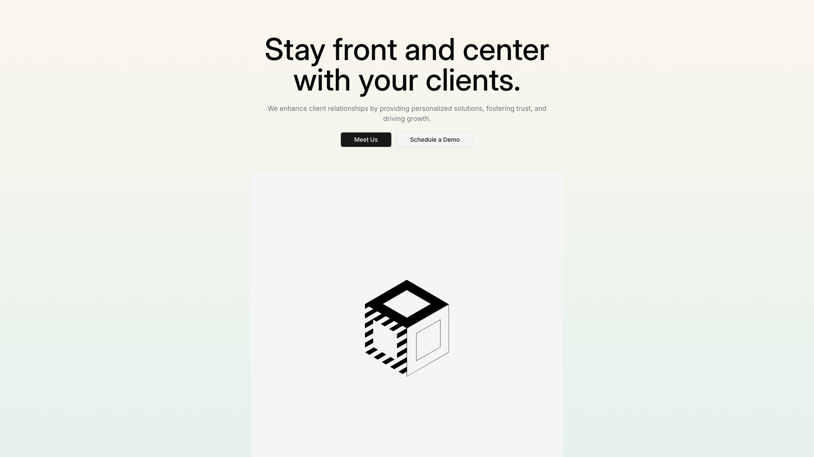

A centered hero section displays a main heading at the top, followed by body text and two buttons arranged horizontally below. Further down the page, an image is positioned centrally at the bottom of the block.

**Install**: `pnpm dlx shadcn add @shadcnblocks/hero71`

---

## hero74

A centered hero section contains a main heading, subheading text, and an email input field with a button horizontally aligned. Below this, six feature icons with labels are arranged in a horizontal row. Further down, a large image is positioned on the left, with two smaller images flanking a central icon on the right side of the layout.

**Install**: `pnpm dlx shadcn add @shadcnblocks/hero74`

---

## hero75

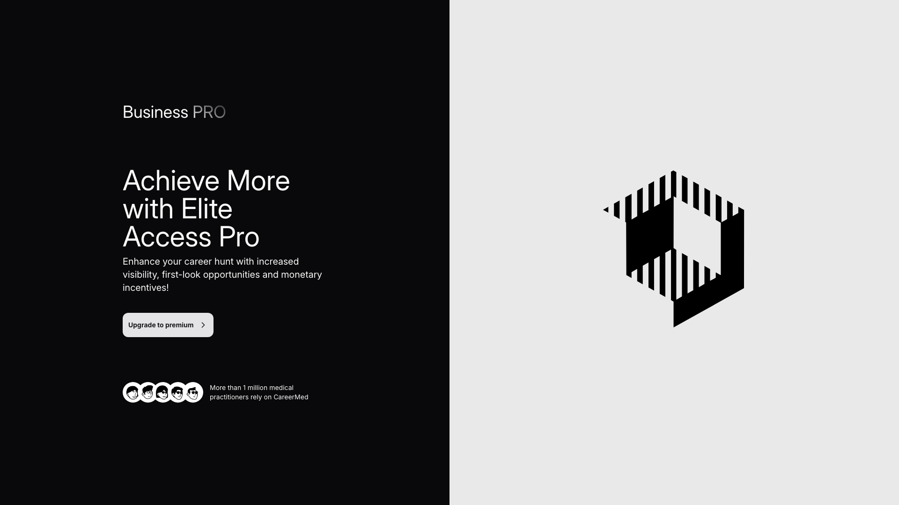

A two-column layout divides the screen horizontally. The left column features a small label at the top, followed by a large heading, body text, a button, and user avatars with accompanying text at the bottom. The right column displays a centered image on a light background.

**Install**: `pnpm dlx shadcn add @shadcnblocks/hero75`

---

## hero76

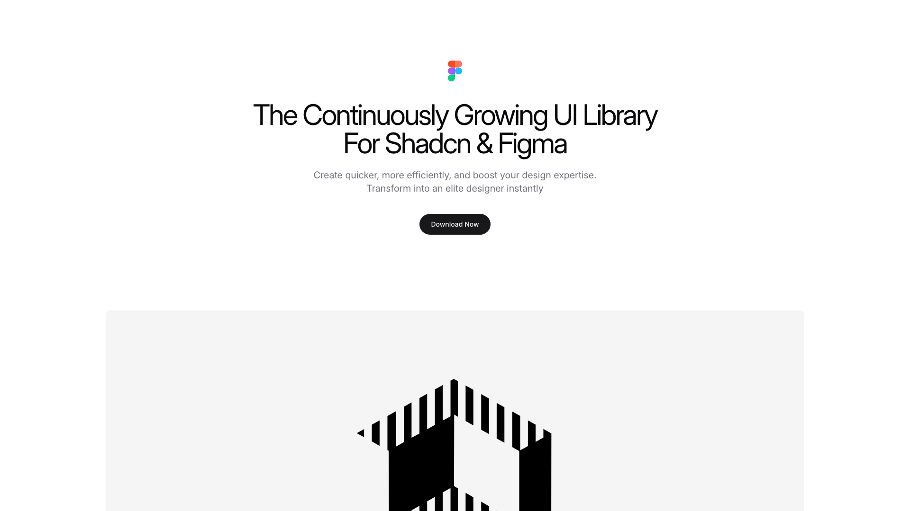

A centered webpage header displays a small logo icon at the top, followed by a large heading and descriptive body text stacked vertically. Below the text sits a dark button centered on the page. Further down, a large image spans the full width of the section.

**Install**: `pnpm dlx shadcn add @shadcnblocks/hero76`

---

## hero78

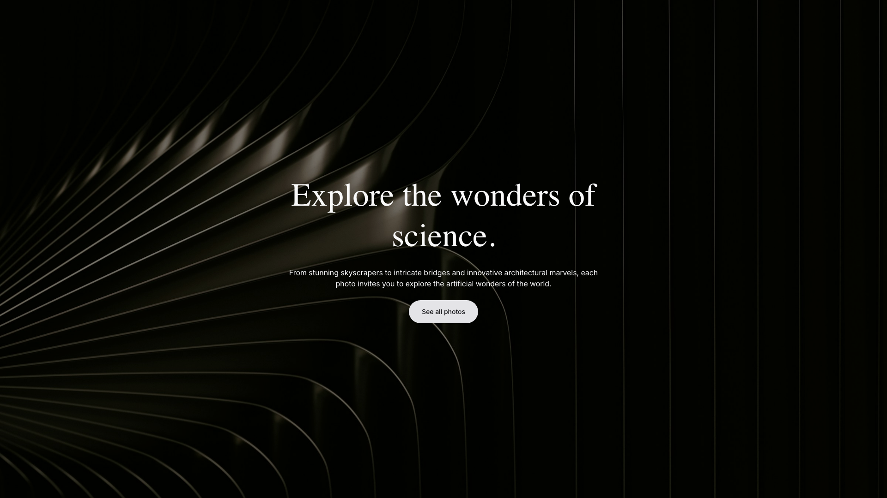

A centered hero section features a large heading at the top, followed by body text positioned below it. An image spans the left side of the layout with a vertical striped pattern. A white button is horizontally centered beneath the text content.

**Install**: `pnpm dlx shadcn add @shadcnblocks/hero78`

---

## hero80

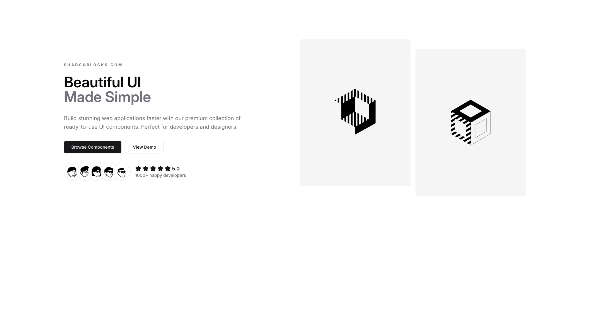

A webpage section is divided into two main areas. On the left, a heading and subheading are stacked vertically, followed by body text and two horizontally-aligned buttons below. Further down on the left are user avatars and a rating label with stars. On the right side, two large images are positioned vertically in separate containers.

**Install**: `pnpm dlx shadcn add @shadcnblocks/hero80`

---

## hero83

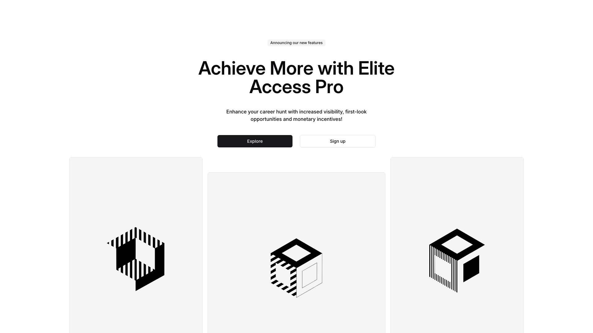

A centered layout contains a small label at the top, followed by a large heading and body text. Below the text are two horizontally aligned buttons. At the bottom, three images are displayed in a row, each within its own column.

**Install**: `pnpm dlx shadcn add @shadcnblocks/hero83`

---

## hero84

A centered section features a label tag at the top, followed by a large heading and descriptive body text stacked vertically in the middle. Below the text, five images are arranged horizontally across a light background panel that extends wider than the content above.

**Install**: `pnpm dlx shadcn add @shadcnblocks/hero84`

---

## hero85

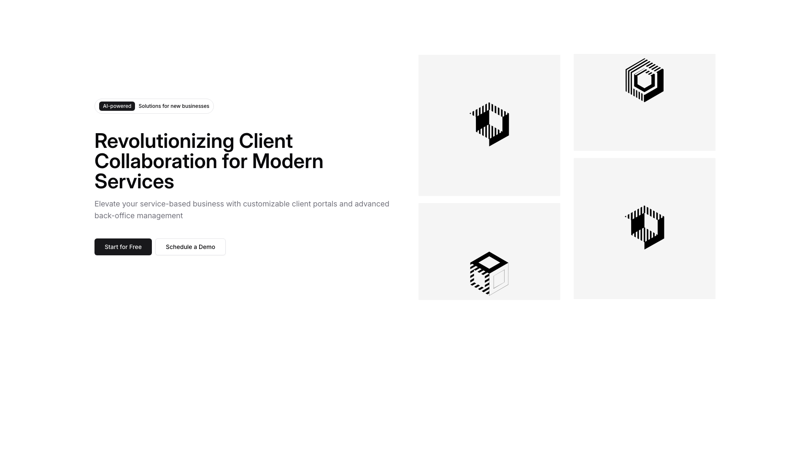

A webpage section is divided into two columns. The left column contains a label tag, a large heading, body text, and two buttons stacked horizontally. The right column displays a grid of four images arranged in a 2x2 layout on a light gray background.

**Install**: `pnpm dlx shadcn add @shadcnblocks/hero85`

---

## hero87

A webpage section is divided into two columns. The left column contains a large heading, body text, and a call-to-action button positioned vertically. On the right side, a large image is displayed, creating a balanced two-column layout with text on the left and visual content on the right.

**Install**: `pnpm dlx shadcn add @shadcnblocks/hero87`

---

## hero89

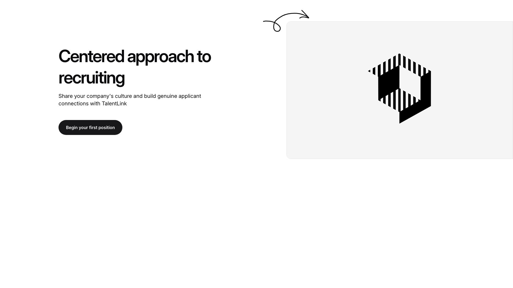

A two-column layout with text content on the left and an image on the right. The left column contains a large heading, body text, and a button positioned below. The right column displays a large image centered vertically and horizontally within its space.

**Install**: `pnpm dlx shadcn add @shadcnblocks/hero89`

---

## hero90

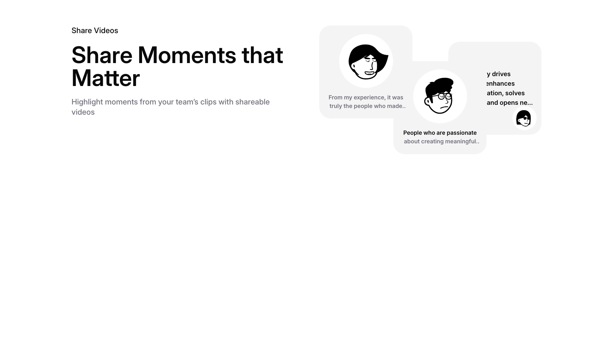

A webpage section displays content in two columns. On the left, a label, large heading, and body text are stacked vertically. On the right, three circular images are positioned vertically with accompanying text snippets and cards, creating a staggered layout that extends downward.

**Install**: `pnpm dlx shadcn add @shadcnblocks/hero90`

---

## hero99

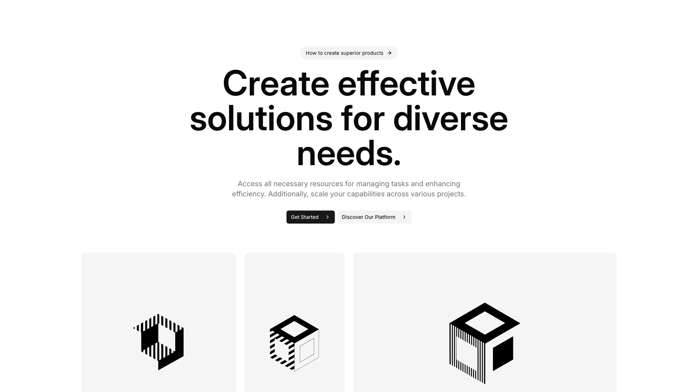

A centered hero section contains a small label at the top, followed by a large heading and body text stacked vertically in the center. Below the text are two horizontally aligned buttons. Underneath, three images are displayed side-by-side in a row.

**Install**: `pnpm dlx shadcn add @shadcnblocks/hero99`

---

## hero100

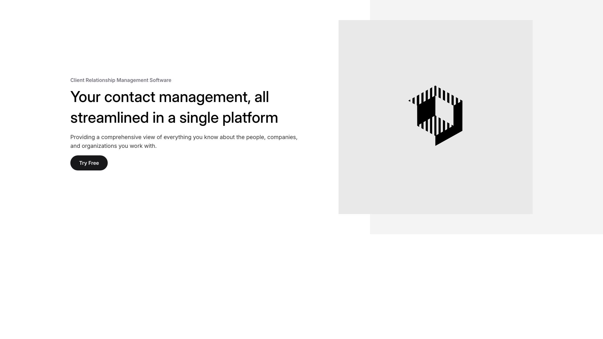

A webpage section displays content in two columns with a left-aligned layout. The left column contains a label, a large heading, body text, and a button stacked vertically. The right column features a large image positioned on a light gray background, creating a balanced horizontal composition.

**Install**: `pnpm dlx shadcn add @shadcnblocks/hero100`

---

## hero101

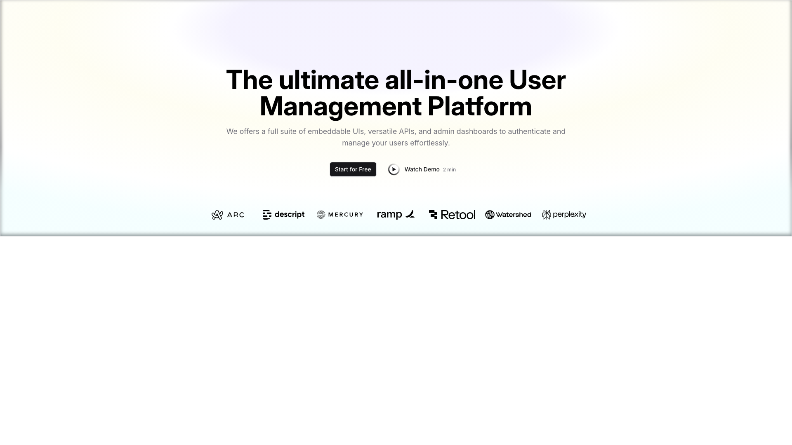

A centered webpage section displays a main heading at the top, followed by body text positioned directly below. Two buttons are horizontally aligned beneath the text. At the bottom of the section, a row of company logos is centered and evenly spaced.

**Install**: `pnpm dlx shadcn add @shadcnblocks/hero101`

---

## hero103

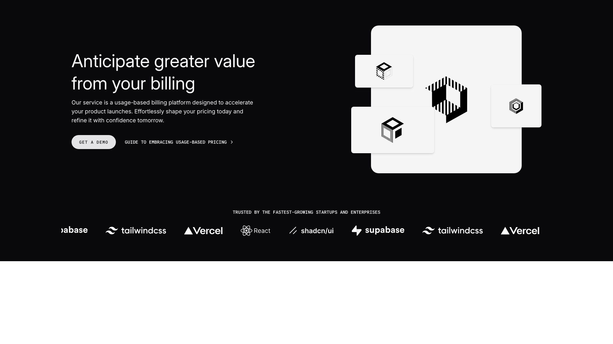

A webpage section displays content in two columns with a dark background on the left and light background on the right. The left column contains a large heading, body text, and two action buttons stacked horizontally. The right column features multiple geometric images arranged in an overlapping, asymmetrical layout across white cards.

**Install**: `pnpm dlx shadcn add @shadcnblocks/hero103`

---

## hero104

A layout with two main sections positioned horizontally. On the left side, a large heading is followed by body text and two buttons arranged side-by-side, with supporting text underneath. On the right side, a vertical stack of interface mockup images is displayed, showcasing various UI elements and data visualizations.

**Install**: `pnpm dlx shadcn add @shadcnblocks/hero104`

---

## hero107

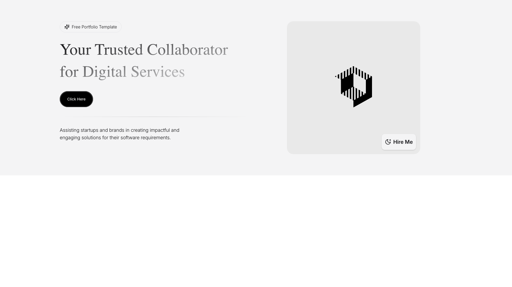

A webpage section displays content in two columns with a light background. The left column contains a small label at the top, a large heading, a black button, and body text below. The right column features a centered image with a "Hire Me" button positioned in the bottom right corner of that section.

**Install**: `pnpm dlx shadcn add @shadcnblocks/hero107`

---

## hero108

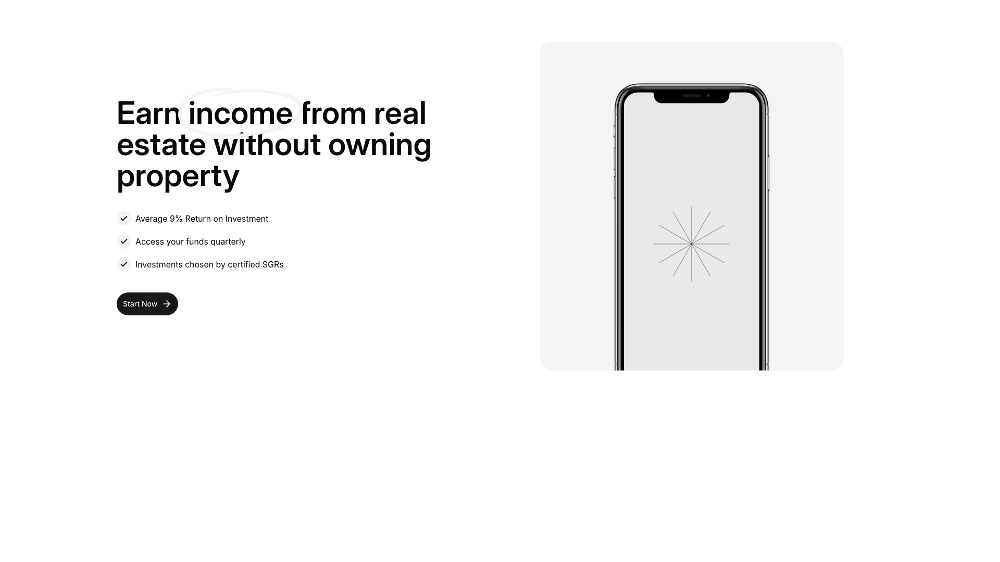

A two-column layout with text content positioned on the left and a mobile device image on the right. The left column contains a main heading, followed by three bullet points with checkmarks, and a call-to-action button below. The right column displays a smartphone mockup centered within a light gray background area.

**Install**: `pnpm dlx shadcn add @shadcnblocks/hero108`

---

## hero111

A centered webpage section displays a main heading and body text at the top, followed by an email input field and a call-to-action button positioned horizontally. Below this, two informational labels are aligned horizontally. At the bottom, three cards are arranged in a horizontal row, each containing an image. A footer line of text is centered at the very bottom.

**Install**: `pnpm dlx shadcn add @shadcnblocks/hero111`

---

## hero112

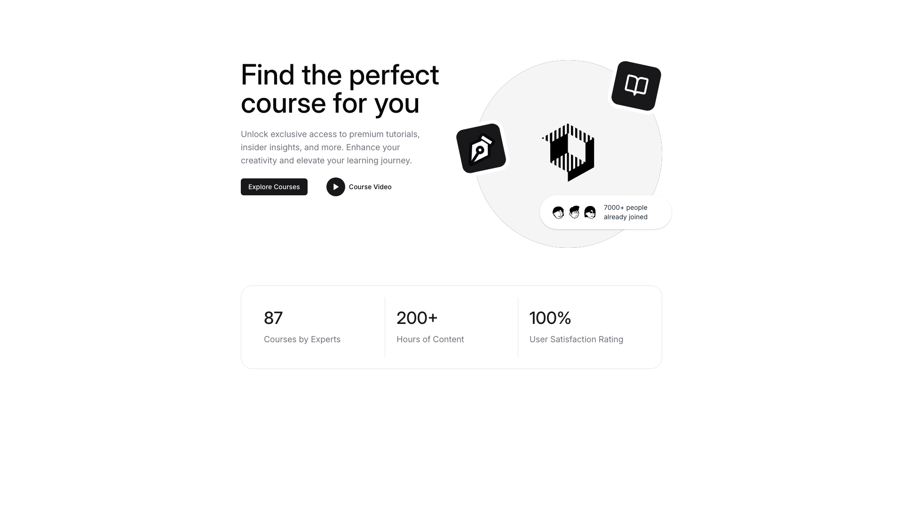

A webpage section features a two-column layout. The left column contains a main heading, body text, and two buttons positioned horizontally. The right column displays an image with accompanying icons and a user count label. Below both columns, three metric cards are arranged horizontally, each containing a number, a label, and a subtitle.

**Install**: `pnpm dlx shadcn add @shadcnblocks/hero112`

---

## hero115

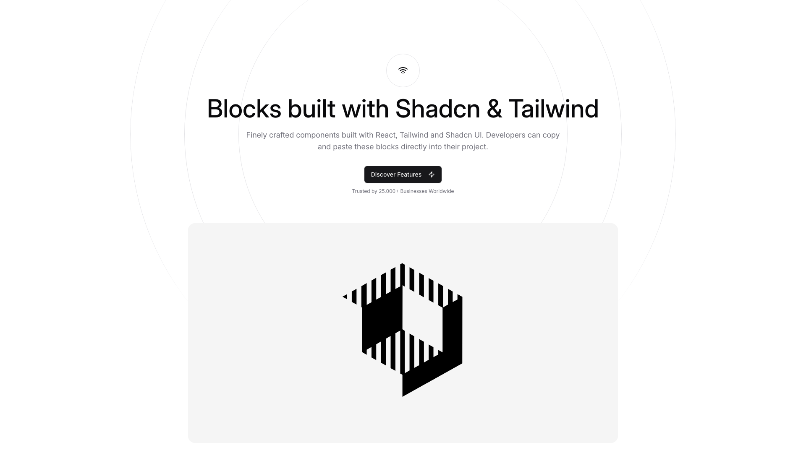

A centered vertical layout displays a heading at the top, followed by body text, and a button positioned below. A label appears underneath the button. Below this section, a large image is centered on the page.

**Install**: `pnpm dlx shadcn add @shadcnblocks/hero115`

---

## hero116

A centered hero section with a main heading at the top, followed by body text and two horizontally aligned buttons below. Underneath the buttons, a grid layout displays four images arranged in two rows and two columns, with each image contained in its own light-colored box.

**Install**: `pnpm dlx shadcn add @shadcnblocks/hero116`

---

## hero123

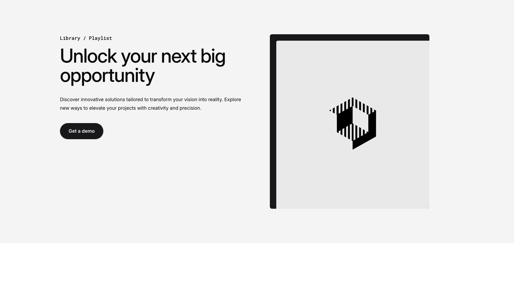

A webpage section displays content in two columns with a left-aligned layout. The left column contains a label, a large heading, body text, and a button stacked vertically. On the right side, a tall rectangular frame contains a centered image.

**Install**: `pnpm dlx shadcn add @shadcnblocks/hero123`

---

## hero125

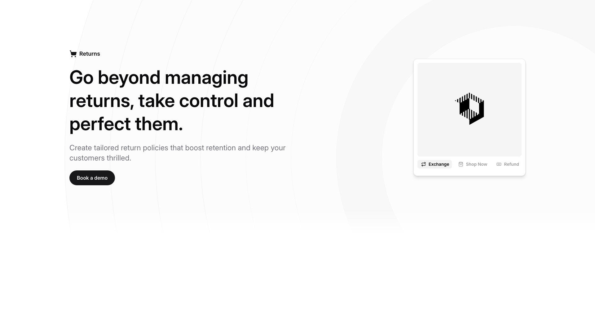

A webpage section uses a two-column layout with text content on the left and an image on the right. The left column contains a small tag at the top, followed by a large heading, body text, and a button stacked vertically. On the right side, an image is displayed within a card container that includes three labels horizontally aligned at the bottom.

**Install**: `pnpm dlx shadcn add @shadcnblocks/hero125`

---

## hero127

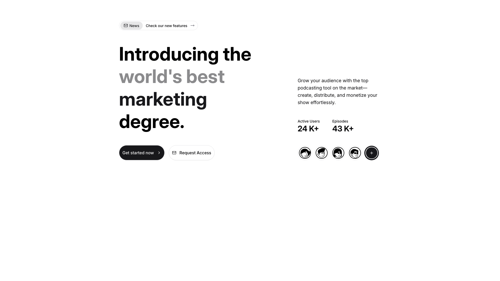

A centered section features a large heading split across multiple lines on the left, with body text and two buttons positioned below it. On the right side, descriptive text is followed by statistics and a row of circular images arranged horizontally.

**Install**: `pnpm dlx shadcn add @shadcnblocks/hero127`

---

## hero129

A hero section displays content in two columns. The left column contains a large heading, body text, and two action buttons stacked horizontally, followed by user avatars and a trust statement. The right column features a large image positioned vertically, with two smaller graphic elements overlaid in the center-right area.

**Install**: `pnpm dlx shadcn add @shadcnblocks/hero129`

---

## hero134

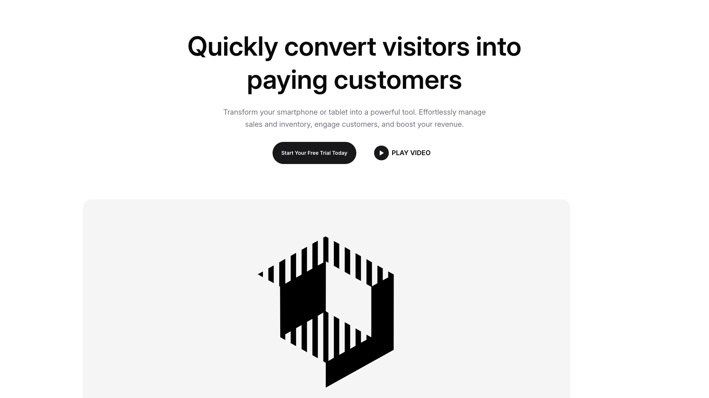

A centered layout displays a main heading at the top, followed by body text and two horizontally aligned buttons below. Further down the page, a large image is positioned centrally on a light gray background.

**Install**: `pnpm dlx shadcn add @shadcnblocks/hero134`

---

## hero135

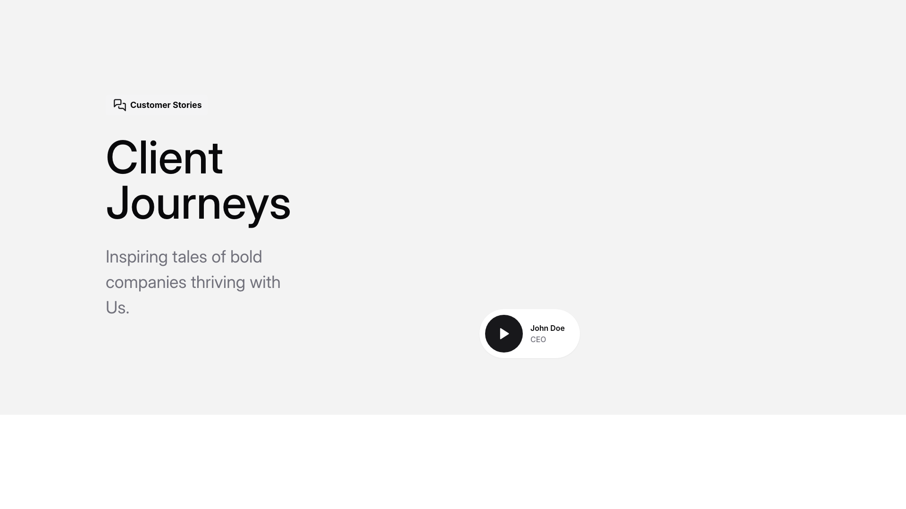

A webpage section displays content in two columns with a light background. The left column contains a small label at the top, followed by a large heading, and body text positioned vertically below. On the right side, a circular image with a play button is centered, accompanied by a name label and title positioned horizontally adjacent to it.

**Install**: `pnpm dlx shadcn add @shadcnblocks/hero135`

---

## hero136

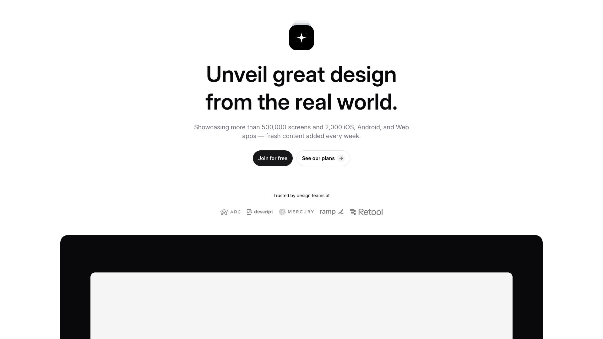

A centered hero section features a small icon at the top, followed by a large heading and body text stacked vertically. Below the text are two horizontally aligned buttons side by side. Further down, a label with accompanying logos is centered, and a large image fills the bottom portion of the block.

**Install**: `pnpm dlx shadcn add @shadcnblocks/hero136`

---

## hero141

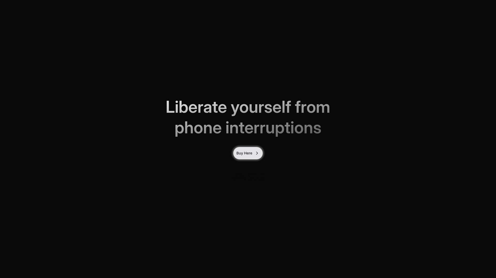

A centered layout displays a large heading positioned in the upper-middle area, followed by body text below it. A button is horizontally centered underneath the text content. All elements are vertically stacked against a dark background.

**Install**: `pnpm dlx shadcn add @shadcnblocks/hero141`

---

## hero143

A centered landing page section features a main heading at the top, followed by body text below it. Underneath the text are two primary buttons positioned horizontally, with additional labels and links arranged in a row beneath them. At the bottom, there are secondary links for alternative download options, also arranged horizontally.

**Install**: `pnpm dlx shadcn add @shadcnblocks/hero143`

---

## hero144

A centered section featuring a grid of 8 app icons arranged in two rows at the top. Below the icons, a large heading is centered, followed by body text underneath. All elements are vertically stacked and horizontally centered on the page.

**Install**: `pnpm dlx shadcn add @shadcnblocks/hero144`

---

## hero145

A full-screen hero section features a large abstract image as the background. On the left side, a main heading is positioned near the top, followed by body text and two horizontally-aligned buttons below. In the bottom right corner, a small label with a downward arrow is placed.

**Install**: `pnpm dlx shadcn add @shadcnblocks/hero145`

---

## hero146

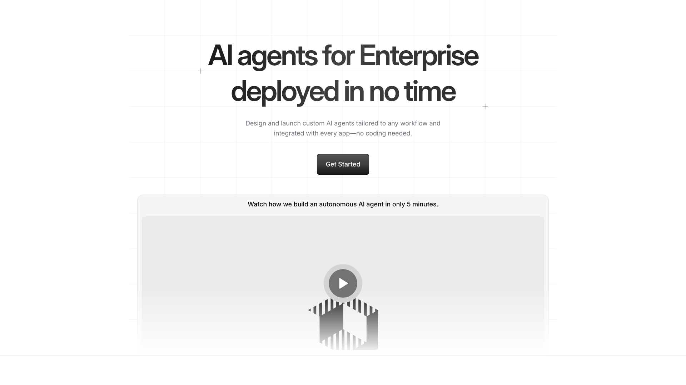

A centered layout features a large heading at the top, followed by body text and a call-to-action button arranged vertically. Below this section, a video preview area is displayed with a play button icon overlaid on an image, accompanied by descriptive label text positioned above it.

**Install**: `pnpm dlx shadcn add @shadcnblocks/hero146`

---

## hero149

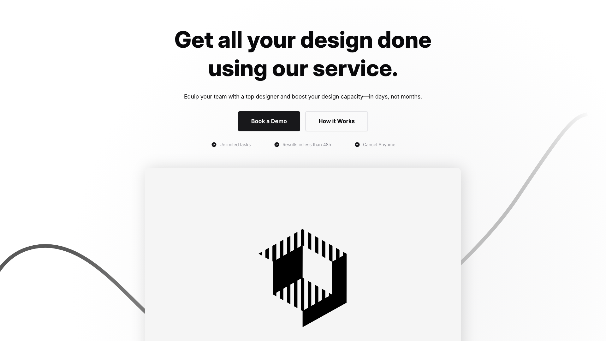

A centered hero section displays a main heading at the top, followed by body text. Below this is a pair of buttons positioned horizontally—a primary button on the left and a secondary button on the right. Three feature labels are arranged horizontally beneath the buttons. The section concludes with a large image centered at the bottom, with decorative curved lines positioned on the left and right edges.

**Install**: `pnpm dlx shadcn add @shadcnblocks/hero149`

---

## hero151

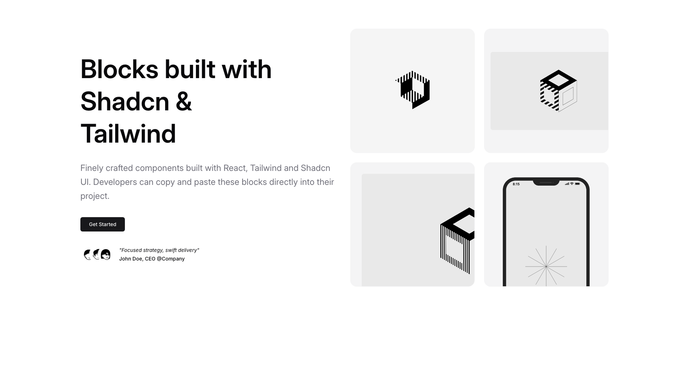

A two-column layout with text content on the left and images on the right. The left column contains a main heading, body text, a button, and a testimonial with an avatar and quote. The right side displays four images arranged in a 2x2 grid layout.

**Install**: `pnpm dlx shadcn add @shadcnblocks/hero151`

---

## hero152

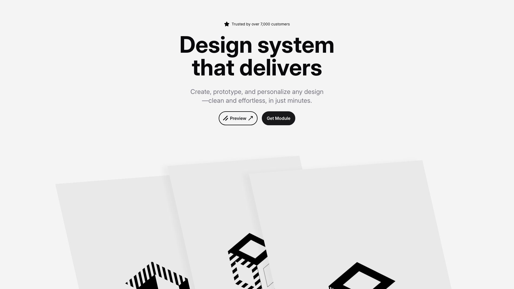

A centered hero section displays a small label at the top, followed by a large heading and body text vertically stacked in the middle. Below the text are two horizontally aligned buttons positioned side-by-side. At the bottom, three images are arranged horizontally across the full width, appearing to recede into the background with a perspective effect.

**Install**: `pnpm dlx shadcn add @shadcnblocks/hero152`

---

## hero157

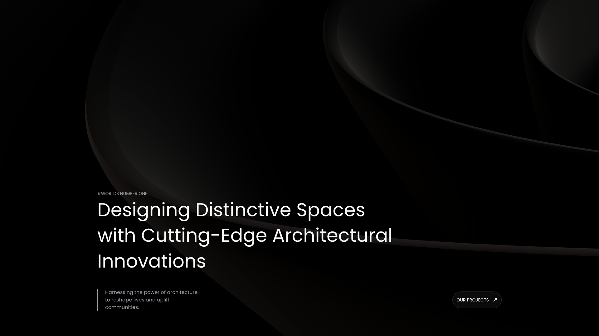

A full-screen hero section with a dark background featuring an abstract image. On the left side, stacked vertically, is a small label at the top, followed by a large main heading, and below that a brief body text with a vertical line accent. On the right side of the screen, positioned in the lower corner, is a button labeled "OUR PROJECTS".

**Install**: `pnpm dlx shadcn add @shadcnblocks/hero157`

---

## hero158

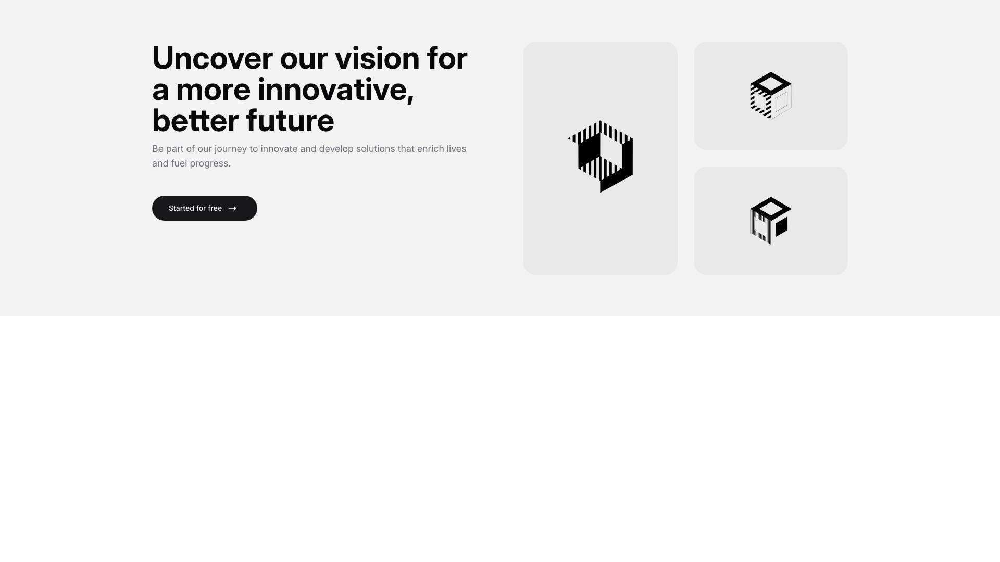

A hero section displays content in two columns with a left-aligned layout. The left column contains a large heading, body text, and a button stacked vertically. The right column features three images arranged vertically in a staggered grid pattern on a light gray background.

**Install**: `pnpm dlx shadcn add @shadcnblocks/hero158`

---

## hero159

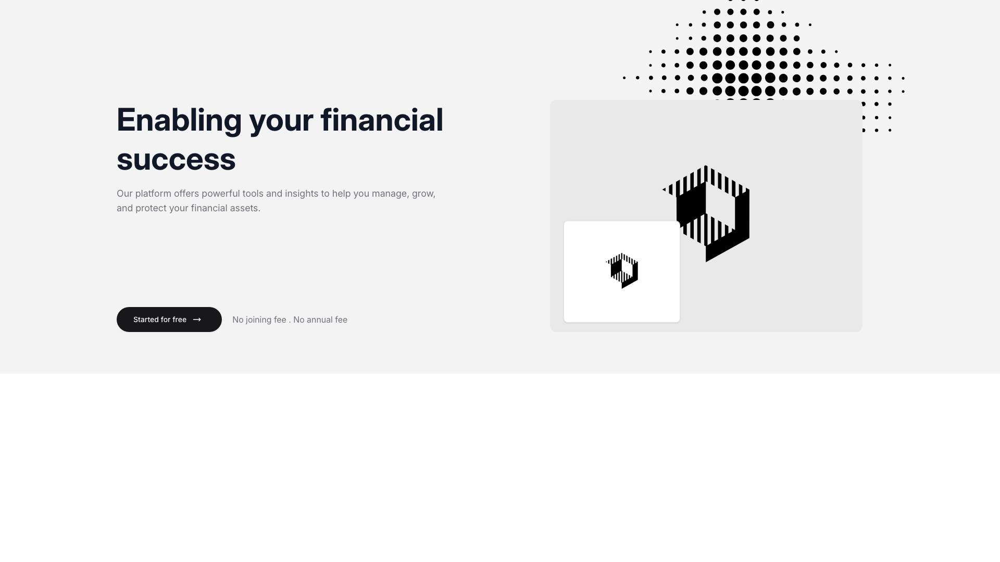

A hero section layout with two columns positioned horizontally. The left column contains a main heading, body text, a button labeled "Started for free," and a label with descriptive text. The right column features a large image with decorative geometric elements positioned above it.

**Install**: `pnpm dlx shadcn add @shadcnblocks/hero159`

---

## hero160

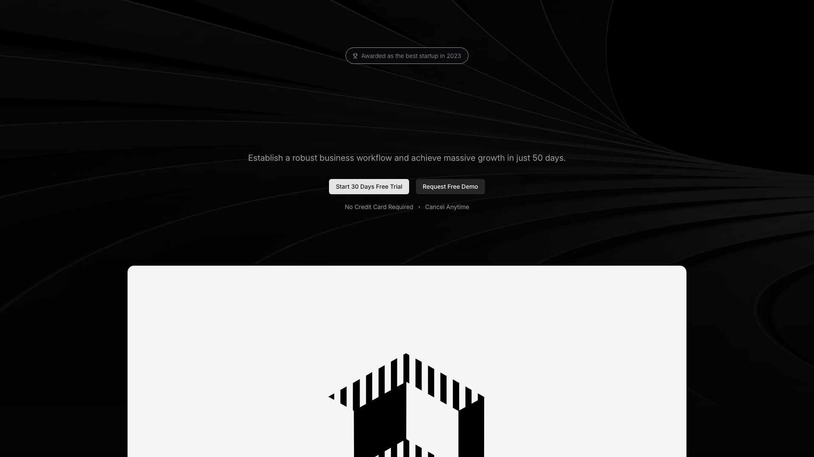

A centered hero section features a badge label at the top, followed by a main heading and body text stacked vertically in the middle. Below the text, two buttons are positioned horizontally side-by-side, with supporting label text centered underneath. An image element is partially visible at the bottom of the section.

**Install**: `pnpm dlx shadcn add @shadcnblocks/hero160`

---

## hero162

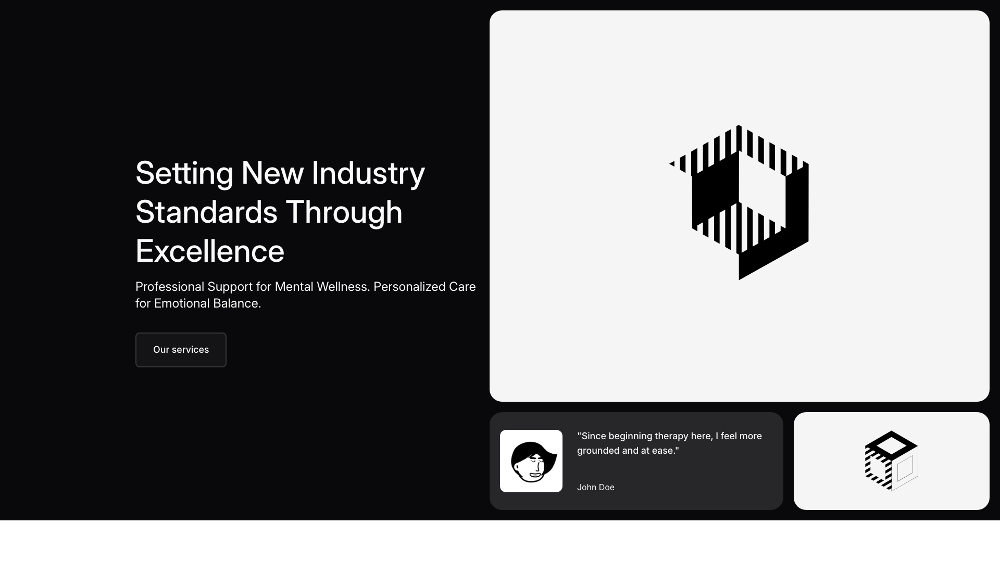

A horizontal layout divides the screen into two main sections. The left side contains a large heading, body text describing services, and a button labeled "Our services." The right side features a large image positioned at the top, with two smaller rectangular cards stacked vertically below it—one containing a user profile with a quote, and another displaying an additional image.

**Install**: `pnpm dlx shadcn add @shadcnblocks/hero162`

---

## hero163

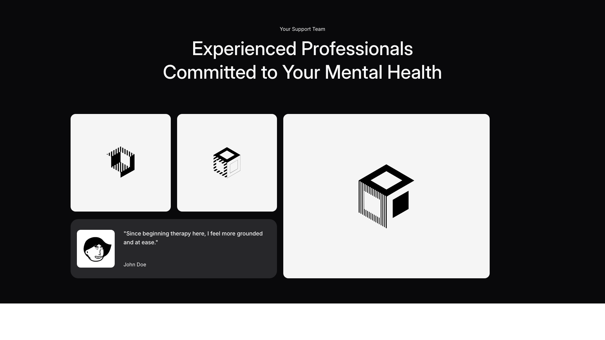

A section displays a centered heading with supporting text at the top. Below, three rounded rectangular cards are arranged horizontally across the layout—two smaller cards on the left and one larger card on the right. The left side also includes a testimonial block with a user avatar, quoted body text, and a name label positioned at the bottom.

**Install**: `pnpm dlx shadcn add @shadcnblocks/hero163`

---

## hero164

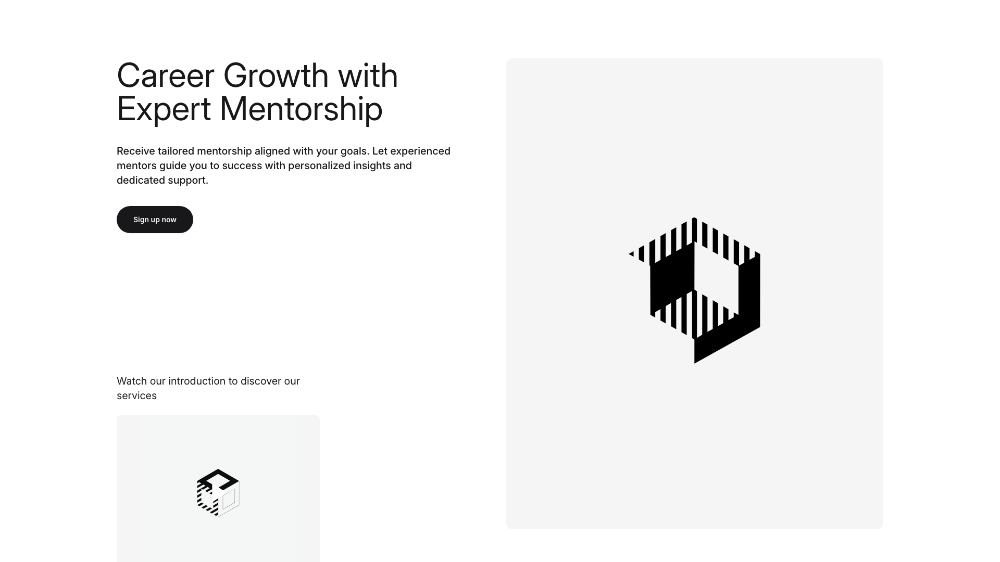

A two-column layout section with text content on the left and a large image on the right. The left column contains a main heading, body text, a button, a smaller label, and a secondary image positioned below. The right column features a large centered image on a light gray background.

**Install**: `pnpm dlx shadcn add @shadcnblocks/hero164`

---

## hero165

A hero section displays content in two columns with a left-aligned layout. On the left side, three images are stacked vertically in varying sizes. On the right side, a large heading is positioned above body text, creating a clean text hierarchy. The overall composition balances visual elements on the left with messaging on the right.

**Install**: `pnpm dlx shadcn add @shadcnblocks/hero165`

---

## hero166

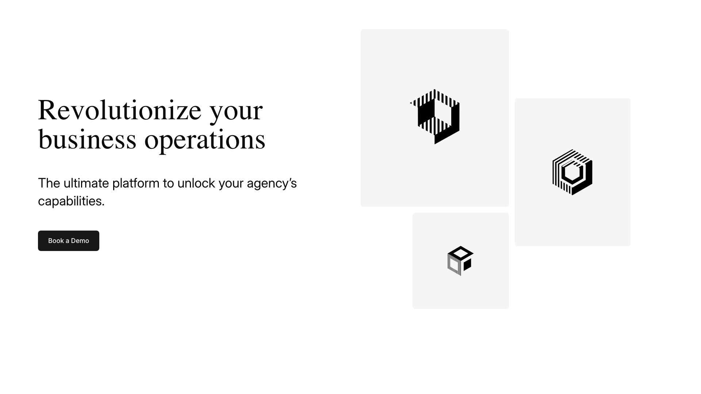

A hero section displays content in two columns with a left-aligned layout. The left column contains a large heading, body text, and a button stacked vertically. The right column features three images arranged in a staggered, asymmetrical grid pattern.

**Install**: `pnpm dlx shadcn add @shadcnblocks/hero166`

---

## hero167

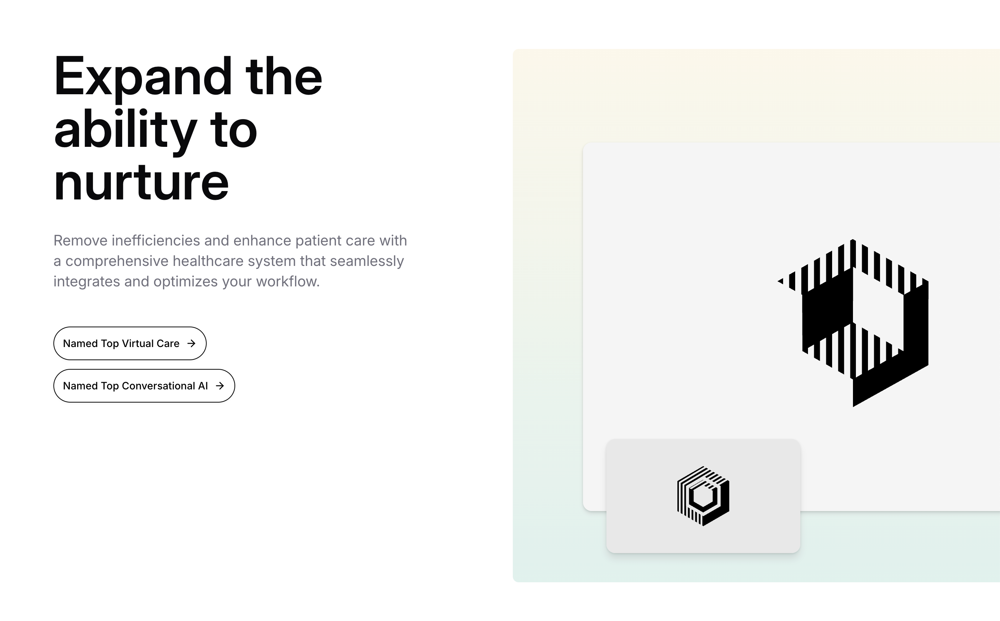

A two-column layout with text content on the left and visual elements on the right. The left column contains a main heading, body text, and two button links stacked vertically. The right column features two images positioned vertically, with the larger image at the top and a smaller image below it, both centered within the right section.

**Install**: `pnpm dlx shadcn add @shadcnblocks/hero167`

---

## hero168

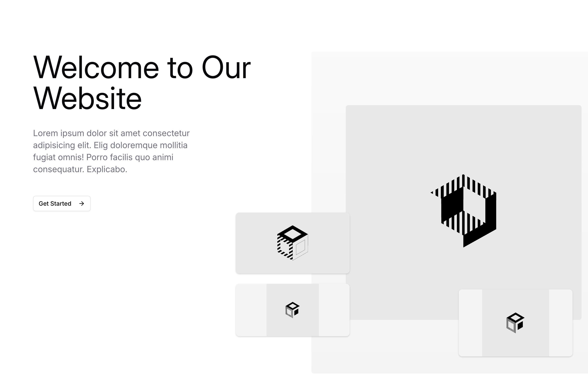

A webpage section features a two-column layout with text content on the left and decorative images on the right. The left column contains a large heading, body text, and a button with an arrow. The right side displays multiple geometric images of varying sizes arranged in an asymmetrical, staggered composition.

**Install**: `pnpm dlx shadcn add @shadcnblocks/hero168`

---

## hero170

A centered hero section displays a main heading at the top, followed by body text beneath it. Below the text are two horizontally aligned buttons, with a label and five small icon images centered underneath. At the bottom of the section is a large image positioned on a light background.

**Install**: `pnpm dlx shadcn add @shadcnblocks/hero170`

---

## hero171

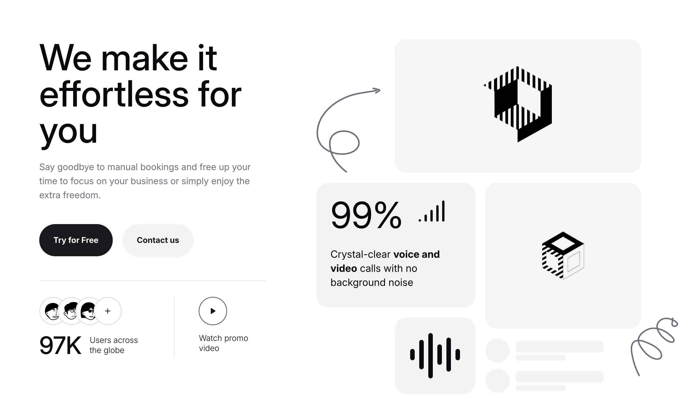

A webpage section is divided into two main areas. On the left, a large heading, body text, and two buttons are stacked vertically, with user avatars and a play button positioned below. On the right, multiple card-style containers are arranged in a grid layout, each featuring an image and accompanying text labels positioned centrally or at the bottom of each card.

**Install**: `pnpm dlx shadcn add @shadcnblocks/hero171`

---

## hero172

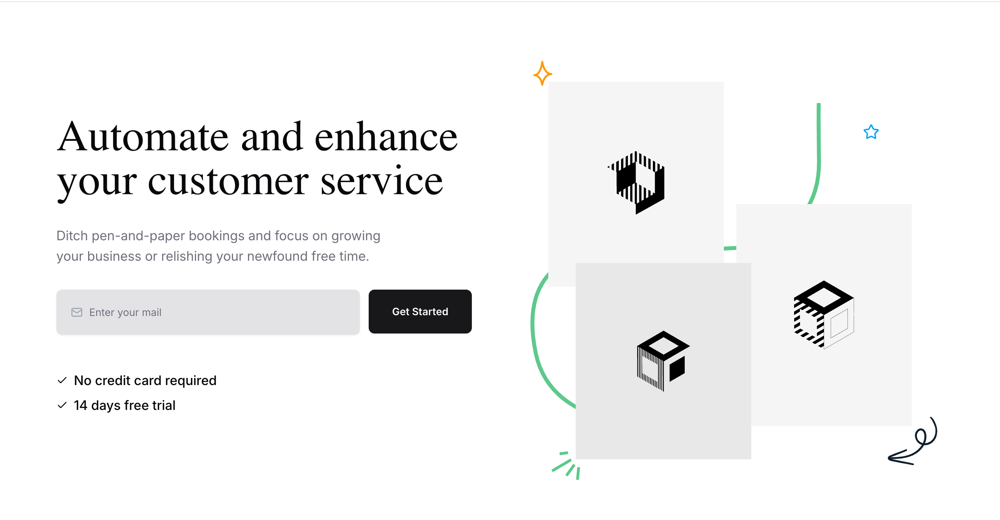

A webpage section with a two-column layout. The left column contains a main heading, body text, an email input field with a button, and two labeled checkmarks. The right side displays decorative images and graphic elements arranged vertically and horizontally across the space.

**Install**: `pnpm dlx shadcn add @shadcnblocks/hero172`

---

## hero173

A webpage section is divided into two columns with a left-aligned layout. The left column contains a label at the top, followed by a large heading, body text, and two horizontally-aligned buttons below. The right column features a layered image composition centered vertically.

**Install**: `pnpm dlx shadcn add @shadcnblocks/hero173`

---

## hero174

A full-screen hero section with a dark background image displays vertically centered content. A large heading and body text are horizontally centered in the middle of the screen, followed by a button positioned below the text. At the bottom left, a location label and address are aligned to the left side of the layout.

**Install**: `pnpm dlx shadcn add @shadcnblocks/hero174`

---

## hero175

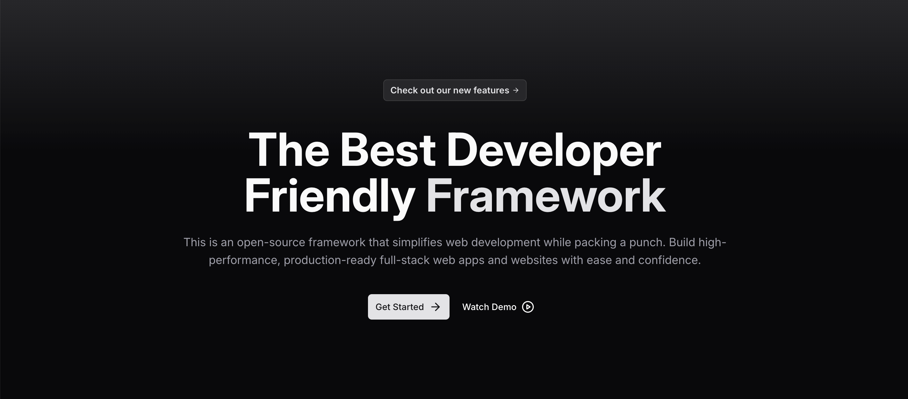

A dark hero section with vertically centered content displays a small label at the top, followed by a large centered heading, body text underneath, and two horizontally aligned buttons at the bottom. All text elements are center-aligned within the section.

**Install**: `pnpm dlx shadcn add @shadcnblocks/hero175`

---

## hero177

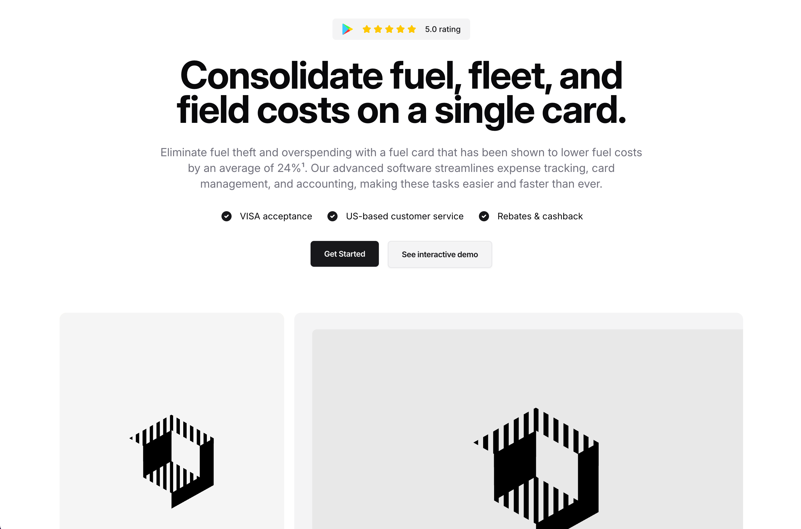

A centered webpage section contains a star rating and main heading at the top, followed by body text describing the service. Below this are three horizontally aligned labels with checkmarks, and two buttons positioned side-by-side in the center. The lower portion displays two images arranged horizontally across the full width.

**Install**: `pnpm dlx shadcn add @shadcnblocks/hero177`

---

## hero178

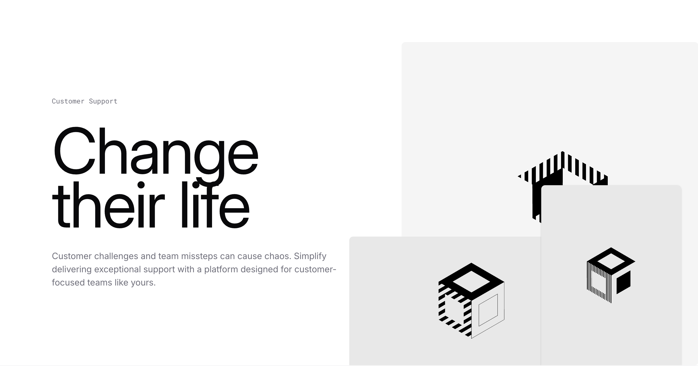

A two-column layout with text content on the left and images on the right. The left column contains a small label at the top, followed by a large heading, body text, and descriptive paragraph. The right column features three geometric images arranged vertically and positioned at varying offsets against a light gray background.

**Install**: `pnpm dlx shadcn add @shadcnblocks/hero178`

---

## hero179

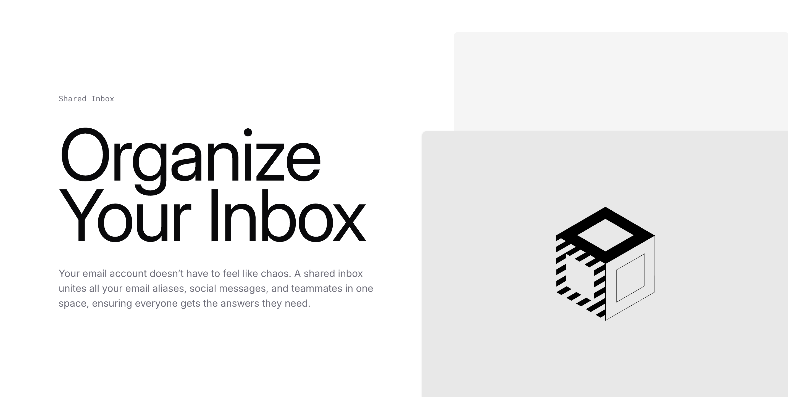

A two-column layout with text content on the left and an image on the right. The left column contains a small label at the top, followed by a large heading, body text, and additional descriptive text below. On the right side, a large image is positioned vertically centered within a light gray background area.

**Install**: `pnpm dlx shadcn add @shadcnblocks/hero179`

---

## hero180

A centered landing page section displays a main heading at the top, followed by body text below it. Two buttons are horizontally positioned beneath the text—a primary button on the left and a secondary button on the right. An image is centered at the bottom of the section, spanning the full width.

**Install**: `pnpm dlx shadcn add @shadcnblocks/hero180`

---

## hero183

A centered hero section features a premium label at the top, followed by a large heading, body text, and two horizontally-aligned buttons. Below this, five geometric images are arranged in an asymmetrical layout—two smaller images on the left stacked vertically, one larger image centered, and two smaller images on the right stacked vertically.

**Install**: `pnpm dlx shadcn add @shadcnblocks/hero183`

---

## hero185

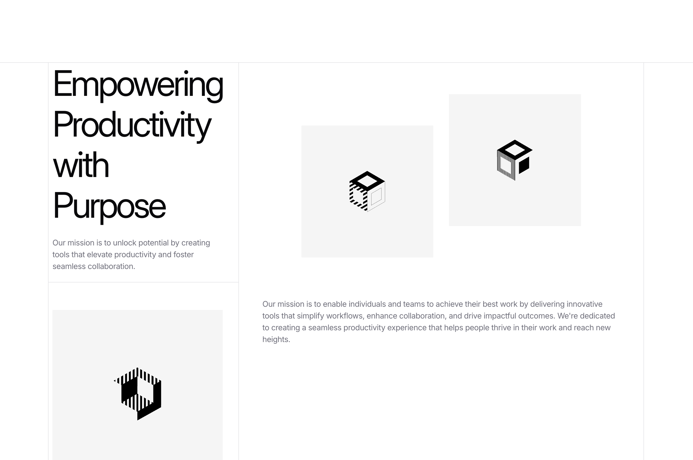

A two-column layout divides the page vertically. The left column contains a large heading, supporting body text, and a logo positioned near the bottom. The right column features a longer body text paragraph centered horizontally, with two images spaced above it.

**Install**: `pnpm dlx shadcn add @shadcnblocks/hero185`

---

## hero186

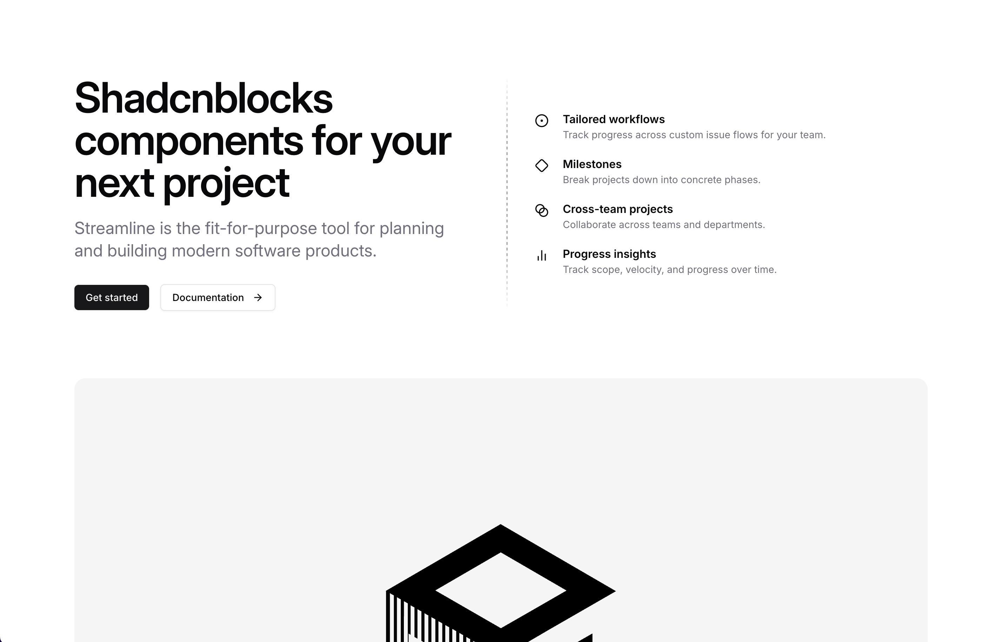

A two-column layout with text content on the left and feature information on the right. The left column contains a large heading, body text, and two buttons positioned horizontally. The right column displays four feature items stacked vertically, each with an icon, a bold label, and descriptive text. Below both columns is a large image centered at the bottom.

**Install**: `pnpm dlx shadcn add @shadcnblocks/hero186`

---

## hero187

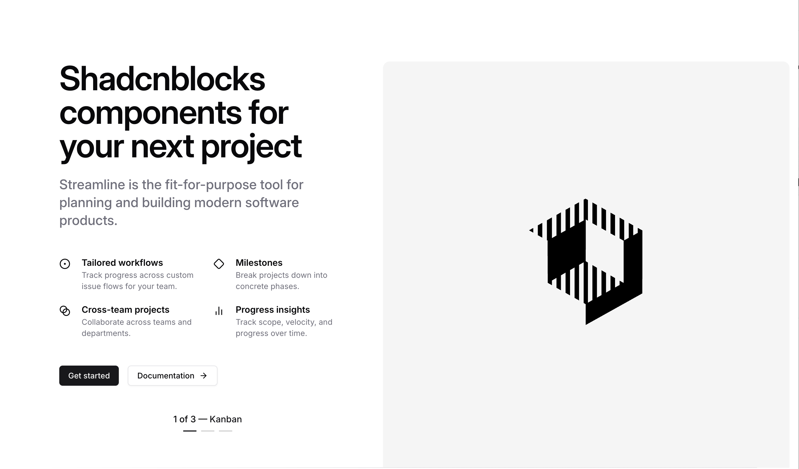

A webpage section is divided into two columns. The left column contains a large heading, body text, four labeled feature items arranged in a 2x2 grid, and two buttons positioned horizontally below. The right column displays a large image centered vertically and horizontally. At the bottom, a pagination indicator and label are left-aligned.

**Install**: `pnpm dlx shadcn add @shadcnblocks/hero187`

---

## hero190

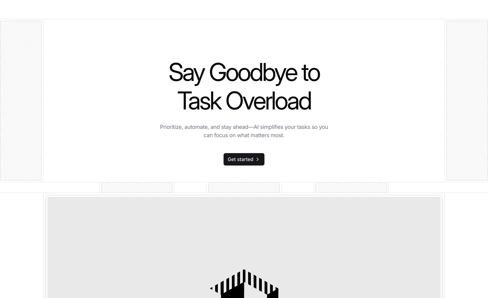

A centered hero section features a large heading at the top, followed by body text positioned below it. A dark button labeled "Get started" is horizontally centered beneath the text. At the bottom of the section, a large image is centered and partially visible.

**Install**: `pnpm dlx shadcn add @shadcnblocks/hero190`

---

## hero192

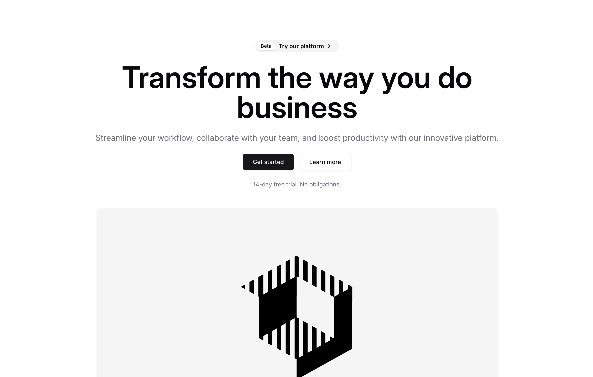

A centered landing page section displays a small label at the top, followed by a large heading, body text, and two horizontally-aligned buttons. Below this, centered text provides additional information. A large image occupies the lower portion of the section, spanning the full width.

**Install**: `pnpm dlx shadcn add @shadcnblocks/hero192`

---

## hero195

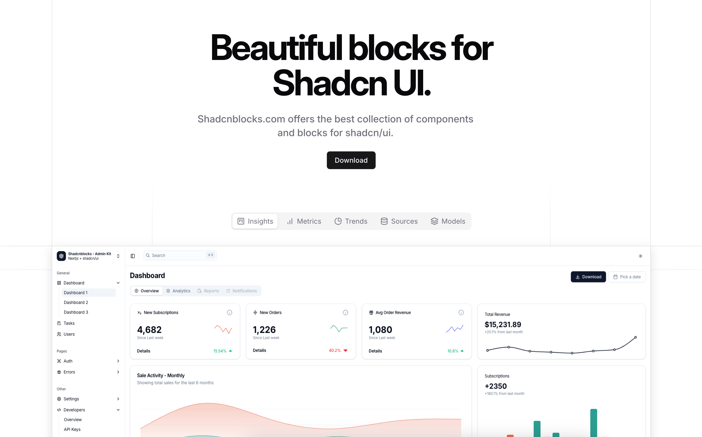

A dashboard interface with a two-column layout. The left column contains a vertical navigation menu with expandable sections and menu items. The main content area on the right displays a header with navigation tabs horizontally aligned, followed by a grid of metric cards displaying numbers and small charts. Below the metrics are larger visualization components including a line graph and a wave chart, arranged in a multi-column layout.

**Install**: `pnpm dlx shadcn add @shadcnblocks/hero195`

---

## hero196

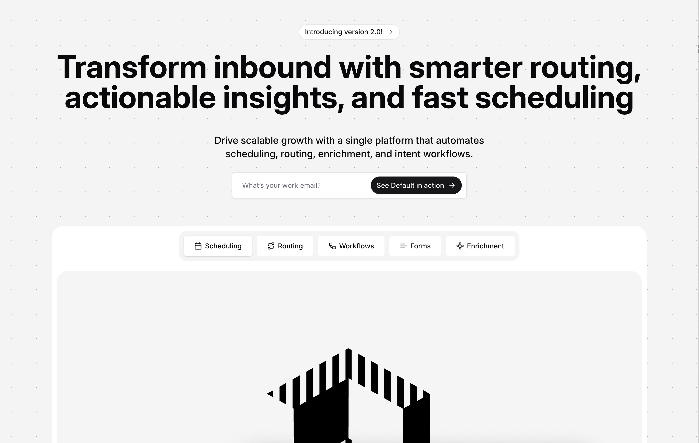

A centered webpage section features a main heading at the top, followed by body text and an email input field with a call-to-action button. Below this, a horizontal navigation menu with five labeled tabs is positioned centrally. The lower portion of the section contains a large image centered vertically, with the remaining space filled by a light background.

**Install**: `pnpm dlx shadcn add @shadcnblocks/hero196`

---

## hero197

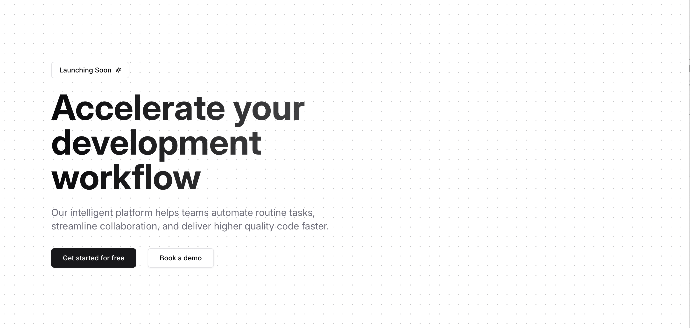

A vertically stacked hero section with a small label positioned at the top left. Below this is a large heading, followed by body text. At the bottom, two buttons are arranged horizontally—a primary button on the left and a secondary button to its right.

**Install**: `pnpm dlx shadcn add @shadcnblocks/hero197`

---

## hero200

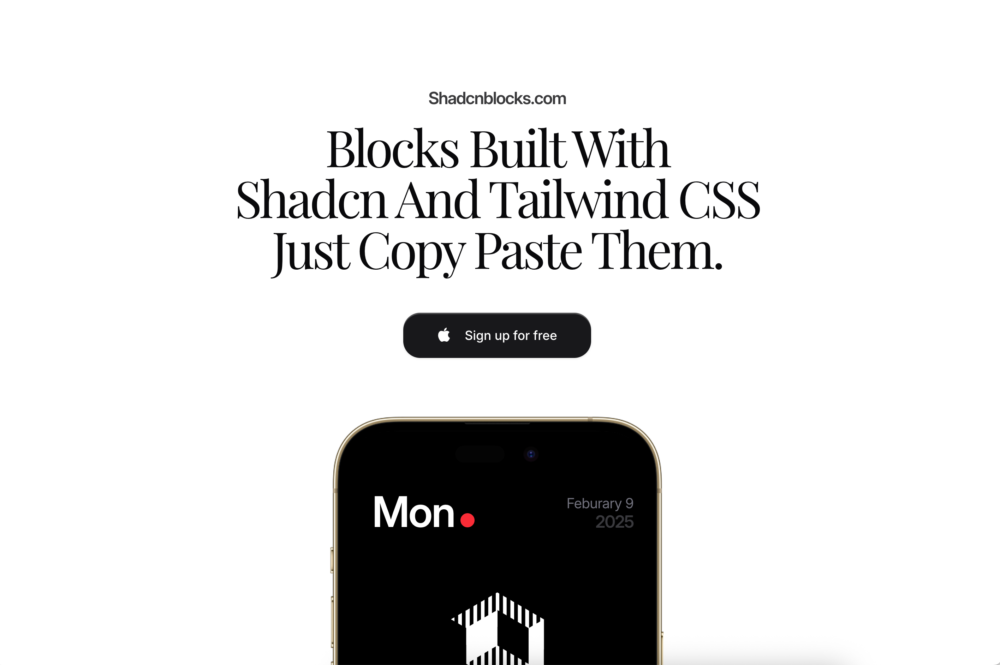

A centered landing page layout features a main heading at the top, followed by body text positioned below it. A sign-up button is centered underneath the text. Below this, a large image is positioned centrally, showcasing a mobile device mockup.

**Install**: `pnpm dlx shadcn add @shadcnblocks/hero200`

---

## hero201

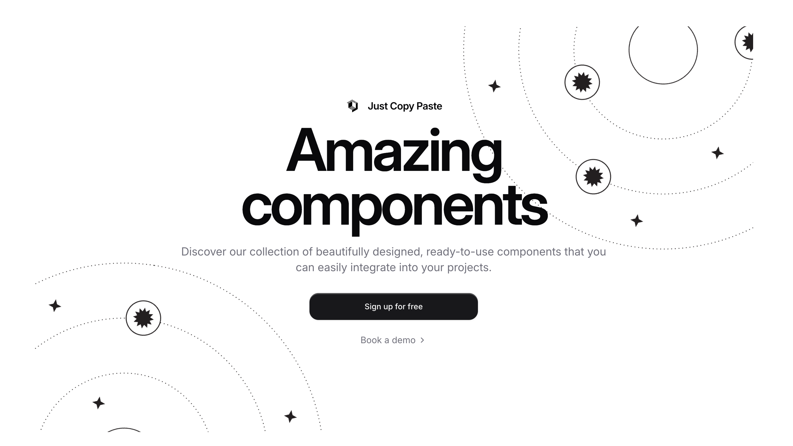

A centered hero section contains a small label at the top, followed by a large heading and body text stacked vertically. Below the text, two buttons are positioned centrally in a vertical arrangement. Decorative images are scattered around the edges of the layout in a loose, organic pattern.

**Install**: `pnpm dlx shadcn add @shadcnblocks/hero201`

---

## hero202

A webpage section is divided into two columns. The left column contains a small label at the top, followed by a large heading, a subheading in gray text, and a button positioned below. The right column features an image with concentric circular elements and decorative icons arranged vertically.

**Install**: `pnpm dlx shadcn add @shadcnblocks/hero202`

---

## hero204

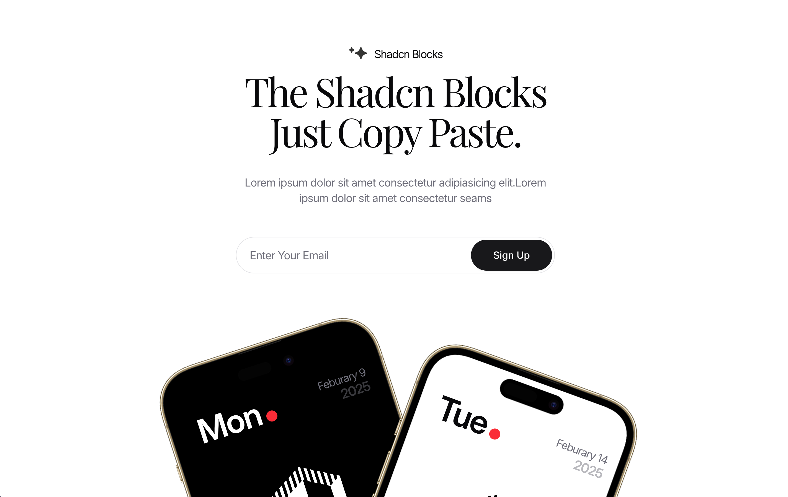

A centered layout displays a logo and heading at the top, followed by a main heading, body text, and an email signup form with an input field and button horizontally aligned. Below this, two device images are positioned side-by-side showcasing the interface.

**Install**: `pnpm dlx shadcn add @shadcnblocks/hero204`

---

## hero205

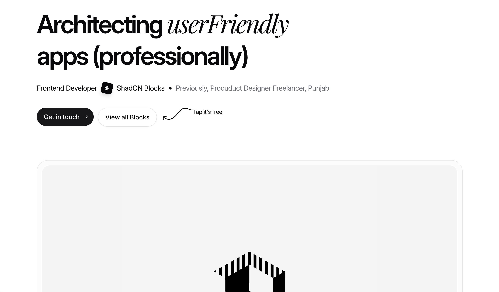

A header section contains a large main heading followed by body text and metadata labels positioned horizontally below it. Two action buttons are placed on the left, with additional descriptive text and a label appearing to their right. Below this, a large centered image occupies the remaining space.

**Install**: `pnpm dlx shadcn add @shadcnblocks/hero205`

---

## hero206

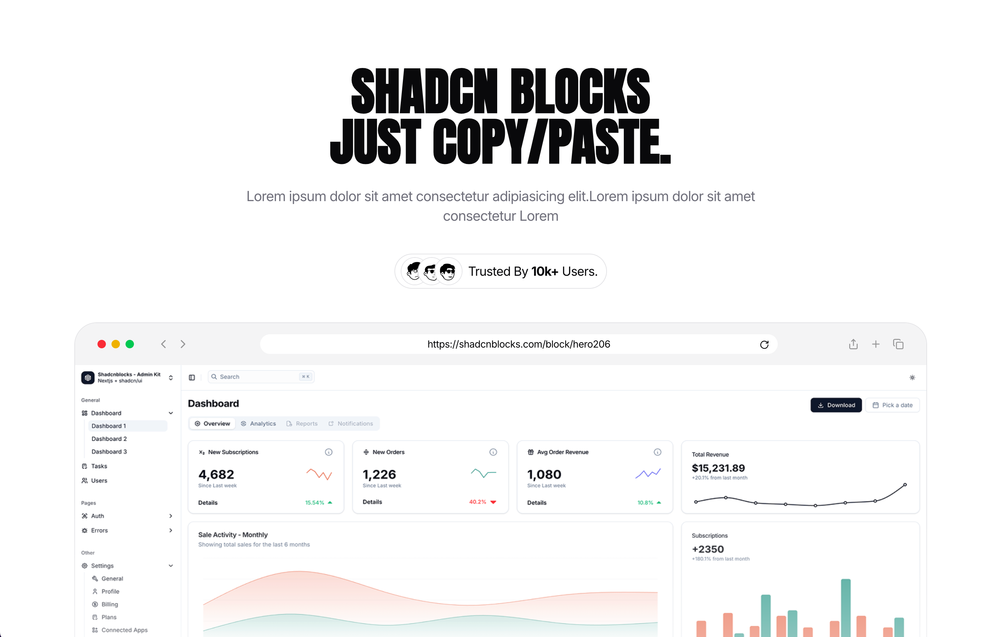

A webpage displays a centered hero section at the top with a large heading, body text, and a trust badge with user avatars. Below this, a browser window mockup shows an admin dashboard layout with a left sidebar containing navigation links and menu items. The main content area on the right features multiple data cards arranged horizontally, displaying key metrics with numbers and charts, along with larger visualization graphs positioned below.

**Install**: `pnpm dlx shadcn add @shadcnblocks/hero206`

---

## hero211

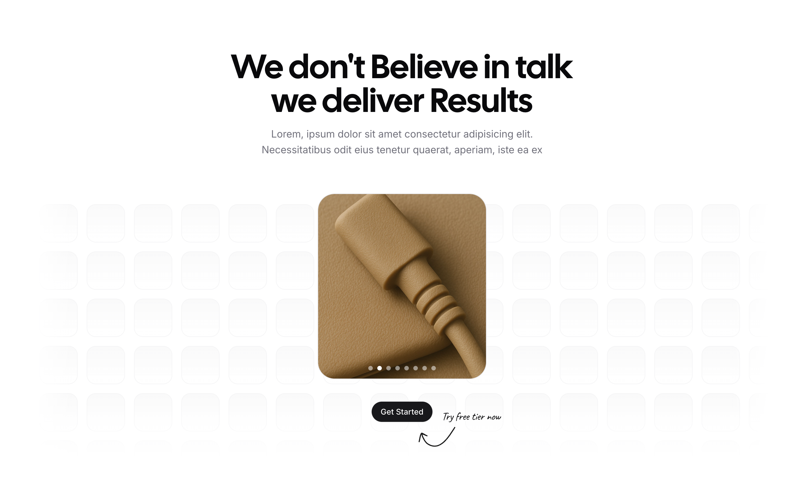

A centered hero section displays a large heading at the top, followed by body text beneath it. Below the text sits a rounded image, with a row of navigation dots positioned underneath. A "Get Started" button is placed below the image, accompanied by a small label and arrow pointing to it.

**Install**: `pnpm dlx shadcn add @shadcnblocks/hero211`

---

## hero212

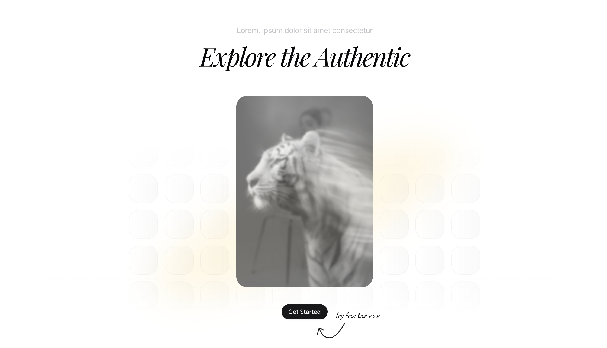

A centered vertical layout displays a small text label at the top, followed by a large italicized heading. Below is a rounded rectangular image positioned centrally. At the bottom, a dark button is aligned left with accompanying label text to its right.

**Install**: `pnpm dlx shadcn add @shadcnblocks/hero212`

---

## hero215

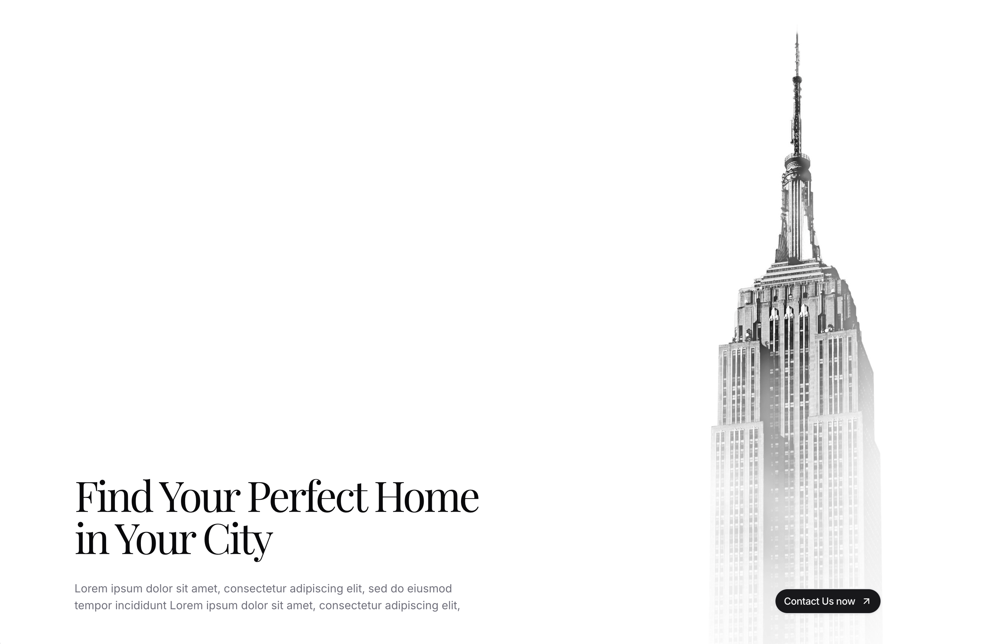

A hero section with a two-column layout displays a heading and body text on the left side, with a "Contact Us now" button positioned below the text. On the right side, a large image extends vertically, balancing the composition horizontally.

**Install**: `pnpm dlx shadcn add @shadcnblocks/hero215`

---

## hero216

A centered hero section contains a small label at the top, followed by a large heading and body text stacked vertically in the middle. Below the text is a call-to-action button. A large image is positioned at the bottom of the section, spanning the full width.

**Install**: `pnpm dlx shadcn add @shadcnblocks/hero216`

---

## hero217

A hero section with a dark background features vertically stacked text content centered at the top, including a small label, a large main heading, and a "Get Started" button. Below the text, a large image is centered and spans the full width of the section.

**Install**: `pnpm dlx shadcn add @shadcnblocks/hero217`

---

## hero218

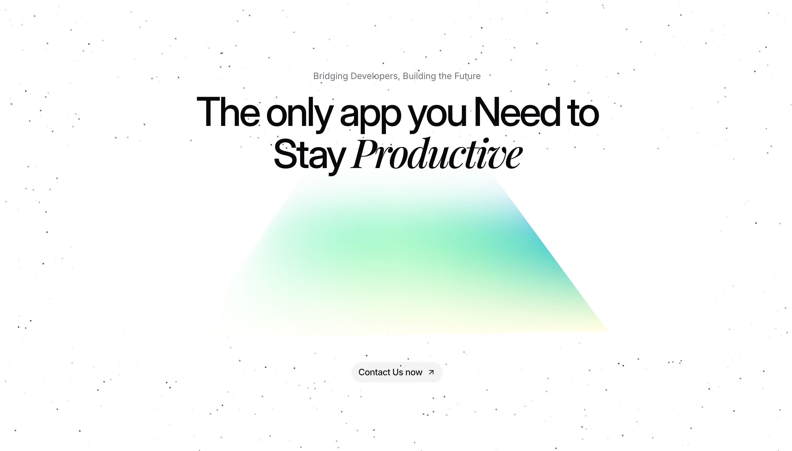

A centered webpage section features a small label at the top, followed by a large heading split across two lines with mixed font weights. Below the heading is a gradient image positioned centrally. At the bottom, a button with accompanying text is horizontally aligned in the center.

**Install**: `pnpm dlx shadcn add @shadcnblocks/hero218`

---

## hero219

A centered layout features a tagline at the top, followed by a large heading positioned in the middle. Below the heading, multiple application logos are arranged horizontally in three rows, creating a grid-like pattern of brand icons.

**Install**: `pnpm dlx shadcn add @shadcnblocks/hero219`

---

## hero221

A centered landing page section features a large heading positioned at the top, with a textured image overlay effect. Below the heading is body text centered horizontally, followed by a call-to-action button aligned to the center. All elements are vertically stacked and contained within the viewport.

**Install**: `pnpm dlx shadcn add @shadcnblocks/hero221`

---

## hero223

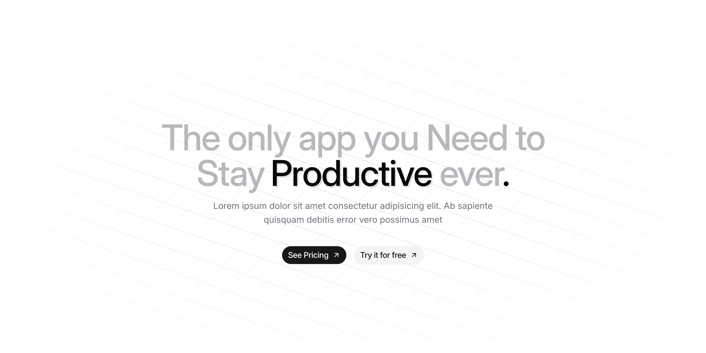

A centered hero section displays a large heading with mixed font weights, followed by body text below. Underneath is a pair of horizontally aligned buttons positioned side-by-side at the bottom of the section.

**Install**: `pnpm dlx shadcn add @shadcnblocks/hero223`

---

## hero224

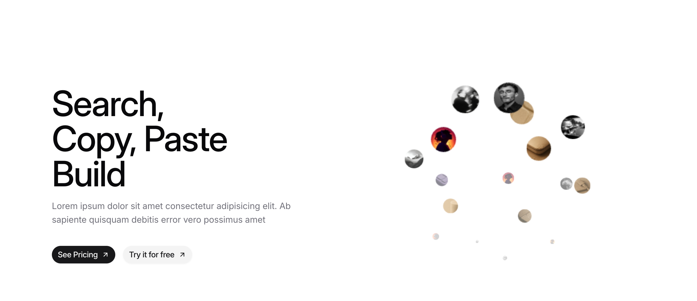

A hero section is organized in two columns. The left column contains a large heading, body text, and two action buttons positioned horizontally below. The right column displays multiple circular images of varying sizes arranged in a scattered, organic layout.

**Install**: `pnpm dlx shadcn add @shadcnblocks/hero224`

---

## hero225

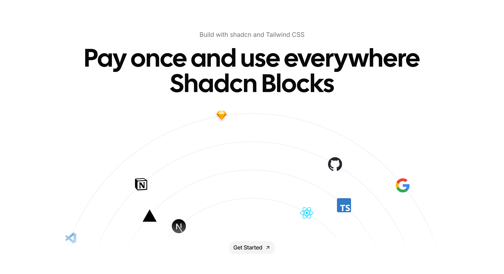

A centered webpage section features a small label at the top, followed by a large heading. Below the text is a circular diagram with multiple logo images positioned around concentric rings. At the bottom center, there is a "Get Started" button with an arrow icon.

**Install**: `pnpm dlx shadcn add @shadcnblocks/hero225`

---

## hero227

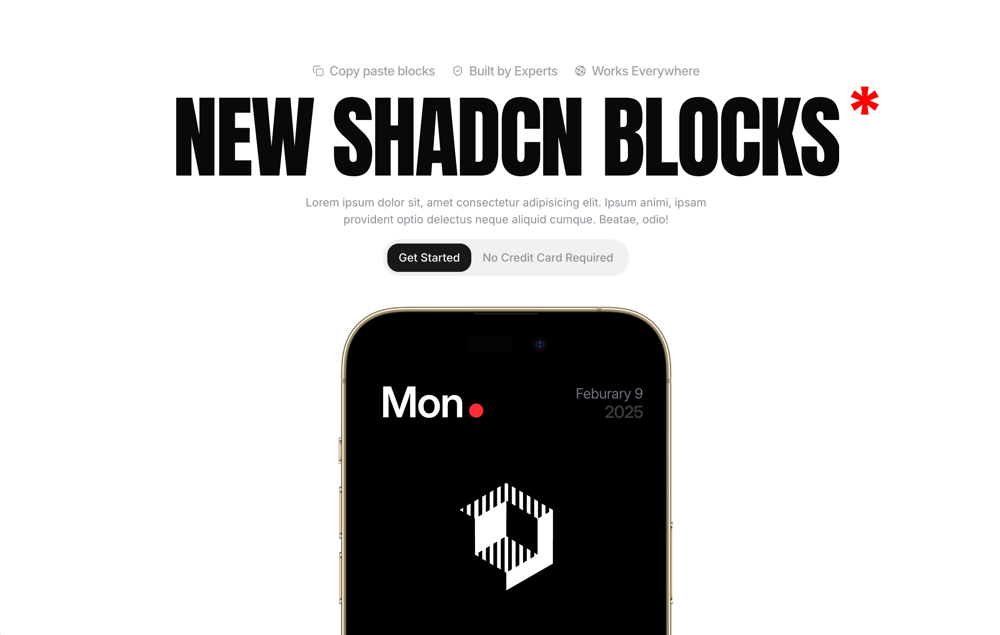

A centered landing page section with a main heading at the top, followed by body text and two horizontally-aligned buttons below. Further down, an image of a mobile device is positioned centrally, displaying interface content on its screen.

**Install**: `pnpm dlx shadcn add @shadcnblocks/hero227`

---

## hero228

A centered webpage section features a main heading with mixed typography, followed by body text positioned below. Underneath the text, three images are arranged horizontally in a diamond-like layout with overlapping edges. At the bottom, a label and name text are centered vertically, with a progress bar element spanning horizontally across the width.

**Install**: `pnpm dlx shadcn add @shadcnblocks/hero228`

---

## hero229

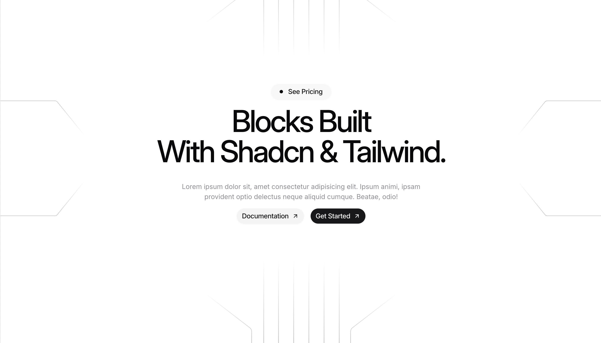

A centered webpage section with vertically stacked content. At the top is a small label, followed by a large heading, body text, and two horizontally aligned buttons positioned below the text.

**Install**: `pnpm dlx shadcn add @shadcnblocks/hero229`

---

## hero230

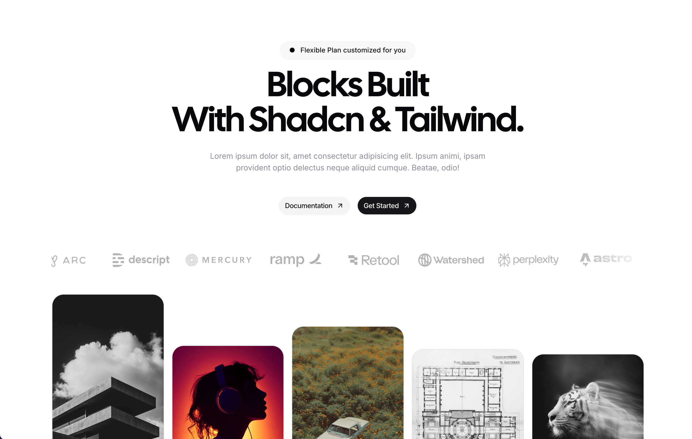

A centered hero section contains a small label at the top, followed by a large heading, body text, and two buttons positioned horizontally below. Further down, a row of company logos is displayed horizontally across the width. At the bottom, five images are arranged in a horizontal grid layout spanning the full width.

**Install**: `pnpm dlx shadcn add @shadcnblocks/hero230`

---

## hero231

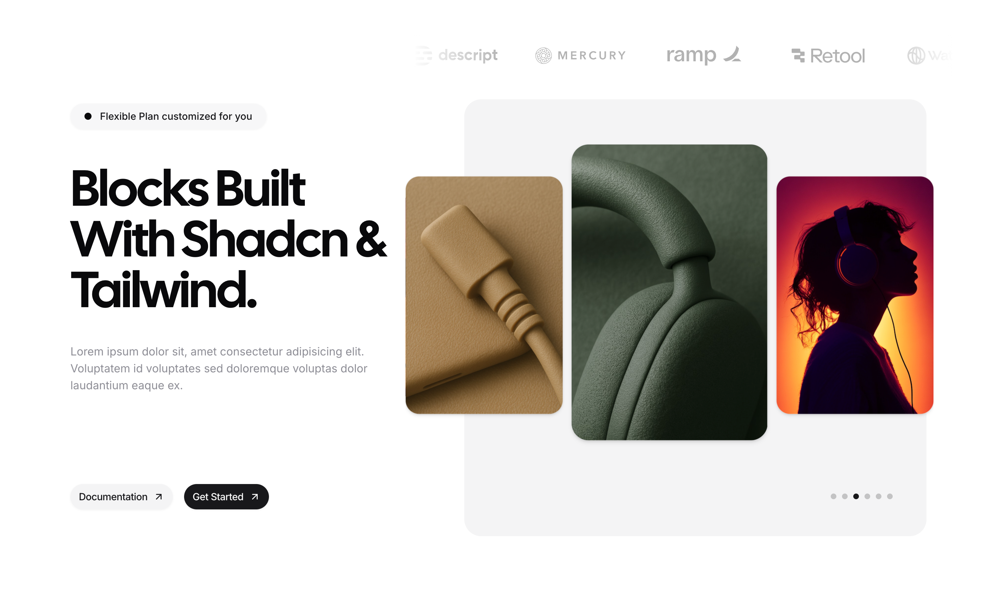

A webpage section is divided into two columns. The left column contains a small label, a large heading, body text, and two buttons positioned horizontally below. The right column features three rounded rectangular images arranged horizontally, with pagination dots centered beneath them.

**Install**: `pnpm dlx shadcn add @shadcnblocks/hero231`

---

## hero232

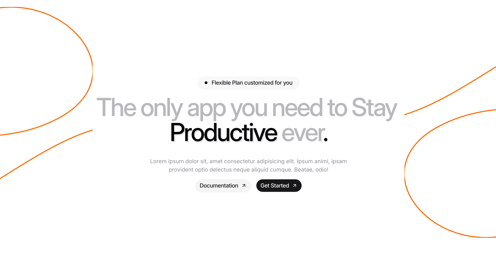

A centered hero section features a small label at the top, followed by a large heading with mixed text styling. Below is body text and two horizontally aligned buttons positioned at the bottom. Decorative curved line images frame the left and right edges of the layout.

**Install**: `pnpm dlx shadcn add @shadcnblocks/hero232`

---

## hero233

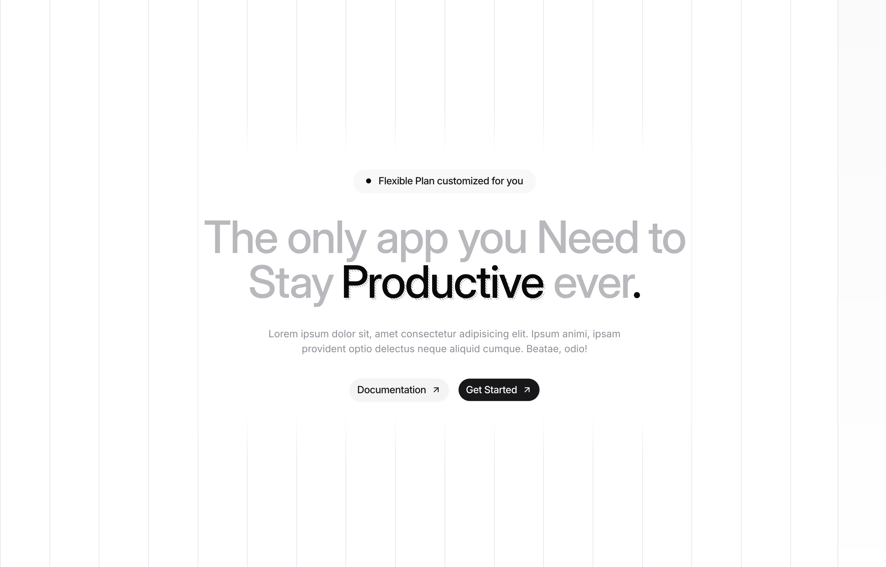

A centered layout contains a small label at the top, followed by a large heading with mixed font weights. Below the heading is body text, and at the bottom are two horizontally aligned buttons—one with a light background and one with a dark background.

**Install**: `pnpm dlx shadcn add @shadcnblocks/hero233`

---

## hero236

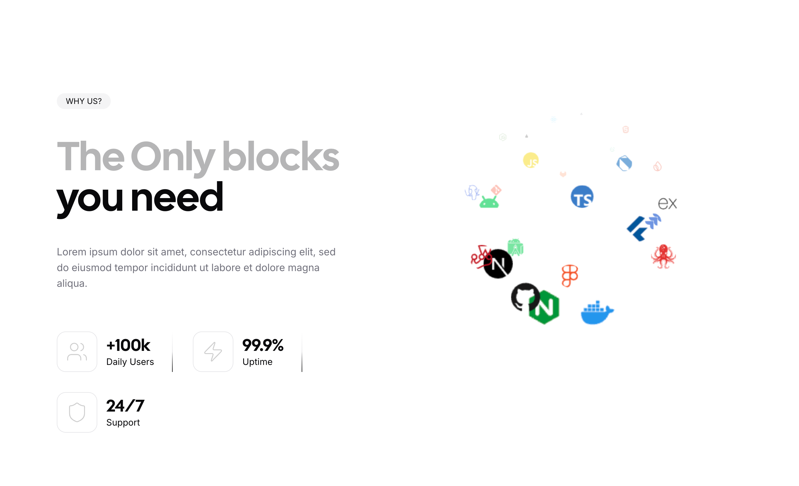

A two-column layout with text content on the left and decorative images on the right. The left side features a "Why Us?" label, a large heading, body text, and three horizontally-arranged stat cards with icons and labels below. The right side displays multiple small product/service logos scattered across the space.

**Install**: `pnpm dlx shadcn add @shadcnblocks/hero236`

---

## hero237

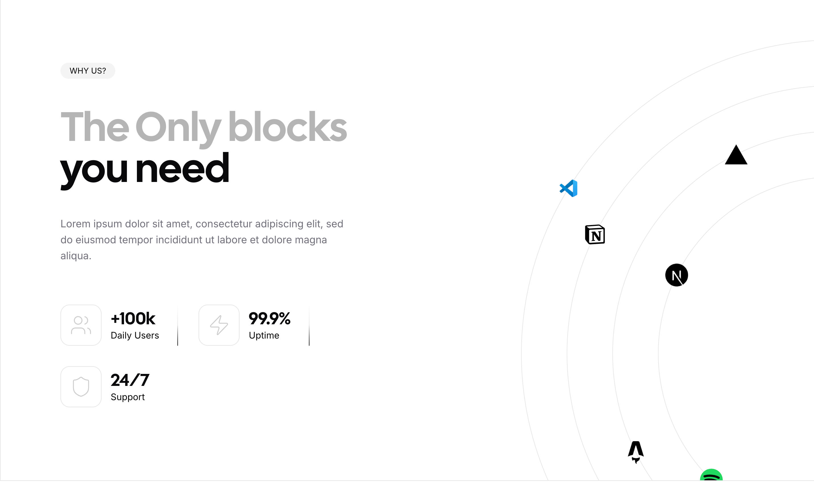

A "Why Us?" section features a two-column layout. On the left, a large heading and body text are positioned vertically, followed by three horizontal stat blocks displaying metrics with icons and labels. On the right, several small icons and images are arranged in a scattered, organic pattern across the space.

**Install**: `pnpm dlx shadcn add @shadcnblocks/hero237`

---

## hero238

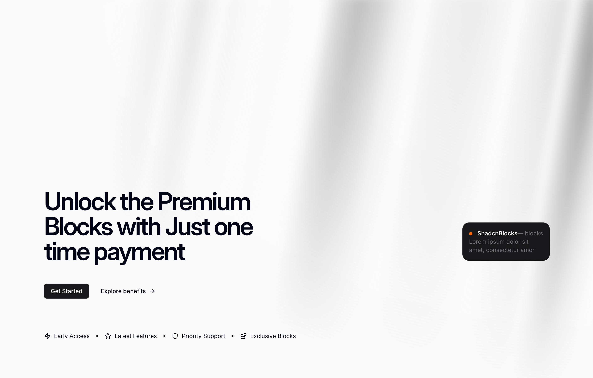

A hero section displays a two-column layout with text content on the left and an image on the right. The left column contains a large heading, followed by two action buttons positioned horizontally below it. At the bottom of the left column, four feature labels are arranged horizontally with dividing separators. On the right side, a small dark card with a label and body text is positioned in the upper corner.

**Install**: `pnpm dlx shadcn add @shadcnblocks/hero238`

---

## hero241

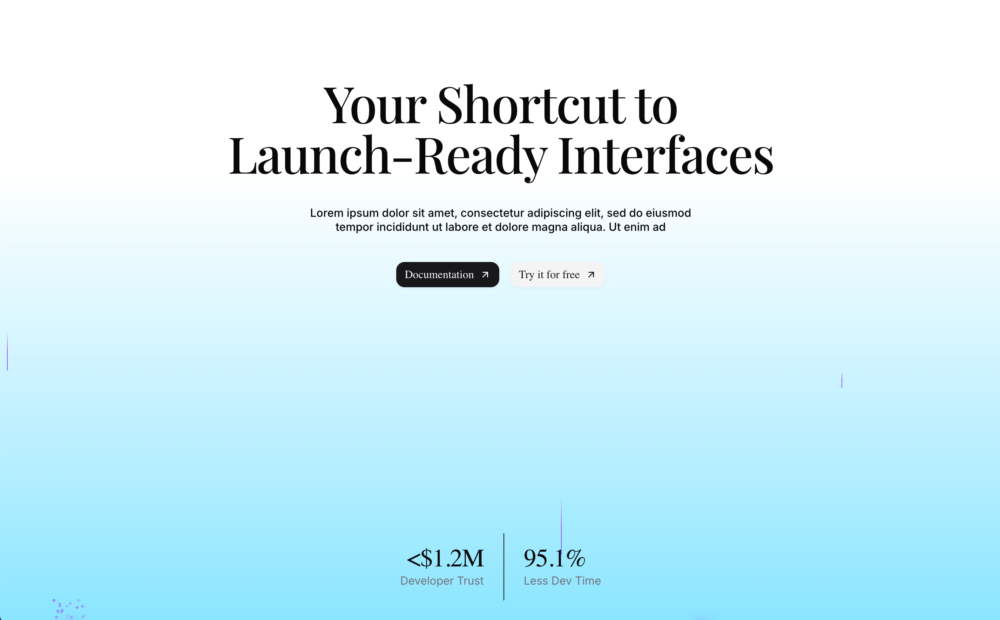

A centered hero section contains a large heading, body text, and two horizontally-aligned buttons stacked vertically at the top. Below, two statistics are displayed side-by-side at the bottom of the section, each with a numerical value and a descriptive label.

**Install**: `pnpm dlx shadcn add @shadcnblocks/hero241`

---

## hero242

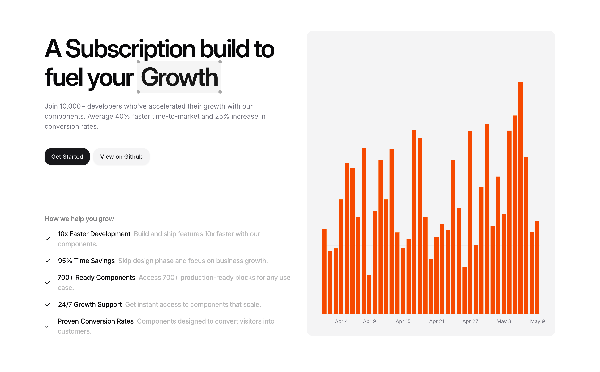

A webpage section is divided into two columns. The left column contains a large heading, body text describing a service, two action buttons positioned horizontally, a subheading, and a bulleted list with five items. The right column displays a large image showing a bar chart spanning the full height of the section.

**Install**: `pnpm dlx shadcn add @shadcnblocks/hero242`

---

## hero243

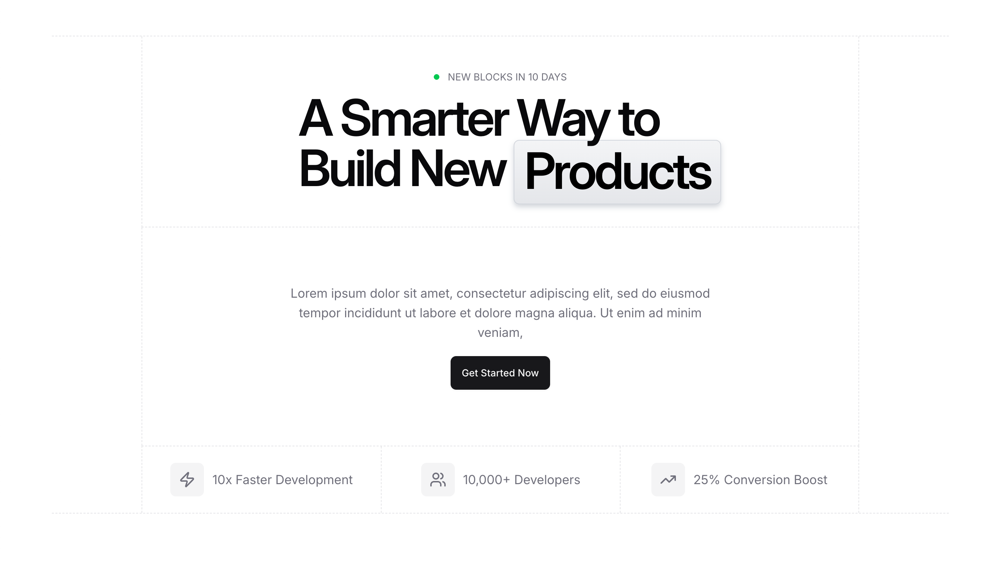

A centered hero section contains a label at the top, followed by a large heading, body text, and a button stacked vertically. Below this, three feature items are arranged horizontally in equal columns, each displaying an image, a heading, and descriptive text.

**Install**: `pnpm dlx shadcn add @shadcnblocks/hero243`

---

## hero244

A webpage section is divided into two columns. The left column contains a main heading, body text with lorem ipsum content, and two action buttons positioned horizontally below. The right column displays a stacked arrangement of multiple card-style images, slightly overlapping vertically with labels beneath each one.

**Install**: `pnpm dlx shadcn add @shadcnblocks/hero244`

---

## hero245

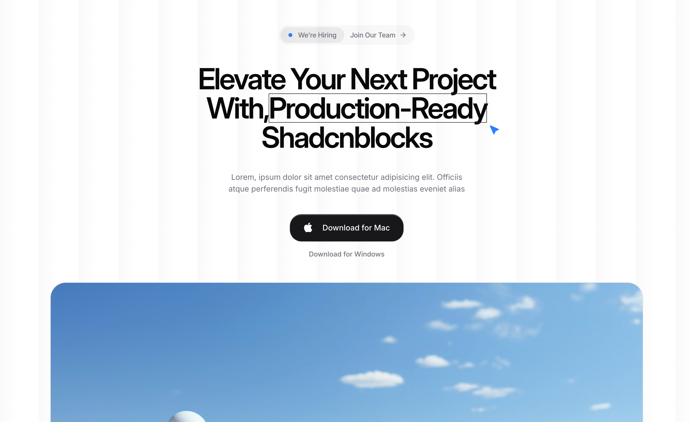

A centered layout with a hiring badge and link at the top, followed by a large heading, body text, and two download buttons stacked vertically. Below this content section, a large image spans the full width at the bottom of the block.

**Install**: `pnpm dlx shadcn add @shadcnblocks/hero245`

---

## hero246

A centered webpage section contains a small label tag at the top, followed by a large heading, body text, and two buttons positioned horizontally below. A bar chart visualization spans the full width at the bottom of the section.

**Install**: `pnpm dlx shadcn add @shadcnblocks/hero246`

---

## hero248

A single-column layout with left-aligned content. At the top, a large heading spans the width with three small images embedded inline. Below the heading is body text, followed by a dark button with white text positioned at the bottom left.

**Install**: `pnpm dlx shadcn add @shadcnblocks/hero248`

---
