# Integration Blocks (13)

Integration showcases displaying compatible tools and services. Feature partner logos and connection options.

---

## integration1

A centered section with a main heading, followed by body text. Below is a grid of six integration cards arranged in two columns, each containing an image, a label, and descriptive text. At the bottom, there is a question prompt on the left with a button positioned to its right.

**Install**: `pnpm dlx shadcn add @shadcnblocks/integration1`

---

## integration2

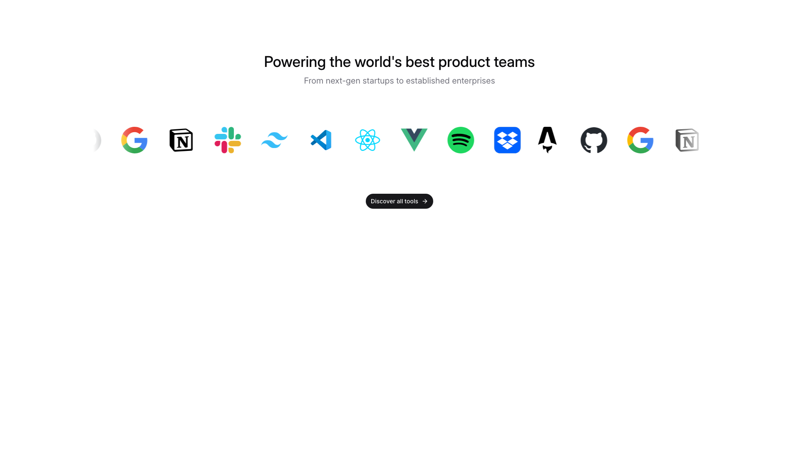

A centered section features a main heading at the top, followed by body text underneath. Below this, a horizontally arranged row of logo images is displayed. A button labeled "Discover all tools" is positioned centrally below the logo row.

**Install**: `pnpm dlx shadcn add @shadcnblocks/integration2`

---

## integration3

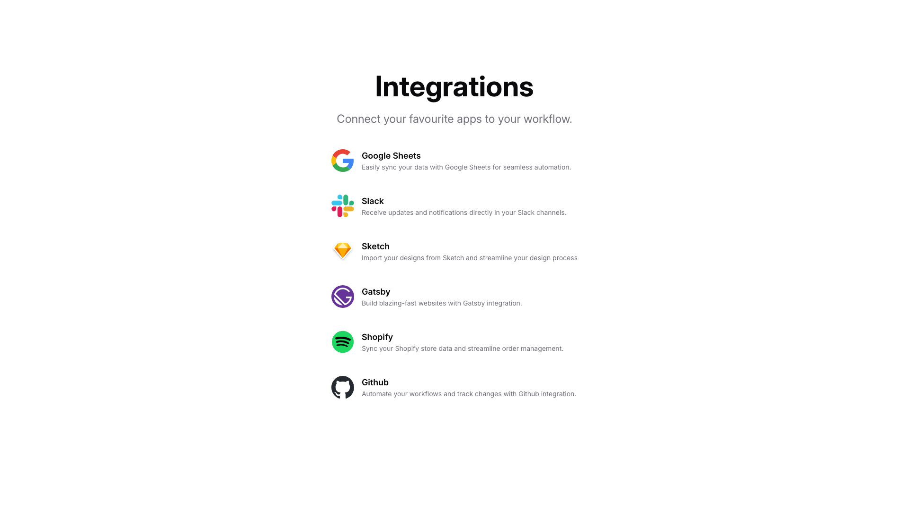

A centered page section displays a main heading with descriptive body text at the top. Below this, six integration options are arranged vertically in a single column, each containing an image icon on the left, followed by a label and descriptive text positioned to the right.

**Install**: `pnpm dlx shadcn add @shadcnblocks/integration3`

---

## integration4

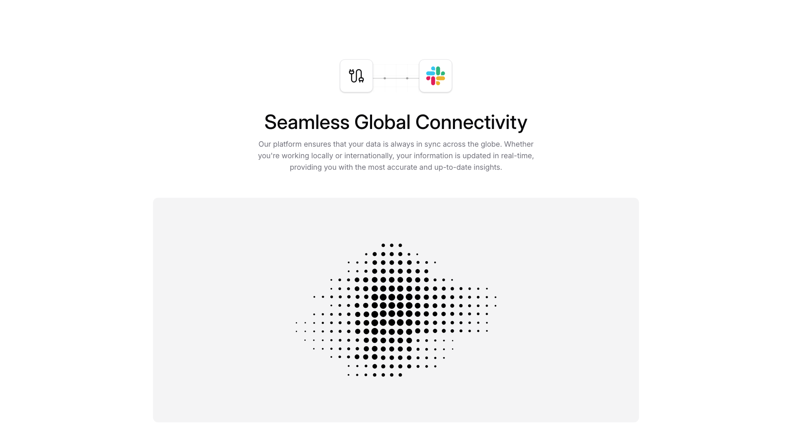

A centered section contains a heading at the top, followed by two small icons connected by a line. Below this is a larger heading, body text describing the feature, and a dotted globe image positioned centrally at the bottom of the section.

**Install**: `pnpm dlx shadcn add @shadcnblocks/integration4`

---

## integration5

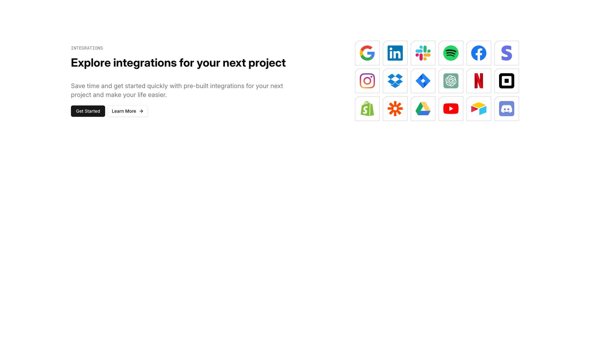

A webpage section is divided into two columns. The left column contains a label, a main heading, body text, and two horizontally-aligned buttons. The right column displays a 3x4 grid of images arranged in three rows, positioned opposite the left column's content.

**Install**: `pnpm dlx shadcn add @shadcnblocks/integration5`

---

## integration6

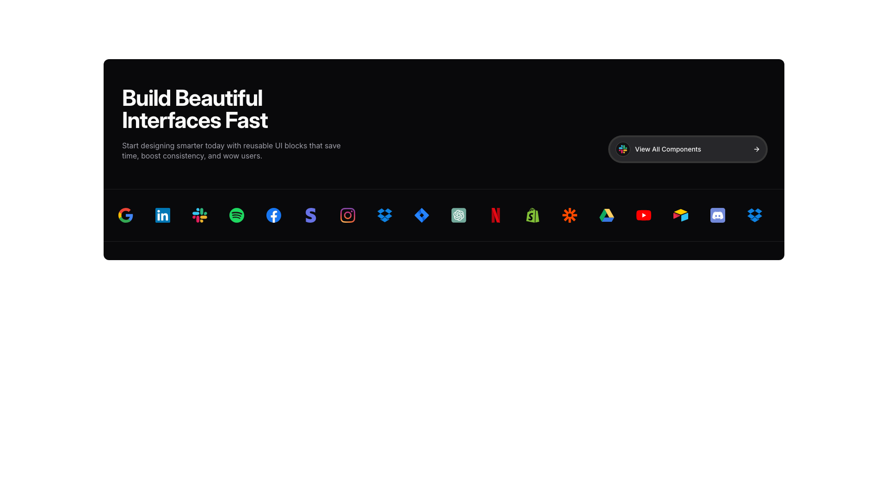

A dark horizontal banner section displays content in two columns. The left column contains a large heading, followed by body text describing UI components. On the right side, a button labeled "View All Components" is positioned in the upper corner. Below the text, a row of logos is displayed horizontally across the full width of the banner.

**Install**: `pnpm dlx shadcn add @shadcnblocks/integration6`

---

## integration7

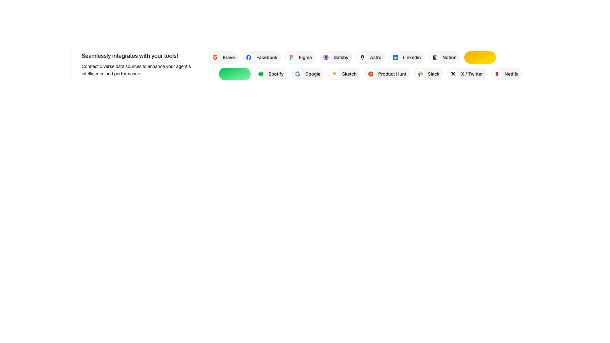

A section displays a heading and body text on the left side, followed by a horizontally arranged row of logos and branded icons spanning across the page. The logos are positioned in two rows, with the top row containing approximately 8 icons and the bottom row containing approximately 8 additional icons, all aligned to the left margin.

**Install**: `pnpm dlx shadcn add @shadcnblocks/integration7`

---

## integration8

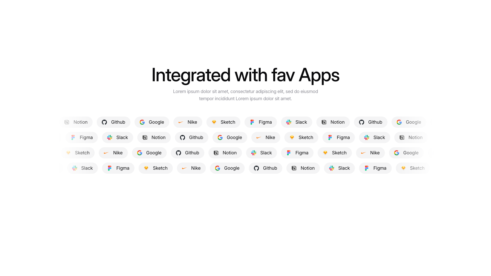

A centered section displays a main heading at the top, followed by body text positioned below it. Underneath the text, four horizontal rows of application logo badges are arranged in a grid pattern, with each badge displaying an icon and label. The logos are evenly distributed across the width of the section.

**Install**: `pnpm dlx shadcn add @shadcnblocks/integration8`

---

## integration9

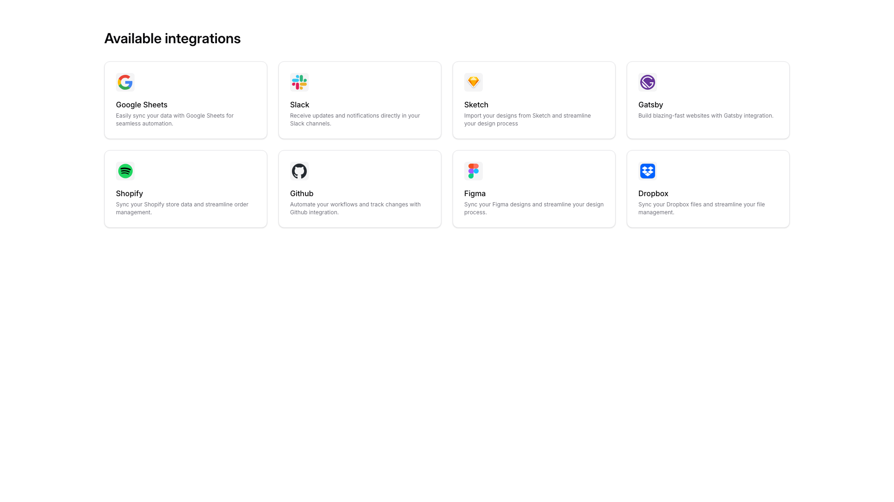

A grid layout displays eight integration options arranged in two rows of four columns. Each integration card contains an image icon positioned at the top, followed by a heading and descriptive body text centered below. The cards are evenly spaced horizontally and vertically across the section.

**Install**: `pnpm dlx shadcn add @shadcnblocks/integration9`

---

## integration10

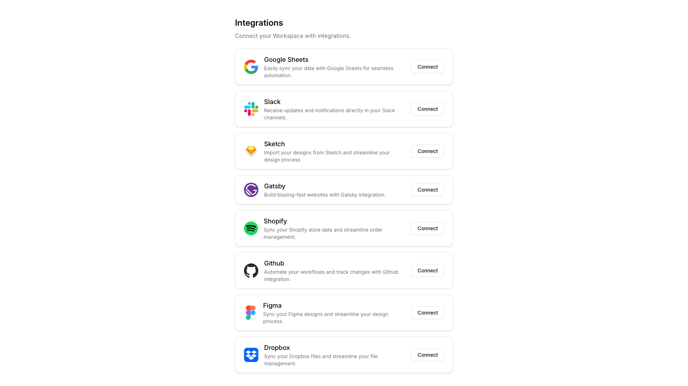

A centered page displays a main heading with descriptive body text at the top. Below this, eight integration options are listed vertically in a single column, with each integration card containing an image on the left, a title and description text in the center, and a "Connect" button positioned on the right.

**Install**: `pnpm dlx shadcn add @shadcnblocks/integration10`

---

## integration11

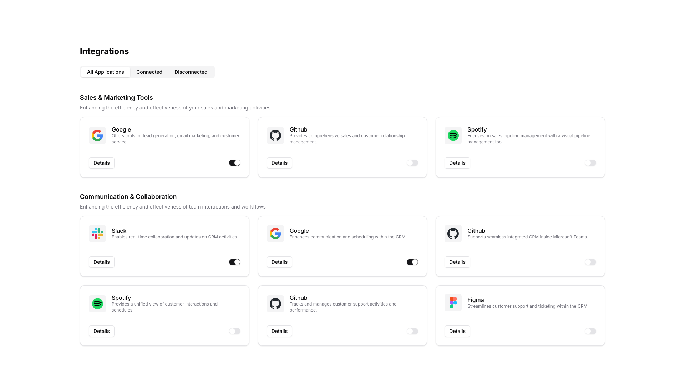

A page section titled "Integrations" contains two category groups stacked vertically. Each group has a category heading, descriptive body text, and three application cards arranged horizontally. Each card displays an image, application name, description text, a "Details" label, and a toggle button positioned on the right.

**Install**: `pnpm dlx shadcn add @shadcnblocks/integration11`

---

## integration12

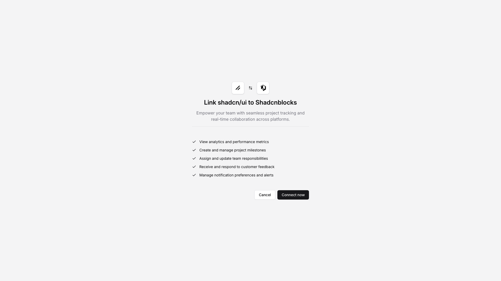

A centered modal dialog displays a heading with accompanying icons at the top, followed by descriptive body text. Below this, a bulleted list of five items is vertically stacked in the center. At the bottom, two buttons are horizontally positioned side-by-side, with one on the left and one on the right.

**Install**: `pnpm dlx shadcn add @shadcnblocks/integration12`

---

## integration13

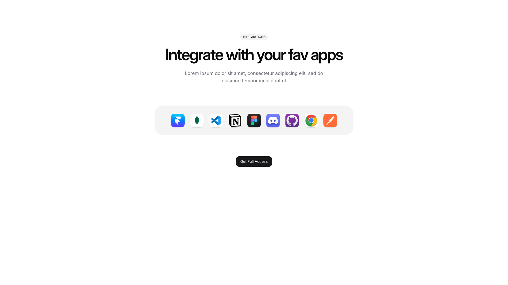

A centered section displays a label at the top, followed by a large heading and body text. Below the text, a row of app icons is horizontally aligned and centered. A button is positioned below the icons.

**Install**: `pnpm dlx shadcn add @shadcnblocks/integration13`

---
