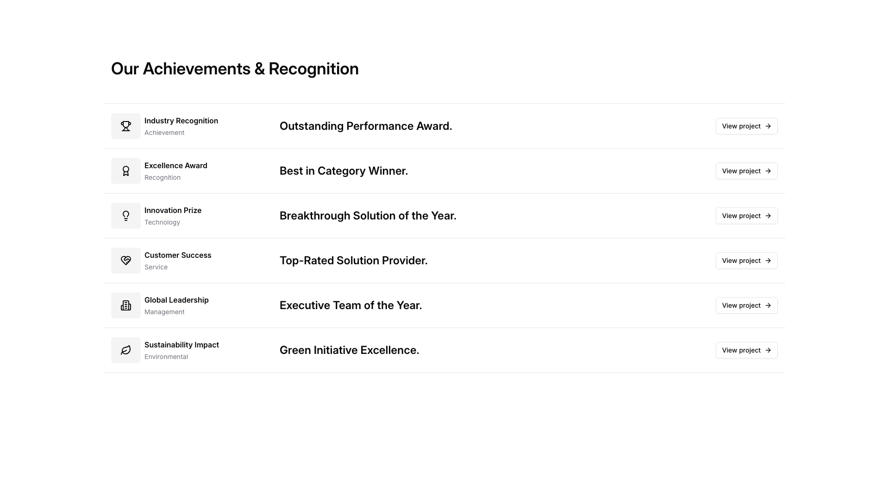
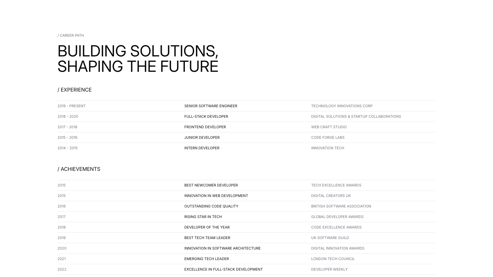

# List Blocks (3)

List layouts for organized content presentation. Display items in structured, scannable formats.

---

## list1

A table layout with seven rows and five columns displaying product information. Column headers are positioned horizontally across the top, with an icon column on the left followed by Category, Description, Year, Offer, and Segment columns. Each row contains an icon on the left, followed by text entries and colored labels aligned to the right side of the table.

**Install**: `pnpm dlx shadcn add @shadcnblocks/list1`

---

## list2

A vertical list layout displaying six achievement items. Each item is organized horizontally with an icon on the left, followed by a category label and main heading in the center-left area, and a "View project" link aligned to the right. The items are stacked vertically with consistent spacing between them.

**Install**: `pnpm dlx shadcn add @shadcnblocks/list2`

---

## list3

A resume section displays professional information in a structured layout with multiple rows. At the top, a large heading is centered, followed by two main subsections organized vertically: "Experience" and "Achievements." Each subsection contains horizontally aligned rows with three columns—dates on the left, job titles or award names in the center, and company or organization names on the right.

**Install**: `pnpm dlx shadcn add @shadcnblocks/list3`

---
