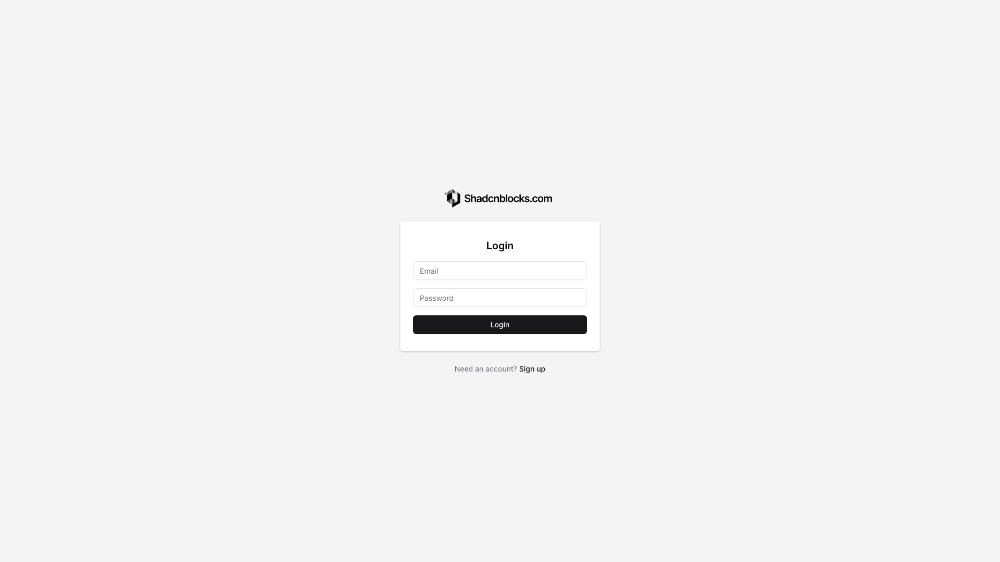
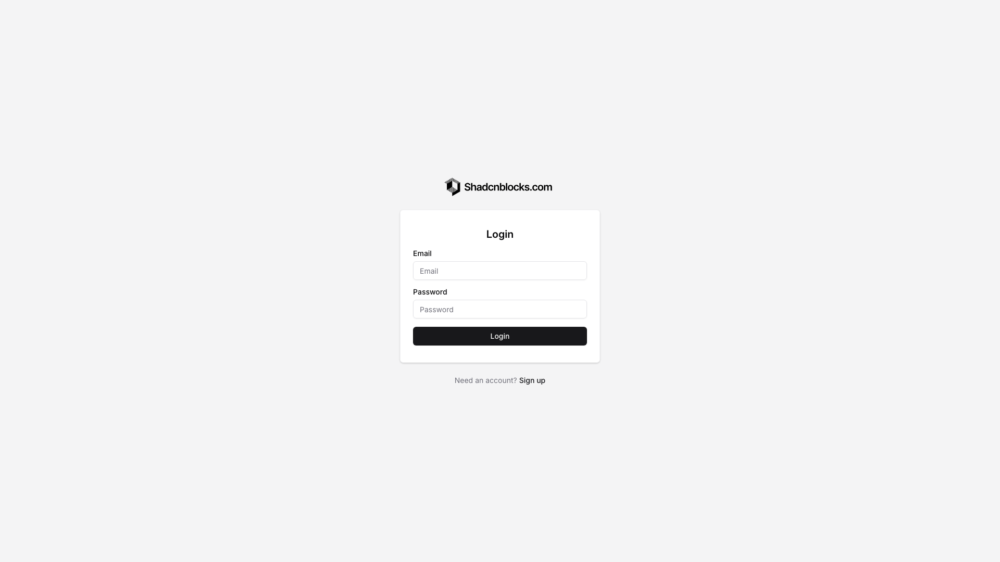
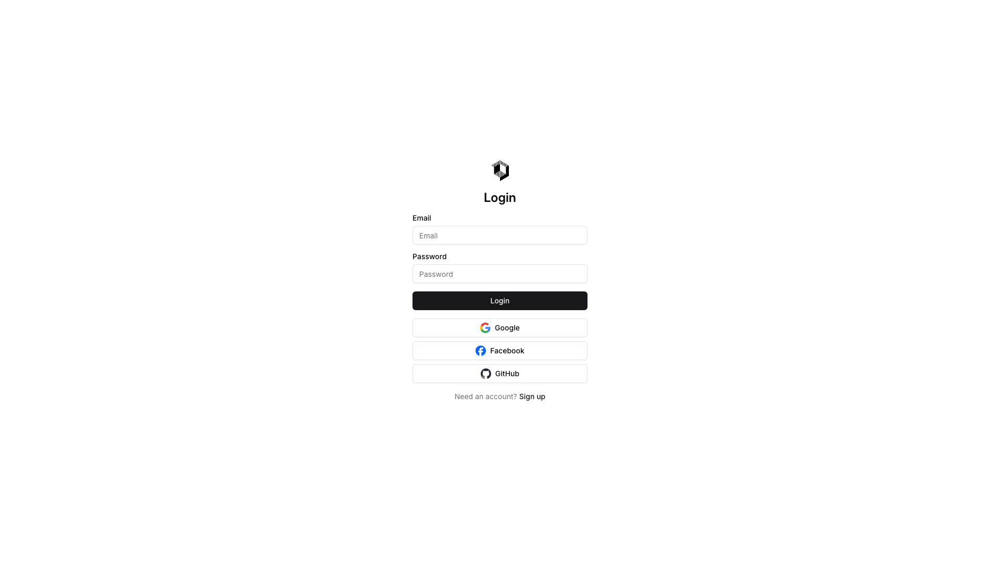
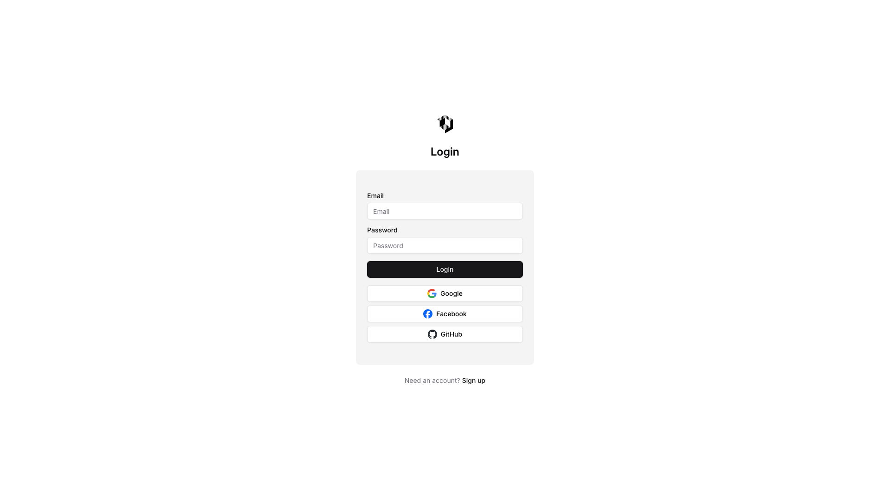
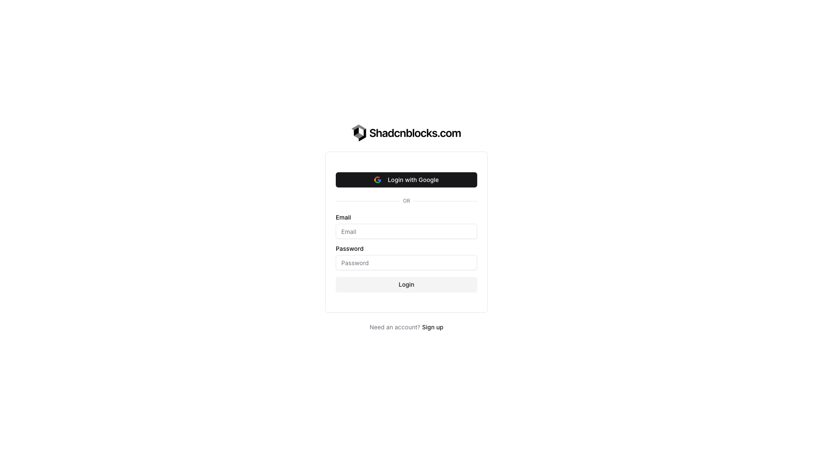
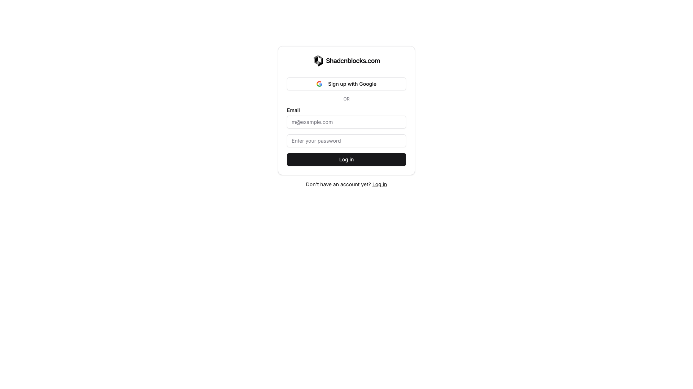

# Login Blocks (7)

Login and authentication forms for user access. Secure entry points with credential validation.

---

## login1

A login form is centered on the page, consisting of a logo image at the top, followed by a "Login" heading. Below are two vertically stacked input fields for email and password, a black button labeled "Login", and body text with a "Sign up" link positioned at the bottom.

**Install**: `pnpm dlx shadcn add @shadcnblocks/login1`

---

## login2

A login form is centered on the page, positioned vertically with a logo image at the top. Below the logo is a heading, followed by two labeled text input fields stacked vertically. A button spans the full width at the bottom of the form, with body text and a link positioned below the form.

**Install**: `pnpm dlx shadcn add @shadcnblocks/login2`

---

## login3

A centered login form with a vertical layout. At the top is an image logo, followed by a "Login" heading. Below are two input fields labeled "Email" and "Password," stacked vertically. A full-width button labeled "Login" sits beneath the inputs. At the bottom, body text with an embedded "Sign up" link is centered.

**Install**: `pnpm dlx shadcn add @shadcnblocks/login3`

---

## login4

A centered login interface displays a logo at the top, followed by vertically stacked input fields for email and password. Below the inputs sits a primary button, with three secondary authentication buttons arranged vertically underneath. At the bottom, body text with a linked action directs users to sign up.

**Install**: `pnpm dlx shadcn add @shadcnblocks/login4`

---

## login5

A centered login form displays vertically with an image at the top, followed by a heading. Below are two input fields for email and password, stacked vertically, then a primary button. Three secondary buttons for social login options (Google, Facebook, GitHub) are arranged vertically below. At the bottom, body text with a linked "Sign up" option is centered.

**Install**: `pnpm dlx shadcn add @shadcnblocks/login5`

---

## login6

A login form is centered vertically and horizontally on the page. At the top is a heading with an image, followed by a "Login with Google" button and an "OR" divider. Below are two stacked input fields labeled "Email" and "Password," with a "Login" button positioned underneath. At the bottom is body text with a link to sign up for a new account.

**Install**: `pnpm dlx shadcn add @shadcnblocks/login6`

---

## login7

A centered login form displays vertically with a logo at the top, followed by a "Sign up with Google" button. Below a divider marked "OR", there are two input fields stacked vertically for email and password entry. A "Log in" button is positioned below the form fields, with a sign-up link centered at the bottom.

**Install**: `pnpm dlx shadcn add @shadcnblocks/login7`

---
