# Logos Blocks (12)

Logo grids showcasing clients, partners, or supported platforms. Build credibility through brand associations.

---

## logos1

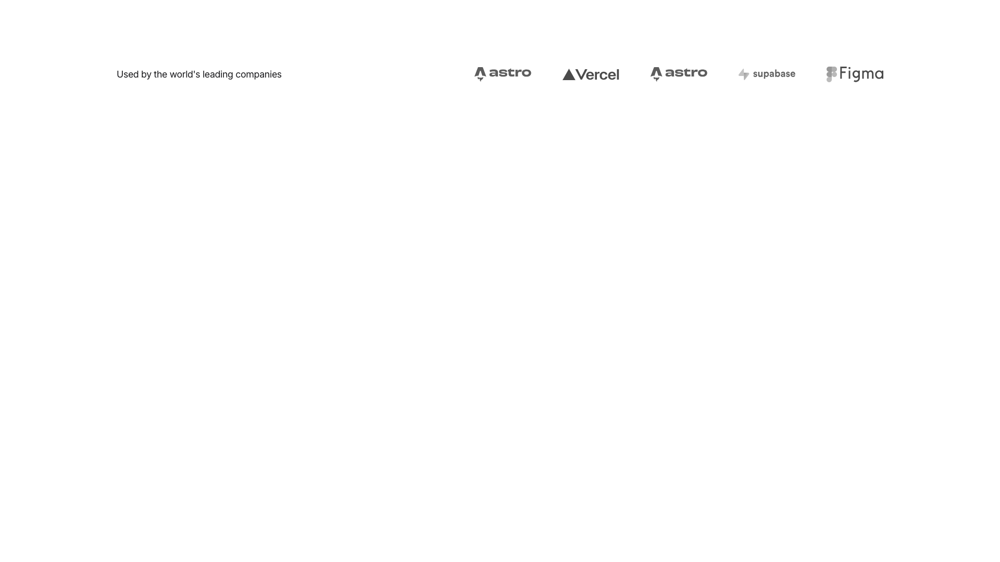

A header section displays text on the left side reading "Used by the world's leading companies," with five company logos arranged horizontally on the right side.

**Install**: `pnpm dlx shadcn add @shadcnblocks/logos1`

---

## logos2

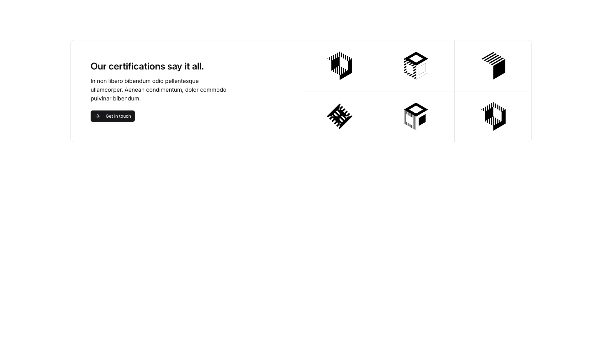

A section displays content in two columns with a left-aligned layout. The left column contains a heading, body text, and a button stacked vertically. The right side features a grid of six images arranged in three columns and two rows, positioned horizontally across the section.

**Install**: `pnpm dlx shadcn add @shadcnblocks/logos2`

---

## logos3

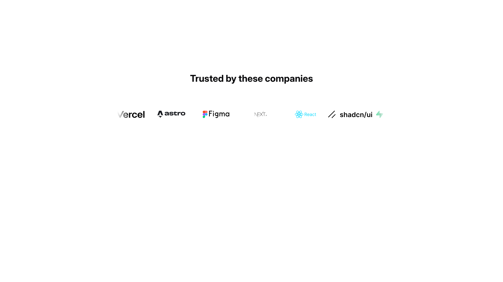

A centered section displays a heading at the top, with six company logos arranged horizontally below it in a single row. The logos are evenly distributed across the width of the section.

**Install**: `pnpm dlx shadcn add @shadcnblocks/logos3`

---

## logos4

A centered section displays a label at the top, followed by a large heading and body text. Below the text is a button, also centered. Underneath, a grid of partner logos is arranged horizontally across multiple rows, with images displayed in a balanced layout.

**Install**: `pnpm dlx shadcn add @shadcnblocks/logos4`

---

## logos5

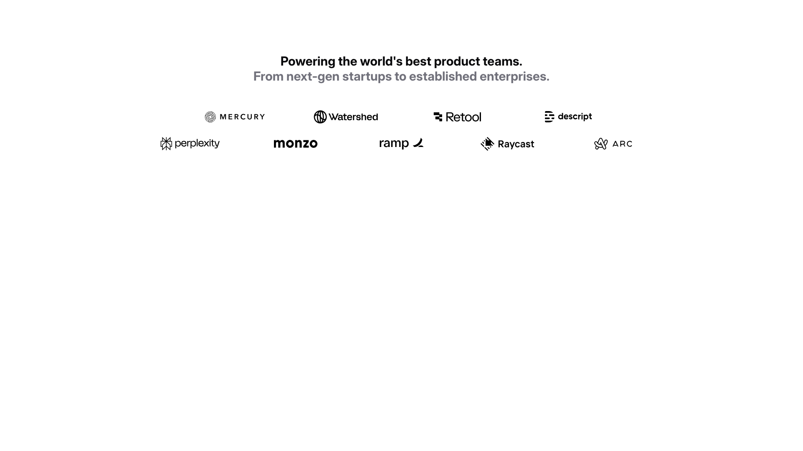

A centered section displays a main heading at the top, followed by a subtitle beneath it. Below the text, nine company logos are arranged horizontally in two rows—three logos in the top row and six logos distributed across the bottom row, all positioned at the center of the layout.

**Install**: `pnpm dlx shadcn add @shadcnblocks/logos5`

---

## logos7

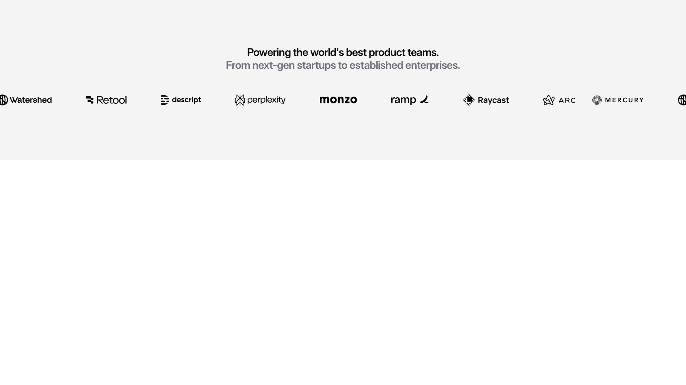

A centered header section displays a main heading followed by body text. Below this, a horizontal row of company logos is arranged evenly across the width of the page, with additional logo elements positioned at the far left and right edges.

**Install**: `pnpm dlx shadcn add @shadcnblocks/logos7`

---

## logos8

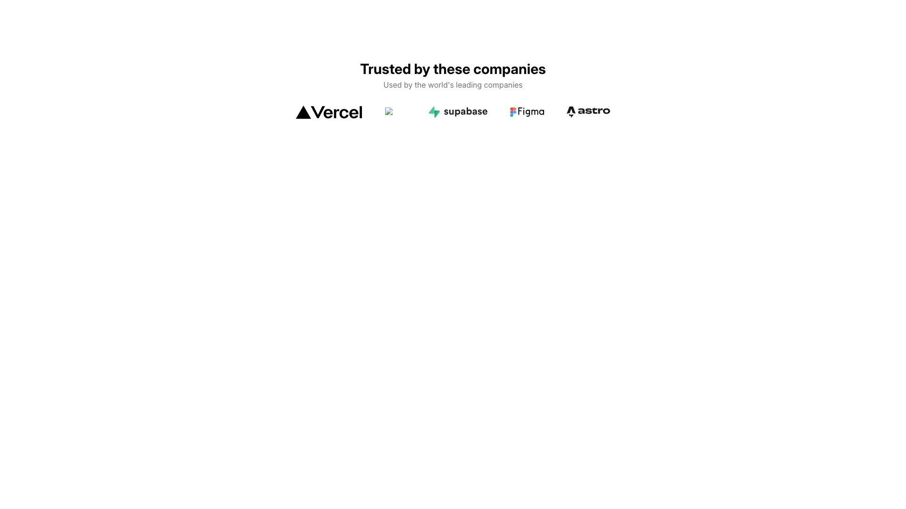

A centered section displays a main heading "Trusted by these companies" with supporting body text underneath. Below this text, five company logos are arranged horizontally in a row, centered on the page.

**Install**: `pnpm dlx shadcn add @shadcnblocks/logos8`

---

## logos9

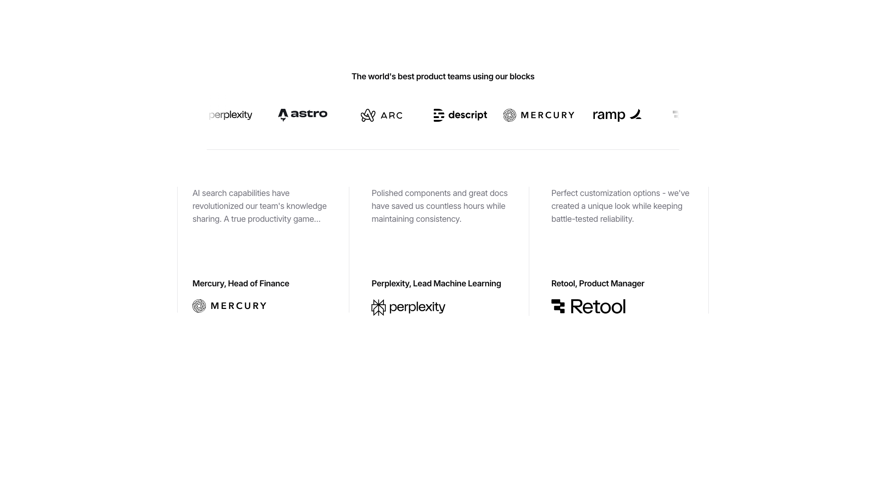

A section displays a centered heading at the top, followed by a horizontally-arranged row of company logos. Below this, three testimonial cards are positioned side-by-side in equal columns. Each card contains body text at the top, with a job title, company name, and company logo aligned at the bottom.

**Install**: `pnpm dlx shadcn add @shadcnblocks/logos9`

---

## logos10

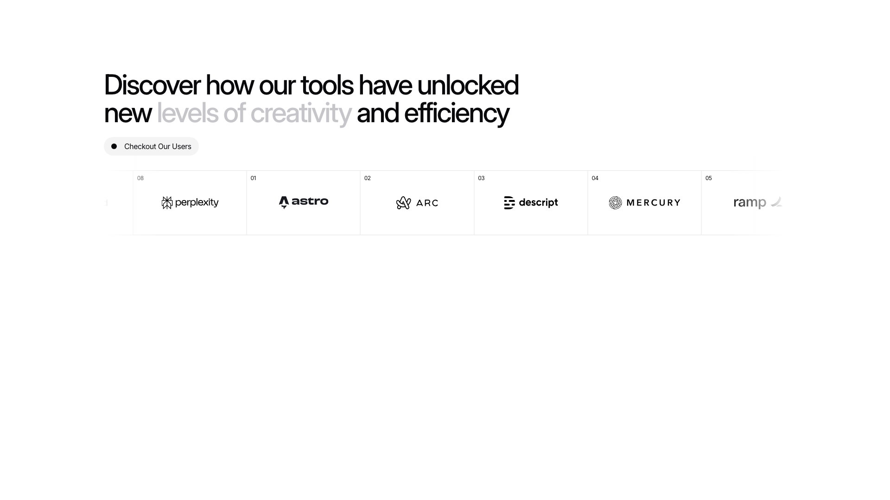

A section displays a large heading at the top, with body text underneath. Below this, a bullet point with a label appears on the left. Further down, a horizontal timeline spans the full width, featuring six numbered positions (08, 01, 02, 03, 04, 05) with corresponding images and logos aligned vertically beneath each marker.

**Install**: `pnpm dlx shadcn add @shadcnblocks/logos10`

---

## logos11

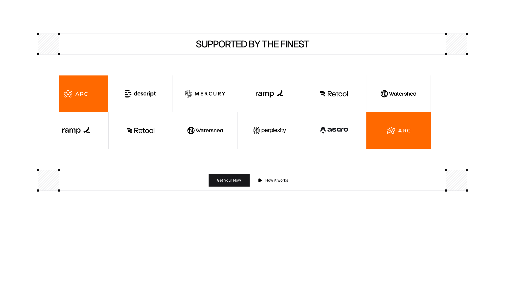

A webpage section displays a centered heading at the top, with two rows of logos and text labels arranged horizontally below. The first row contains three logo/text combinations positioned on the left, center, and right. The second row mirrors this layout with three additional logo/text pairs. Two orange rectangular blocks with logos are positioned on the left and right sides of the layout. At the bottom, two buttons are centered horizontally.

**Install**: `pnpm dlx shadcn add @shadcnblocks/logos11`

---

## logos12

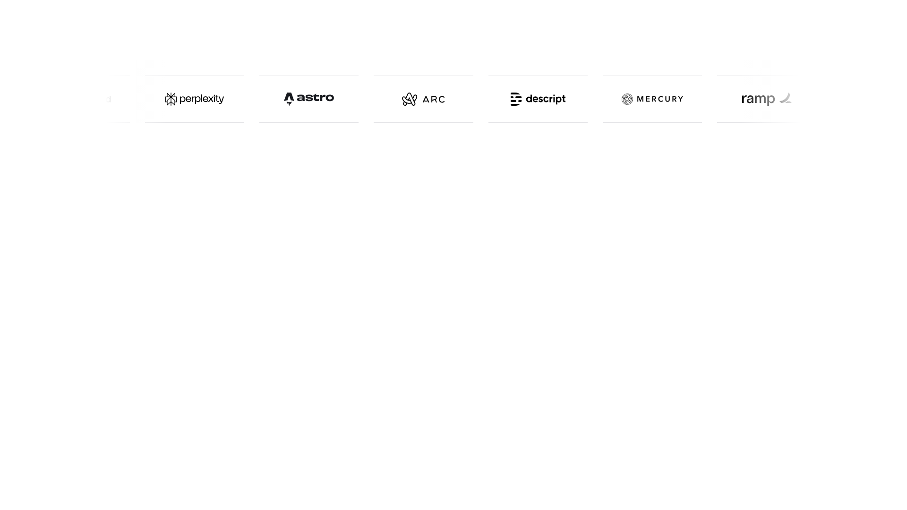

A horizontal navigation bar displays six company logos evenly spaced across the width of the page. The logos are centered vertically within the bar and positioned from left to right in a single row.

**Install**: `pnpm dlx shadcn add @shadcnblocks/logos12`

---

## logos13

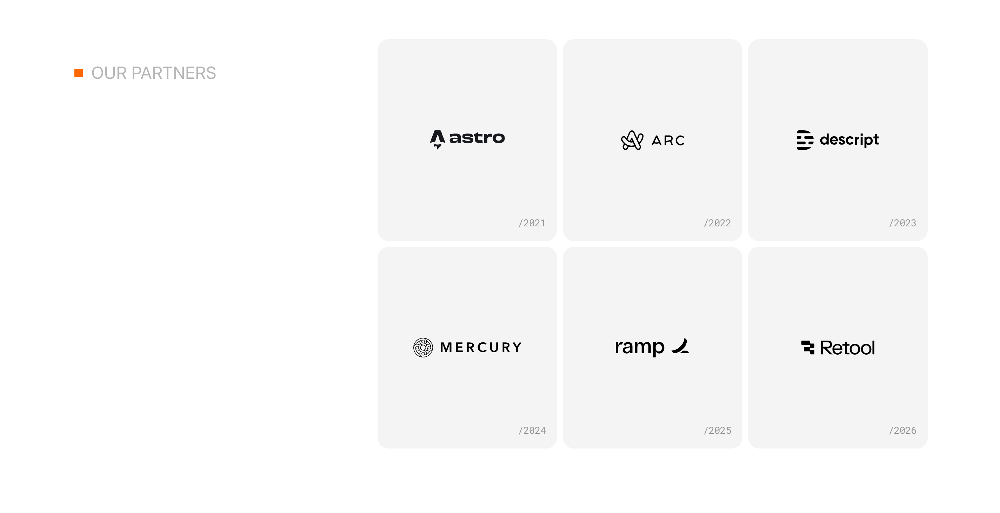

A section titled "OUR PARTNERS" on the left is followed by a grid layout displaying six partner cards arranged in three columns and two rows. Each card contains a centered logo image with a year label positioned at the bottom right (/2021 through /2026).

**Install**: `pnpm dlx shadcn add @shadcnblocks/logos13`

---
