# Navbar Blocks (16)

Navigation bars and menu components for site headers. Provide intuitive site-wide navigation.

---

## navbar1

A horizontal navigation bar is positioned at the top of the page. On the left side is a logo, followed by a series of navigation links (Home, Products, Resources, Pricing, Blog) centered in the middle. On the right side, two buttons (Login and Sign up) are aligned horizontally.

**Install**: `pnpm dlx shadcn add @shadcnblocks/navbar1`

---

## navbar2

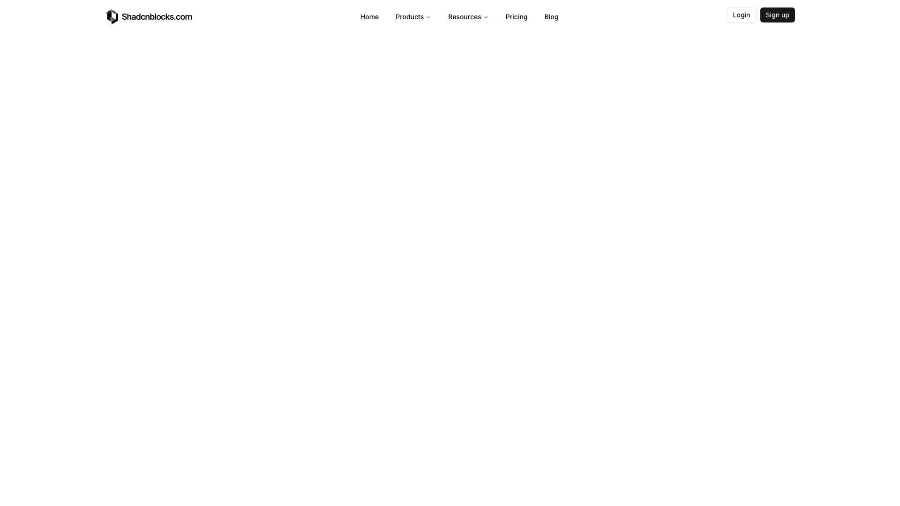

A horizontal navigation bar spans the top of the page with a logo positioned on the left side. To the right of the logo, several menu links are arranged horizontally, followed by Login and Sign up buttons aligned to the far right. The rest of the page appears to be blank white space.

**Install**: `pnpm dlx shadcn add @shadcnblocks/navbar2`

---

## navbar3

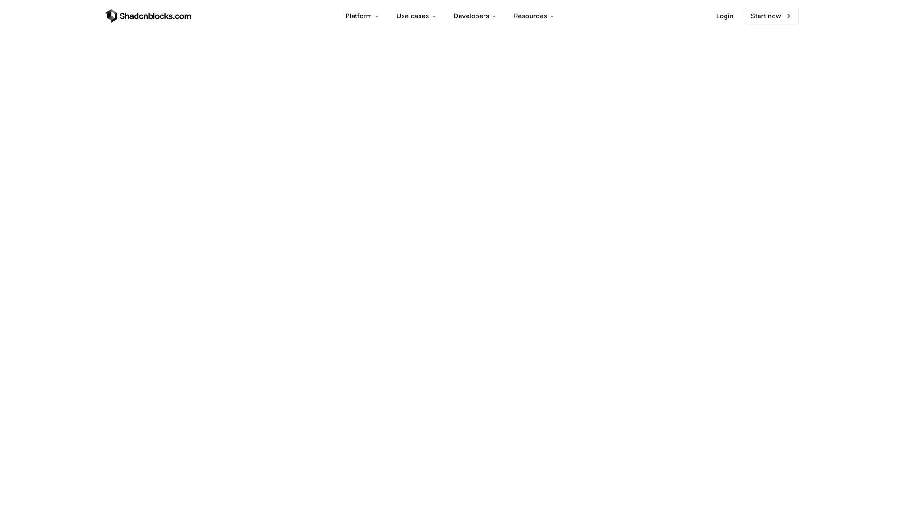

A horizontal navigation header is positioned at the top of the page, spanning the full width. On the left side sits a logo, while the center contains four dropdown menu labels arranged horizontally. The right side displays two action elements: a "Login" label and a "Start now" button with an arrow icon.

**Install**: `pnpm dlx shadcn add @shadcnblocks/navbar3`

---

## navbar4

A horizontal navigation bar spans the top of the page with a logo positioned on the left side. To the right of the logo, several menu items are arranged horizontally, followed by a login button aligned to the far right. The rest of the page appears to be blank white space.

**Install**: `pnpm dlx shadcn add @shadcnblocks/navbar4`

---

## navbar5

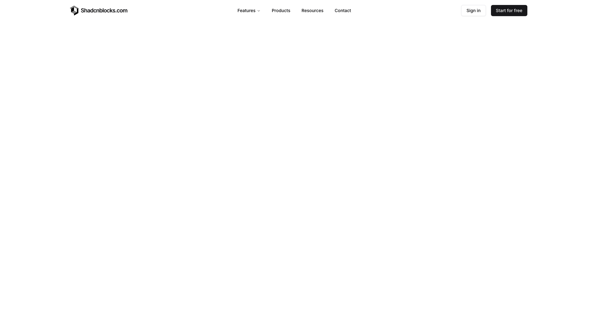

A horizontal navigation bar spans the top of the page with an image logo positioned on the left. To the right of the logo, several text links are arranged horizontally in the center, followed by two buttons aligned to the right side of the header.

**Install**: `pnpm dlx shadcn add @shadcnblocks/navbar5`

---

## navbar6

A header navigation bar is horizontally centered at the top of the page. On the left sits a logo image, while the right side contains a series of text links and a button aligned horizontally. The navigation includes menu items for Features, About Us, Pricing, FAQ, and Contact, with a Login button positioned at the far right.

**Install**: `pnpm dlx shadcn add @shadcnblocks/navbar6`

---

## navbar7

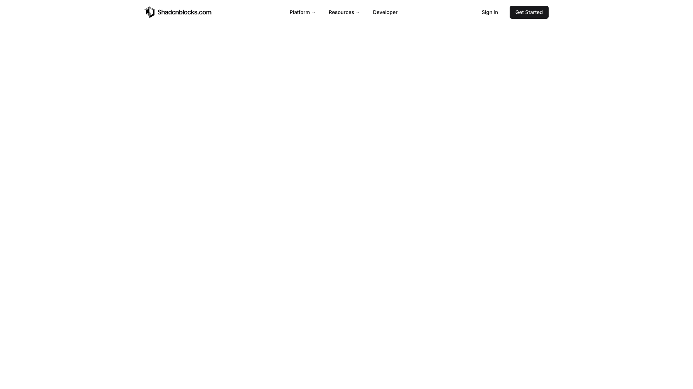

A navigation header spans horizontally across the top of the page. On the left is a logo image, while the center contains three navigation menu labels. On the right side, two buttons are positioned horizontally—a "Sign in" label and a "Get Started" button.

**Install**: `pnpm dlx shadcn add @shadcnblocks/navbar7`

---

## navbar8

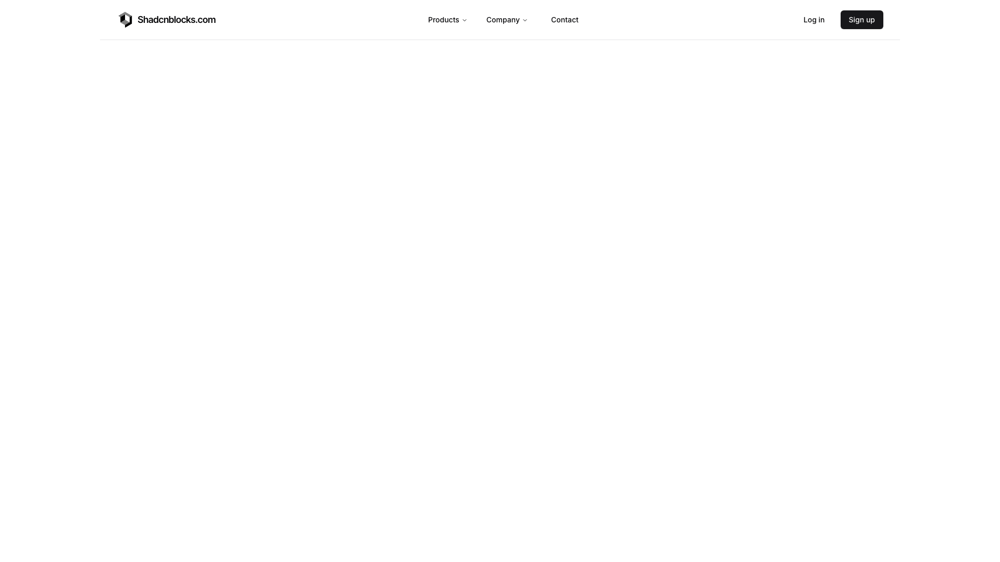

A horizontal navigation bar spans the top of the page. On the left is a logo image, while the center contains three dropdown menu labels. On the right side are two buttons positioned horizontally—a "Log in" button and a "Sign up" button.

**Install**: `pnpm dlx shadcn add @shadcnblocks/navbar8`

---

## navbar9

A horizontal navigation bar spans the full width at the top with a logo positioned on the left, followed by a series of menu links (Products, Company, Resources, Pricing, Contact) centered in the middle, and action buttons (GitHub icon with follower count and Sign up) aligned on the right. Below the navigation bar is a large, empty content area with a light background.

**Install**: `pnpm dlx shadcn add @shadcnblocks/navbar9`

---

## navbar14

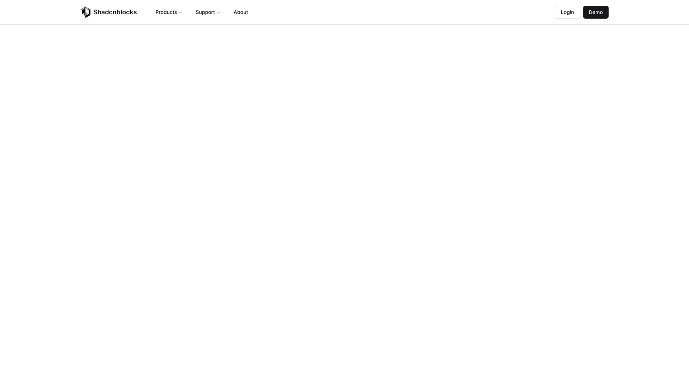

A navigation header spans horizontally across the top of the page, containing a logo on the left, followed by three menu items centered in the middle (Products, Support, About). On the right side of the header, two buttons are positioned horizontally (Login and Demo).

**Install**: `pnpm dlx shadcn add @shadcnblocks/navbar14`

---

## navbar17

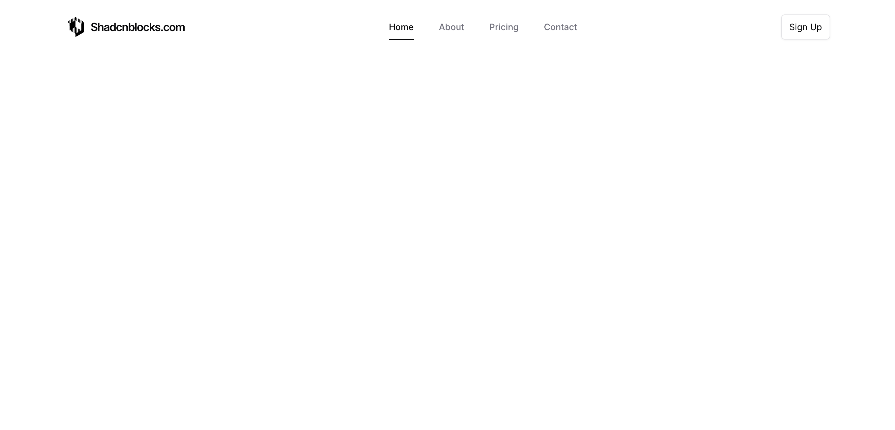

A horizontal navigation bar spans the top of the page with a logo positioned on the left side, followed by a centered menu containing four navigation links. On the right side of the header, a "Sign Up" button is aligned to the far right. The remainder of the page appears to be blank white space.

**Install**: `pnpm dlx shadcn add @shadcnblocks/navbar17`

---

## navbar18

A horizontal navigation bar is centered at the top of the page. It contains a logo image on the left, followed by four menu items ("Products," "Resources," "Integration," and "Log in") arranged horizontally to the right.

**Install**: `pnpm dlx shadcn add @shadcnblocks/navbar18`

---

## navbar21

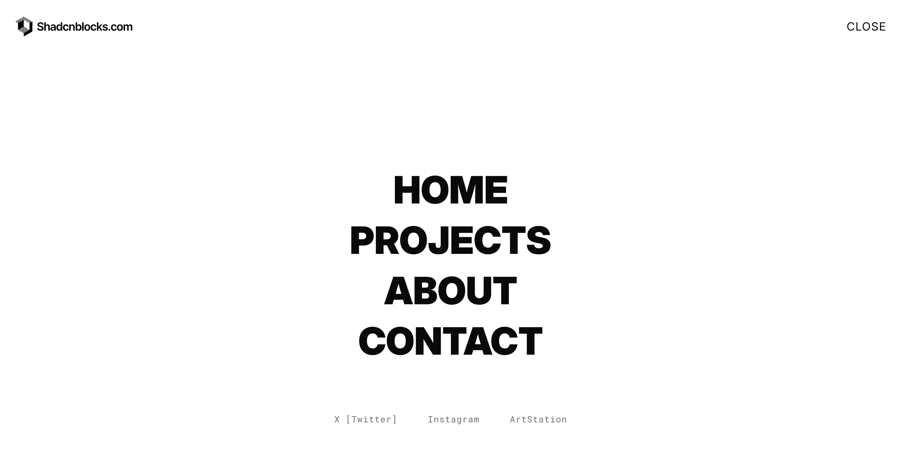

A centered webpage layout displays a vertical stack of headings reading "HOME," "PROJECTS," "ABOUT," and "CONTACT" in the middle of the screen. Below this text stack, positioned near the bottom, are several horizontally-aligned labels including social media links. A "CLOSE" button appears in the top right corner.

**Install**: `pnpm dlx shadcn add @shadcnblocks/navbar21`

---

## navbar22

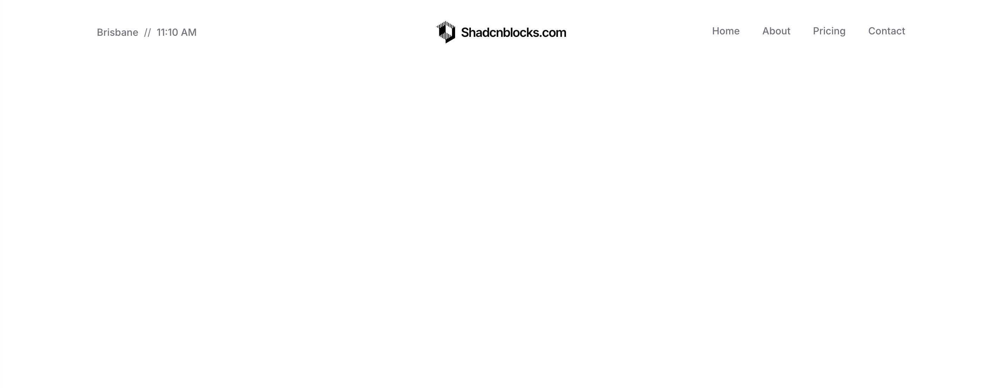

A website header is displayed with a horizontal layout. On the left side, there is location and time information. The center contains a logo with accompanying text. On the right side, a navigation menu with multiple links is horizontally aligned.

**Install**: `pnpm dlx shadcn add @shadcnblocks/navbar22`

---

## navbar24

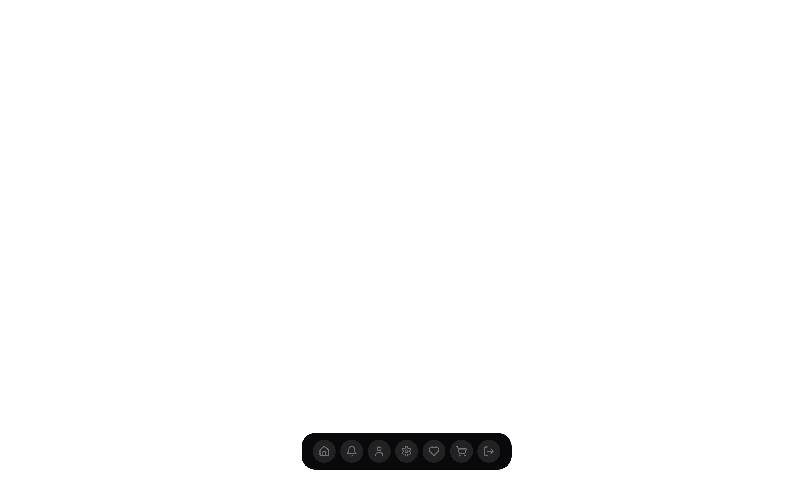

A horizontal navigation bar is centered at the bottom of the screen, containing seven icon buttons arranged in a row. Each button appears to be evenly spaced within a dark rounded container.

**Install**: `pnpm dlx shadcn add @shadcnblocks/navbar24`

---

## navbar29

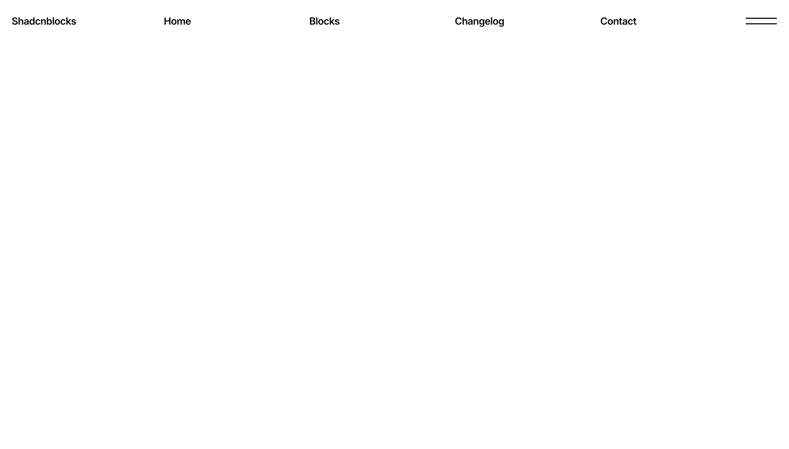

A navigation header spans horizontally across the top of the page. On the left side is a logo/brand name, while the center and right portions contain a series of navigation links positioned horizontally. A menu icon appears on the far right side of the header.

**Install**: `pnpm dlx shadcn add @shadcnblocks/navbar29`

---
