# Pricing Blocks (35)

Pricing tables and tier comparisons for subscription services. Display plans, features, and cost structures.

---

## pricing1

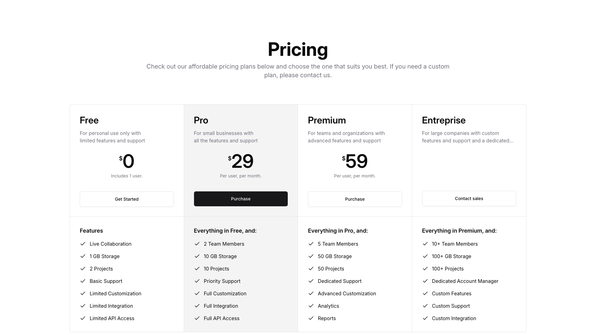

A centered pricing page displays a main heading followed by descriptive body text at the top. Below this, four pricing plan cards are arranged horizontally in a grid layout, each containing a plan name, description, price, a call-to-action button, and a vertical list of features with checkmarks. The cards progress from left to right with increasing detail and pricing tiers.

**Install**: `pnpm dlx shadcn add @shadcnblocks/pricing1`

---

## pricing2

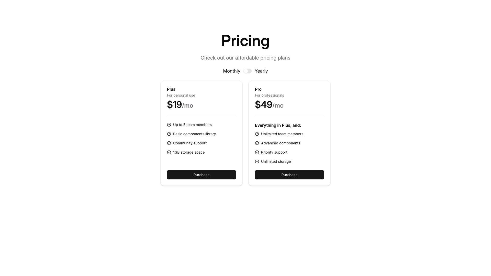

A pricing section displays a centered heading with subheading and toggle options at the top. Below, two pricing cards are arranged horizontally side-by-side, each containing a plan name, descriptor label, price, feature list with checkmarks, and a button at the bottom.

**Install**: `pnpm dlx shadcn add @shadcnblocks/pricing2`

---

## pricing3

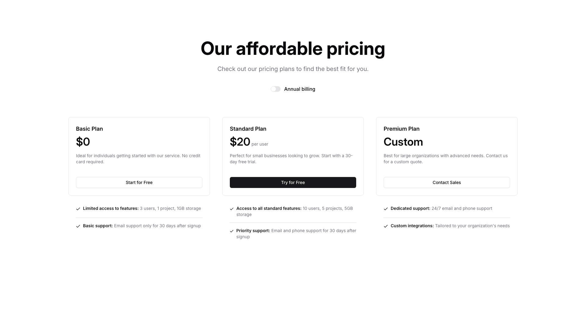

A pricing section displays three vertically stacked pricing plan cards arranged horizontally across the layout. Each card contains a plan name heading, price information, descriptive body text, and a call-to-action button. Below each card are bullet points listing features and support details. At the top of the section, a main heading and subheading are centered, with a toggle control for billing options positioned beneath them.

**Install**: `pnpm dlx shadcn add @shadcnblocks/pricing3`

---

## pricing4

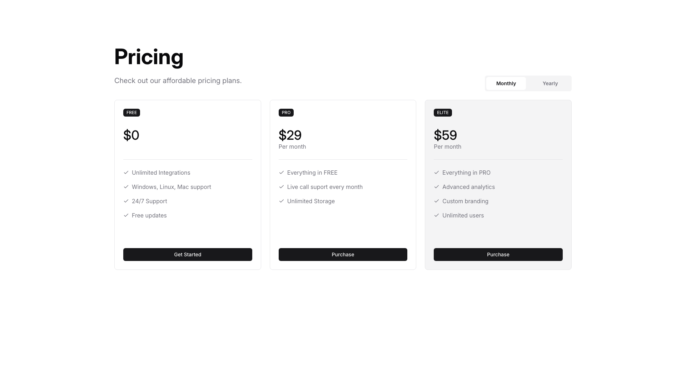

A pricing section displays three vertically stacked pricing cards arranged horizontally across the page. Each card contains a label tag at the top, a price heading, descriptive body text, and a button aligned to the bottom. Above the cards, a main heading and subheading are positioned at the top left, with toggle buttons for billing frequency centered in the top right.

**Install**: `pnpm dlx shadcn add @shadcnblocks/pricing4`

---

## pricing5

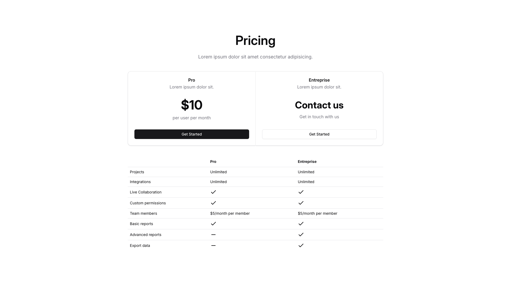

A centered pricing page displays a main heading followed by body text at the top. Below, two pricing cards are arranged horizontally, each containing a tier label, description text, pricing information, and a button. A detailed comparison table is positioned underneath, with feature labels in the left column and checkmarks or dashes indicating availability across the two plan columns.

**Install**: `pnpm dlx shadcn add @shadcnblocks/pricing5`

---

## pricing6

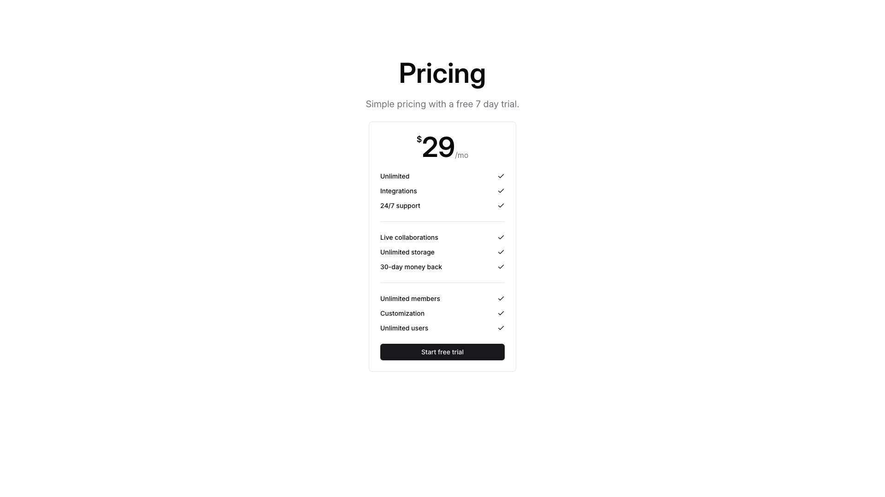

A centered pricing section displays a vertical layout with a main heading at the top, followed by body text. Below this is a pricing card containing a price amount, a list of features with checkmarks positioned to the right of each item, and a call-to-action button at the bottom of the card.

**Install**: `pnpm dlx shadcn add @shadcnblocks/pricing6`

---

## pricing7

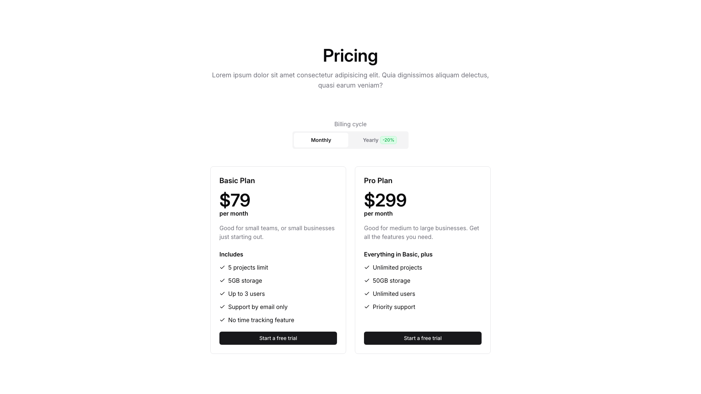

A pricing section is structured vertically with a centered heading and descriptive body text at the top. Below this, a billing cycle toggle is positioned centrally, followed by two pricing plan cards arranged horizontally side-by-side. Each card contains a plan name, price, description text, a bulleted feature list, and a button at the bottom.

**Install**: `pnpm dlx shadcn add @shadcnblocks/pricing7`

---

## pricing8

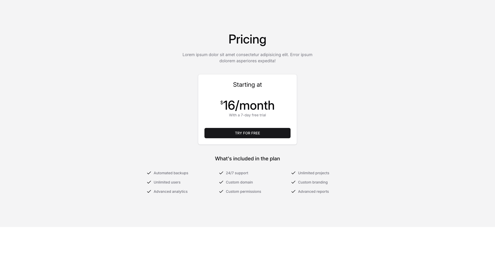

A centered pricing section features a main heading at the top followed by body text. Below this is a card containing "Starting at" label text, a large price display, a subheading, and a button. Underneath the card is another heading followed by three columns of checklist items arranged horizontally, each column containing multiple labeled items with checkmarks.

**Install**: `pnpm dlx shadcn add @shadcnblocks/pricing8`

---

## pricing9

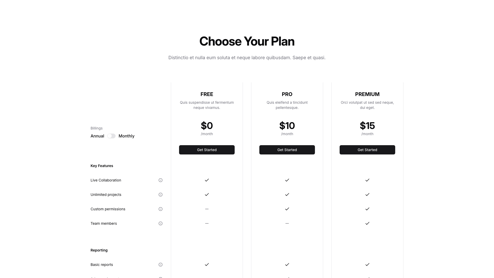

A centered layout displays a main heading with descriptive body text at the top. Below this, a billing toggle ("Annual" and "Monthly") sits on the left side. Three pricing plan cards are arranged horizontally, each containing a plan title, description text, price, "Get Started" button, and a vertically stacked features list with checkmarks and dashes indicating included or unavailable features. Feature categories are labeled on the left side, with their corresponding availability shown across the three plan columns.

**Install**: `pnpm dlx shadcn add @shadcnblocks/pricing9`

---

## pricing10

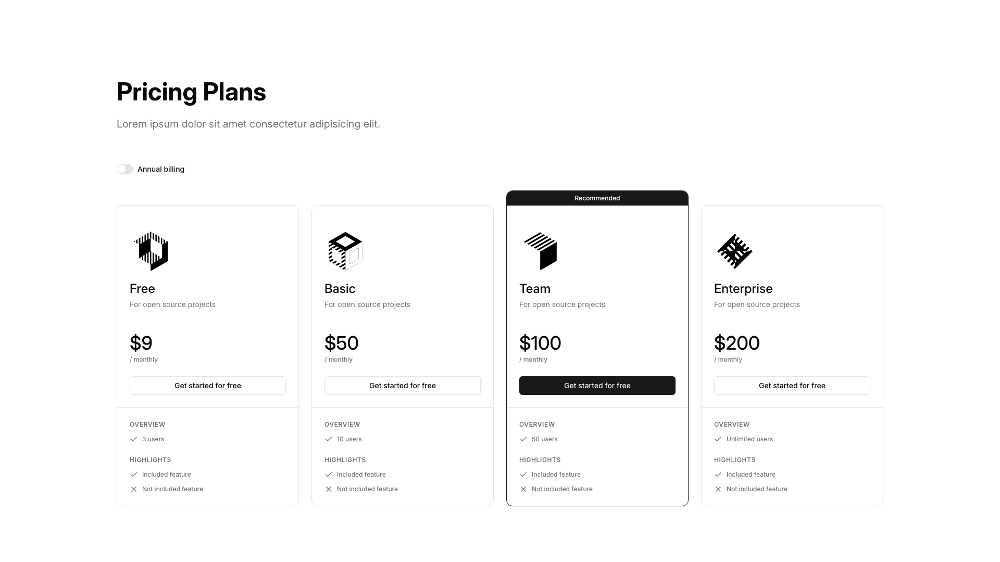

A pricing section displays four vertically stacked pricing cards arranged horizontally across the page. Each card contains an image at the top, followed by a heading, subheading, price, and a button centered within the card. Below these elements are two labeled sections with checkmark and X icons listing features. The third card is highlighted with a "Recommended" label at the top and a darker background to distinguish it from the others.

**Install**: `pnpm dlx shadcn add @shadcnblocks/pricing10`

---

## pricing11

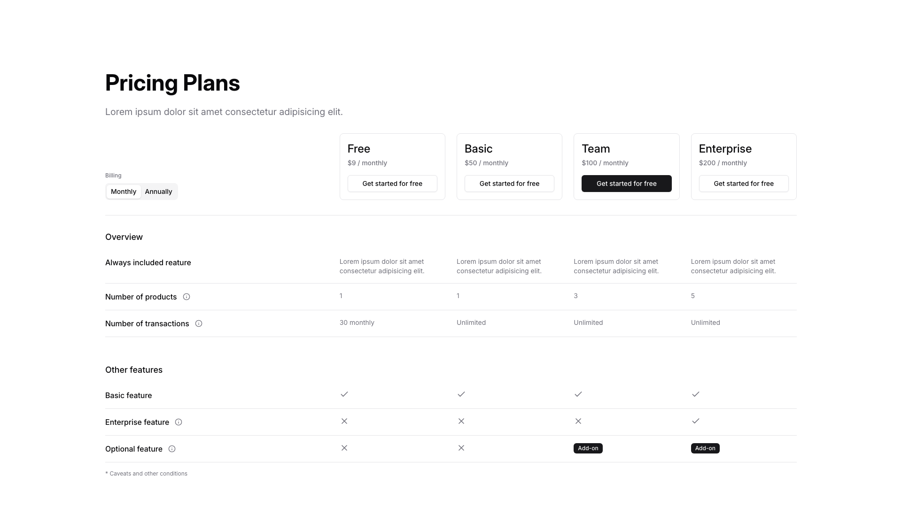

A pricing comparison table displays four vertically stacked pricing tiers across columns, each with a heading, price label, and a button centered below. Below the tier cards, a detailed comparison matrix lists features in rows on the left, with corresponding checkmarks, X marks, and "Add-on" labels aligned in columns under each pricing tier. A billing toggle and descriptive body text appear above the pricing cards.

**Install**: `pnpm dlx shadcn add @shadcnblocks/pricing11`

---

## pricing12

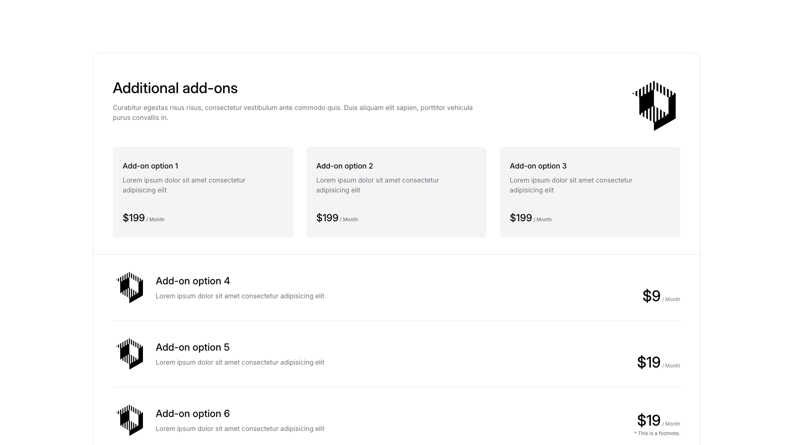

A pricing section titled "Additional add-ons" with descriptive body text is positioned at the top. Below, three pricing cards are arranged horizontally in a grid, each containing a heading, description text, and a price label. Underneath, three additional options are stacked vertically, each with an icon on the left, a heading and description text in the center, and a price label aligned to the right.

**Install**: `pnpm dlx shadcn add @shadcnblocks/pricing12`

---

## pricing13

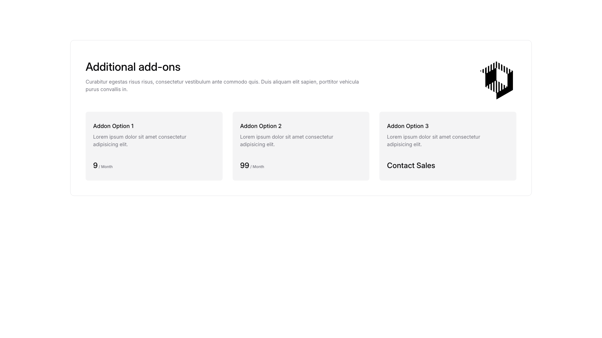

A section displays "Additional add-ons" with a heading and body text on the left, and an image positioned on the upper right. Below, three cards are arranged horizontally, each containing a heading, body text, and pricing or call-to-action information at the bottom.

**Install**: `pnpm dlx shadcn add @shadcnblocks/pricing13`

---

## pricing14

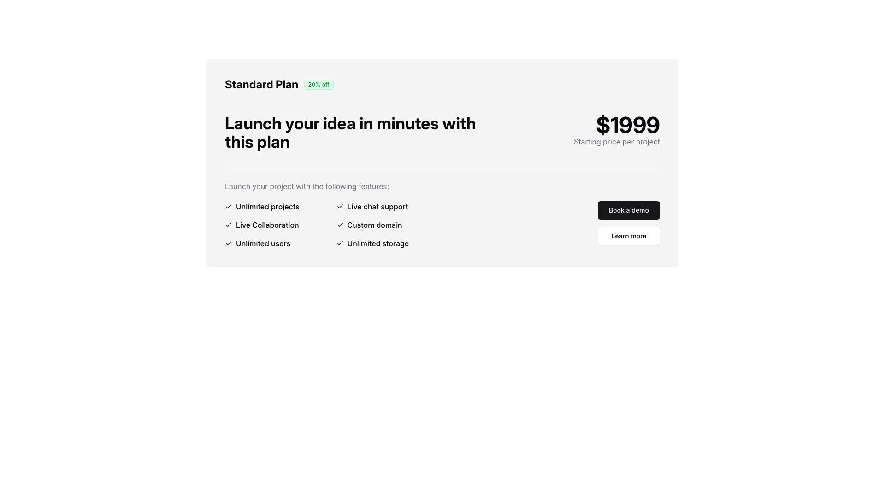

A pricing card section with a light gray background displays content in two columns. The left column contains a plan label with a discount tag, a main heading, descriptive body text, and two columns of feature list items with checkmarks. The right column is vertically aligned to the top and contains a large price figure with supporting text, followed by two stacked buttons positioned below.

**Install**: `pnpm dlx shadcn add @shadcnblocks/pricing14`

---

## pricing15

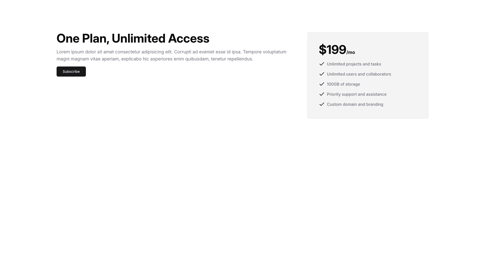

A two-column layout with content aligned horizontally. The left column contains a heading, body text, and a button stacked vertically. The right column features a pricing card with a price label at the top, followed by a list of five feature items with checkmarks, all contained within a light gray box.

**Install**: `pnpm dlx shadcn add @shadcnblocks/pricing15`

---

## pricing16

A centered pricing page displays a main heading with body text at the top, followed by two toggle buttons for billing options. Below this, three pricing cards are arranged horizontally, each containing a tier name, description, price, call-to-action button, and a vertically-stacked list of key features with checkmark icons.

**Install**: `pnpm dlx shadcn add @shadcnblocks/pricing16`

---

## pricing20

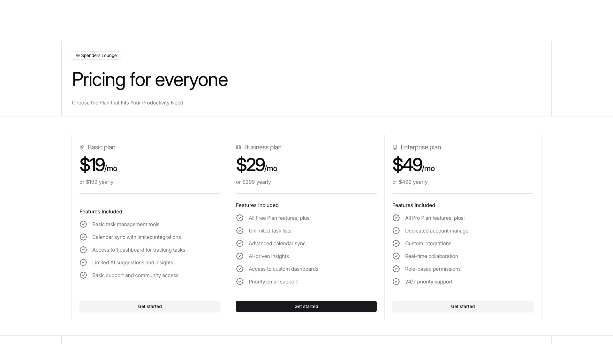

A pricing comparison page displays three vertically-stacked pricing cards arranged horizontally across the width. Each card contains a plan name label at the top, followed by a large price figure, smaller yearly alternative pricing text, a "Features Included" subheading, and a bulleted list of features. A centered "Get started" button appears at the bottom of each card.

**Install**: `pnpm dlx shadcn add @shadcnblocks/pricing20`

---

## pricing21

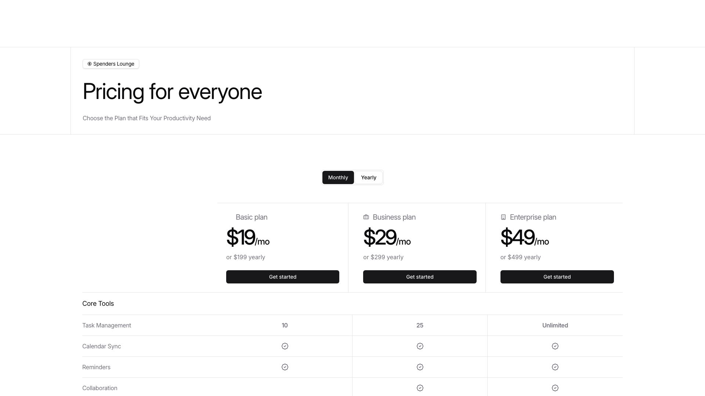

A pricing page section displays a main heading centered at the top, followed by subheading text and toggle buttons for "Monthly" and "Yearly" billing options. Below this, three pricing plan cards are arranged horizontally, each containing a plan name, price, yearly alternative, and a button. At the bottom, a comparison table with multiple rows spans the full width, listing core tools and features across the three plan columns.

**Install**: `pnpm dlx shadcn add @shadcnblocks/pricing21`

---

## pricing22

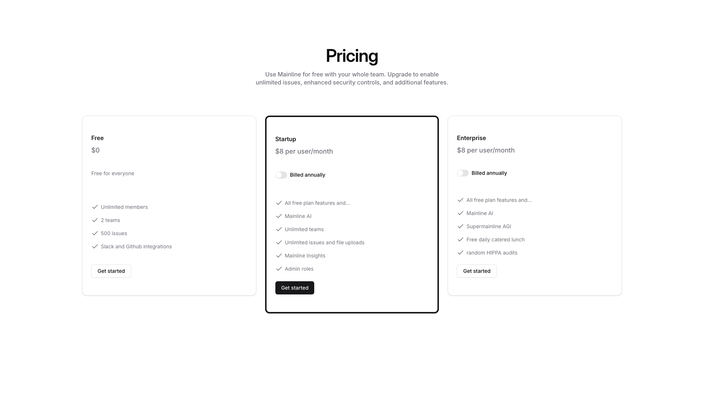

A pricing section displays three vertically stacked pricing tiers arranged horizontally across the page. Each tier card contains a heading, price label, descriptive body text, a list of features with checkmarks, and a button at the bottom. The center tier is visually emphasized with a border. Above the tier cards, a main heading and descriptive body text are centered at the top of the section.

**Install**: `pnpm dlx shadcn add @shadcnblocks/pricing22`

---

## pricing23

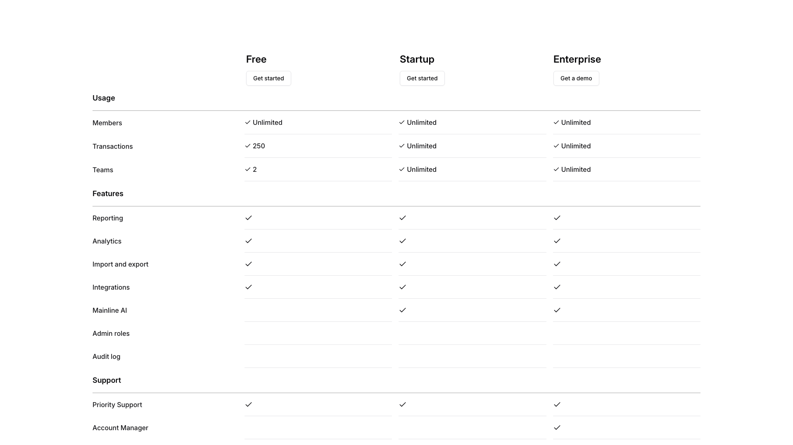

A pricing comparison table displays three vertically-aligned columns representing different plan tiers: Free, Startup, and Enterprise. Each column header contains a plan name and a centered button below it. The table body is organized into three horizontal sections (Usage, Features, and Support) with rows listing various features and specifications, with checkmarks indicating availability across the plans.

**Install**: `pnpm dlx shadcn add @shadcnblocks/pricing23`

---

## pricing24

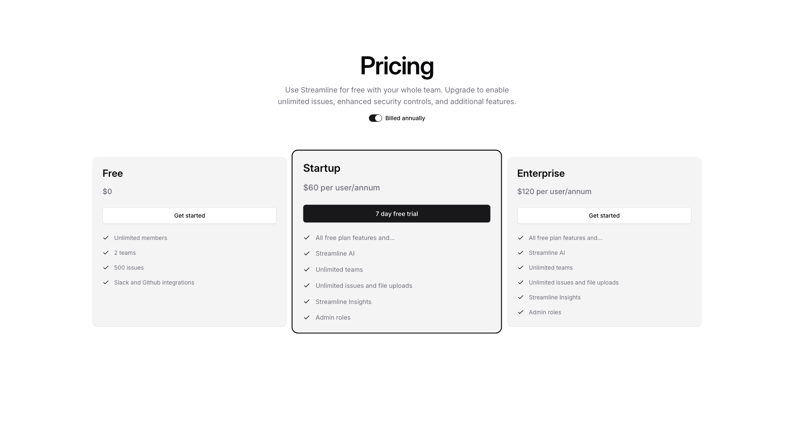

A pricing section features a centered heading with body text at the top, followed by a toggle control. Below, three pricing tiers are arranged horizontally in columns: a left column for the Free plan, a centered Startup plan with a prominent button, and a right column for the Enterprise plan. Each tier contains a price label, a call-to-action button, and a vertically stacked list of features with checkmarks.

**Install**: `pnpm dlx shadcn add @shadcnblocks/pricing24`

---

## pricing26

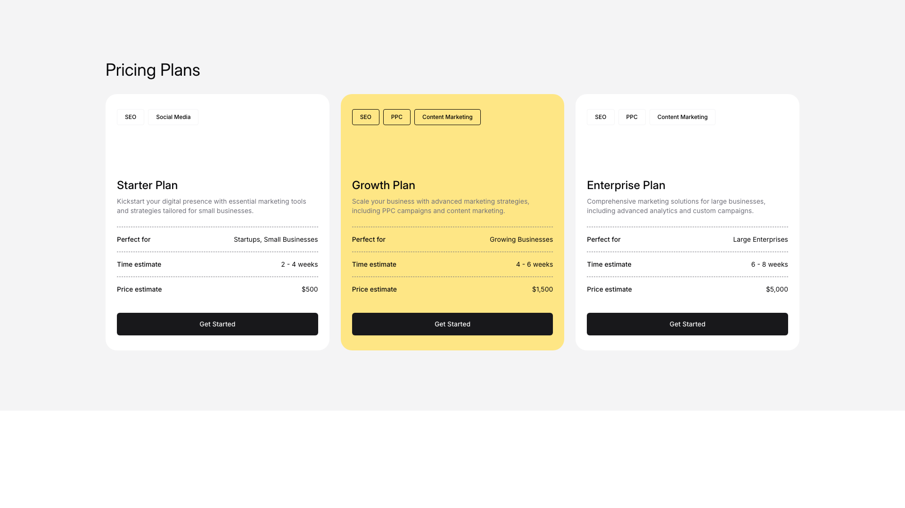

A pricing section displays three pricing plan cards arranged horizontally in a row. Each card contains service labels at the top, a plan title, descriptive body text, and details like "Perfect for," "Time estimate," and "Price estimate" listed vertically. A "Get Started" button is positioned at the bottom of each card. The middle card is highlighted with a yellow background, distinguishing it from the other two cards.

**Install**: `pnpm dlx shadcn add @shadcnblocks/pricing26`

---

## pricing27

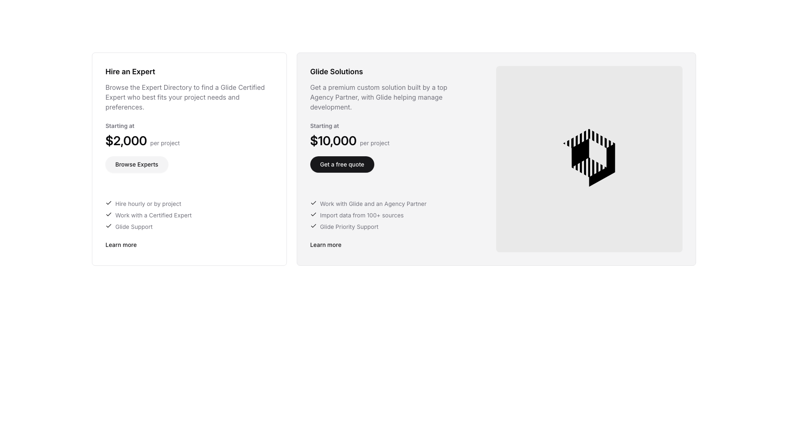

A three-column layout displays service options horizontally. The left and center columns each contain a heading, descriptive body text, pricing information starting with a dollar amount, a call-to-action button, feature list items with checkmarks, and a "Learn more" link. The right column features a large centered image with a light gray background. All text elements are left-aligned within their respective columns.

**Install**: `pnpm dlx shadcn add @shadcnblocks/pricing27`

---

## pricing28

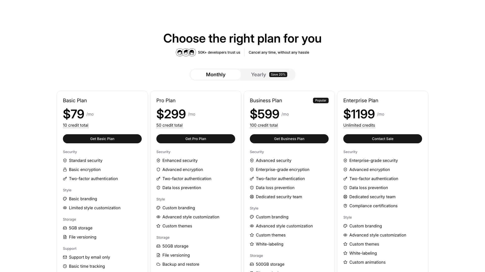

A pricing comparison section displays four vertically stacked plan columns arranged horizontally across the page. Each column contains a plan name heading at the top, pricing information, a centered button, and vertically organized feature categories (Security, Style, Storage, Support) with bulleted items beneath. The third column is highlighted with a "Popular" label positioned in the top-right corner.

**Install**: `pnpm dlx shadcn add @shadcnblocks/pricing28`

---

## pricing29

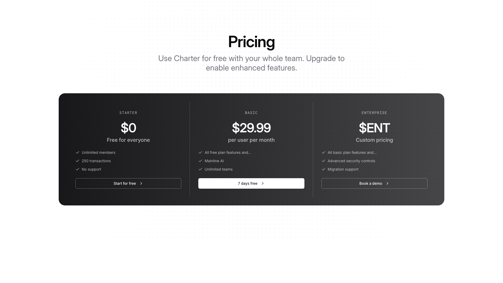

A pricing section displays three vertically stacked pricing tiers arranged horizontally. Each tier contains a label, a price, descriptive body text, a bulleted feature list, and a call-to-action button positioned at the bottom. The entire pricing card section is centered on the page, with a heading and subheading positioned above the three tiers.

**Install**: `pnpm dlx shadcn add @shadcnblocks/pricing29`

---

## pricing30

A pricing comparison table displays three vertically stacked columns representing different subscription tiers: Free, Basic, and Enterprise. Each column is headed with a tier name and a call-to-action button. Below the headers, rows are organized into three sections—Usage, Features, and Support—with feature names listed on the left and checkmarks or values aligned to the right under each tier column.

**Install**: `pnpm dlx shadcn add @shadcnblocks/pricing30`

---

## pricing31

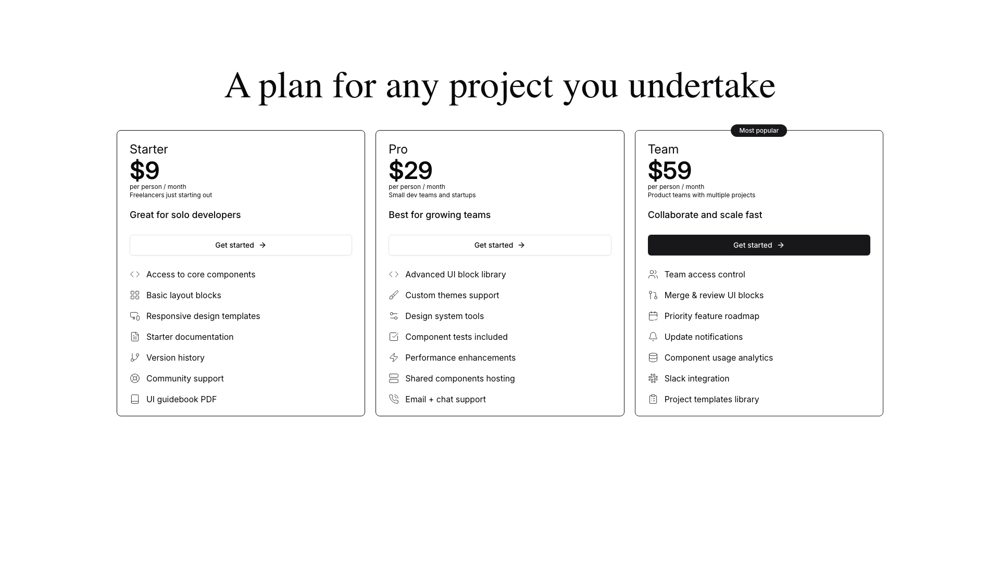

A centered heading appears at the top, followed by three vertically stacked pricing plan cards arranged horizontally. Each card contains a tier label, price amount, billing description, a tagline, a "Get started" button, and a bulleted feature list below. The rightmost card is highlighted with a "Most popular" label at the top.

**Install**: `pnpm dlx shadcn add @shadcnblocks/pricing31`

---

## pricing32

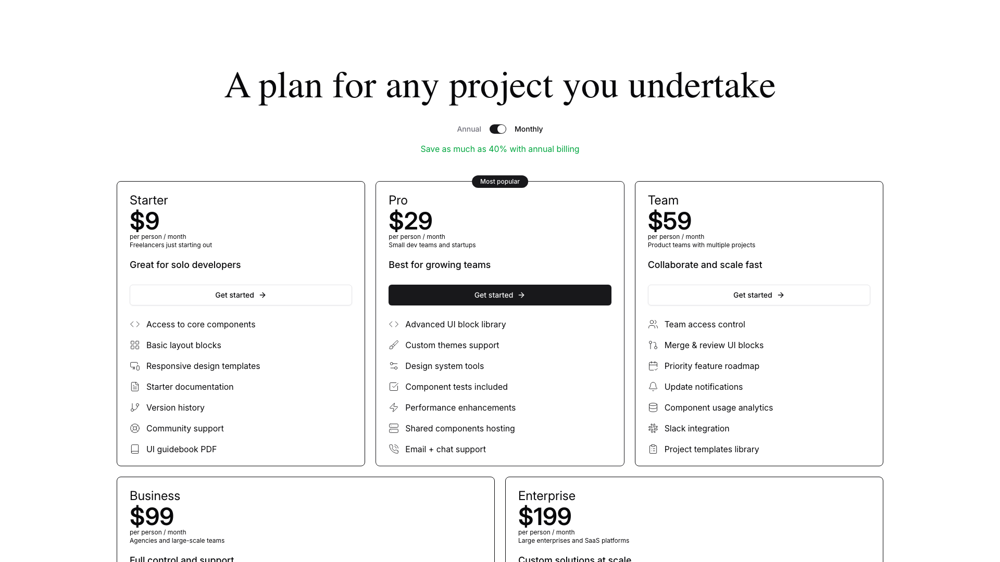

A pricing page displays a centered heading at the top, followed by a toggle switch and promotional text. Below this are five pricing plan cards arranged horizontally across the page: three cards in the top row and two cards in the bottom row. Each card contains a plan name, price, description text, a button, and a vertical list of features with icons.

**Install**: `pnpm dlx shadcn add @shadcnblocks/pricing32`

---

## pricing33

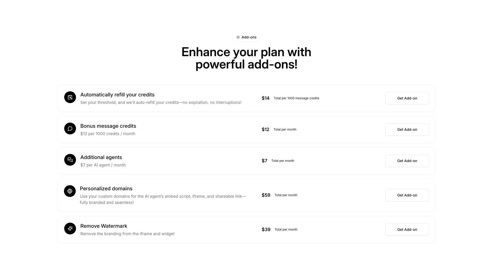

A vertical layout displays five add-on options, each organized horizontally with consistent spacing. On the left of each row is an icon, followed by a heading and descriptive body text in the center-left area. On the right side of each row, a price label is positioned above a "Get Add-on" button.

**Install**: `pnpm dlx shadcn add @shadcnblocks/pricing33`

---

## pricing34

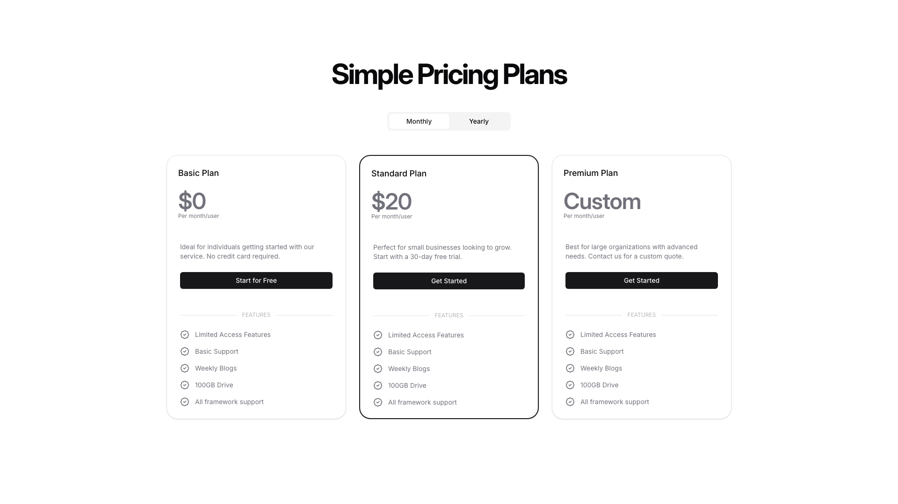

A pricing page section displays three pricing plan cards arranged horizontally. At the top, a large centered heading is followed by toggle buttons for billing frequency. Each card contains a price, description text, a call-to-action button, and a vertically stacked list of features below. The center card is highlighted with a border to indicate it as the featured option.

**Install**: `pnpm dlx shadcn add @shadcnblocks/pricing34`

---

## pricing35

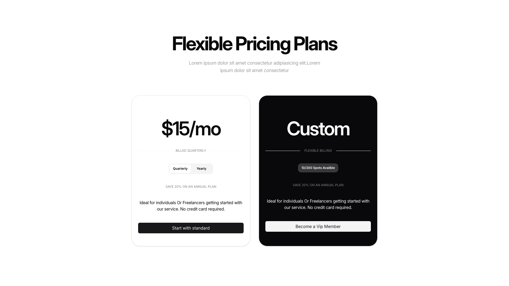

A centered section displays two pricing plan cards positioned side-by-side horizontally. Each card contains a heading, billing details, descriptive body text, and a button at the bottom. The left card features a light background, while the right card uses a dark background with a badge label. Both cards maintain aligned vertical layouts with consistent spacing between elements.

**Install**: `pnpm dlx shadcn add @shadcnblocks/pricing35`

---

## pricing36

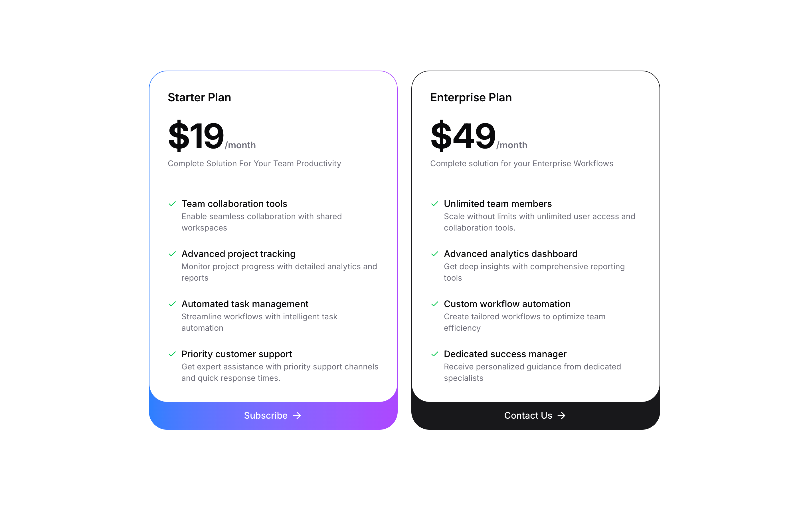

A horizontally aligned two-column layout displays pricing tiers side-by-side. Each column contains a heading, a price label with monthly billing notation, a subtitle, and a vertically stacked list of features with checkmarks and descriptive text. At the bottom of each column is a call-to-action button, positioned centrally within the card.

**Install**: `pnpm dlx shadcn add @shadcnblocks/pricing36`

---

## pricing37

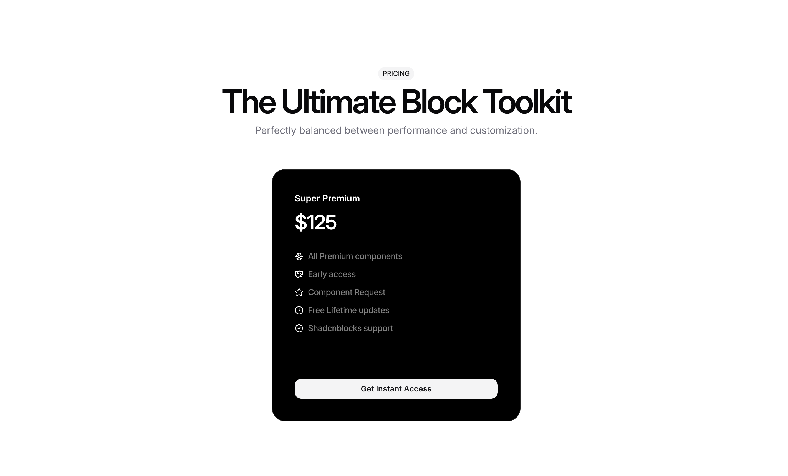

A centered pricing card displays a small label at the top, followed by a large heading, subheading text, and a price in large typography. Below this is a vertically stacked list of five feature items, each with an icon aligned to the left of descriptive text. At the bottom sits a full-width button.

**Install**: `pnpm dlx shadcn add @shadcnblocks/pricing37`

---

## pricing38

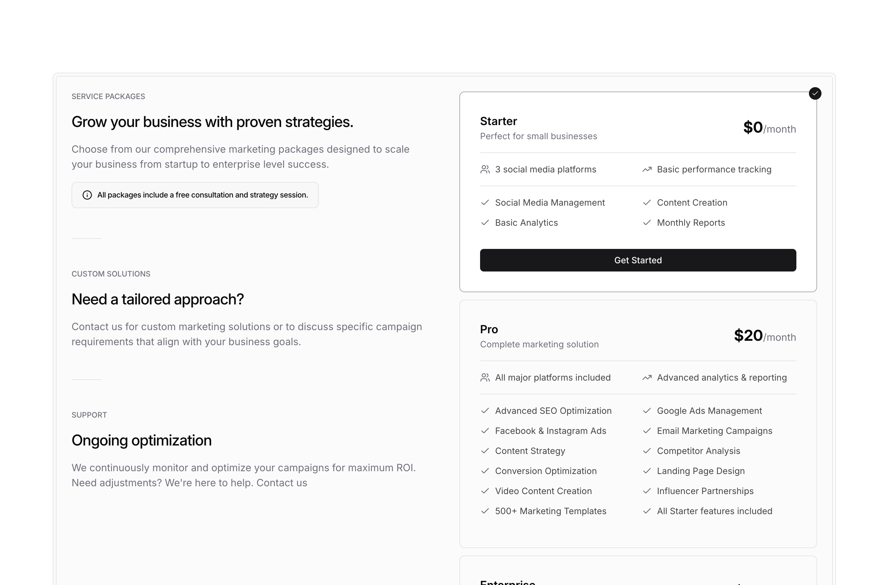

A two-column layout displays service package information. The left column contains three stacked sections with headings and descriptive body text. The right column shows two vertically stacked pricing cards, each with a heading, subheading, price label, feature lists with checkmarks, and a button at the bottom.

**Install**: `pnpm dlx shadcn add @shadcnblocks/pricing38`

---

## pricing40

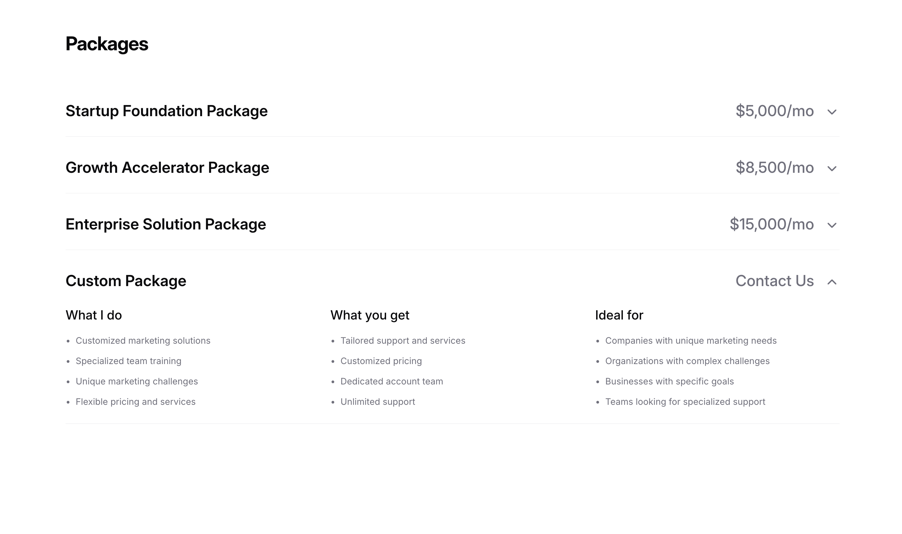

A pricing section displays four packages vertically stacked. The first three packages are listed with titles on the left and prices aligned on the right. Below these, a fourth "Custom Package" section expands horizontally into three columns labeled "What I do," "What you get," and "Ideal for," each containing bullet-pointed body text.

**Install**: `pnpm dlx shadcn add @shadcnblocks/pricing40`

---
