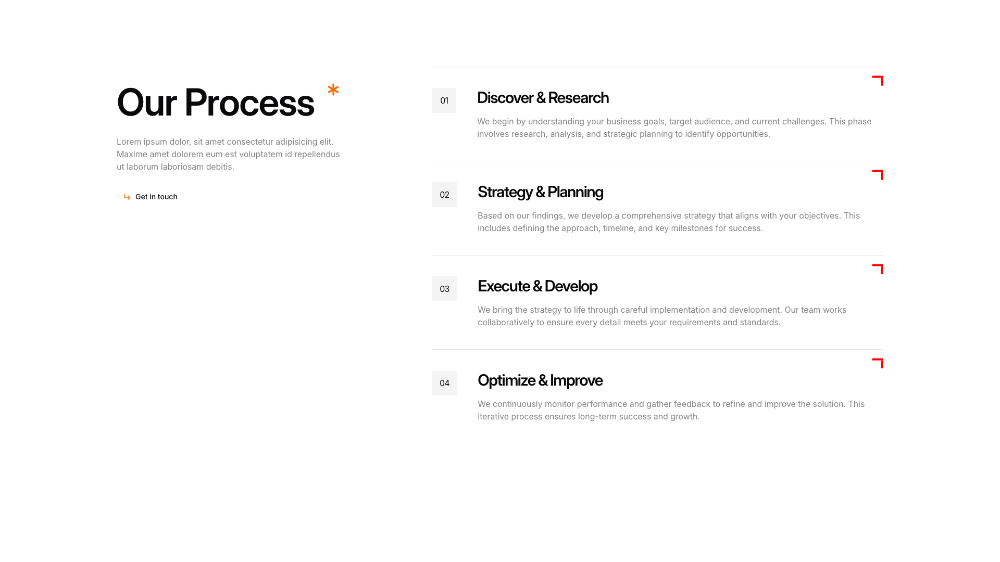
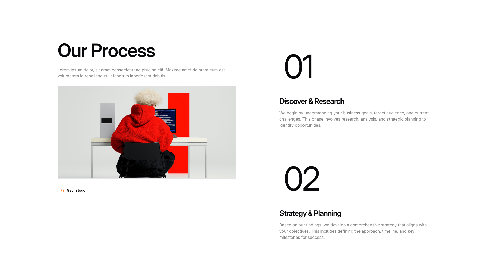
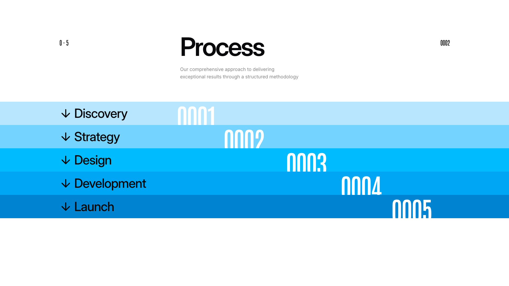

# Process Blocks (3)

Process flows and step-by-step guides. Visualize workflows and procedural information.

---

## process1

A two-column layout displays a process section. The left column contains a main heading, body text, and a clickable link positioned vertically. The right column features four numbered process steps arranged vertically, each with a heading, descriptive body text, and a small decorative icon aligned to the right.

**Install**: `pnpm dlx shadcn add @shadcnblocks/process1`

---

## process2

A two-column layout with the left column containing a main heading, body text, an image, and a clickable link positioned below. The right column displays two vertically stacked process steps, each with a large numerical label, a subheading, and descriptive body text.

**Install**: `pnpm dlx shadcn add @shadcnblocks/process2`

---

## process3

A webpage section displays a centered main heading with descriptive body text underneath. Below this, a horizontal timeline layout presents five stages listed vertically on the left side, each paired with corresponding numbered labels positioned progressively to the right, creating a staggered cascade effect across the blue-gradient background.

**Install**: `pnpm dlx shadcn add @shadcnblocks/process3`

---
