# Project Blocks (32)

Individual project showcase layouts with detailed information. Present portfolio pieces with descriptions and media.

---

## project1

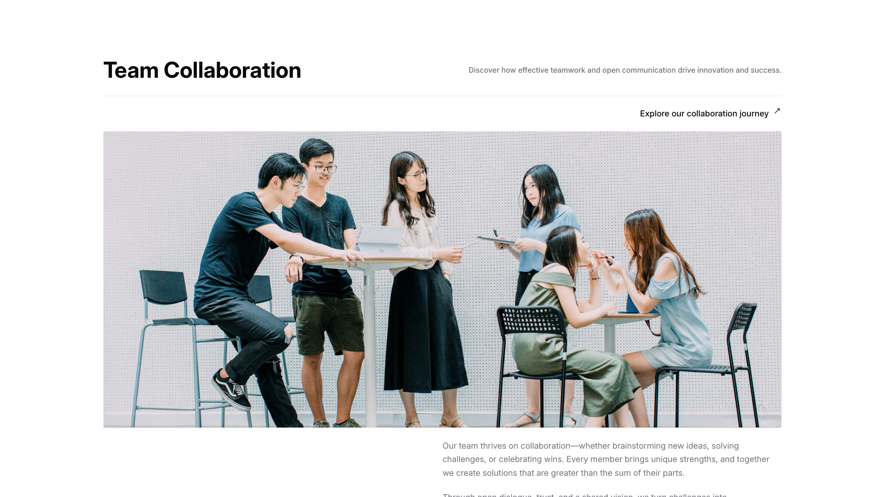

A webpage section features a main heading positioned at the top left, with a subtitle aligned to the right. Below this, a large image is centered horizontally and spans the full width. Underneath the image, body text is positioned centrally, with an additional line of text below it. A clickable link labeled "Explore our collaboration journey" is placed in the upper right corner.

**Install**: `pnpm dlx shadcn add @shadcnblocks/project1`

---

## project2

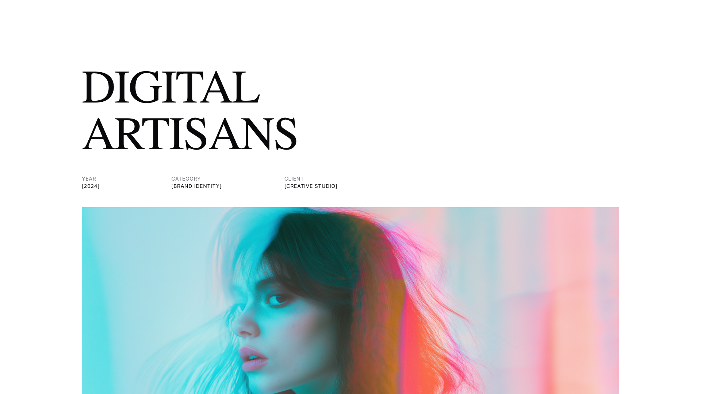

A webpage section features a layout with text content positioned on the left and an image spanning the right side. The left column displays a large heading at the top, followed by three horizontal labels arranged vertically below it. A large image occupies the right portion of the layout, extending across the remaining width.

**Install**: `pnpm dlx shadcn add @shadcnblocks/project2`

---

## project2a

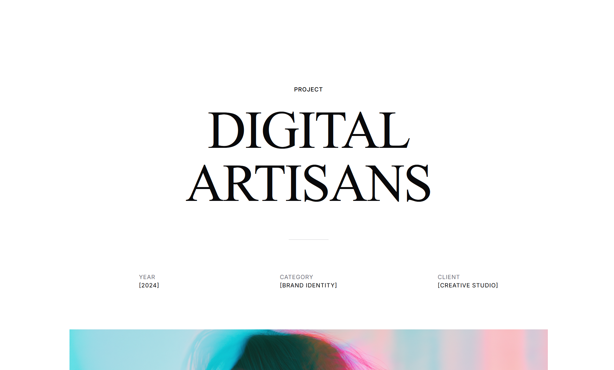

A centered layout displays a project header with a large heading positioned at the top. Below this, three labels with corresponding metadata are arranged horizontally across the page. At the bottom, a wide image spans the full width of the section.

**Install**: `pnpm dlx shadcn add @shadcnblocks/project2a`

---

## project2b

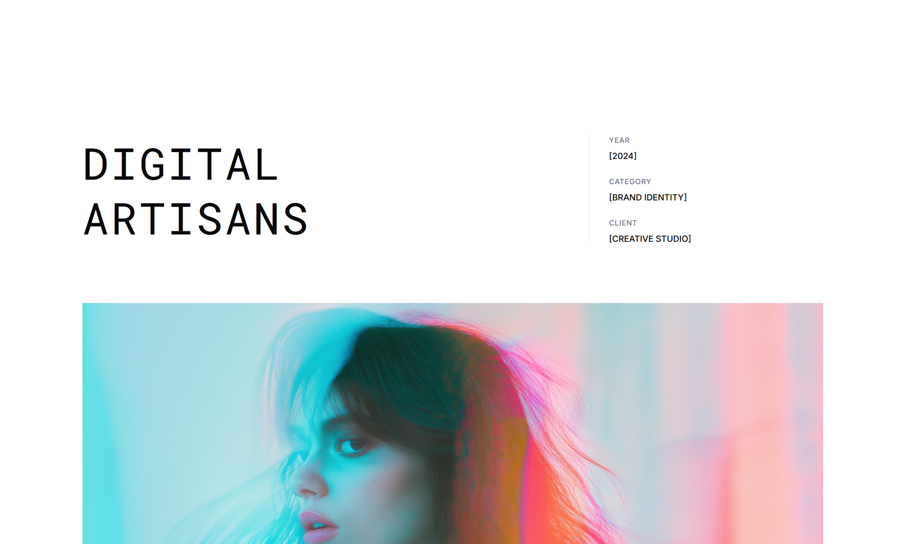

A layout section displays a large heading on the left side, with metadata labels and values positioned vertically on the right. Below the heading, a full-width image spans the bottom portion of the section.

**Install**: `pnpm dlx shadcn add @shadcnblocks/project2b`

---

## project2c

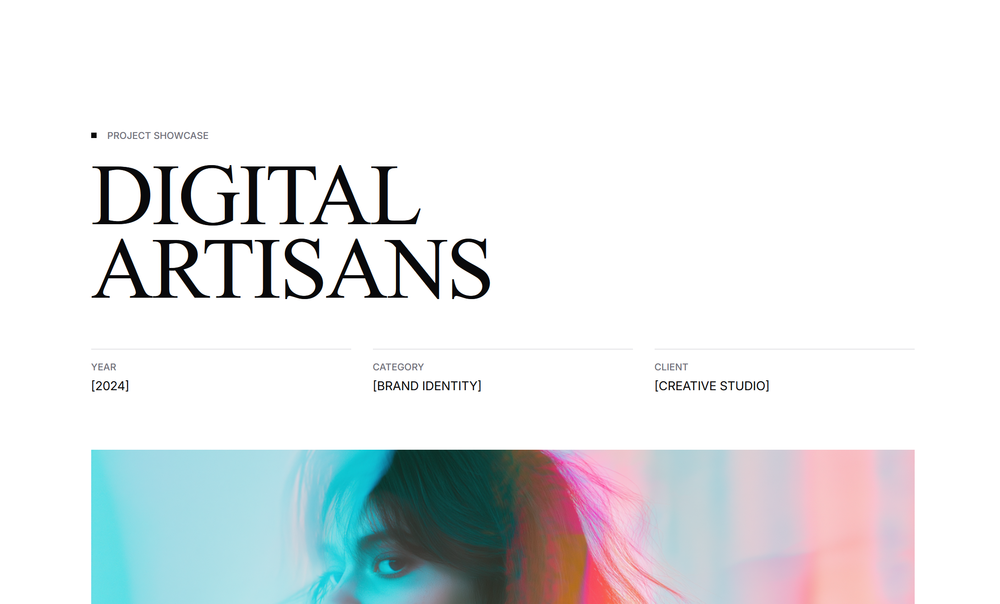

A project showcase section features a large heading centered on the left side of the layout. Below the heading, three labels with corresponding values are arranged horizontally in a row, providing metadata about the project. A full-width image spans the bottom of the section, creating a visual footer to the content block.

**Install**: `pnpm dlx shadcn add @shadcnblocks/project2c`

---

## project2d

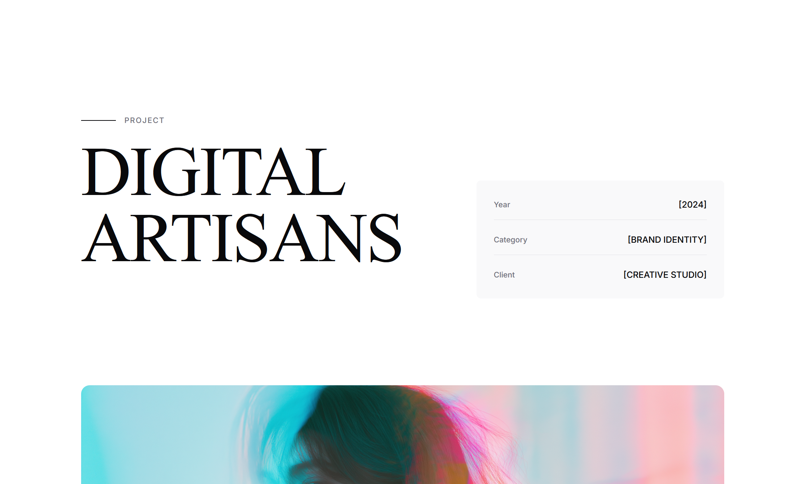

A webpage section is divided into two columns. The left column features a large serif heading, while the right column contains three horizontally-aligned labels with corresponding values displayed in brackets. Below this layout, a full-width image spans across both columns at the bottom of the section.

**Install**: `pnpm dlx shadcn add @shadcnblocks/project2d`

---

## project4

A centered layout displays a main heading at the top, followed by body text describing the brand. Below this, three labels with corresponding information are arranged horizontally. The lower half of the section features a large image positioned on the right side, with blurred foliage elements on the left creating visual balance.

**Install**: `pnpm dlx shadcn add @shadcnblocks/project4`

---

## project4a

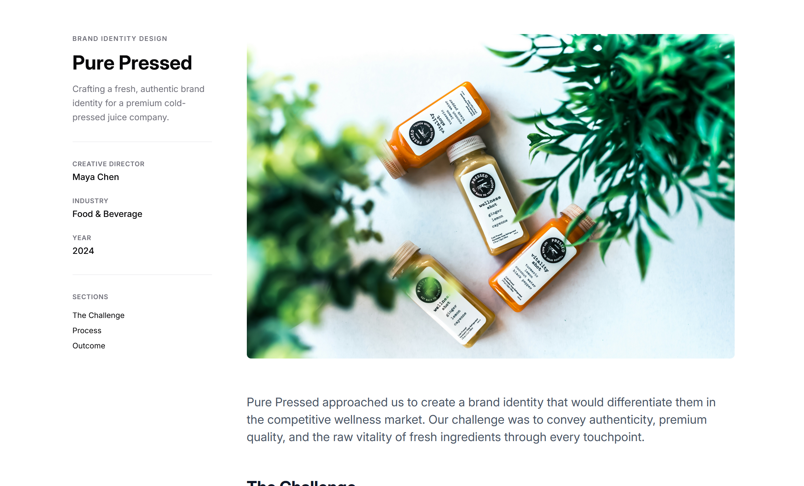

A webpage section displays content in two columns with a left sidebar and main content area. The left sidebar contains a small label at the top, followed by a large heading, body text, and several smaller labels with associated text positioned vertically. The right side features a large image spanning the full width. Below the image, centered body text describes the project, with a heading positioned at the bottom of the visible area.

**Install**: `pnpm dlx shadcn add @shadcnblocks/project4a`

---

## project4b

A centered layout displays a main heading at the top, followed by a subtitle and descriptive body text. Below this, three small labels with accompanying information are arranged horizontally. A large image spans the full width at the bottom of the section.

**Install**: `pnpm dlx shadcn add @shadcnblocks/project4b`

---

## project4c

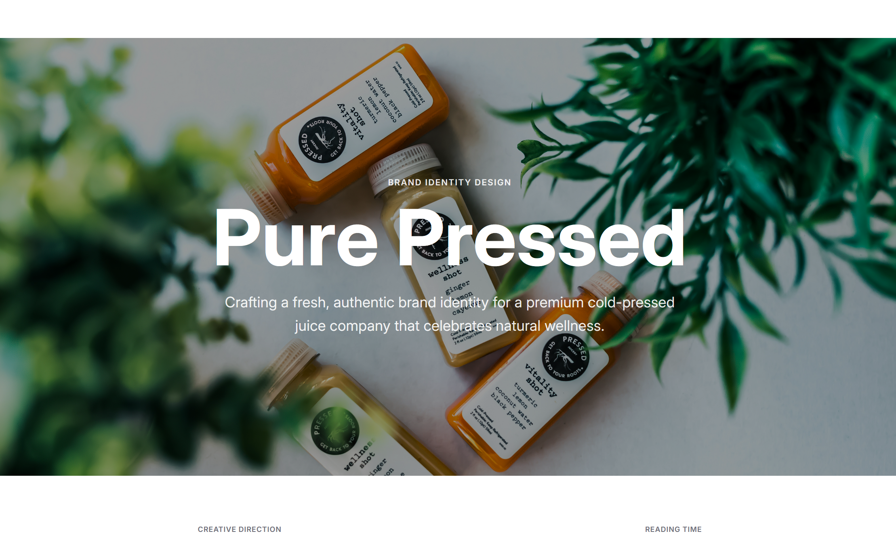

A hero section features a large centered image with layered text content overlaid on top. The layout includes a small label at the top, followed by a large main heading, and body text positioned centrally. At the bottom of the section, two labels are horizontally aligned on opposite sides.

**Install**: `pnpm dlx shadcn add @shadcnblocks/project4c`

---

## project5

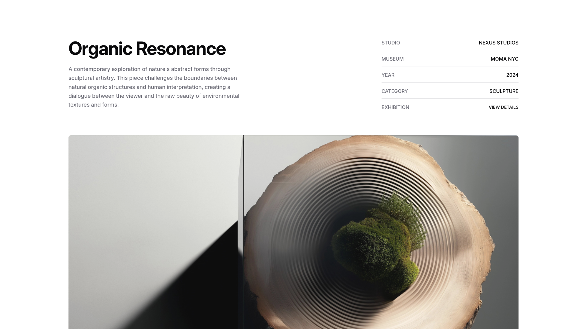

A webpage layout displays content in two columns. The left column contains a main heading, followed by body text describing the artwork. The right column presents a vertical stack of labeled information fields (studio, museum, year, category, and exhibition) with corresponding values aligned to the right. Below both columns, a large image spans the full width of the page.

**Install**: `pnpm dlx shadcn add @shadcnblocks/project5`

---

## project5a

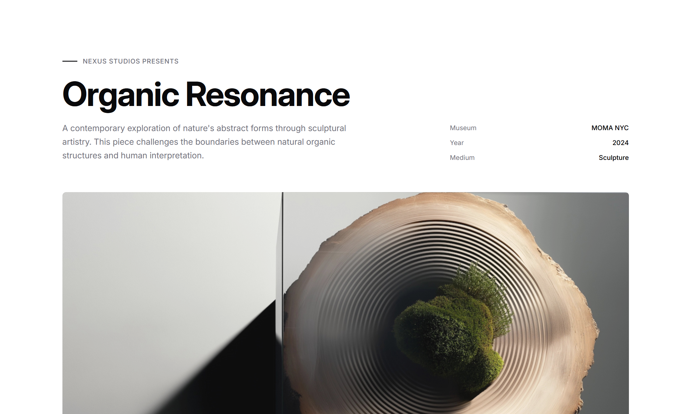

A webpage section displays content in two columns. The left column contains a small label at the top, followed by a large heading, body text, and additional spacing below. The right column is positioned vertically and contains three labeled data fields with corresponding values. Below both columns, a large image spans the full width of the section.

**Install**: `pnpm dlx shadcn add @shadcnblocks/project5a`

---

## project5b

A webpage layout displays content in two columns. The left column contains a studio name label at the top, followed by a large heading positioned below. The right column, aligned to the top, includes a section title, descriptive labels, and category tags stacked vertically. Below both columns, a large image spans the full width of the layout.

**Install**: `pnpm dlx shadcn add @shadcnblocks/project5b`

---

## project5c

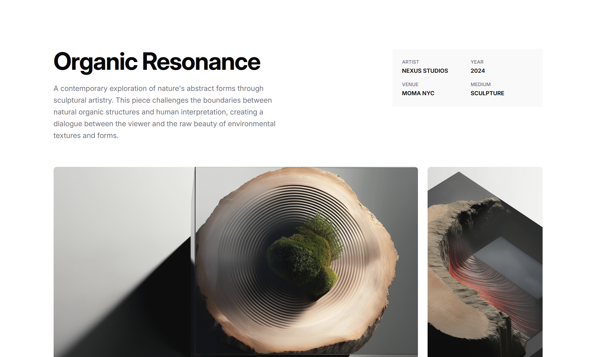

A layout section displays content in two columns. The left column contains a large heading, followed by body text describing the artwork. On the right side, metadata labels and values are arranged vertically in a compact format. Below both columns, two images are positioned horizontally at the bottom of the section.

**Install**: `pnpm dlx shadcn add @shadcnblocks/project5c`

---

## project5d

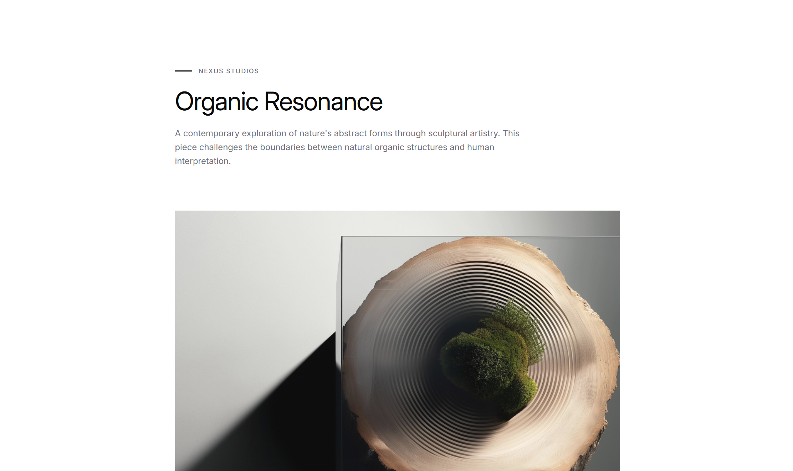

A webpage section displays vertically stacked content with a small label at the top left, followed by a large heading centered on the left. Below the heading is body text describing the project. A large image is positioned below and spans the full width of the section.

**Install**: `pnpm dlx shadcn add @shadcnblocks/project5d`

---

## project5e

A centered layout features a main heading at the top, followed by body text describing the exhibition. Below this text is a button on the left and a label on the right. At the bottom, three images are arranged horizontally in equal columns.

**Install**: `pnpm dlx shadcn add @shadcnblocks/project5e`

---

## project5f

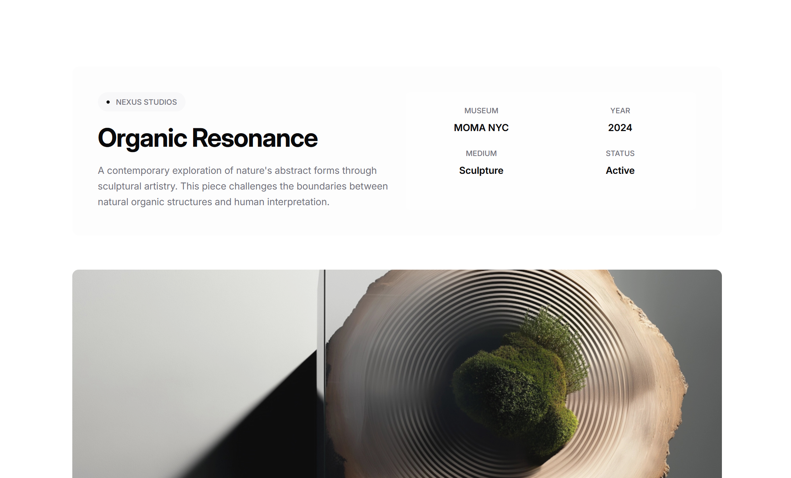

A webpage layout with content positioned in two columns. The left column contains a tag, a main heading, and body text describing a sculptural piece. The right column displays metadata labels and corresponding information aligned vertically. Below both columns, a large image spans the full width of the section.

**Install**: `pnpm dlx shadcn add @shadcnblocks/project5f`

---

## project5g

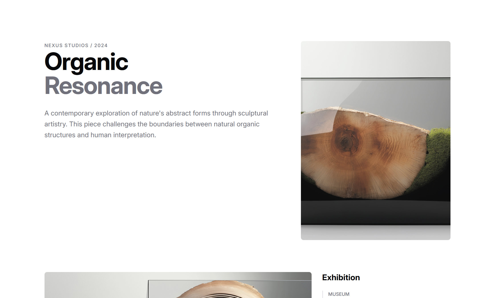

A layout with two columns displays content on the left and right. The left column contains a small header label, a large heading, and body text describing the artwork. On the right side, a large image is positioned vertically. Below, a second section spans horizontally with another image on the left and an "Exhibition" heading with a label on the right.

**Install**: `pnpm dlx shadcn add @shadcnblocks/project5g`

---

## project6

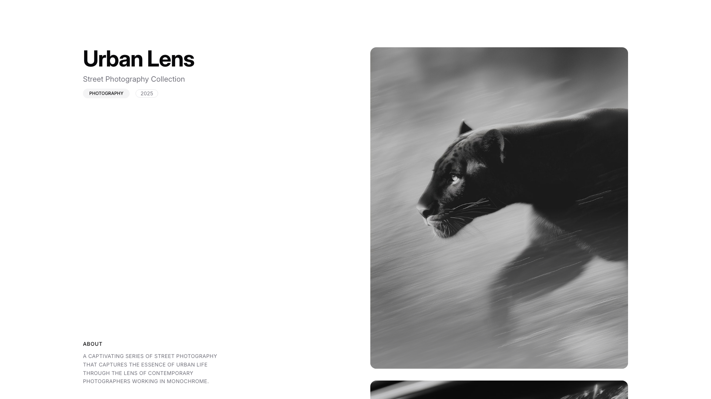

A webpage layout displays content in two columns with a left-aligned text section and a right-aligned image section. The left column contains a main heading, a subtitle, two labels, and body text positioned vertically. The right column features a large image positioned in the upper portion, with a second image partially visible below it.

**Install**: `pnpm dlx shadcn add @shadcnblocks/project6`

---

## project6a

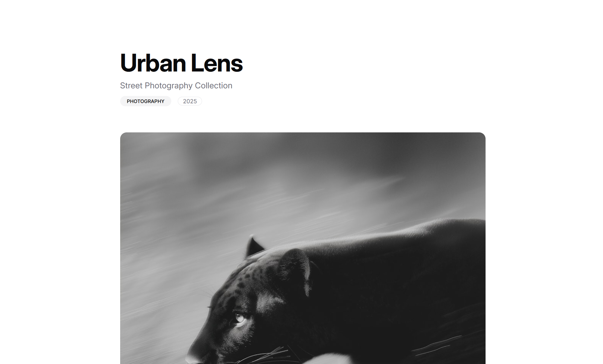

A webpage section displays a vertical layout with text content positioned on the left side. At the top, a large heading is followed by a subtitle, then two small labels arranged horizontally. Below this text block, a large image spans the full width of the section.

**Install**: `pnpm dlx shadcn add @shadcnblocks/project6a`

---

## project7

A full-width hero section displays a large background image with an overlay containing centered text. At the top is a small label, followed by a prominent heading and descriptive body text, all aligned centrally. Below this is a separate content section with a subheading positioned at the top, followed by three paragraphs of body text stacked vertically.

**Install**: `pnpm dlx shadcn add @shadcnblocks/project7`

---

## project8

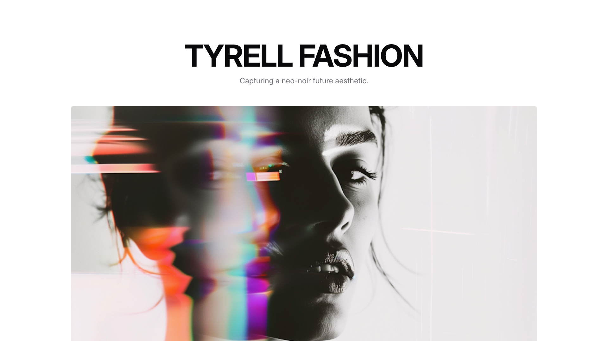

A centered layout displays a main heading at the top, followed by a subtitle positioned directly below it. Underneath the text, a large image spans the full width of the section, occupying the majority of the vertical space.

**Install**: `pnpm dlx shadcn add @shadcnblocks/project8`

---

## project8a

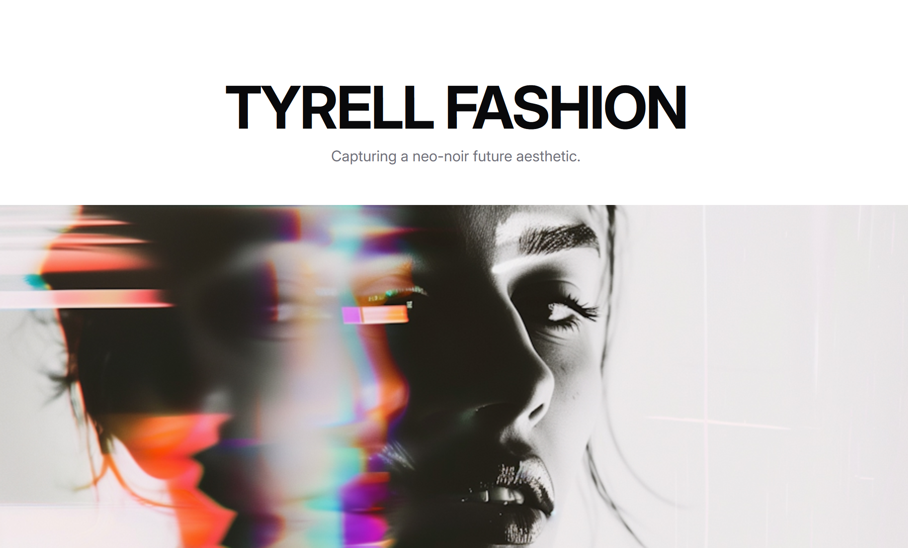

A hero section features a centered main heading at the top, with a subtitle positioned directly below it. To the right, a large image spans roughly half the width of the section, while the text content is aligned to the left side.

**Install**: `pnpm dlx shadcn add @shadcnblocks/project8a`

---

## project8b

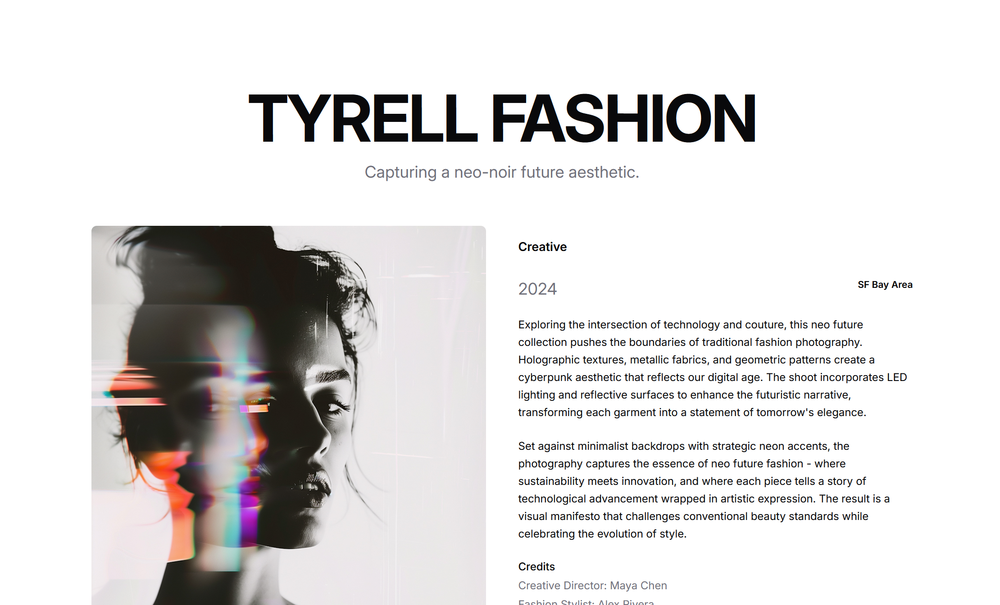

A webpage section displays content in two columns. The left column features a large image, while the right column contains a heading, a date, a location label, two paragraphs of body text, and a credits section with multiple lines of smaller text. All elements are vertically stacked within their respective columns.

**Install**: `pnpm dlx shadcn add @shadcnblocks/project8b`

---

## project8c

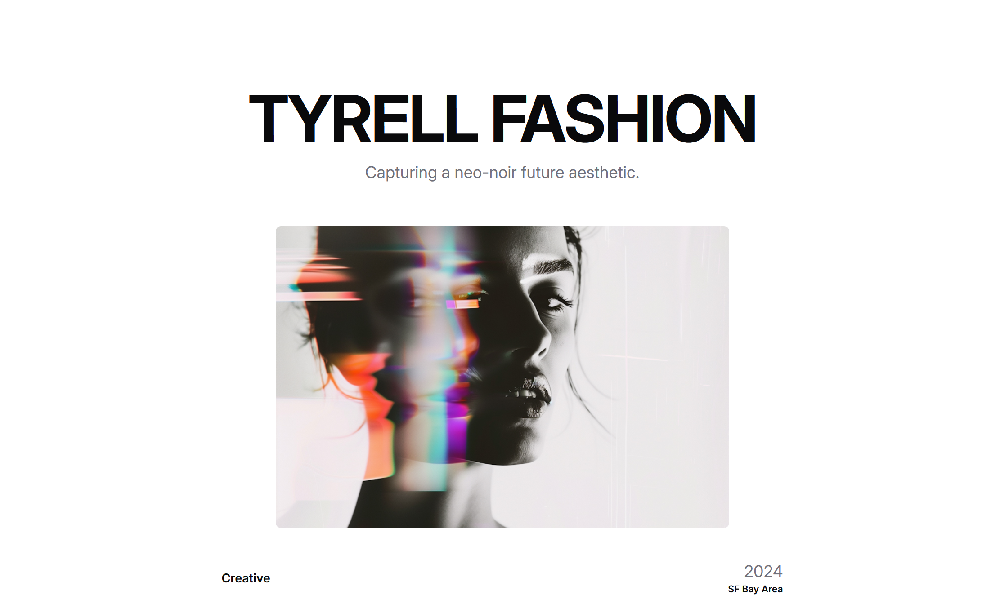

A webpage section is vertically centered with a main heading at the top, followed by a subtitle in smaller text. Below this, a large image is horizontally centered. At the bottom, metadata labels are positioned on either side—one on the left and one on the right.

**Install**: `pnpm dlx shadcn add @shadcnblocks/project8c`

---

## project8d

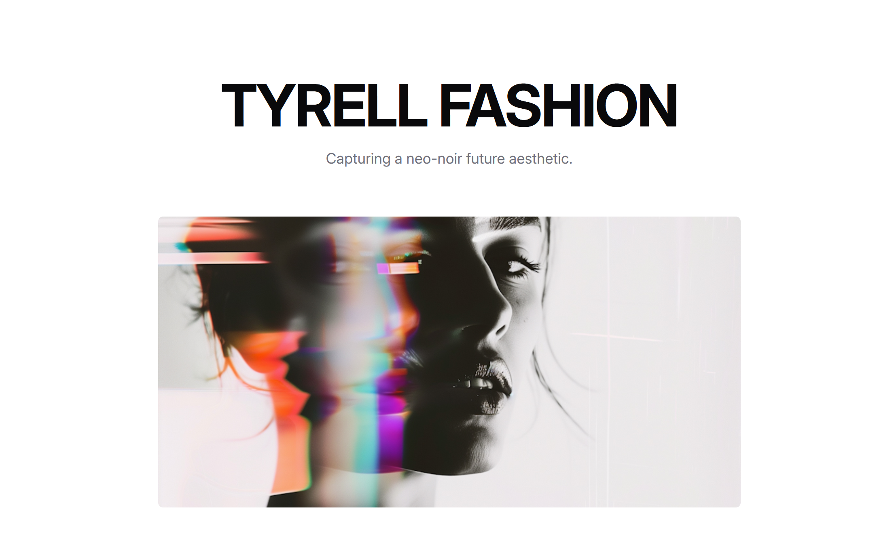

A centered webpage section features a main heading at the top, followed by a subtitle positioned directly below. Beneath the text, a large image spans horizontally across the full width of the section, occupying the majority of the vertical space.

**Install**: `pnpm dlx shadcn add @shadcnblocks/project8d`

---

## project8e

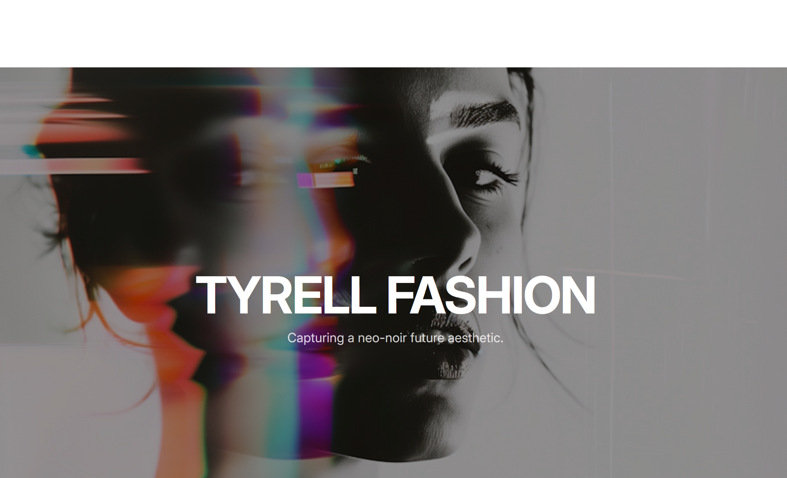

A full-width hero section featuring a large image on the right side with a glitch effect overlay. On the left and center, a main heading is positioned prominently, with a smaller subtitle text aligned below it. The text elements are layered over the image, creating a centered compositional focus.

**Install**: `pnpm dlx shadcn add @shadcnblocks/project8e`

---

## project9

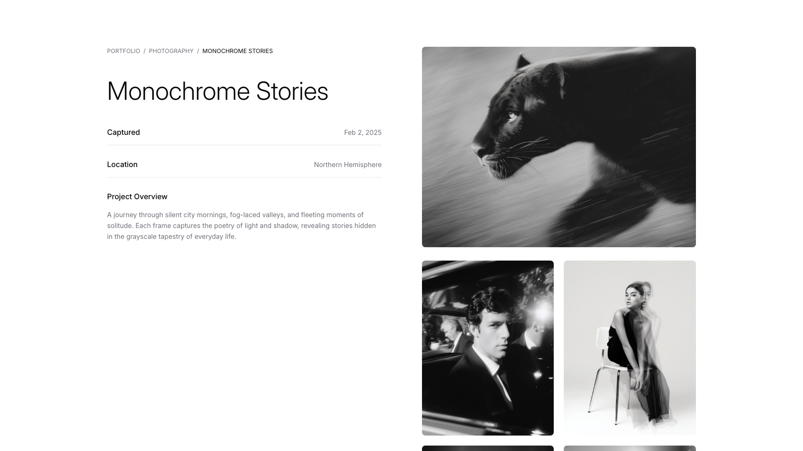

A portfolio page section displays content in two columns with a left-aligned text area and right-aligned image gallery. The left column contains navigation breadcrumbs, a main heading, metadata labels with corresponding values, and a project overview paragraph. The right column features a large image positioned at the top, with two smaller images arranged below it horizontally.

**Install**: `pnpm dlx shadcn add @shadcnblocks/project9`

---

## project10

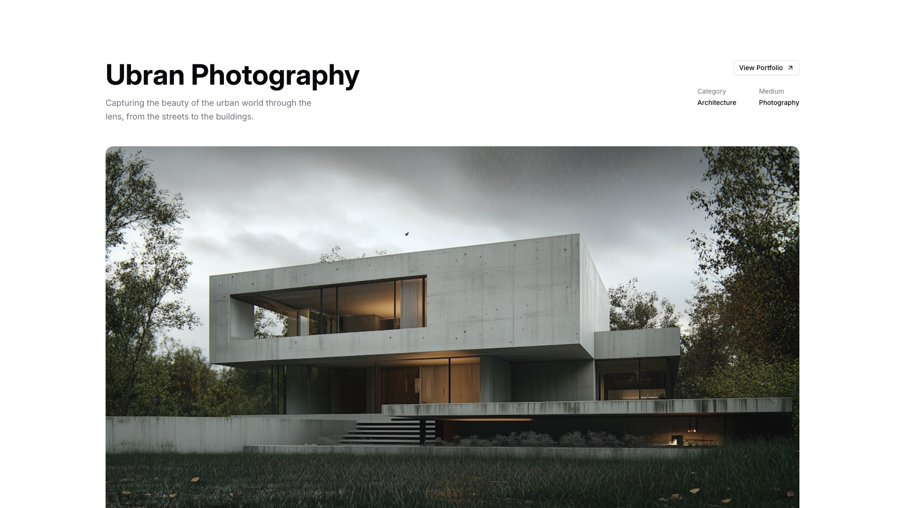

A webpage section displays content in two columns. The left column contains a main heading, descriptive body text, and a "View Portfolio" link positioned at the top right. The right column includes metadata labels (Category and Medium) aligned to the right. Below this text area, a large image spans the full width of the page horizontally.

**Install**: `pnpm dlx shadcn add @shadcnblocks/project10`

---

## project12

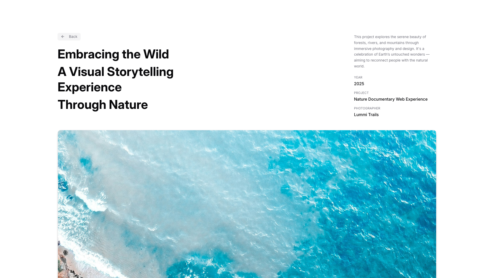

A webpage layout with two columns displays project information. On the left, a back button sits above a large multi-line heading, with a full-width image below. On the right, body text is positioned at the top, followed by vertically stacked labels and corresponding details in a structured format. A large image spans the full width at the bottom of the layout.

**Install**: `pnpm dlx shadcn add @shadcnblocks/project12`

---

## project13

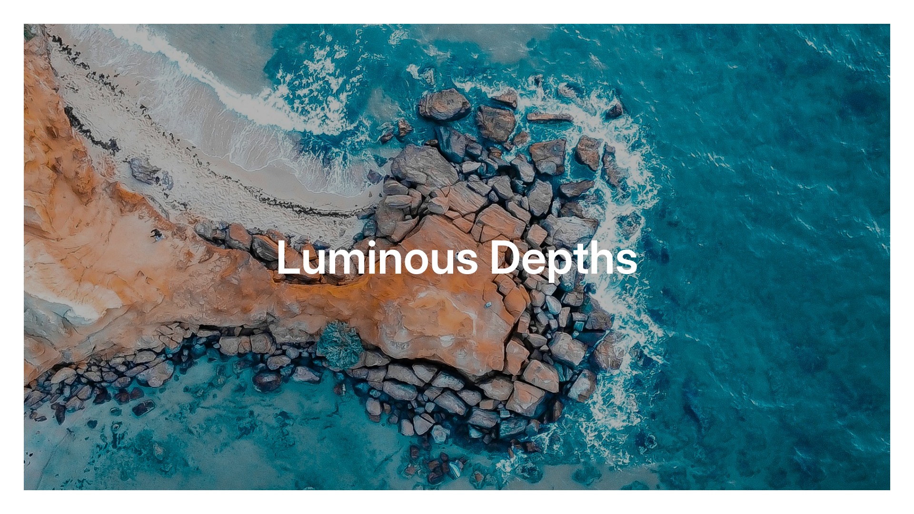

A full-width image section features a centered heading positioned in the middle of the composition. The heading text is layered directly over the image, creating an overlay effect that makes it the focal point of the layout.

**Install**: `pnpm dlx shadcn add @shadcnblocks/project13`

---

## project13a

A full-screen image section displays a large background image with a centered heading overlaid in the middle. The heading text is prominently positioned to create a focal point against the image backdrop. Underneath the heading, a small label is centered.

**Install**: `pnpm dlx shadcn add @shadcnblocks/project13a`

---
