# Projects Blocks (17)

Project grid layouts for portfolio overviews. Display multiple projects in organized collections.

---

## projects1

A two-column layout alternates between text content on the left and images on the right. The first row features a main heading, descriptive body text, and a label tag on the left, with a large image positioned on the right. The second row repeats this structure with another heading, body text area, and accompanying image on the right side.

**Install**: `pnpm dlx shadcn add @shadcnblocks/projects1`

---

## projects2

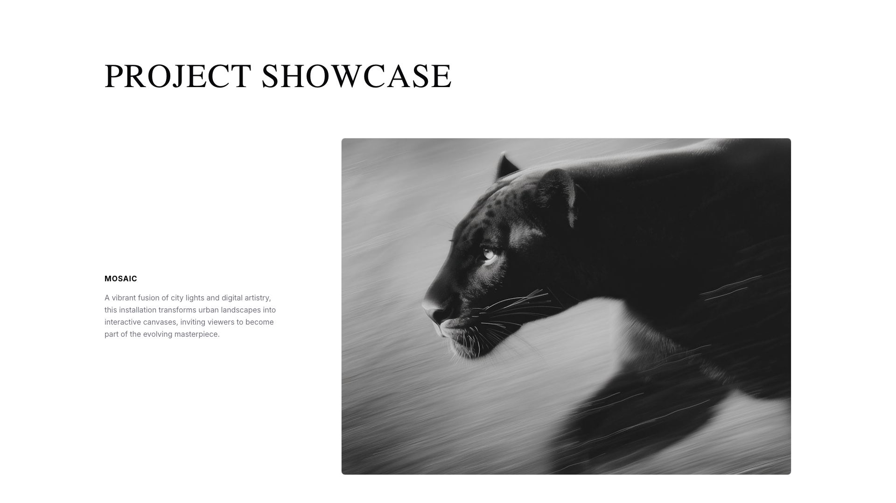

A webpage section displays a two-column layout with a left-aligned text block and a right-aligned image. The left column contains a heading, followed by body text describing a project. The right column features a large image positioned horizontally across the upper portion of the section.

**Install**: `pnpm dlx shadcn add @shadcnblocks/projects2`

---

## projects3

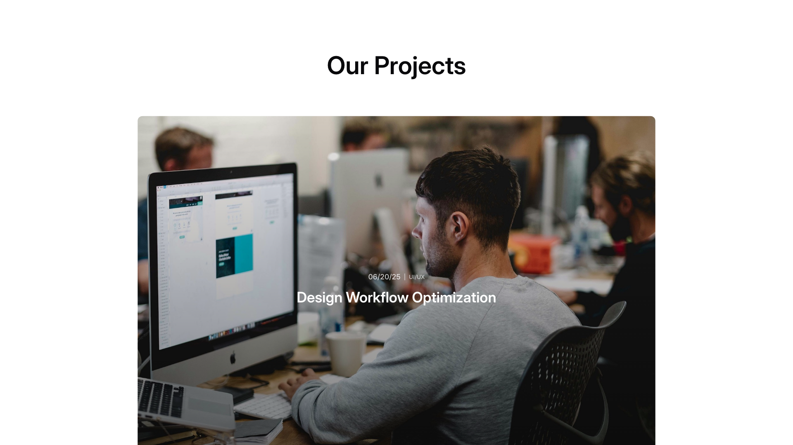

A section displays a centered heading at the top. Below it, a large image spans the full width with overlaid text elements positioned in the lower portion: a date label on the left and a main heading centered below it.

**Install**: `pnpm dlx shadcn add @shadcnblocks/projects3`

---

## projects4

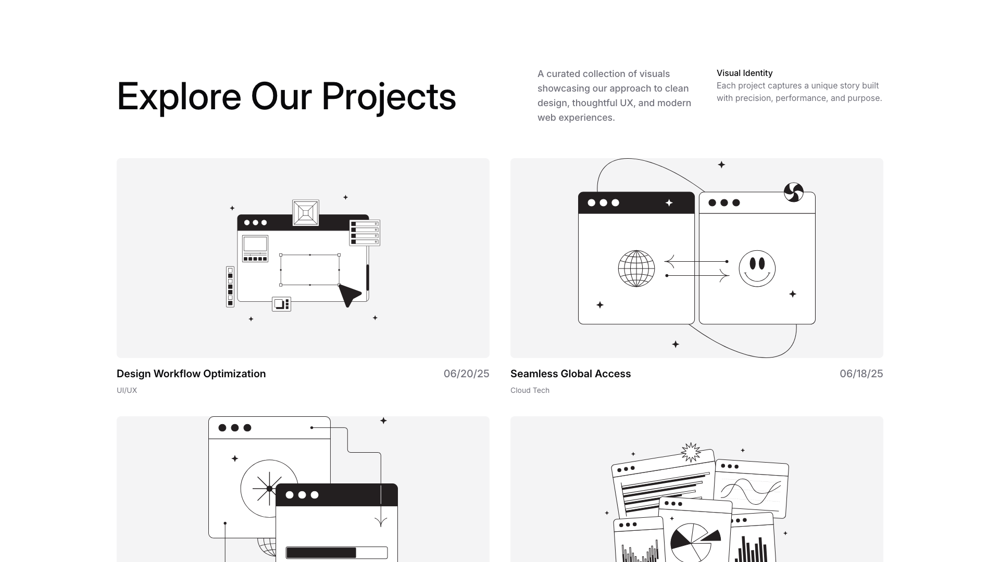

A section titled "Explore Our Projects" displays four project cards in a 2x2 grid layout. Each card contains a centered image above a project title, category label, and date positioned at the bottom. Accompanying descriptive text and a "Visual Identity" label appear in the top right corner of the section.

**Install**: `pnpm dlx shadcn add @shadcnblocks/projects4`

---

## projects5

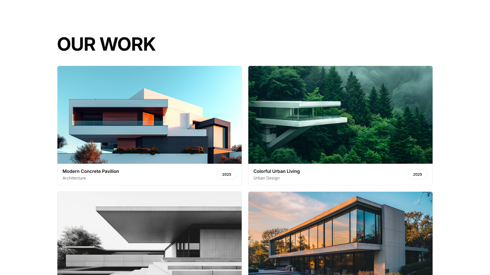

A portfolio section displays four project cards arranged in a 2x2 grid layout. Each card contains an image positioned above a text area with a project title, descriptive label, and year. The section is headed by a large "OUR WORK" title positioned at the top left.

**Install**: `pnpm dlx shadcn add @shadcnblocks/projects5`

---

## projects6

A centered section features a main heading at the top. Below, two images are positioned side-by-side horizontally, each with a label tag positioned in the upper left corner of its respective image.

**Install**: `pnpm dlx shadcn add @shadcnblocks/projects6`

---

## projects7

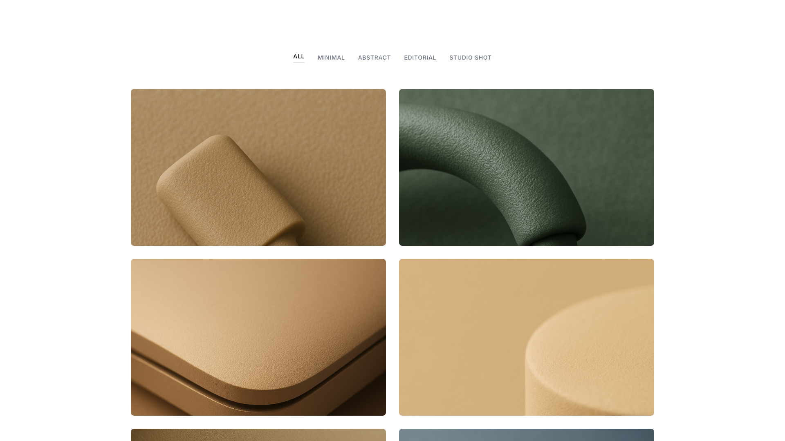

A gallery section displays a grid of six images arranged in three rows and two columns. Above the images, a horizontal navigation menu with five filter labels is centered at the top of the section.

**Install**: `pnpm dlx shadcn add @shadcnblocks/projects7`

---

## projects8

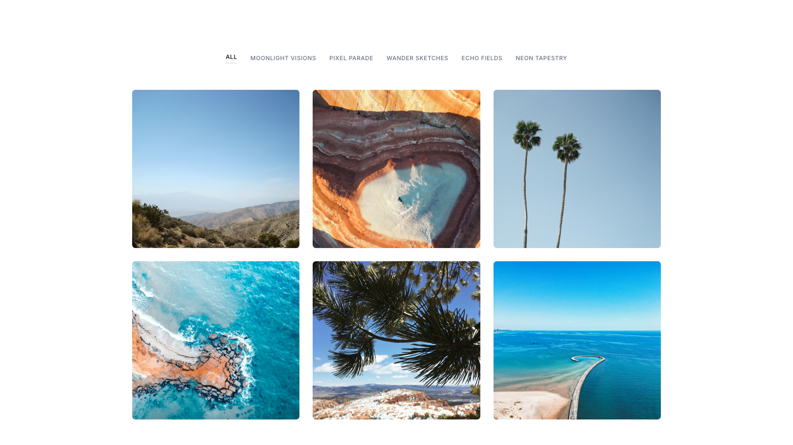

A grid layout displaying six images arranged in two rows and three columns. Each image is positioned equally within the grid structure, creating a uniform gallery arrangement. The images are contained within a centered container that spans the full width of the block. Above the grid, a tab navigation menu with six filter labels is centered at the top of the section.

**Install**: `pnpm dlx shadcn add @shadcnblocks/projects8`

---

## projects9

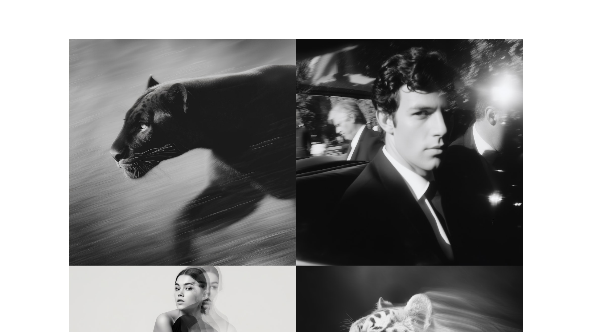

A grid layout displaying four black and white images arranged in a 2x2 format. Each image is positioned equally within its quadrant, with the top-left and top-right images spanning the upper half, and the bottom-left and bottom-right images occupying the lower half of the composition.

**Install**: `pnpm dlx shadcn add @shadcnblocks/projects9`

---

## projects10

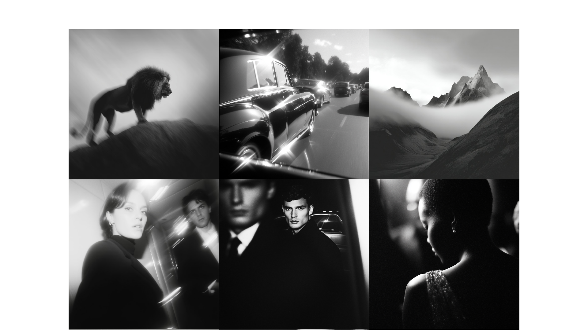

A grid layout displays six images arranged in two rows and three columns. Each image is positioned equally within the grid structure, creating a uniform gallery arrangement. The images are contained within a centered container that spans the full width of the block.

**Install**: `pnpm dlx shadcn add @shadcnblocks/projects10`

---

## projects11

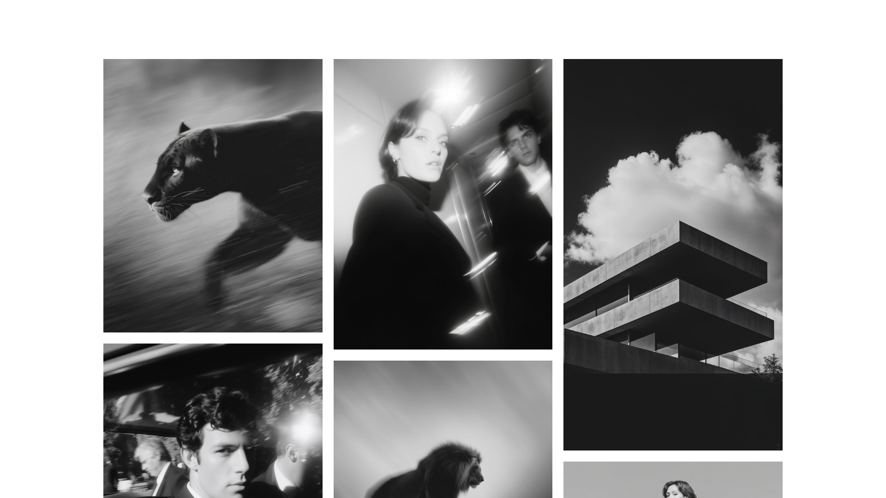

A grid layout displaying six images arranged in three columns and two rows. The left column contains two vertically stacked images of equal size. The center column features one tall image in the top row and one shorter image in the bottom row. The right column shows one tall image on top and a partial image at the bottom.

**Install**: `pnpm dlx shadcn add @shadcnblocks/projects11`

---

## projects12

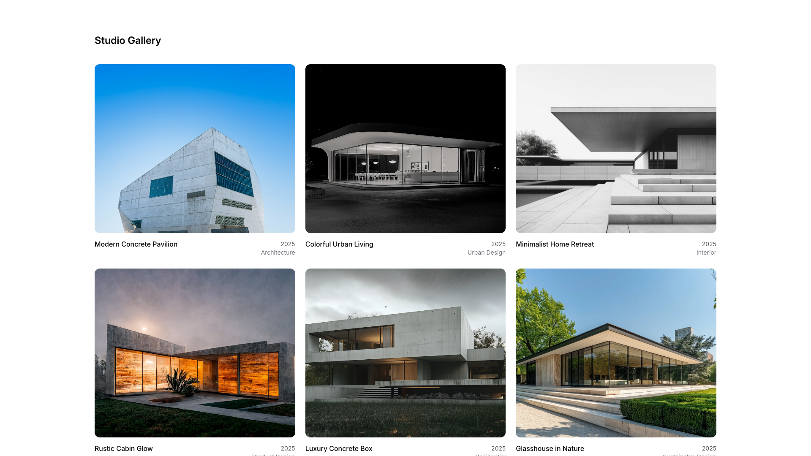

A gallery section displays a grid of six items arranged in two rows and three columns. Each item contains an image positioned above a title label, with a year and category tag aligned to the right below. The heading "Studio Gallery" appears at the top left of the section.

**Install**: `pnpm dlx shadcn add @shadcnblocks/projects12`

---

## projects13

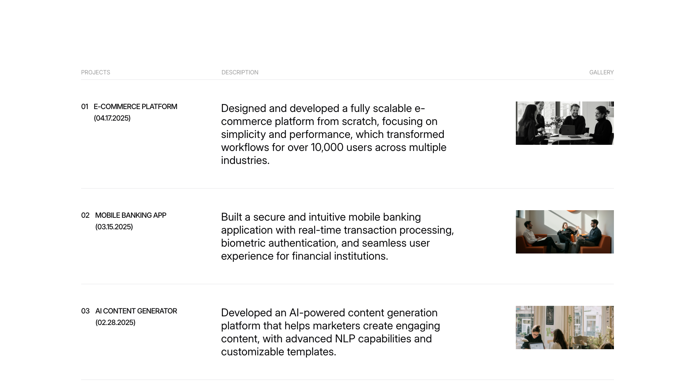

A three-row project list layout with four columns: a narrow left column containing project numbers and titles, a wider middle column with body text descriptions, a thin divider column, and a right column featuring images. Each row is horizontally divided by a separator line, with project information aligned on the left and corresponding images positioned on the right.

**Install**: `pnpm dlx shadcn add @shadcnblocks/projects13`

---

## projects14

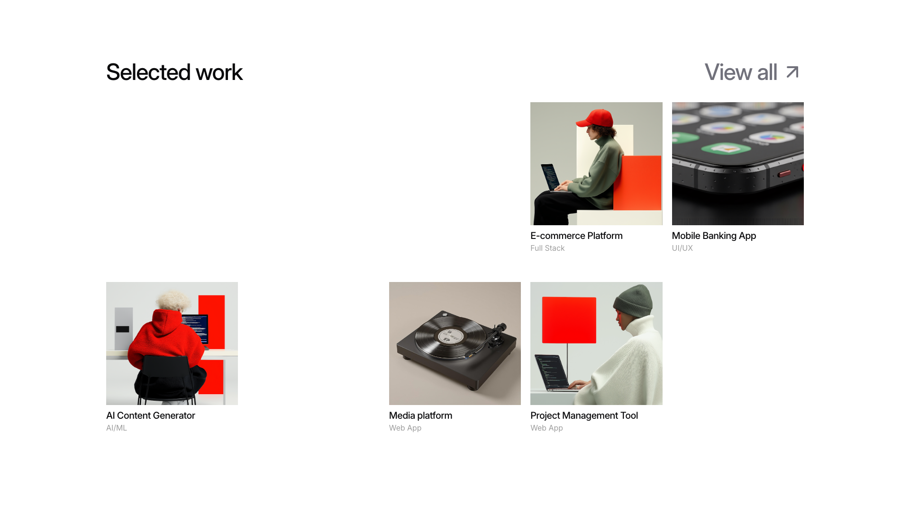

A portfolio section displays selected work in a grid layout with a heading on the left and a "View all" link on the right. Below, four project items are arranged in two rows: the top row contains two horizontally-aligned cards, while the bottom row contains three cards spanning the full width. Each card features an image with a title and descriptive label positioned below it.

**Install**: `pnpm dlx shadcn add @shadcnblocks/projects14`

---

## projects15

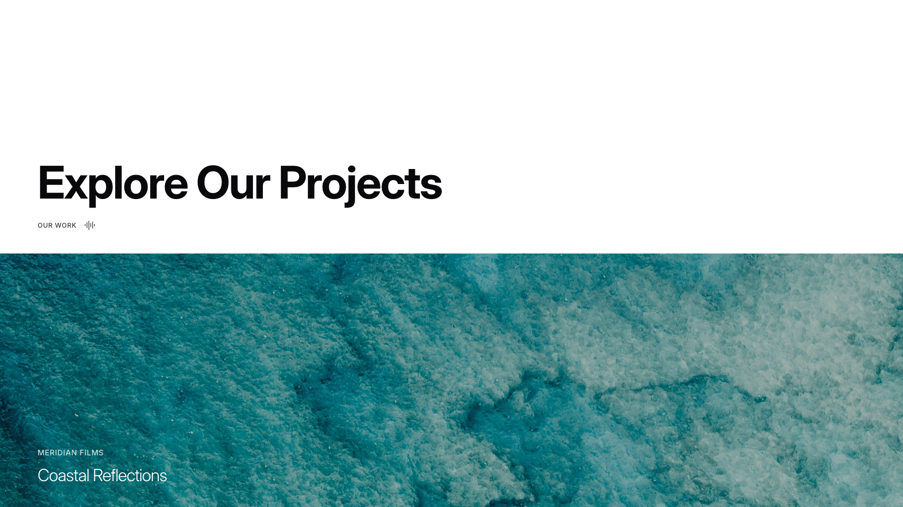

A webpage section features a large heading "Explore Our Projects" positioned on the left side of the upper area, with a small label "OUR WORK" and an icon placed directly below it. The lower portion of the section contains a large image that spans the full width, with text overlay positioned in the bottom left corner displaying a label and a subtitle.

**Install**: `pnpm dlx shadcn add @shadcnblocks/projects15`

---

## projects16

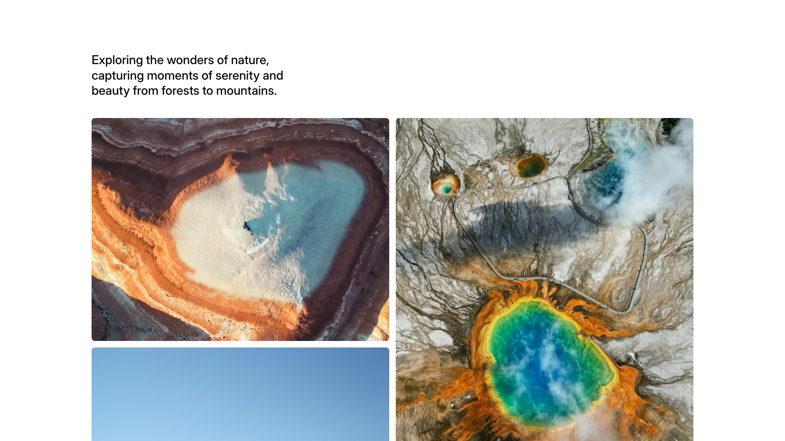

A section displays a heading and body text aligned to the left at the top. Below, three images are arranged in a grid layout: two images positioned side-by-side in the top row, and one larger image spanning the full width in the bottom row.

**Install**: `pnpm dlx shadcn add @shadcnblocks/projects16`

---

## projects17

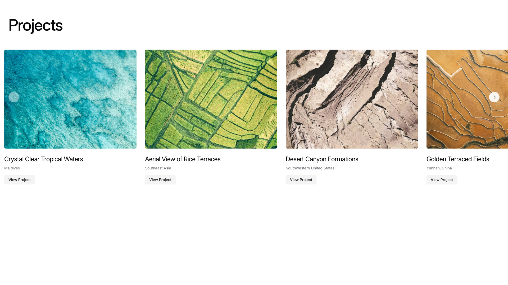

A slideshow grid layout displays 3.5 images arranged horizontally in a single row. Each image is positioned equally within the grid structure, creating a uniform gallery arrangement. The images are contained within a centered container that spans the full width of the block. Each image has a small caption label positioned at the bottom left corner. Additionally a sub-label under the main heading of the image and tags at the bottom. At the top of the section, a heading is left-aligned.

**Install**: `pnpm dlx shadcn add @shadcnblocks/projects17`

---
