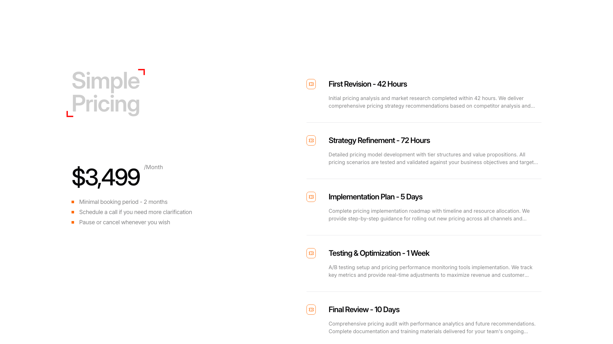
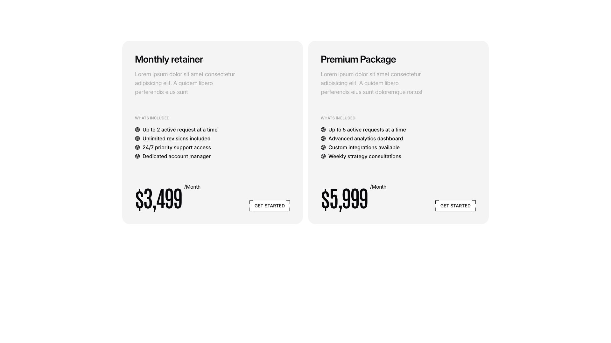

# Ratecard Blocks (2)

Rate card and pricing breakdown sections. Detail service costs and package options.

---

## ratecard1

A pricing page displays two columns: the left column contains a main heading, a price label with "/Month" text, and three bullet points. The right column vertically stacks five service offerings, each with an icon on the left and a heading followed by body text describing the service details.

**Install**: `pnpm dlx shadcn add @shadcnblocks/ratecard1`

---

## ratecard2

A section displays two pricing plan cards arranged horizontally side-by-side. Each card contains a heading at the top, followed by body text, a "What's Included" label, a bulleted list of features, and pricing information at the bottom. A "Get Started" button is positioned in the lower right corner of each card.

**Install**: `pnpm dlx shadcn add @shadcnblocks/ratecard2`

---
