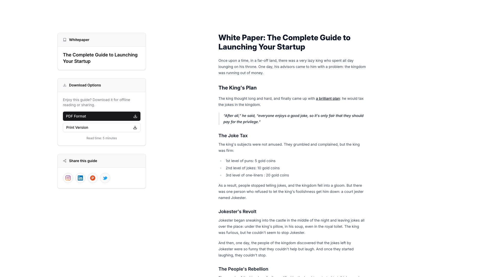
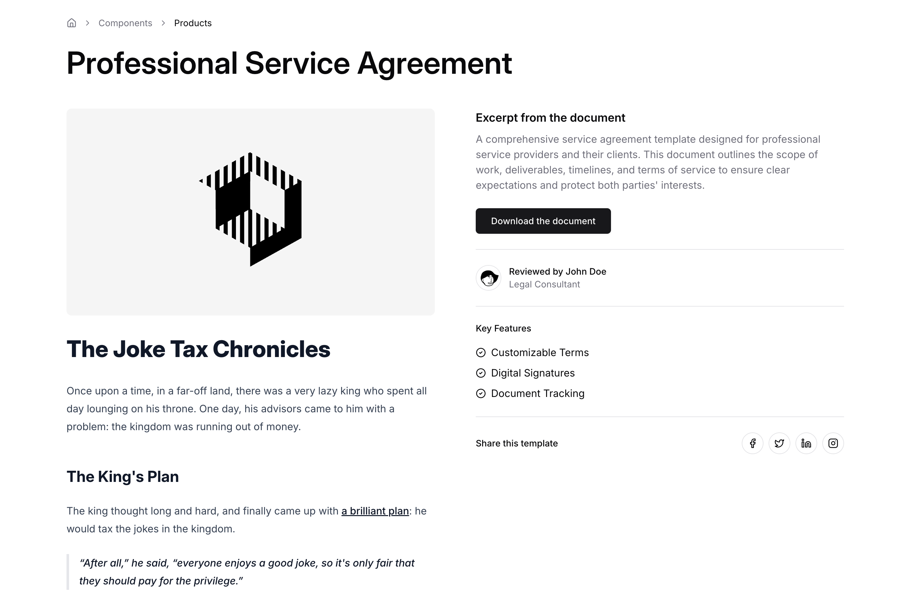

# Resource Blocks (2)

Resource sections linking to external materials. Provide access to guides, tools, and documentation.

---

## resource1

A two-column layout with a sidebar on the left and main content on the right. The left sidebar contains a label, a heading, download buttons with accompanying text, and social sharing icons arranged vertically. The right column displays a large heading, body text, section subheadings, and bulleted lists, organized in a single-column vertical flow.

**Install**: `pnpm dlx shadcn add @shadcnblocks/resource1`

---

## resource3

A two-column layout presents a Professional Service Agreement template. The left column contains a centered image, followed by a heading, subheading, and body text describing a narrative scenario. The right column includes a main heading, descriptive body text, a download button, reviewer information with an avatar, a features list with icons, and social media sharing icons aligned horizontally at the bottom.

**Install**: `pnpm dlx shadcn add @shadcnblocks/resource3`

---
