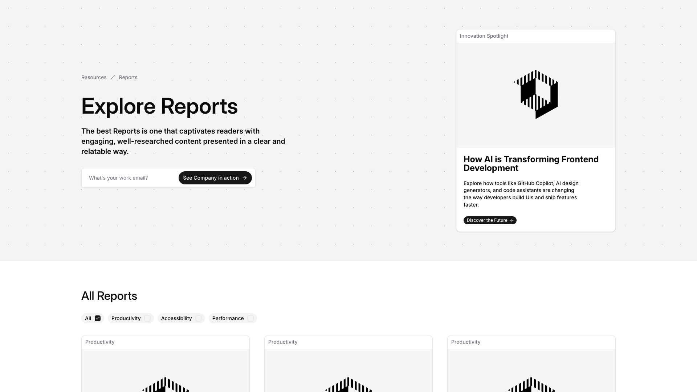
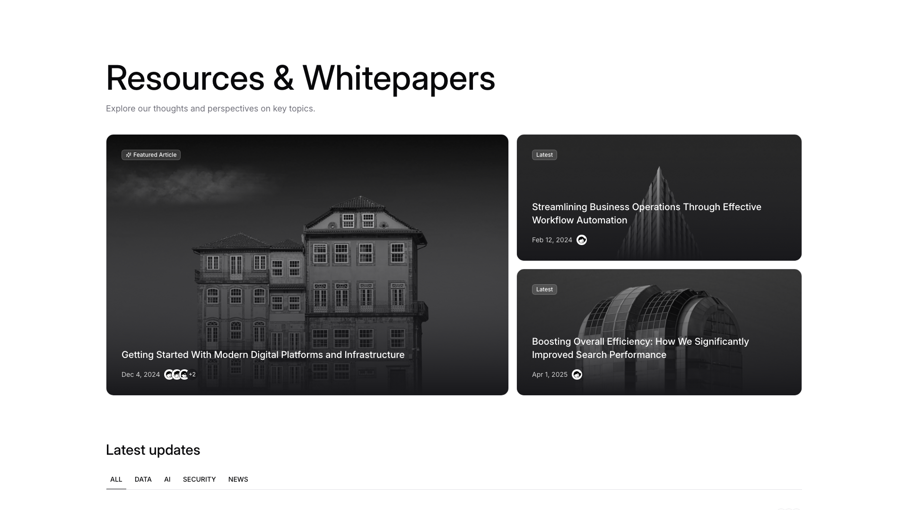
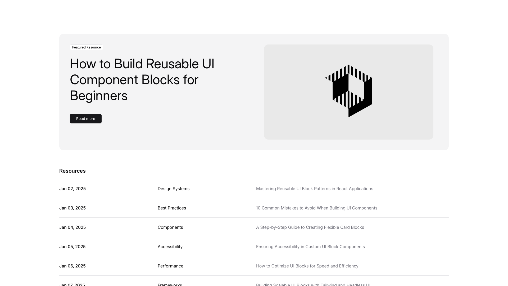
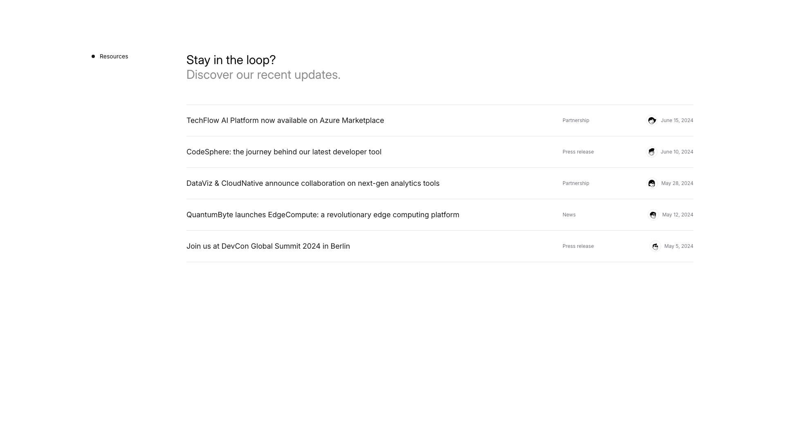

# Resources Blocks (4)

Resource library layouts for content collections. Organize multiple resources by category or type.

---

## resources1

A webpage section displays a two-column layout. The left column contains a breadcrumb navigation, a large heading, body text, an email input field, and a button. On the right side, a card with an image at the top is followed by a heading, descriptive body text, and a button positioned below. Further down the page, a "All Reports" section shows filter tabs horizontally aligned, with three report cards displayed in a grid layout below.

**Install**: `pnpm dlx shadcn add @shadcnblocks/resources1`

---

## resources2

A webpage section with a main heading and subheading at the top, followed by three content cards arranged horizontally. The left card is larger and contains an image with overlaid text and a date at the bottom. On the right, two smaller cards are stacked vertically, each with an image, a heading, a date label, and a small icon. Below this, a "Latest updates" section displays filter buttons arranged horizontally.

**Install**: `pnpm dlx shadcn add @shadcnblocks/resources2`

---

## resources3

A featured resource section is divided into two columns with a light background. The left column contains a label, a large heading, and a call-to-action button stacked vertically. The right column displays a centered image. Below this section, a resources table lists multiple entries with dates on the left, category labels in the center, and descriptive titles on the right, arranged horizontally across the width of the page.

**Install**: `pnpm dlx shadcn add @shadcnblocks/resources3`

---

## resources4

A vertical list section displays five news items stacked horizontally. Each item contains body text on the left side, followed by a label and date aligned to the right. A heading appears at the top of the section with supporting subtext underneath.

**Install**: `pnpm dlx shadcn add @shadcnblocks/resources4`

---
