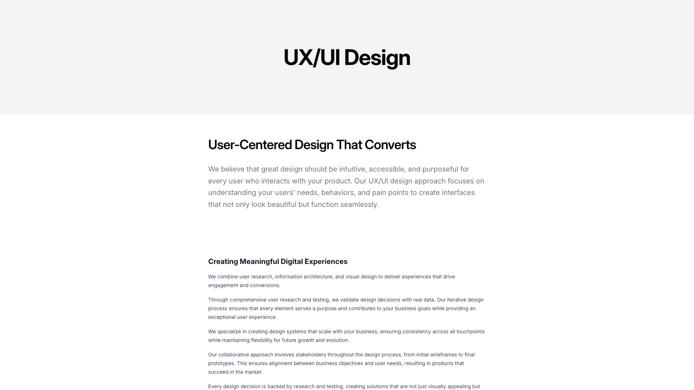
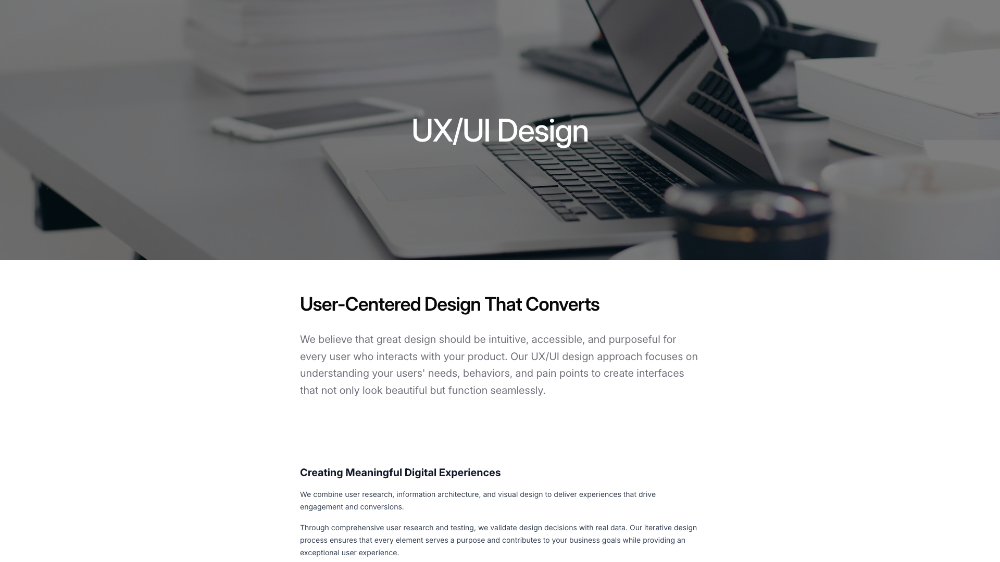
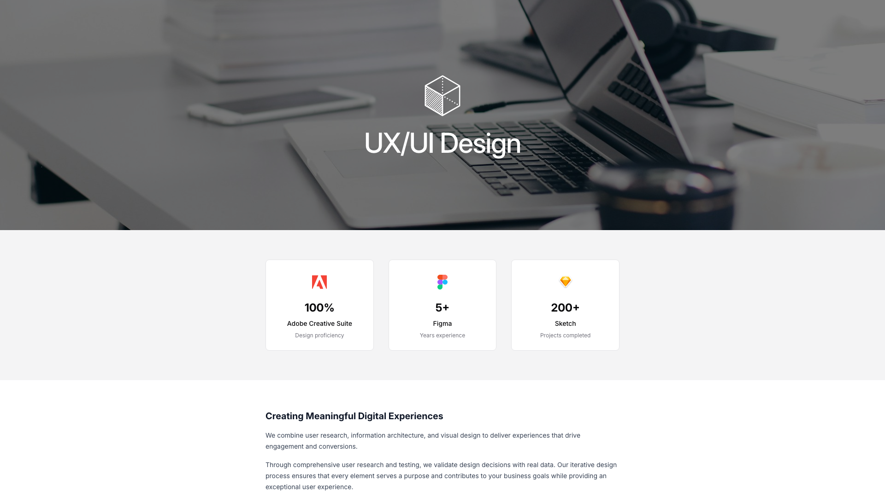
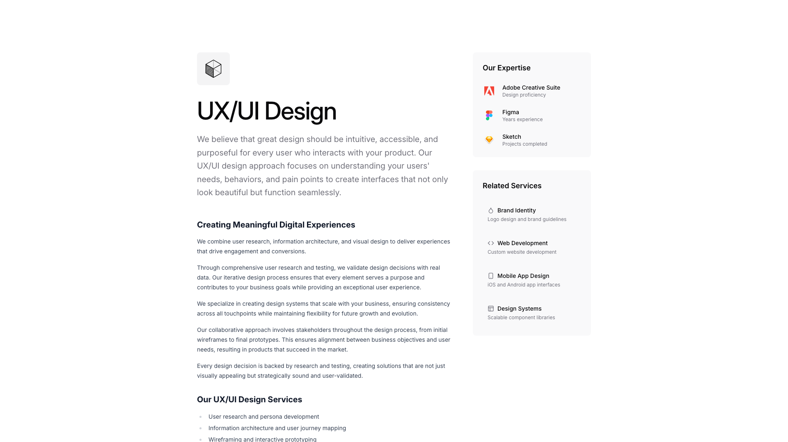
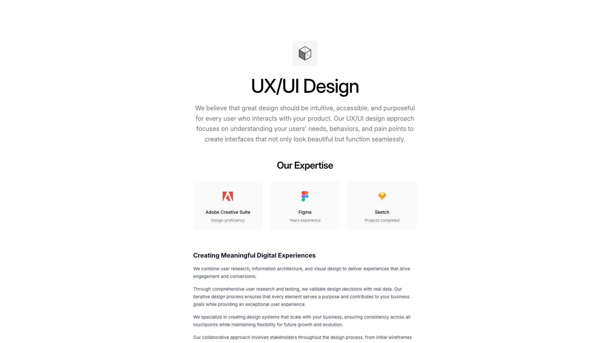
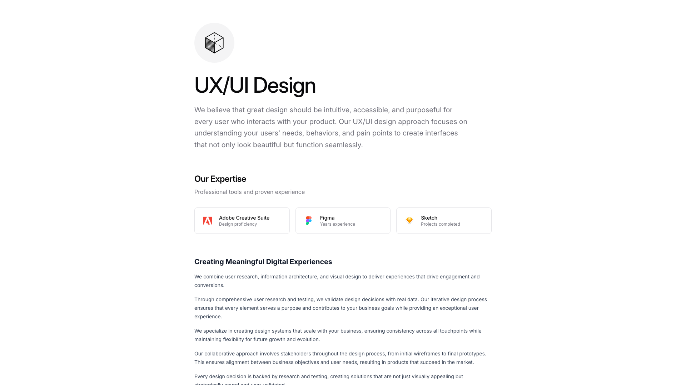

# Service Blocks (7)

Individual service description layouts. Detail specific offerings with benefits and features.

---

## service1

A vertically stacked content section features a centered heading at the top, followed by a subheading and body text. Below this, multiple paragraphs of body text are arranged in a single column, with consistent spacing between each text block.

**Install**: `pnpm dlx shadcn add @shadcnblocks/service1`

---

## service2

A full-width section with a centered hero image at the top displaying design workspace elements. Below, the content is organized vertically with a centered main heading, followed by body text. Further down, a secondary heading is positioned above multiple paragraphs of body text, all aligned to the left within a contained width.

**Install**: `pnpm dlx shadcn add @shadcnblocks/service2`

---

## service3

A centered section displays a main heading "Creating Meaningful Digital Experiences" with body text below it. Beneath the text, three card elements are arranged horizontally, each containing an icon, a numeric value, a label, and descriptive text positioned vertically and centered within their respective cards.

**Install**: `pnpm dlx shadcn add @shadcnblocks/service3`

---

## service4

A webpage section displays content in two columns with a centered header at the top. The left column contains multiple headings and body text paragraphs arranged vertically, with an icon list at the bottom. The right column features a "Our Expertise" section with three labeled items, each accompanied by a small icon positioned to the left of the text.

**Install**: `pnpm dlx shadcn add @shadcnblocks/service4`

---

## service5

A two-column layout with the left column containing a centered image at the top, followed by a main heading, body text, a subheading, additional paragraphs, and a list of services. The right column displays a sidebar with three sections stacked vertically: "Our Expertise" with labeled items, "Related Services" with icons and descriptions, positioned at the top and bottom respectively.

**Install**: `pnpm dlx shadcn add @shadcnblocks/service5`

---

## service6

A centered page section displays a heading at the top, followed by body text. Below this is a subheading labeled "Our Expertise," with three horizontally arranged cards containing an image, a label, and descriptive text each. Further down is another heading followed by multiple paragraphs of body text stacked vertically.

**Install**: `pnpm dlx shadcn add @shadcnblocks/service6`

---

## service7

A centered layout displays a heading "UX/UI Design" with an icon above it, followed by descriptive body text. Below this, a "Our Expertise" section lists three horizontally-arranged cards, each containing an icon, label, and descriptive text. Further down, another heading "Creating Meaningful Digital Experiences" is followed by multiple paragraphs of body text arranged in a single column.

**Install**: `pnpm dlx shadcn add @shadcnblocks/service7`

---
