# Services Blocks (18)

Service grid layouts showcasing multiple offerings. Display comprehensive service catalogs.

---

## services1

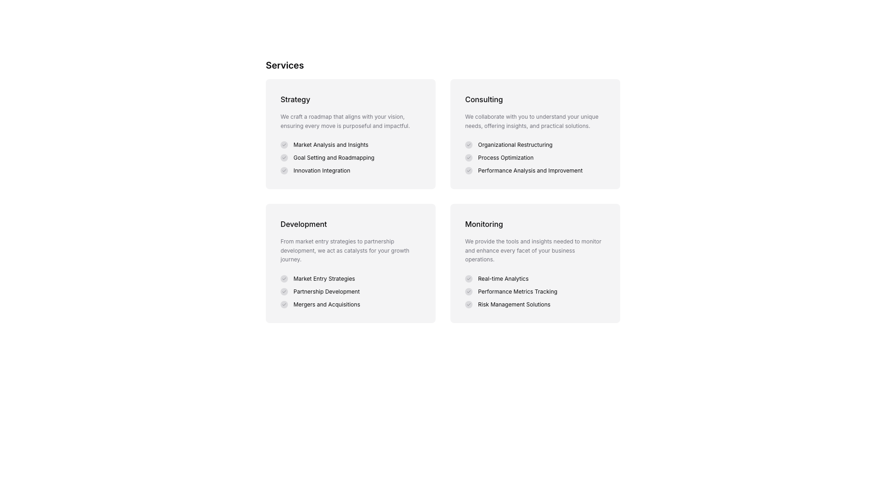

A services section displays four service categories arranged in a 2x2 grid layout. Each card contains a heading, body text description, and a vertically stacked list of three labeled items beneath. The cards are positioned horizontally in pairs, with the top row containing "Strategy" and "Consulting," and the bottom row containing "Development" and "Monitoring."

**Install**: `pnpm dlx shadcn add @shadcnblocks/services1`

---

## services3

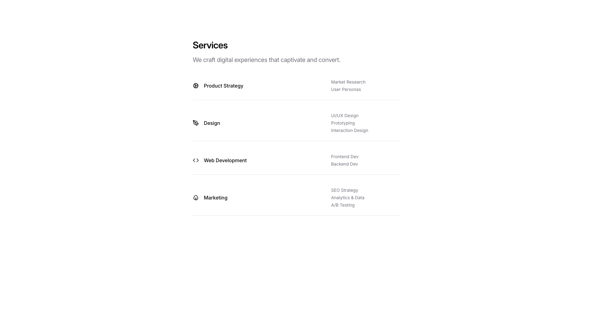

A services section displays content in a vertically stacked layout with a centered heading and subheading at the top. Below this, four service categories are listed, each with an icon on the left and a title, followed by two to three related sub-services aligned to the right.

**Install**: `pnpm dlx shadcn add @shadcnblocks/services3`

---

## services4

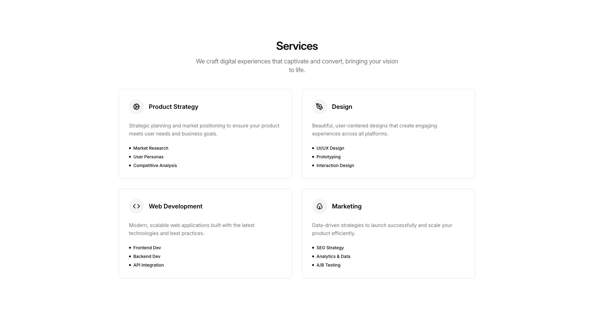

A centered "Services" section with a heading and descriptive body text at the top. Below this, four service cards are arranged in a 2x2 grid layout, each containing an icon, a title, descriptive text, and a bulleted list of sub-services.

**Install**: `pnpm dlx shadcn add @shadcnblocks/services4`

---

## services5

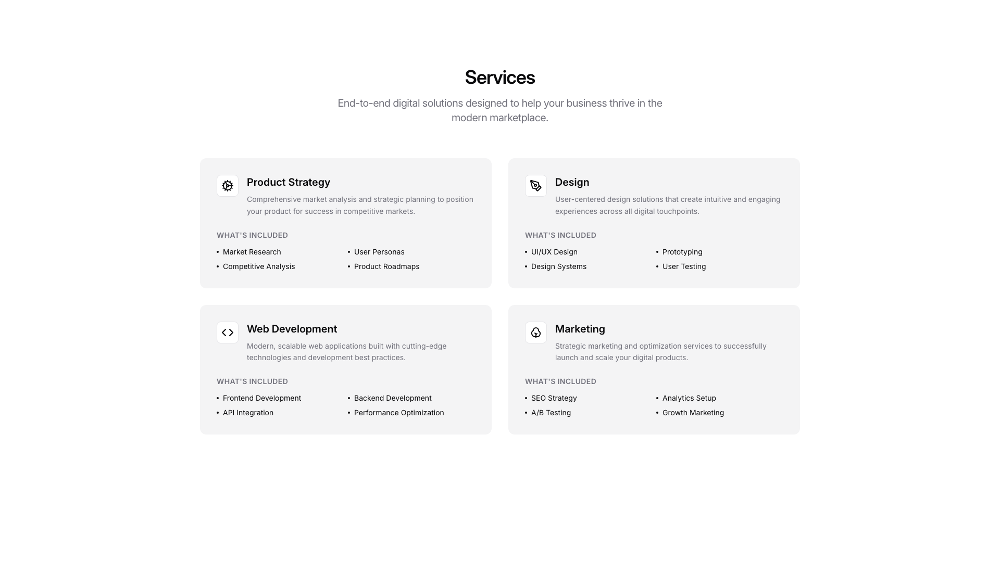

A services section displays content in a centered layout with a main heading and descriptive body text at the top. Below, four service cards are arranged in a 2x2 grid, each containing an icon on the left, a service title, descriptive text, and a bulleted list of included items arranged in two columns.

**Install**: `pnpm dlx shadcn add @shadcnblocks/services5`

---

## services6

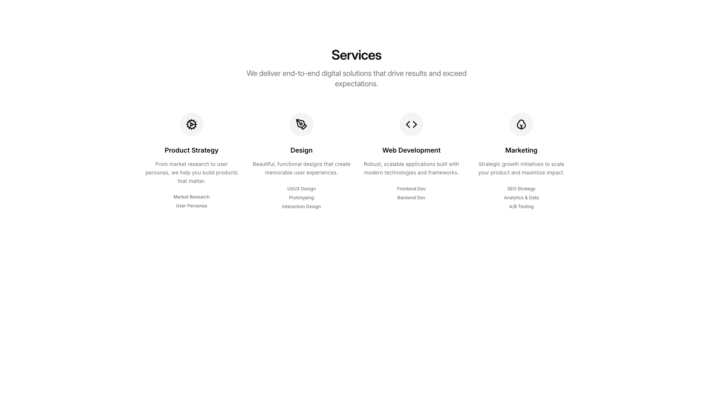

A centered section displays a main heading and descriptive body text at the top. Below this is a horizontally arranged grid of four service cards, each containing an icon, a service title, descriptive text, and a list of related sub-services vertically aligned underneath.

**Install**: `pnpm dlx shadcn add @shadcnblocks/services6`

---

## services7

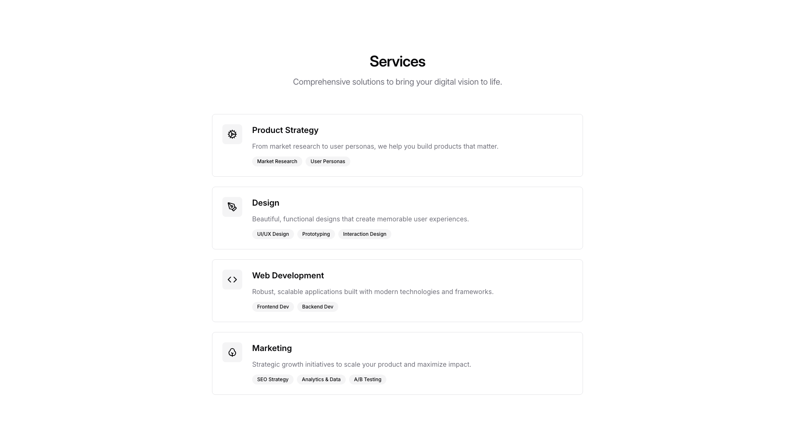

A centered "Services" section displays a main heading with descriptive body text positioned at the top. Below this, four service cards are stacked vertically, each containing an icon on the left, a heading, descriptive body text, and multiple tag labels arranged horizontally at the bottom of each card.

**Install**: `pnpm dlx shadcn add @shadcnblocks/services7`

---

## services8

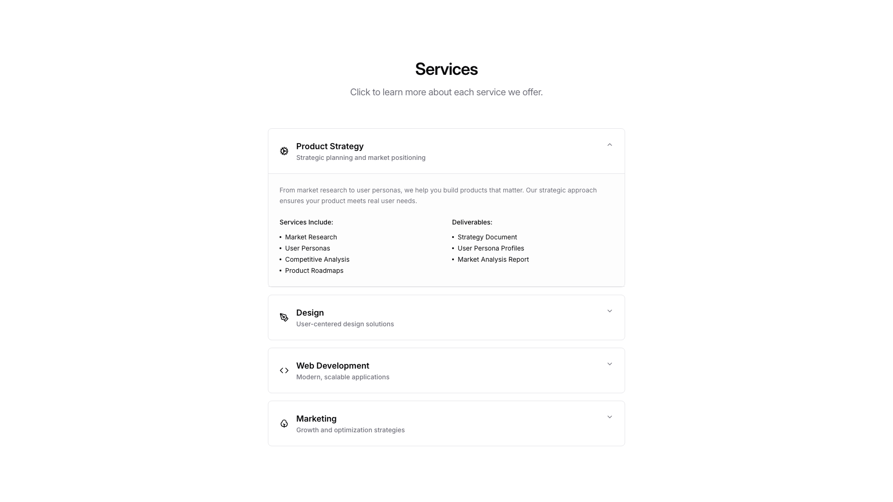

A centered "Services" section displays a heading, subheading, and vertically stacked accordion cards. The first card is expanded, showing an icon on the left, a title and subtitle, followed by two columns of bulleted lists labeled "Services Include" and "Deliverables." The three remaining cards below are collapsed, each showing an icon, title, and subtitle in a horizontal layout.

**Install**: `pnpm dlx shadcn add @shadcnblocks/services8`

---

## services9

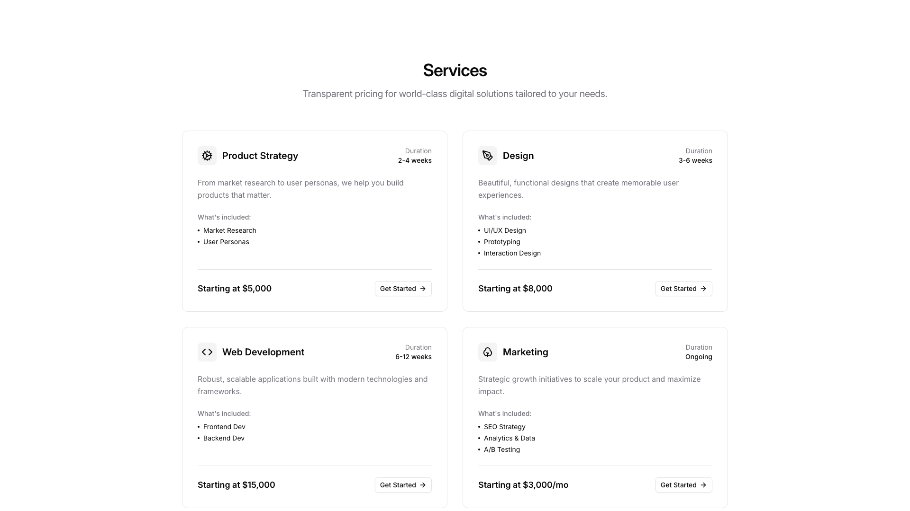

A centered heading with supporting body text introduces the section at the top. Below, four service cards are arranged in a 2x2 grid layout. Each card contains an icon on the left, a title, duration label in the top right, descriptive body text, a bulleted list, a price point at the bottom left, and a "Get Started" button link on the bottom right.

**Install**: `pnpm dlx shadcn add @shadcnblocks/services9`

---

## services10

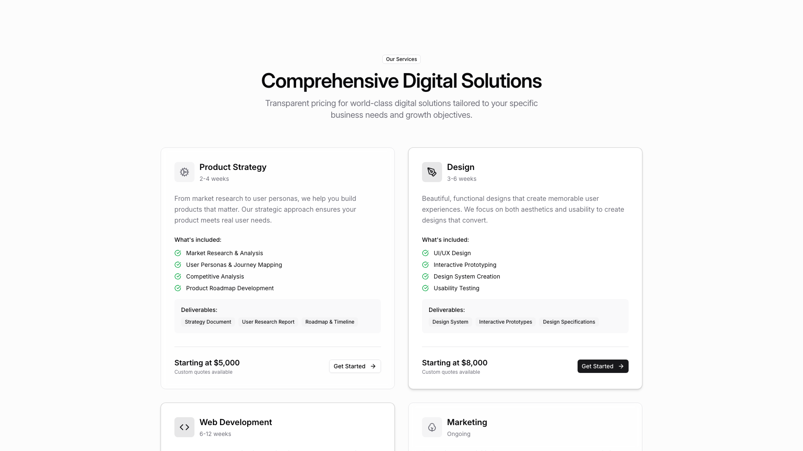

A services section displays four service cards arranged in a two-by-two grid layout. Each card contains a small icon on the left, a heading, a duration label, descriptive body text, a "What's included" section with checkmarked list items, a "Deliverables" section with tag labels, a price, and a "Get Started" button positioned at the bottom right. The cards are vertically and horizontally spaced evenly across the page.

**Install**: `pnpm dlx shadcn add @shadcnblocks/services10`

---

## services11

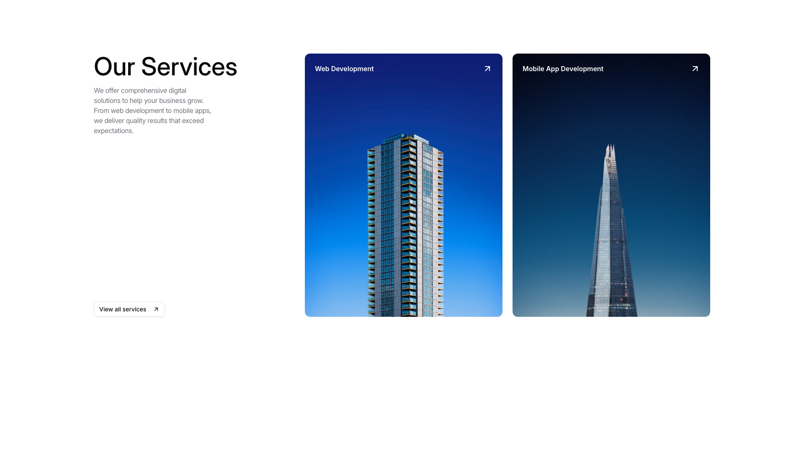

A services section features a left column containing a main heading, descriptive body text, and a link to view all services. To the right, two service cards are arranged horizontally, each displaying a label at the top and a large image below, with small icons in the upper right corners.

**Install**: `pnpm dlx shadcn add @shadcnblocks/services11`

---

## services12

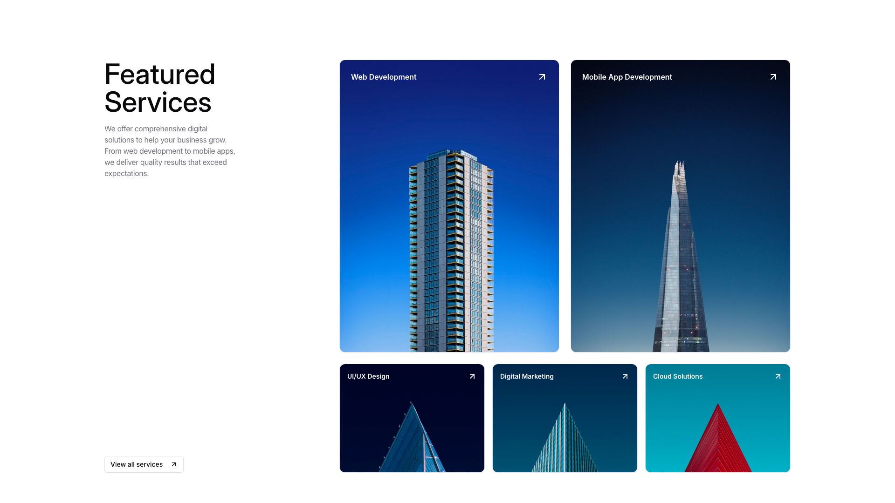

A featured services section is organized in two columns. The left column contains a main heading, descriptive body text, and a link. The right side displays five service cards arranged in a grid layout: two larger cards positioned horizontally on top, with three smaller cards arranged horizontally below them. Each card includes a label and an image.

**Install**: `pnpm dlx shadcn add @shadcnblocks/services12`

---

## services13

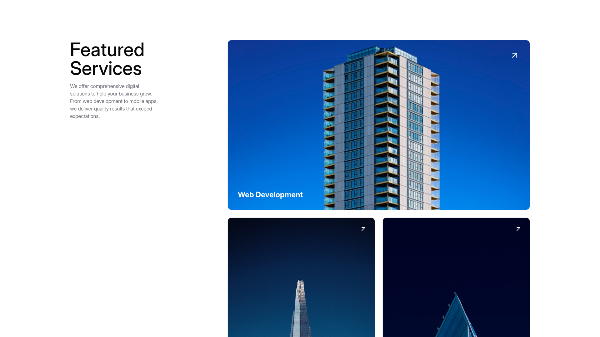

A featured services section displays content in two columns. On the left, a large heading, descriptive body text, and a smaller tagline are stacked vertically. To the right, three image cards are arranged in a grid layout—one larger card spans the top, while two smaller cards are positioned below it horizontally. Each card contains a label at the bottom.

**Install**: `pnpm dlx shadcn add @shadcnblocks/services13`

---

## services14

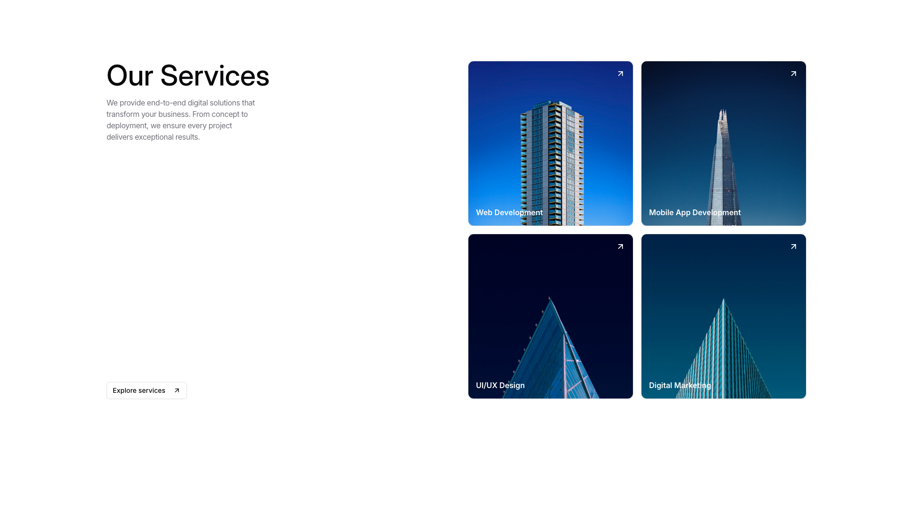

A services section features a two-column layout with text content on the left and a grid of cards on the right. The left column contains a main heading, body text, and a call-to-action link positioned vertically. The right side displays a 2x2 grid of service cards, each containing an image and a label at the bottom, arranged horizontally and vertically.

**Install**: `pnpm dlx shadcn add @shadcnblocks/services14`

---

## services15

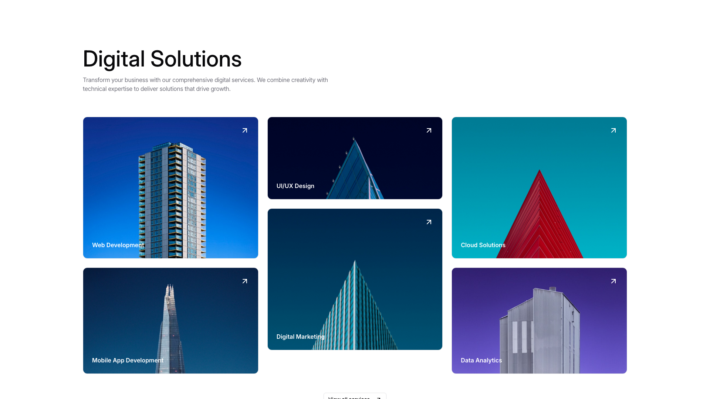

A webpage section displays a main heading at the top left, followed by body text. Below this, six service cards are arranged in a grid layout—two columns on the left and center, and two columns on the right. Each card contains a label positioned in the bottom left corner, an image filling the card, and a small icon in the top right. A "View all services" link appears centered at the bottom of the section.

**Install**: `pnpm dlx shadcn add @shadcnblocks/services15`

---

## services16

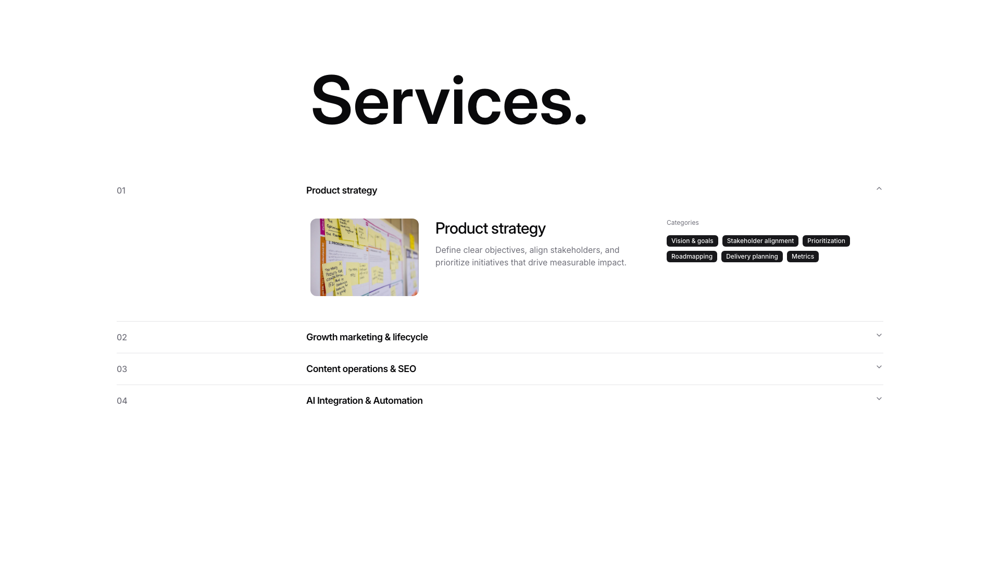

A services section displays a vertically stacked list of expandable items numbered 01-04. The first item is expanded, showing a two-column layout with an image on the left and descriptive text on the right, followed by category labels displayed horizontally. Items 02-04 below remain collapsed, each showing only a number, title, and expand/collapse indicator.

**Install**: `pnpm dlx shadcn add @shadcnblocks/services16`

---

## services18

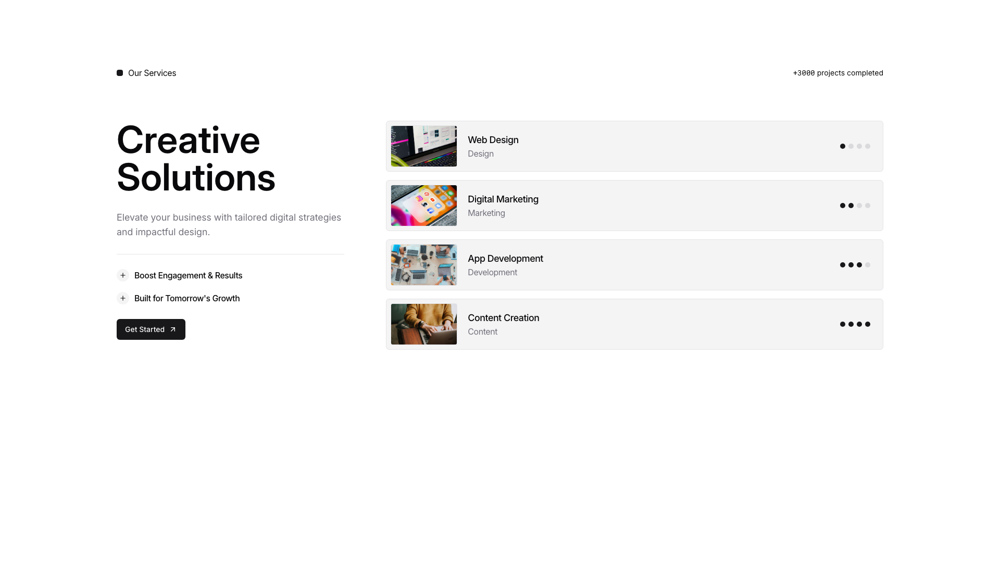

A two-column layout displays content with a left section containing a large heading, body text, two labeled items, and a button stacked vertically. The right section shows a vertical list of four service items, each with a small image on the left, a title and category label in the center, and indicator dots on the right.

**Install**: `pnpm dlx shadcn add @shadcnblocks/services18`

---

## services19

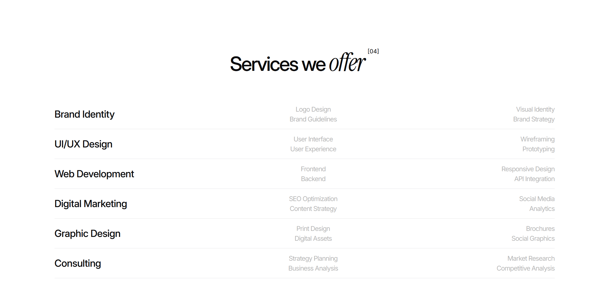

A centered heading "Services we offer" is positioned at the top. Below, six service categories are listed vertically on the left side in large bold text. To the right of each category, two to three related sub-services are displayed in smaller, lighter text, arranged in three columns horizontally across the layout.

**Install**: `pnpm dlx shadcn add @shadcnblocks/services19`

---

## services20

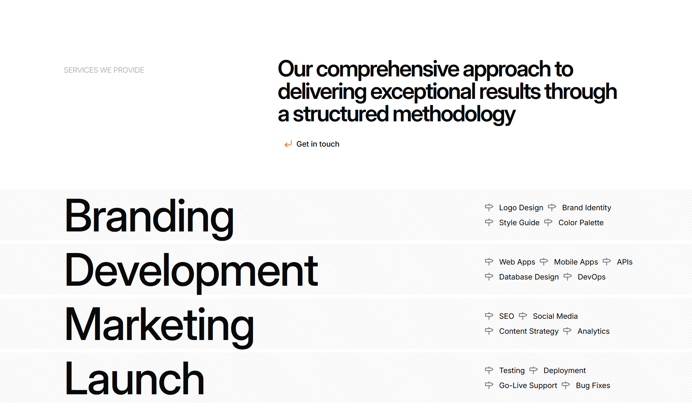

A webpage section displays a two-column layout. On the left side, a label appears at the top, followed by four large headings stacked vertically. On the right side, body text is positioned at the top, with four groups of linked items arranged vertically below it, each group containing two horizontally-aligned options. A button is centered near the top of the right column.

**Install**: `pnpm dlx shadcn add @shadcnblocks/services20`

---
