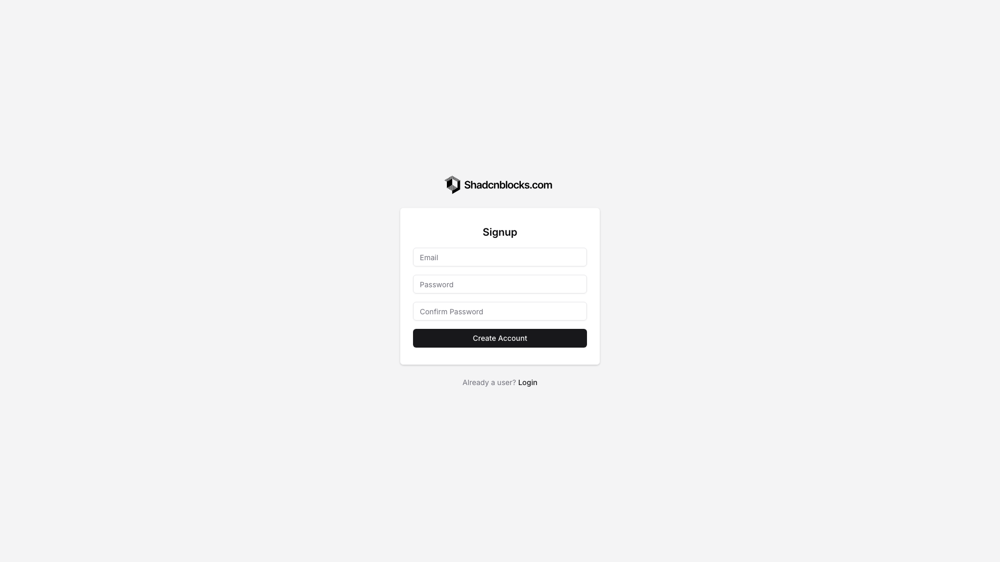
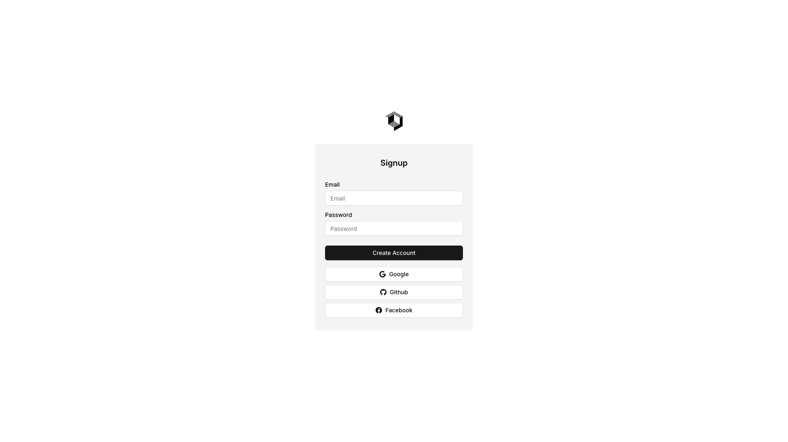
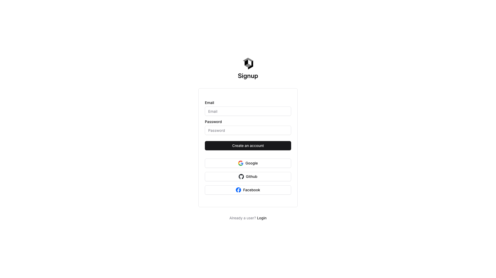
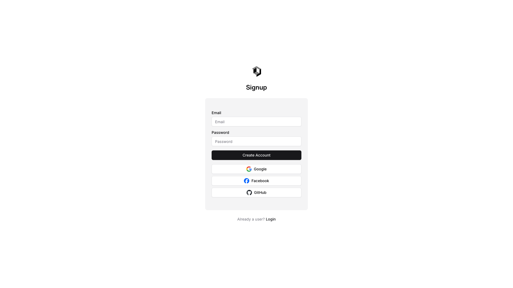
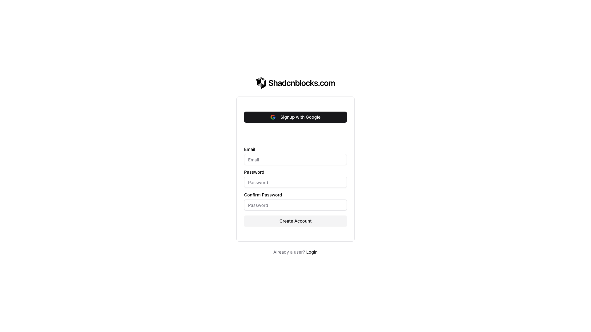
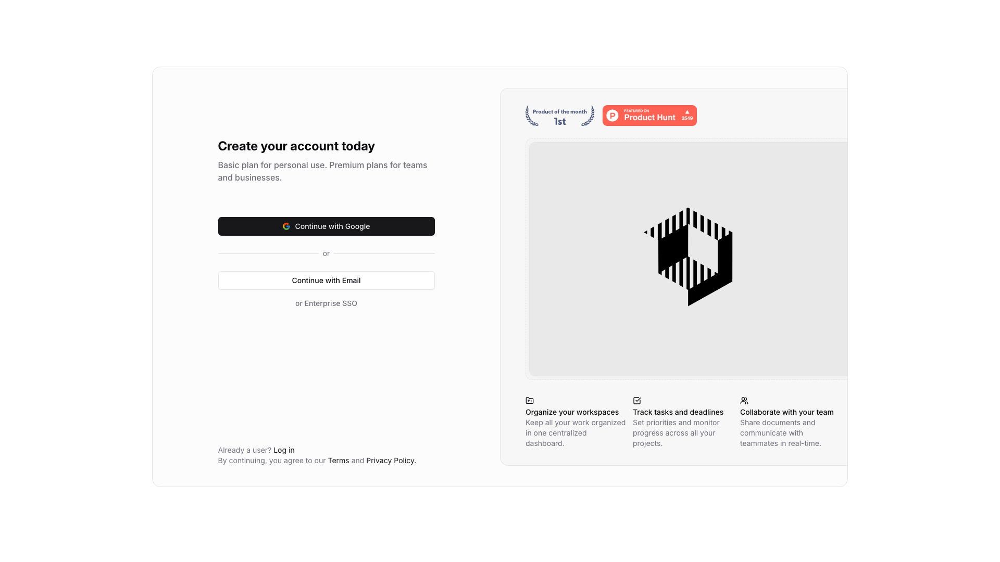
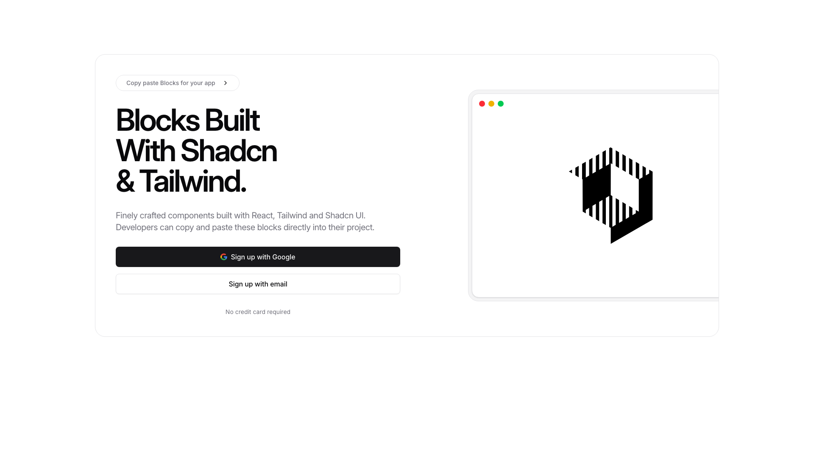
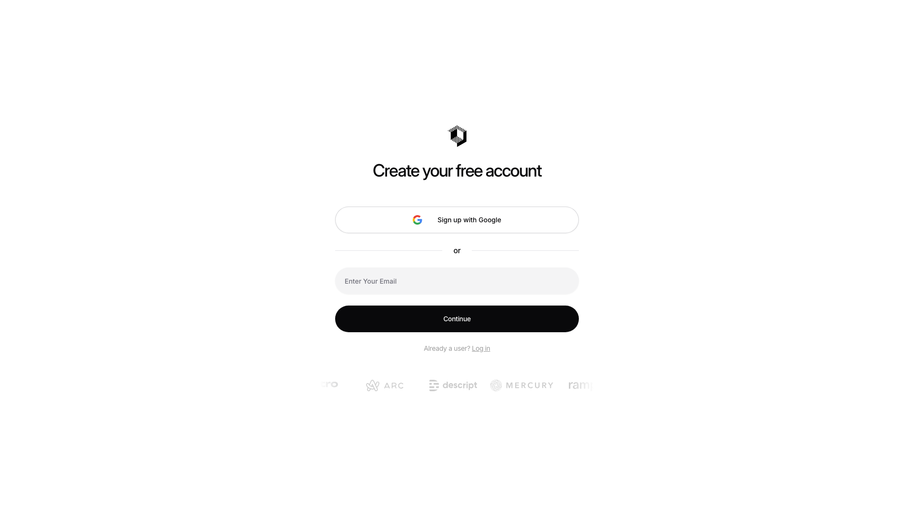
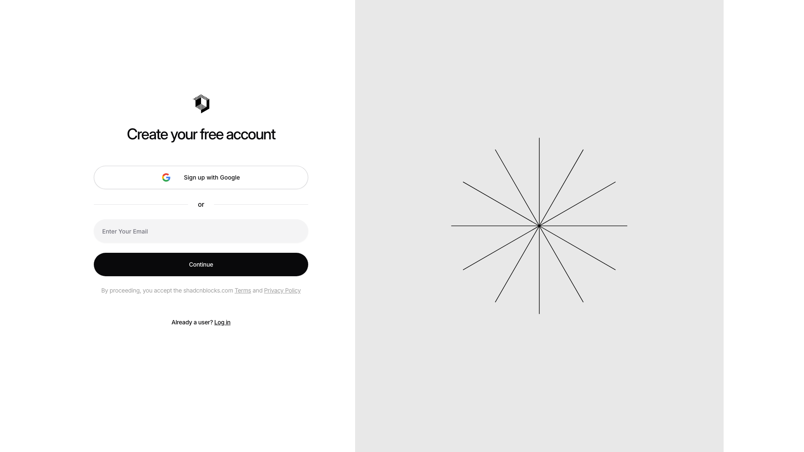

# Signup Blocks (10)

Sign-up forms and registration sections for new users. Capture user information and create accounts.

---

## signup1

A signup form is centered on the page with a logo positioned at the top. Below the heading "Signup" are three vertically stacked input fields for email, password, and password confirmation. A button labeled "Create Account" is positioned below the form fields, followed by a "Login" link at the bottom.

**Install**: `pnpm dlx shadcn add @shadcnblocks/signup1`

---

## signup2

A centered signup form displays vertically with a logo image at the top. Below the heading are three input fields stacked vertically for email, password, and password confirmation, followed by a button. At the bottom, there is body text with a linked "Login" option.

**Install**: `pnpm dlx shadcn add @shadcnblocks/signup2`

---

## signup3

A centered signup form displays vertically with an image at the top. Below are two input fields labeled "Email" and "Password," followed by a primary button. Three secondary buttons for alternative signup methods are stacked below, each displaying an icon and label.

**Install**: `pnpm dlx shadcn add @shadcnblocks/signup3`

---

## signup4

A centered signup form displays a heading at the top, followed by two stacked input fields for email and password. Below these fields is a primary button spanning the full width, followed by three horizontally-aligned social login buttons. At the bottom, there is body text with a login link positioned centrally.

**Install**: `pnpm dlx shadcn add @shadcnblocks/signup4`

---

## signup5

A centered signup form featuring a logo at the top, followed by two input fields stacked vertically for email and password. Below these fields is a primary button, with three social login options (Google, Facebook, and GitHub) displayed horizontally beneath it. At the bottom, there is body text with a link to the login page.

**Install**: `pnpm dlx shadcn add @shadcnblocks/signup5`

---

## signup6

A centered signup form displays vertically with a logo at the top. Below is a button for Google authentication, followed by three input fields for email, password, and password confirmation. A "Create Account" button is positioned at the bottom, with a login link in smaller text below.

**Install**: `pnpm dlx shadcn add @shadcnblocks/signup6`

---

## signup7

A two-column layout with a sign-up form on the left and a product showcase on the right. The left column contains a heading, body text, and vertically stacked buttons for authentication options, with additional login text at the bottom. The right column displays an image with three feature descriptions arranged horizontally beneath it, along with badges at the top.

**Install**: `pnpm dlx shadcn add @shadcnblocks/signup7`

---

## signup8

A signup section is divided into two columns. The left column contains a main heading, body text, and two vertically stacked buttons, with a small label centered below. The right column displays a large image centered in a browser window frame.

**Install**: `pnpm dlx shadcn add @shadcnblocks/signup8`

---

## signup9

A centered account creation form displays a heading at the top, followed by a Google sign-up button. Below that is divider text reading "or", then an email input field and a black continue button, all vertically stacked. At the bottom, there is a login link, and a row of faint logo images positioned horizontally.

**Install**: `pnpm dlx shadcn add @shadcnblocks/signup9`

---

## signup10

A signup page is divided into two columns. The left column contains a small icon, a heading, a Google sign-up button, an email input field, a continue button, and footer text with links, arranged vertically and centered. The right column displays a large image centered on a light gray background.

**Install**: `pnpm dlx shadcn add @shadcnblocks/signup10`

---
