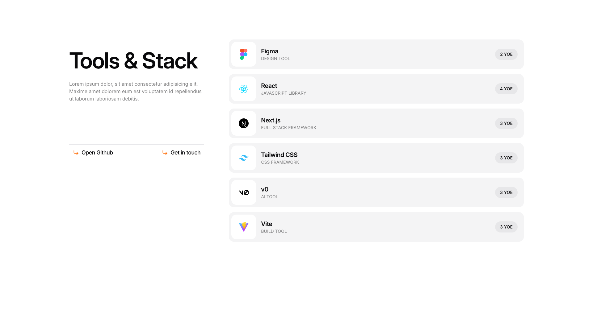
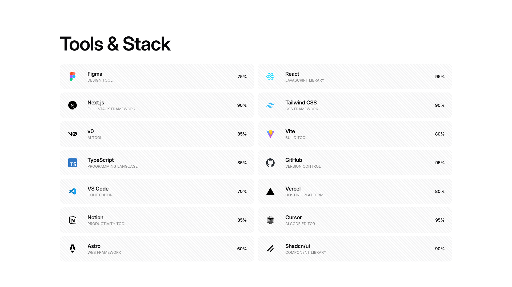

# Skills Blocks (2)

Skills showcase sections for expertise display. Highlight competencies and proficiency levels.

---

## skills1

A two-column layout with the left column containing a main heading, descriptive body text, and two action buttons positioned horizontally below. The right column displays a vertically stacked list of six items, each containing an image icon on the left, a title and subtitle in the center, and a label aligned to the right.

**Install**: `pnpm dlx shadcn add @shadcnblocks/skills1`

---

## skills2

A section titled "Tools & Stack" displays a two-column layout with paired items arranged vertically. Each item contains an icon on the left, followed by a tool name, category label, and a percentage value aligned to the right. The left column lists tools like Figma, Next.js, and TypeScript, while the right column presents tools such as React, Tailwind CSS, and GitHub in a mirrored structure.

**Install**: `pnpm dlx shadcn add @shadcnblocks/skills2`

---
