# Stats Blocks (18)

Statistics and metrics sections with data visualization. Present key numbers and performance indicators.

---

## stats1

A centered section displays three key performance metrics arranged horizontally across the layout. Each metric consists of a label positioned above a large numerical value, with descriptive body text below. The three columns are evenly spaced and aligned vertically.

**Install**: `pnpm dlx shadcn add @shadcnblocks/stats1`

---

## stats2

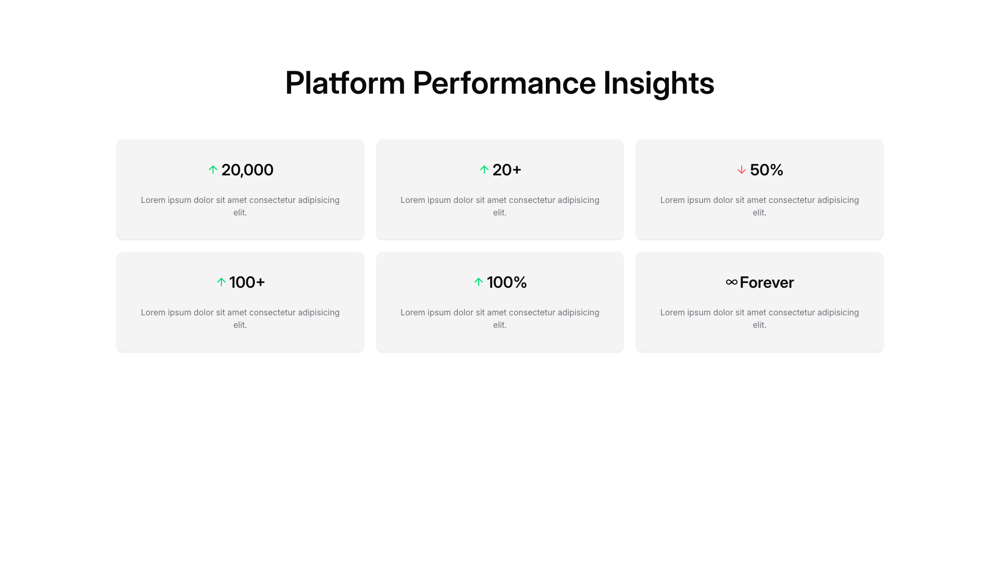

A section titled "Platform Performance Insights" displays six metric cards arranged in a two-row, three-column grid layout. Each card contains a centered metric value or label at the top, followed by body text below. The cards are uniformly sized and positioned horizontally across the page with consistent spacing between them.

**Install**: `pnpm dlx shadcn add @shadcnblocks/stats2`

---

## stats4

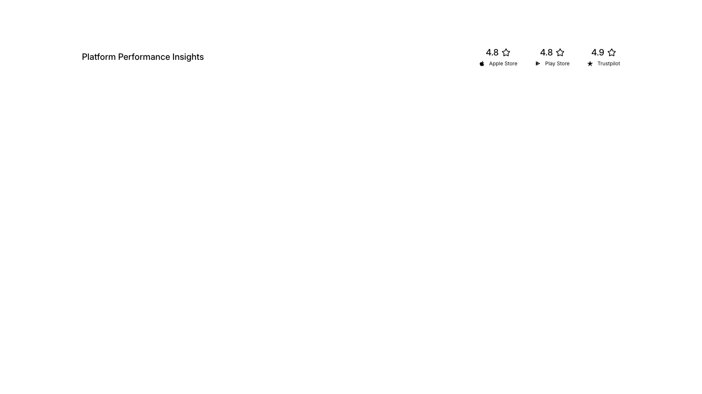

A header section displays a heading on the left side, with three rating badges positioned horizontally on the right. Each badge contains a star icon, a numerical rating, and a platform label arranged vertically.

**Install**: `pnpm dlx shadcn add @shadcnblocks/stats4`

---

## stats5

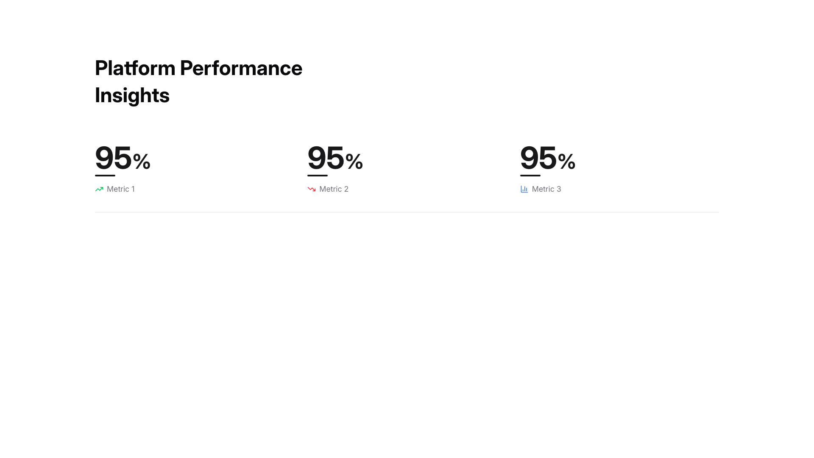

A dashboard section displays a heading at the top left, followed by three metric cards arranged horizontally across the page. Each card contains a large percentage value centered above a label and small icon positioned below. The cards are evenly spaced in a row layout.

**Install**: `pnpm dlx shadcn add @shadcnblocks/stats5`

---

## stats6

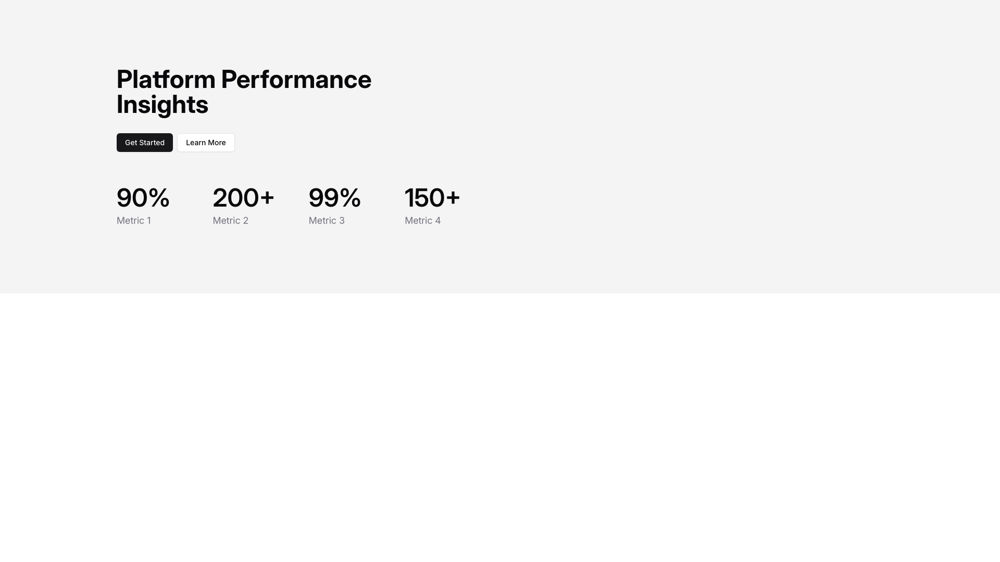

A webpage section displays a heading at the top left, followed by two buttons positioned horizontally below it. Further down, four metrics are arranged horizontally across the page, each displaying a large number with a label underneath.

**Install**: `pnpm dlx shadcn add @shadcnblocks/stats6`

---

## stats7

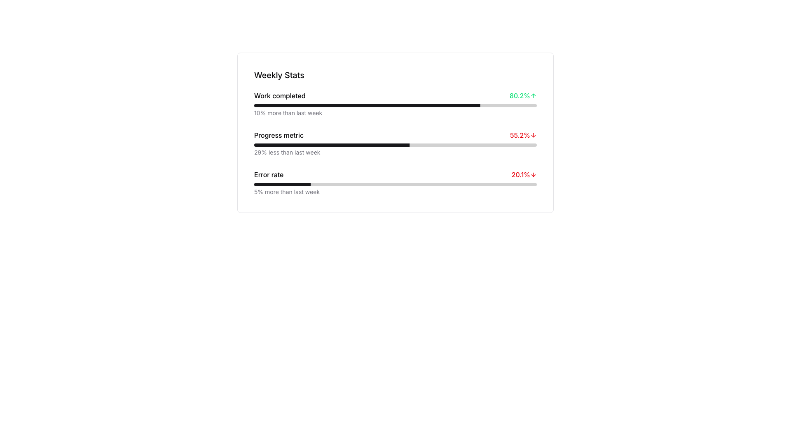

A card-style section displays weekly performance metrics in a vertical layout. The heading "Weekly Stats" appears at the top, followed by three horizontally-stacked metric rows, each containing a label on the left, a progress bar in the center, and a percentage value with directional indicator on the right. Descriptive body text appears below each progress bar.

**Install**: `pnpm dlx shadcn add @shadcnblocks/stats7`

---

## stats8

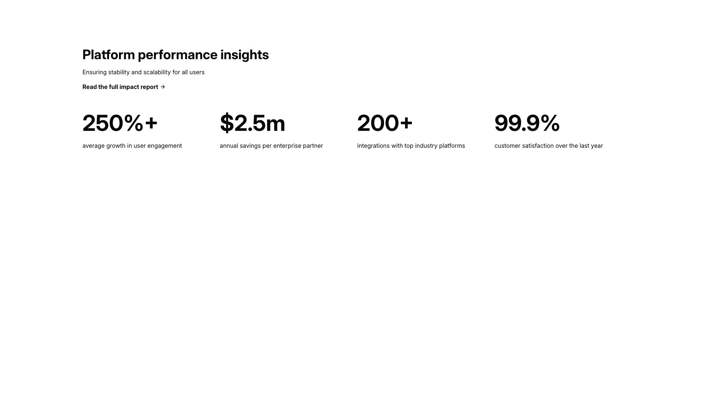

A webpage section displays a main heading at the top left with supporting body text beneath it. Below this is a linked text element. Four key metrics are arranged horizontally in a row, each containing a large numerical value centered above a descriptive label positioned directly underneath.

**Install**: `pnpm dlx shadcn add @shadcnblocks/stats8`

---

## stats9

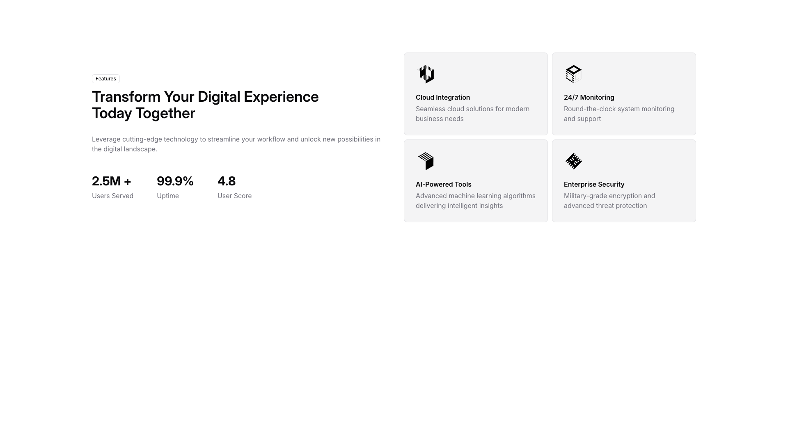

A features section displays content in two columns. The left column contains a small label, a large heading, descriptive body text, and three key statistics arranged horizontally. The right column features a 2x2 grid of feature cards, each containing an image, a heading, and descriptive text.

**Install**: `pnpm dlx shadcn add @shadcnblocks/stats9`

---

## stats10

A section displays three cards arranged horizontally in a row. Each card contains an image on the left, a label and heading in the center, and body text below. The cards are evenly spaced and positioned side-by-side across the layout.

**Install**: `pnpm dlx shadcn add @shadcnblocks/stats10`

---

## stats11

A webpage section displays content in two columns with a left-aligned layout. On the left side, a main heading is followed by body text, then four metric blocks arranged in a 2x2 grid, each containing a large number, label, and smaller descriptive text. On the right side, a large curved line graph spans the full height of the section.

**Install**: `pnpm dlx shadcn add @shadcnblocks/stats11`

---

## stats12

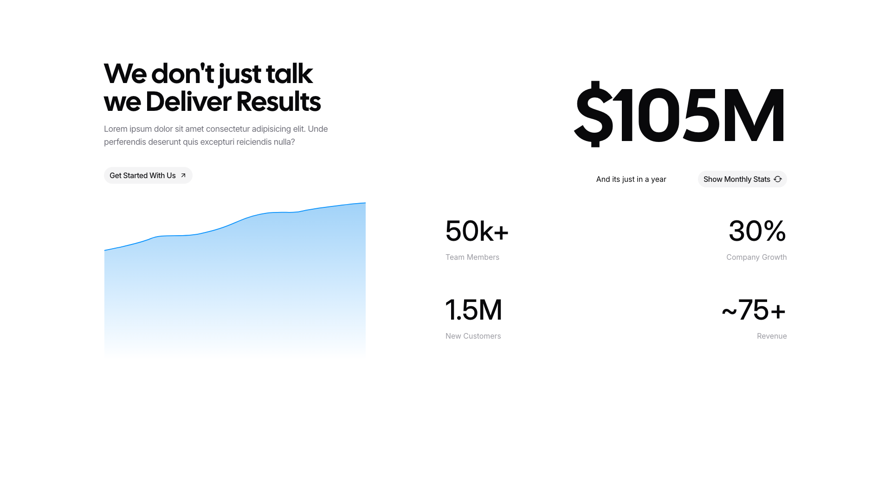

A two-column layout section with text content on the left and performance metrics on the right. The left column features a main heading, body text, and a button, alongside an image below. The right column displays a large dollar amount at the top, followed by four metric cards arranged in a 2x2 grid, each containing a number and descriptive label.

**Install**: `pnpm dlx shadcn add @shadcnblocks/stats12`

---

## stats13

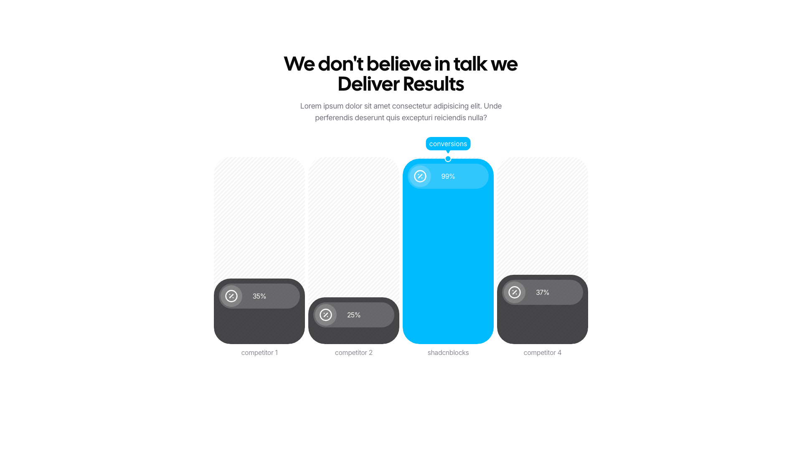

A centered section with a main heading and body text at the top, followed by a horizontal bar chart displaying four data columns. The chart features one prominent tall column in the center (highlighted in blue) flanked by three shorter columns on either side, each labeled with a name and percentage value.

**Install**: `pnpm dlx shadcn add @shadcnblocks/stats13`

---

## stats14

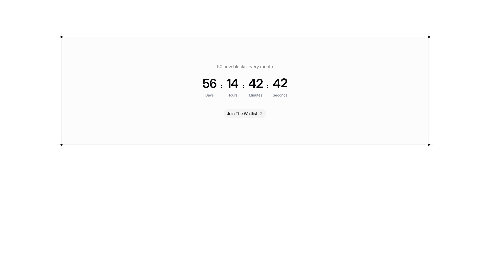

A centered layout displays a small heading at the top, followed by a large countdown timer showing four numerical values horizontally arranged with unit labels beneath each number. Below the timer, a button with accompanying icon text is centered on the page.

**Install**: `pnpm dlx shadcn add @shadcnblocks/stats14`

---

## stats15

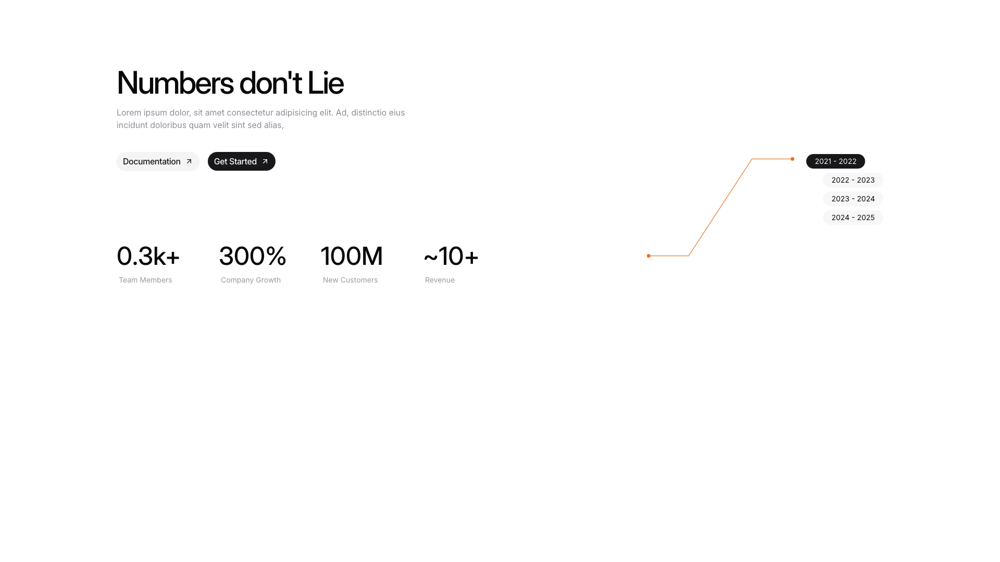

A webpage section is divided into two main areas. On the left, a large heading is positioned at the top, followed by body text and two buttons arranged horizontally. Below this, four metric blocks are displayed in a row, each containing a large number and a label. On the right side, a line graph image is shown with a legend listing four time period labels vertically aligned.

**Install**: `pnpm dlx shadcn add @shadcnblocks/stats15`

---

## stats16

A centered section with a small tag label at the top, followed by a large heading and descriptive body text. Below this is a line chart image spanning the full width. At the bottom, three statistics are displayed horizontally in equal columns, each containing a large number, a label, and secondary text.

**Install**: `pnpm dlx shadcn add @shadcnblocks/stats16`

---

## stats17

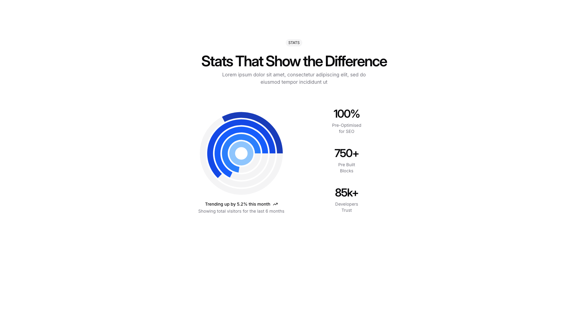

A centered section displays a heading and descriptive body text at the top. Below this is a two-column layout with a large circular image positioned on the left, and three statistics with labels stacked vertically on the right. Beneath the image is additional descriptive text with a trend indicator.

**Install**: `pnpm dlx shadcn add @shadcnblocks/stats17`

---

## stats18

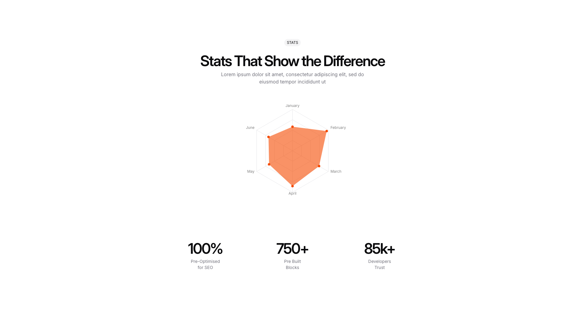

A centered section contains a heading, descriptive body text, and a radar chart image positioned above three equally-spaced stat blocks arranged horizontally. Each stat block displays a large number, a label, and descriptive text, aligned centrally within the layout.

**Install**: `pnpm dlx shadcn add @shadcnblocks/stats18`

---

## stats19

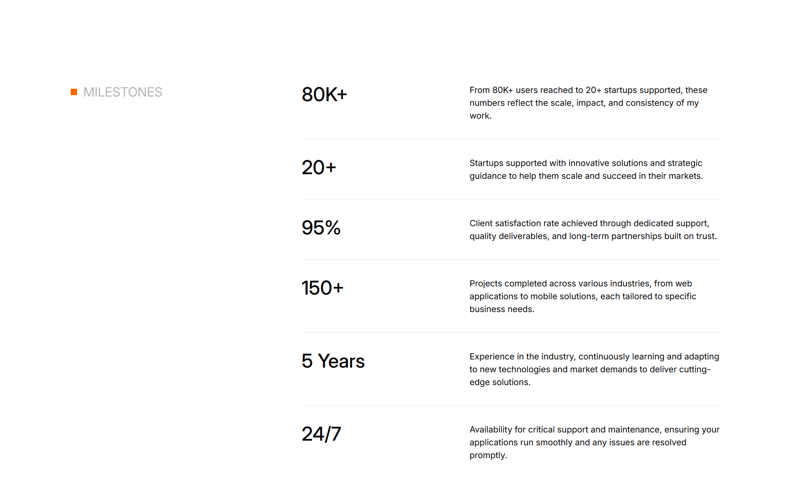

A vertically stacked list of milestone items displays in a two-column layout. On the left, large numerical and text headings are positioned with consistent spacing. To the right of each heading, body text descriptions are aligned and positioned at the same vertical level, creating a balanced information hierarchy from top to bottom.

**Install**: `pnpm dlx shadcn add @shadcnblocks/stats19`

---
