# Team Blocks (12)

Team sections featuring member profiles and bios. Introduce staff with photos and descriptions.

---

## team1

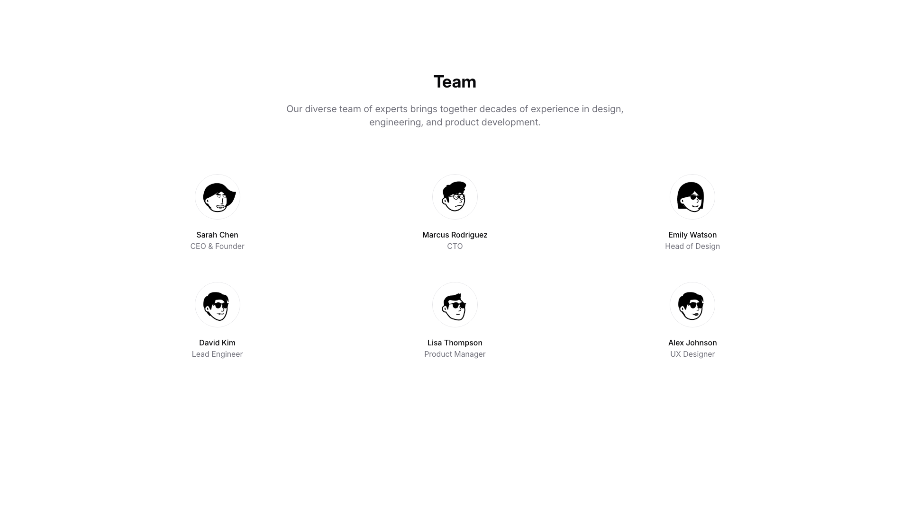

A centered section displays a main heading and descriptive body text at the top. Below, six team member profiles are arranged in two rows of three columns, each containing an image, a name, and a job title label positioned underneath.

**Install**: `pnpm dlx shadcn add @shadcnblocks/team1`

---

## team2

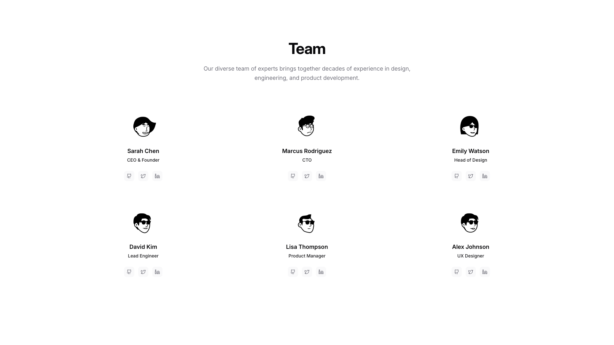

A team section features a centered heading with supporting body text at the top. Below, six team member cards are arranged in two rows of three, displayed horizontally across the page. Each card contains a small image, a name label, a job title label, and three icon buttons positioned below.

**Install**: `pnpm dlx shadcn add @shadcnblocks/team2`

---

## team3

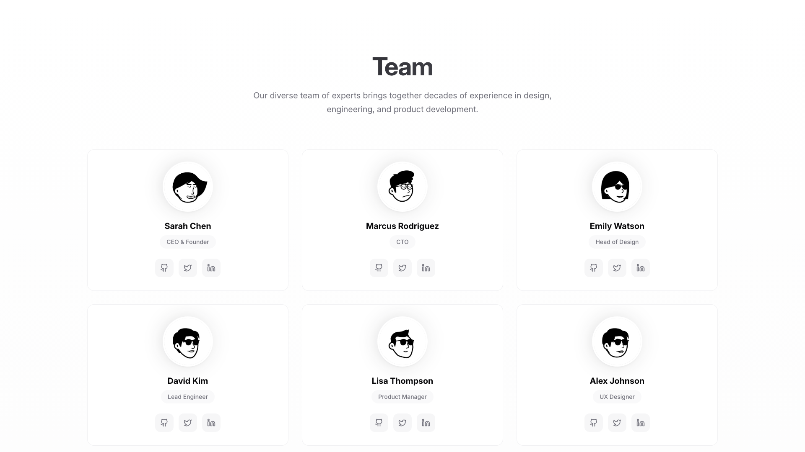

A team section features a centered heading and descriptive body text at the top. Below, six team member cards are arranged in two rows of three columns. Each card contains a circular image, a name label, a job title label, and three icon buttons positioned horizontally at the bottom.

**Install**: `pnpm dlx shadcn add @shadcnblocks/team3`

---

## team4

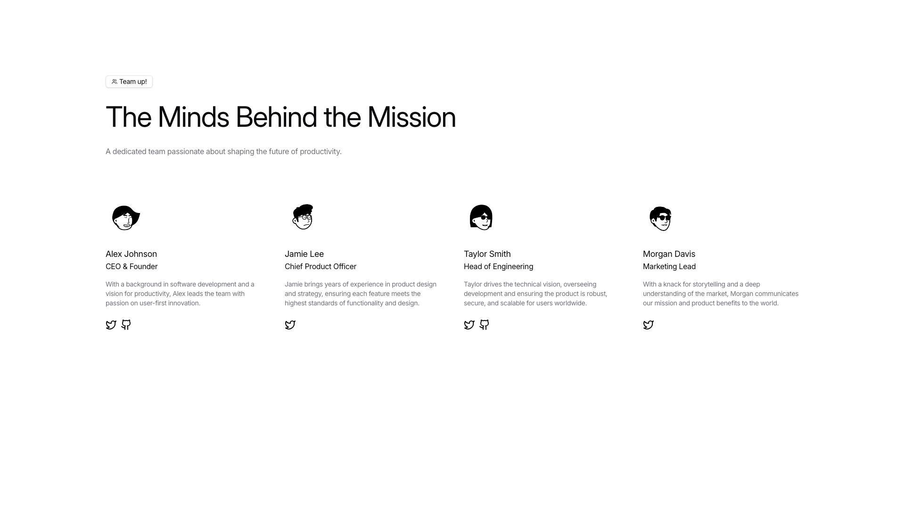

A webpage section displays a main heading centered at the top, followed by descriptive body text. Below this, four team member profiles are arranged horizontally in a row, each containing an image, a name label, a job title, body text description, and social media icons at the bottom.

**Install**: `pnpm dlx shadcn add @shadcnblocks/team4`

---

## team5

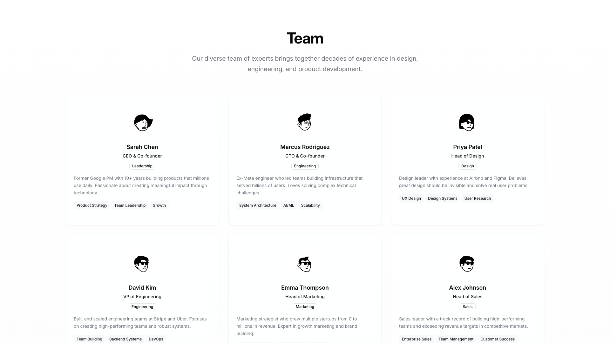

A centered page section displays a main heading with supporting body text at the top. Below this introduction, six team member cards are arranged in two horizontal rows of three columns each. Each card contains a small circular image, a name heading, a job title, a department label, descriptive body text, and multiple skill tags displayed horizontally at the bottom.

**Install**: `pnpm dlx shadcn add @shadcnblocks/team5`

---

## team6

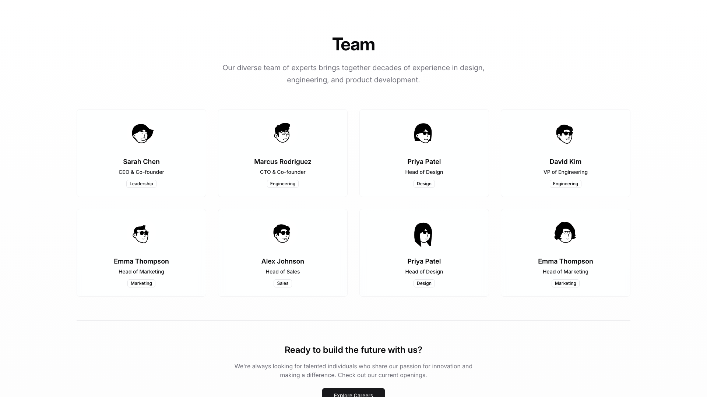

A team section displays a centered heading with descriptive body text. Below, eight team member profiles are arranged in two horizontal rows of four, each containing a small image, name, title, and department label. At the bottom, a centered heading with supporting body text is followed by a button aligned to the center.

**Install**: `pnpm dlx shadcn add @shadcnblocks/team6`

---

## team7

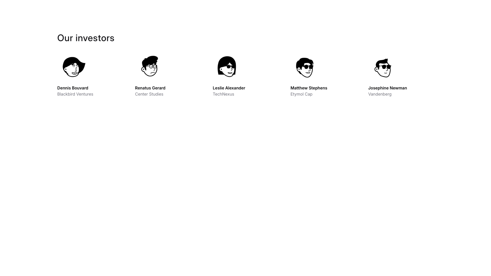

A section displays a heading positioned on the left, followed by five profile cards arranged horizontally below. Each card contains an image centered at the top, with a name label and organization text aligned below it.

**Install**: `pnpm dlx shadcn add @shadcnblocks/team7`

---

## team8

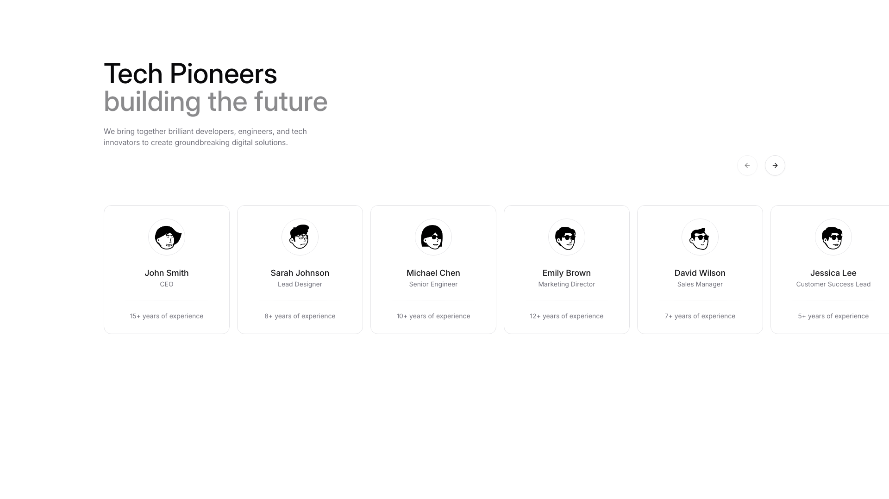

A webpage section displays a main heading and subtitle aligned on the left, followed by body text. Below this, six team member cards are arranged horizontally in a row, each containing an image, a name, a job title label, and experience text centered within the card. Navigation arrows are positioned in the top right corner.

**Install**: `pnpm dlx shadcn add @shadcnblocks/team8`

---

## team9

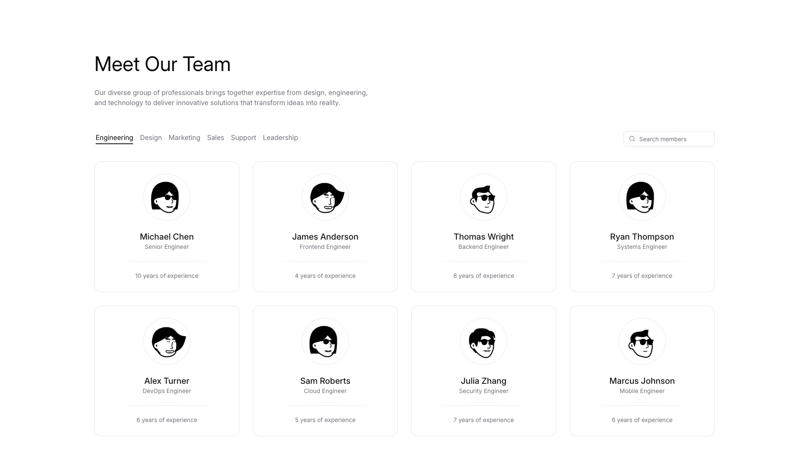

A "Meet Our Team" section displays a heading with descriptive body text at the top left. Below this is a horizontal navigation menu with category filters, and a search bar positioned on the right. The main content area shows a grid of eight team member cards arranged in two rows of four columns. Each card contains a centered image, a name heading, a job title label, and experience text positioned vertically.

**Install**: `pnpm dlx shadcn add @shadcnblocks/team9`

---

## team10

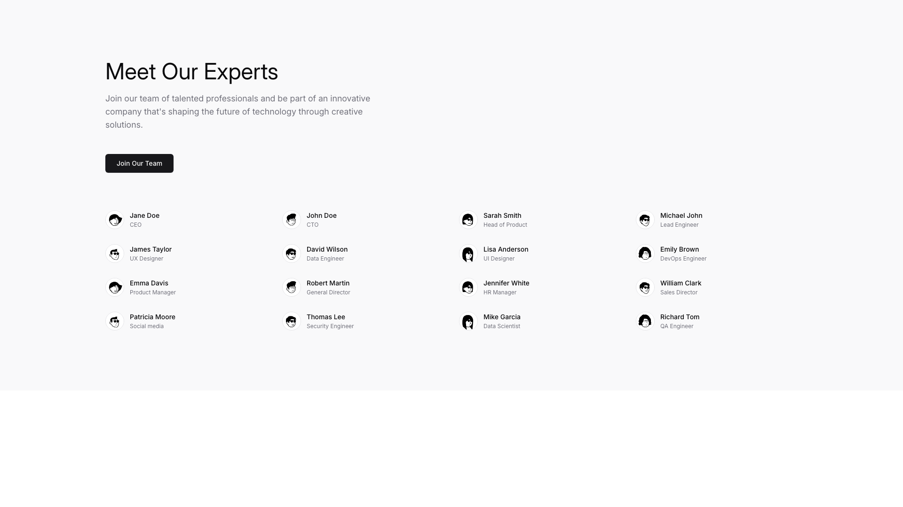

A page section displays a main heading and body text on the left side, followed by a button below. The remainder of the section is organized into four vertically-stacked columns, each containing team member entries arranged horizontally with an image, name, and job title label for each person.

**Install**: `pnpm dlx shadcn add @shadcnblocks/team10`

---

## team12

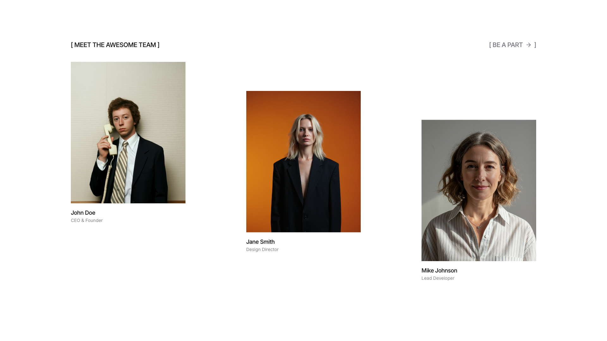

A section titled "Meet the Awesome Team" displays three team member profiles horizontally across the layout. Each profile contains an image positioned above a name label and job title text. Navigation elements appear at the top left and right of the section.

**Install**: `pnpm dlx shadcn add @shadcnblocks/team12`

---

## team13

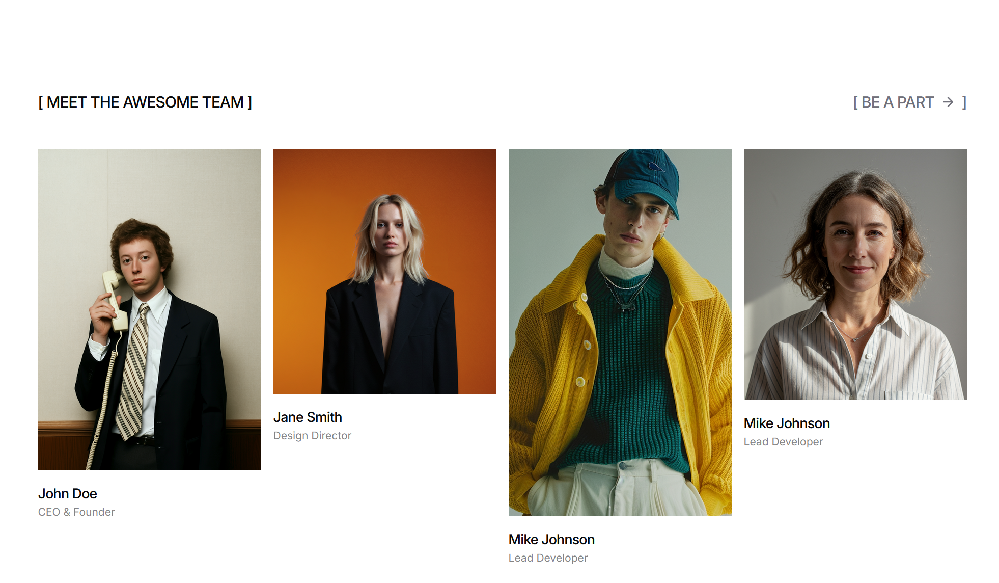

A team section displays four team members in a horizontal layout. Each member is represented by an image positioned above their name and job title label. A section heading appears on the left, with a "call-to-action" link positioned on the right.

**Install**: `pnpm dlx shadcn add @shadcnblocks/team13`

---
