# Testimonial Blocks (28)

Customer reviews and social proof sections. Build trust through authentic user feedback.

---

## testimonial1

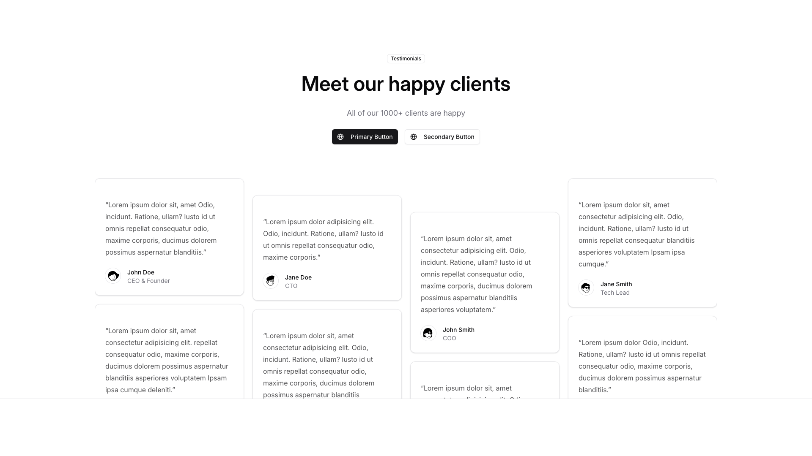

A centered testimonials section displays a small label tag at the top, followed by a large heading and body text. Below this are two horizontally aligned buttons. The main content area features multiple testimonial cards arranged in a grid layout, each containing body text, a small image, and a name with job title attribution at the bottom.

**Install**: `pnpm dlx shadcn add @shadcnblocks/testimonial1`

---

## testimonial2

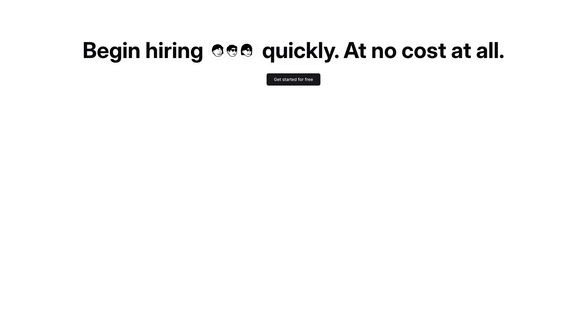

A centered hero section features a main heading with an embedded image icon, followed by body text below. A dark button labeled "Get started for free" is positioned centrally underneath the text.

**Install**: `pnpm dlx shadcn add @shadcnblocks/testimonial2`

---

## testimonial3

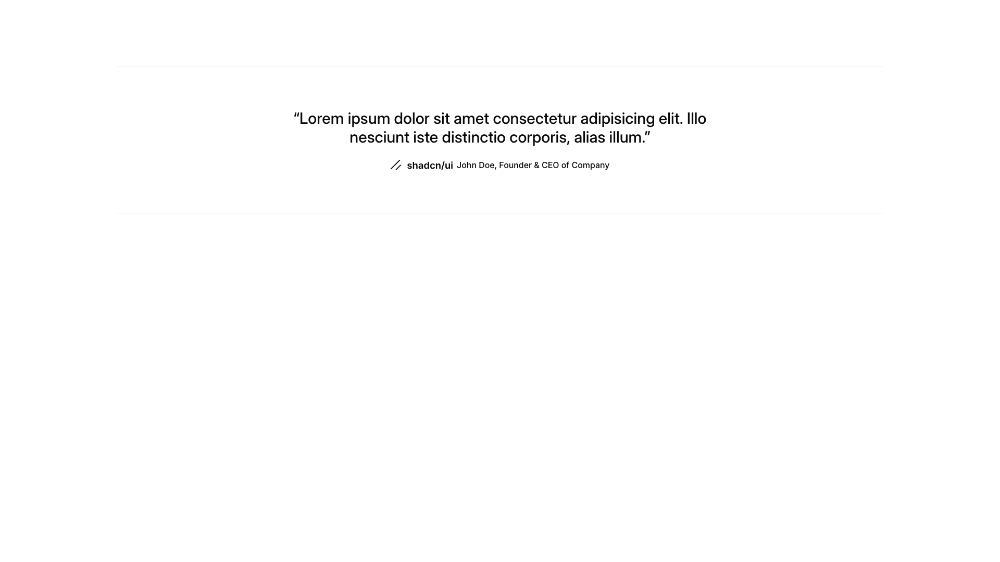

A centered testimonial section displays a block quotation in the middle, followed by an attribution line below containing a small icon on the left, a name, and a title. The entire content is vertically stacked and horizontally centered on the page.

**Install**: `pnpm dlx shadcn add @shadcnblocks/testimonial3`

---

## testimonial4

This section displays customer testimonials in a two-row grid layout. The top row features a single large testimonial card spanning two-thirds width on the right, with an image placeholder on the left. Below, three equal-width testimonial cards are arranged horizontally, each containing body text, a small circular image, and a name label with a subtitle.

**Install**: `pnpm dlx shadcn add @shadcnblocks/testimonial4`

---

## testimonial6

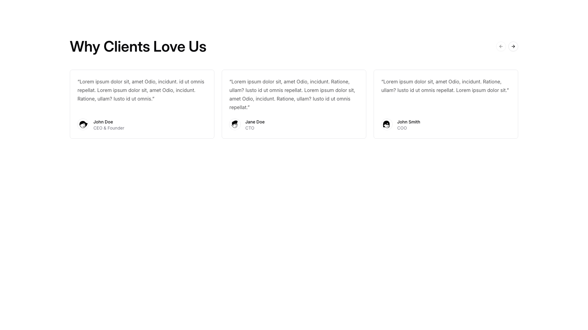

A testimonials section displays a heading at the top left, followed by three equally-sized cards arranged horizontally. Each card contains body text, an image, a name label, and a title label positioned vertically. Navigation arrows are positioned in the top right corner.

**Install**: `pnpm dlx shadcn add @shadcnblocks/testimonial6`

---

## testimonial7

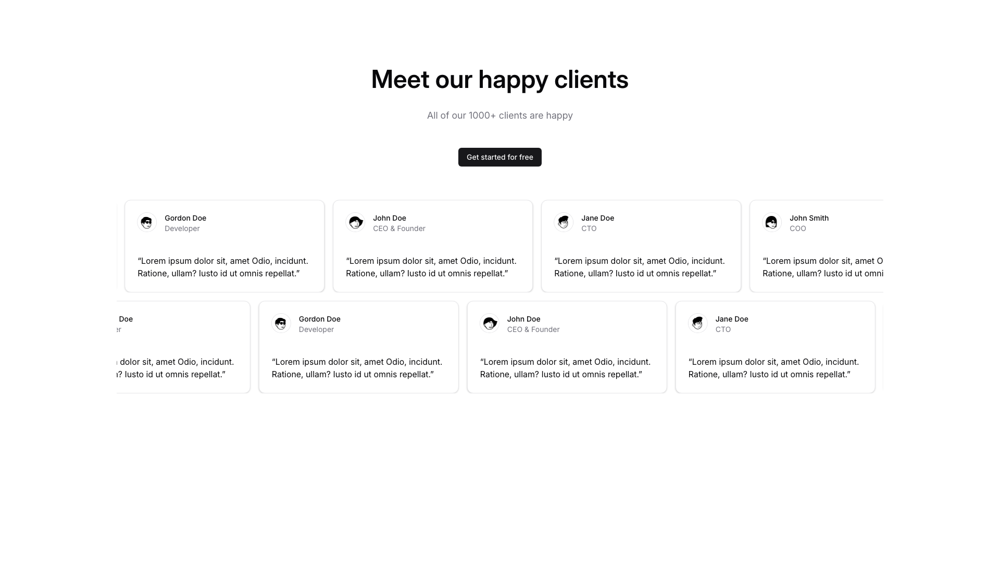

A webpage section displays a centered heading with supporting body text and a call-to-action button. Below this, testimonial cards are arranged in a grid layout with multiple rows and columns, each containing an avatar image, a name label, a job title, and quoted body text.

**Install**: `pnpm dlx shadcn add @shadcnblocks/testimonial7`

---

## testimonial8

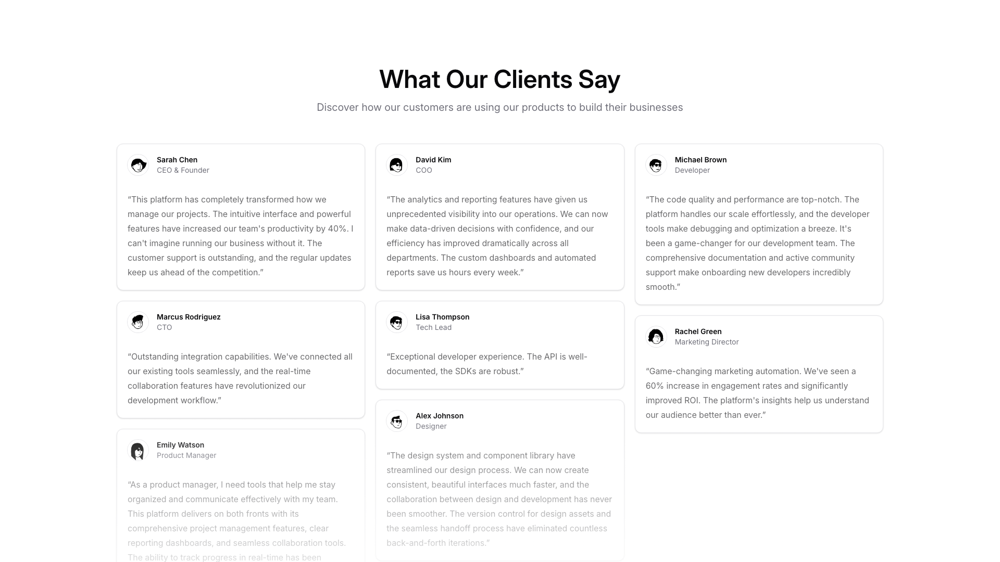

A testimonial section displays a centered heading with subheading text at the top. Below, customer testimonials are arranged in a grid layout with multiple cards positioned horizontally and vertically. Each card contains a small image on the left, followed by a name label, title label, and body text to the right.

**Install**: `pnpm dlx shadcn add @shadcnblocks/testimonial8`

---

## testimonial9

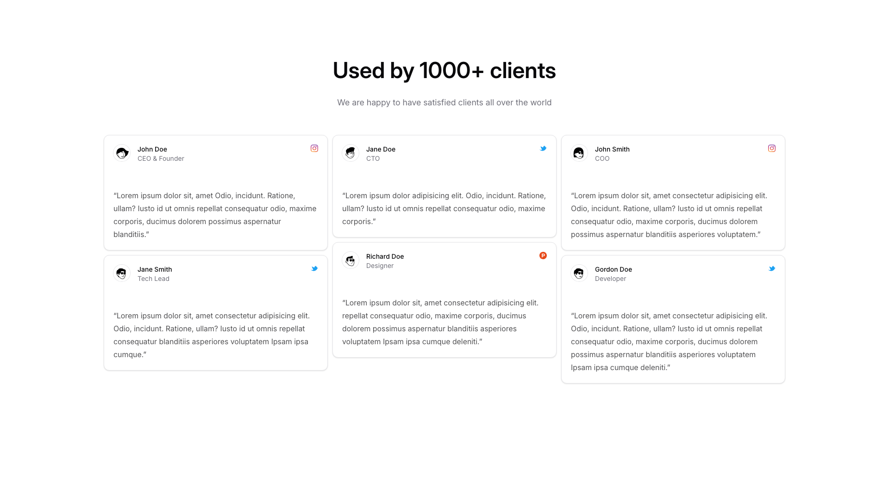

A testimonials section displays a centered heading at the top with supporting body text below it. Six client testimonial cards are arranged in a grid layout with three columns and two rows. Each card contains a small circular image on the left, followed by a name, job title, and social media icon in the header area, with body text testimonial content positioned below.

**Install**: `pnpm dlx shadcn add @shadcnblocks/testimonial9`

---

## testimonial10

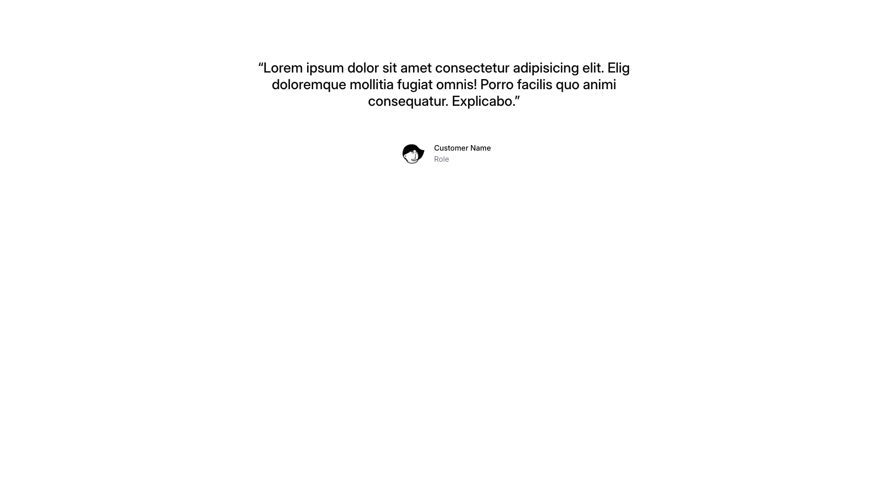

A testimonial section features a centered layout with body text positioned at the top. Below the quote, a small circular image is placed on the left, accompanied by a customer name and role label positioned to the right of the image.

**Install**: `pnpm dlx shadcn add @shadcnblocks/testimonial10`

---

## testimonial11

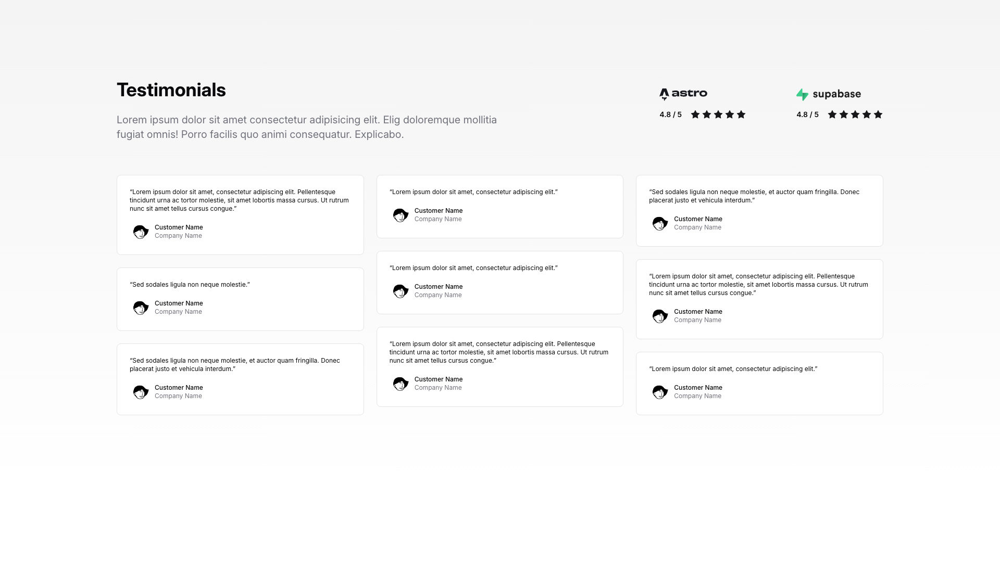

A testimonials section features a left-aligned heading and descriptive body text at the top. Below this, testimonial cards are arranged in a three-column grid layout, each containing a body text quote, a customer avatar image, and customer name/company information. In the upper right, two platform badges display ratings with star icons and numerical scores.

**Install**: `pnpm dlx shadcn add @shadcnblocks/testimonial11`

---

## testimonial12

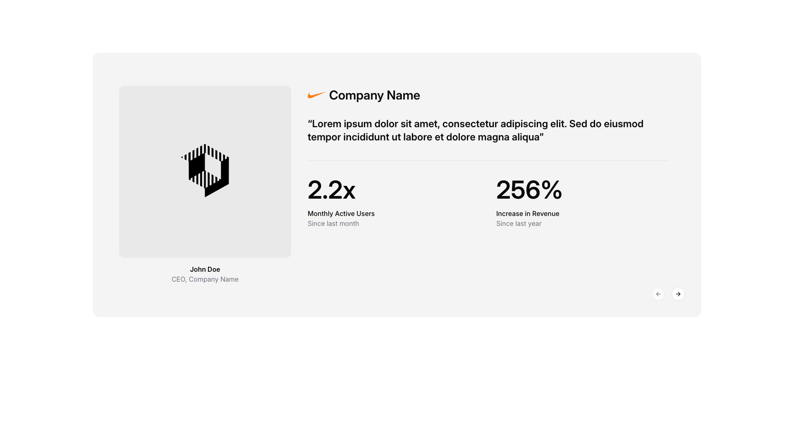

A horizontal layout displays content in two main sections. On the left is an image positioned above a name and title. On the right, a heading with an icon is followed by body text, then two metric blocks arranged horizontally showing large numbers with descriptive labels beneath them. Navigation arrows appear at the bottom right.

**Install**: `pnpm dlx shadcn add @shadcnblocks/testimonial12`

---

## testimonial13

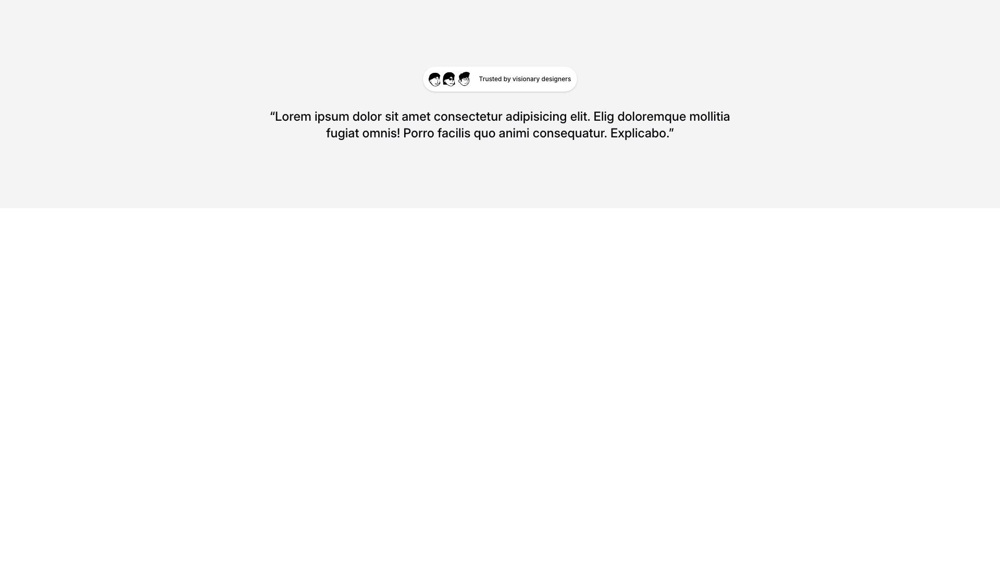

A centered testimonial section featuring three small images horizontally aligned at the top, with a label reading "Trusted by visionary designers" positioned above them. Below this, a block of body text is centered on the page, enclosed in quotation marks.

**Install**: `pnpm dlx shadcn add @shadcnblocks/testimonial13`

---

## testimonial14

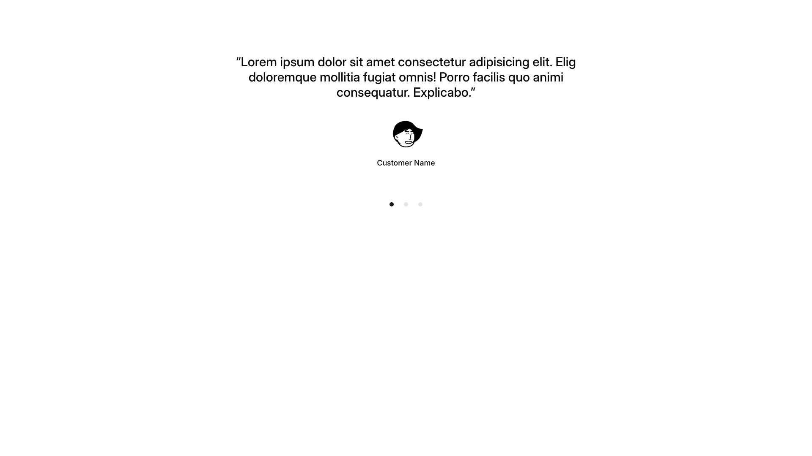

A centered testimonial section displays a quote at the top in body text. Below the quote, there is a small circular image centered, followed by a customer name label. At the bottom, three navigation dots are horizontally aligned and centered to indicate multiple testimonial slides.

**Install**: `pnpm dlx shadcn add @shadcnblocks/testimonial14`

---

## testimonial15

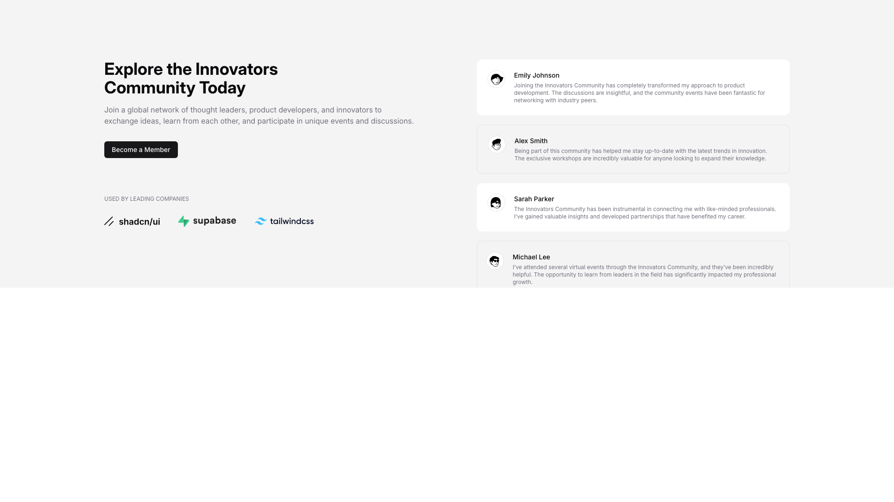

A two-column layout divides the page vertically. The left column contains a heading, body text, a button, a label, and three company logos arranged horizontally. The right column displays four vertically stacked testimonial cards, each featuring a small image, a name, and body text.

**Install**: `pnpm dlx shadcn add @shadcnblocks/testimonial15`

---

## testimonial16

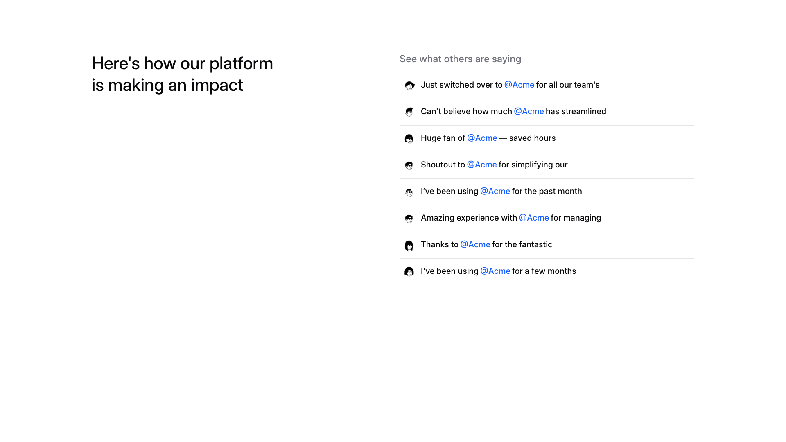

A two-column layout displays content side-by-side. The left column contains a large heading. The right column features a subheading at the top, followed by a vertically-stacked list of testimonial snippets, each prefaced with a small avatar image and tagged mentions.

**Install**: `pnpm dlx shadcn add @shadcnblocks/testimonial16`

---

## testimonial17

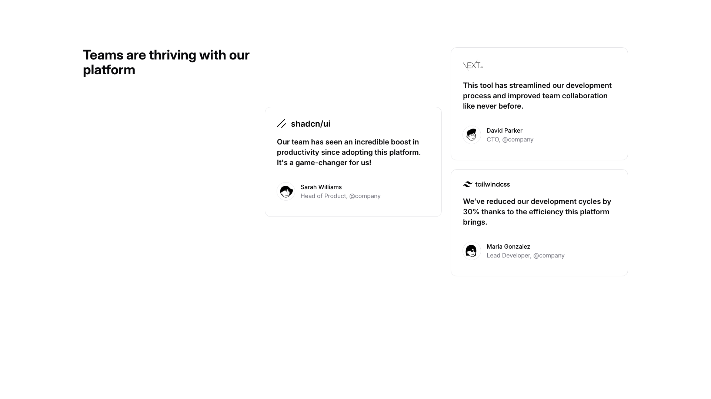

A testimonials section displays content in two columns. On the left, a main heading is followed by a single testimonial card containing body text, a company logo, a name, and a job title. On the right, three additional testimonial cards are stacked vertically, each with a company logo, body text, a name, and a job title.

**Install**: `pnpm dlx shadcn add @shadcnblocks/testimonial17`

---

## testimonial18

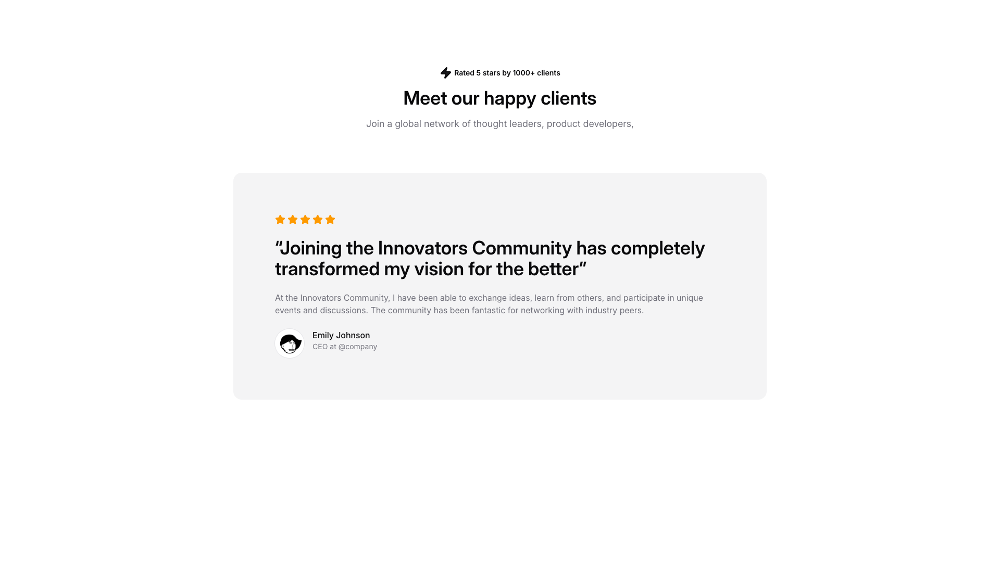

A centered testimonial section displays vertically stacked content. At the top is a heading with supporting body text, followed by a star rating. Below that is a large quote, additional body text, and an image with accompanying name and title label at the bottom.

**Install**: `pnpm dlx shadcn add @shadcnblocks/testimonial18`

---

## testimonial19

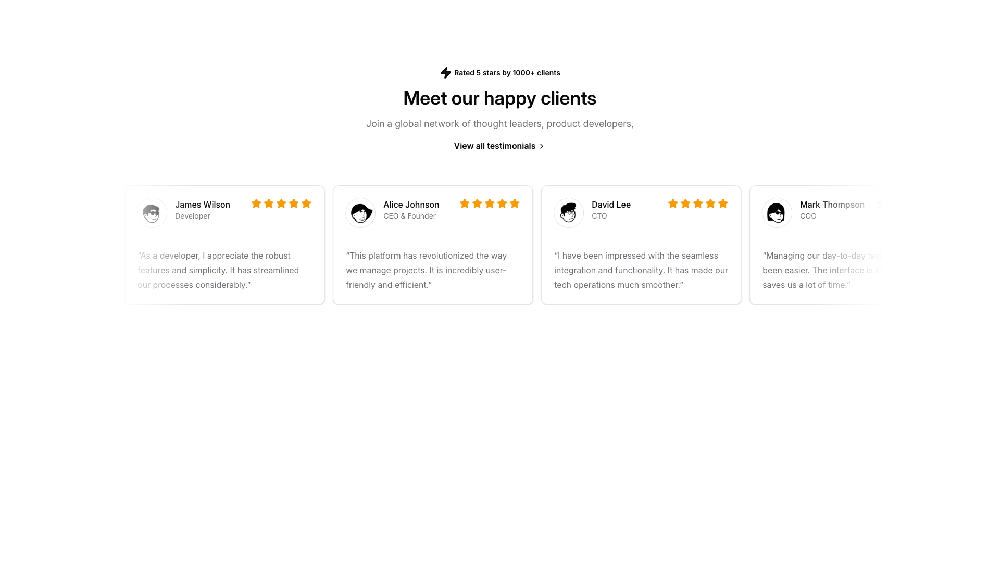

A testimonials section displays a centered heading with supporting body text at the top. Below, four client testimonial cards are arranged horizontally in a row, each containing an avatar image on the left, a name and job title above a five-star rating, and testimonial text below. A "View all testimonials" link is positioned centrally beneath the heading.

**Install**: `pnpm dlx shadcn add @shadcnblocks/testimonial19`

---

## testimonial20

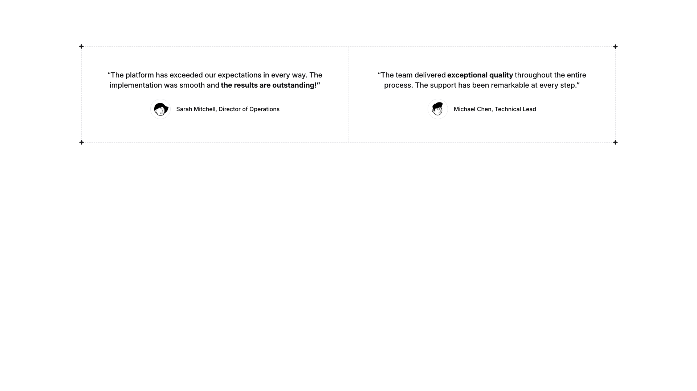

A testimonial section displays two customer quotes horizontally across the width. Each quote contains body text at the top, followed by an avatar image and the speaker's name and title positioned below. The layout uses a two-column structure with quotes evenly spaced and aligned vertically.

**Install**: `pnpm dlx shadcn add @shadcnblocks/testimonial20`

---

## testimonial21

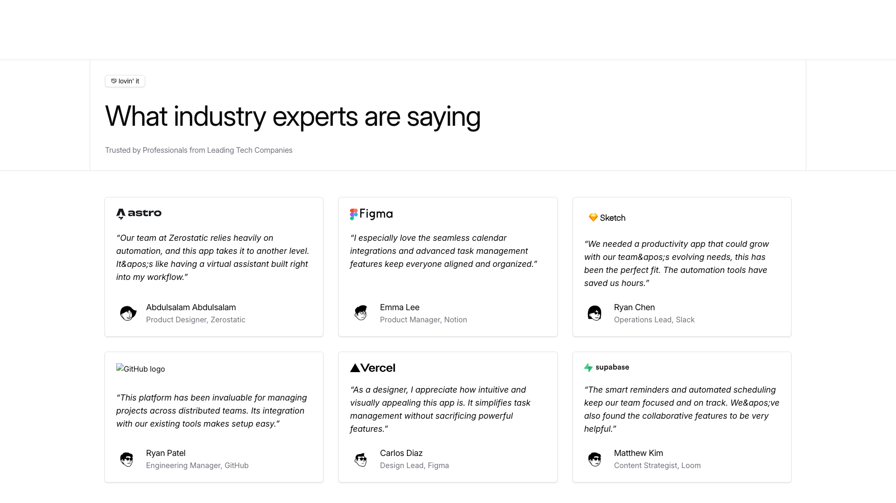

A centered section displays a main heading with a subtitle, followed by a grid of six testimonial cards arranged in three columns and two rows. Each card contains a company logo at the top, a quoted testimonial in body text, and the speaker's name with their job title and company affiliation positioned at the bottom.

**Install**: `pnpm dlx shadcn add @shadcnblocks/testimonial21`

---

## testimonial23

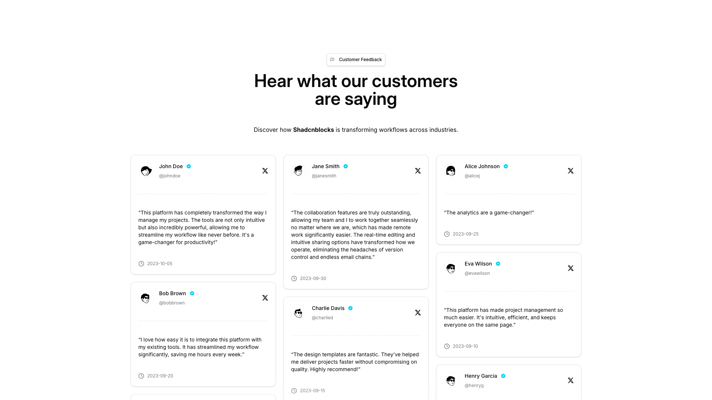

A centered heading and subheading introduce the section at the top. Below, customer testimonials are arranged in a three-column grid layout, with each card containing a user profile image and name on the left, followed by a quoted body text and timestamp. An "X" close button is positioned in the top right corner of each card.

**Install**: `pnpm dlx shadcn add @shadcnblocks/testimonial23`

---

## testimonial24

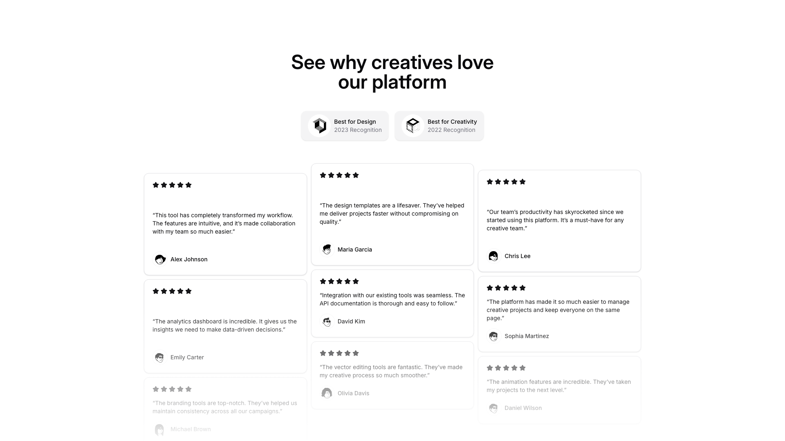

A testimonials section features a centered heading at the top, followed by two recognition badges displayed horizontally below it. The main content area is organized in a three-column grid layout, with individual testimonial cards vertically stacked within each column. Each card contains a star rating, body text, and a user profile with an image and name positioned at the bottom.

**Install**: `pnpm dlx shadcn add @shadcnblocks/testimonial24`

---

## testimonial25

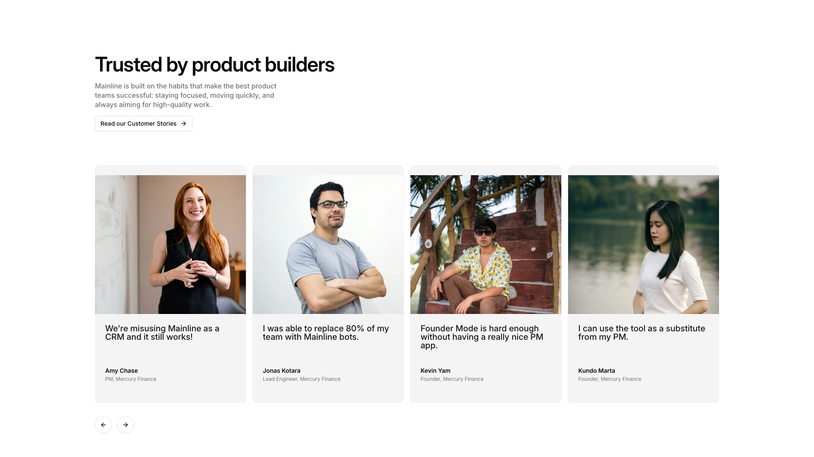

A testimonial section features a heading and descriptive body text positioned at the top left, followed by a "Read our Customer Stories" button. Below, four customer testimonials are arranged horizontally in equal-width columns, each containing an image stacked above a quote, customer name, and job title. Navigation arrows appear centered at the bottom to scroll through additional testimonials.

**Install**: `pnpm dlx shadcn add @shadcnblocks/testimonial25`

---

## testimonial26

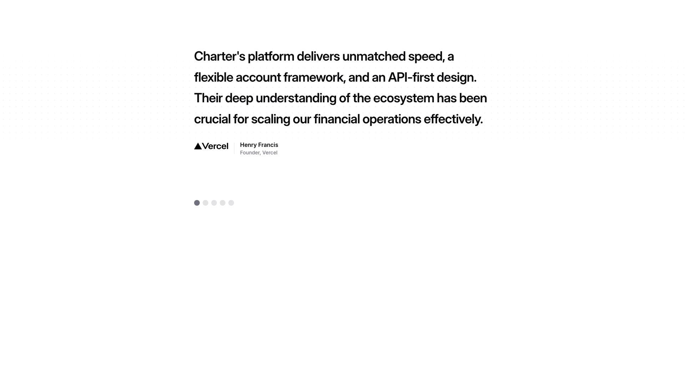

A testimonial section displays centered text content vertically aligned. At the top, a multi-line heading and body text are stacked. Below the text, a company logo and attribution with a person's name and title are positioned on the left. At the bottom, a row of five circular navigation dots is centered, with the first dot highlighted as the active indicator.

**Install**: `pnpm dlx shadcn add @shadcnblocks/testimonial26`

---

## testimonial27

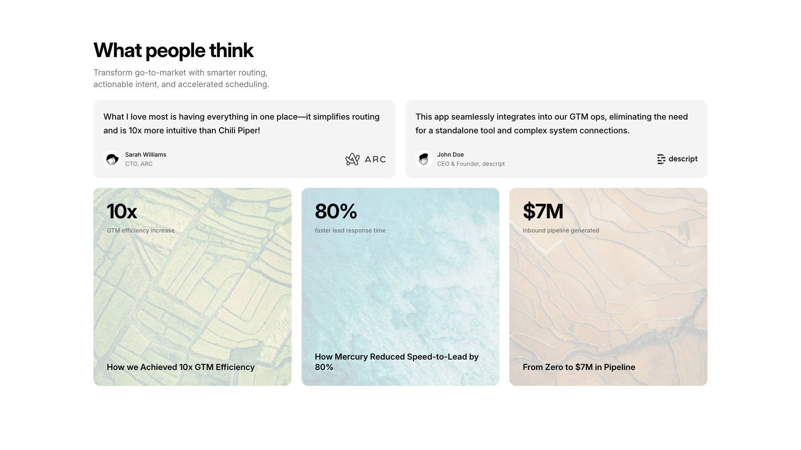

A section displays a main heading at the top, followed by body text. Below this, two testimonial cards are positioned horizontally, each containing body text, a user avatar, name, title, and a company logo. Underneath, three equal-width cards are arranged horizontally, each featuring a large number or currency value, a label, and descriptive text overlaid on an image background.

**Install**: `pnpm dlx shadcn add @shadcnblocks/testimonial27`

---

## testimonial28

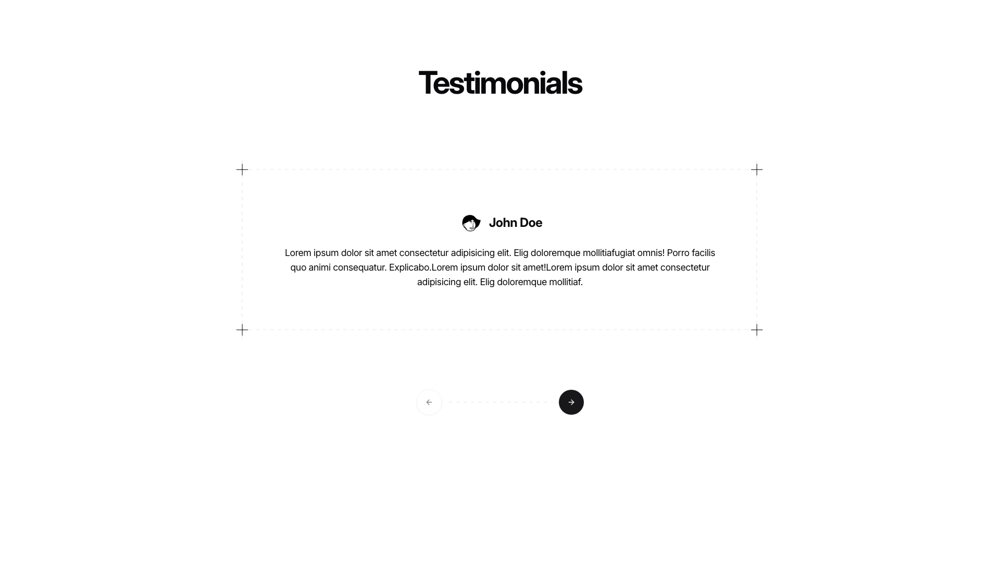

A testimonials section with a centered heading at the top. Below, a single testimonial card is displayed centrally, containing an avatar image on the left, a name label, and body text. Navigation arrows are positioned at the bottom center, allowing horizontal scrolling between testimonials.

**Install**: `pnpm dlx shadcn add @shadcnblocks/testimonial28`

---

## testimonial29

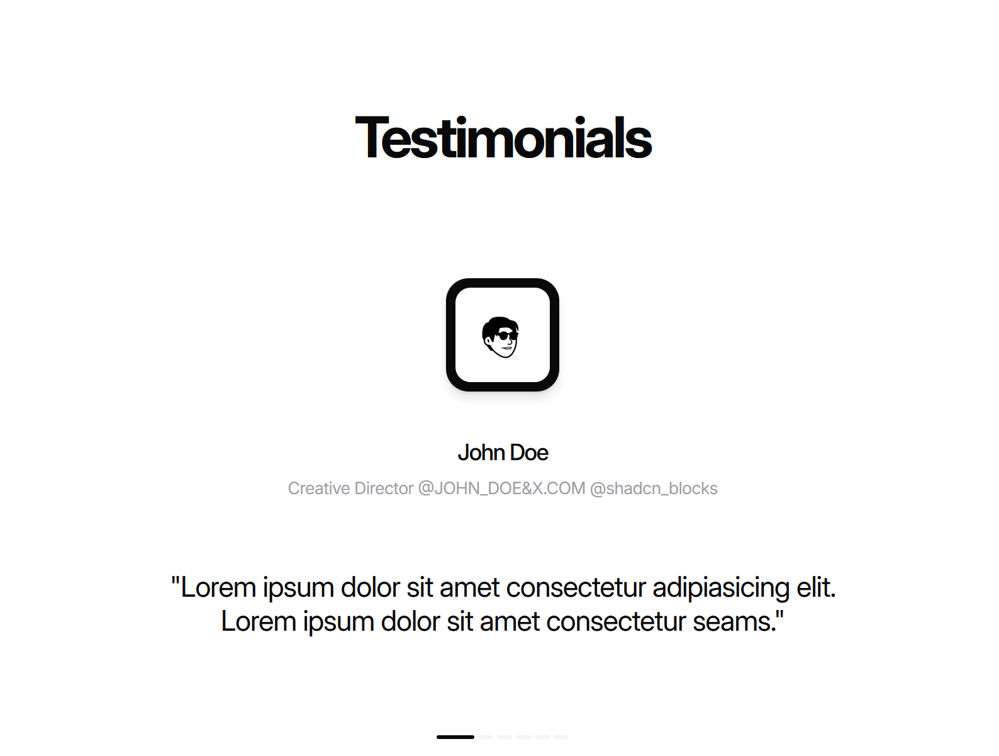

A centered testimonials section displays vertically stacked content. At the top is a heading, followed by an image, a name label, and a subtitle with contact information. Below this is quoted body text, with a navigation indicator at the bottom.

**Install**: `pnpm dlx shadcn add @shadcnblocks/testimonial29`

---

## testimonial30

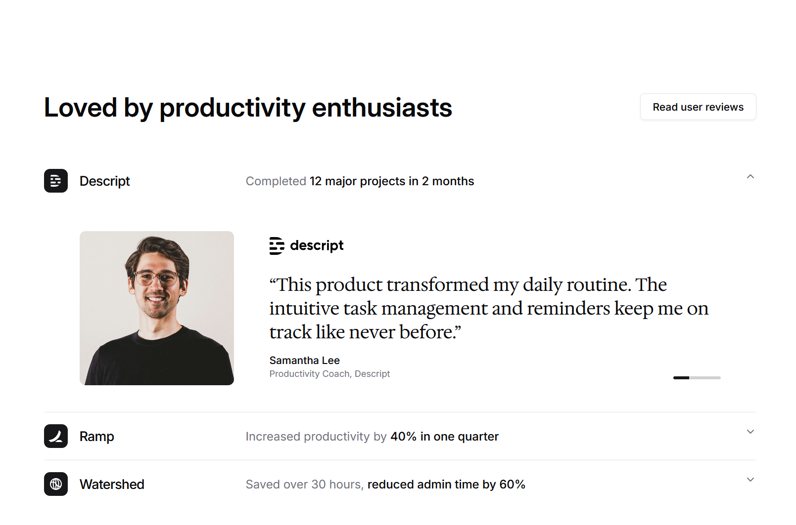

A webpage section features a main heading at the top, followed by three collapsible cards arranged vertically. Each card contains an icon on the left, a title, and descriptive text on the right. The first card includes an image on the left side with a testimonial quote and attribution positioned to the right. A "Read user reviews" button appears in the top right corner of the section.

**Install**: `pnpm dlx shadcn add @shadcnblocks/testimonial30`

---
