# Timeline Blocks (13)

Timeline layouts for chronological information. Display events, milestones, and historical data.

---

## timeline1

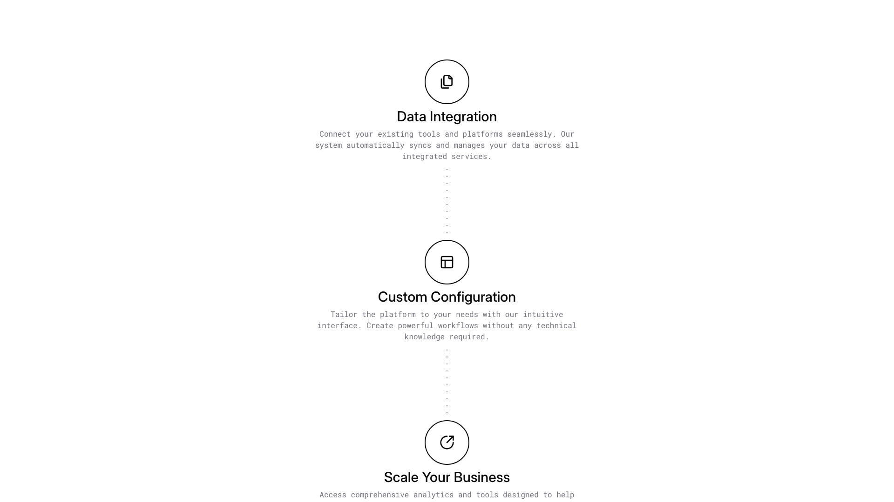

A vertically stacked layout with three centered sections, each containing an icon, heading, and descriptive body text. The sections are connected by a dotted vertical line, with even spacing between each element. All text is center-aligned and positioned below its corresponding icon.

**Install**: `pnpm dlx shadcn add @shadcnblocks/timeline1`

---

## timeline2

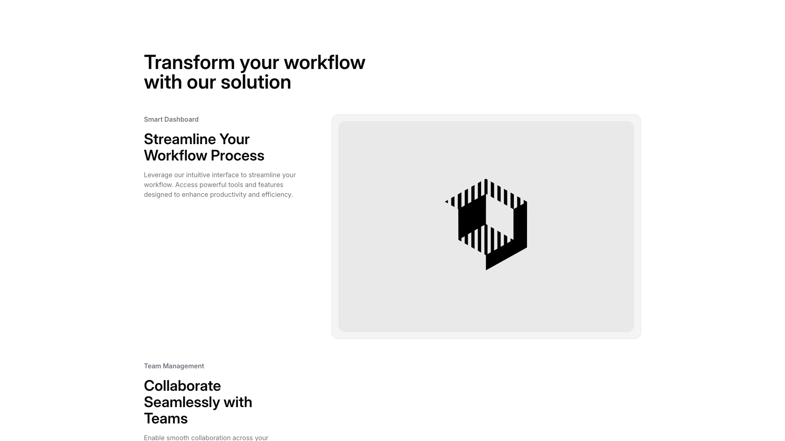

A two-column layout with text content on the left and a large image on the right. The left column contains a small label at the top, followed by a main heading, body text, and another label with a secondary heading and descriptive text positioned lower. The right side features a centered image occupying the majority of the space.

**Install**: `pnpm dlx shadcn add @shadcnblocks/timeline2`

---

## timeline3

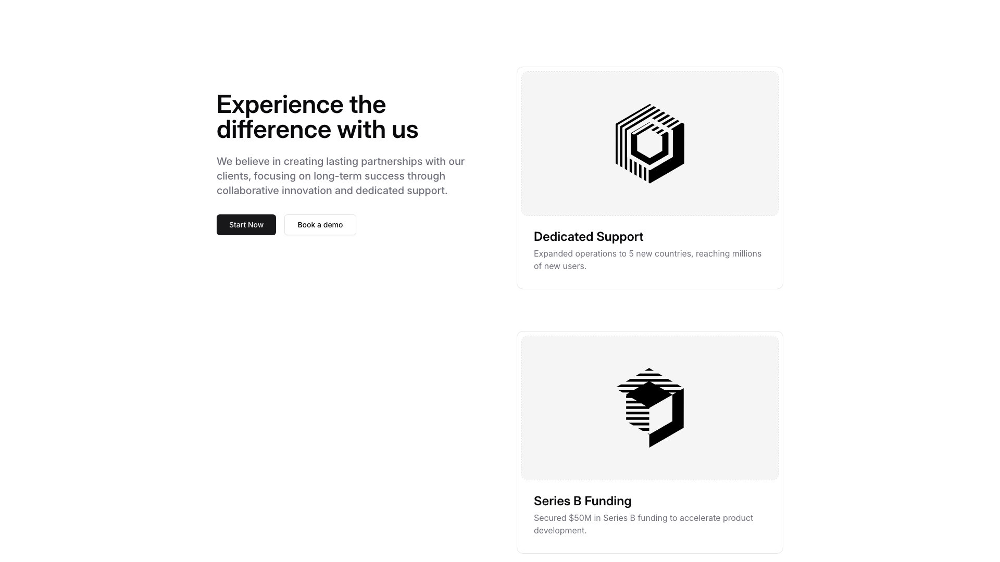

A webpage section is divided into two columns with left and right layouts. On the left, a large heading is positioned at the top, followed by body text and two buttons arranged horizontally. On the right, two cards are stacked vertically, each containing an image at the top, a subheading, and descriptive body text below.

**Install**: `pnpm dlx shadcn add @shadcnblocks/timeline3`

---

## timeline4

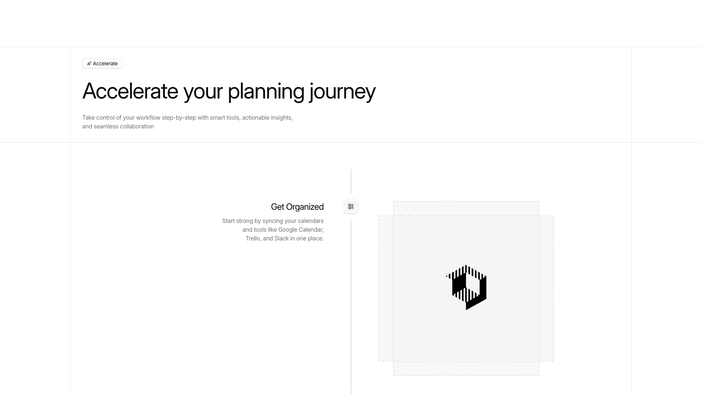

A webpage section displays content in two columns with a vertical divider. The left column contains a tag, a large heading, body text, and a smaller section with a label, subheading, and descriptive text. The right column features a centered image on a light textured background.

**Install**: `pnpm dlx shadcn add @shadcnblocks/timeline4`

---

## timeline5

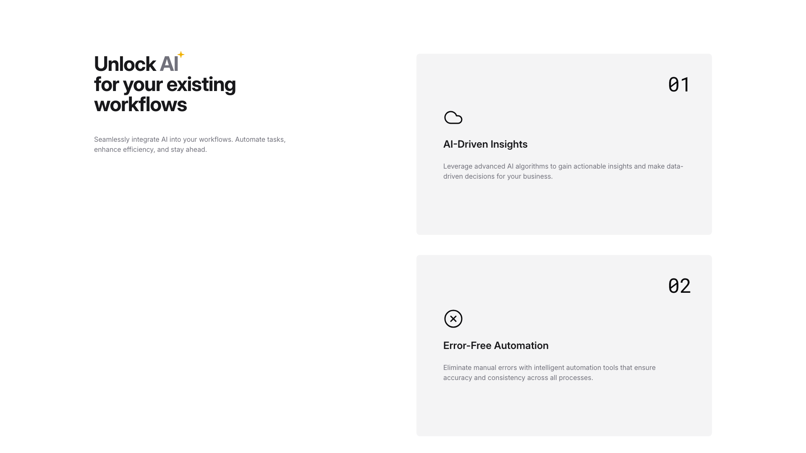

A two-column layout with content vertically stacked on the left and right sides. The left column contains a main heading, subheading text, and descriptive body text. The right column displays two numbered feature cards (01 and 02) stacked vertically, each containing an icon, a title, and descriptive text below.

**Install**: `pnpm dlx shadcn add @shadcnblocks/timeline5`

---

## timeline6

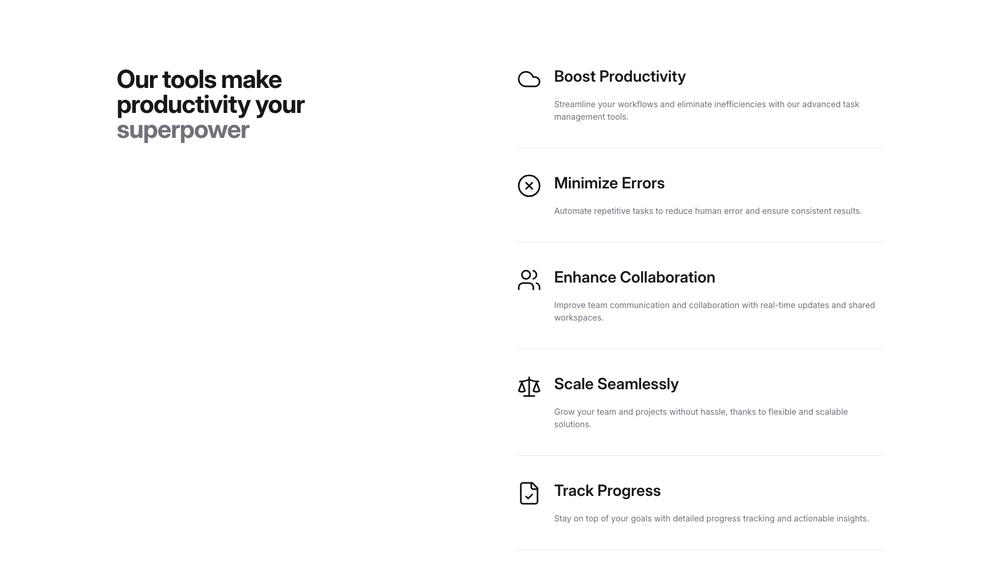

A two-column layout displays content vertically. The left column contains a large heading aligned to the left. The right column presents five feature sections stacked vertically, each with an icon on the left, a bold title, and descriptive body text below.

**Install**: `pnpm dlx shadcn add @shadcnblocks/timeline6`

---

## timeline7

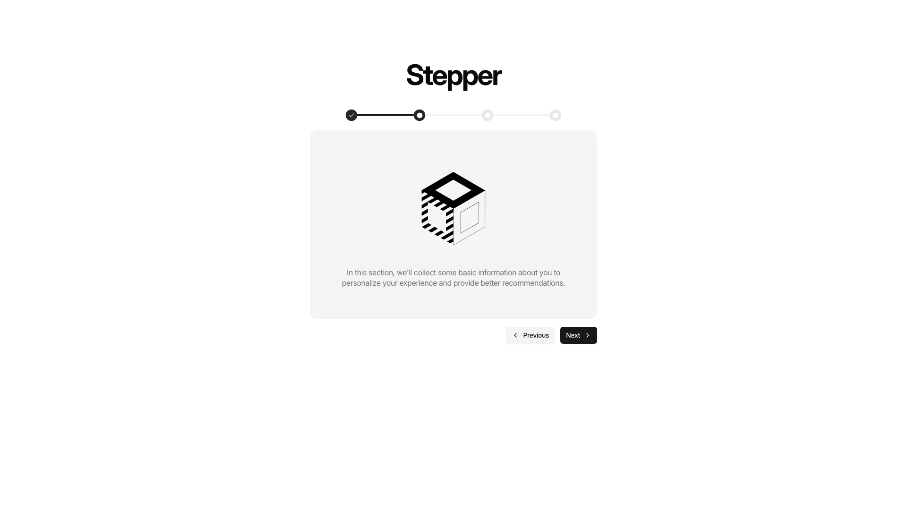

A centered card layout displays a heading at the top, followed by a progress indicator with four circular steps horizontally aligned. Below this sits a large image centered within the card, with descriptive body text positioned underneath. At the bottom, two navigation buttons are aligned to the right—a "Previous" button and a "Next" button.

**Install**: `pnpm dlx shadcn add @shadcnblocks/timeline7`

---

## timeline8

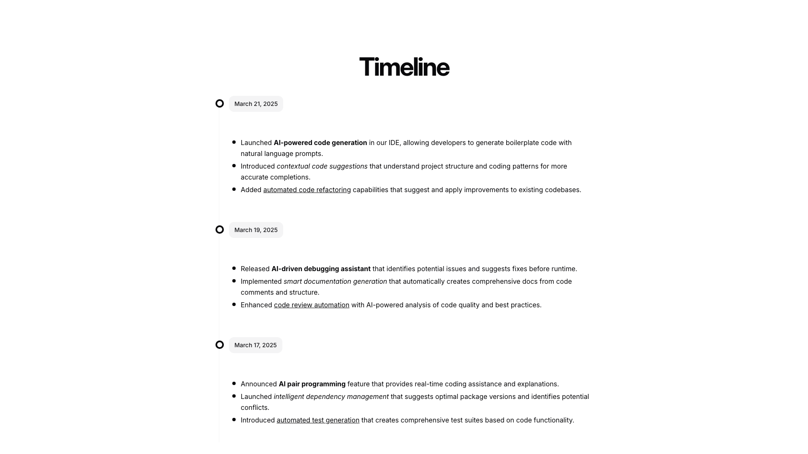

A centered timeline section displays three dated entries arranged vertically. Each entry begins with a circular marker on the left, followed by a date label and a series of bulleted body text items positioned to the right. The timeline progresses chronologically from bottom to top, with the most recent date at the top.

**Install**: `pnpm dlx shadcn add @shadcnblocks/timeline8`

---

## timeline9

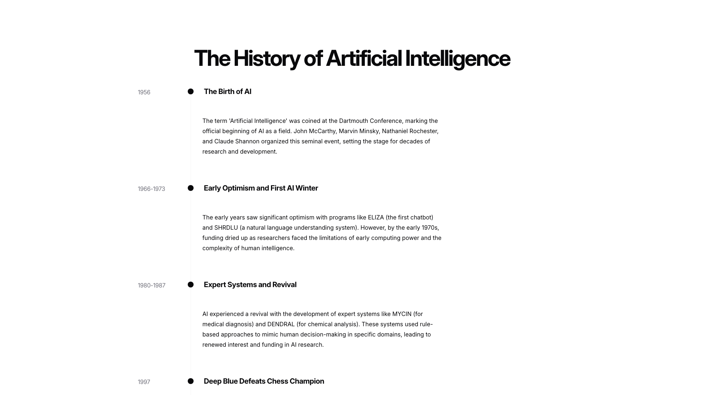

A vertical timeline layout displays a main heading centered at the top, followed by four chronological entries stacked vertically. Each entry consists of a year or date range positioned on the left, a bullet point marker, a bold section title, and body text aligned to the right. The content flows from top to bottom, with consistent spacing between each timeline milestone.

**Install**: `pnpm dlx shadcn add @shadcnblocks/timeline9`

---

## timeline10

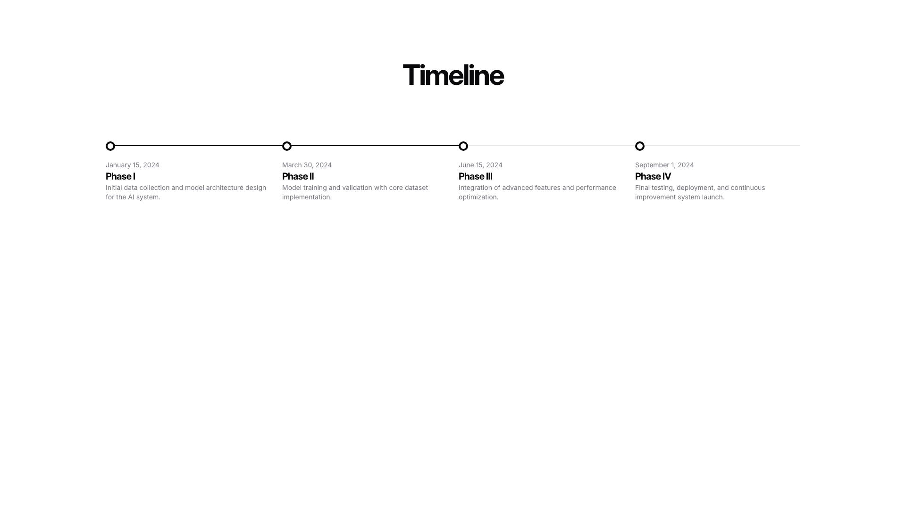

A timeline section displays a centered heading at the top. Below, four milestone points are arranged horizontally across the page, each marked with a circle node. Each milestone contains a date label, a bold phase title, and descriptive body text positioned beneath the timeline nodes.

**Install**: `pnpm dlx shadcn add @shadcnblocks/timeline10`

---

## timeline11

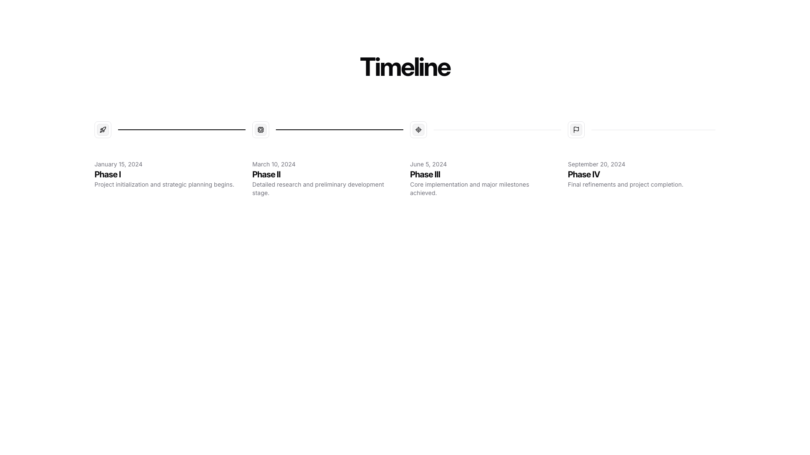

A centered timeline section displays four phases horizontally across the page. Each phase marker is connected by a horizontal line and includes a date label, a phase heading, and descriptive body text positioned below. The phases progress from left to right, with the earliest date on the left and the latest on the right.

**Install**: `pnpm dlx shadcn add @shadcnblocks/timeline11`

---

## timeline12

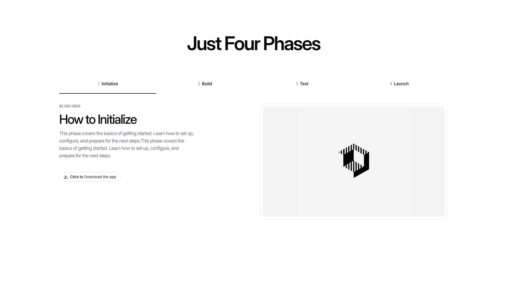

A webpage section is divided into two columns. The left column contains a date label, a main heading, descriptive body text, and a button aligned to the left. The right column displays a large image centered within a light bordered container. Above both columns, a horizontal navigation bar with four phase labels spans the full width.

**Install**: `pnpm dlx shadcn add @shadcnblocks/timeline12`

---

## timeline13

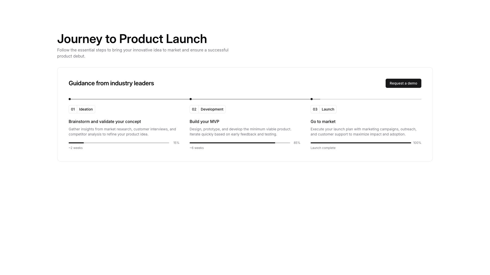

A webpage section features a main heading at the top with descriptive body text below it. The content is organized horizontally into three stages, each containing a stage number, title, descriptive text, duration, and a progress bar. A "Request a demo" button is positioned in the top right corner of the section.

**Install**: `pnpm dlx shadcn add @shadcnblocks/timeline13`

---
